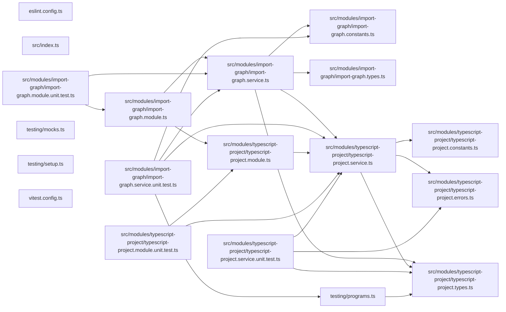

## Test

```bash
nx run codependix-imports:vitest
```

## 🕸️ Codependix

Dependency graphs exported by [codependix](https://github.com/JimmyPaolini/codebase/tree/main/packages/codependix-cli), regenerated by `nx run codebase:codependix:write`.

### Nx Neighborhood

<!-- codependix:start name="codependix-nx" -->

<!-- codependix:end name="codependix-nx" -->

### NestJS Module Graph

<!-- codependix:start name="codependix-nestjs" -->

<!-- codependix:end name="codependix-nestjs" -->

### File Imports

<!-- codependix:start name="codependix-imports" -->

<!-- codependix:end name="codependix-imports" -->

<!-- CALL_STACKS_START -->

## 🔭 Callidescope

Call stacks traced through `codependix-imports`, deepest first. Each frame shows what it takes, what it returns, and what its documentation says.

| Measure | Value |
| --- | --- |
| Callables | 34 |
| Files | 12 |
| Calls traced | 28 |
| Call stacks | 2 |
| Deepest stack | 3 |
| Stacks through recursion | 0 |
| Unfollowable calls | 1 |

### Call stacks (depth)

**1. `ImportGraphService.collectEdgesForFile`** — depth 3 · orphan-root

```text
🚀 ImportGraphService.collectEdgesForFile(…): ImportGraphEdge[] [packages/codependix-imports/src/modules/import-graph/import-graph.service.ts:47]
   ↳ Collects every internal import edge one source file declares.
  └─> ImportGraphService.resolveImportTarget(…): string | undefined [packages/codependix-imports/src/modules/import-graph/import-graph.service.ts:132]
     ↳ Resolves an import specifier to a real, absolute file path.
    └─> TypescriptProjectService.toRealPath(filePath: string): string [packages/codependix-imports/src/modules/typescript-project/typescript-project.service.ts:120]
       ↳ Resolves a path through symlinks, which is how pnpm workspaces link.
```

**2. `ImportGraphService.renderNode`** — depth 2 · orphan-root

```text
🚀 ImportGraphService.renderNode(fileName: string): string [packages/codependix-imports/src/modules/import-graph/import-graph.service.ts:127]
   ↳ Renders one file as a mermaid node, labelled with its relative path.
  └─> ImportGraphService.toNodeIdentifier(fileName: string): string [packages/codependix-imports/src/modules/import-graph/import-graph.service.ts:163]
     ↳ Turns a relative file path into an identifier mermaid accepts.
```

### Module spread

None.

### Breadth

| Callable | Breadth | Calls directly | Location |
| --- | --- | --- | --- |
| `ImportGraphService.buildGraph` | 8 | `ImportGraphService.resolveOwnedFileNames`, `ImportGraphService.listOwnedSourceFileNames`, `ImportGraphService.dedupeEdges`, `ImportGraphService.flatMap(…)`, `ImportGraphService.flatMap(…)`, `ImportGraphService.toSorted(…)`, `ImportGraphService.map(…)`, `ImportGraphService.filter(…)` | `packages/codependix-imports/src/modules/import-graph/import-graph.service.ts:181` |
| `TypescriptProjectService.parseConfiguration` | 3 | `TypescriptProjectService.readJsonConfigFile(…)`, `TypescriptProjectConfigurationError.constructor`, `TypescriptProjectService.map(…)` | `packages/codependix-imports/src/modules/typescript-project/typescript-project.service.ts:49` |
| `ImportGraphService.listOwnedSourceFileNames` | 3 | `ImportGraphService.toSorted(…)`, `ImportGraphService.filter(…)`, `ImportGraphService.resolveOwnedFileNames` | `packages/codependix-imports/src/modules/import-graph/import-graph.service.ts:118` |

<details>
<summary>9 more callables</summary>

| Callable | Breadth | Calls directly | Location |
| --- | --- | --- | --- |
| `TypescriptProjectService.discoverProjects` | 2 | `TypescriptProjectService.map(…)`, `TypescriptProjectService.filter(…)` | `packages/codependix-imports/src/modules/typescript-project/typescript-project.service.ts:105` |
| `ImportGraphService.collectEdgesForFile` | 2 | `ImportGraphService.resolveImportTarget`, `ImportGraphService.toRelativePath` | `packages/codependix-imports/src/modules/import-graph/import-graph.service.ts:47` |
| `ImportGraphService.renderMermaid` | 2 | `ImportGraphService.map(…)`, `ImportGraphService.map(…)` | `packages/codependix-imports/src/modules/import-graph/import-graph.service.ts:211` |
| `TypescriptProjectService.buildProgram` | 1 | `TypescriptProjectService.parseConfiguration` | `packages/codependix-imports/src/modules/typescript-project/typescript-project.service.ts:76` |
| `ImportGraphService.dedupeEdges` | 1 | `ImportGraphService.toSorted(…)` | `packages/codependix-imports/src/modules/import-graph/import-graph.service.ts:98` |
| `ImportGraphService.renderNode` | 1 | `ImportGraphService.toNodeIdentifier` | `packages/codependix-imports/src/modules/import-graph/import-graph.service.ts:127` |
| `ImportGraphService.resolveImportTarget` | 1 | `TypescriptProjectService.toRealPath` | `packages/codependix-imports/src/modules/import-graph/import-graph.service.ts:132` |
| `ImportGraphService.resolveOwnedFileNames` | 1 | `ImportGraphService.map(…)` | `packages/codependix-imports/src/modules/import-graph/import-graph.service.ts:152` |
| `ImportGraphService.map(…)` | 1 | `ImportGraphService.toNodeIdentifier` | `packages/codependix-imports/src/modules/import-graph/import-graph.service.ts:221` |

</details>

### Possibly misplaced

None.
<!-- CALL_STACKS_END -->
