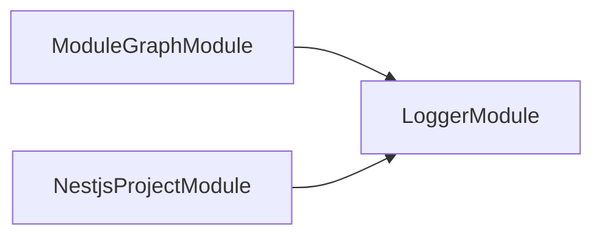
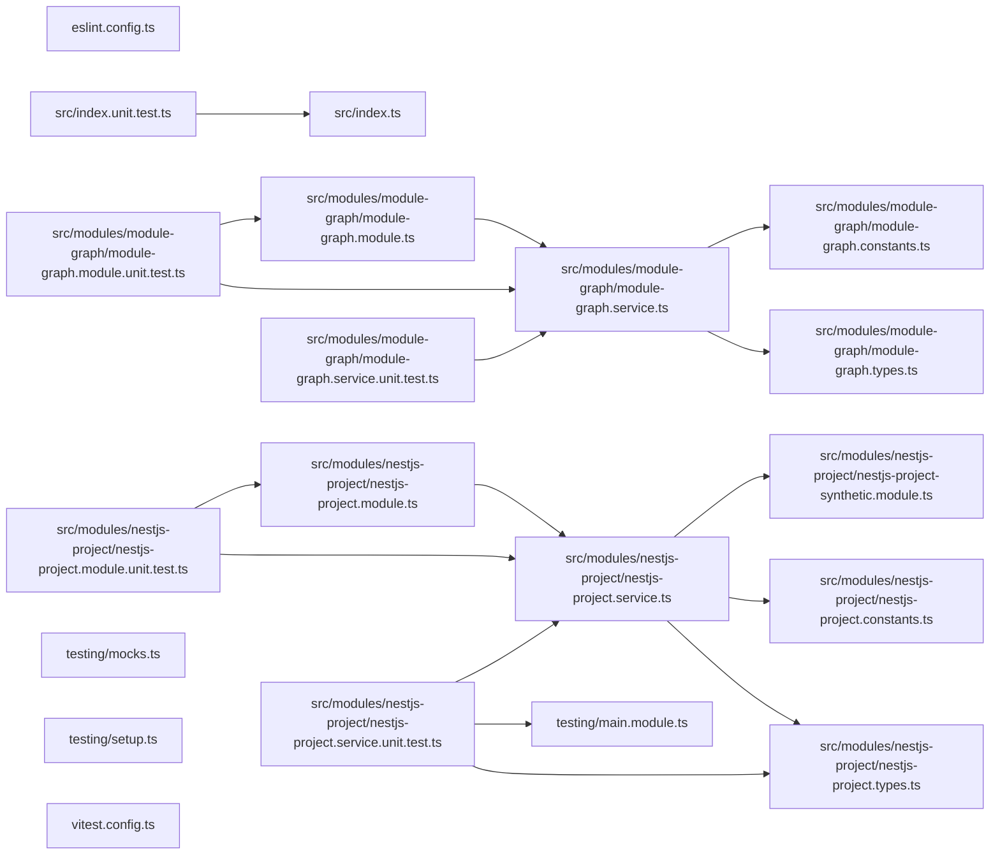

## Test

```bash
nx run codependix-nestjs:vitest
```

## 🕸️ Codependix

Dependency graphs exported by [codependix](https://github.com/JimmyPaolini/codebase/tree/main/packages/codependix-cli), regenerated by `nx run codebase:codependix:write`.

### Nx Neighborhood

<!-- codependix:start name="codependix-nx" -->

<!-- codependix:end name="codependix-nx" -->

### NestJS Module Graph

<!-- codependix:start name="codependix-nestjs" -->

<!-- codependix:end name="codependix-nestjs" -->

### File Imports

<!-- codependix:start name="codependix-imports" -->

<!-- codependix:end name="codependix-imports" -->

<!-- CALL_STACKS_START -->

## 🔭 Callidescope

Call stacks traced through `codependix-nestjs`, deepest first. Each frame shows what it takes, what it returns, and what its documentation says.

| Measure | Value |
| --- | --- |
| Callables | 31 |
| Files | 12 |
| Calls traced | 23 |
| Call stacks | 1 |
| Deepest stack | 2 |
| Stacks through recursion | 0 |
| Unfollowable calls | 2 |

### Call stacks (depth)

**1. `NestjsProjectService.loadModuleClasses`** — depth ≥ 2 · orphan-root

```text
🚀 NestjsProjectService.loadModuleClasses(file: string): Promise<Type<unknown>[]> [packages/codependix-nestjs/src/modules/nestjs-project/nestjs-project.service.ts:88]
   ↳ Imports a module file and returns every module class it exports.
  └─> NestjsProjectService.map(…)([, moduleClass]: [string, Type<unknown>]): Type<unknown> [packages/codependix-nestjs/src/modules/nestjs-project/nestjs-project.service.ts:99]
```

### Module spread

None.

### Breadth

| Callable | Breadth | Calls directly | Location |
| --- | --- | --- | --- |
| `ModuleGraphService.buildGraph` | 5 | `ModuleGraphService.findAmbientModuleNames`, `ModuleGraphService.collectEdges`, `ModuleGraphService.sortNames`, `ModuleGraphService.toSorted(…)`, `ModuleGraphService.filter(…)` | `packages/codependix-nestjs/src/modules/module-graph/module-graph.service.ts:136` |
| `NestjsProjectService.buildSyntheticRootModule` | 3 | `NestjsProjectService.findModuleFiles`, `NestjsProjectService.map(…)`, `SyntheticRootModule.forModules` | `packages/codependix-nestjs/src/modules/nestjs-project/nestjs-project.service.ts:55` |
| `ModuleGraphService.renderMermaid` | 2 | `ModuleGraphService.map(…)`, `ModuleGraphService.map(…)` | `packages/codependix-nestjs/src/modules/module-graph/module-graph.service.ts:158` |

<details>
<summary>8 more callables</summary>

| Callable | Breadth | Calls directly | Location |
| --- | --- | --- | --- |
| `NestjsProjectService.loadModuleClasses` | 2 | `NestjsProjectService.map(…)`, `NestjsProjectService.filter(…)` | `packages/codependix-nestjs/src/modules/nestjs-project/nestjs-project.service.ts:88` |
| `NestjsProjectService.discoverProjects` | 2 | `NestjsProjectService.map(…)`, `NestjsProjectService.filter(…)` | `packages/codependix-nestjs/src/modules/nestjs-project/nestjs-project.service.ts:143` |
| `NestjsProjectService.exploreProject` | 2 | `NestjsProjectService.buildSyntheticRootModule`, `NestjsProjectService.loadRootModule` | `packages/codependix-nestjs/src/modules/nestjs-project/nestjs-project.service.ts:155` |
| `ModuleGraphService.collectEdges` | 1 | `ModuleGraphService.map(…)` | `packages/codependix-nestjs/src/modules/module-graph/module-graph.service.ts:46` |
| `ModuleGraphService.findAmbientModuleNames` | 1 | `ModuleGraphService.countInboundEdges` | `packages/codependix-nestjs/src/modules/module-graph/module-graph.service.ts:105` |
| `ModuleGraphService.sortNames` | 1 | `ModuleGraphService.toSorted(…)` | `packages/codependix-nestjs/src/modules/module-graph/module-graph.service.ts:129` |
| `ModuleGraphService.map(…)` | 1 | `ModuleGraphService.renderNode` | `packages/codependix-nestjs/src/modules/module-graph/module-graph.service.ts:167` |
| `NestjsProjectService.findModuleFiles` | 1 | `NestjsProjectService.toSorted(…)` | `packages/codependix-nestjs/src/modules/nestjs-project/nestjs-project.service.ts:69` |

</details>

### Possibly misplaced

None.
<!-- CALL_STACKS_END -->
