## Test

```bash
nx run codependix-nx:vitest
```

## 🕸️ Codependix

Dependency graphs exported by [codependix](https://github.com/JimmyPaolini/codebase/tree/main/packages/codependix-cli), regenerated by `nx run codebase:codependix:write`.

### Nx Neighborhood

<!-- codependix:start name="codependix-nx" -->

<!-- codependix:end name="codependix-nx" -->

### NestJS Module Graph

<!-- codependix:start name="codependix-nestjs" -->

<!-- codependix:end name="codependix-nestjs" -->

### File Imports

```mermaid
graph LR
  file_eslint_config_ts["eslint.config.ts"]
  file_src_index_ts["src/index.ts"]
  file_src_index_unit_test_ts["src/index.unit.test.ts"]
  file_src_modules_neighborhood_neighborhood_constants_ts["src/modules/neighborhood/neighborhood.constants.ts"]
  file_src_modules_neighborhood_neighborhood_module_ts["src/modules/neighborhood/neighborhood.module.ts"]
  file_src_modules_neighborhood_neighborhood_module_unit_test_ts["src/modules/neighborhood/neighborhood.module.unit.test.ts"]
  file_src_modules_neighborhood_neighborhood_service_ts["src/modules/neighborhood/neighborhood.service.ts"]
  file_src_modules_neighborhood_neighborhood_service_unit_test_ts["src/modules/neighborhood/neighborhood.service.unit.test.ts"]
  file_src_modules_neighborhood_neighborhood_types_ts["src/modules/neighborhood/neighborhood.types.ts"]
  file_src_modules_workspace_graph_workspace_graph_constants_ts["src/modules/workspace-graph/workspace-graph.constants.ts"]
  file_src_modules_workspace_graph_workspace_graph_module_ts["src/modules/workspace-graph/workspace-graph.module.ts"]
  file_src_modules_workspace_graph_workspace_graph_module_unit_test_ts["src/modules/workspace-graph/workspace-graph.module.unit.test.ts"]
  file_src_modules_workspace_graph_workspace_graph_service_ts["src/modules/workspace-graph/workspace-graph.service.ts"]
  file_src_modules_workspace_graph_workspace_graph_service_unit_test_ts["src/modules/workspace-graph/workspace-graph.service.unit.test.ts"]
  file_src_modules_workspace_graph_workspace_graph_types_ts["src/modules/workspace-graph/workspace-graph.types.ts"]
  file_testing_mocks_ts["testing/mocks.ts"]
  file_testing_setup_ts["testing/setup.ts"]
  file_vitest_config_ts["vitest.config.ts"]
  file_src_index_unit_test_ts --> file_src_index_ts
  file_src_modules_neighborhood_neighborhood_module_ts --> file_src_modules_neighborhood_neighborhood_service_ts
  file_src_modules_neighborhood_neighborhood_module_unit_test_ts --> file_src_modules_neighborhood_neighborhood_module_ts
  file_src_modules_neighborhood_neighborhood_module_unit_test_ts --> file_src_modules_neighborhood_neighborhood_service_ts
  file_src_modules_neighborhood_neighborhood_service_ts --> file_src_modules_neighborhood_neighborhood_constants_ts
  file_src_modules_neighborhood_neighborhood_service_ts --> file_src_modules_neighborhood_neighborhood_types_ts
  file_src_modules_neighborhood_neighborhood_service_unit_test_ts --> file_src_modules_neighborhood_neighborhood_service_ts
  file_src_modules_neighborhood_neighborhood_service_unit_test_ts --> file_src_modules_neighborhood_neighborhood_types_ts
  file_src_modules_workspace_graph_workspace_graph_module_ts --> file_src_modules_neighborhood_neighborhood_module_ts
  file_src_modules_workspace_graph_workspace_graph_module_ts --> file_src_modules_workspace_graph_workspace_graph_service_ts
  file_src_modules_workspace_graph_workspace_graph_module_unit_test_ts --> file_src_modules_workspace_graph_workspace_graph_module_ts
  file_src_modules_workspace_graph_workspace_graph_module_unit_test_ts --> file_src_modules_workspace_graph_workspace_graph_service_ts
  file_src_modules_workspace_graph_workspace_graph_service_ts --> file_src_modules_neighborhood_neighborhood_constants_ts
  file_src_modules_workspace_graph_workspace_graph_service_ts --> file_src_modules_neighborhood_neighborhood_service_ts
  file_src_modules_workspace_graph_workspace_graph_service_ts --> file_src_modules_neighborhood_neighborhood_types_ts
  file_src_modules_workspace_graph_workspace_graph_service_ts --> file_src_modules_workspace_graph_workspace_graph_constants_ts
  file_src_modules_workspace_graph_workspace_graph_service_ts --> file_src_modules_workspace_graph_workspace_graph_types_ts
  file_src_modules_workspace_graph_workspace_graph_service_unit_test_ts --> file_src_modules_neighborhood_neighborhood_service_ts
  file_src_modules_workspace_graph_workspace_graph_service_unit_test_ts --> file_src_modules_neighborhood_neighborhood_types_ts
  file_src_modules_workspace_graph_workspace_graph_service_unit_test_ts --> file_src_modules_workspace_graph_workspace_graph_service_ts
  file_src_modules_workspace_graph_workspace_graph_types_ts --> file_src_modules_neighborhood_neighborhood_types_ts
```

<!-- codependix:start name="codependix-imports" -->

<!-- codependix:end name="codependix-imports" -->

<!-- CALL_STACKS_START -->

## 🔭 Callidescope

Call stacks traced through `codependix-nx`, deepest first. Each frame shows what it takes, what it returns, and what its documentation says.

| Measure | Value |
| --- | --- |
| Callables | 33 |
| Files | 11 |
| Calls traced | 29 |
| Call stacks | 2 |
| Deepest stack | 2 |
| Stacks through recursion | 0 |
| Unfollowable calls | 0 |

### Call stacks (depth)

**1. `NeighborhoodService.renderEdge`** — depth 2 · orphan-root

```text
🚀 NeighborhoodService.renderEdge(edge: NeighborhoodEdge): string [packages/codependix-nx/src/modules/neighborhood/neighborhood.service.ts:152]
   ↳ Renders one edge, dotted when Nx inferred it from configuration.
  └─> NeighborhoodService.toNodeIdentifier(projectName: string): string [packages/codependix-nx/src/modules/neighborhood/neighborhood.service.ts:199]
     ↳ Turns a project name into an identifier mermaid accepts.
```

**2. `NeighborhoodService.renderNode`** — depth 2 · orphan-root

```text
🚀 NeighborhoodService.renderNode(projectName: string): string [packages/codependix-nx/src/modules/neighborhood/neighborhood.service.ts:187]
   ↳ Declares one node, labelled with the project name it stands for.
  └─> NeighborhoodService.toNodeIdentifier(projectName: string): string [packages/codependix-nx/src/modules/neighborhood/neighborhood.service.ts:199]
     ↳ Turns a project name into an identifier mermaid accepts.
```

### Module spread

None.

### Breadth

| Callable | Breadth | Calls directly | Location |
| --- | --- | --- | --- |
| `NeighborhoodService.buildNeighborhoods` | 8 | `NeighborhoodService.map(…)`, `NeighborhoodService.collectEdges`, `NeighborhoodService.sortNames`, `NeighborhoodService.map(…)`, `NeighborhoodService.filter(…)`, `NeighborhoodService.map(…)`, `NeighborhoodService.filter(…)`, `NeighborhoodService.toSorted(…)` | `packages/codependix-nx/src/modules/neighborhood/neighborhood.service.ts:55` |
| `NeighborhoodService.renderMermaid` | 5 | `NeighborhoodService.sortNames`, `NeighborhoodService.map(…)`, `NeighborhoodService.map(…)`, `NeighborhoodService.toNodeIdentifier`, `NeighborhoodService.some(…)` | `packages/codependix-nx/src/modules/neighborhood/neighborhood.service.ts:159` |
| `WorkspaceGraphService.buildWorkspaceGraph` | 5 | `WorkspaceGraphService.map(…)`, `NeighborhoodService.collectEdges`, `WorkspaceGraphService.toSorted(…)`, `NeighborhoodService.sortNames`, `WorkspaceGraphService.map(…)` | `packages/codependix-nx/src/modules/workspace-graph/workspace-graph.service.ts:40` |

<details>
<summary>5 more callables</summary>

| Callable | Breadth | Calls directly | Location |
| --- | --- | --- | --- |
| `NeighborhoodService.readProjects` | 3 | `NeighborhoodService.toSorted(…)`, `NeighborhoodService.map(…)`, `NeighborhoodService.filter(…)` | `packages/codependix-nx/src/modules/neighborhood/neighborhood.service.ts:141` |
| `WorkspaceGraphService.renderMermaid` | 3 | `WorkspaceGraphService.map(…)`, `WorkspaceGraphService.map(…)`, `WorkspaceGraphService.some(…)` | `packages/codependix-nx/src/modules/workspace-graph/workspace-graph.service.ts:58` |
| `NeighborhoodService.renderEdge` | 1 | `NeighborhoodService.toNodeIdentifier` | `packages/codependix-nx/src/modules/neighborhood/neighborhood.service.ts:152` |
| `NeighborhoodService.renderNode` | 1 | `NeighborhoodService.toNodeIdentifier` | `packages/codependix-nx/src/modules/neighborhood/neighborhood.service.ts:187` |
| `NeighborhoodService.sortNames` | 1 | `NeighborhoodService.toSorted(…)` | `packages/codependix-nx/src/modules/neighborhood/neighborhood.service.ts:192` |

</details>

### Possibly misplaced

None.
<!-- CALL_STACKS_END -->
