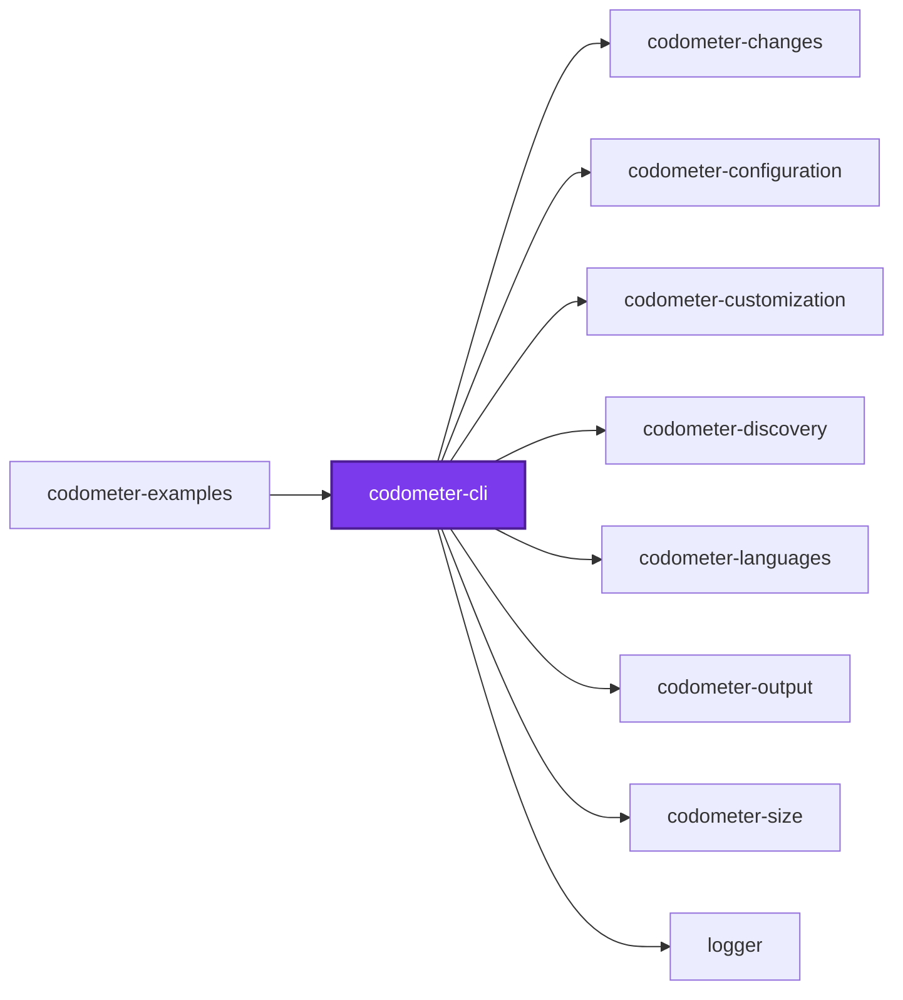
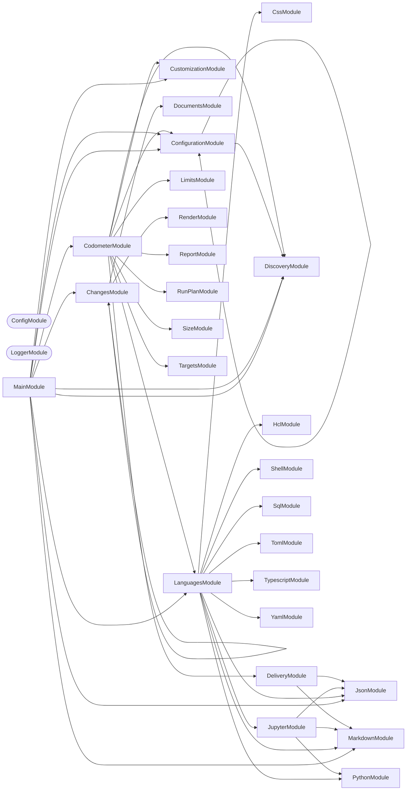

# ⏲️ Codometer

**Measure a repository and report what it found.**

Codometer walks a directory, parses everything it recognizes, and writes
what it counted as a markdown badge block, a JSON report, or both. It counts
languages the way you would expect — files, lines, classes, functions — and it
also counts the conventions a repository holds _itself_ to, which is usually
the more interesting number.

```bash
npm install --save-dev @codometer/cli
```

```bash
codometer
```

<!-- The badge block below this README's own Codometer section is produced by exactly this. -->

```markdown
### TypeScript & JavaScript


```

## Why

"1,034 source files" tells you almost nothing. "159 of them are services and
226 are the unit tests for them" tells you what the repository is actually made
of, and watching that ratio move tells you where it is going.

No language analyzer can produce the second number, because what a
`*.service.ts` means is a property of your repository rather than of
TypeScript. Codometer measures both halves: the built-in language counters, and
the ones you declare.

## Usage

```bash
codometer --directory . --config configuration/codometer.config.ts
```

| Flag | Purpose |
| ---- | ------- |
| `--check <set>` | Fail on a comma-separated set drawn from `reports` and `limits` |
| `--config [path]` | Configuration file to read; searched for when omitted |
| `-d, --directory [path]` | Directory to measure; defaults to the current one |
| `-f, --format <format>` | What to print to standard output, one of `json` and `markdown` |
| `--output-json <path>` | File the report is written to |
| `--output-markdown <path>` | Markdown file the badge block goes into |
| `--write` | Write every resolved destination |

**`--write` and `--check` are independent.** Neither implies the other and no
combination of them is inferred, which is the whole of the surface:

| Invocation | Writes | Fails on staleness | Fails on a breach |
| ---------- | ------ | ------------------ | ----------------- |
| `codometer` | no | no | no |
| `codometer --check limits` | no | no | yes |
| `codometer --check reports` | no | yes | no |
| `codometer --check reports,limits` | no | yes | yes |
| `codometer --write` | yes | no | no |
| `codometer --write --check limits` | yes | no | yes, after writing |

A `--write` run that also gates produces **every** report before it fails, so
the report is on disk even when the gate trips. `--write --check reports` is
refused rather than obeyed: nothing can be stale in the run that just wrote it.
So is a `--check` value the tool does not know, and every complaint about one
command line is reported together rather than one run at a time.

A **breach** and **staleness** are different findings and are never reported as
one. A `warn` breach is printed and leaves the exit code alone; a `fail` breach
exits 1, but only where `--check limits` asked for a gate.

`--check reports` compares a committed report against a fresh measurement, so it
is only as stable as the numbers it re-measures. Compressed sizes are
Node-version dependent — the bundled zlib differs between releases — so a report
written on one runtime and checked on another reads as stale when nothing
changed at all. Check on the runtime the repository pins, or expect false
staleness rather than a real finding.

```yaml
- run: npx codometer --check reports,limits
```

## One folder at a time

Codometer measures **one directory**, and knows nothing about workspaces, task
runners, or project graphs. Run it in a project and that project is what gets
measured — its own sources, and whatever targets the configuration declares for
it:

```bash
cd packages/logger && codometer --check limits
```

With no `--config`, the configuration is found by walking upward from that
folder and taking the **first** file found. The nearest one wins outright:
nothing from a further ancestor is folded into it, because a merged
configuration leaves a limit that never applied looking exactly like one that
did.

So a project needs no configuration file of its own. One file at the top of a
workspace can describe every project beneath it by [exporting a
function](../codometer-configuration/README.md#a-configuration-that-answers-for-every-folder)
that reads the folder it was pointed at, and a project whose targets do not
follow that convention writes a configuration file that replaces it.

## What gets measured

Discovery walks the directory itself and reads every `.gitignore` it passes,
so **`.gitignore` is already in force** — a build directory or a virtual
environment is pruned where its ignore file names it, and no exclusion has to
name it again. Git is never invoked, so a directory that is not a repository
at all is measured the same way as one that is.

What is measured is the working tree rather than the index: a file that exists
and is not ignored counts, whether or not it has been committed yet.

| Group | Counts |
| ----- | ------ |
| Repository | Lines of code, repository size, folders, source files |
| TypeScript & JavaScript | Files, tests, classes, functions, methods, interfaces, generics, enums, constants, imports, decorators, exported symbols, doc comments, TODOs |
| Python | Files, lines, classes, functions, protocols, constants, imports, decorators, docstrings |
| Jupyter | Notebooks, cells by kind, executions, outputs, plus the code and prose inside them |
| JSON | Files, objects, arrays, properties, scalars by type, node count, max depth |
| YAML | Documents, mappings, sequences, keys, scalars, anchors, aliases, max depth |
| Markdown | Headings by level, paragraphs, lists, tables, links, images, code blocks, block quotes |
| SQL | Statements by kind — selects, inserts, updates, deletes, creates, joins, CTEs |
| Shell | Functions, variables, exports, conditionals, loops, pipelines, shebangs |
| TOML | Tables, array tables, keys, arrays |
| HCL | Blocks, resources, variables, outputs, attributes, interpolations |
| CSS | Rules, selectors, declarations, at-rules, media queries, custom properties |
| Conventions | Whatever you declare — see below |

Notebooks are measured by composition rather than by a fourth parser: the
document is handed to the JSON analyzer, its code cells to the Python analyzer,
and its markdown cells to the markdown analyzer, leaving only cells, outputs,
and executions for the notebook analyzer itself.

Python analysis runs through an interpreter, `python3` by default. Point it
elsewhere with `python: { command: "uv run python" }` when Python lives in a
virtual environment.

## Targets

The codebase is measured as a **target** — a named set of files — and `targets`
declares the others. A target names its files by glob, which is what lets one
measure compiled output: a directory every `.gitignore` claims, and therefore
the one place ignore rules must not reach.

```ts
targets: [
  {
    analyses: ["size"],
    compression: "gzip",
    exclude: ["dist/vendor/**"],
    include: ["dist/**/*.js", "!dist/**/*.map.js"],
    name: "compiled",
  },
],
```

| Field | Required | Default | Meaning |
| ----- | -------- | ------- | ------- |
| `name` | yes | — | What the target is called. Two targets may not share one |
| `include` | yes | — | Globs that add files. At least one must add rather than remove |
| `exclude` | no | none | Globs that remove files |
| `analyses` | yes | — | `language`, `size`, or both. At least one |
| `compression` | no | `gzip` | `gzip`, `brotli`, or `none` for the bytes on disk |
| `directory` | no | `.` | Where the target's globs start, relative to the measured directory |

`language` runs the analyzers above over the target's files. `size` compresses
each matched file on its own and sums the results — never all of them together
— at gzip level 9 or brotli quality 11, both stated rather than defaulted.

A `!` prefix in `include` removes files. Negations form one set applied to the
whole target rather than being read in order, so rearranging the array cannot
change what the target holds. Dot files are excluded unless a glob spells one
out, directories never match, and a file that was matched but cannot be read
fails the run rather than counting as zero bytes.

## Limits

A **limit** is how high one measured metric may go. Any metric can carry one — a
compressed size, a line count, a counter for one of the conventions below — and
a metric nothing limits is measured and reported exactly as before, gated by
nothing.

```ts
defaultTarget: "codebase",
limits: [
  { metric: "Compiled JavaScript.size", value: "8 KB" },
  { label: "Interfaces", metric: "typescript.interfaces", value: 500 },
  { metric: "linesOfCode", severity: "warn", value: 100_000 },
],
```

| Field | Required | Default | Meaning |
| ----- | -------- | ------- | ------- |
| `metric` | yes | — | Dotted path of the metric this limits |
| `value` | yes | — | How high the metric may go, as a number or a string with a unit |
| `severity` | no | `fail` | `fail` stops the run on a breach; `warn` reports it |
| `label` | no | the path | What to call the limit in a report |

A metric is addressed by the target's name followed by its path within that
target — `codebase.typescript.interfaces`, `codebase.markdown.files`,
`Compiled JavaScript.size`. Every target carries `files`, a target running size
analysis carries `size`, and one running language analysis carries every
counter the tables above list, with configured counters under `custom.<label>`.
Set `defaultTarget` and a path naming no target is read as that target's.

Where a `defaultTarget` is set, a path is read as that target's whenever no
target name prefixes it — so with `defaultTarget: "codebase"` and a target
called `typescript`, `typescript.interfaces` is the codebase's, because the
`typescript` target has no `interfaces` metric of its own to compete with it.
Write the target name in full wherever a target and a metric group share one.

**Ambiguity is refused, never resolved.** A path that could name two metrics —
a target called `markdown` beside the codebase's own `markdown.files` — fails
the run naming both readings, as does a path naming none, or one naming a
metric from an analysis the target never ran. A limit that quietly bound to the
wrong metric would look exactly like one that works.

A value written as a string carries a **decimal** unit whose trailing `b` is
required: `"8 KB"` is 8000 bytes and `"1 MB"` is 1000000, while `"8 K"` is not
a size and is refused rather than read as anything. A value nothing can read
fails the run instead of being taken as zero.

A target that matched **no files** fails the run if and only if a limit is
written against it. Declaring a limit asserts the files are there, so an empty
match is a glob that stopped matching or a build that never ran — while a
target nobody limited simply measured zero, which is unremarkable.

### Reading every limit at once

A repository that declares its limits one per project has no single file left
to read them from. `codometer configuration` is that reading:

```bash
codometer configuration --limits
```

```text
| Directory        | Metric                    | Label | Severity | Value   | Declared in                          |
| ---              | ---                       | ---   | ---      | ---     | ---                                  |
| packages/logger  | `Compiled JavaScript.size`| —     | fail     | 6.00 kB | `packages/logger/codometer.config.ts`|
```

It walks for every configuration file beneath the directory it is given — in
any of the formats codometer accepts — and resolves each one **for its own
folder**, so what it reports is what a per-project run actually sees. The walk
honors the exclusions the root configuration declares, so a configuration
inside a dependency or a generator template is never listed as something the
repository configures.

Drop `--limits` to list everything each configuration resolved to: its targets,
custom statistics, documentation settings, exclusions, and Python command. Add
`--format json` for a machine-readable listing.

It reports configuration and never measurement. No build is required and no
limit is evaluated, so it runs in milliseconds and cannot fail for a reason
unrelated to configuration — which is what makes it usable while something
else is broken. A file that cannot be loaded is reported as unreadable rather
than taking the listing down with it.

## Documentation

A **documentation limit** is how long one documented declaration's JSDoc
comment may run. Opt-in, like every other check: a configuration naming no
`documentation` block measures and reports nothing extra, exactly as it did
before this existed. Once configured, every declaration carrying a `/**`
comment is measured and reported — a class, an interface, a function, a
method, a property — whether or not it breaches anything, and `kinds` earns
some of them more room than others without forcing one repository-wide number
to be either loose enough to permit a property essay or tight enough to forbid
a class overview that should exist.

```ts
documentation: {
  default: 6,
  kinds: { class: 24, interface: 16, function: 12, method: 12, property: 4 },
  unit: "lines",
},
```

| Field | Required | Default | Meaning |
| ----- | -------- | ------- | ------- |
| `default` | no | `6` | The limit a declaration's kind falls back to when `kinds` names none for it |
| `kinds` | no | none | A limit per declaration kind — `class`, `interface`, `function`, `method`, `property`, and the rest `## What gets measured` lists |
| `severity` | no | `fail` | `fail` stops the run on a breach; `warn` reports it |
| `unit` | no | `"lines"` | `"lines"`, `"characters"`, or `"words"` — the unit a comment's length is measured in |

A documentation breach is gated by the same `--check limits` flag every other
limit is — there is no separate flag for it. It never needs its own `metric`
path: every documented declaration is measured automatically, not addressed by
hand the way a limit on a count is.

## Custom statistics

A repository that names files by convention has a vocabulary no analyzer knows
about. Declare it:

```ts
statistics: [
  { label: "Service Files", patterns: ["**/*.service.ts"] },
  { label: "Unit Tests", patterns: ["**/*.unit.test.ts"] },
  { color: "16a34a", label: "Migrations", patterns: ["**/migrations/*.sql"] },
];
```

Counters can also match _declarations_ rather than files, by shape:

```ts
statistics: [
  {
    group: "typescript",
    label: "Static Methods",
    symbols: { kinds: ["method"], modifiers: ["static"] },
  },
];
```

Each entry becomes one badge, in the order configured, rendered into the group
it names — `conventions` by default. Symbol counting happens during the walk
the TypeScript analyzer already makes, so any number of these costs one pass
over the sources.

The full reference — kinds, modifiers, colors, groups, and how `patterns`
narrows a symbol counter rather than being what it counts — is in
[**@codometer/configuration**](../codometer-configuration/README.md#custom-statistics).

## Output

What a run prints and what it writes are asked for separately, and neither
implies the other:

| Sink | Flag | What lands there |
| ---- | ---- | ---------------- |
| Console | `-f, --format <format>` | The report as `json`, or the rendered badges as `markdown` |
| Report | `--output-json <path>` | The structured report below |
| Markdown | `--output-markdown <path>` | The badge block, in a markdown file |

**One markdown sink, not two.** `--output-markdown` splices the badge block
between its markers when the file already carries them, appends it with them
when it does not, and creates the file when it is not there. A README somebody
else wrote the rest of and a file holding nothing but badges are the same case,
so neither needs a flag of its own.

**A path always means a file.** Asking for the report on the console is
`--format json`, never a path left off. The optional-value flags this replaced
meant one thing with a value and another without, which is how a run meaning to
write a file ended up printing one instead.

**`--format` defaults to the badges on a run that touches no file**, which is
what makes a bare `codometer` worth running. A run that writes or compares
prints nothing unless asked, since its output is the file.

**An `--output-*` path is refused unless the run writes or compares it.** The
path names a file, and a run doing neither would leave it exactly as it found
it — which is not noticed here at all, but downstream, by whatever reads the
report finding nothing and reporting a project that changed nothing. The
command line is refused before anything is measured, naming the flag to add.

**A named destination stands for all of them.** `--output-json` on its own asks
for the report and nothing else, whatever the configuration file also describes.
Adding to the configured set instead would write a file the command line never
asked for.

**Standard output carries the result; every diagnostic goes to standard error.**
`codometer --format json > report.json` has to produce a file something can
parse, so a log line never shares that stream — including the exclusion notice
below, which is still on the console and still in front of a human, just not
inside the data. Only `--format` ever writes to that stream: a file sink that
could also print is how one run put two documents on it.

**The markdown sink's path is never defaulted.** Writing there rewrites a file
somebody else wrote the rest of, so a run that guessed the filename would edit
a document nobody pointed it at.

The rendered badges are a description paragraph followed by shields.io badges
under one `###` heading per language. A run scoped to one project puts its own
`##` section heading above all of it, inside the markers, because that block
lands in a document somebody else wrote the rest of and `###` groups with
nothing above them would read as a continuation of whatever section came
before. A run measuring a whole repository renders none: that README titles the
section above the markers itself. Beyond the language groups there is also —
for a run that measured a declared target — a `Measured Targets` group carrying
each target's size under the
compression it was measured with. That group is how a project's README reports
the size of what it ships; a run that declared no target renders no such group,
which is why the whole-repository report carries only its own `Repository Size`.

Spliced, the badges sit between two markers,
named `CODE_STATISTICS_START` and `CODE_STATISTICS_END` unless a configuration
renames them — as this example does, so that documenting the markers does not
make this document splice its own badges into the example:

```markdown
<!-- STATISTICS_START -->
<!-- STATISTICS_END -->
```

The block is appended when the markers are absent, and the file is created when
it does not exist. Both halves of that behavior are replaceable on their own —
`render` decides what markdown gets produced, `write` decides which file it
lands in and how — and supplying one keeps the built-in other. See
[markdown output](../codometer-configuration/README.md#markdown-output).

### What codometer writes, it does not measure

Every file a run would write is left out of what it measures, and the run says
so on the console. No configuration, and no ignore-file entry: codometer knows
its own destinations.

A badge is an image inside a link, so a spliced block moves `markdown.images`,
`markdown.links`, and `markdown.lines`, which moves the badges, which moves the
counts. Left in, a written report would be stale the moment it landed. The
exclusion is applied identically whatever the flags say, so a `--write` run and
a `--check reports` run always measure the same tree.

### The report

Codometer's own shape rather than any other tool's. Every metric carries its
value, and where something limits it, that limit's value, severity, and whether
it was breached — a limit that held is written out exactly like one that did
not, so a consumer can render the headroom rather than only the failures.

```json
{
  "documentation": [
    {
      "breached": true,
      "declaration": "CodometerService",
      "file": "src/modules/codometer/codometer.service.ts",
      "kind": "class",
      "limit": 6,
      "line": 32,
      "measured": 9,
      "severity": "fail",
      "target": "codebase",
      "unit": "lines"
    }
  ],
  "failures": [
    {
      "kind": "limit",
      "reason": "Cannot bind the limit written against \"nowhere.at.all\": nothing measured answers to it.",
      "subject": "nowhere.at.all"
    }
  ],
  "targets": [
    {
      "empty": false,
      "files": 1,
      "metrics": [
        {
          "limits": [],
          "name": "compiled.files",
          "path": "files",
          "unit": null,
          "value": 1
        },
        {
          "limits": [
            { "breached": true, "label": null, "severity": "warn", "value": 900 },
            { "breached": true, "label": "Bundle", "severity": "fail", "value": 1000 }
          ],
          "name": "compiled.size",
          "path": "size",
          "unit": "bytes",
          "value": 5195
        }
      ],
      "name": "compiled"
    }
  ]
}
```

| Field | Meaning |
| ----- | ------- |
| `name` | The metric's name across runs — its target, then its path. The join key a later run is compared on |
| `path` | The metric's path within its target, with no target name on the front |
| `unit` | `"bytes"` where the value counts bytes, `null` for a plain count |
| `limits` | Every limit declared on the metric, in the order written. Empty where nothing limits it — never an absent key |
| `empty` | Said outright when a target's globs matched nothing |
| `failures` | Whatever the run could not do: a target that would not measure, a limit that bound to nothing |
| `documentation` | Every documented declaration across every target, flattened, in measurement order — breached or not |

**`documentation` reports every measured declaration, not only breaches.** Each
entry names the `file` and 1-indexed `line` the declaration starts on, its
`kind`, the `target` it was found in, the configured `limit` and `unit`, the
`measured` length, and whether it `breached`. A declaration carrying no `/**`
comment at all is not measured and never appears here.

**A metric may carry more than one limit.** The configuration accepts a `warn`
short of a `fail` on a single metric on purpose — that is how a repository sees
a number coming before it stops a change — and the gate enforces all of them, so
the report lists all of them. A consumer deciding what to show picks
deliberately: the `fail` limit is what stops a change, and a
breached `warn` beneath it is advice, not a failure.

**Byte values are raw and decimal.** A renderer showing kilobytes divides by
1000, the same units a limit written `"8 KB"` is read in.

**Nothing is signalled by a missing field.** A target that matched nothing says
`"empty": true` and any limit written against it joins `failures`, rather than
leaving a consumer to infer an empty match from an absent limit beside a
passing verdict.

A failure is neither a breach nor staleness: it is the run not having finished.
Every one of them is collected and reported together, so a configuration with
three broken limits is one run to diagnose rather than three. A failure fails
any run that writes or gates; a bare run reports it and exits clean, exactly as
the flag table promises.

## Packages

| Package | Role |
| ------- | ---- |
| [`@codometer/cli`](README.md) | Measures the repository and writes the reports. Knows nothing about any particular repository |
| [`@codometer/configuration`](../codometer-configuration/README.md) | Reads `codometer.config.ts` and resolves exclusions, output destinations, custom statistics, and the Python interpreter |
| [`@codometer/examples`](../codometer-examples/README.md) | A sample corpus with known contents and one runnable example per behavior above, each asserted by a test |

Which paths to skip, where the output goes, and how Python is reached are all
configuration. That split is what lets the CLI be a general tool rather than
one repository's script.

Everything above has a runnable example in
[`@codometer/examples`](../codometer-examples/README.md), measured against a
sample corpus whose counts are stated and checked — including a reproduction of
each refusal, which is where a reader is most likely to be stuck. An agent that
has already been handed a refusal and needs the fix should start from that
package's [AGENTS.md](../codometer-examples/AGENTS.md), which maps each message
codometer prints to the example that reproduces it.

## Start

```bash
nx run codometer-cli:start
```

Pass the flags from [Usage](#usage) after `--`, so
`nx run codometer-cli:start -- --directory .` measures the current directory
from source.

## Test

```bash
nx run codometer-cli:vitest
```

## Contributing

```bash
nx run codometer-cli:build   # Compile
```

## License

MIT — see [LICENSE](../../LICENSE).

## 👔 Conformetry

This project was generated from the [nestjs-command-project](../../configuration/conformetry-templates/nestjs-command-project) conformetry template.

<!-- CALL_STACKS_START -->

## 🔭 Callidescope

Call stacks traced through `packages/codometer-cli`, deepest first. Each frame shows what it takes, what it returns, and what its documentation says.

| Measure | Value |
| --- | --- |
| Callables | 118 |
| Files | 37 |
| Calls traced | 143 |
| Call stacks | 8 |
| Deepest stack | 14 |
| Stacks through recursion | 0 |
| Unfollowable calls | 6 |

### Call stacks (depth)

**1. `CodometerCommand.run`** — depth ≥ 14 · decorated-method

```text
🚀 CodometerCommand.run(_passedParameters: string[], options: CodometerCommandOptions): Promise<void> [packages/codometer-cli/src/modules/codometer/codometer.command.ts:322]
   ↳ Measure the repository and produce every resolved output.
  └─> CodometerService.measure(args: MeasureArguments): MeasurementResult [packages/codometer-cli/src/modules/codometer/codometer.service.ts:340]
     ↳ Measure the codebase and every target declared alongside it.
    └─> CodometerService.measureDeclaredTargets(…): { failures: ReportFailure[]; targets: TargetMeasurement[]; } [packages/codometer-cli/src/modules/codometer/codometer.service.ts:239]
       ↳ Measure every declared target, keeping whatever the failures leave.
      └─> CodometerService.measureTarget(args: MeasureTargetArguments): TargetMeasurement [packages/codometer-cli/src/modules/codometer/codometer.service.ts:275]
         ↳ Measure one declared target with whichever analyses it asked for.
        └─> CodometerService.analyzeLanguage(…): { documentation: TypescriptDocumentationMeasurement[]; statistics: CodeStatisticsResult; } [packages/codometer-cli/src/modules/codometer/codometer.service.ts:62]
           ↳ Run every language analyzer over one target's files.
          └─> LanguagesService.analyze(args: AnalyzeLanguagesArguments): LanguageResults [packages/codometer-languages/src/modules/languages/languages.service.ts:54]
             ↳ Analyze every language present in the discovered files.
            └─> TypescriptService.analyze(input: TypescriptInput): TypescriptResult [packages/codometer-languages/src/modules/typescript/typescript.service.ts:442]
               ↳ Analyzes TypeScript and JavaScript source files and returns aggregated AST metrics.
              └─> TypescriptService.analyzeFile(args: AnalyzeTypescriptFileArguments): void [packages/codometer-languages/src/modules/typescript/typescript.service.ts:80]
                 ↳ Read one source file, count its lines and comments, and walk its AST.
                └─> TypescriptService.walkNode(node: tsCompiler.Node, context: TypescriptWalkContext): void [packages/codometer-languages/src/modules/typescript/typescript.service.ts:416]
                   ↳ Recursively visits each AST node and dispatches to the appropriate handler.
                  └─> TypescriptService.collectDocumentation(node: tsCompiler.Node, context: TypescriptWalkContext): void [packages/codometer-languages/src/modules/typescript/typescript.service.ts:108]
                     ↳ Measure a documentable declaration's leading JSDoc comment, if it has one.
                    └─> DocumentationMeasurementService.measure(…): TypescriptDocumentationMeasurement | undefined [packages/codometer-languages/src/modules/typescript/documentation-measurement.service.ts:117]
                       ↳ Measures one declaration's leading JSDoc comment, if it has one. `undefined` when the node's kind is not one a…
                      └─> DocumentationMeasurementService.measureLength(text: string, unit: CodometerDocumentationUnit): number [packages/codometer-languages/src/modules/typescript/documentation-measurement.service.ts:92]
                         ↳ Measures a comment's raw text in the configured unit.
                        └─> DocumentationMeasurementService.countWords(text: string): number [packages/codometer-languages/src/modules/typescript/documentation-measurement.service.ts:51]
                           ↳ Counts the words in the comment's prose.
                          └─> DocumentationMeasurementService.map(…)(line: string): string [packages/codometer-languages/src/modules/typescript/documentation-measurement.service.ts:56]
```

**2. `ChangesCommand.run`** — depth ≥ 4 · decorated-method

```text
🚀 ChangesCommand.run(_passedParameters: string[], options: ChangesCommandOptions): Promise<void> [packages/codometer-cli/src/modules/changes/changes.command.ts:107]
   ↳ Diffs every project's report against the baseline, and emits the result.
  └─> ChangesService.collect(args: CollectRowsArguments): MetricCollection [packages/codometer-changes/src/modules/changes/changes.service.ts:289]
     ↳ Joins every current report to the baseline snapshot.
    └─> ChangesService.readReportPaths(args: CollectRowsArguments): string[] [packages/codometer-changes/src/modules/changes/changes.service.ts:264]
       ↳ Lists every report path either side knows about, so a project the baseline measured is still accounted for when this…
      └─> ChangesService.flatMap(…)(this: undefined, pattern: string): string[] [packages/codometer-changes/src/modules/changes/changes.service.ts:266]
```

**3. `ChangesCommand.parseBaseline`** — depth 2 · decorated-method

```text
🚀 ChangesCommand.parseBaseline(value: unknown): string | undefined [packages/codometer-cli/src/modules/changes/changes.command.ts:62]
   ↳ Parse the baseline directory holding a snapshot of the reports.
  └─> ChangesCommand.readOptionalText(value: unknown): string | undefined [packages/codometer-cli/src/modules/changes/changes.command.ts:55]
     ↳ Narrows an option that carries text, or nothing at all.
```

<details>
<summary>5 more call stacks</summary>

**4. `ChangesCommand.parseBaselineUrl`** — depth 2 · decorated-method

```text
🚀 ChangesCommand.parseBaselineUrl(value: unknown): string | undefined [packages/codometer-cli/src/modules/changes/changes.command.ts:71]
   ↳ Parse the run URL the baseline came from, linked from the summary.
  └─> ChangesCommand.readOptionalText(value: unknown): string | undefined [packages/codometer-cli/src/modules/changes/changes.command.ts:55]
     ↳ Narrows an option that carries text, or nothing at all.
```

**5. `ChangesCommand.parseDirectory`** — depth 2 · decorated-method

```text
🚀 ChangesCommand.parseDirectory(value: unknown): string [packages/codometer-cli/src/modules/changes/changes.command.ts:80]
   ↳ Parse the directory to look for codometer reports in.
  └─> ChangesCommand.readOptionalText(value: unknown): string | undefined [packages/codometer-cli/src/modules/changes/changes.command.ts:55]
     ↳ Narrows an option that carries text, or nothing at all.
```

**6. `ChangesCommand.parseMarkdown`** — depth 2 · decorated-method

```text
🚀 ChangesCommand.parseMarkdown(value: unknown): string | undefined [packages/codometer-cli/src/modules/changes/changes.command.ts:89]
   ↳ Parse the markdown document the report is spliced into.
  └─> ChangesCommand.readOptionalText(value: unknown): string | undefined [packages/codometer-cli/src/modules/changes/changes.command.ts:55]
     ↳ Narrows an option that carries text, or nothing at all.
```

**7. `ChangesCommand.parseOutput`** — depth 2 · decorated-method

```text
🚀 ChangesCommand.parseOutput(value: unknown): string | undefined [packages/codometer-cli/src/modules/changes/changes.command.ts:98]
   ↳ Parse the file the report is written to on its own.
  └─> ChangesCommand.readOptionalText(value: unknown): string | undefined [packages/codometer-cli/src/modules/changes/changes.command.ts:55]
     ↳ Narrows an option that carries text, or nothing at all.
```

**8. `main`** — depth 2 · module-bootstrap

```text
🚀 main(): Promise<void> [packages/codometer-cli/src/main.ts:18]
   ↳ Bootstraps the codometer CLI command application.
  └─> withDefaultCommand(argv: readonly string[]): string[] [packages/codometer-cli/src/main.utilities.ts:13]
     ↳ Inserts the default `codometer` subcommand when the command line names neither it nor `changes`. `codometer`'s…
```

</details>

### Module spread

| Callable | Spread | Calls directly | Location |
| --- | --- | --- | --- |
| `CodometerService.measureTarget` | 17 | `packages/codometer-discovery:modules/discovery`, `packages/codometer-discovery:modules/targets`, `packages/codometer-size:modules/size` | `packages/codometer-cli/src/modules/codometer/codometer.service.ts:275` |
| `CodometerService.analyzeLanguage` | 15 | `packages/codometer-customization:modules/customization`, `packages/codometer-languages:modules/languages`, `packages/codometer-size:modules/size` | `packages/codometer-cli/src/modules/codometer/codometer.service.ts:62` |

### Breadth

| Callable | Breadth | Calls directly | Location |
| --- | --- | --- | --- |
| `CodometerCommand.run` | 11 | `CodometerCommand.resolveWorkingDirectory`, `RunPlanService.selectMode`, `CodometerCommand.readConfiguration`, `RunPlanService.resolveDestinations`, `RunPlanService.listOutputPaths`, `CodometerCommand.announceOutputPaths`, `CodometerService.measure`, `ReportService.build`, `DeliveryService.deliver`, `RunPlanService.selectScope`, `CodometerCommand.reportFindings` | `packages/codometer-cli/src/modules/codometer/codometer.command.ts:322` |
| `CodometerService.measure` | 10 | `CodometerService.discoverCodebase`, `CodometerService.analyzeLanguage`, `DiscoveryService.categorize`, `CodometerService.measureDeclaredTargets`, `CodometerService.attachTargetName`, `MetricIndexService.index`, `LimitsService.evaluate`, `CodometerService.flatMap(…)`, `CodometerService.map(…)`, `CodometerService.readLimitFailures` | `packages/codometer-cli/src/modules/codometer/codometer.service.ts:340` |
| `CodometerService.analyzeLanguage` | 7 | `LanguagesService.analyze`, `CustomizationService.buildSymbolCounters`, `SizeService.analyze`, `CustomizationService.analyze`, `CodometerService.getFolderCount`, `CodometerService.buildJavascriptStatistics`, `CodometerService.buildTypescriptStatistics` | `packages/codometer-cli/src/modules/codometer/codometer.service.ts:62` |

<details>
<summary>48 more callables</summary>

| Callable | Breadth | Calls directly | Location |
| --- | --- | --- | --- |
| `CodometerService.measureTarget` | 7 | `CodometerService.excludeOutputPaths`, `TargetsService.matchFiles`, `CodometerService.runsAnalysis`, `CodometerService.analyzeLanguage`, `DiscoveryService.categorize`, `CodometerService.attachTargetName`, `SizeService.analyze` | `packages/codometer-cli/src/modules/codometer/codometer.service.ts:275` |
| `DeliveryService.deliverReadme` | 6 | `DeliveryService.readTargetSizes`, `DeliveryService.touchesFiles`, `MarkdownService.renderBlock`, `DeliveryService.appendDocumentationSection`, `MarkdownService.sync`, `DeliveryService.augmentWithDocumentation` | `packages/codometer-cli/src/modules/delivery/delivery.service.ts:157` |
| `DeliveryService.deliverMarkdown` | 5 | `MarkdownService.renderDocument`, `DeliveryService.readTargetSizes`, `DeliveryService.appendDocumentationSection`, `DeliveryService.touchesFiles`, `MarkdownService.syncDocument` | `packages/codometer-cli/src/modules/delivery/delivery.service.ts:121` |
| `LimitsService.resolve` | 5 | `LimitsService.findCandidates`, `UnboundMetricError.constructor`, `LimitsService.describeTargets`, `LimitsService.map(…)`, `EmptyTargetError.constructor` | `packages/codometer-cli/src/modules/limits/limits.service.ts:154` |
| `CodometerCommand.reportFindings` | 5 | `CodometerCommand.reportFailures`, `CodometerCommand.reportStaleness`, `CodometerCommand.reportBreaches`, `CodometerCommand.reportDocumentationBreaches`, `CodometerCommand.filter(…)` | `packages/codometer-cli/src/modules/codometer/codometer.command.ts:173` |
| `ChangesCommand.run` | 4 | `ChangesCommand.readOptionalText`, `ChangesService.collect`, `RenderService.renderSection`, `DocumentsService.emit` | `packages/codometer-cli/src/modules/changes/changes.command.ts:107` |
| `RunPlanService.readCheckNames` | 4 | `RunPlanService.describeAcceptedCheckNames`, `RunPlanService.filter(…)`, `RunPlanService.map(…)`, `RunPlanService.validateCheckNames` | `packages/codometer-cli/src/modules/run-plan/run-plan.service.ts:80` |
| `RunPlanService.resolveDestinations` | 4 | `RunPlanService.namesDestination`, `RunPlanService.resolveJson`, `RunPlanService.resolveMarkdown`, `RunPlanService.resolveReadme` | `packages/codometer-cli/src/modules/run-plan/run-plan.service.ts:308` |
| `DeliveryService.deliverJson` | 3 | `DeliveryService.touchesFiles`, `JsonService.render`, `JsonService.sync` | `packages/codometer-cli/src/modules/delivery/delivery.service.ts:92` |
| `DeliveryService.deliver` | 3 | `DeliveryService.deliverJson`, `DeliveryService.deliverMarkdown`, `DeliveryService.deliverReadme` | `packages/codometer-cli/src/modules/delivery/delivery.service.ts:242` |
| `LimitsService.findDefaultCandidate` | 3 | `UnboundMetricError.constructor`, `LimitsService.describeTargets`, `LimitsService.bind` | `packages/codometer-cli/src/modules/limits/limits.service.ts:122` |
| `ReportService.buildMetrics` | 3 | `ReportService.buildMetricName`, `ReportService.map(…)`, `ReportService.readUnit` | `packages/codometer-cli/src/modules/report/report.service.ts:52` |
| `CodometerCommand.reportBreaches` | 3 | `CodometerCommand.filter(…)`, `CodometerCommand.filter(…)`, `CodometerCommand.filter(…)` | `packages/codometer-cli/src/modules/codometer/codometer.command.ts:103` |
| `CodometerCommand.reportDocumentationBreaches` | 3 | `CodometerCommand.filter(…)`, `CodometerCommand.filter(…)`, `CodometerCommand.filter(…)` | `packages/codometer-cli/src/modules/codometer/codometer.command.ts:127` |
| `DeliveryService.appendDocumentationSection` | 2 | `MarkdownService.renderDocumentationSection`, `DeliveryService.filter(…)` | `packages/codometer-cli/src/modules/delivery/delivery.service.ts:45` |
| `DeliveryService.augmentWithDocumentation` | 2 | `MarkdownService.renderDocumentationSection`, `DeliveryService.filter(…)` | `packages/codometer-cli/src/modules/delivery/delivery.service.ts:66` |
| `LimitsService.findCandidates` | 2 | `LimitsService.bind`, `LimitsService.findDefaultCandidate` | `packages/codometer-cli/src/modules/limits/limits.service.ts:84` |
| `LimitsService.evaluate` | 2 | `LimitsService.resolve`, `LimitsService.describeFailure` | `packages/codometer-cli/src/modules/limits/limits.service.ts:198` |
| `MetricIndexService.buildTargetIndex` | 2 | `MetricIndexService.addMetric`, `MetricIndexService.indexLanguage` | `packages/codometer-cli/src/modules/limits/metric-index.service.ts:66` |
| `MetricIndexService.indexCounters` | 2 | `MetricIndexService.addMetric`, `MetricIndexService.isCounterGroup` | `packages/codometer-cli/src/modules/limits/metric-index.service.ts:101` |
| `MetricIndexService.indexLanguage` | 2 | `MetricIndexService.indexCounters`, `MetricIndexService.addMetric` | `packages/codometer-cli/src/modules/limits/metric-index.service.ts:125` |
| `MetricIndexService.index` | 2 | `MetricIndexService.describeDuplicate`, `MetricIndexService.buildTargetIndex` | `packages/codometer-cli/src/modules/limits/metric-index.service.ts:157` |
| `ReportService.build` | 2 | `ReportService.indexLimits`, `ReportService.buildMetrics` | `packages/codometer-cli/src/modules/report/report.service.ts:120` |
| `RunPlanService.resolveJson` | 2 | `RunPlanService.resolvePath`, `RunPlanService.readPathFlag` | `packages/codometer-cli/src/modules/run-plan/run-plan.service.ts:161` |
| `RunPlanService.listOutputPaths` | 2 | `RunPlanService.map(…)`, `RunPlanService.filter(…)` | `packages/codometer-cli/src/modules/run-plan/run-plan.service.ts:284` |
| `RunPlanService.selectMode` | 2 | `RunPlanService.readCheckNames`, `RunPlanService.requireWrittenReport` | `packages/codometer-cli/src/modules/run-plan/run-plan.service.ts:338` |
| `CodometerService.discoverCodebase` | 2 | `DiscoveryService.discoverFiles`, `CodometerService.excludeOutputPaths` | `packages/codometer-cli/src/modules/codometer/codometer.service.ts:183` |
| `CodometerService.measureDeclaredTargets` | 2 | `CodometerService.measureTarget`, `CodometerService.describeFailure` | `packages/codometer-cli/src/modules/codometer/codometer.service.ts:239` |
| `ChangesCommand.parseBaseline` | 1 | `ChangesCommand.readOptionalText` | `packages/codometer-cli/src/modules/changes/changes.command.ts:62` |
| `ChangesCommand.parseBaselineUrl` | 1 | `ChangesCommand.readOptionalText` | `packages/codometer-cli/src/modules/changes/changes.command.ts:71` |
| `ChangesCommand.parseDirectory` | 1 | `ChangesCommand.readOptionalText` | `packages/codometer-cli/src/modules/changes/changes.command.ts:80` |
| `ChangesCommand.parseMarkdown` | 1 | `ChangesCommand.readOptionalText` | `packages/codometer-cli/src/modules/changes/changes.command.ts:89` |
| `ChangesCommand.parseOutput` | 1 | `ChangesCommand.readOptionalText` | `packages/codometer-cli/src/modules/changes/changes.command.ts:98` |
| `DeliveryService.readTargetSizes` | 1 | `DeliveryService.flatMap(…)` | `packages/codometer-cli/src/modules/delivery/delivery.service.ts:214` |
| `LimitsService.bind` | 1 | `UnboundMetricError.constructor` | `packages/codometer-cli/src/modules/limits/limits.service.ts:39` |
| `LimitsService.describeTargets` | 1 | `LimitsService.map(…)` | `packages/codometer-cli/src/modules/limits/limits.service.ts:70` |
| `ReportService.indexLimits` | 1 | `ReportService.buildMetricName` | `packages/codometer-cli/src/modules/report/report.service.ts:87` |
| `RunPlanService.describeAcceptedCheckNames` | 1 | `RunPlanService.map(…)` | `packages/codometer-cli/src/modules/run-plan/run-plan.service.ts:53` |
| `RunPlanService.resolveMarkdown` | 1 | `RunPlanService.resolvePath` | `packages/codometer-cli/src/modules/run-plan/run-plan.service.ts:191` |
| `RunPlanService.resolveReadme` | 1 | `RunPlanService.resolvePath` | `packages/codometer-cli/src/modules/run-plan/run-plan.service.ts:230` |
| `RunPlanService.validateCheckNames` | 1 | `RunPlanService.describeAcceptedCheckNames` | `packages/codometer-cli/src/modules/run-plan/run-plan.service.ts:259` |
| `RunPlanService.selectScope` | 1 | `RunPlanService.some(…)` | `packages/codometer-cli/src/modules/run-plan/run-plan.service.ts:367` |
| `CodometerService.attachTargetName` | 1 | `CodometerService.map(…)` | `packages/codometer-cli/src/modules/codometer/codometer.service.ts:125` |
| `CodometerService.excludeOutputPaths` | 1 | `CodometerService.filter(…)` | `packages/codometer-cli/src/modules/codometer/codometer.service.ts:201` |
| `CodometerService.readLimitFailures` | 1 | `CodometerService.map(…)` | `packages/codometer-cli/src/modules/codometer/codometer.service.ts:311` |
| `CodometerCommand.readConfiguration` | 1 | `ConfigurationService.loadConfiguration` | `packages/codometer-cli/src/modules/codometer/codometer.command.ts:78` |
| `CodometerCommand.resolveWorkingDirectory` | 1 | `CodometerCommand.parseDirectory` | `packages/codometer-cli/src/modules/codometer/codometer.command.ts:206` |
| `main` | 1 | `withDefaultCommand` | `packages/codometer-cli/src/main.ts:18` |

</details>

### Possibly misplaced

None.
<!-- CALL_STACKS_END -->

## 🕸️ Codependix

Dependency graphs exported by [codependix](https://github.com/JimmyPaolini/codebase/tree/main/packages/codependix-cli), regenerated by `nx run codebase:codependix:write`.

### Nx Neighborhood

<!-- codependix:start name="codependix-nx" -->

<!-- codependix:end name="codependix-nx" -->

### NestJS Module Graph

<!-- codependix:start name="codependix-nestjs" -->


_Rounded modules are global: every module can inject them, so their edges are left out._
<!-- codependix:end name="codependix-nestjs" -->

### File Imports

<!-- codependix:start name="codependix-imports" -->
```mermaid
graph LR
  file_codometer_config_ts["codometer.config.ts"]
  file_eslint_config_ts["eslint.config.ts"]
  file_src_constants_ts["src/constants.ts"]
  file_src_index_ts["src/index.ts"]
  file_src_main_end_to_end_test_ts["src/main.end-to-end.test.ts"]
  file_src_main_module_ts["src/main.module.ts"]
  file_src_main_ts["src/main.ts"]
  file_src_main_utilities_ts["src/main.utilities.ts"]
  file_src_main_utilities_unit_test_ts["src/main.utilities.unit.test.ts"]
  file_src_modules_changes_changes_command_ts["src/modules/changes/changes.command.ts"]
  file_src_modules_changes_changes_command_unit_test_ts["src/modules/changes/changes.command.unit.test.ts"]
  file_src_modules_changes_changes_constants_ts["src/modules/changes/changes.constants.ts"]
  file_src_modules_changes_changes_module_ts["src/modules/changes/changes.module.ts"]
  file_src_modules_changes_changes_types_ts["src/modules/changes/changes.types.ts"]
  file_src_modules_codometer_codometer_command_integration_test_ts["src/modules/codometer/codometer.command.integration.test.ts"]
  file_src_modules_codometer_codometer_command_ts["src/modules/codometer/codometer.command.ts"]
  file_src_modules_codometer_codometer_command_unit_test_ts["src/modules/codometer/codometer.command.unit.test.ts"]
  file_src_modules_codometer_codometer_constants_ts["src/modules/codometer/codometer.constants.ts"]
  file_src_modules_codometer_codometer_module_ts["src/modules/codometer/codometer.module.ts"]
  file_src_modules_codometer_codometer_service_ts["src/modules/codometer/codometer.service.ts"]
  file_src_modules_codometer_codometer_service_unit_test_ts["src/modules/codometer/codometer.service.unit.test.ts"]
  file_src_modules_codometer_codometer_types_ts["src/modules/codometer/codometer.types.ts"]
  file_src_modules_codometer_documentation_measurement_types_ts["src/modules/codometer/documentation-measurement.types.ts"]
  file_src_modules_configuration_configuration_command_ts["src/modules/configuration/configuration.command.ts"]
  file_src_modules_configuration_configuration_command_unit_test_ts["src/modules/configuration/configuration.command.unit.test.ts"]
  file_src_modules_configuration_configuration_constants_ts["src/modules/configuration/configuration.constants.ts"]
  file_src_modules_configuration_configuration_module_ts["src/modules/configuration/configuration.module.ts"]
  file_src_modules_configuration_configuration_service_ts["src/modules/configuration/configuration.service.ts"]
  file_src_modules_configuration_configuration_service_unit_test_ts["src/modules/configuration/configuration.service.unit.test.ts"]
  file_src_modules_configuration_configuration_types_ts["src/modules/configuration/configuration.types.ts"]
  file_src_modules_configuration_render_configuration_service_ts["src/modules/configuration/render-configuration.service.ts"]
  file_src_modules_configuration_render_configuration_service_unit_test_ts["src/modules/configuration/render-configuration.service.unit.test.ts"]
  file_src_modules_delivery_delivery_constants_ts["src/modules/delivery/delivery.constants.ts"]
  file_src_modules_delivery_delivery_module_ts["src/modules/delivery/delivery.module.ts"]
  file_src_modules_delivery_delivery_service_ts["src/modules/delivery/delivery.service.ts"]
  file_src_modules_delivery_delivery_service_unit_test_ts["src/modules/delivery/delivery.service.unit.test.ts"]
  file_src_modules_delivery_delivery_types_ts["src/modules/delivery/delivery.types.ts"]
  file_src_modules_limits_empty_target_errors_ts["src/modules/limits/empty-target.errors.ts"]
  file_src_modules_limits_limits_constants_ts["src/modules/limits/limits.constants.ts"]
  file_src_modules_limits_limits_errors_ts["src/modules/limits/limits.errors.ts"]
  file_src_modules_limits_limits_module_ts["src/modules/limits/limits.module.ts"]
  file_src_modules_limits_limits_service_integration_test_ts["src/modules/limits/limits.service.integration.test.ts"]
  file_src_modules_limits_limits_service_ts["src/modules/limits/limits.service.ts"]
  file_src_modules_limits_limits_service_unit_test_ts["src/modules/limits/limits.service.unit.test.ts"]
  file_src_modules_limits_limits_types_ts["src/modules/limits/limits.types.ts"]
  file_src_modules_limits_metric_index_service_ts["src/modules/limits/metric-index.service.ts"]
  file_src_modules_limits_metric_index_service_unit_test_ts["src/modules/limits/metric-index.service.unit.test.ts"]
  file_src_modules_report_report_constants_ts["src/modules/report/report.constants.ts"]
  file_src_modules_report_report_module_ts["src/modules/report/report.module.ts"]
  file_src_modules_report_report_service_ts["src/modules/report/report.service.ts"]
  file_src_modules_report_report_service_unit_test_ts["src/modules/report/report.service.unit.test.ts"]
  file_src_modules_report_report_types_ts["src/modules/report/report.types.ts"]
  file_src_modules_run_plan_run_plan_constants_ts["src/modules/run-plan/run-plan.constants.ts"]
  file_src_modules_run_plan_run_plan_module_ts["src/modules/run-plan/run-plan.module.ts"]
  file_src_modules_run_plan_run_plan_service_ts["src/modules/run-plan/run-plan.service.ts"]
  file_src_modules_run_plan_run_plan_service_unit_test_ts["src/modules/run-plan/run-plan.service.unit.test.ts"]
  file_src_modules_run_plan_run_plan_types_ts["src/modules/run-plan/run-plan.types.ts"]
  file_src_repl_ts["src/repl.ts"]
  file_src_repl_unit_test_ts["src/repl.unit.test.ts"]
  file_testing_fixture_tree_ts["testing/fixture-tree.ts"]
  file_testing_mocks_ts["testing/mocks.ts"]
  file_testing_setup_ts["testing/setup.ts"]
  file_testing_target_tree_ts["testing/target-tree.ts"]
  file_vitest_config_ts["vitest.config.ts"]
  file_src_main_end_to_end_test_ts --> file_src_constants_ts
  file_src_main_end_to_end_test_ts --> file_src_modules_report_report_types_ts
  file_src_main_end_to_end_test_ts --> file_testing_fixture_tree_ts
  file_src_main_module_ts --> file_src_constants_ts
  file_src_main_module_ts --> file_src_modules_changes_changes_module_ts
  file_src_main_module_ts --> file_src_modules_codometer_codometer_module_ts
  file_src_main_module_ts --> file_src_modules_configuration_configuration_module_ts
  file_src_main_ts --> file_src_main_module_ts
  file_src_main_ts --> file_src_main_utilities_ts
  file_src_main_utilities_unit_test_ts --> file_src_main_utilities_ts
  file_src_modules_changes_changes_command_ts --> file_src_modules_changes_changes_types_ts
  file_src_modules_changes_changes_command_unit_test_ts --> file_src_modules_changes_changes_command_ts
  file_src_modules_changes_changes_module_ts --> file_src_modules_changes_changes_command_ts
  file_src_modules_codometer_codometer_command_integration_test_ts --> file_src_main_module_ts
  file_src_modules_codometer_codometer_command_integration_test_ts --> file_src_modules_codometer_codometer_command_ts
  file_src_modules_codometer_codometer_command_integration_test_ts --> file_src_modules_report_report_types_ts
  file_src_modules_codometer_codometer_command_integration_test_ts --> file_testing_fixture_tree_ts
  file_src_modules_codometer_codometer_command_ts --> file_src_modules_codometer_codometer_service_ts
  file_src_modules_codometer_codometer_command_ts --> file_src_modules_codometer_codometer_types_ts
  file_src_modules_codometer_codometer_command_ts --> file_src_modules_delivery_delivery_service_ts
  file_src_modules_codometer_codometer_command_ts --> file_src_modules_report_report_service_ts
  file_src_modules_codometer_codometer_command_ts --> file_src_modules_run_plan_run_plan_service_ts
  file_src_modules_codometer_codometer_command_ts --> file_src_modules_run_plan_run_plan_types_ts
  file_src_modules_codometer_codometer_command_unit_test_ts --> file_src_modules_codometer_codometer_command_ts
  file_src_modules_codometer_codometer_command_unit_test_ts --> file_src_modules_codometer_codometer_service_ts
  file_src_modules_codometer_codometer_command_unit_test_ts --> file_src_modules_codometer_codometer_types_ts
  file_src_modules_codometer_codometer_command_unit_test_ts --> file_src_modules_codometer_documentation_measurement_types_ts
  file_src_modules_codometer_codometer_command_unit_test_ts --> file_src_modules_delivery_delivery_service_ts
  file_src_modules_codometer_codometer_command_unit_test_ts --> file_src_modules_limits_limits_types_ts
  file_src_modules_codometer_codometer_command_unit_test_ts --> file_src_modules_report_report_service_ts
  file_src_modules_codometer_codometer_command_unit_test_ts --> file_src_modules_run_plan_run_plan_service_ts
  file_src_modules_codometer_codometer_command_unit_test_ts --> file_testing_mocks_ts
  file_src_modules_codometer_codometer_module_ts --> file_src_modules_codometer_codometer_command_ts
  file_src_modules_codometer_codometer_module_ts --> file_src_modules_codometer_codometer_service_ts
  file_src_modules_codometer_codometer_module_ts --> file_src_modules_delivery_delivery_module_ts
  file_src_modules_codometer_codometer_module_ts --> file_src_modules_limits_limits_module_ts
  file_src_modules_codometer_codometer_module_ts --> file_src_modules_report_report_module_ts
  file_src_modules_codometer_codometer_module_ts --> file_src_modules_run_plan_run_plan_module_ts
  file_src_modules_codometer_codometer_service_ts --> file_src_modules_codometer_codometer_types_ts
  file_src_modules_codometer_codometer_service_ts --> file_src_modules_codometer_documentation_measurement_types_ts
  file_src_modules_codometer_codometer_service_ts --> file_src_modules_limits_limits_service_ts
  file_src_modules_codometer_codometer_service_ts --> file_src_modules_limits_limits_types_ts
  file_src_modules_codometer_codometer_service_ts --> file_src_modules_limits_metric_index_service_ts
  file_src_modules_codometer_codometer_service_ts --> file_src_modules_report_report_types_ts
  file_src_modules_codometer_codometer_service_unit_test_ts --> file_src_modules_codometer_codometer_service_ts
  file_src_modules_codometer_codometer_service_unit_test_ts --> file_src_modules_limits_limits_service_ts
  file_src_modules_codometer_codometer_service_unit_test_ts --> file_src_modules_limits_metric_index_service_ts
  file_src_modules_codometer_codometer_service_unit_test_ts --> file_testing_mocks_ts
  file_src_modules_codometer_codometer_types_ts --> file_src_modules_codometer_documentation_measurement_types_ts
  file_src_modules_codometer_codometer_types_ts --> file_src_modules_limits_limits_types_ts
  file_src_modules_codometer_codometer_types_ts --> file_src_modules_report_report_types_ts
  file_src_modules_configuration_configuration_command_ts --> file_src_modules_configuration_configuration_constants_ts
  file_src_modules_configuration_configuration_command_ts --> file_src_modules_configuration_configuration_service_ts
  file_src_modules_configuration_configuration_command_ts --> file_src_modules_configuration_configuration_types_ts
  file_src_modules_configuration_configuration_command_ts --> file_src_modules_configuration_render_configuration_service_ts
  file_src_modules_configuration_configuration_command_unit_test_ts --> file_src_modules_configuration_configuration_command_ts
  file_src_modules_configuration_configuration_command_unit_test_ts --> file_src_modules_configuration_configuration_service_ts
  file_src_modules_configuration_configuration_command_unit_test_ts --> file_src_modules_configuration_render_configuration_service_ts
  file_src_modules_configuration_configuration_module_ts --> file_src_modules_configuration_configuration_command_ts
  file_src_modules_configuration_configuration_module_ts --> file_src_modules_configuration_configuration_service_ts
  file_src_modules_configuration_configuration_module_ts --> file_src_modules_configuration_render_configuration_service_ts
  file_src_modules_configuration_configuration_service_ts --> file_src_modules_configuration_configuration_constants_ts
  file_src_modules_configuration_configuration_service_ts --> file_src_modules_configuration_configuration_types_ts
  file_src_modules_configuration_configuration_service_unit_test_ts --> file_src_modules_configuration_configuration_service_ts
  file_src_modules_configuration_render_configuration_service_ts --> file_src_modules_configuration_configuration_constants_ts
  file_src_modules_configuration_render_configuration_service_ts --> file_src_modules_configuration_configuration_types_ts
  file_src_modules_configuration_render_configuration_service_unit_test_ts --> file_src_modules_configuration_configuration_types_ts
  file_src_modules_configuration_render_configuration_service_unit_test_ts --> file_src_modules_configuration_render_configuration_service_ts
  file_src_modules_delivery_delivery_module_ts --> file_src_modules_delivery_delivery_service_ts
  file_src_modules_delivery_delivery_service_ts --> file_src_modules_codometer_codometer_types_ts
  file_src_modules_delivery_delivery_service_ts --> file_src_modules_codometer_documentation_measurement_types_ts
  file_src_modules_delivery_delivery_service_ts --> file_src_modules_delivery_delivery_types_ts
  file_src_modules_delivery_delivery_service_ts --> file_src_modules_run_plan_run_plan_types_ts
  file_src_modules_delivery_delivery_service_unit_test_ts --> file_src_modules_codometer_codometer_types_ts
  file_src_modules_delivery_delivery_service_unit_test_ts --> file_src_modules_codometer_documentation_measurement_types_ts
  file_src_modules_delivery_delivery_service_unit_test_ts --> file_src_modules_delivery_delivery_service_ts
  file_src_modules_delivery_delivery_service_unit_test_ts --> file_src_modules_run_plan_run_plan_types_ts
  file_src_modules_delivery_delivery_service_unit_test_ts --> file_testing_mocks_ts
  file_src_modules_delivery_delivery_types_ts --> file_src_modules_codometer_codometer_types_ts
  file_src_modules_delivery_delivery_types_ts --> file_src_modules_report_report_types_ts
  file_src_modules_delivery_delivery_types_ts --> file_src_modules_run_plan_run_plan_types_ts
  file_src_modules_limits_limits_module_ts --> file_src_modules_limits_limits_service_ts
  file_src_modules_limits_limits_module_ts --> file_src_modules_limits_metric_index_service_ts
  file_src_modules_limits_limits_service_integration_test_ts --> file_src_modules_limits_limits_service_ts
  file_src_modules_limits_limits_service_integration_test_ts --> file_src_modules_limits_limits_types_ts
  file_src_modules_limits_limits_service_integration_test_ts --> file_src_modules_limits_metric_index_service_ts
  file_src_modules_limits_limits_service_integration_test_ts --> file_testing_fixture_tree_ts
  file_src_modules_limits_limits_service_integration_test_ts --> file_testing_mocks_ts
  file_src_modules_limits_limits_service_ts --> file_src_modules_limits_empty_target_errors_ts
  file_src_modules_limits_limits_service_ts --> file_src_modules_limits_limits_constants_ts
  file_src_modules_limits_limits_service_ts --> file_src_modules_limits_limits_errors_ts
  file_src_modules_limits_limits_service_ts --> file_src_modules_limits_limits_types_ts
  file_src_modules_limits_limits_service_unit_test_ts --> file_src_modules_limits_limits_service_ts
  file_src_modules_limits_limits_service_unit_test_ts --> file_src_modules_limits_limits_types_ts
  file_src_modules_limits_limits_service_unit_test_ts --> file_src_modules_limits_metric_index_service_ts
  file_src_modules_limits_limits_service_unit_test_ts --> file_testing_mocks_ts
  file_src_modules_limits_metric_index_service_ts --> file_src_modules_limits_limits_constants_ts
  file_src_modules_limits_metric_index_service_ts --> file_src_modules_limits_limits_types_ts
  file_src_modules_limits_metric_index_service_unit_test_ts --> file_src_modules_limits_limits_types_ts
  file_src_modules_limits_metric_index_service_unit_test_ts --> file_src_modules_limits_metric_index_service_ts
  file_src_modules_limits_metric_index_service_unit_test_ts --> file_testing_mocks_ts
  file_src_modules_report_report_module_ts --> file_src_modules_report_report_service_ts
  file_src_modules_report_report_service_ts --> file_src_modules_limits_limits_types_ts
  file_src_modules_report_report_service_ts --> file_src_modules_report_report_constants_ts
  file_src_modules_report_report_service_ts --> file_src_modules_report_report_types_ts
  file_src_modules_report_report_service_unit_test_ts --> file_src_modules_codometer_documentation_measurement_types_ts
  file_src_modules_report_report_service_unit_test_ts --> file_src_modules_limits_limits_types_ts
  file_src_modules_report_report_service_unit_test_ts --> file_src_modules_report_report_service_ts
  file_src_modules_report_report_service_unit_test_ts --> file_src_modules_report_report_types_ts
  file_src_modules_report_report_types_ts --> file_src_modules_codometer_documentation_measurement_types_ts
  file_src_modules_report_report_types_ts --> file_src_modules_limits_limits_types_ts
  file_src_modules_run_plan_run_plan_module_ts --> file_src_modules_run_plan_run_plan_service_ts
  file_src_modules_run_plan_run_plan_service_ts --> file_src_modules_codometer_codometer_types_ts
  file_src_modules_run_plan_run_plan_service_ts --> file_src_modules_run_plan_run_plan_constants_ts
  file_src_modules_run_plan_run_plan_service_ts --> file_src_modules_run_plan_run_plan_types_ts
  file_src_modules_run_plan_run_plan_service_unit_test_ts --> file_src_modules_codometer_codometer_types_ts
  file_src_modules_run_plan_run_plan_service_unit_test_ts --> file_src_modules_run_plan_run_plan_service_ts
  file_src_modules_run_plan_run_plan_service_unit_test_ts --> file_src_modules_run_plan_run_plan_types_ts
  file_src_modules_run_plan_run_plan_types_ts --> file_src_modules_codometer_codometer_types_ts
  file_src_repl_ts --> file_src_main_module_ts
  file_testing_mocks_ts --> file_src_modules_report_report_types_ts
```
<!-- codependix:end name="codependix-imports" -->

<!-- CODE_STATISTICS_START -->

## ⏲️ Codometer

### Project


### Measured Targets


### TypeScript


### JavaScript


### Python


### JSON


### YAML


### TOML


### Shell


### SQL


### HCL


### CSS


### Conventions


### Jupyter


### Markdown


<!-- CODE_STATISTICS_END -->
