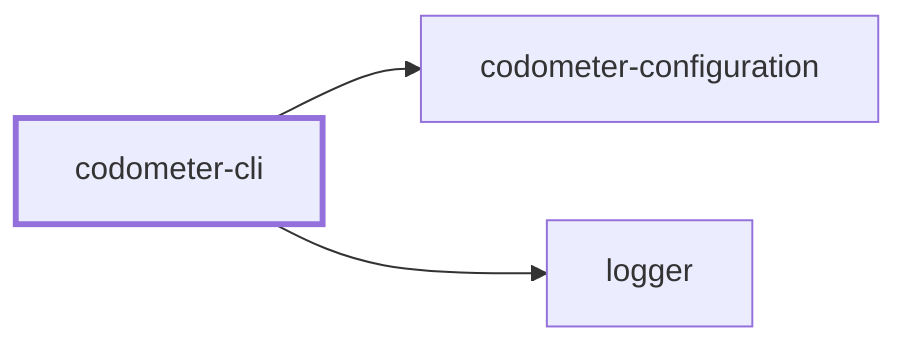
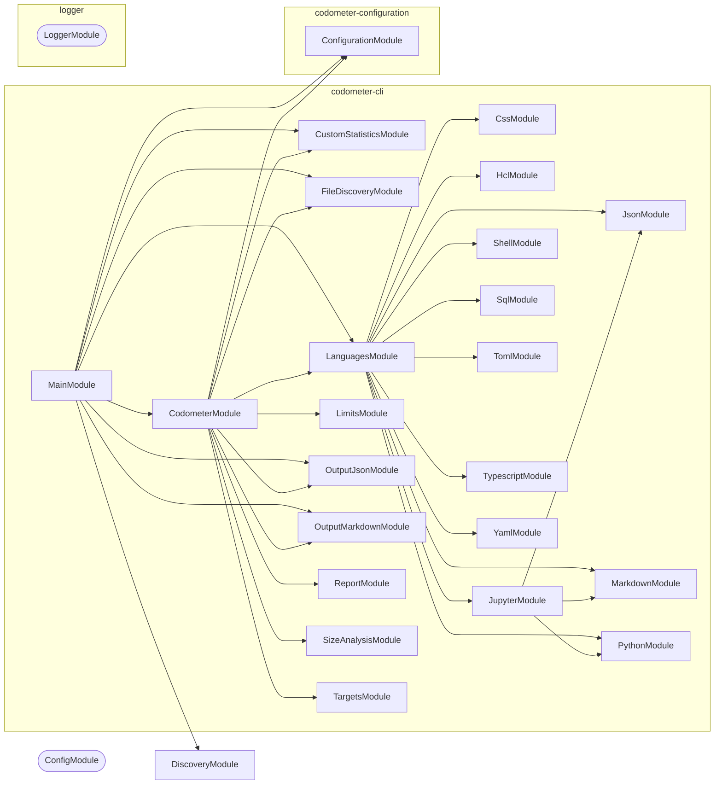

# ⏲️ Codometer

**Measure a repository and report what it found.**

Codometer walks a directory, parses everything it recognizes, and writes
what it counted as a markdown badge block, a JSON report, or both. It counts
languages the way you would expect — files, lines, classes, functions — and it
also counts the conventions a repository holds _itself_ to, which is usually
the more interesting number.

```bash
npm install --save-dev @codometer/cli
```

```bash
codometer
```

<!-- The badge block below this README's own Codometer section is produced by exactly this. -->

```markdown
### TypeScript & JavaScript


```

## Why

"1,034 source files" tells you almost nothing. "159 of them are services and
226 are the unit tests for them" tells you what the repository is actually made
of, and watching that ratio move tells you where it is going.

No language analyzer can produce the second number, because what a
`*.service.ts` means is a property of your repository rather than of
TypeScript. Codometer measures both halves: the built-in language counters, and
the ones you declare.

## Usage

```bash
codometer --directory . --config configuration/codometer.config.ts
```

| Flag | Purpose |
| ---- | ------- |
| `--check <set>` | Fail on a comma-separated set drawn from `reports` and `limits` |
| `--config [path]` | Configuration file to read; searched for when omitted |
| `-d, --directory [path]` | Directory to measure; defaults to the current one |
| `--json [path]` | The report goes here; the console when the path is omitted |
| `-m, --markdown [path]` | The rendered badges go here as a whole document; the console when the path is omitted |
| `--readme <path>` | Markdown file the badge block is spliced into, between its markers |
| `--write` | Write every resolved destination |

**`--write` and `--check` are independent.** Neither implies the other and no
combination of them is inferred, which is the whole of the surface:

| Invocation | Writes | Fails on staleness | Fails on a breach |
| ---------- | ------ | ------------------ | ----------------- |
| `codometer` | no | no | no |
| `codometer --check limits` | no | no | yes |
| `codometer --check reports` | no | yes | no |
| `codometer --check reports,limits` | no | yes | yes |
| `codometer --write` | yes | no | no |
| `codometer --write --check limits` | yes | no | yes, after writing |

A `--write` run that also gates produces **every** report before it fails, so
the report is on disk even when the gate trips. `--write --check reports` is
refused rather than obeyed: nothing can be stale in the run that just wrote it.
So is a `--check` value the tool does not know, and every complaint about one
command line is reported together rather than one run at a time.

A **breach** and **staleness** are different findings and are never reported as
one. A `warn` breach is printed and leaves the exit code alone; a `fail` breach
exits 1, but only where `--check limits` asked for a gate.

`--check reports` compares a committed report against a fresh measurement, so it
is only as stable as the numbers it re-measures. Compressed sizes are
Node-version dependent — the bundled zlib differs between releases — so a report
written on one runtime and checked on another reads as stale when nothing
changed at all. Check on the runtime the repository pins, or expect false
staleness rather than a real finding.

```yaml
- run: npx codometer --check reports,limits
```

## One folder at a time

Codometer measures **one directory**, and knows nothing about workspaces, task
runners, or project graphs. Run it in a project and that project is what gets
measured — its own sources, and whatever targets the configuration declares for
it:

```bash
cd packages/logger && codometer --check limits
```

With no `--config`, the configuration is found by walking upward from that
folder and taking the **first** file found. The nearest one wins outright:
nothing from a further ancestor is folded into it, because a merged
configuration leaves a limit that never applied looking exactly like one that
did.

So a project needs no configuration file of its own. One file at the top of a
workspace can describe every project beneath it by [exporting a
function](../codometer-configuration/README.md#a-configuration-that-answers-for-every-folder)
that reads the folder it was pointed at, and a project whose targets do not
follow that convention writes a configuration file that replaces it.

## What gets measured

Discovery walks the directory itself and reads every `.gitignore` it passes,
so **`.gitignore` is already in force** — a build directory or a virtual
environment is pruned where its ignore file names it, and no exclusion has to
name it again. Git is never invoked, so a directory that is not a repository
at all is measured the same way as one that is.

What is measured is the working tree rather than the index: a file that exists
and is not ignored counts, whether or not it has been committed yet.

| Group | Counts |
| ----- | ------ |
| Repository | Lines of code, repository size, folders, source files |
| TypeScript & JavaScript | Files, tests, classes, functions, methods, interfaces, generics, enums, constants, imports, decorators, exported symbols, doc comments, TODOs |
| Python | Files, lines, classes, functions, protocols, constants, imports, decorators, docstrings |
| Jupyter | Notebooks, cells by kind, executions, outputs, plus the code and prose inside them |
| JSON | Files, objects, arrays, properties, scalars by type, node count, max depth |
| YAML | Documents, mappings, sequences, keys, scalars, anchors, aliases, max depth |
| Markdown | Headings by level, paragraphs, lists, tables, links, images, code blocks, block quotes |
| SQL | Statements by kind — selects, inserts, updates, deletes, creates, joins, CTEs |
| Shell | Functions, variables, exports, conditionals, loops, pipelines, shebangs |
| TOML | Tables, array tables, keys, arrays |
| HCL | Blocks, resources, variables, outputs, attributes, interpolations |
| CSS | Rules, selectors, declarations, at-rules, media queries, custom properties |
| Conventions | Whatever you declare — see below |

Notebooks are measured by composition rather than by a fourth parser: the
document is handed to the JSON analyzer, its code cells to the Python analyzer,
and its markdown cells to the markdown analyzer, leaving only cells, outputs,
and executions for the notebook analyzer itself.

Python analysis runs through an interpreter, `python3` by default. Point it
elsewhere with `python: { command: "uv run python" }` when Python lives in a
virtual environment.

## Targets

The codebase is measured as a **target** — a named set of files — and `targets`
declares the others. A target names its files by glob, which is what lets one
measure compiled output: a directory every `.gitignore` claims, and therefore
the one place ignore rules must not reach.

```ts
targets: [
  {
    analyses: ["size"],
    compression: "gzip",
    exclude: ["dist/vendor/**"],
    include: ["dist/**/*.js", "!dist/**/*.map.js"],
    name: "compiled",
  },
],
```

| Field | Required | Default | Meaning |
| ----- | -------- | ------- | ------- |
| `name` | yes | — | What the target is called. Two targets may not share one |
| `include` | yes | — | Globs that add files. At least one must add rather than remove |
| `exclude` | no | none | Globs that remove files |
| `analyses` | yes | — | `language`, `size`, or both. At least one |
| `compression` | no | `gzip` | `gzip`, `brotli`, or `none` for the bytes on disk |
| `directory` | no | `.` | Where the target's globs start, relative to the measured directory |

`language` runs the analyzers above over the target's files. `size` compresses
each matched file on its own and sums the results — never all of them together
— at gzip level 9 or brotli quality 11, both stated rather than defaulted.

A `!` prefix in `include` removes files. Negations form one set applied to the
whole target rather than being read in order, so rearranging the array cannot
change what the target holds. Dot files are excluded unless a glob spells one
out, directories never match, and a file that was matched but cannot be read
fails the run rather than counting as zero bytes.

## Limits

A **limit** is how high one measured metric may go. Any metric can carry one — a
compressed size, a line count, a counter for one of the conventions below — and
a metric nothing limits is measured and reported exactly as before, gated by
nothing.

```ts
defaultTarget: "codebase",
limits: [
  { metric: "Compiled JavaScript.size", value: "8 KB" },
  { label: "Interfaces", metric: "typescript.interfaces", value: 500 },
  { metric: "linesOfCode", severity: "warn", value: 100_000 },
],
```

| Field | Required | Default | Meaning |
| ----- | -------- | ------- | ------- |
| `metric` | yes | — | Dotted path of the metric this limits |
| `value` | yes | — | How high the metric may go, as a number or a string with a unit |
| `severity` | no | `fail` | `fail` stops the run on a breach; `warn` reports it |
| `label` | no | the path | What to call the limit in a report |

A metric is addressed by the target's name followed by its path within that
target — `codebase.typescript.interfaces`, `codebase.markdown.files`,
`Compiled JavaScript.size`. Every target carries `files`, a target running size
analysis carries `size`, and one running language analysis carries every
counter the tables above list, with configured counters under `custom.<label>`.
Set `defaultTarget` and a path naming no target is read as that target's.

Where a `defaultTarget` is set, a path is read as that target's whenever no
target name prefixes it — so with `defaultTarget: "codebase"` and a target
called `typescript`, `typescript.interfaces` is the codebase's, because the
`typescript` target has no `interfaces` metric of its own to compete with it.
Write the target name in full wherever a target and a metric group share one.

**Ambiguity is refused, never resolved.** A path that could name two metrics —
a target called `markdown` beside the codebase's own `markdown.files` — fails
the run naming both readings, as does a path naming none, or one naming a
metric from an analysis the target never ran. A limit that quietly bound to the
wrong metric would look exactly like one that works.

A value written as a string carries a **decimal** unit whose trailing `b` is
required: `"8 KB"` is 8000 bytes and `"1 MB"` is 1000000, while `"8 K"` is not
a size and is refused rather than read as anything. A value nothing can read
fails the run instead of being taken as zero.

A target that matched **no files** fails the run if and only if a limit is
written against it. Declaring a limit asserts the files are there, so an empty
match is a glob that stopped matching or a build that never ran — while a
target nobody limited simply measured zero, which is unremarkable.

## Custom statistics

A repository that names files by convention has a vocabulary no analyzer knows
about. Declare it:

```ts
statistics: [
  { label: "Service Files", patterns: ["**/*.service.ts"] },
  { label: "Unit Tests", patterns: ["**/*.unit.test.ts"] },
  { color: "16a34a", label: "Migrations", patterns: ["**/migrations/*.sql"] },
];
```

Counters can also match _declarations_ rather than files, by shape:

```ts
statistics: [
  {
    group: "typescript",
    label: "Static Methods",
    symbols: { kinds: ["method"], modifiers: ["static"] },
  },
];
```

Each entry becomes one badge, in the order configured, rendered into the group
it names — `conventions` by default. Symbol counting happens during the walk
the TypeScript analyzer already makes, so any number of these costs one pass
over the sources.

The full reference — kinds, modifiers, colors, groups, and how `patterns`
narrows a symbol counter rather than being what it counts — is in
[**@codometer/configuration**](../codometer-configuration/README.md#custom-statistics).

## Output

Three sinks, none of which implies another:

| Sink | Flag | What lands there |
| ---- | ---- | ---------------- |
| Report | `--json [path]` | The structured report below |
| Document | `-m, --markdown [path]` | The rendered badges as a whole file |
| Splice | `--readme <path>` | The badge block, between two markers in a file somebody else wrote |

A sink whose path is omitted goes to the console, and so does any sink on a run
that neither writes nor compares — except the report, whose path is refused
outright on such a run rather than quietly diverted. With nothing named anywhere
— no flag, no configured destination — the badges go to the console, which is
what a bare `codometer` does.

**`--json <path>` is refused unless the run writes or compares it.** The path
names a file, and a run doing neither would render the report to the console and
leave that file unwritten — which is not noticed here at all, but downstream, by
whatever reads the report finding nothing and reporting a project that changed
nothing. The command line is refused before anything is measured, naming the
flag to add. A pathless `--json` is untouched: the console is what it asked for.

**A named destination stands for all of them.** `--json` on its own asks for
the report and nothing else, whatever the configuration file also describes.
Adding to the configured set instead would put a second document on the stream
the first one was piped out of.

**Standard output carries the result; every diagnostic goes to standard error.**
`codometer --json > report.json` has to produce a file something can parse, so a
log line never shares that stream — including the exclusion notice below, which
is still on the console and still in front of a human, just not inside the data.

**The splice sink's path is never defaulted.** Splicing rewrites a file
somebody else wrote the rest of, so a run that guessed the filename would edit
a document nobody pointed it at.

The rendered badges are a description paragraph followed by shields.io badges
under one `###` heading per language. A run scoped to one project puts its own
`##` section heading above all of it, inside the markers, because that block
lands in a document somebody else wrote the rest of and `###` groups with
nothing above them would read as a continuation of whatever section came
before. A run measuring a whole repository renders none: that README titles the
section above the markers itself. Beyond the language groups there is also —
for a run that measured a declared target — a `Measured Targets` group carrying
each target's size under the
compression it was measured with. That group is how a project's README reports
the size of what it ships; a run that declared no target renders no such group,
which is why the whole-repository report carries only its own `Repository Size`.

Spliced, the badges sit between two markers,
named `CODE_STATISTICS_START` and `CODE_STATISTICS_END` unless a configuration
renames them — as this example does, so that documenting the markers does not
make this document splice its own badges into the example:

```markdown
<!-- STATISTICS_START -->
<!-- STATISTICS_END -->
```

The block is appended when the markers are absent, and the file is created when
it does not exist. Both halves of that behavior are replaceable on their own —
`render` decides what markdown gets produced, `write` decides which file it
lands in and how — and supplying one keeps the built-in other. See
[markdown output](../codometer-configuration/README.md#markdown-output).

### What codometer writes, it does not measure

Every file a run would write is left out of what it measures, and the run says
so on the console. No configuration, and no ignore-file entry: codometer knows
its own destinations.

A badge is an image inside a link, so a spliced block moves `markdown.images`,
`markdown.links`, and `markdown.lines`, which moves the badges, which moves the
counts. Left in, a written report would be stale the moment it landed. The
exclusion is applied identically whatever the flags say, so a `--write` run and
a `--check reports` run always measure the same tree.

### The report

Codometer's own shape rather than any other tool's. Every metric carries its
value, and where something limits it, that limit's value, severity, and whether
it was breached — a limit that held is written out exactly like one that did
not, so a consumer can render the headroom rather than only the failures.

```json
{
  "failures": [
    {
      "kind": "limit",
      "reason": "Cannot bind the limit written against \"nowhere.at.all\": nothing measured answers to it.",
      "subject": "nowhere.at.all"
    }
  ],
  "targets": [
    {
      "empty": false,
      "files": 1,
      "metrics": [
        {
          "limits": [],
          "name": "compiled.files",
          "path": "files",
          "unit": null,
          "value": 1
        },
        {
          "limits": [
            { "breached": true, "label": null, "severity": "warn", "value": 900 },
            { "breached": true, "label": "Bundle", "severity": "fail", "value": 1000 }
          ],
          "name": "compiled.size",
          "path": "size",
          "unit": "bytes",
          "value": 5195
        }
      ],
      "name": "compiled"
    }
  ]
}
```

| Field | Meaning |
| ----- | ------- |
| `name` | The metric's name across runs — its target, then its path. The join key a later run is compared on |
| `path` | The metric's path within its target, with no target name on the front |
| `unit` | `"bytes"` where the value counts bytes, `null` for a plain count |
| `limits` | Every limit declared on the metric, in the order written. Empty where nothing limits it — never an absent key |
| `empty` | Said outright when a target's globs matched nothing |
| `failures` | Whatever the run could not do: a target that would not measure, a limit that bound to nothing |

**A metric may carry more than one limit.** The configuration accepts a `warn`
short of a `fail` on a single metric on purpose — that is how a repository sees
a number coming before it stops a change — and the gate enforces all of them, so
the report lists all of them. A consumer deciding what to show picks
deliberately: the `fail` limit is what stops a change, and a
breached `warn` beneath it is advice, not a failure.

**Byte values are raw and decimal.** A renderer showing kilobytes divides by
1000, the same units a limit written `"8 KB"` is read in.

**Nothing is signalled by a missing field.** A target that matched nothing says
`"empty": true` and any limit written against it joins `failures`, rather than
leaving a consumer to infer an empty match from an absent limit beside a
passing verdict.

A failure is neither a breach nor staleness: it is the run not having finished.
Every one of them is collected and reported together, so a configuration with
three broken limits is one run to diagnose rather than three. A failure fails
any run that writes or gates; a bare run reports it and exits clean, exactly as
the flag table promises.

## Project Graph

Where this project sits in the Nx project graph: what it depends on, and what depends on it. Regenerated by `nx run synchronization:nx-project-graphs:write`.

<!-- nx-project-graph-start -->



<!-- nx-project-graph-end -->

## Module Graph

The modules this project defines and the imports between them, published by `nx run synchronization:nestjs-module-graphs:write`.

<!-- nestjs-module-graph-start -->



_Rounded modules are global: every module can inject them, so their edges are left out._

<!-- nestjs-module-graph-end -->

## Packages

| Package | Role |
| ------- | ---- |
| [`@codometer/cli`](README.md) | Measures the repository and writes the reports. Knows nothing about any particular repository |
| [`@codometer/configuration`](../codometer-configuration/README.md) | Reads `codometer.config.ts` and resolves exclusions, output destinations, custom statistics, and the Python interpreter |

Which paths to skip, where the output goes, and how Python is reached are all
configuration. That split is what lets the CLI be a general tool rather than
one repository's script.

## Start

```bash
nx run codometer-cli:start
```

Pass the flags from [Usage](#usage) after `--`, so
`nx run codometer-cli:start -- --directory .` measures the current directory
from source.

## Test

```bash
nx run codometer-cli:vitest
```

## Contributing

```bash
nx run codometer-cli:build   # Compile
```

## License

MIT — see [LICENSE](../../LICENSE).

<!-- CALL_STACKS_START -->

## 🔭 Callidescope

Call stacks traced through `codometer-cli`, deepest first. Each frame shows what it takes, what it returns, and what its documentation says.

| Measure | Value |
| --- | --- |
| Callables | 325 |
| Files | 104 |
| Calls traced | 545 |
| Call stacks | 26 |
| Deepest stack | 13 |
| Stacks through recursion | 0 |
| Unfollowable calls | 11 |

### Call stacks (depth)

**1. `CodometerCommand.run`** — depth ≥ 13 · decorated-method

```text
🚀 CodometerCommand.run(_passedParameters: string[], options: CodometerCommandOptions): Promise<void> [packages/codometer-cli/src/modules/codometer/codometer.command.ts:453]
   ↳ Measure the repository and produce every resolved output.
  └─> CodometerService.measure(args: MeasureArguments): MeasurementResult [packages/codometer-cli/src/modules/codometer/codometer.service.ts:316]
     ↳ Measure the codebase and every target declared alongside it.
    └─> CodometerService.measureDeclaredTargets(…): { failures: ReportFailure[]; targets: TargetMeasurement[]; } [packages/codometer-cli/src/modules/codometer/codometer.service.ts:220]
       ↳ Measure every declared target, keeping whatever the failures leave.
      └─> CodometerService.measureTarget(args: MeasureTargetArguments): TargetMeasurement [packages/codometer-cli/src/modules/codometer/codometer.service.ts:256]
         ↳ Measure one declared target with whichever analyses it asked for.
        └─> CodometerService.analyzeLanguage(args: AnalyzeLanguageArguments): CodeStatisticsResult [packages/codometer-cli/src/modules/codometer/codometer.service.ts:59]
           ↳ Run every language analyzer over one target's files.
          └─> LanguagesService.analyze(args: AnalyzeLanguagesArguments): LanguageResults [packages/codometer-cli/src/modules/languages/languages.service.ts:54]
             ↳ Analyze every language present in the discovered files.
            └─> JupyterService.analyze(args: AnalyzeJupyterArguments): JupyterResult [packages/codometer-cli/src/modules/jupyter/jupyter.service.ts:166]
               ↳ Analyze the given notebooks, resolved against the directory.
              └─> JupyterService.collectParts(args: AnalyzeJupyterArguments): NotebookParts [packages/codometer-cli/src/modules/jupyter/jupyter.service.ts:88]
                 ↳ Read every notebook, collecting cell counts and cell sources.
                └─> JupyterService.readNotebook(…): { cell_type?: string | undefined; execution_count?: number | null | undefined; outputs?: unknown[] | undefined; source?: string | string[] | undefined; }[] | undefined [packages/codometer-cli/src/modules/jupyter/jupyter.service.ts:131]
                   ↳ Read and validate one notebook, returning its cells.
                  └─> LoggerService.warn(message: unknown, context?: string, data?: LogData): void [packages/logger/src/modules/logger/logger.service.ts:312]
                     ↳ Logs a warning message at the `warn` level.
                    └─> LoggerService.buildBindings(…): Record<string, unknown> [packages/logger/src/modules/logger/logger.service.ts:140]
                       ↳ Assembles the object pino merges into the line.
                      └─> LoggerService.assertConventionalMessage(args: { context: string | undefined; parsed: ParsedLogMessage; }): void [packages/logger/src/modules/logger/logger.service.ts:107]
                         ↳ Fails a malformed message in development, and never in production.
                        └─> LoggerService.isConventionalVerb(word: string): boolean [packages/logger/src/modules/logger/logger.service.ts:165]
                           ↳ Whether a word is a verb in one of the two tenses the convention allows.
```

**2. `OutputMarkdownService.renderBadges`** — depth 7 · orphan-root

```text
🚀 OutputMarkdownService.renderBadges(args: RenderBadgesArguments): string [packages/codometer-cli/src/modules/output-markdown/output-markdown.service.ts:250]
   ↳ Render the badge block for a destination, description and all.
  └─> OutputMarkdownService.renderDocument(args: RenderDocumentArguments): string [packages/codometer-cli/src/modules/output-markdown/output-markdown.service.ts:284]
     ↳ Render the badges as a document of their own.
    └─> OutputMarkdownService.buildBadgeGroups(args: RenderDocumentArguments): string [packages/codometer-cli/src/modules/output-markdown/output-markdown.service.ts:102]
       ↳ Assemble the badge groups, in the order they are rendered.
      └─> buildTargetsGroup(targets: readonly TargetSize[]): string [packages/codometer-cli/src/modules/output-markdown/output-markdown.utilities.ts:305]
         ↳ Renders the Measured Targets badge group, one badge per measured target.
        └─> map(…)(target: TargetSize): string [packages/codometer-cli/src/modules/output-markdown/output-markdown.utilities.ts:316]
          └─> formatTargetSize(target: TargetSize): string [packages/codometer-cli/src/modules/output-markdown/output-markdown.utilities.ts:419]
             ↳ Formats one target's measured size, naming the compression it was measured under unless there was none.
            └─> formatBytes(bytes: number): string [packages/codometer-cli/src/modules/output-markdown/output-markdown.utilities.ts:403]
               ↳ Formats a byte count in decimal units, switching to megabytes once kilobytes read awkwardly.
```

**3. `OutputMarkdownService.syncAnchoredBlock`** — depth ≥ 6 · orphan-root

```text
🚀 OutputMarkdownService.syncAnchoredBlock(args: SyncAnchoredBlockArguments): boolean [packages/codometer-cli/src/modules/output-markdown/output-markdown.service.ts:183]
   ↳ Splice the anchored block into a file, or report whether it is current.
  └─> OutputMarkdownService.writeMarkdownFile(resolvedPath: string, content: string): void [packages/codometer-cli/src/modules/output-markdown/output-markdown.service.ts:234]
     ↳ Write markdown to a file, and record that it happened.
    └─> LoggerService.info(message: unknown, context?: string, data?: LogData): void [packages/logger/src/modules/logger/logger.service.ts:276]
       ↳ Logs an informational message at the `info` level.
      └─> LoggerService.buildBindings(…): Record<string, unknown> [packages/logger/src/modules/logger/logger.service.ts:140]
         ↳ Assembles the object pino merges into the line.
        └─> LoggerService.assertConventionalMessage(args: { context: string | undefined; parsed: ParsedLogMessage; }): void [packages/logger/src/modules/logger/logger.service.ts:107]
           ↳ Fails a malformed message in development, and never in production.
          └─> LoggerService.isConventionalVerb(word: string): boolean [packages/logger/src/modules/logger/logger.service.ts:165]
             ↳ Whether a word is a verb in one of the two tenses the convention allows.
```

<details>
<summary>23 more call stacks</summary>

**4. `TypescriptService.handleEnum`** — depth 3 · orphan-root

```text
🚀 TypescriptService.handleEnum(node: tsCompiler.Node, stats: TypescriptResult): void [packages/codometer-cli/src/modules/typescript/typescript.service.ts:250]
   ↳ Increments enum and exported counts for an enum declaration node.
  └─> TypescriptService.hasExportKeyword(node: tsCompiler.Node): boolean [packages/codometer-cli/src/modules/typescript/typescript.service.ts:346]
     ↳ Returns true when the node has an export modifier keyword.
    └─> TypescriptService.some(…)(modifier: tsCompiler.Modifier): modifier is tsCompiler.ExportKeyword [packages/codometer-cli/src/modules/typescript/typescript.service.ts:352]
```

**5. `TypescriptService.handleFunction`** — depth 3 · orphan-root

```text
🚀 TypescriptService.handleFunction(node: tsCompiler.Node, stats: TypescriptResult, insideClass: boolean): void [packages/codometer-cli/src/modules/typescript/typescript.service.ts:256]
   ↳ Increments function, method, async, sync, exported, and generic counts for a function node.
  └─> TypescriptService.hasExportKeyword(node: tsCompiler.Node): boolean [packages/codometer-cli/src/modules/typescript/typescript.service.ts:346]
     ↳ Returns true when the node has an export modifier keyword.
    └─> TypescriptService.some(…)(modifier: tsCompiler.Modifier): modifier is tsCompiler.ExportKeyword [packages/codometer-cli/src/modules/typescript/typescript.service.ts:352]
```

**6. `TypescriptService.handleInterface`** — depth 3 · orphan-root

```text
🚀 TypescriptService.handleInterface(node: tsCompiler.Node, stats: TypescriptResult): void [packages/codometer-cli/src/modules/typescript/typescript.service.ts:290]
   ↳ Increments interface, exported, and generic counts for an interface declaration node.
  └─> TypescriptService.hasExportKeyword(node: tsCompiler.Node): boolean [packages/codometer-cli/src/modules/typescript/typescript.service.ts:346]
     ↳ Returns true when the node has an export modifier keyword.
    └─> TypescriptService.some(…)(modifier: tsCompiler.Modifier): modifier is tsCompiler.ExportKeyword [packages/codometer-cli/src/modules/typescript/typescript.service.ts:352]
```

**7. `TypescriptService.handleMethodOrAccessor`** — depth 3 · orphan-root

```text
🚀 TypescriptService.handleMethodOrAccessor(node: tsCompiler.Node, stats: TypescriptResult): void [packages/codometer-cli/src/modules/typescript/typescript.service.ts:300]
   ↳ Increments method and async or sync counts for a method or accessor node.
  └─> TypescriptService.hasAsyncKeyword(node: tsCompiler.Node): boolean [packages/codometer-cli/src/modules/typescript/typescript.service.ts:334]
     ↳ Returns true when the node has an async modifier keyword.
    └─> TypescriptService.some(…)(modifier: tsCompiler.Modifier): modifier is tsCompiler.AsyncKeyword [packages/codometer-cli/src/modules/typescript/typescript.service.ts:340]
```

**8. `TypescriptService.handleTypeAlias`** — depth 3 · orphan-root

```text
🚀 TypescriptService.handleTypeAlias(node: tsCompiler.Node, stats: TypescriptResult): void [packages/codometer-cli/src/modules/typescript/typescript.service.ts:313]
   ↳ Increments exported and generic counts for a type alias declaration node.
  └─> TypescriptService.hasExportKeyword(node: tsCompiler.Node): boolean [packages/codometer-cli/src/modules/typescript/typescript.service.ts:346]
     ↳ Returns true when the node has an export modifier keyword.
    └─> TypescriptService.some(…)(modifier: tsCompiler.Modifier): modifier is tsCompiler.ExportKeyword [packages/codometer-cli/src/modules/typescript/typescript.service.ts:352]
```

**9. `TypescriptService.handleVariable`** — depth 3 · orphan-root

```text
🚀 TypescriptService.handleVariable(node: tsCompiler.Node, stats: TypescriptResult): void [packages/codometer-cli/src/modules/typescript/typescript.service.ts:322]
   ↳ Increments constant and exported counts for a const variable statement.
  └─> TypescriptService.hasExportKeyword(node: tsCompiler.Node): boolean [packages/codometer-cli/src/modules/typescript/typescript.service.ts:346]
     ↳ Returns true when the node has an export modifier keyword.
    └─> TypescriptService.some(…)(modifier: tsCompiler.Modifier): modifier is tsCompiler.ExportKeyword [packages/codometer-cli/src/modules/typescript/typescript.service.ts:352]
```

**10. `main`** — depth ≥ 2 · module-bootstrap

```text
🚀 main(): Promise<void> [packages/codometer-cli/src/main.ts:17]
   ↳ Bootstraps the codometer CLI command application.
  └─> LoggerService.logToStandardError(): void [packages/logger/src/modules/logger/logger.service.ts:202]
     ↳ Sends every subsequent line to standard error instead of standard output.
```

**11. `FileDiscoveryService.constructor`** — depth 2 · orphan-root

```text
🚀 FileDiscoveryService.constructor(…): FileDiscoveryService [packages/codometer-cli/src/modules/file-discovery/file-discovery.service.ts:40]
  └─> LoggerService.setContext(context: string): void [packages/logger/src/modules/logger/logger.service.ts:297]
     ↳ Sets the context label included in every subsequent log line.
```

**12. `CssService.constructor`** — depth 2 · orphan-root

```text
🚀 CssService.constructor(logger: LoggerService): CssService [packages/codometer-cli/src/modules/css/css.service.ts:28]
  └─> LoggerService.setContext(context: string): void [packages/logger/src/modules/logger/logger.service.ts:297]
     ↳ Sets the context label included in every subsequent log line.
```

**13. `HclService.constructor`** — depth 2 · orphan-root

```text
🚀 HclService.constructor(logger: LoggerService): HclService [packages/codometer-cli/src/modules/hcl/hcl.service.ts:30]
  └─> LoggerService.setContext(context: string): void [packages/logger/src/modules/logger/logger.service.ts:297]
     ↳ Sets the context label included in every subsequent log line.
```

**14. `JsonService.constructor`** — depth 2 · orphan-root

```text
🚀 JsonService.constructor(logger: LoggerService): JsonService [packages/codometer-cli/src/modules/json/json.service.ts:19]
  └─> LoggerService.setContext(context: string): void [packages/logger/src/modules/logger/logger.service.ts:297]
     ↳ Sets the context label included in every subsequent log line.
```

**15. `MarkdownService.constructor`** — depth 2 · orphan-root

```text
🚀 MarkdownService.constructor(logger: LoggerService): MarkdownService [packages/codometer-cli/src/modules/markdown/markdown.service.ts:31]
  └─> LoggerService.setContext(context: string): void [packages/logger/src/modules/logger/logger.service.ts:297]
     ↳ Sets the context label included in every subsequent log line.
```

**16. `PythonService.constructor`** — depth 2 · orphan-root

```text
🚀 PythonService.constructor(logger: LoggerService): PythonService [packages/codometer-cli/src/modules/python/python.service.ts:28]
  └─> LoggerService.setContext(context: string): void [packages/logger/src/modules/logger/logger.service.ts:297]
     ↳ Sets the context label included in every subsequent log line.
```

**17. `JupyterService.constructor`** — depth 2 · orphan-root

```text
🚀 JupyterService.constructor(…): JupyterService [packages/codometer-cli/src/modules/jupyter/jupyter.service.ts:41]
  └─> LoggerService.setContext(context: string): void [packages/logger/src/modules/logger/logger.service.ts:297]
     ↳ Sets the context label included in every subsequent log line.
```

**18. `ShellService.constructor`** — depth 2 · orphan-root

```text
🚀 ShellService.constructor(logger: LoggerService): ShellService [packages/codometer-cli/src/modules/shell/shell.service.ts:34]
  └─> LoggerService.setContext(context: string): void [packages/logger/src/modules/logger/logger.service.ts:297]
     ↳ Sets the context label included in every subsequent log line.
```

**19. `SqlService.constructor`** — depth 2 · orphan-root

```text
🚀 SqlService.constructor(logger: LoggerService): SqlService [packages/codometer-cli/src/modules/sql/sql.service.ts:30]
  └─> LoggerService.setContext(context: string): void [packages/logger/src/modules/logger/logger.service.ts:297]
     ↳ Sets the context label included in every subsequent log line.
```

**20. `TomlService.constructor`** — depth 2 · orphan-root

```text
🚀 TomlService.constructor(logger: LoggerService): TomlService [packages/codometer-cli/src/modules/toml/toml.service.ts:30]
  └─> LoggerService.setContext(context: string): void [packages/logger/src/modules/logger/logger.service.ts:297]
     ↳ Sets the context label included in every subsequent log line.
```

**21. `YamlService.constructor`** — depth 2 · orphan-root

```text
🚀 YamlService.constructor(logger: LoggerService): YamlService [packages/codometer-cli/src/modules/yaml/yaml.service.ts:35]
  └─> LoggerService.setContext(context: string): void [packages/logger/src/modules/logger/logger.service.ts:297]
     ↳ Sets the context label included in every subsequent log line.
```

**22. `OutputJsonService.constructor`** — depth 2 · orphan-root

```text
🚀 OutputJsonService.constructor(logger: LoggerService): OutputJsonService [packages/codometer-cli/src/modules/output-json/output-json.service.ts:26]
  └─> LoggerService.setContext(context: string): void [packages/logger/src/modules/logger/logger.service.ts:297]
     ↳ Sets the context label included in every subsequent log line.
```

**23. `OutputMarkdownService.constructor`** — depth 2 · orphan-root

```text
🚀 OutputMarkdownService.constructor(logger: LoggerService): OutputMarkdownService [packages/codometer-cli/src/modules/output-markdown/output-markdown.service.ts:52]
  └─> LoggerService.setContext(context: string): void [packages/logger/src/modules/logger/logger.service.ts:297]
     ↳ Sets the context label included in every subsequent log line.
```

**24. `SizeAnalysisService.constructor`** — depth 2 · orphan-root

```text
🚀 SizeAnalysisService.constructor(logger: LoggerService): SizeAnalysisService [packages/codometer-cli/src/modules/size-analysis/size-analysis.service.ts:22]
  └─> LoggerService.setContext(context: string): void [packages/logger/src/modules/logger/logger.service.ts:297]
     ↳ Sets the context label included in every subsequent log line.
```

**25. `TargetsService.constructor`** — depth 2 · orphan-root

```text
🚀 TargetsService.constructor(logger: LoggerService): TargetsService [packages/codometer-cli/src/modules/targets/targets.service.ts:32]
  └─> LoggerService.setContext(context: string): void [packages/logger/src/modules/logger/logger.service.ts:297]
     ↳ Sets the context label included in every subsequent log line.
```

**26. `CodometerCommand.constructor`** — depth ≥ 2 · orphan-root

```text
🚀 CodometerCommand.constructor(…): CodometerCommand [packages/codometer-cli/src/modules/codometer/codometer.command.ts:39]
  └─> LoggerService.setContext(context: string): void [packages/logger/src/modules/logger/logger.service.ts:297]
     ↳ Sets the context label included in every subsequent log line.
```

</details>

### Module spread

| Callable | Spread | Calls directly | Location |
| --- | --- | --- | --- |
| `CodometerService.measureTarget` | 18 | `codometer-cli:modules/file-discovery`, `codometer-cli:modules/size-analysis`, `codometer-cli:modules/targets` | `packages/codometer-cli/src/modules/codometer/codometer.service.ts:256` |
| `CodometerService.analyzeLanguage` | 16 | `codometer-cli:modules/custom-statistics`, `codometer-cli:modules/languages`, `codometer-cli:modules/size-analysis` | `packages/codometer-cli/src/modules/codometer/codometer.service.ts:59` |
| `LanguagesService.analyze` | 13 | `codometer-cli:modules/css`, `codometer-cli:modules/hcl`, `codometer-cli:modules/json`, `codometer-cli:modules/jupyter`, `codometer-cli:modules/markdown`, `codometer-cli:modules/python`, `codometer-cli:modules/shell`, `codometer-cli:modules/sql`, `codometer-cli:modules/toml`, `codometer-cli:modules/typescript`, `codometer-cli:modules/yaml` | `packages/codometer-cli/src/modules/languages/languages.service.ts:54` |
| `JupyterService.analyze` | 5 | `codometer-cli:modules/json`, `codometer-cli:modules/markdown`, `codometer-cli:modules/python` | `packages/codometer-cli/src/modules/jupyter/jupyter.service.ts:166` |

### Direct fan-out (breadth)

| Callable | Breadth | Calls directly | Location |
| --- | --- | --- | --- |
| `OutputMarkdownService.buildBadgeGroups` | 16 | `OutputMarkdownService.filter(…)`, `buildRepositoryGroup`, `buildTargetsGroup`, `buildTypescriptGroup`, `buildJavascriptGroup`, `buildPythonGroup`, `buildJsonGroup`, `buildYamlGroup`, `buildTomlGroup`, `buildShellGroup`, `buildSqlGroup`, `buildHclGroup`, `buildCssGroup`, `buildCustomGroup`, `buildJupyterGroup`, `buildMarkdownGroup` | `packages/codometer-cli/src/modules/output-markdown/output-markdown.service.ts:102` |
| `CodometerCommand.run` | 12 | `CodometerCommand.resolveWorkingDirectory`, `RunPlanService.selectMode`, `LoggerService.error`, `CodometerCommand.readConfiguration`, `RunPlanService.resolveDestinations`, `RunPlanService.listOutputPaths`, `CodometerCommand.announceOutputPaths`, `CodometerService.measure`, `ReportService.build`, `CodometerCommand.deliver`, `RunPlanService.selectScope`, `CodometerCommand.reportFindings` | `packages/codometer-cli/src/modules/codometer/codometer.command.ts:453` |
| `LanguagesService.analyze` | 11 | `CssService.analyze`, `HclService.analyze`, `JsonService.analyze`, `JupyterService.analyze`, `MarkdownService.analyze`, `PythonService.analyze`, `ShellService.analyze`, `SqlService.analyze`, `TomlService.analyze`, `TypescriptService.analyze`, `YamlService.analyze` | `packages/codometer-cli/src/modules/languages/languages.service.ts:54` |

<details>
<summary>167 more callables</summary>

| Callable | Breadth | Calls directly | Location |
| --- | --- | --- | --- |
| `CodometerService.measure` | 8 | `CodometerService.discoverCodebase`, `CodometerService.analyzeLanguage`, `FileDiscoveryService.categorize`, `CodometerService.measureDeclaredTargets`, `MetricIndexService.index`, `LimitsService.evaluate`, `CodometerService.map(…)`, `CodometerService.readLimitFailures` | `packages/codometer-cli/src/modules/codometer/codometer.service.ts:316` |
| `TargetsService.matchFiles` | 7 | `TargetsService.findBoundary`, `TargetsService.sitsInsideBoundary`, `TargetOutsideRepositoryError.constructor`, `TargetsService.readTargetPrefix`, `TargetsService.walk`, `TargetsService.map(…)`, `TargetsService.map(…)` | `packages/codometer-cli/src/modules/targets/targets.service.ts:281` |
| `CodometerService.analyzeLanguage` | 7 | `LanguagesService.analyze`, `CustomStatisticsService.buildSymbolCounters`, `SizeAnalysisService.analyze`, `CustomStatisticsService.analyze`, `CodometerService.getFolderCount`, `CodometerService.buildJavascriptStatistics`, `CodometerService.buildTypescriptStatistics` | `packages/codometer-cli/src/modules/codometer/codometer.service.ts:59` |
| `FileDiscoveryService.categorize` | 6 | `FileDiscoveryService.filter(…)`, `FileDiscoveryService.filterByExtension`, `FileDiscoveryService.filter(…)`, `FileDiscoveryService.filter(…)`, `FileDiscoveryService.filter(…)`, `FileDiscoveryService.filter(…)` | `packages/codometer-cli/src/modules/file-discovery/file-discovery.service.ts:285` |
| `OutputMarkdownService.syncAnchoredBlock` | 6 | `MissingMarkdownPathError.constructor`, `OutputMarkdownService.readExisting`, `OutputMarkdownService.wrapInAnchors`, `OutputMarkdownService.buildBlockRegex`, `OutputMarkdownService.writeMarkdownFile`, `OutputMarkdownService.replace(…)` | `packages/codometer-cli/src/modules/output-markdown/output-markdown.service.ts:183` |
| `CodometerService.measureTarget` | 6 | `CodometerService.excludeOutputPaths`, `TargetsService.matchFiles`, `CodometerService.runsAnalysis`, `CodometerService.analyzeLanguage`, `FileDiscoveryService.categorize`, `SizeAnalysisService.analyze` | `packages/codometer-cli/src/modules/codometer/codometer.service.ts:256` |
| `JsonService.countNode` | 5 | `JsonService.isArrayNode`, `JsonService.countArrayNode`, `JsonService.isRecordNode`, `JsonService.countRecordNode`, `JsonService.countPrimitiveNode` | `packages/codometer-cli/src/modules/json/json.service.ts:111` |
| `JupyterService.analyze` | 5 | `JupyterService.collectParts`, `JsonService.analyze`, `PythonService.analyzeContents`, `MarkdownService.analyzeContents`, `JupyterService.countHeadings` | `packages/codometer-cli/src/modules/jupyter/jupyter.service.ts:166` |
| `TypescriptService.walkNode` | 5 | `TypescriptService.countSymbols`, `TypescriptService.handleClass`, `TypescriptService.forEachChild(…)`, `TypescriptService.dispatchNode`, `TypescriptService.forEachChild(…)` | `packages/codometer-cli/src/modules/typescript/typescript.service.ts:393` |
| `LimitsService.resolve` | 5 | `LimitsService.findCandidates`, `UnboundMetricError.constructor`, `LimitsService.describeTargets`, `LimitsService.map(…)`, `EmptyTargetError.constructor` | `packages/codometer-cli/src/modules/limits/limits.service.ts:154` |
| `CodometerCommand.reportBreaches` | 5 | `CodometerCommand.filter(…)`, `CodometerCommand.filter(…)`, `CodometerCommand.filter(…)`, `LoggerService.warn`, `LoggerService.error` | `packages/codometer-cli/src/modules/codometer/codometer.command.ts:250` |
| `CodometerCommand.reportFindings` | 5 | `CodometerCommand.reportFailures`, `CodometerCommand.reportStaleness`, `CodometerCommand.reportBreaches`, `LoggerService.info`, `CodometerCommand.filter(…)` | `packages/codometer-cli/src/modules/codometer/codometer.command.ts:294` |
| `FileDiscoveryService.walkDirectory` | 4 | `FileDiscoveryService.readDirectoryEntries`, `FileDiscoveryService.applyDirectoryIgnoreFile`, `FileDiscoveryService.walkSubdirectory`, `FileDiscoveryService.isIgnoredPath` | `packages/codometer-cli/src/modules/file-discovery/file-discovery.service.ts:217` |
| `JsonService.consumeJsoncCharacter` | 4 | `JsonService.handleLineCommentState`, `JsonService.handleBlockCommentState`, `JsonService.handleStringState`, `JsonService.consumeCharacterOutsideComments` | `packages/codometer-cli/src/modules/json/json.service.ts:66` |
| `JsonService.analyze` | 4 | `JsonService.filter(…)`, `JsonService.parseDocuments`, `JsonService.countNode`, `LoggerService.warn` | `packages/codometer-cli/src/modules/json/json.service.ts:310` |
| `SqlService.analyze` | 4 | `SqlService.stripComments`, `SqlService.filter(…)`, `SqlService.countKeywords`, `LoggerService.warn` | `packages/codometer-cli/src/modules/sql/sql.service.ts:63` |
| `TypescriptService.createEmptyResult` | 4 | `TypescriptService.filter(…)`, `TypescriptService.map(…)`, `TypescriptService.filter(…)`, `TypescriptService.filter(…)` | `packages/codometer-cli/src/modules/typescript/typescript.service.ts:162` |
| `buildRepositoryGroup` | 4 | `buildGroup`, `buildBadge`, `formatBytes`, `buildCustomBadges` | `packages/codometer-cli/src/modules/output-markdown/output-markdown.utilities.ts:234` |
| `TargetsService.walk` | 4 | `TargetsService.readEntries`, `TargetsService.resolveEntryKind`, `TargetsService.canDescend`, `TargetsService.isMatched` | `packages/codometer-cli/src/modules/targets/targets.service.ts:238` |
| `RunPlanService.readCheckNames` | 4 | `RunPlanService.describeAcceptedCheckNames`, `RunPlanService.filter(…)`, `RunPlanService.map(…)`, `RunPlanService.validateCheckNames` | `packages/codometer-cli/src/modules/codometer/run-plan.service.ts:80` |
| `RunPlanService.resolveDestinations` | 4 | `RunPlanService.namesDestination`, `RunPlanService.resolveJson`, `RunPlanService.resolveMarkdown`, `RunPlanService.resolveReadme` | `packages/codometer-cli/src/modules/codometer/run-plan.service.ts:308` |
| `CodometerCommand.deliverMarkdown` | 4 | `OutputMarkdownService.renderDocument`, `CodometerCommand.readTargetSizes`, `CodometerCommand.touchesFiles`, `OutputMarkdownService.syncDocument` | `packages/codometer-cli/src/modules/codometer/codometer.command.ts:126` |
| `CodometerCommand.deliverReadme` | 4 | `CodometerCommand.readTargetSizes`, `CodometerCommand.touchesFiles`, `OutputMarkdownService.renderBlock`, `OutputMarkdownService.sync` | `packages/codometer-cli/src/modules/codometer/codometer.command.ts:158` |
| `FileDiscoveryService.listDiscoveredFiles` | 3 | `FileDiscoveryService.walkDirectory`, `FileDiscoveryService.readExcludeFromScopes`, `FileDiscoveryService.filter(…)` | `packages/codometer-cli/src/modules/file-discovery/file-discovery.service.ts:145` |
| `FileDiscoveryService.walkSubdirectory` | 3 | `FileDiscoveryService.isExhaustivelyExcluded`, `FileDiscoveryService.isIgnoredPath`, `FileDiscoveryService.walkDirectory` | `packages/codometer-cli/src/modules/file-discovery/file-discovery.service.ts:261` |
| `JsonService.parseDocuments` | 3 | `JsonService.map(…)`, `JsonService.filter(…)`, `JsonService.stripJsoncComments` | `packages/codometer-cli/src/modules/json/json.service.ts:258` |
| `TomlService.analyze` | 3 | `TomlService.countLine`, `TomlService.isInsideMultilineString`, `LoggerService.warn` | `packages/codometer-cli/src/modules/toml/toml.service.ts:98` |
| `TypescriptService.analyzeFile` | 3 | `TypescriptService.getScriptKind`, `TypescriptService.scanComments`, `TypescriptService.walkNode` | `packages/codometer-cli/src/modules/typescript/typescript.service.ts:77` |
| `TypescriptService.handleFunction` | 3 | `TypescriptService.hasExportKeyword`, `TypescriptService.hasAsyncKeyword`, `TypescriptService.hasTypeParameters` | `packages/codometer-cli/src/modules/typescript/typescript.service.ts:256` |
| `TypescriptService.analyze` | 3 | `TypescriptService.createEmptyResult`, `TypescriptService.analyzeFile`, `TypescriptService.getCountersForFile` | `packages/codometer-cli/src/modules/typescript/typescript.service.ts:418` |
| `LimitsService.findDefaultCandidate` | 3 | `UnboundMetricError.constructor`, `LimitsService.describeTargets`, `LimitsService.bind` | `packages/codometer-cli/src/modules/limits/limits.service.ts:122` |
| `OutputJsonService.sync` | 3 | `OutputJsonService.render`, `OutputJsonService.readExisting`, `LoggerService.info` | `packages/codometer-cli/src/modules/output-json/output-json.service.ts:67` |
| `buildCssGroup` | 3 | `buildGroup`, `buildBadge`, `buildCustomBadges` | `packages/codometer-cli/src/modules/output-markdown/output-markdown.utilities.ts:21` |
| `buildHclGroup` | 3 | `buildGroup`, `buildBadge`, `buildCustomBadges` | `packages/codometer-cli/src/modules/output-markdown/output-markdown.utilities.ts:87` |
| `buildJsonGroup` | 3 | `buildGroup`, `buildBadge`, `buildCustomBadges` | `packages/codometer-cli/src/modules/output-markdown/output-markdown.utilities.ts:127` |
| `buildJupyterGroup` | 3 | `buildGroup`, `buildBadge`, `buildCustomBadges` | `packages/codometer-cli/src/modules/output-markdown/output-markdown.utilities.ts:148` |
| `buildMarkdownGroup` | 3 | `buildGroup`, `buildBadge`, `buildCustomBadges` | `packages/codometer-cli/src/modules/output-markdown/output-markdown.utilities.ts:177` |
| `buildPythonGroup` | 3 | `buildGroup`, `buildBadge`, `buildCustomBadges` | `packages/codometer-cli/src/modules/output-markdown/output-markdown.utilities.ts:206` |
| `buildShellGroup` | 3 | `buildGroup`, `buildBadge`, `buildCustomBadges` | `packages/codometer-cli/src/modules/output-markdown/output-markdown.utilities.ts:252` |
| `buildSqlGroup` | 3 | `buildGroup`, `buildBadge`, `buildCustomBadges` | `packages/codometer-cli/src/modules/output-markdown/output-markdown.utilities.ts:272` |
| `buildTomlGroup` | 3 | `buildGroup`, `buildBadge`, `buildCustomBadges` | `packages/codometer-cli/src/modules/output-markdown/output-markdown.utilities.ts:323` |
| `buildTypescriptGroup` | 3 | `buildGroup`, `buildBadge`, `buildCustomBadges` | `packages/codometer-cli/src/modules/output-markdown/output-markdown.utilities.ts:339` |
| `buildYamlGroup` | 3 | `buildGroup`, `buildBadge`, `buildCustomBadges` | `packages/codometer-cli/src/modules/output-markdown/output-markdown.utilities.ts:354` |
| `ReportService.buildMetrics` | 3 | `ReportService.buildMetricName`, `ReportService.map(…)`, `ReportService.readUnit` | `packages/codometer-cli/src/modules/report/report.service.ts:52` |
| `SizeAnalysisService.measureFile` | 3 | `SizeAnalysisService.compress`, `LoggerService.error`, `UnreadableTargetFileError.constructor` | `packages/codometer-cli/src/modules/size-analysis/size-analysis.service.ts:60` |
| `CodometerCommand.deliver` | 3 | `CodometerCommand.deliverJson`, `CodometerCommand.deliverMarkdown`, `CodometerCommand.deliverReadme` | `packages/codometer-cli/src/modules/codometer/codometer.command.ts:86` |
| `CodometerCommand.deliverJson` | 3 | `CodometerCommand.touchesFiles`, `OutputJsonService.render`, `OutputJsonService.sync` | `packages/codometer-cli/src/modules/codometer/codometer.command.ts:97` |
| `CodometerCommand.readConfiguration` | 3 | `ConfigurationService.loadConfiguration`, `LoggerService.debug`, `LoggerService.error` | `packages/codometer-cli/src/modules/codometer/codometer.command.ts:198` |
| `main` | 3 | `LoggerService.logToStandardError`, `LoggerService.constructor`, `LoggerService.setContext` | `packages/codometer-cli/src/main.ts:17` |
| `FileDiscoveryService.readExcludeFromScopes` | 2 | `IgnoreRulesService.readScope`, `LoggerService.warn` | `packages/codometer-cli/src/modules/file-discovery/file-discovery.service.ts:187` |
| `FileDiscoveryService.discoverFiles` | 2 | `FileDiscoveryService.categorize`, `FileDiscoveryService.listDiscoveredFiles` | `packages/codometer-cli/src/modules/file-discovery/file-discovery.service.ts:317` |
| `CssService.analyze` | 2 | `CssService.walk(…)`, `LoggerService.warn` | `packages/codometer-cli/src/modules/css/css.service.ts:74` |
| `HclService.analyze` | 2 | `HclService.countLine`, `LoggerService.warn` | `packages/codometer-cli/src/modules/hcl/hcl.service.ts:87` |
| `MarkdownService.countNode` | 2 | `MarkdownService.countHeading`, `MarkdownService.countListItem` | `packages/codometer-cli/src/modules/markdown/markdown.service.ts:62` |
| `MarkdownService.analyze` | 2 | `LoggerService.warn`, `MarkdownService.analyzeContents` | `packages/codometer-cli/src/modules/markdown/markdown.service.ts:98` |
| `PythonService.analyzeContents` | 2 | `PythonService.map(…)`, `PythonService.analyze` | `packages/codometer-cli/src/modules/python/python.service.ts:87` |
| `JupyterService.collectParts` | 2 | `JupyterService.readNotebook`, `JupyterService.collectCell` | `packages/codometer-cli/src/modules/jupyter/jupyter.service.ts:88` |
| `ShellService.analyze` | 2 | `ShellService.countLine`, `LoggerService.warn` | `packages/codometer-cli/src/modules/shell/shell.service.ts:93` |
| `SqlService.stripComments` | 2 | `SqlService.replaceAll(…)`, `SqlService.replaceAll(…)` | `packages/codometer-cli/src/modules/sql/sql.service.ts:48` |
| `TypescriptService.countSymbols` | 2 | `TypescriptService.getSymbolModifiers`, `TypescriptService.every(…)` | `packages/codometer-cli/src/modules/typescript/typescript.service.ts:132` |
| `TypescriptService.handleClass` | 2 | `TypescriptService.hasExportKeyword`, `TypescriptService.hasTypeParameters` | `packages/codometer-cli/src/modules/typescript/typescript.service.ts:243` |
| `TypescriptService.handleInterface` | 2 | `TypescriptService.hasExportKeyword`, `TypescriptService.hasTypeParameters` | `packages/codometer-cli/src/modules/typescript/typescript.service.ts:290` |
| `TypescriptService.handleTypeAlias` | 2 | `TypescriptService.hasExportKeyword`, `TypescriptService.hasTypeParameters` | `packages/codometer-cli/src/modules/typescript/typescript.service.ts:313` |
| `YamlService.countDocument` | 2 | `YamlService.countComments`, `YamlService.countNode` | `packages/codometer-cli/src/modules/yaml/yaml.service.ts:88` |
| `YamlService.countNode` | 2 | `YamlService.countComments`, `YamlService.countCollection` | `packages/codometer-cli/src/modules/yaml/yaml.service.ts:95` |
| `YamlService.analyze` | 2 | `YamlService.countDocument`, `LoggerService.warn` | `packages/codometer-cli/src/modules/yaml/yaml.service.ts:123` |
| `LimitsService.findCandidates` | 2 | `LimitsService.bind`, `LimitsService.findDefaultCandidate` | `packages/codometer-cli/src/modules/limits/limits.service.ts:84` |
| `LimitsService.evaluate` | 2 | `LimitsService.resolve`, `LimitsService.describeFailure` | `packages/codometer-cli/src/modules/limits/limits.service.ts:198` |
| `MetricIndexService.buildTargetIndex` | 2 | `MetricIndexService.addMetric`, `MetricIndexService.indexLanguage` | `packages/codometer-cli/src/modules/limits/metric-index.service.ts:66` |
| `MetricIndexService.indexCounters` | 2 | `MetricIndexService.addMetric`, `MetricIndexService.isCounterGroup` | `packages/codometer-cli/src/modules/limits/metric-index.service.ts:101` |
| `MetricIndexService.indexLanguage` | 2 | `MetricIndexService.indexCounters`, `MetricIndexService.addMetric` | `packages/codometer-cli/src/modules/limits/metric-index.service.ts:125` |
| `MetricIndexService.index` | 2 | `MetricIndexService.describeDuplicate`, `MetricIndexService.buildTargetIndex` | `packages/codometer-cli/src/modules/limits/metric-index.service.ts:157` |
| `buildCustomBadges` | 2 | `map(…)`, `filter(…)` | `packages/codometer-cli/src/modules/output-markdown/output-markdown.utilities.ts:45` |
| `buildCustomGroup` | 2 | `buildCustomBadges`, `buildGroup` | `packages/codometer-cli/src/modules/output-markdown/output-markdown.utilities.ts:62` |
| `buildJavascriptGroup` | 2 | `buildGroup`, `buildBadge` | `packages/codometer-cli/src/modules/output-markdown/output-markdown.utilities.ts:105` |
| `buildTargetsGroup` | 2 | `buildGroup`, `map(…)` | `packages/codometer-cli/src/modules/output-markdown/output-markdown.utilities.ts:305` |
| `OutputMarkdownService.renderBlock` | 2 | `OutputMarkdownService.wrapInAnchors`, `OutputMarkdownService.renderContent` | `packages/codometer-cli/src/modules/output-markdown/output-markdown.service.ts:265` |
| `OutputMarkdownService.sync` | 2 | `OutputMarkdownService.renderContent`, `OutputMarkdownService.buildAnchorHelpers` | `packages/codometer-cli/src/modules/output-markdown/output-markdown.service.ts:307` |
| `OutputMarkdownService.syncDocument` | 2 | `OutputMarkdownService.readExisting`, `OutputMarkdownService.writeMarkdownFile` | `packages/codometer-cli/src/modules/output-markdown/output-markdown.service.ts:337` |
| `ReportService.build` | 2 | `ReportService.indexLimits`, `ReportService.buildMetrics` | `packages/codometer-cli/src/modules/report/report.service.ts:120` |
| `TargetsService.canDescend` | 2 | `TargetsService.isHidden`, `TargetsService.some(…)` | `packages/codometer-cli/src/modules/targets/targets.service.ts:49` |
| `TargetsService.some(…)` | 2 | `TargetsService.leadsToBase`, `TargetsService.sitsInsideBase` | `packages/codometer-cli/src/modules/targets/targets.service.ts:55` |
| `TargetsService.isMatched` | 2 | `TargetsService.some(…)`, `TargetsService.some(…)` | `packages/codometer-cli/src/modules/targets/targets.service.ts:125` |
| `CodometerService.discoverCodebase` | 2 | `FileDiscoveryService.discoverFiles`, `CodometerService.excludeOutputPaths` | `packages/codometer-cli/src/modules/codometer/codometer.service.ts:164` |
| `CodometerService.measureDeclaredTargets` | 2 | `CodometerService.measureTarget`, `CodometerService.describeFailure` | `packages/codometer-cli/src/modules/codometer/codometer.service.ts:220` |
| `RunPlanService.resolveJson` | 2 | `RunPlanService.resolvePath`, `RunPlanService.readPathFlag` | `packages/codometer-cli/src/modules/codometer/run-plan.service.ts:161` |
| `RunPlanService.listOutputPaths` | 2 | `RunPlanService.map(…)`, `RunPlanService.filter(…)` | `packages/codometer-cli/src/modules/codometer/run-plan.service.ts:284` |
| `RunPlanService.selectMode` | 2 | `RunPlanService.readCheckNames`, `RunPlanService.requireWrittenReport` | `packages/codometer-cli/src/modules/codometer/run-plan.service.ts:338` |
| `CodometerCommand.resolveWorkingDirectory` | 2 | `CodometerCommand.parseDirectory`, `LoggerService.debug` | `packages/codometer-cli/src/modules/codometer/codometer.command.ts:326` |
| `CustomStatisticsService.countMatches` | 1 | `CustomStatisticsService.filter(…)` | `packages/codometer-cli/src/modules/custom-statistics/custom-statistics.service.ts:40` |
| `CustomStatisticsService.analyze` | 1 | `CustomStatisticsService.map(…)` | `packages/codometer-cli/src/modules/custom-statistics/custom-statistics.service.ts:49` |
| `CustomStatisticsService.map(…)` | 1 | `CustomStatisticsService.countMatches` | `packages/codometer-cli/src/modules/custom-statistics/custom-statistics.service.ts:54` |
| `CustomStatisticsService.buildSymbolCounters` | 1 | `CustomStatisticsService.flatMap(…)` | `packages/codometer-cli/src/modules/custom-statistics/custom-statistics.service.ts:72` |
| `IgnoreRulesService.isIgnored` | 1 | `IgnoreRulesService.toScopedPath` | `packages/codometer-cli/src/modules/file-discovery/ignore-rules.service.ts:84` |
| `IgnoreRulesService.readScope` | 1 | `IgnoreRulesService.createScope` | `packages/codometer-cli/src/modules/file-discovery/ignore-rules.service.ts:115` |
| `FileDiscoveryService.constructor` | 1 | `LoggerService.setContext` | `packages/codometer-cli/src/modules/file-discovery/file-discovery.service.ts:40` |
| `FileDiscoveryService.applyDirectoryIgnoreFile` | 1 | `IgnoreRulesService.readScope` | `packages/codometer-cli/src/modules/file-discovery/file-discovery.service.ts:59` |
| `FileDiscoveryService.filterByExtension` | 1 | `FileDiscoveryService.filter(…)` | `packages/codometer-cli/src/modules/file-discovery/file-discovery.service.ts:75` |
| `FileDiscoveryService.isExcluded` | 1 | `FileDiscoveryService.some(…)` | `packages/codometer-cli/src/modules/file-discovery/file-discovery.service.ts:91` |
| `FileDiscoveryService.isExhaustivelyExcluded` | 1 | `FileDiscoveryService.some(…)` | `packages/codometer-cli/src/modules/file-discovery/file-discovery.service.ts:105` |
| `FileDiscoveryService.isIgnoredPath` | 1 | `IgnoreRulesService.isIgnored` | `packages/codometer-cli/src/modules/file-discovery/file-discovery.service.ts:128` |
| `FileDiscoveryService.filter(…)` | 1 | `FileDiscoveryService.isExcluded` | `packages/codometer-cli/src/modules/file-discovery/file-discovery.service.ts:155` |
| `FileDiscoveryService.readDirectoryEntries` | 1 | `LoggerService.warn` | `packages/codometer-cli/src/modules/file-discovery/file-discovery.service.ts:168` |
| `CssService.constructor` | 1 | `LoggerService.setContext` | `packages/codometer-cli/src/modules/css/css.service.ts:28` |
| `CssService.walk(…)` | 1 | `CssService.countNode` | `packages/codometer-cli/src/modules/css/css.service.ts:88` |
| `HclService.constructor` | 1 | `LoggerService.setContext` | `packages/codometer-cli/src/modules/hcl/hcl.service.ts:30` |
| `HclService.countLine` | 1 | `HclService.countBlock` | `packages/codometer-cli/src/modules/hcl/hcl.service.ts:60` |
| `JsonService.constructor` | 1 | `LoggerService.setContext` | `packages/codometer-cli/src/modules/json/json.service.ts:19` |
| `JsonService.countArrayNode` | 1 | `JsonService.countNode` | `packages/codometer-cli/src/modules/json/json.service.ts:95` |
| `JsonService.countPrimitiveNode` | 1 | `JsonService.countPrimitiveValue` | `packages/codometer-cli/src/modules/json/json.service.ts:126` |
| `JsonService.countRecordNode` | 1 | `JsonService.countNode` | `packages/codometer-cli/src/modules/json/json.service.ts:162` |
| `JsonService.stripJsoncComments` | 1 | `JsonService.consumeJsoncCharacter` | `packages/codometer-cli/src/modules/json/json.service.ts:273` |
| `MarkdownService.constructor` | 1 | `LoggerService.setContext` | `packages/codometer-cli/src/modules/markdown/markdown.service.ts:31` |
| `MarkdownService.walk` | 1 | `MarkdownService.countNode` | `packages/codometer-cli/src/modules/markdown/markdown.service.ts:81` |
| `MarkdownService.analyzeContents` | 1 | `MarkdownService.walk` | `packages/codometer-cli/src/modules/markdown/markdown.service.ts:126` |
| `PythonService.constructor` | 1 | `LoggerService.setContext` | `packages/codometer-cli/src/modules/python/python.service.ts:28` |
| `PythonService.analyze` | 1 | `LoggerService.warn` | `packages/codometer-cli/src/modules/python/python.service.ts:56` |
| `JupyterService.constructor` | 1 | `LoggerService.setContext` | `packages/codometer-cli/src/modules/jupyter/jupyter.service.ts:41` |
| `JupyterService.collectCell` | 1 | `JupyterService.readSource` | `packages/codometer-cli/src/modules/jupyter/jupyter.service.ts:57` |
| `JupyterService.readNotebook` | 1 | `LoggerService.warn` | `packages/codometer-cli/src/modules/jupyter/jupyter.service.ts:131` |
| `ShellService.constructor` | 1 | `LoggerService.setContext` | `packages/codometer-cli/src/modules/shell/shell.service.ts:34` |
| `ShellService.countLine` | 1 | `ShellService.countStatements` | `packages/codometer-cli/src/modules/shell/shell.service.ts:45` |
| `SqlService.constructor` | 1 | `LoggerService.setContext` | `packages/codometer-cli/src/modules/sql/sql.service.ts:30` |
| `TomlService.constructor` | 1 | `LoggerService.setContext` | `packages/codometer-cli/src/modules/toml/toml.service.ts:30` |
| `TomlService.countLine` | 1 | `TomlService.countKey` | `packages/codometer-cli/src/modules/toml/toml.service.ts:61` |
| `TypescriptService.getCountersForFile` | 1 | `TypescriptService.filter(…)` | `packages/codometer-cli/src/modules/typescript/typescript.service.ts:196` |
| `TypescriptService.filter(…)` | 1 | `TypescriptService.some(…)` | `packages/codometer-cli/src/modules/typescript/typescript.service.ts:201` |
| `TypescriptService.handleEnum` | 1 | `TypescriptService.hasExportKeyword` | `packages/codometer-cli/src/modules/typescript/typescript.service.ts:250` |
| `TypescriptService.handleMethodOrAccessor` | 1 | `TypescriptService.hasAsyncKeyword` | `packages/codometer-cli/src/modules/typescript/typescript.service.ts:300` |
| `TypescriptService.handleVariable` | 1 | `TypescriptService.hasExportKeyword` | `packages/codometer-cli/src/modules/typescript/typescript.service.ts:322` |
| `TypescriptService.hasAsyncKeyword` | 1 | `TypescriptService.some(…)` | `packages/codometer-cli/src/modules/typescript/typescript.service.ts:334` |
| `TypescriptService.hasExportKeyword` | 1 | `TypescriptService.some(…)` | `packages/codometer-cli/src/modules/typescript/typescript.service.ts:346` |
| `TypescriptService.scanComments` | 1 | `TypescriptService.countComment` | `packages/codometer-cli/src/modules/typescript/typescript.service.ts:370` |
| `YamlService.constructor` | 1 | `LoggerService.setContext` | `packages/codometer-cli/src/modules/yaml/yaml.service.ts:35` |
| `YamlService.countCollection` | 1 | `YamlService.countNode` | `packages/codometer-cli/src/modules/yaml/yaml.service.ts:46` |
| `LimitsService.bind` | 1 | `UnboundMetricError.constructor` | `packages/codometer-cli/src/modules/limits/limits.service.ts:39` |
| `LimitsService.describeTargets` | 1 | `LimitsService.map(…)` | `packages/codometer-cli/src/modules/limits/limits.service.ts:70` |
| `OutputJsonService.constructor` | 1 | `LoggerService.setContext` | `packages/codometer-cli/src/modules/output-json/output-json.service.ts:26` |
| `buildBadge` | 1 | `encodeValue` | `packages/codometer-cli/src/modules/output-markdown/output-markdown.utilities.ts:12` |
| `map(…)` | 1 | `formatTargetSize` | `packages/codometer-cli/src/modules/output-markdown/output-markdown.utilities.ts:316` |
| `formatTargetSize` | 1 | `formatBytes` | `packages/codometer-cli/src/modules/output-markdown/output-markdown.utilities.ts:419` |
| `OutputMarkdownService.constructor` | 1 | `LoggerService.setContext` | `packages/codometer-cli/src/modules/output-markdown/output-markdown.service.ts:52` |
| `OutputMarkdownService.buildBlockRegex` | 1 | `OutputMarkdownService.escapeRegex` | `packages/codometer-cli/src/modules/output-markdown/output-markdown.service.ts:129` |
| `OutputMarkdownService.renderContent` | 1 | `OutputMarkdownService.renderBadges` | `packages/codometer-cli/src/modules/output-markdown/output-markdown.service.ts:163` |
| `OutputMarkdownService.writeMarkdownFile` | 1 | `LoggerService.info` | `packages/codometer-cli/src/modules/output-markdown/output-markdown.service.ts:234` |
| `OutputMarkdownService.renderBadges` | 1 | `OutputMarkdownService.renderDocument` | `packages/codometer-cli/src/modules/output-markdown/output-markdown.service.ts:250` |
| `OutputMarkdownService.renderDocument` | 1 | `OutputMarkdownService.buildBadgeGroups` | `packages/codometer-cli/src/modules/output-markdown/output-markdown.service.ts:284` |
| `ReportService.indexLimits` | 1 | `ReportService.buildMetricName` | `packages/codometer-cli/src/modules/report/report.service.ts:87` |
| `SizeAnalysisService.constructor` | 1 | `LoggerService.setContext` | `packages/codometer-cli/src/modules/size-analysis/size-analysis.service.ts:22` |
| `SizeAnalysisService.analyze` | 1 | `SizeAnalysisService.measureFile` | `packages/codometer-cli/src/modules/size-analysis/size-analysis.service.ts:84` |
| `TargetsService.constructor` | 1 | `LoggerService.setContext` | `packages/codometer-cli/src/modules/targets/targets.service.ts:32` |
| `TargetsService.findBoundary` | 1 | `TargetsService.some(…)` | `packages/codometer-cli/src/modules/targets/targets.service.ts:71` |
| `TargetsService.isLinkedFile` | 1 | `LoggerService.warn` | `packages/codometer-cli/src/modules/targets/targets.service.ts:107` |
| `TargetsService.readEntries` | 1 | `LoggerService.warn` | `packages/codometer-cli/src/modules/targets/targets.service.ts:152` |
| `TargetsService.resolveEntryKind` | 1 | `TargetsService.isLinkedFile` | `packages/codometer-cli/src/modules/targets/targets.service.ts:183` |
| `CodometerService.excludeOutputPaths` | 1 | `CodometerService.filter(…)` | `packages/codometer-cli/src/modules/codometer/codometer.service.ts:182` |
| `CodometerService.readLimitFailures` | 1 | `CodometerService.map(…)` | `packages/codometer-cli/src/modules/codometer/codometer.service.ts:287` |
| `RunPlanService.describeAcceptedCheckNames` | 1 | `RunPlanService.map(…)` | `packages/codometer-cli/src/modules/codometer/run-plan.service.ts:53` |
| `RunPlanService.resolveMarkdown` | 1 | `RunPlanService.resolvePath` | `packages/codometer-cli/src/modules/codometer/run-plan.service.ts:191` |
| `RunPlanService.resolveReadme` | 1 | `RunPlanService.resolvePath` | `packages/codometer-cli/src/modules/codometer/run-plan.service.ts:230` |
| `RunPlanService.validateCheckNames` | 1 | `RunPlanService.describeAcceptedCheckNames` | `packages/codometer-cli/src/modules/codometer/run-plan.service.ts:259` |
| `RunPlanService.selectScope` | 1 | `RunPlanService.some(…)` | `packages/codometer-cli/src/modules/codometer/run-plan.service.ts:367` |
| `CodometerCommand.constructor` | 1 | `LoggerService.setContext` | `packages/codometer-cli/src/modules/codometer/codometer.command.ts:39` |
| `CodometerCommand.announceOutputPaths` | 1 | `LoggerService.info` | `packages/codometer-cli/src/modules/codometer/codometer.command.ts:65` |
| `CodometerCommand.readTargetSizes` | 1 | `CodometerCommand.flatMap(…)` | `packages/codometer-cli/src/modules/codometer/codometer.command.ts:235` |
| `CodometerCommand.reportFailures` | 1 | `LoggerService.error` | `packages/codometer-cli/src/modules/codometer/codometer.command.ts:279` |
| `CodometerCommand.reportStaleness` | 1 | `LoggerService.error` | `packages/codometer-cli/src/modules/codometer/codometer.command.ts:311` |

</details>

### Possibly misplaced

| Callable | Declared in | Called from | Callers |
| --- | --- | --- | --- |
| `SizeAnalysisService.analyze` | `codometer-cli:modules/size-analysis` | `codometer-cli:modules/codometer` | 2/2 |
<!-- CALL_STACKS_END -->

<!-- CODE_STATISTICS_START -->

## ⏲️ Codometer

### Project


### Measured Targets


### TypeScript


### JavaScript


### Python


### JSON


### YAML


### TOML


### Shell


### SQL


### HCL


### CSS


### Conventions


### Jupyter


### Markdown


<!-- CODE_STATISTICS_END -->
