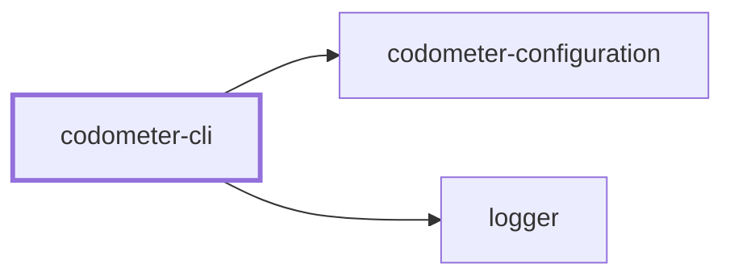
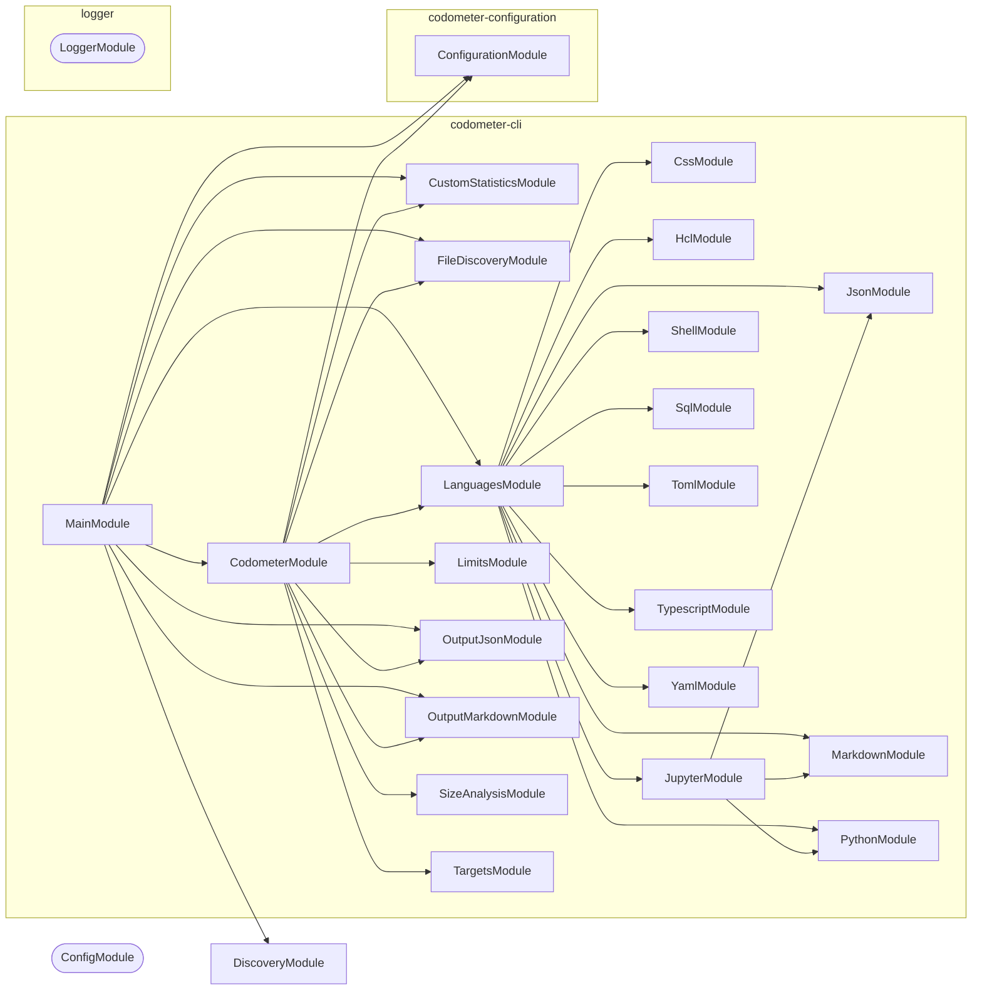

# ⏲️ Codometer

**Measure a repository and report what it found.**

Codometer walks a directory, parses everything it recognizes, and writes
what it counted as a markdown badge block, a JSON report, or both. It counts
languages the way you would expect — files, lines, classes, functions — and it
also counts the conventions a repository holds _itself_ to, which is usually
the more interesting number.

```bash
npm install --save-dev @codometer/cli
```

```bash
codometer
```

<!-- The badge block below this README's own Codometer section is produced by exactly this. -->

```markdown
### TypeScript & JavaScript


```

## Why

"1,034 source files" tells you almost nothing. "159 of them are services and
226 are the unit tests for them" tells you what the repository is actually made
of, and watching that ratio move tells you where it is going.

No language analyzer can produce the second number, because what a
`*.service.ts` means is a property of your repository rather than of
TypeScript. Codometer measures both halves: the built-in language counters, and
the ones you declare.

## Usage

```bash
codometer --directory . --config configuration/codometer.config.ts
```

| Flag | Purpose |
| ---- | ------- |
| `--check` | Report whether the outputs are current, write nothing, exit non-zero when stale |
| `--config [path]` | Configuration file to read; searched for when omitted |
| `-d, --directory [path]` | Directory to measure; defaults to the current one |
| `--json [path]` | Write the JSON report here, overriding the configured path |
| `-m, --markdown [path]` | Write the badge block here, overriding the configured path |

With no markdown or JSON destination — from either the configuration or the
flags — the statistics are written to stdout instead. A repository with no
configuration file at all is still measurable, which is what makes the tool
usable before anyone has decided what their exclusions should be.

`--check` is the CI form: it fails when the committed badge block or JSON
report no longer matches what the repository would produce.

```yaml
- run: npx codometer --check
```

## What gets measured

Discovery walks the directory itself and reads every `.gitignore` it passes,
so **`.gitignore` is already in force** — a build directory or a virtual
environment is pruned where its ignore file names it, and no exclusion has to
name it again. Git is never invoked, so a directory that is not a repository
at all is measured the same way as one that is.

What is measured is the working tree rather than the index: a file that exists
and is not ignored counts, whether or not it has been committed yet.

| Group | Counts |
| ----- | ------ |
| Repository | Lines of code, repository size, folders, source files |
| TypeScript & JavaScript | Files, tests, classes, functions, methods, interfaces, generics, enums, constants, imports, decorators, exported symbols, doc comments, TODOs |
| Python | Files, lines, classes, functions, protocols, constants, imports, decorators, docstrings |
| Jupyter | Notebooks, cells by kind, executions, outputs, plus the code and prose inside them |
| JSON | Files, objects, arrays, properties, scalars by type, node count, max depth |
| YAML | Documents, mappings, sequences, keys, scalars, anchors, aliases, max depth |
| Markdown | Headings by level, paragraphs, lists, tables, links, images, code blocks, block quotes |
| SQL | Statements by kind — selects, inserts, updates, deletes, creates, joins, CTEs |
| Shell | Functions, variables, exports, conditionals, loops, pipelines, shebangs |
| TOML | Tables, array tables, keys, arrays |
| HCL | Blocks, resources, variables, outputs, attributes, interpolations |
| CSS | Rules, selectors, declarations, at-rules, media queries, custom properties |
| Conventions | Whatever you declare — see below |

Notebooks are measured by composition rather than by a fourth parser: the
document is handed to the JSON analyzer, its code cells to the Python analyzer,
and its markdown cells to the markdown analyzer, leaving only cells, outputs,
and executions for the notebook analyzer itself.

Python analysis runs through an interpreter, `python3` by default. Point it
elsewhere with `python: { command: "uv run python" }` when Python lives in a
virtual environment.

## Targets

The codebase is measured as a **target** — a named set of files — and `targets`
declares the others. A target names its files by glob, which is what lets one
measure compiled output: a directory every `.gitignore` claims, and therefore
the one place ignore rules must not reach.

```ts
targets: [
  {
    analyses: ["size"],
    compression: "gzip",
    exclude: ["dist/vendor/**"],
    include: ["dist/**/*.js", "!dist/**/*.map.js"],
    name: "compiled",
  },
],
```

| Field | Required | Default | Meaning |
| ----- | -------- | ------- | ------- |
| `name` | yes | — | What the target is called. Two targets may not share one |
| `include` | yes | — | Globs that add files. At least one must add rather than remove |
| `exclude` | no | none | Globs that remove files |
| `analyses` | yes | — | `language`, `size`, or both. At least one |
| `compression` | no | `gzip` | `gzip`, `brotli`, or `none` for the bytes on disk |

`language` runs the analyzers above over the target's files. `size` compresses
each matched file on its own and sums the results — never all of them together
— at gzip level 9 or brotli quality 11, both stated rather than defaulted.

A `!` prefix in `include` removes files. Negations form one set applied to the
whole target rather than being read in order, so rearranging the array cannot
change what the target holds. Dot files are excluded unless a glob spells one
out, directories never match, and a file that was matched but cannot be read
fails the run rather than counting as zero bytes.

## Limits

A **limit** is how high one measured metric may go. Any metric can carry one — a
compressed size, a line count, a counter for one of the conventions below — and
a metric nothing limits is measured and reported exactly as before, gated by
nothing.

```ts
defaultTarget: "codebase",
limits: [
  { metric: "Compiled JavaScript.size", value: "8 KB" },
  { label: "Interfaces", metric: "typescript.interfaces", value: 500 },
  { metric: "linesOfCode", severity: "warn", value: 100_000 },
],
```

| Field | Required | Default | Meaning |
| ----- | -------- | ------- | ------- |
| `metric` | yes | — | Dotted path of the metric this limits |
| `value` | yes | — | How high the metric may go, as a number or a string with a unit |
| `severity` | no | `fail` | `fail` stops the run on a breach; `warn` reports it |
| `label` | no | the path | What to call the limit in a report |

A metric is addressed by the target's name followed by its path within that
target — `codebase.typescript.interfaces`, `codebase.markdown.files`,
`Compiled JavaScript.size`. Every target carries `files`, a target running size
analysis carries `size`, and one running language analysis carries every
counter the tables above list, with configured counters under `custom.<label>`.
Set `defaultTarget` and a path naming no target is read as that target's.

Where a `defaultTarget` is set, a path is read as that target's whenever no
target name prefixes it — so with `defaultTarget: "codebase"` and a target
called `typescript`, `typescript.interfaces` is the codebase's, because the
`typescript` target has no `interfaces` metric of its own to compete with it.
Write the target name in full wherever a target and a metric group share one.

**Ambiguity is refused, never resolved.** A path that could name two metrics —
a target called `markdown` beside the codebase's own `markdown.files` — fails
the run naming both readings, as does a path naming none, or one naming a
metric from an analysis the target never ran. A limit that quietly bound to the
wrong metric would look exactly like one that works.

A value written as a string carries a **decimal** unit whose trailing `b` is
required: `"8 KB"` is 8000 bytes and `"1 MB"` is 1000000, while `"8 K"` is not
a size and is refused rather than read as anything. A value nothing can read
fails the run instead of being taken as zero.

A target that matched **no files** fails the run if and only if a limit is
written against it. Declaring a limit asserts the files are there, so an empty
match is a glob that stopped matching or a build that never ran — while a
target nobody limited simply measured zero, which is unremarkable.

## Custom statistics

A repository that names files by convention has a vocabulary no analyzer knows
about. Declare it:

```ts
statistics: [
  { label: "Service Files", patterns: ["**/*.service.ts"] },
  { label: "Unit Tests", patterns: ["**/*.unit.test.ts"] },
  { color: "16a34a", label: "Migrations", patterns: ["**/migrations/*.sql"] },
];
```

Counters can also match _declarations_ rather than files, by shape:

```ts
statistics: [
  {
    group: "typescript",
    label: "Static Methods",
    symbols: { kinds: ["method"], modifiers: ["static"] },
  },
];
```

Each entry becomes one badge, in the order configured, rendered into the group
it names — `conventions` by default. Symbol counting happens during the walk
the TypeScript analyzer already makes, so any number of these costs one pass
over the sources.

The full reference — kinds, modifiers, colors, groups, and how `patterns`
narrows a symbol counter rather than being what it counts — is in
[**@codometer/configuration**](../codometer-configuration/README.md#custom-statistics).

## Output

The default markdown report is a description paragraph followed by shields.io
badges under one `###` heading per language, spliced between two anchor
markers:

```markdown
<!-- CODE_STATISTICS_START -->
<!-- CODE_STATISTICS_END -->
```

The block is appended when the markers are absent, and the file is created when
it does not exist. Both halves of that behavior are replaceable on their own —
`render` decides what markdown gets produced, `write` decides which file it
lands in and how — and supplying one keeps the built-in other. See
[markdown output](../codometer-configuration/README.md#markdown-output).

JSON output writes the same statistics as a structured document, for anything
that wants to chart them rather than read them.

## Project Graph

Where this project sits in the Nx project graph: what it depends on, and what depends on it. Regenerated by `nx run synchronization:synchronize --configuration=write`.

<!-- nx-project-graph-start -->



<!-- nx-project-graph-end -->

## Module Graph

The modules this project defines and the imports between them, regenerated by `nx run synchronization:synchronize --configuration=write`.

<!-- nestjs-module-graph-start -->



_Rounded modules are global: every module can inject them, so their edges are left out._

<!-- nestjs-module-graph-end -->

## Packages

| Package | Role |
| ------- | ---- |
| [`@codometer/cli`](README.md) | Measures the repository and writes the reports. Knows nothing about any particular repository |
| [`@codometer/configuration`](../codometer-configuration/README.md) | Reads `codometer.config.ts` and resolves exclusions, output destinations, custom statistics, and the Python interpreter |

Which paths to skip, where the output goes, and how Python is reached are all
configuration. That split is what lets the CLI be a general tool rather than
one repository's script.

## Contributing

```bash
nx run codometer-cli:start -- --directory .   # Run the CLI from source
nx run codometer-cli:vitest                   # Test
nx run codometer-cli:build                    # Compile
```

## License

MIT — see [LICENSE](../../LICENSE).

<!-- CALL_STACKS_START -->

## 🔭 Callidescope

Call stacks traced through `codometer-cli`, deepest first. Each frame shows what it takes, what it returns, and what its documentation says.

| Measure | Value |
| --- | --- |
| Callables | 255 |
| Files | 96 |
| Calls traced | 417 |
| Call stacks | 12 |
| Deepest stack | 11 |
| Stacks through recursion | 2 |
| Unfollowable calls | 11 |

### Call stacks

**1. `CodometerCommand.run`** — depth ≥ 11 · decorated-method

```text
🚀 CodometerCommand.run(_passedParameters: string[], options: CodometerCommandOptions): Promise<void> [packages/codometer-cli/src/modules/codometer/codometer.command.ts:220]
   ↳ Measure the repository and write every configured output.
  └─> CodometerService.measure(args: MeasureArguments): MeasurementResult [packages/codometer-cli/src/modules/codometer/codometer.service.ts:231]
     ↳ Measure the codebase and every target declared alongside it.
    └─> CodometerService.analyzeLanguage(args: AnalyzeLanguageArguments): CodeStatisticsResult [packages/codometer-cli/src/modules/codometer/codometer.service.ts:58]
       ↳ Run every language analyzer over one target's files.
      └─> LanguagesService.analyze(args: AnalyzeLanguagesArguments): LanguageResults [packages/codometer-cli/src/modules/languages/languages.service.ts:54]
         ↳ Analyze every language present in the discovered files.
        └─> JupyterService.analyze(args: AnalyzeJupyterArguments): JupyterResult [packages/codometer-cli/src/modules/jupyter/jupyter.service.ts:166]
           ↳ Analyze the given notebooks, resolved against the directory.
          └─> JsonService.analyze(input: JsonInput): JsonResult [packages/codometer-cli/src/modules/json/json.service.ts:304]
             ↳ Analyze JSON files and return structural metrics for their contents.
            └─> JsonService.countArrayNode(node: unknown[], stats: JsonResult, depth: number): void (cycle) [packages/codometer-cli/src/modules/json/json.service.ts:89]
               ↳ Count array nodes and their child values.
              └─> JsonService.countNode(node: unknown, stats: JsonResult, depth: number): void (cycle) [packages/codometer-cli/src/modules/json/json.service.ts:105]
                 ↳ Recursively count JSON containers, primitives, and nesting depth.
                └─> JsonService.countRecordNode(node: Record<string, unknown>, stats: JsonResult, depth: number): void (cycle) [packages/codometer-cli/src/modules/json/json.service.ts:156]
                   ↳ Count object nodes and their child values.
                  └─> JsonService.countPrimitiveNode(node: unknown, stats: JsonResult, depth: number): void [packages/codometer-cli/src/modules/json/json.service.ts:120]
                     ↳ Count scalar values and update primitive stats.
                    └─> JsonService.countPrimitiveValue(node: unknown, stats: JsonResult): void [packages/codometer-cli/src/modules/json/json.service.ts:137]
                       ↳ Increment stats for a scalar JSON value.
```

**2. `CodometerService.measureTarget`** — depth ≥ 10 · orphan-root

```text
🚀 CodometerService.measureTarget(args: MeasureTargetArguments): TargetMeasurement [packages/codometer-cli/src/modules/codometer/codometer.service.ts:188]
   ↳ Measure one declared target with whichever analyses it asked for.
  └─> CodometerService.analyzeLanguage(args: AnalyzeLanguageArguments): CodeStatisticsResult [packages/codometer-cli/src/modules/codometer/codometer.service.ts:58]
     ↳ Run every language analyzer over one target's files.
    └─> LanguagesService.analyze(args: AnalyzeLanguagesArguments): LanguageResults [packages/codometer-cli/src/modules/languages/languages.service.ts:54]
       ↳ Analyze every language present in the discovered files.
      └─> JupyterService.analyze(args: AnalyzeJupyterArguments): JupyterResult [packages/codometer-cli/src/modules/jupyter/jupyter.service.ts:166]
         ↳ Analyze the given notebooks, resolved against the directory.
        └─> JsonService.analyze(input: JsonInput): JsonResult [packages/codometer-cli/src/modules/json/json.service.ts:304]
           ↳ Analyze JSON files and return structural metrics for their contents.
          └─> JsonService.countArrayNode(node: unknown[], stats: JsonResult, depth: number): void (cycle) [packages/codometer-cli/src/modules/json/json.service.ts:89]
             ↳ Count array nodes and their child values.
            └─> JsonService.countNode(node: unknown, stats: JsonResult, depth: number): void (cycle) [packages/codometer-cli/src/modules/json/json.service.ts:105]
               ↳ Recursively count JSON containers, primitives, and nesting depth.
              └─> JsonService.countRecordNode(node: Record<string, unknown>, stats: JsonResult, depth: number): void (cycle) [packages/codometer-cli/src/modules/json/json.service.ts:156]
                 ↳ Count object nodes and their child values.
                └─> JsonService.countPrimitiveNode(node: unknown, stats: JsonResult, depth: number): void [packages/codometer-cli/src/modules/json/json.service.ts:120]
                   ↳ Count scalar values and update primitive stats.
                  └─> JsonService.countPrimitiveValue(node: unknown, stats: JsonResult): void [packages/codometer-cli/src/modules/json/json.service.ts:137]
                     ↳ Increment stats for a scalar JSON value.
```

**3. `OutputMarkdownService.renderBadges`** — depth 4 · orphan-root

```text
🚀 OutputMarkdownService.renderBadges(args: RenderBadgesArguments): string [packages/codometer-cli/src/modules/output-markdown/output-markdown.service.ts:165]
   ↳ Render the built-in badge report for the measured statistics.
  └─> buildRepositoryGroup(statistics: CodeStatisticsResult): string [packages/codometer-cli/src/modules/output-markdown/output-markdown.utilities.ts:204]
     ↳ Renders the Repository badge group.
    └─> buildBadge(label: string, value: number | string, color: string): string [packages/codometer-cli/src/modules/output-markdown/output-markdown.utilities.ts:11]
       ↳ Build a single shields.io badge markdown image.
      └─> encodeValue(input: number | string): string [packages/codometer-cli/src/modules/output-markdown/output-markdown.utilities.ts:322]
         ↳ Encode a value so it can safely appear in a badge URL.
```

<details>
<summary>9 more call stacks</summary>

**4. `TypescriptService.handleEnum`** — depth 3 · orphan-root

```text
🚀 TypescriptService.handleEnum(node: tsCompiler.Node, stats: TypescriptResult): void [packages/codometer-cli/src/modules/typescript/typescript.service.ts:250]
   ↳ Increments enum and exported counts for an enum declaration node.
  └─> TypescriptService.hasExportKeyword(node: tsCompiler.Node): boolean [packages/codometer-cli/src/modules/typescript/typescript.service.ts:346]
     ↳ Returns true when the node has an export modifier keyword.
    └─> TypescriptService.some(…)(modifier: tsCompiler.Modifier): modifier is tsCompiler.ExportKeyword [packages/codometer-cli/src/modules/typescript/typescript.service.ts:352]
```

**5. `TypescriptService.handleFunction`** — depth 3 · orphan-root

```text
🚀 TypescriptService.handleFunction(node: tsCompiler.Node, stats: TypescriptResult, insideClass: boolean): void [packages/codometer-cli/src/modules/typescript/typescript.service.ts:256]
   ↳ Increments function, method, async, sync, exported, and generic counts for a function node.
  └─> TypescriptService.hasExportKeyword(node: tsCompiler.Node): boolean [packages/codometer-cli/src/modules/typescript/typescript.service.ts:346]
     ↳ Returns true when the node has an export modifier keyword.
    └─> TypescriptService.some(…)(modifier: tsCompiler.Modifier): modifier is tsCompiler.ExportKeyword [packages/codometer-cli/src/modules/typescript/typescript.service.ts:352]
```

**6. `TypescriptService.handleInterface`** — depth 3 · orphan-root

```text
🚀 TypescriptService.handleInterface(node: tsCompiler.Node, stats: TypescriptResult): void [packages/codometer-cli/src/modules/typescript/typescript.service.ts:290]
   ↳ Increments interface, exported, and generic counts for an interface declaration node.
  └─> TypescriptService.hasExportKeyword(node: tsCompiler.Node): boolean [packages/codometer-cli/src/modules/typescript/typescript.service.ts:346]
     ↳ Returns true when the node has an export modifier keyword.
    └─> TypescriptService.some(…)(modifier: tsCompiler.Modifier): modifier is tsCompiler.ExportKeyword [packages/codometer-cli/src/modules/typescript/typescript.service.ts:352]
```

**7. `TypescriptService.handleMethodOrAccessor`** — depth 3 · orphan-root

```text
🚀 TypescriptService.handleMethodOrAccessor(node: tsCompiler.Node, stats: TypescriptResult): void [packages/codometer-cli/src/modules/typescript/typescript.service.ts:300]
   ↳ Increments method and async or sync counts for a method or accessor node.
  └─> TypescriptService.hasAsyncKeyword(node: tsCompiler.Node): boolean [packages/codometer-cli/src/modules/typescript/typescript.service.ts:334]
     ↳ Returns true when the node has an async modifier keyword.
    └─> TypescriptService.some(…)(modifier: tsCompiler.Modifier): modifier is tsCompiler.AsyncKeyword [packages/codometer-cli/src/modules/typescript/typescript.service.ts:340]
```

**8. `TypescriptService.handleTypeAlias`** — depth 3 · orphan-root

```text
🚀 TypescriptService.handleTypeAlias(node: tsCompiler.Node, stats: TypescriptResult): void [packages/codometer-cli/src/modules/typescript/typescript.service.ts:313]
   ↳ Increments exported and generic counts for a type alias declaration node.
  └─> TypescriptService.hasExportKeyword(node: tsCompiler.Node): boolean [packages/codometer-cli/src/modules/typescript/typescript.service.ts:346]
     ↳ Returns true when the node has an export modifier keyword.
    └─> TypescriptService.some(…)(modifier: tsCompiler.Modifier): modifier is tsCompiler.ExportKeyword [packages/codometer-cli/src/modules/typescript/typescript.service.ts:352]
```

**9. `TypescriptService.handleVariable`** — depth 3 · orphan-root

```text
🚀 TypescriptService.handleVariable(node: tsCompiler.Node, stats: TypescriptResult): void [packages/codometer-cli/src/modules/typescript/typescript.service.ts:322]
   ↳ Increments constant and exported counts for a const variable statement.
  └─> TypescriptService.hasExportKeyword(node: tsCompiler.Node): boolean [packages/codometer-cli/src/modules/typescript/typescript.service.ts:346]
     ↳ Returns true when the node has an export modifier keyword.
    └─> TypescriptService.some(…)(modifier: tsCompiler.Modifier): modifier is tsCompiler.ExportKeyword [packages/codometer-cli/src/modules/typescript/typescript.service.ts:352]
```

**10. `OutputMarkdownService.syncAnchoredBlock`** — depth ≥ 3 · orphan-root

```text
🚀 OutputMarkdownService.syncAnchoredBlock(args: SyncAnchoredBlockArguments): boolean [packages/codometer-cli/src/modules/output-markdown/output-markdown.service.ts:109]
   ↳ Splice the anchored block into a file, or report whether it is current.
  └─> OutputMarkdownService.buildBlockRegex(args: { endMarker: string; startMarker: string; }): RegExp [packages/codometer-cli/src/modules/output-markdown/output-markdown.service.ts:75]
     ↳ Build the matcher for a block delimited by the configured markers.
    └─> OutputMarkdownService.escapeRegex(input: string): string [packages/codometer-cli/src/modules/output-markdown/output-markdown.service.ts:87]
       ↳ Escape a configured marker so it can be searched for literally.
```

**11. `main`** — depth ≥ 2 · module-bootstrap

```text
🚀 main(): Promise<void> [packages/codometer-cli/src/main.ts:11]
   ↳ Bootstraps the codometer CLI command application.
  └─> LoggerService.constructor(): LoggerService [packages/logger/src/modules/logger/logger.service.ts:36]
```

**12. `CodometerCommand.constructor`** — depth ≥ 2 · orphan-root

```text
🚀 CodometerCommand.constructor(…): CodometerCommand [packages/codometer-cli/src/modules/codometer/codometer.command.ts:40]
  └─> LoggerService.setContext(context: string): void [packages/logger/src/modules/logger/logger.service.ts:235]
     ↳ Sets the context label included in every subsequent log line.
```

</details>

### Module spread

| Callable | Spread | Calls directly | Location |
| --- | --- | --- | --- |
| `CodometerService.measureTarget` | 17 | `codometer-cli:modules/file-discovery`, `codometer-cli:modules/size-analysis`, `codometer-cli:modules/targets` | `packages/codometer-cli/src/modules/codometer/codometer.service.ts:188` |
| `LanguagesService.analyze` | 12 | `codometer-cli:modules/css`, `codometer-cli:modules/hcl`, `codometer-cli:modules/json`, `codometer-cli:modules/jupyter`, `codometer-cli:modules/markdown`, `codometer-cli:modules/python`, `codometer-cli:modules/shell`, `codometer-cli:modules/sql`, `codometer-cli:modules/toml`, `codometer-cli:modules/typescript`, `codometer-cli:modules/yaml` | `packages/codometer-cli/src/modules/languages/languages.service.ts:54` |

### Possibly misplaced

None.
<!-- CALL_STACKS_END -->
