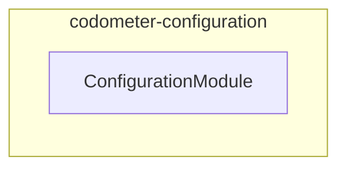

# CodometerConfiguration: NestJS Service Application

## Quick Start

**Type**: Node.js service application (NestJS + `NestFactory`)

**Purpose**: <!-- Briefly describe the specific purpose of this service application -->

## Architecture Overview

### Tech Stack

- **Framework**: NestJS (modules, dependency injection, providers)
- **Bootstrap**: `NestFactory.create` (standard NestJS bootstrap)
- **Env validation**: `@nestjs/config` + `zod` (`environmentSchema` in `.constants.ts`)
- **Logging**: `@codebase/logger` — a `pino`-backed `LoggerService` (`Scope.TRANSIENT`)
- **Language**: Strict TypeScript

### Execution Flow

```text
src/main.ts
  └─ NestFactory.create(MainModule)
       └─ domain service modules            ← add under src/modules/
```

### Directory Layout

```text
src/
  main.ts                           # Bootstrap — do not modify
  main.module.ts                    # Root NestJS module (imports ConfigModule, LoggerModule)
  constants.ts                      # Zod environmentSchema for env validation
  modules/
    <domain>/                       # Add feature modules here
      <domain>.module.ts
      <domain>.service.ts
      <domain>.types.ts
      <domain>.constants.ts
      <domain>.<tier>.test.ts
testing/                            # Shared test utilities
```

### Module Graph

The modules this project defines and the imports between them, regenerated by `nx run synchronization:synchronize --configuration=write`.

<!-- nestjs-module-graph-start -->



<!-- nestjs-module-graph-end -->

## Development

### Adding Business Logic

1. **Add domain service modules** — create `src/modules/<domain>/` with a NestJS module, service, types, and constants.
2. **Register in root module** — import the new module in `main.module.ts`.
3. **Validate env vars** — extend `environmentSchema` in `constants.ts` with all required environment variables.

### Logging

`LoggerService` and `LoggerModule` come from `@codebase/logger` — this project does not define its own logger. Add `"@codebase/logger": "workspace:*"` to `dependencies`, then import `LoggerModule` once in the root module; it is `@Global()`, so feature modules inject `LoggerService` without importing it.

`LoggerService` is `Scope.TRANSIENT` — each injecting class gets its own instance. Always call `setContext` in the constructor:

```ts
constructor(private readonly logger: LoggerService) {
  this.logger.setContext(MyService.name);
}
```

Outputs structured JSON in production (`NODE_ENV=production`) and pretty-printed logs in development.

### Key Commands

Always prefer running tasks through Nx rather than calling the underlying tools directly.

```bash
nx run codometer-configuration:lint-codebase   # Every static check, in one graph
nx run codometer-configuration:typecheck       # tsc --noEmit
nx run codometer-configuration:oxfmt           # Formatting
nx run codometer-configuration:build           # Compile for publication
```

### Testing

Follow the codebase's strict three-tier testing strategy. Co-locate test files with the source they test.

```bash
nx run codometer-configuration:vitest:unit          # Fast (<100ms) — pure logic, mocked DI
nx run codometer-configuration:vitest:integration   # Moderate (1-2s) — real database/API I/O
nx run codometer-configuration:vitest:end-to-end    # Slow (30-60s) — full service initialization
```

| Tier | File pattern | What to test |
| ---- | ------------ | ------------ |
| Unit | `*.unit.test.ts` | Pure functions, service methods with mocked deps |
| Integration | `*.integration.test.ts` | Database queries, external API clients |
| End-to-end | `*.end-to-end.test.ts` | Full `NestFactory.create()` execution |

See the [testing-strategy skill](../../.agents/skills/testing-strategy/SKILL.md) and [testing-mocks skill](../../.agents/skills/testing-mocks/SKILL.md) for patterns and mock conventions.

## Writing Modules

Use the generator to scaffold new domain modules, then implement the service:

```bash
nx g conformetry:nestjs-service-module --name=<domain>
```

This creates five files in `src/modules/<domain>/`:

| File | Purpose |
| ---- | ------- |
| `<domain>.module.ts` | Declares providers, imports, and exports |
| `<domain>.service.ts` | Business logic — the only place you write domain code |
| `<domain>.constants.ts` | Regex, enums, static config — never inline magic values |
| `<domain>.types.ts` | TypeScript types scoped to this module |
| `<domain>.service.unit.test.ts` | Unit tests bootstrapped with `Test.createTestingModule` |

### Module file

Register the service in both `providers` and `exports` so consumers can inject it:

```ts
@Module({
  controllers: [],
  exports: [MyDomainService],
  imports: [LoggerModule],
  providers: [MyDomainService],
})
export class MyDomainModule {}
```

Add a JSDoc comment on the module class describing what domain it owns.

### Service file

Follow the section-comment layout from the template — it keeps large services scannable:

```ts
@Injectable()
export class MyDomainService {
  // 🏗 Dependency Injection
  constructor(private readonly logger: LoggerService) {
    this.logger.setContext(MyDomainService.name);
  }

  // 🔐 Private Fields

  // 🔑 Public Fields

  // 🔏 Private Methods

  // 🌎 Public Methods
}
```

Key rules:

- **Call `setContext` in every constructor** — always use `MyClass.name`, never a string literal.
- **Inject `LoggerService` as the last constructor parameter** (after repository/domain deps).
- **Private first** — keep internal helpers in the `🔏 Private Methods` section, expose only what callers need under `🌎 Public Methods`.
- **`readonly` everything in the constructor** — all injected deps must be `private readonly`.
- **One service per module** — if a service grows too large, extract a sub-domain into its own module.

### Constants file

Move all inline values to `.constants.ts` to keep services readable:

```ts
// ♟️ Constants
export const DEFAULT_PAGE_SIZE = 100;
```

### Types file

Put all module-local TypeScript types and interfaces in `.types.ts`:

```ts
// 🏷️ Types
export interface ParsedEntry {
  word: string;
  partOfSpeech: string;
}
```

Do not re-export types from `index.ts` unless they are part of the public API consumed by other modules.

### Registering in the root module

After generating a module, import it in `main.module.ts`:

```ts
@Module({
  imports: [
    ConfigModule.forRoot({ ... }),
    LoggerModule,
    MyDomainModule,   // ← add here
  ],
  providers: [],
})
export class MainModule {}
```

## Best Practices

- **Never** put business logic in `main.ts` — it bootstraps `NestFactory` only.
- **Validate at the boundary** — all env vars must be declared in `environmentSchema`; access via `ConfigService`, not `process.env`.
- **Type imports** — use `import { type Foo }` for type-only imports (enforced by ESLint).
- **No `any` types** — use `unknown` or proper typing; strict mode is enabled.

See the [write-typescript skill](../../.agents/skills/write-typescript/SKILL.md) for strict mode patterns.

## Troubleshooting

- **Dependency injection failure** — verify the service is `@Injectable()`, exported from its module, and that module is imported by the consuming module.
- **Env var validation error on startup** — add the missing variable to `environmentSchema` in `src/constants.ts` and to `.env.default`.

See the [triage-submission skill](../../.agents/skills/triage-submission/SKILL.md) for lint and git hook failures.

## Key Files

- [src/main.ts](src/main.ts): Application bootstrap
- [src/main.module.ts](src/main.module.ts): Root NestJS module
- [src/constants.ts](src/constants.ts): `environmentSchema` (Zod)
- `@codebase/logger` (`packages/logger`): shared pino-backed `LoggerService` and `LoggerModule`
- [project.json](project.json): Nx targets (`develop`, `build`, `test`, `lint`, `typecheck`, `format`)
- [.env.default](.env.default): Environment variable template
