# ⏲️ Codometer Configuration

**The configuration reference for [Codometer](../codometer-cli/README.md).**

`@codometer/configuration` reads a repository's `codometer.config.ts` and hands
back a fully defaulted configuration object. It is the only package that knows
anything about a particular repository; `@codometer/cli` measures whatever the
configuration describes.

```bash
npm install --save-dev @codometer/configuration
```

Install it directly when you are typing a configuration file. `@codometer/cli`
already depends on it.

## Configuration File

Any of `codometer.config.{ts,mts,cts,js,mjs,cjs,json,jsonc}` is read from the
directory being measured, or from any directory above it. Every field is
optional — a repository with no configuration file at all is measured with the
defaults.

```ts
import { type CodometerConfiguration } from "@codometer/configuration";

const codometerConfiguration: CodometerConfiguration = {
  // Appended to the built-in exclusions (node_modules, dist, build, coverage,
  // .nx), matched against repository-relative paths with `path.matchesGlob`.
  exclude: ["notepads/**", "**/templates/**"],
  // Ignore files in gitignore syntax, whose patterns exclude as well.
  excludeFrom: ["configuration/.codometerignore"],
  output: {
    // Omit a destination to leave that file unwritten.
    json: { indentation: 2, path: "output/codometer.json" },
    markdown: {
      description: "Measured on every push.",
      // Named something other than the defaults on purpose: a file holding the
      // default start marker anywhere — a document like this one, explaining
      // it — reads as already carrying the block, and gets no block of its own.
      endMarker: "<!-- STATISTICS_END -->",
      path: "README.md",
      startMarker: "<!-- STATISTICS_START -->",
    },
  },
  // Interpreter used for Python analysis; defaults to `python3`.
  python: { command: "uv run python" },
  // Target an unqualified limit path belongs to.
  defaultTarget: "codebase",
  // How high each measured metric may go.
  limits: [
    { metric: "compiled.size", value: "8 KB" },
    { metric: "typescript.interfaces", severity: "warn", value: 500 },
  ],
  // Named sets of files measured alongside the codebase itself.
  targets: [
    {
      analyses: ["size"],
      compression: "gzip",
      include: ["dist/**/*.js", "!dist/**/*.map.js"],
      name: "compiled",
    },
  ],
};

export default codometerConfiguration;
```

Output paths are resolved relative to the directory being measured, not to the
configuration file, so a configuration kept in a `configuration/` folder still
writes to the repository root.

## Resolution

The search starts at the directory being measured and walks upward, taking the
first configuration file it finds. **The nearest one wins outright**: nothing
from a further ancestor is folded into it. Merging the two would leave a limit
that never applied looking exactly like one that did, and telling them apart
would mean knowing which of several files each field came from.

So a folder carrying no configuration file of its own is measured by the
nearest ancestor that does, and a folder that writes one is measured by that
alone.

## A Configuration That Answers For Every Folder

A configuration file may export a **function** instead of an object. It is
handed the run context and returns the configuration, which is what lets one
file at the top of a workspace describe every project beneath it — each
project's build output derived from where the project sits, and each project's
limit read from its own manifest.

```ts
import path from "node:path";

import {
  type CodometerConfiguration,
  type CodometerConfigurationFactory,
} from "@codometer/configuration";

const codometerConfiguration: CodometerConfigurationFactory = (context) => {
  const projectPath = path.relative(
    context.configurationDirectory,
    context.directory,
  );

  return {
    limits: [{ metric: "Compiled JavaScript.size", value: "8 KB" }],
    targets: [
      {
        analyses: ["size"],
        // Build output sits above the project being measured, so the target
        // says how to get back out to it.
        directory: path.relative(context.directory, context.configurationDirectory),
        include: [`dist/${projectPath}/**/*.js`],
        name: "Compiled JavaScript",
      },
    ],
  } satisfies CodometerConfiguration;
};

export default codometerConfiguration;
```

| Context field | Meaning |
| ------------- | ------- |
| `directory` | Absolute directory this run measures |
| `configurationDirectory` | Absolute directory holding the configuration file being loaded |

Two directories and nothing else. Their difference is the measured folder's
position, and every path convention a repository holds — where its build output
lands, where a package's manifest sits — falls out of that position, stated by
the configuration rather than known by codometer. Nothing about the run's flags
is in the context on purpose: a configuration that could see whether the run
writes or gates could describe a different repository to each.

A factory may return a promise, so it can read a manifest or an ignore file
before answering.

## What Gets Measured

Discovery walks the directory itself and reads every `.gitignore` it passes, so
**`.gitignore` is already in force**: a build directory or a virtual environment
is pruned where its ignore file names it, and no exclusion has to name it again.
Git is never invoked, so a directory that is not a repository at all is measured
the same way as one that is, and what is measured is the working tree rather
than the index — a file that exists and is not ignored counts, whether or not it
has been committed yet. What the two exclusion options are for is the opposite
case: files that are kept but that nobody wrote.

| Option | Syntax | Use it for |
| ------ | ------ | ---------- |
| `exclude` | Globs, matched with `path.matchesGlob` | A handful of paths named inline, appended to the built-in defaults |
| `excludeFrom` | Paths to ignore files, in gitignore syntax | Lockfiles, vendored bundles, generated documentation — the list a repository would rather keep in a file |

`excludeFrom` files are read as gitignore syntax and matched natively, so
negations, anchoring, and directory patterns behave exactly as they do in a
`.gitignore`, and pointing codometer at a file another tool already reads gives
the same answer that tool gets. Matching is case-sensitive on every platform,
deliberately: git takes that from whichever filesystem it finds itself on, and a
measurement that disagrees with itself between a laptop and CI is worse than a
strict one.

One caution when reusing an existing ignore file: most are written for one
tool's concerns, not for measurement. A `.prettierignore` typically ignores all
markdown because a markdown linter handles it — point codometer at that and the
prose metrics vanish. A dedicated `.codometerignore` is usually the better
answer.

## Targets

A **target** is a named set of files, declared by include and exclude globs,
together with the analyses run over it. The codebase itself is always measured
as a target of its own — everything the ignore files leave behind, under the
name `codebase` — and `targets` names the others.

```ts
targets: [
  {
    analyses: ["size"],
    compression: "gzip",
    exclude: ["dist/vendor/**"],
    include: ["dist/**/*.js", "!dist/**/*.map.js"],
    name: "compiled",
  },
],
```

| Field | Required | Default | Meaning |
| ----- | -------- | ------- | ------- |
| `name` | yes | — | What the target is called. Two targets may not share one |
| `include` | yes | — | Globs that add files. At least one must add rather than remove |
| `exclude` | no | none | Globs that remove files |
| `analyses` | yes | — | `language`, `size`, or both. At least one |
| `compression` | no | `gzip` | `gzip`, `brotli`, or `none` for the bytes on disk |
| `directory` | no | `.` | Where the target's globs start, relative to the measured directory |

`language` runs the same analyzers the codebase gets. `size` compresses each
matched file **on its own** and sums the results — never all of them together,
which would find matches across file boundaries and report a total no client
ever receives. Gzip compresses at level 9 and brotli at quality 11, both stated
explicitly rather than left to a library default.

A `!` prefix in `include` removes files instead of adding them. Negations are
collected into one set applied to the whole target rather than in the order
they were written, so rearranging the array cannot change which files the
target holds. A `!` in `exclude` is rejected: that list already removes files,
so there is nothing there to negate.

Ignore files are not consulted for a target. That is deliberate, and it is what
lets one measure compiled output — a directory every `.gitignore` claims, which
is exactly why no ignore rule may reach it. A file a target matched but cannot
be read fails the run rather than counting as zero bytes: a total quietly short
by one file is worse than no total at all.

## Limits

A **limit** is how high one measured metric may go. Any metric can carry one — a
compressed size, a line count, a counter for one of the conventions below — and
a metric nothing limits is measured and reported exactly as before, gated by
nothing.

```ts
defaultTarget: "codebase",
limits: [
  { metric: "Compiled JavaScript.size", value: "8 KB" },
  { label: "Interfaces", metric: "typescript.interfaces", value: 500 },
  { metric: "linesOfCode", severity: "warn", value: 100_000 },
],
```

| Field | Required | Default | Meaning |
| ----- | -------- | ------- | ------- |
| `metric` | yes | — | Dotted path of the metric this limits |
| `value` | yes | — | How high the metric may go, as a number or a string with a unit |
| `severity` | no | `fail` | `fail` stops the run on a breach; `warn` reports it |
| `label` | no | the path | What to call the limit in a report |

A metric is addressed by the target's name followed by its path within that
target — `codebase.typescript.interfaces`, `codebase.markdown.files`,
`Compiled JavaScript.size`. Every target carries `files`, a target running size
analysis carries `size`, and one running language analysis carries every
counter the codebase measurement lists, with configured counters under `custom.<label>`.
Set `defaultTarget` and a path naming no target is read as that target's.

Where a `defaultTarget` is set, a path is read as that target's whenever no
target name prefixes it — so with `defaultTarget: "codebase"` and a target
called `typescript`, `typescript.interfaces` is the codebase's, because the
`typescript` target has no `interfaces` metric of its own to compete with it.
Write the target name in full wherever a target and a metric group share one.

**Ambiguity is refused, never resolved.** A path that could name two metrics —
a target called `markdown` beside the codebase's own `markdown.files` — fails
the run naming both readings, as does a path naming none, or one naming a
metric from an analysis the target never ran. A limit that quietly bound to the
wrong metric would look exactly like one that works.

A value written as a string carries a **decimal** unit whose trailing `b` is
required: `"8 KB"` is 8000 bytes and `"1 MB"` is 1000000, while `"8 K"` is not
a size and is refused rather than read as anything. A value nothing can read
fails the run instead of being taken as zero.

A target that matched **no files** fails the run if and only if a limit is
written against it. Declaring a limit asserts the files are there, so an empty
match is a glob that stopped matching or a build that never ran — while a
target nobody limited simply measured zero, which is unremarkable.

## Custom Statistics

A repository that names files by convention has a vocabulary no language
analyzer knows about. `statistics` counts them:

```ts
statistics: [
  { label: "Service Files", patterns: ["**/*.service.ts"] },
  { label: "Unit Tests", patterns: ["**/*.unit.test.ts"] },
  { color: "16a34a", label: "Migrations", patterns: ["**/migrations/*.sql"] },
],
```

Each entry becomes one badge, in the order it was configured. Globs are matched
against repository-relative paths with `path.matchesGlob` over the same
discovered files everything else measures, so exclusions apply. A file matching
several of one entry's globs counts once. `color` is a shields.io hexadecimal
triplet; entries that omit it take the next color from a built-in palette,
cycling so a counter's color stays the same between runs.

### Counting Declarations

`symbols` counts declarations in TypeScript and JavaScript sources instead of
files. It asks for one or more `kinds`, optionally narrowed to declarations
carrying every named modifier:

```ts
statistics: [
  {
    group: "typescript",
    label: "Static Methods",
    symbols: { kinds: ["method"], modifiers: ["static"] },
  },
  { label: "Abstract Classes", symbols: { kinds: ["class"], modifiers: ["abstract"] } },
],
```

`kinds` are `class`, `enum`, `function`, `getter`, `interface`, `method`,
`property`, and `setter`. `modifiers` are `abstract`, `async`, `export`,
`override`, `private`, `protected`, `public`, `readonly`, and `static`.

Both are read literally, from the syntax. A callable written as a class member
is a `method`; one written anywhere else is a `function`, arrow functions
included. A class field holding an arrow function is a `property`, and the
arrow carries none of the field's modifiers — so a `static build = () => {}` is
found by asking for static properties, not static methods. `public` matches
members annotated `public`, not members that are public by omission, and
`private` does not match a `#name` field, which carries no modifier at all.

A symbol counter may also carry `patterns`, which then narrows _which files are
searched_ rather than being what is counted — `patterns: ["packages/**"]` with
a `symbols` matcher counts declarations in `packages/`. Counting happens during
the walk the TypeScript analyzer already makes, so any number of these costs
one pass over the sources.

An entry with neither `patterns` nor `symbols` is rejected rather than reported
as a permanent zero.

### Where A Counter Renders

`group` names the badge group a counter is rendered into, after that group's
built-in badges. It defaults to `conventions` — a group that exists only for
these counters and is omitted entirely when none belong to it. Any rendered
group may be named instead: `css`, `hcl`, `json`, `jupyter`, `markdown`,
`python`, `repository`, `shell`, `sql`, `toml`, `typescript`, or `yaml`. A name
outside that set fails the configuration rather than rendering nowhere.

The default palette runs per group, so adding a counter to one group never
recolors the badges of another.

## Markdown Output

The default markdown report is a `description` paragraph followed by shields.io
badges under one `###` heading per language, spliced between the two anchor
markers. Both halves of that behavior are replaceable on their own.

**`render`** turns the statistics into markdown. It is handed the configured
description, the statistics, and `renderBadges()` — the built-in rendering of
those same statistics, so a renderer can add to the default report instead of
replacing it.

```ts
markdown: {
  path: "README.md",
  render: ({ renderBadges, statistics }) =>
    `Lines of code: ${statistics.linesOfCode}\n\n${renderBadges()}`,
}
```

**`write`** decides which file the rendered markdown lands in and how. It is
handed the rendered `content`, the configured `path`, whether this is a check
run, and `anchors` — the marker mechanics, so choosing a different file does
not mean reimplementing the splice:

| Helper | Does |
| ------ | ---- |
| `anchors.syncAnchoredBlock({ content?, path? })` | Splices the block into a file, appending when the markers are absent and creating the file when it is missing. In check mode it compares instead of writing and returns whether the file is current. |
| `anchors.wrapInAnchors(content?)` | Returns the content wrapped in the markers, for a writer placing it somewhere itself. |
| `anchors.startMarker` / `anchors.endMarker` | The configured markers. |

```ts
markdown: {
  // `path` may be left out entirely when the writer picks the file.
  write: ({ anchors, statistics }) =>
    anchors.syncAnchoredBlock({
      path: statistics.python.files > 0 ? "docs/polyglot.md" : "README.md",
    }),
}
```

A `write` function returns `false` to report its destination as stale, which is
what fails a `--check` run; anything else counts as up to date. Markdown output
needs a `path`, a `write` function, or both — a destination naming neither is
rejected when the configuration loads.

## Exports

`ConfigurationService` and `ConfigurationModule`, plus the
`CodometerConfiguration` type you author your config as and the resolved shapes
the CLI reads.

## Test

```bash
nx run codometer-configuration:vitest
```

## License

MIT — see [LICENSE](../../LICENSE).

<!-- CALL_STACKS_START -->

## 🔭 Callidescope

Call stacks traced through `codometer-configuration`, deepest first. Each frame shows what it takes, what it returns, and what its documentation says.

| Measure | Value |
| --- | --- |
| Callables | 37 |
| Files | 10 |
| Calls traced | 32 |
| Call stacks | 2 |
| Deepest stack | 2 |
| Stacks through recursion | 0 |
| Unfollowable calls | 4 |

### Call stacks (depth)

**1. `superRefine(…)`** — depth 2 · orphan-root

```text
🚀 superRefine(…)(…): void [packages/codometer-configuration/src/modules/configuration/configuration.constants.ts:378]
  └─> some(…)(pattern: string): boolean [packages/codometer-configuration/src/modules/configuration/configuration.constants.ts:380]
```

**2. `refine(…)`** — depth 2 · orphan-root

```text
🚀 refine(…)(…): boolean [packages/codometer-configuration/src/modules/configuration/configuration.constants.ts:405]
  └─> map(…)(…): string [packages/codometer-configuration/src/modules/configuration/configuration.constants.ts:406]
```

### Module spread

None.

### Breadth

| Callable | Breadth | Calls directly | Location |
| --- | --- | --- | --- |
| `ConfigurationService.loadConfiguration` | 6 | `ConfigurationService.findConfigurationFile`, `ConfigurationService.resolveConfigurationPath`, `ConfigurationService.resolveConfiguration`, `UnknownConfigurationFileTypeError.constructor`, `ConfigurationService.applyRunContext`, `ConfigurationService.loadConfigurationModule` | `packages/codometer-configuration/src/modules/configuration/configuration.service.ts:423` |
| `ConfigurationService.resolveConfiguration` | 5 | `ConfigurationService.resolveLimits`, `ConfigurationService.resolveJsonOutput`, `ConfigurationService.resolveMarkdownOutput`, `ConfigurationService.resolveCustomStatistics`, `ConfigurationService.resolveTargets` | `packages/codometer-configuration/src/modules/configuration/configuration.service.ts:464` |
| `ConfigurationService.map(…)` | 3 | `ConfigurationService.map(…)`, `ConfigurationService.filter(…)`, `ConfigurationService.filter(…)` | `packages/codometer-configuration/src/modules/configuration/configuration.service.ts:389` |

<details>
<summary>12 more callables</summary>

| Callable | Breadth | Calls directly | Location |
| --- | --- | --- | --- |
| `ConfigurationService.loadConfigurationModule` | 2 | `ConfigurationService.loadJsonConfiguration`, `ConfigurationService.readDefaultExport` | `packages/codometer-configuration/src/modules/configuration/configuration.service.ts:163` |
| `ConfigurationService.parseLimitValue` | 2 | `ConfigurationService.parseLimitValueText`, `InvalidLimitValueError.constructor` | `packages/codometer-configuration/src/modules/configuration/configuration.service.ts:197` |
| `ConfigurationService.resolveConfigurationPath` | 2 | `ConfigurationService.findRepositoryRoot`, `ConfigurationFileNotFoundError.constructor` | `packages/codometer-configuration/src/modules/configuration/configuration.service.ts:267` |
| `superRefine(…)` | 1 | `some(…)` | `packages/codometer-configuration/src/modules/configuration/configuration.constants.ts:378` |
| `refine(…)` | 1 | `map(…)` | `packages/codometer-configuration/src/modules/configuration/configuration.constants.ts:405` |
| `ConfigurationService.applyRunContext` | 1 | `ConfigurationService.isConfigurationFactory` | `packages/codometer-configuration/src/modules/configuration/configuration.service.ts:79` |
| `ConfigurationService.findRepositoryRoot` | 1 | `ConfigurationService.some(…)` | `packages/codometer-configuration/src/modules/configuration/configuration.service.ts:127` |
| `ConfigurationService.parseLimitValueText` | 1 | `InvalidLimitValueError.constructor` | `packages/codometer-configuration/src/modules/configuration/configuration.service.ts:217` |
| `ConfigurationService.resolveCustomStatistics` | 1 | `ConfigurationService.map(…)` | `packages/codometer-configuration/src/modules/configuration/configuration.service.ts:299` |
| `ConfigurationService.resolveLimits` | 1 | `ConfigurationService.map(…)` | `packages/codometer-configuration/src/modules/configuration/configuration.service.ts:345` |
| `ConfigurationService.map(…)` | 1 | `ConfigurationService.parseLimitValue` | `packages/codometer-configuration/src/modules/configuration/configuration.service.ts:348` |
| `ConfigurationService.resolveTargets` | 1 | `ConfigurationService.map(…)` | `packages/codometer-configuration/src/modules/configuration/configuration.service.ts:386` |

</details>

### Possibly misplaced

None.
<!-- CALL_STACKS_END -->

<!-- CODE_STATISTICS_START -->

## ⏲️ Codometer

### Project


### Measured Targets


### TypeScript


### JavaScript


### Python


### JSON


### YAML


### TOML


### Shell


### SQL


### HCL


### CSS


### Conventions


### Jupyter


### Markdown


<!-- CODE_STATISTICS_END -->

## 🕸️ Codependix

Dependency graphs exported by [codependix](https://github.com/JimmyPaolini/codebase/tree/main/packages/codependix-cli), regenerated by `nx run codebase:codependix:write`.

### Nx Neighborhood

<!-- codependix:start name="codependix-nx" -->

<!-- codependix:end name="codependix-nx" -->

### NestJS Module Graph

<!-- codependix:start name="codependix-nestjs" -->

<!-- codependix:end name="codependix-nestjs" -->

### File Imports

```mermaid
graph LR
  file_eslint_config_ts["eslint.config.ts"]
  file_src_index_ts["src/index.ts"]
  file_src_index_unit_test_ts["src/index.unit.test.ts"]
  file_src_modules_configuration_configuration_constants_ts["src/modules/configuration/configuration.constants.ts"]
  file_src_modules_configuration_configuration_errors_ts["src/modules/configuration/configuration.errors.ts"]
  file_src_modules_configuration_configuration_module_ts["src/modules/configuration/configuration.module.ts"]
  file_src_modules_configuration_configuration_module_unit_test_ts["src/modules/configuration/configuration.module.unit.test.ts"]
  file_src_modules_configuration_configuration_service_ts["src/modules/configuration/configuration.service.ts"]
  file_src_modules_configuration_configuration_service_unit_test_ts["src/modules/configuration/configuration.service.unit.test.ts"]
  file_src_modules_configuration_configuration_types_ts["src/modules/configuration/configuration.types.ts"]
  file_src_modules_configuration_limit_value_errors_ts["src/modules/configuration/limit-value.errors.ts"]
  file_src_modules_configuration_statistics_types_ts["src/modules/configuration/statistics.types.ts"]
  file_testing_mocks_ts["testing/mocks.ts"]
  file_testing_setup_ts["testing/setup.ts"]
  file_vitest_config_ts["vitest.config.ts"]
  file_src_index_unit_test_ts --> file_src_index_ts
  file_src_modules_configuration_configuration_constants_ts --> file_src_modules_configuration_configuration_types_ts
  file_src_modules_configuration_configuration_constants_ts --> file_src_modules_configuration_statistics_types_ts
  file_src_modules_configuration_configuration_module_ts --> file_src_modules_configuration_configuration_service_ts
  file_src_modules_configuration_configuration_module_unit_test_ts --> file_src_modules_configuration_configuration_module_ts
  file_src_modules_configuration_configuration_module_unit_test_ts --> file_src_modules_configuration_configuration_service_ts
  file_src_modules_configuration_configuration_service_ts --> file_src_modules_configuration_configuration_constants_ts
  file_src_modules_configuration_configuration_service_ts --> file_src_modules_configuration_configuration_errors_ts
  file_src_modules_configuration_configuration_service_ts --> file_src_modules_configuration_configuration_types_ts
  file_src_modules_configuration_configuration_service_ts --> file_src_modules_configuration_limit_value_errors_ts
  file_src_modules_configuration_configuration_service_ts --> file_src_modules_configuration_statistics_types_ts
  file_src_modules_configuration_configuration_service_unit_test_ts --> file_src_modules_configuration_configuration_constants_ts
  file_src_modules_configuration_configuration_service_unit_test_ts --> file_src_modules_configuration_configuration_errors_ts
  file_src_modules_configuration_configuration_service_unit_test_ts --> file_src_modules_configuration_configuration_service_ts
  file_src_modules_configuration_configuration_service_unit_test_ts --> file_src_modules_configuration_limit_value_errors_ts
  file_src_modules_configuration_configuration_types_ts --> file_src_modules_configuration_statistics_types_ts
```

<!-- codependix:start name="codependix-imports" -->

<!-- codependix:end name="codependix-imports" -->
