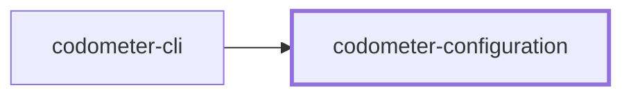
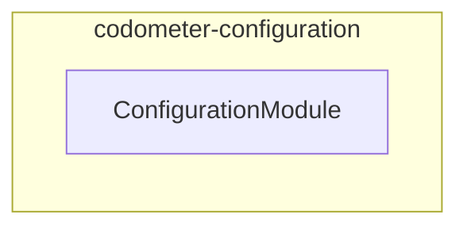

# ⏲️ Codometer Configuration

**The configuration reference for [Codometer](../codometer-cli/README.md).**

`@codometer/configuration` reads a repository's `codometer.config.ts` and hands
back a fully defaulted configuration object. It is the only package that knows
anything about a particular repository; `@codometer/cli` measures whatever the
configuration describes.

```bash
npm install --save-dev @codometer/configuration
```

Install it directly when you are typing a configuration file. `@codometer/cli`
already depends on it.

## Configuration File

Any of `codometer.config.{ts,mts,cts,js,mjs,cjs,json,jsonc}` is read from the
directory being measured, or from any directory above it. Every field is
optional — a repository with no configuration file at all is measured with the
defaults.

```ts
import { type CodometerConfiguration } from "@codometer/configuration";

const codometerConfiguration: CodometerConfiguration = {
  // Appended to the built-in exclusions (node_modules, dist, build, coverage,
  // .nx), matched against repository-relative paths with `path.matchesGlob`.
  exclude: ["notepads/**", "**/templates/**"],
  // Ignore files in gitignore syntax, whose patterns exclude as well.
  excludeFrom: ["configuration/.codometerignore"],
  output: {
    // Omit a destination to leave that file unwritten.
    json: { indentation: 2, path: "output/codometer.json" },
    markdown: {
      description: "Measured on every push.",
      endMarker: "<!-- CODE_STATISTICS_END -->",
      path: "README.md",
      startMarker: "<!-- CODE_STATISTICS_START -->",
    },
  },
  // Interpreter used for Python analysis; defaults to `python3`.
  python: { command: "uv run python" },
};

export default codometerConfiguration;
```

Output paths are resolved relative to the directory being measured, not to the
configuration file, so a configuration kept in a `configuration/` folder still
writes to the repository root.

## What Gets Measured

Discovery enumerates through `git ls-files`, so **`.gitignore` is already in
force**: an ignored file is an untracked file, and no exclusion has to name it.
What the two exclusion options are for is the opposite case — files that are
committed but nobody wrote.

| Option | Syntax | Use it for |
| ------ | ------ | ---------- |
| `exclude` | Globs, matched with `path.matchesGlob` | A handful of paths named inline, appended to the built-in defaults |
| `excludeFrom` | Paths to ignore files, in gitignore syntax | Lockfiles, vendored bundles, generated documentation — the list a repository would rather keep in a file |

`excludeFrom` matching is done by git itself (`git ls-files --ignored
--exclude-from`), so negations, anchoring, and directory patterns behave exactly
as they do in a `.gitignore`, and pointing codometer at a file another tool
already reads gives the same answer that tool gets.

One caution when reusing an existing ignore file: most are written for one
tool's concerns, not for measurement. A `.prettierignore` typically ignores all
markdown because a markdown linter handles it — point codometer at that and the
prose metrics vanish. A dedicated `.codometerignore` is usually the better
answer.

## Custom Statistics

A repository that names files by convention has a vocabulary no language
analyzer knows about. `statistics` counts them:

```ts
statistics: [
  { label: "Service Files", patterns: ["**/*.service.ts"] },
  { label: "Unit Tests", patterns: ["**/*.unit.test.ts"] },
  { color: "16a34a", label: "Migrations", patterns: ["**/migrations/*.sql"] },
],
```

Each entry becomes one badge, in the order it was configured. Globs are matched
against repository-relative paths with `path.matchesGlob` over the same
discovered files everything else measures, so exclusions apply. A file matching
several of one entry's globs counts once. `color` is a shields.io hexadecimal
triplet; entries that omit it take the next color from a built-in palette,
cycling so a counter's color stays the same between runs.

### Counting Declarations

`symbols` counts declarations in TypeScript and JavaScript sources instead of
files. It asks for one or more `kinds`, optionally narrowed to declarations
carrying every named modifier:

```ts
statistics: [
  {
    group: "typescript",
    label: "Static Methods",
    symbols: { kinds: ["method"], modifiers: ["static"] },
  },
  { label: "Abstract Classes", symbols: { kinds: ["class"], modifiers: ["abstract"] } },
],
```

`kinds` are `class`, `enum`, `function`, `getter`, `interface`, `method`,
`property`, and `setter`. `modifiers` are `abstract`, `async`, `export`,
`override`, `private`, `protected`, `public`, `readonly`, and `static`.

Both are read literally, from the syntax. A callable written as a class member
is a `method`; one written anywhere else is a `function`, arrow functions
included. A class field holding an arrow function is a `property`, and the
arrow carries none of the field's modifiers — so a `static build = () => {}` is
found by asking for static properties, not static methods. `public` matches
members annotated `public`, not members that are public by omission, and
`private` does not match a `#name` field, which carries no modifier at all.

A symbol counter may also carry `patterns`, which then narrows _which files are
searched_ rather than being what is counted — `patterns: ["packages/**"]` with
a `symbols` matcher counts declarations in `packages/`. Counting happens during
the walk the TypeScript analyzer already makes, so any number of these costs
one pass over the sources.

An entry with neither `patterns` nor `symbols` is rejected rather than reported
as a permanent zero.

### Where A Counter Renders

`group` names the badge group a counter is rendered into, after that group's
built-in badges. It defaults to `conventions` — a group that exists only for
these counters and is omitted entirely when none belong to it. Any rendered
group may be named instead: `css`, `hcl`, `json`, `jupyter`, `markdown`,
`python`, `repository`, `shell`, `sql`, `toml`, `typescript`, or `yaml`. A name
outside that set fails the configuration rather than rendering nowhere.

The default palette runs per group, so adding a counter to one group never
recolors the badges of another.

## Markdown Output

The default markdown report is a `description` paragraph followed by shields.io
badges under one `###` heading per language, spliced between the two anchor
markers. Both halves of that behavior are replaceable on their own.

**`render`** turns the statistics into markdown. It is handed the configured
description, the statistics, and `renderBadges()` — the built-in rendering of
those same statistics, so a renderer can add to the default report instead of
replacing it.

```ts
markdown: {
  path: "README.md",
  render: ({ renderBadges, statistics }) =>
    `Lines of code: ${statistics.linesOfCode}\n\n${renderBadges()}`,
}
```

**`write`** decides which file the rendered markdown lands in and how. It is
handed the rendered `content`, the configured `path`, whether this is a check
run, and `anchors` — the marker mechanics, so choosing a different file does
not mean reimplementing the splice:

| Helper | Does |
| ------ | ---- |
| `anchors.syncAnchoredBlock({ content?, path? })` | Splices the block into a file, appending when the markers are absent and creating the file when it is missing. In check mode it compares instead of writing and returns whether the file is current. |
| `anchors.wrapInAnchors(content?)` | Returns the content wrapped in the markers, for a writer placing it somewhere itself. |
| `anchors.startMarker` / `anchors.endMarker` | The configured markers. |

```ts
markdown: {
  // `path` may be left out entirely when the writer picks the file.
  write: ({ anchors, statistics }) =>
    anchors.syncAnchoredBlock({
      path: statistics.python.files > 0 ? "docs/polyglot.md" : "README.md",
    }),
}
```

A `write` function returns `false` to report its destination as stale, which is
what fails a `--check` run; anything else counts as up to date. Markdown output
needs a `path`, a `write` function, or both — a destination naming neither is
rejected when the configuration loads.

## Project Graph

Where this project sits in the Nx project graph: what it depends on, and what depends on it. Regenerated by `nx run synchronization:synchronize --configuration=write`.

<!-- nx-project-graph-start -->



<!-- nx-project-graph-end -->

## Module Graph

The modules this project defines and the imports between them, regenerated by `nx run synchronization:synchronize --configuration=write`.

<!-- nestjs-module-graph-start -->



<!-- nestjs-module-graph-end -->

## Exports

`ConfigurationService` and `ConfigurationModule`, plus the
`CodometerConfiguration` type you author your config as and the resolved shapes
the CLI reads.

## Test

```bash
nx run codometer-configuration:vitest
```

## License

MIT — see [LICENSE](../../LICENSE).

<!-- CALL_STACKS_START -->

## 🔭 Callidescope

Call stacks traced through `codometer-configuration`, deepest first. Each frame shows what it takes, what it returns, and what its documentation says.

| Measure | Value |
| --- | --- |
| Callables | 27 |
| Files | 9 |
| Calls traced | 21 |
| Call stacks | 1 |
| Deepest stack | 2 |
| Stacks through recursion | 0 |
| Unfollowable calls | 2 |

### Call stacks

**1. `refine(…)`** — depth 2 · orphan-root

```text
🚀 refine(…)(…): boolean [packages/codometer-configuration/src/modules/configuration/configuration.constants.ts:303]
  └─> map(…)(…): string [packages/codometer-configuration/src/modules/configuration/configuration.constants.ts:304]
```

### Module spread

None.

### Possibly misplaced

None.
<!-- CALL_STACKS_END -->
