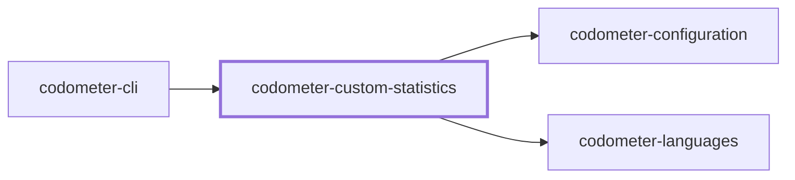
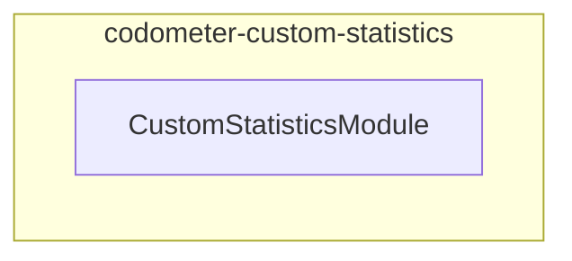

## Project Graph

Where this project sits in the Nx project graph: what it depends on, and what depends on it. Regenerated by `nx run synchronization:nx-project-graphs:write`.

<!-- nx-project-graph-start -->



<!-- nx-project-graph-end -->

## Module Graph

The modules this project defines and the imports between them, published by `nx run synchronization:nestjs-module-graphs:write`.

<!-- nestjs-module-graph-start -->



_Reached only for their types, and so declaring no module here: codometer-configuration and codometer-languages._

<!-- nestjs-module-graph-end -->

## Test

```bash
nx run codometer-custom-statistics:vitest
```
