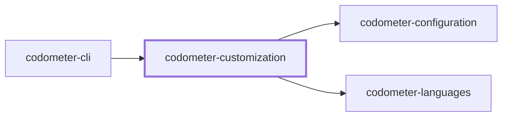
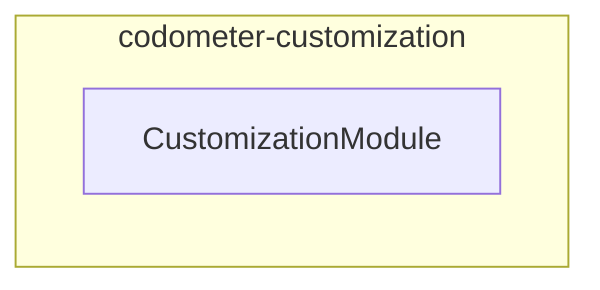
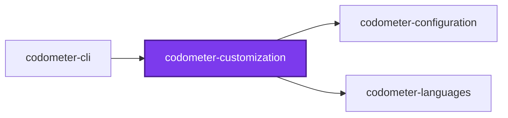
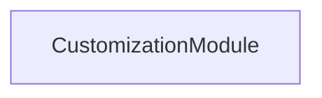
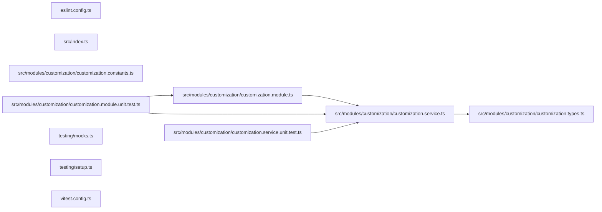

## Project Graph

Where this project sits in the Nx project graph: what it depends on, and what depends on it. Regenerated by `nx run synchronization:nx-project-graphs:write`.

<!-- nx-project-graph-start -->



<!-- nx-project-graph-end -->

## Module Graph

The modules this project defines and the imports between them, published by `nx run synchronization:nestjs-module-graphs:write`.

<!-- nestjs-module-graph-start -->



_Reached only for their types, and so declaring no module here: codometer-configuration and codometer-languages._

<!-- nestjs-module-graph-end -->

## Test

```bash
nx run codometer-customization:vitest
```

<!-- CALL_STACKS_START -->

## 🔭 Callidescope

Call stacks traced through `codometer-customization`, deepest first. Each frame shows what it takes, what it returns, and what its documentation says.

| Measure | Value |
| --- | --- |
| Callables | 8 |
| Files | 7 |
| Calls traced | 4 |
| Call stacks | 0 |
| Deepest stack | 0 |
| Stacks through recursion | 0 |
| Unfollowable calls | 0 |

### Call stacks (depth)

None.

### Module spread

None.

### Breadth

| Callable | Breadth | Calls directly | Location |
| --- | --- | --- | --- |
| `CustomizationService.countMatches` | 1 | `CustomizationService.filter(…)` | `packages/codometer-customization/src/modules/customization/customization.service.ts:40` |
| `CustomizationService.analyze` | 1 | `CustomizationService.map(…)` | `packages/codometer-customization/src/modules/customization/customization.service.ts:49` |
| `CustomizationService.map(…)` | 1 | `CustomizationService.countMatches` | `packages/codometer-customization/src/modules/customization/customization.service.ts:54` |

<details>
<summary>1 more callables</summary>

| Callable | Breadth | Calls directly | Location |
| --- | --- | --- | --- |
| `CustomizationService.buildSymbolCounters` | 1 | `CustomizationService.flatMap(…)` | `packages/codometer-customization/src/modules/customization/customization.service.ts:72` |

</details>

### Possibly misplaced

None.
<!-- CALL_STACKS_END -->

## 🕸️ Codependix

Dependency graphs exported by [codependix](https://github.com/JimmyPaolini/codebase/tree/main/packages/codependix-cli), regenerated by `nx run codebase:codependix:write`.

### Nx Neighborhood

<!-- codependix:start name="codependix-nx" -->

<!-- codependix:end name="codependix-nx" -->

### NestJS Module Graph

<!-- codependix:start name="codependix-nestjs" -->

<!-- codependix:end name="codependix-nestjs" -->

### File Imports

<!-- codependix:start name="codependix-imports" -->

<!-- codependix:end name="codependix-imports" -->
