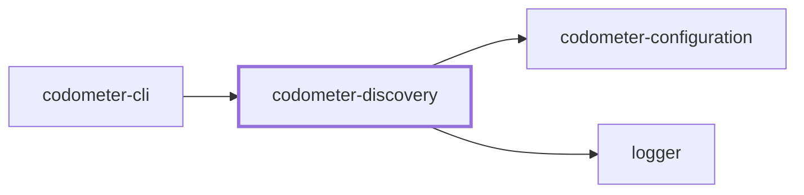
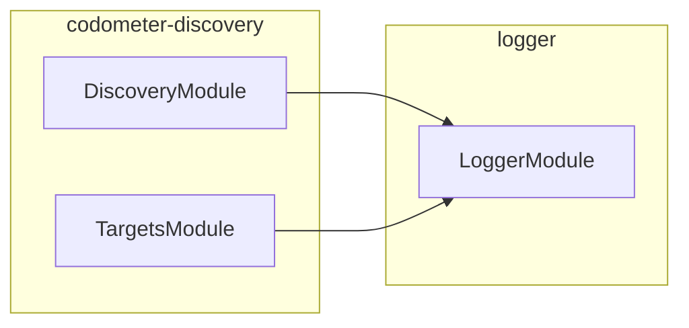

## Project Graph

Where this project sits in the Nx project graph: what it depends on, and what depends on it. Regenerated by `nx run synchronization:nx-project-graphs:write`.

<!-- nx-project-graph-start -->



<!-- nx-project-graph-end -->

## Module Graph

The modules this project defines and the imports between them, published by `nx run synchronization:nestjs-module-graphs:write`.

<!-- nestjs-module-graph-start -->



_Loaded at runtime rather than imported, and so absent from this container: codometer-configuration._

<!-- nestjs-module-graph-end -->

## Test

```bash
nx run codometer-discovery:vitest
```

<!-- CALL_STACKS_START -->

## 🔭 Callidescope

Call stacks traced through `codometer-discovery`, deepest first. Each frame shows what it takes, what it returns, and what its documentation says.

| Measure | Value |
| --- | --- |
| Callables | 49 |
| Files | 14 |
| Calls traced | 57 |
| Call stacks | 0 |
| Deepest stack | 0 |
| Stacks through recursion | 0 |
| Unfollowable calls | 1 |

### Call stacks (depth)

None.

### Module spread

None.

### Breadth

| Callable | Breadth | Calls directly | Location |
| --- | --- | --- | --- |
| `TargetsService.matchFiles` | 7 | `TargetsService.findBoundary`, `TargetsService.sitsInsideBoundary`, `TargetOutsideRepositoryError.constructor`, `TargetsService.readTargetPrefix`, `TargetsService.walk`, `TargetsService.map(…)`, `TargetsService.map(…)` | `packages/codometer-discovery/src/modules/targets/targets.service.ts:281` |
| `DiscoveryService.categorize` | 6 | `DiscoveryService.filter(…)`, `DiscoveryService.filterByExtension`, `DiscoveryService.filter(…)`, `DiscoveryService.filter(…)`, `DiscoveryService.filter(…)`, `DiscoveryService.filter(…)` | `packages/codometer-discovery/src/modules/discovery/discovery.service.ts:285` |
| `DiscoveryService.walkDirectory` | 4 | `DiscoveryService.readDirectoryEntries`, `DiscoveryService.applyDirectoryIgnoreFile`, `DiscoveryService.walkSubdirectory`, `DiscoveryService.isIgnoredPath` | `packages/codometer-discovery/src/modules/discovery/discovery.service.ts:217` |

<details>
<summary>18 more callables</summary>

| Callable | Breadth | Calls directly | Location |
| --- | --- | --- | --- |
| `TargetsService.walk` | 4 | `TargetsService.readEntries`, `TargetsService.resolveEntryKind`, `TargetsService.canDescend`, `TargetsService.isMatched` | `packages/codometer-discovery/src/modules/targets/targets.service.ts:238` |
| `DiscoveryService.listDiscoveredFiles` | 3 | `DiscoveryService.walkDirectory`, `DiscoveryService.readExcludeFromScopes`, `DiscoveryService.filter(…)` | `packages/codometer-discovery/src/modules/discovery/discovery.service.ts:145` |
| `DiscoveryService.walkSubdirectory` | 3 | `DiscoveryService.isExhaustivelyExcluded`, `DiscoveryService.isIgnoredPath`, `DiscoveryService.walkDirectory` | `packages/codometer-discovery/src/modules/discovery/discovery.service.ts:261` |
| `DiscoveryService.discoverFiles` | 2 | `DiscoveryService.categorize`, `DiscoveryService.listDiscoveredFiles` | `packages/codometer-discovery/src/modules/discovery/discovery.service.ts:317` |
| `TargetsService.canDescend` | 2 | `TargetsService.isHidden`, `TargetsService.some(…)` | `packages/codometer-discovery/src/modules/targets/targets.service.ts:49` |
| `TargetsService.some(…)` | 2 | `TargetsService.leadsToBase`, `TargetsService.sitsInsideBase` | `packages/codometer-discovery/src/modules/targets/targets.service.ts:55` |
| `TargetsService.isMatched` | 2 | `TargetsService.some(…)`, `TargetsService.some(…)` | `packages/codometer-discovery/src/modules/targets/targets.service.ts:125` |
| `IgnoreRulesService.isIgnored` | 1 | `IgnoreRulesService.toScopedPath` | `packages/codometer-discovery/src/modules/discovery/ignore-rules.service.ts:84` |
| `IgnoreRulesService.readScope` | 1 | `IgnoreRulesService.createScope` | `packages/codometer-discovery/src/modules/discovery/ignore-rules.service.ts:115` |
| `DiscoveryService.applyDirectoryIgnoreFile` | 1 | `IgnoreRulesService.readScope` | `packages/codometer-discovery/src/modules/discovery/discovery.service.ts:59` |
| `DiscoveryService.filterByExtension` | 1 | `DiscoveryService.filter(…)` | `packages/codometer-discovery/src/modules/discovery/discovery.service.ts:75` |
| `DiscoveryService.isExcluded` | 1 | `DiscoveryService.some(…)` | `packages/codometer-discovery/src/modules/discovery/discovery.service.ts:91` |
| `DiscoveryService.isExhaustivelyExcluded` | 1 | `DiscoveryService.some(…)` | `packages/codometer-discovery/src/modules/discovery/discovery.service.ts:105` |
| `DiscoveryService.isIgnoredPath` | 1 | `IgnoreRulesService.isIgnored` | `packages/codometer-discovery/src/modules/discovery/discovery.service.ts:128` |
| `DiscoveryService.filter(…)` | 1 | `DiscoveryService.isExcluded` | `packages/codometer-discovery/src/modules/discovery/discovery.service.ts:155` |
| `DiscoveryService.readExcludeFromScopes` | 1 | `IgnoreRulesService.readScope` | `packages/codometer-discovery/src/modules/discovery/discovery.service.ts:187` |
| `TargetsService.findBoundary` | 1 | `TargetsService.some(…)` | `packages/codometer-discovery/src/modules/targets/targets.service.ts:71` |
| `TargetsService.resolveEntryKind` | 1 | `TargetsService.isLinkedFile` | `packages/codometer-discovery/src/modules/targets/targets.service.ts:183` |

</details>

### Possibly misplaced

None.
<!-- CALL_STACKS_END -->
