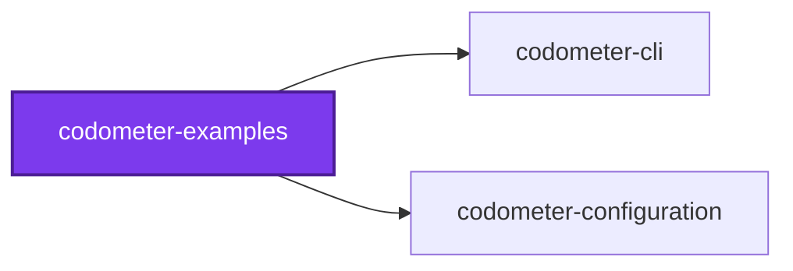

# ⏲️ Codometer Examples

**A sample corpus with known contents, and one runnable example per thing
codometer does.**

Codometer's more interesting half is the one no language analyzer can produce:
the conventions a repository holds _itself_ to. But declaring a custom
statistic, addressing a metric by its dotted path, or writing a limit against a
compiled target are all things you would otherwise learn from a thousand-line
reference with nothing to try them against.

This package is that something. Every command below is runnable, every number
is one the tool really produces, and a test asserts each of them — so a guide
that drifts from the tool fails a check rather than misleading you.

```bash
cd packages/codometer-examples
codometer --directory examples/corpus
```

## The corpus

`examples/corpus/` holds twenty-seven samples across twelve languages, plus the
`.gitignore` that hides its stand-in build directory. It is small enough to
count by hand, which is the whole point: a guide saying "four service files"
is only worth reading if you can check.

| What | Count |
| ---- | ----- |
| Files measured | 28 |
| Folders | 12 |
| Source files | 18 |
| TypeScript files | 15 |
| JavaScript files | 2 |
| One file each | Python, Jupyter, JSON, YAML, Markdown, SQL, Shell, TOML, HCL, CSS |
| `*.service.ts` files | 4 |
| `*.unit.test.ts` files | 6 |
| `*.integration.test.ts` files | 1 |
| Static methods | 4 |

Two more files sit in `examples/compiled/`, **beside** the corpus rather than inside it —
stand-ins for build output, which is where build output really lives. They are
what the target examples measure, and the codebase target never sees them
because it measures one directory and they are not in it.

`examples/corpus/.gitignore` is the other half of that story. It names `generated/`,
which is empty in a fresh checkout on purpose: a file that is both tracked and
ignored breaks `git add`, and so every pre-commit hook, for everyone who touches
it afterwards. Fill it yourself to watch discovery skip it — see
[section 5](#5-targets).

Every example runs against this one corpus, pointed at a different
configuration:

```bash
codometer --directory examples/corpus --config examples/<name>/<file>.config.ts
```

## 1. Every language analyzer

A bare run measures every language it recognizes. The corpus carries one
idiomatic sample per analyzer so each group has something in it:

```bash
codometer --directory examples/corpus --json | jq '.targets[0].metrics[] | select(.value > 0)'
```

Two things in the output surprise people:

- **TypeScript and JavaScript are one group.** A TypeScript class is counted
  under `javascript.classes`, not `typescript.classes`, because the group is
  "TypeScript & JavaScript" rather than two of them. `typescript.*` carries only
  what is TypeScript-specific — `files`, `interfaces`, `enums`, `decorators`,
  `docComments`, `genericDeclarations`. The corpus has 5 classes: four written
  in TypeScript and one in JavaScript.
- **A dot file is a file.** `examples/corpus/.gitignore` is measured like any other,
  which is why the count is 28 rather than 27.

## 2. Notebooks measured by composition

`examples/corpus/jupyter/holdings.ipynb` is codometer's least visible internal and its
most surprising. There is no fourth parser: the notebook is decomposed and
handed to three analyzers that already exist.

| Reaches | What it measures | This notebook |
| ------- | ---------------- | ------------- |
| JSON analyzer | The envelope — the document is JSON | `totalNodes` 74, `maxDepth` 8 |
| Python analyzer | The code cells | `classes` 1, `functions` 1, `codeLines` 18 |
| Markdown analyzer | The markdown cells | `headings` 2, `links` 1, `markdownLines` 8 |
| Jupyter analyzer | Only what is left | `cells` 5, `codeCells` 3, `markdownCells` 2, `executedCells` 3, `outputs` 2 |

Composition is about what is counted, not where it is filed. The notebook is
still one Jupyter file and **not** also a JSON, Python, or markdown one — all
three of those counts stay at 1, from the standalone samples.

## 3. Python through an interpreter

[`examples/python/`](examples/python)

Python analysis runs through an actual interpreter rather than a parser written
in TypeScript. Three configurations show what that means:

| Example | Declares | `python.classes` |
| ------- | -------- | ---------------- |
| [`default-interpreter.config.ts`](examples/python/default-interpreter.config.ts) | nothing — `python3` on PATH | 3 |
| [`uv.config.ts`](examples/python/uv.config.ts) | `python: { command: "uv run python" }` | 3 |
| [`unreachable-interpreter.config.ts`](examples/python/unreachable-interpreter.config.ts) | an interpreter that is not installed | 0 |

```bash
codometer --directory examples/corpus --config examples/python/uv.config.ts --json \
  | jq '.targets[0].metrics[] | select(.path | startswith("python."))'
```

The first two agree **on a machine whose `python3` is adequate**, and the test
asserts that agreement rather than assuming it. Naming the interpreter is what
stops the numbers depending on which machine the run happened on — a continuous
integration runner without `python3`, or with one too old for a sample's syntax,
gets the third row.

That third row is the one to recognize by shape. It **exits 0**, warns once on
standard error, and reports every `python.*` counter at 0 — including
`python.files`, so the file is found and simply cannot be read:

```text
🐍 Skipped Python analysis
   { reason: "Command failed: python-that-is-not-installed …: command not found" }
```

Nothing in the report says the interpreter was the problem. **A Python counter
reading zero for a directory you know has Python in it means the interpreter,
not the corpus.**

The notebook shows the seam plainly: `jupyter.cells` stays at 5 and
`jupyter.markdownCells` at 2, while `jupyter.classes` and `jupyter.functions`
fall to 0 alongside the standalone module — because a notebook's code cells go
to the same interpreter. One missing interpreter takes a slice out of two groups
at once, which is [composition](#2-notebooks-measured-by-composition) seen from
the failure side.

## 4. Custom statistics, both kinds

[`examples/statistics/codometer.config.ts`](examples/statistics/codometer.config.ts)

```bash
codometer --directory examples/corpus --config examples/statistics/codometer.config.ts
```

A counter carrying `patterns` counts **files**. A counter carrying `symbols`
counts **declarations**. The confusing part is what `patterns` does on a counter
that has both: it narrows _which files are searched_ rather than being what is
counted.

| Counter | Declared as | Result |
| ------- | ----------- | ------ |
| Service Files | `patterns: ["**/*.service.ts"]` | 4 |
| Unit Tests | `patterns: ["**/*.unit.test.ts"]` | 6 |
| Integration Tests | `patterns: [...]`, `color: "16a34a"` | 1 |
| Static Methods | `symbols: { kinds: ["method"], modifiers: ["static"] }` | 4 |
| Static Properties | `symbols: { kinds: ["property"], modifiers: ["static"] }` | 1 |
| Service Static Methods | the same `symbols`, plus `patterns: ["**/*.service.ts"]` | 3 |
| Exported Interfaces | `symbols: { kinds: ["interface"], modifiers: ["export"] }` | 6 |

Read the last two rows together. **Service Static Methods is 3, not 4** — the
narrowing removed `examples/corpus/javascript/receipt.js`, where the fourth static method
lives. It is still counting methods; `patterns` only said where to look.

And **Static Properties is 1**, which is the trap worth knowing:
`CatalogService.blank` is written as a class field holding an arrow function, so
it is a property and carries none of a method's modifiers. Asking for static
methods never finds it.

`color` is a shields.io hexadecimal triplet, and `group` decides which badge
group a counter renders into — `conventions` by default, or any rendered group
by name, which is how Static Methods lands beside the TypeScript badges rather
than under a heading of its own.

## 5. Targets

[`examples/targets/codometer.config.ts`](examples/targets/codometer.config.ts)

```bash
codometer --directory examples/corpus --config examples/targets/codometer.config.ts
```

A **target** is a named set of files, addressed by glob. That is what lets one
measure compiled output: something that lives outside the measured directory, is
named by a `.gitignore`, or both.

| Target | Declares | Files |
| ------ | -------- | ----- |
| `codebase` | the directory itself, ignore rules in force | 28 |
| `Compiled` | `directory: ".."`, `include: ["compiled/**/*.js"]` | 2 |
| `Compiled Without Vendor` | the same, plus `"!compiled/**/vendor.js"` | 1 |
| `Sources` | `include: ["typescript/**/*.ts"]`, `exclude: ["**/*.test.ts"]` | 8 |
| `Manifests` | `directory: ".."`, reaching the package's own manifests | 2 |

The `codebase` row against the `Compiled` row is the whole argument for targets:
28 files, none of them the two that a build produced, and a target that sees
exactly those two.

**Negations form one set applied to the whole target.** They are not read in
order, so rearranging the array cannot change what the target holds.
[`reordered.config.ts`](examples/targets/reordered.config.ts) is the same four
targets with every `include` written backwards, and the test asserts the two
reports name the same files — which is the only honest way to state a property
about an ordering nobody can see.

### Where ignore rules stop

[`examples/targets/ignored.config.ts`](examples/targets/ignored.config.ts)

`.gitignore` is already in force for the codebase target — discovery reads every
one it walks past, and never invokes git. A declared target's globs are the
exception. Try it:

```bash
cp -R packages/codometer-examples/examples/compiled packages/codometer-examples/examples/corpus/generated
codometer --directory examples/corpus --config examples/targets/ignored.config.ts
rm -rf packages/codometer-examples/examples/corpus/generated
```

`codebase` still reports 28 files — the copy is invisible to it, because
`examples/corpus/.gitignore` names `generated/`. `Ignored Output` reports the 2 that
discovery refused to walk into. That asymmetry is the entire reason a size gate
on a build directory can exist.

The directory is empty in the repository rather than committed, because a file
that is both tracked and ignored makes `git add` fail for everyone afterwards —
which breaks the pre-commit hook on every later change, not just the one that
introduced it.

Also worth knowing: **dot files are excluded unless a glob spells one out**. The
`Corpus` target this package gates itself on includes `examples/corpus/**` and holds 27
files — the samples, and not the `.gitignore` beside them.

## 6. Compression

```bash
codometer --directory examples/corpus --config examples/compression/gzip.config.ts
codometer --directory examples/corpus --config examples/compression/brotli.config.ts
codometer --directory examples/corpus --config examples/compression/none.config.ts
```

The same two files, three ways. On the Node release this repository pins they
measure roughly 2100 bytes uncompressed, 1040 gzipped, and 840 with brotli —
gzip at level 9 and brotli at quality 11, both stated rather than defaulted.

Two properties matter more than the numbers:

- **Each file is compressed on its own and the results summed** — never all of
  them together as one archive. That is the number a browser pays, file by file
  over the wire, rather than the smaller one a tar of the directory would report
  by finding redundancy across files nobody downloads together.
- **The numbers are not portable.** They depend on the zlib the runtime bundles,
  which is what makes section 12 below a trap rather than a footnote.

## 7. Limits, including every refusal

A **limit** is how high one measured metric may go. The refusals are where
codometer is opinionated, so each one has a configuration of its own.

| Example | Shows | Exit |
| ------- | ----- | ---- |
| [`unprefixed.config.ts`](examples/limits/unprefixed.config.ts) | a path with no target name binds to nothing | 1 |
| [`warn.config.ts`](examples/limits/warn.config.ts) | `severity: "warn"` prints and leaves the exit code alone | 0 |
| [`fail.config.ts`](examples/limits/fail.config.ts) | a `fail` beneath a `warn`; both reported, one gates | 1 |
| [`ambiguous.config.ts`](examples/limits/ambiguous.config.ts) | a path that reads two ways, refused naming both | 1 |
| [`unbound.config.ts`](examples/limits/unbound.config.ts) | a path naming nothing, and one naming an analysis never run | 1 |
| [`default-target.config.ts`](examples/limits/default-target.config.ts) | `defaultTarget` resolving an unprefixed path | 0 |
| [`units.config.ts`](examples/limits/units.config.ts) | `"8 KB"` is 8000 and `"1 MB"` is 1000000 | 1 |
| [`unreadable-unit.config.ts`](examples/limits/unreadable-unit.config.ts) | `"8 K"` refused rather than guessed at | 1 |
| [`empty-target-limited.config.ts`](examples/limits/empty-target-limited.config.ts) | an empty target with a limit fails | 1 |
| [`empty-target-unlimited.config.ts`](examples/limits/empty-target-unlimited.config.ts) | the same target without one passes | 0 |

Run any of them the same way:

```bash
codometer --directory examples/corpus --config examples/limits/fail.config.ts --check limits
```

### The stumble almost everyone hits first

[`examples/limits/unprefixed.config.ts`](examples/limits/unprefixed.config.ts)

**A path with no target name on the front binds to nothing** unless
`defaultTarget` names the target it belongs to — even when only one target was
measured and there is nothing it could be confused with:

```text
Cannot bind the limit written against "linesOfCode": nothing measured answers
to it. Measured targets: "codebase". Write the target's name in front of the
metric path, or configure a default target.
```

Write `codebase.linesOfCode`, or set `defaultTarget: "codebase"`.

### Ambiguity is refused, never resolved

Two things together make a path ambiguous: a target sharing a name with a metric
group, and a `defaultTarget` that makes the unprefixed path readable as the
default target's too.

```text
Cannot bind the limit written against "markdown.files": it could be the
"markdown" target's "files" metric, or the "codebase" target's "markdown.files"
metric. Write the target's name in front of the one it means.
```

Worth noticing: **dropping the `defaultTarget` removes the ambiguity**, because
the path then reads only as the target's. A `defaultTarget` added for
convenience can break a limit written before it.

The other side of the same coin is
[`default-target.config.ts`](examples/limits/default-target.config.ts), which is
the case the codometer README calls out by name: with `defaultTarget: "codebase"`
and a target called `typescript`, `typescript.interfaces` is the **codebase's**
six interfaces, because the `typescript` target has no `interfaces` metric of
its own to compete with it. `typescript.files` under that same configuration is
refused, because both readings exist.

### Empty targets

A target that matched no files fails the run **if and only if** a limit is
written against it. Declaring a limit asserts the files are there, so an empty
match is a glob that stopped matching or a build that never ran:

```text
Target "Never Built" matched no files, and a limit is written against its
"size" metric. A limit says the files are there, so an empty match is a glob
that stopped matching or a build that never ran — not a measurement of zero.
```

A target nobody limited simply measured nothing, and the report says
`"empty": true` outright rather than leaving you to infer it from a size of zero.

### Documentation limits

[`examples/documentation/codometer.config.ts`](examples/documentation/codometer.config.ts)

A **documentation limit** is how long one documented declaration's JSDoc comment
may run, per declaration kind. It is opt-in, and gated by the same
`--check limits` flag as every other limit — there is no separate flag, and no
`metric` path to write, because declarations are found rather than addressed.

```bash
codometer --directory examples/corpus --config examples/documentation/codometer.config.ts --check limits
```

Under that configuration the corpus reports **26 documented declarations**, of
which **2 breach**: `CatalogService`, whose eight-line overview is longer than a
class's 4, and `Receipt.blank`, whose seven-line note is longer than a method's
2. Every other declaration is reported too, with its headroom — the report lists
what held as well as what did not.

What is absent is as informative: a module-level `const`, including one holding
an arrow function, is not a documented declaration and is never measured. So
`priceLine` and `DEFAULT_CURRENCY` never appear, whatever comments they carry.

## 8. The `--write` / `--check` matrix

[`examples/write-check/codometer.config.ts`](examples/write-check/codometer.config.ts)

`--write` and `--check` are independent, and no combination is inferred. That is
the whole surface:

| Invocation | Writes | Fails on staleness | Fails on a breach | Exit |
| ---------- | ------ | ------------------ | ----------------- | ---- |
| `codometer` | no | no | no | 0 |
| `codometer --check limits` | no | no | yes | 1 |
| `codometer --check reports` | no | yes | no | 0 |
| `codometer --check reports,limits` | no | yes | yes | 1 |
| `codometer --write` | yes | no | no | 0 |
| `codometer --write --check limits` | yes | no | yes, after writing | 1 |

Every row is run against a scratch copy of the corpus by the test beside these
files, with the exit code above and the files on disk checked afterwards. The
last row is the one worth trying yourself: **the report is on disk even though
the run exits 1**, because a pull request that failed the gate is exactly the
one that needs the numbers.

A bare run reports a breach and exits 0. A breach is a finding; only
`--check limits` turns a finding into a gate.

Two command lines are refused before anything is measured:

```text
--write cannot be combined with --check reports: a report cannot be stale in
the run that just wrote it. Drop one of them, or run --write and --check
reports separately.
```

```text
--check does not accept "everything". It takes a comma-separated set drawn from
"limits" and "reports", as in "--check limits,reports".
```

## 9. The three sinks

[`examples/output/`](examples/output)

| Sink | Flag | What lands there |
| ---- | ---- | ---------------- |
| Report | `--json [path]` | the structured report |
| Document | `-m, --markdown [path]` | the rendered badges as a whole file |
| Splice | `--readme <path>` | the badge block, between two markers |

Each of the three has a runnable example below, and each is asserted by a test.

**Standard output carries the result; every diagnostic goes to standard error.**
So the report survives a pipe, log lines and all:

```bash
codometer --directory examples/corpus --json | jq '.targets[0].files'   # 28
```

The test proves that by taking the bytes the run wrote to standard output — and
only those — and feeding them to a second process that parses them. One warning
sharing the stream would break it.

**The document sink writes the badges as a whole file**, markers and all absent,
which is what a page that is nothing but statistics wants:

```bash
codometer --directory examples/corpus -m document.md --write
```

**`--json <path>` is refused unless the run writes or compares it**, because a
run doing neither would render the report to the console and leave that file
unwritten — noticed not here but downstream, by whatever reads the report,
finding nothing:

```text
--json report.json needs --write or --check reports: a run that neither writes
the report nor compares it would render it to the console and leave that file
unwritten. Add --write to write it, --check reports to fail on a stale one, or
drop the path to ask for the console.
```

A pathless `--json` is untouched: the console is what it asked for.

**A named destination stands for all of them.** `--json only-this.json --write`
against
[`examples/output/codometer.config.ts`](examples/output/codometer.config.ts)
writes the report and **not** the configured markdown document. Adding to the
configured set instead would put a second document on the stream the first was
piped out of.

### Splicing

The block sits between `CODE_STATISTICS_START` and `CODE_STATISTICS_END` unless
a configuration renames them. It is **appended when the markers are absent** and
the **file is created when it does not exist**, so a destination needs nothing
in it beforehand; a second run rewrites the block in place rather than appending
another.

[`renamed-markers.config.ts`](examples/output/renamed-markers.config.ts) renames
them, and the reason is not cosmetic: a document that _explains_ the default
markers holds the default start marker in its own prose, so codometer reads it
as already carrying the block and rewrites the wrong region. This README renames
its own markers for exactly that reason, and so does the codometer README.

### Replacing half the behavior

`render` decides what markdown is produced; `write` decides which file it lands
in and how. **Supplying one keeps the built-in other.**

- [`custom-render.config.ts`](examples/output/custom-render.config.ts) adds a
  line above the badges by calling `renderBadges()`, the built-in rendering of
  those same statistics — and the result is still spliced between the markers by
  the built-in writer.
- [`custom-write.config.ts`](examples/output/custom-write.config.ts) picks the
  destination from what was measured, splicing with
  `anchors.syncAnchoredBlock` so choosing a different file does not mean
  reimplementing marker handling. The content it splices is the default badge
  block.

One detail that costs an afternoon otherwise: **derive a custom writer's
destination from the `path` it was handed**, which is already resolved against
the measured directory. A bare filename passed to `syncAnchoredBlock` is not
resolved the same way and lands relative to the working directory the command
was run from — for an Nx target, the workspace root rather than the project.

## 10. One folder at a time

Codometer measures **one directory** and knows nothing about workspaces or
project graphs. With no `--config`, the configuration is found by walking upward
and taking the **first** file found. The nearest one wins outright; nothing from
a further ancestor is folded in, because a merged configuration leaves a limit
that never applied looking exactly like one that did.

```bash
# examples/discovery/nested carries its own configuration, and it wins:
# one badge, "Configurations", and none of this package's counters.
codometer --directory examples/discovery/nested

# One folder up carries none, so the search continues to this package's:
# "Service Files" and "Unit Tests" return, "Configurations" does not.
codometer --directory examples/discovery
```

Three configuration files sit above that nested one — this package's, the
workspace root's, and the file the root one re-exports — and a run in
`examples/discovery/nested` takes nothing from any of them.

This package's own [`codometer.config.ts`](codometer.config.ts) is the other
half of the same idea: it is a **function**, handed the folder being measured,
so one file answers for the package (where the corpus is a size-gated target)
and for every folder beneath it (where it is not). That is also what the
workspace root's configuration does for every project in this repository, which
is why almost none of them carry a configuration file at all.

## 11. What codometer writes, it does not measure

[`examples/output/self-excluded.config.ts`](examples/output/self-excluded.config.ts)

Every file a run would write is left out of what it measures, with no
configuration and no ignore-file entry — codometer knows its own destinations —
and the run says so on the console:

```text
📊 Excluded the files codometer writes from what it measures
   { paths: ["codometer-report.json", "statistics.md"] }
```

The reason is circular otherwise. A badge is an image inside a link, so a
spliced block moves `markdown.images`, `markdown.links`, and `markdown.lines` —
which moves the badges, which moves the counts. A report left in would be stale
the moment it landed.

Run it twice against a scratch copy and read the report the second run wrote:

```bash
cp -R examples/corpus /tmp/copy
codometer --directory /tmp/copy --config examples/output/self-excluded.config.ts --write
codometer --directory /tmp/copy --config examples/output/self-excluded.config.ts --write
jq '.targets[0].files' /tmp/copy/codometer-report.json   # 28
```

Still 28, one markdown file, one JSON file — exactly what a run before either
file existed reported. The exclusion is applied identically whatever the flags
say, so a `--write` run and a `--check reports` run always measure the same tree.

**Read the report from disk rather than adding `--json` to the second run.** A
destination named on the command line stands for all of them, so `--json`
replaces the configured pair with the console — and a run that was never going
to write those two files has no reason to exclude them. It reports 30.

## 12. `--check reports` and false staleness

[`examples/staleness/codometer.config.ts`](examples/staleness/codometer.config.ts)

`--check reports` compares a committed report against a fresh measurement, so it
is only as stable as the numbers it re-measures — and compressed sizes are not
stable across machines. The bundled zlib differs between Node releases, so a
report written on one runtime and checked on another reads as **stale when
nothing changed at all**.

The failure names a size that moved and looks exactly like a real regression,
which is why it is worth reproducing rather than only warning about. The
reproduction stands in for the runtime difference by editing the number the
other runtime would have produced:

```bash
cp -R examples/corpus /tmp/stale
codometer --directory /tmp/stale --config examples/staleness/codometer.config.ts --write
codometer --directory /tmp/stale --config examples/staleness/codometer.config.ts --check reports
echo $?   # 0

# Stand in for a different Node release's zlib. Nothing in the tree changes.
jq '(.targets[].metrics[] | select(.path == "size") | .value) += 1' \
  /tmp/stale/codometer-report.json > /tmp/stale/patched.json
mv /tmp/stale/patched.json /tmp/stale/codometer-report.json

codometer --directory /tmp/stale --config examples/staleness/codometer.config.ts --check reports
echo $?   # 1 — "Found stale reports"
```

Check on the runtime the repository pins, or expect a false finding rather than
a real one. A report carrying no size at all never meets this: every other
metric is a count, and counts do not move between runtimes.

## Gating a pull request on it

The five steps this guide set out to cover end here: measure a directory,
declare a counter, add a target, write a limit — and then make a change that
breaches it fail before it lands.

Two commands do that, and they are deliberately different jobs:

```bash
# On the branch: measure, write the report, fail if a limit breached.
codometer --directory . --json codometer-report.json --write --check limits

# Afterwards: diff every report against the base branch's and render the result.
codometer changes --directory . --baseline <base-reports> --markdown summary.md
```

The first is the gate. `--write` is not optional on it: a run naming a report
path without writing is [refused outright](#9-the-three-sinks), and the report
has to exist even when the gate trips, because the pull request that failed is
the one that needs the numbers. That is the last row of
the `--write` / `--check` matrix above, and it is exactly what this
repository's own `codometer` Nx target runs per project.

The second is the report a reviewer reads: `codometer changes` joins each
project's fresh `codometer-report.json` against a snapshot of the base branch's
and renders what moved. The join key is the metric's `name` — its target's name
then its path — which is why a target's name is worth choosing once and leaving
alone. Rename a target and every metric under it reads as removed and re-added.

Three things are worth knowing before wiring this up:

- **Gate on `limits`, not on `reports`, from a branch.** Staleness is a
  different finding, it is
  [not portable across runtimes](#12---check-reports-and-false-staleness), and a
  branch's committed report is expected to lag the default branch's.
- **A limit is an assertion that the files exist.** A target that matched
  nothing fails the gate — see
  [empty targets](#empty-targets) — which is the check earning its keep on the
  day a build silently produces nothing.
- **Put a `warn` under the `fail`.** One metric may carry both, the report lists
  both, and the warn is how the number is seen coming before it stops anybody.
  [`fail.config.ts`](examples/limits/fail.config.ts) is that pair.

## Keeping it honest

A guide quoting a count the tool no longer produces is worse than no guide, and
this package's whole value is that its numbers are checkable. So they are
checked:

```bash
nx run codometer-examples:vitest
```

The tests drive the real command line over the corpus — the same seam the guides
describe — and assert the counts, the exit codes, and the sentences the
refusals print. What is deliberately **not** asserted as a literal is anything a
runtime can move: line counts and byte sizes are checked as ranges, because
pinning them would fail for reasons no reader cares about, and section 12 is the
proof that pinning a compressed size would fail for reasons that are not even
true.

This package also measures itself, gated on the corpus staying small:

```bash
nx run codometer-examples:codometer:check
```

## Notes on the corpus

- **It is not measured with the repository.** `configuration/.codometerignore`
  excludes it, so twenty-seven sample files in twelve languages do not distort
  the statistics of the repository that happens to hold them.
- **It is not linted like source.** The samples exist to be counted, and several
  are deliberately shaped the way this repository's own conventions are not — a
  static method, an uncalled export, a near-identical sample per language.
  Linting them would either stop them demonstrating what they demonstrate or
  bury them under suppression comments, so the corpus is scoped out of ESLint,
  knip, jscpd, and fallow deliberately, once, in each tool's configuration.
- **It is polyglot but tagged `language:typescript`.** The tag decides which
  composite targets a project runs, and pointing `ruff`, `pyright`, and
  `sqlfluff` at sample files would force them to be more than samples. They are
  data, not source.

## Test

```bash
nx run codometer-examples:vitest
```

## License

MIT — see [LICENSE](../../LICENSE).

<!-- SAMPLE_STATISTICS_START -->

## ⏲️ Codometer

Statistics for the sample corpus and the guides beside it, measured by [codometer](../codometer-cli), regenerated by `nx run codometer-examples:codometer:write`.

### Project


### Measured Targets


### TypeScript


### JavaScript


### Python


### JSON


### YAML


### TOML


### Shell


### SQL


### HCL


### CSS


### Conventions


### Jupyter


### Markdown


<!-- SAMPLE_STATISTICS_END -->

## 🕸️ Codependix

Dependency graphs exported by [codependix](https://github.com/JimmyPaolini/codebase/tree/main/packages/codependix-cli), regenerated by `nx run codebase:codependix:write`.

### Nx Neighborhood

<!-- codependix:start name="codependix-nx" -->

<!-- codependix:end name="codependix-nx" -->

### File Imports

```mermaid
graph LR
  file_codometer_config_ts["codometer.config.ts"]
  file_eslint_config_ts["eslint.config.ts"]
  file_examples_compression_brotli_config_ts["examples/compression/brotli.config.ts"]
  file_examples_compression_gzip_config_ts["examples/compression/gzip.config.ts"]
  file_examples_compression_none_config_ts["examples/compression/none.config.ts"]
  file_examples_discovery_nested_codometer_config_ts["examples/discovery/nested/codometer.config.ts"]
  file_examples_documentation_codometer_config_ts["examples/documentation/codometer.config.ts"]
  file_examples_limits_ambiguous_config_ts["examples/limits/ambiguous.config.ts"]
  file_examples_limits_default_target_config_ts["examples/limits/default-target.config.ts"]
  file_examples_limits_empty_target_limited_config_ts["examples/limits/empty-target-limited.config.ts"]
  file_examples_limits_empty_target_unlimited_config_ts["examples/limits/empty-target-unlimited.config.ts"]
  file_examples_limits_fail_config_ts["examples/limits/fail.config.ts"]
  file_examples_limits_unbound_config_ts["examples/limits/unbound.config.ts"]
  file_examples_limits_units_config_ts["examples/limits/units.config.ts"]
  file_examples_limits_unprefixed_config_ts["examples/limits/unprefixed.config.ts"]
  file_examples_limits_unreadable_unit_config_ts["examples/limits/unreadable-unit.config.ts"]
  file_examples_limits_warn_config_ts["examples/limits/warn.config.ts"]
  file_examples_output_codometer_config_ts["examples/output/codometer.config.ts"]
  file_examples_output_custom_render_config_ts["examples/output/custom-render.config.ts"]
  file_examples_output_custom_write_config_ts["examples/output/custom-write.config.ts"]
  file_examples_output_renamed_markers_config_ts["examples/output/renamed-markers.config.ts"]
  file_examples_output_self_excluded_config_ts["examples/output/self-excluded.config.ts"]
  file_examples_python_default_interpreter_config_ts["examples/python/default-interpreter.config.ts"]
  file_examples_python_unreachable_interpreter_config_ts["examples/python/unreachable-interpreter.config.ts"]
  file_examples_python_uv_config_ts["examples/python/uv.config.ts"]
  file_examples_staleness_codometer_config_ts["examples/staleness/codometer.config.ts"]
  file_examples_statistics_codometer_config_ts["examples/statistics/codometer.config.ts"]
  file_examples_targets_codometer_config_ts["examples/targets/codometer.config.ts"]
  file_examples_targets_ignored_config_ts["examples/targets/ignored.config.ts"]
  file_examples_targets_reordered_config_ts["examples/targets/reordered.config.ts"]
  file_examples_write_check_codometer_config_ts["examples/write-check/codometer.config.ts"]
  file_testing_codometer_ts["testing/codometer.ts"]
  file_testing_corpus_end_to_end_test_ts["testing/corpus.end-to-end.test.ts"]
  file_testing_examples_end_to_end_test_ts["testing/examples.end-to-end.test.ts"]
  file_testing_setup_ts["testing/setup.ts"]
  file_vitest_config_ts["vitest.config.ts"]
  file_testing_corpus_end_to_end_test_ts --> file_testing_codometer_ts
  file_testing_examples_end_to_end_test_ts --> file_testing_codometer_ts
```

<!-- codependix:start name="codependix-imports" -->

<!-- codependix:end name="codependix-imports" -->
