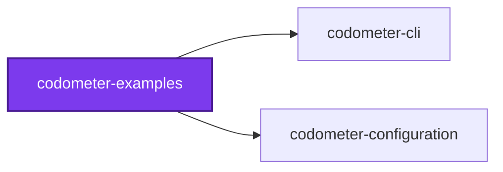

# ⏲️ Codometer Examples

**A sample corpus with known contents, and one runnable example per thing
codometer does.**

Codometer's more interesting half is the one no language analyzer can produce:
the conventions a repository holds _itself_ to. But declaring a custom
statistic, addressing a metric by its dotted path, or writing a limit against a
compiled target are all things you would otherwise learn from a thousand-line
reference with nothing to try them against.

This package is that something. Every command in every example is runnable,
every number is one the tool really produces, and a test asserts each of them —
so a guide that drifts from the tool fails a check rather than misleading you.

Nothing in the corpus is meant to be good code. Every sample exists to be
counted, and several are deliberately shaped the way this repository's own
conventions are not.

```bash
nx run codometer-examples:examples          # run every example, gate on what it prints
nx run codometer-examples:vitest            # assert every number below
nx run codometer-examples:codometer:write   # regenerate this README's badge section
```

Agents arriving from a codometer report should start at [AGENTS.md](AGENTS.md),
which maps "codometer said X" to the example that explains X.

## The examples

Each directory under [`examples/`](examples) is one example and carries its own
`README.md`. Read in this order for a walkthrough; jump straight in for an
answer. Every one of them measures the same corpus, pointed at a different
configuration:

```bash
codometer --directory examples/corpus --config examples/<name>/<file>.config.ts
```

| Example | Answers |
| ------- | ------- |
| [statistics](examples/statistics/README.md) | How do I count a convention no analyzer knows about? |
| [python](examples/python/README.md) | Why is every Python counter zero? |
| [targets](examples/targets/README.md) | How do I measure files the directory does not hold? |
| [compression](examples/compression/README.md) | What does a `size` metric actually measure? |
| [limits](examples/limits/README.md) | How high may a metric go, and why was my limit refused? |
| [documentation](examples/documentation/README.md) | How long may a doc comment run? |
| [write-check](examples/write-check/README.md) | What does each `--write` and `--check` combination do? |
| [output](examples/output/README.md) | Where does the report, the document, and the badge block land? |
| [discovery](examples/discovery/README.md) | Which configuration file wins? |
| [staleness](examples/staleness/README.md) | Why is `--check reports` failing when nothing changed? |

## The fixtures

Two directories under `examples/` are not examples. They are the subject every
example measures, and they carry no `README.md` of their own — a markdown file
inside the corpus would change the very counts these guides quote.

### The corpus

`examples/corpus/` holds twenty-seven samples across twelve languages, plus the
`.gitignore` that hides its stand-in build directory. It is small enough to
count by hand, which is the whole point: a guide saying "four service files"
is only worth reading if you can check.

| What | Count |
| ---- | ----- |
| Files measured | 28 |
| Folders | 12 |
| Source files | 18 |
| TypeScript files | 15 |
| JavaScript files | 2 |
| One file each | Python, Jupyter, JSON, YAML, Markdown, SQL, Shell, TOML, HCL, CSS |
| `*.service.ts` files | 4 |
| `*.unit.test.ts` files | 6 |
| `*.integration.test.ts` files | 1 |
| Static methods | 4 |

`examples/corpus/.gitignore` names `generated/`, which is empty in a fresh
checkout on purpose: a file that is both tracked and ignored breaks `git add`,
and so every pre-commit hook, for everyone who touches it afterwards. Fill it
yourself to watch discovery skip it — see
[targets](examples/targets/README.md#where-ignore-rules-stop).

### The compiled stand-ins

Two more files sit in `examples/compiled/`, **beside** the corpus rather than
inside it — stand-ins for build output, which is where build output really
lives. They are what [targets](examples/targets/README.md) and
[compression](examples/compression/README.md) measure, and a bare corpus
measurement never sees them because it measures one directory and they are not
in it.

### Every language analyzer

A bare run measures every language it recognizes. The corpus carries one
idiomatic sample per analyzer so each group has something in it:

```bash
codometer --directory examples/corpus --format json | jq '.targets[0].metrics[] | select(.value > 0)'
```

Two things in the output surprise people:

- **TypeScript and JavaScript are one group.** A TypeScript class is counted
  under `javascript.classes`, not `typescript.classes`, because the group is
  "TypeScript & JavaScript" rather than two of them. `typescript.*` carries only
  what is TypeScript-specific — `files`, `interfaces`, `enums`, `decorators`,
  `docComments`, `genericDeclarations`. The corpus has 5 classes: four written
  in TypeScript and one in JavaScript.
- **A dot file is a file.** `examples/corpus/.gitignore` is measured like any
  other, which is why the count is 28 rather than 27.

### Notebooks measured by composition

`examples/corpus/jupyter/holdings.ipynb` is codometer's least visible internal
and its most surprising. There is no fourth parser: the notebook is decomposed
and handed to three analyzers that already exist.

| Reaches | What it measures | This notebook |
| ------- | ---------------- | ------------- |
| JSON analyzer | The envelope — the document is JSON | `totalNodes` 74, `maxDepth` 8 |
| Python analyzer | The code cells | `classes` 1, `functions` 1, `codeLines` 18 |
| Markdown analyzer | The markdown cells | `headings` 2, `links` 1, `markdownLines` 8 |
| Jupyter analyzer | Only what is left | `cells` 5, `codeCells` 3, `markdownCells` 2, `executedCells` 3, `outputs` 2 |

Composition is about what is counted, not where it is filed. The notebook is
still one Jupyter file and **not** also a JSON, Python, or markdown one — all
three of those counts stay at 1, from the standalone samples.

[python](examples/python/README.md) shows the same seam from the failure side:
one missing interpreter takes a slice out of two groups at once.

## Gating a pull request on it

The examples end here. What they add up to is a gate: measure a directory,
declare a counter, add a target, write a limit — and then make a change that
breaches it fail before it lands.

Two commands do that, and they are deliberately different jobs:

```bash
# On the branch: measure, write the report, fail if a limit breached.
codometer --directory . --output-json codometer-report.json --write --check limits

# Afterwards: diff every report against the base branch's and render the result.
codometer changes --directory . --baseline <base-reports> --markdown summary.md
```

The first is the gate. `--write` is not optional on it: a run naming a report
path without writing is
[refused outright](examples/output/README.md#a-path-needs-a-reason-to-exist),
and the report has to exist even when the gate trips, because the pull request
that failed is the one that needs the numbers. That is the last row of the
[`--write` / `--check` matrix](examples/write-check/README.md), and it is
exactly what this repository's own `codometer` Nx target runs per project.

The second is the report a reviewer reads: `codometer changes` joins each
project's fresh `codometer-report.json` against a snapshot of the base branch's
and renders what moved. The join key is the metric's `name` — its target's name
then its path — which is why a target's name is worth choosing once and leaving
alone. Rename a target and every metric under it reads as removed and re-added.

Three things are worth knowing before wiring this up:

- **Gate on `limits`, not on `reports`, from a branch.** Staleness is a
  different finding, it is
  [not portable across runtimes](examples/staleness/README.md), and a branch's
  committed report is expected to lag the default branch's.
- **A limit is an assertion that the files exist.** A target that matched
  nothing fails the gate — see
  [empty targets](examples/limits/README.md#empty-targets) — which is the check
  earning its keep on the day a build silently produces nothing.
- **Put a `warn` under the `fail`.** One metric may carry both, the report lists
  both, and the warn is how the number is seen coming before it stops anybody.
  [`fail.config.ts`](examples/limits/fail.config.ts) is that pair.

## Keeping it honest

A guide quoting a count the tool no longer produces is worse than no guide, and
this package's whole value is that its numbers are checkable. So they are
checked:

```bash
nx run codometer-examples:examples
nx run codometer-examples:vitest
```

The first runs every example configuration the way its guide says to and gates
on the exit code it promised. The second drives the real command line over the
corpus — the same seam the guides describe — and asserts the counts and the
sentences the refusals print. What is deliberately **not** asserted as a literal
is anything a runtime can move: line counts and byte sizes are checked as
ranges, because pinning them would fail for reasons no reader cares about, and
[staleness](examples/staleness/README.md) is the proof that pinning a compressed
size would fail for reasons that are not even true.

This package also measures itself, gated on the corpus staying small:

```bash
nx run codometer-examples:codometer:check
```

## Notes on the corpus

- **It is not measured with the repository.** `configuration/.codometerignore`
  excludes it, so twenty-seven sample files in twelve languages do not distort
  the statistics of the repository that happens to hold them.
- **It is not linted like source.** The samples exist to be counted, and several
  are deliberately shaped the way this repository's own conventions are not — a
  static method, an uncalled export, a near-identical sample per language.
  Linting them would either stop them demonstrating what they demonstrate or
  bury them under suppression comments, so the corpus is scoped out of ESLint,
  knip, jscpd, and fallow deliberately, once, in each tool's configuration.
- **It is polyglot but tagged `language:typescript`.** The tag decides which
  composite targets a project runs, and pointing `ruff`, `pyright`, and
  `sqlfluff` at sample files would force them to be more than samples. They are
  data, not source.

## Layout

```text
codometer-examples/
├── codometer.config.ts                what measures this package, and its first example
├── examples/
│   ├── corpus/                        the fixture every example measures
│   ├── compiled/                      stand-ins for build output, beside the corpus
│   └── <name>/                        one example: configurations and a README.md
└── testing/
    ├── codometer.ts                   the command-line driver every test goes through
    ├── corpus.integration.test.ts     the corpus contents the guides quote
    └── examples.integration.test.ts   every example, asserted against its guide
```

This package has no `src/`. Nothing here is imported by anything — the
configurations are read by the tool, and the corpus is read as data.

## Test

```bash
nx run codometer-examples:vitest
```

## License

MIT — see [LICENSE](../../LICENSE).

<!-- SAMPLE_STATISTICS_START -->

## ⏲️ Codometer

Statistics for the sample corpus and the guides beside it, measured by [codometer](../codometer-cli), regenerated by `nx run codometer-examples:codometer:write`.

### Project


### Measured Targets


### TypeScript


### JavaScript


### Python


### JSON


### YAML


### TOML


### Shell


### SQL


### HCL


### CSS


### Conventions


### Jupyter


### Markdown


<!-- SAMPLE_STATISTICS_END -->

## 🕸️ Codependix

Dependency graphs exported by [codependix](https://github.com/JimmyPaolini/codebase/tree/main/packages/codependix-cli), regenerated by `nx run codebase:codependix:write`.

### Nx Neighborhood

<!-- codependix:start name="codependix-nx" -->

<!-- codependix:end name="codependix-nx" -->

### File Imports

```mermaid
graph LR
  file_codometer_config_ts["codometer.config.ts"]
  file_eslint_config_ts["eslint.config.ts"]
  file_examples_compression_brotli_config_ts["examples/compression/brotli.config.ts"]
  file_examples_compression_gzip_config_ts["examples/compression/gzip.config.ts"]
  file_examples_compression_none_config_ts["examples/compression/none.config.ts"]
  file_examples_discovery_nested_codometer_config_ts["examples/discovery/nested/codometer.config.ts"]
  file_examples_documentation_codometer_config_ts["examples/documentation/codometer.config.ts"]
  file_examples_limits_ambiguous_config_ts["examples/limits/ambiguous.config.ts"]
  file_examples_limits_default_target_config_ts["examples/limits/default-target.config.ts"]
  file_examples_limits_empty_target_limited_config_ts["examples/limits/empty-target-limited.config.ts"]
  file_examples_limits_empty_target_unlimited_config_ts["examples/limits/empty-target-unlimited.config.ts"]
  file_examples_limits_fail_config_ts["examples/limits/fail.config.ts"]
  file_examples_limits_unbound_config_ts["examples/limits/unbound.config.ts"]
  file_examples_limits_units_config_ts["examples/limits/units.config.ts"]
  file_examples_limits_unprefixed_config_ts["examples/limits/unprefixed.config.ts"]
  file_examples_limits_unreadable_unit_config_ts["examples/limits/unreadable-unit.config.ts"]
  file_examples_limits_warn_config_ts["examples/limits/warn.config.ts"]
  file_examples_output_codometer_config_ts["examples/output/codometer.config.ts"]
  file_examples_output_custom_render_config_ts["examples/output/custom-render.config.ts"]
  file_examples_output_custom_write_config_ts["examples/output/custom-write.config.ts"]
  file_examples_output_renamed_markers_config_ts["examples/output/renamed-markers.config.ts"]
  file_examples_output_self_excluded_config_ts["examples/output/self-excluded.config.ts"]
  file_examples_python_default_interpreter_config_ts["examples/python/default-interpreter.config.ts"]
  file_examples_python_unreachable_interpreter_config_ts["examples/python/unreachable-interpreter.config.ts"]
  file_examples_python_uv_config_ts["examples/python/uv.config.ts"]
  file_examples_staleness_codometer_config_ts["examples/staleness/codometer.config.ts"]
  file_examples_statistics_codometer_config_ts["examples/statistics/codometer.config.ts"]
  file_examples_targets_codometer_config_ts["examples/targets/codometer.config.ts"]
  file_examples_targets_ignored_config_ts["examples/targets/ignored.config.ts"]
  file_examples_targets_reordered_config_ts["examples/targets/reordered.config.ts"]
  file_examples_write_check_codometer_config_ts["examples/write-check/codometer.config.ts"]
  file_testing_codometer_ts["testing/codometer.ts"]
  file_testing_corpus_integration_test_ts["testing/corpus.integration.test.ts"]
  file_testing_examples_integration_test_ts["testing/examples.integration.test.ts"]
  file_testing_run_examples_ts["testing/run-examples.ts"]
  file_testing_setup_ts["testing/setup.ts"]
  file_vitest_config_ts["vitest.config.ts"]
  file_testing_corpus_integration_test_ts --> file_testing_codometer_ts
  file_testing_examples_integration_test_ts --> file_testing_codometer_ts
  file_testing_run_examples_ts --> file_testing_codometer_ts
```

<!-- codependix:start name="codependix-imports" -->

<!-- codependix:end name="codependix-imports" -->
