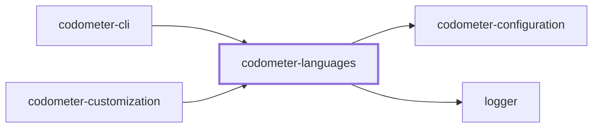
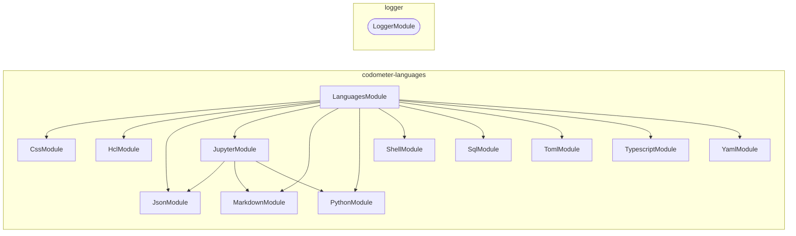
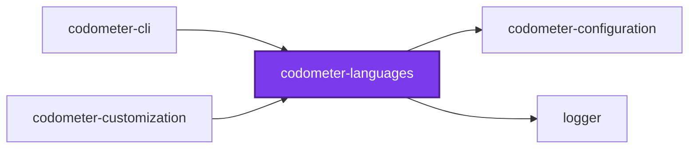
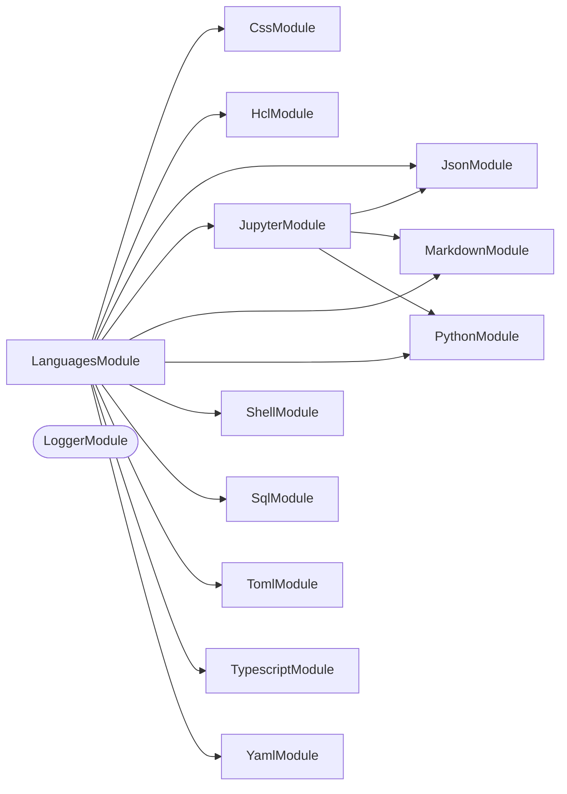

## Project Graph

Where this project sits in the Nx project graph: what it depends on, and what depends on it. Regenerated by `nx run synchronization:nx-project-graphs:write`.

<!-- nx-project-graph-start -->



<!-- nx-project-graph-end -->

## Module Graph

The modules this project defines and the imports between them, published by `nx run synchronization:nestjs-module-graphs:write`.

<!-- nestjs-module-graph-start -->



_Rounded modules are global: every module can inject them, so their edges are left out._

_Reached only for their types, and so declaring no module here: codometer-configuration._

<!-- nestjs-module-graph-end -->

## Test

```bash
nx run codometer-languages:vitest
```

<!-- CALL_STACKS_START -->

## 🔭 Callidescope

Call stacks traced through `codometer-languages`, deepest first. Each frame shows what it takes, what it returns, and what its documentation says.

| Measure | Value |
| --- | --- |
| Callables | 115 |
| Files | 51 |
| Calls traced | 103 |
| Call stacks | 6 |
| Deepest stack | 3 |
| Stacks through recursion | 0 |
| Unfollowable calls | 1 |

### Call stacks (depth)

**1. `TypescriptService.handleEnum`** — depth 3 · orphan-root

```text
🚀 TypescriptService.handleEnum(node: tsCompiler.Node, stats: TypescriptResult): void [packages/codometer-languages/src/modules/typescript/typescript.service.ts:250]
   ↳ Increments enum and exported counts for an enum declaration node.
  └─> TypescriptService.hasExportKeyword(node: tsCompiler.Node): boolean [packages/codometer-languages/src/modules/typescript/typescript.service.ts:346]
     ↳ Returns true when the node has an export modifier keyword.
    └─> TypescriptService.some(…)(modifier: tsCompiler.Modifier): modifier is tsCompiler.ExportKeyword [packages/codometer-languages/src/modules/typescript/typescript.service.ts:352]
```

**2. `TypescriptService.handleFunction`** — depth 3 · orphan-root

```text
🚀 TypescriptService.handleFunction(node: tsCompiler.Node, stats: TypescriptResult, insideClass: boolean): void [packages/codometer-languages/src/modules/typescript/typescript.service.ts:256]
   ↳ Increments function, method, async, sync, exported, and generic counts for a function node.
  └─> TypescriptService.hasExportKeyword(node: tsCompiler.Node): boolean [packages/codometer-languages/src/modules/typescript/typescript.service.ts:346]
     ↳ Returns true when the node has an export modifier keyword.
    └─> TypescriptService.some(…)(modifier: tsCompiler.Modifier): modifier is tsCompiler.ExportKeyword [packages/codometer-languages/src/modules/typescript/typescript.service.ts:352]
```

**3. `TypescriptService.handleInterface`** — depth 3 · orphan-root

```text
🚀 TypescriptService.handleInterface(node: tsCompiler.Node, stats: TypescriptResult): void [packages/codometer-languages/src/modules/typescript/typescript.service.ts:290]
   ↳ Increments interface, exported, and generic counts for an interface declaration node.
  └─> TypescriptService.hasExportKeyword(node: tsCompiler.Node): boolean [packages/codometer-languages/src/modules/typescript/typescript.service.ts:346]
     ↳ Returns true when the node has an export modifier keyword.
    └─> TypescriptService.some(…)(modifier: tsCompiler.Modifier): modifier is tsCompiler.ExportKeyword [packages/codometer-languages/src/modules/typescript/typescript.service.ts:352]
```

<details>
<summary>3 more call stacks</summary>

**4. `TypescriptService.handleMethodOrAccessor`** — depth 3 · orphan-root

```text
🚀 TypescriptService.handleMethodOrAccessor(node: tsCompiler.Node, stats: TypescriptResult): void [packages/codometer-languages/src/modules/typescript/typescript.service.ts:300]
   ↳ Increments method and async or sync counts for a method or accessor node.
  └─> TypescriptService.hasAsyncKeyword(node: tsCompiler.Node): boolean [packages/codometer-languages/src/modules/typescript/typescript.service.ts:334]
     ↳ Returns true when the node has an async modifier keyword.
    └─> TypescriptService.some(…)(modifier: tsCompiler.Modifier): modifier is tsCompiler.AsyncKeyword [packages/codometer-languages/src/modules/typescript/typescript.service.ts:340]
```

**5. `TypescriptService.handleTypeAlias`** — depth 3 · orphan-root

```text
🚀 TypescriptService.handleTypeAlias(node: tsCompiler.Node, stats: TypescriptResult): void [packages/codometer-languages/src/modules/typescript/typescript.service.ts:313]
   ↳ Increments exported and generic counts for a type alias declaration node.
  └─> TypescriptService.hasExportKeyword(node: tsCompiler.Node): boolean [packages/codometer-languages/src/modules/typescript/typescript.service.ts:346]
     ↳ Returns true when the node has an export modifier keyword.
    └─> TypescriptService.some(…)(modifier: tsCompiler.Modifier): modifier is tsCompiler.ExportKeyword [packages/codometer-languages/src/modules/typescript/typescript.service.ts:352]
```

**6. `TypescriptService.handleVariable`** — depth 3 · orphan-root

```text
🚀 TypescriptService.handleVariable(node: tsCompiler.Node, stats: TypescriptResult): void [packages/codometer-languages/src/modules/typescript/typescript.service.ts:322]
   ↳ Increments constant and exported counts for a const variable statement.
  └─> TypescriptService.hasExportKeyword(node: tsCompiler.Node): boolean [packages/codometer-languages/src/modules/typescript/typescript.service.ts:346]
     ↳ Returns true when the node has an export modifier keyword.
    └─> TypescriptService.some(…)(modifier: tsCompiler.Modifier): modifier is tsCompiler.ExportKeyword [packages/codometer-languages/src/modules/typescript/typescript.service.ts:352]
```

</details>

### Module spread

| Callable | Spread | Calls directly | Location |
| --- | --- | --- | --- |
| `LanguagesService.analyze` | 12 | `codometer-languages:modules/css`, `codometer-languages:modules/hcl`, `codometer-languages:modules/json`, `codometer-languages:modules/jupyter`, `codometer-languages:modules/markdown`, `codometer-languages:modules/python`, `codometer-languages:modules/shell`, `codometer-languages:modules/sql`, `codometer-languages:modules/toml`, `codometer-languages:modules/typescript`, `codometer-languages:modules/yaml` | `packages/codometer-languages/src/modules/languages/languages.service.ts:54` |

### Breadth

| Callable | Breadth | Calls directly | Location |
| --- | --- | --- | --- |
| `LanguagesService.analyze` | 11 | `CssService.analyze`, `HclService.analyze`, `JsonService.analyze`, `JupyterService.analyze`, `MarkdownService.analyze`, `PythonService.analyze`, `ShellService.analyze`, `SqlService.analyze`, `TomlService.analyze`, `TypescriptService.analyze`, `YamlService.analyze` | `packages/codometer-languages/src/modules/languages/languages.service.ts:54` |
| `JsonService.countNode` | 5 | `JsonService.isArrayNode`, `JsonService.countArrayNode`, `JsonService.isRecordNode`, `JsonService.countRecordNode`, `JsonService.countPrimitiveNode` | `packages/codometer-languages/src/modules/json/json.service.ts:111` |
| `JupyterService.analyze` | 5 | `JupyterService.collectParts`, `JsonService.analyze`, `PythonService.analyzeContents`, `MarkdownService.analyzeContents`, `JupyterService.countHeadings` | `packages/codometer-languages/src/modules/jupyter/jupyter.service.ts:166` |

<details>
<summary>45 more callables</summary>

| Callable | Breadth | Calls directly | Location |
| --- | --- | --- | --- |
| `TypescriptService.walkNode` | 5 | `TypescriptService.countSymbols`, `TypescriptService.handleClass`, `TypescriptService.forEachChild(…)`, `TypescriptService.dispatchNode`, `TypescriptService.forEachChild(…)` | `packages/codometer-languages/src/modules/typescript/typescript.service.ts:393` |
| `JsonService.consumeJsoncCharacter` | 4 | `JsonService.handleLineCommentState`, `JsonService.handleBlockCommentState`, `JsonService.handleStringState`, `JsonService.consumeCharacterOutsideComments` | `packages/codometer-languages/src/modules/json/json.service.ts:66` |
| `TypescriptService.createEmptyResult` | 4 | `TypescriptService.filter(…)`, `TypescriptService.map(…)`, `TypescriptService.filter(…)`, `TypescriptService.filter(…)` | `packages/codometer-languages/src/modules/typescript/typescript.service.ts:162` |
| `JsonService.parseDocuments` | 3 | `JsonService.map(…)`, `JsonService.filter(…)`, `JsonService.stripJsoncComments` | `packages/codometer-languages/src/modules/json/json.service.ts:258` |
| `JsonService.analyze` | 3 | `JsonService.filter(…)`, `JsonService.parseDocuments`, `JsonService.countNode` | `packages/codometer-languages/src/modules/json/json.service.ts:310` |
| `SqlService.analyze` | 3 | `SqlService.stripComments`, `SqlService.filter(…)`, `SqlService.countKeywords` | `packages/codometer-languages/src/modules/sql/sql.service.ts:63` |
| `TypescriptService.analyzeFile` | 3 | `TypescriptService.getScriptKind`, `TypescriptService.scanComments`, `TypescriptService.walkNode` | `packages/codometer-languages/src/modules/typescript/typescript.service.ts:77` |
| `TypescriptService.handleFunction` | 3 | `TypescriptService.hasExportKeyword`, `TypescriptService.hasAsyncKeyword`, `TypescriptService.hasTypeParameters` | `packages/codometer-languages/src/modules/typescript/typescript.service.ts:256` |
| `TypescriptService.analyze` | 3 | `TypescriptService.createEmptyResult`, `TypescriptService.analyzeFile`, `TypescriptService.getCountersForFile` | `packages/codometer-languages/src/modules/typescript/typescript.service.ts:418` |
| `MarkdownService.countNode` | 2 | `MarkdownService.countHeading`, `MarkdownService.countListItem` | `packages/codometer-languages/src/modules/markdown/markdown.service.ts:62` |
| `PythonService.analyzeContents` | 2 | `PythonService.map(…)`, `PythonService.analyze` | `packages/codometer-languages/src/modules/python/python.service.ts:87` |
| `JupyterService.collectParts` | 2 | `JupyterService.readNotebook`, `JupyterService.collectCell` | `packages/codometer-languages/src/modules/jupyter/jupyter.service.ts:88` |
| `SqlService.stripComments` | 2 | `SqlService.replaceAll(…)`, `SqlService.replaceAll(…)` | `packages/codometer-languages/src/modules/sql/sql.service.ts:48` |
| `TomlService.analyze` | 2 | `TomlService.countLine`, `TomlService.isInsideMultilineString` | `packages/codometer-languages/src/modules/toml/toml.service.ts:98` |
| `TypescriptService.countSymbols` | 2 | `TypescriptService.getSymbolModifiers`, `TypescriptService.every(…)` | `packages/codometer-languages/src/modules/typescript/typescript.service.ts:132` |
| `TypescriptService.handleClass` | 2 | `TypescriptService.hasExportKeyword`, `TypescriptService.hasTypeParameters` | `packages/codometer-languages/src/modules/typescript/typescript.service.ts:243` |
| `TypescriptService.handleInterface` | 2 | `TypescriptService.hasExportKeyword`, `TypescriptService.hasTypeParameters` | `packages/codometer-languages/src/modules/typescript/typescript.service.ts:290` |
| `TypescriptService.handleTypeAlias` | 2 | `TypescriptService.hasExportKeyword`, `TypescriptService.hasTypeParameters` | `packages/codometer-languages/src/modules/typescript/typescript.service.ts:313` |
| `YamlService.countDocument` | 2 | `YamlService.countComments`, `YamlService.countNode` | `packages/codometer-languages/src/modules/yaml/yaml.service.ts:88` |
| `YamlService.countNode` | 2 | `YamlService.countComments`, `YamlService.countCollection` | `packages/codometer-languages/src/modules/yaml/yaml.service.ts:95` |
| `CssService.analyze` | 1 | `CssService.walk(…)` | `packages/codometer-languages/src/modules/css/css.service.ts:74` |
| `CssService.walk(…)` | 1 | `CssService.countNode` | `packages/codometer-languages/src/modules/css/css.service.ts:88` |
| `HclService.countLine` | 1 | `HclService.countBlock` | `packages/codometer-languages/src/modules/hcl/hcl.service.ts:60` |
| `HclService.analyze` | 1 | `HclService.countLine` | `packages/codometer-languages/src/modules/hcl/hcl.service.ts:87` |
| `JsonService.countArrayNode` | 1 | `JsonService.countNode` | `packages/codometer-languages/src/modules/json/json.service.ts:95` |
| `JsonService.countPrimitiveNode` | 1 | `JsonService.countPrimitiveValue` | `packages/codometer-languages/src/modules/json/json.service.ts:126` |
| `JsonService.countRecordNode` | 1 | `JsonService.countNode` | `packages/codometer-languages/src/modules/json/json.service.ts:162` |
| `JsonService.stripJsoncComments` | 1 | `JsonService.consumeJsoncCharacter` | `packages/codometer-languages/src/modules/json/json.service.ts:273` |
| `MarkdownService.walk` | 1 | `MarkdownService.countNode` | `packages/codometer-languages/src/modules/markdown/markdown.service.ts:81` |
| `MarkdownService.analyze` | 1 | `MarkdownService.analyzeContents` | `packages/codometer-languages/src/modules/markdown/markdown.service.ts:98` |
| `MarkdownService.analyzeContents` | 1 | `MarkdownService.walk` | `packages/codometer-languages/src/modules/markdown/markdown.service.ts:126` |
| `JupyterService.collectCell` | 1 | `JupyterService.readSource` | `packages/codometer-languages/src/modules/jupyter/jupyter.service.ts:57` |
| `ShellService.countLine` | 1 | `ShellService.countStatements` | `packages/codometer-languages/src/modules/shell/shell.service.ts:45` |
| `ShellService.analyze` | 1 | `ShellService.countLine` | `packages/codometer-languages/src/modules/shell/shell.service.ts:93` |
| `TomlService.countLine` | 1 | `TomlService.countKey` | `packages/codometer-languages/src/modules/toml/toml.service.ts:61` |
| `TypescriptService.getCountersForFile` | 1 | `TypescriptService.filter(…)` | `packages/codometer-languages/src/modules/typescript/typescript.service.ts:196` |
| `TypescriptService.filter(…)` | 1 | `TypescriptService.some(…)` | `packages/codometer-languages/src/modules/typescript/typescript.service.ts:201` |
| `TypescriptService.handleEnum` | 1 | `TypescriptService.hasExportKeyword` | `packages/codometer-languages/src/modules/typescript/typescript.service.ts:250` |
| `TypescriptService.handleMethodOrAccessor` | 1 | `TypescriptService.hasAsyncKeyword` | `packages/codometer-languages/src/modules/typescript/typescript.service.ts:300` |
| `TypescriptService.handleVariable` | 1 | `TypescriptService.hasExportKeyword` | `packages/codometer-languages/src/modules/typescript/typescript.service.ts:322` |
| `TypescriptService.hasAsyncKeyword` | 1 | `TypescriptService.some(…)` | `packages/codometer-languages/src/modules/typescript/typescript.service.ts:334` |
| `TypescriptService.hasExportKeyword` | 1 | `TypescriptService.some(…)` | `packages/codometer-languages/src/modules/typescript/typescript.service.ts:346` |
| `TypescriptService.scanComments` | 1 | `TypescriptService.countComment` | `packages/codometer-languages/src/modules/typescript/typescript.service.ts:370` |
| `YamlService.countCollection` | 1 | `YamlService.countNode` | `packages/codometer-languages/src/modules/yaml/yaml.service.ts:46` |
| `YamlService.analyze` | 1 | `YamlService.countDocument` | `packages/codometer-languages/src/modules/yaml/yaml.service.ts:123` |

</details>

### Possibly misplaced

None.
<!-- CALL_STACKS_END -->

## 🕸️ Codependix

Dependency graphs exported by [codependix](https://github.com/JimmyPaolini/codebase/tree/main/packages/codependix-cli), regenerated by `nx run codebase:codependix:write`.

### Nx Neighborhood

<!-- codependix:start name="codependix-nx" -->

<!-- codependix:end name="codependix-nx" -->

### NestJS Module Graph

<!-- codependix:start name="codependix-nestjs" -->


_Rounded modules are global: every module can inject them, so their edges are left out._
<!-- codependix:end name="codependix-nestjs" -->

### File Imports

<!-- codependix:start name="codependix-imports" -->
```mermaid
graph LR
  file_eslint_config_ts["eslint.config.ts"]
  file_src_index_ts["src/index.ts"]
  file_src_modules_css_css_constants_ts["src/modules/css/css.constants.ts"]
  file_src_modules_css_css_module_ts["src/modules/css/css.module.ts"]
  file_src_modules_css_css_module_unit_test_ts["src/modules/css/css.module.unit.test.ts"]
  file_src_modules_css_css_service_ts["src/modules/css/css.service.ts"]
  file_src_modules_css_css_service_unit_test_ts["src/modules/css/css.service.unit.test.ts"]
  file_src_modules_css_css_types_ts["src/modules/css/css.types.ts"]
  file_src_modules_hcl_hcl_constants_ts["src/modules/hcl/hcl.constants.ts"]
  file_src_modules_hcl_hcl_module_ts["src/modules/hcl/hcl.module.ts"]
  file_src_modules_hcl_hcl_module_unit_test_ts["src/modules/hcl/hcl.module.unit.test.ts"]
  file_src_modules_hcl_hcl_service_ts["src/modules/hcl/hcl.service.ts"]
  file_src_modules_hcl_hcl_service_unit_test_ts["src/modules/hcl/hcl.service.unit.test.ts"]
  file_src_modules_hcl_hcl_types_ts["src/modules/hcl/hcl.types.ts"]
  file_src_modules_json_json_constants_ts["src/modules/json/json.constants.ts"]
  file_src_modules_json_json_module_ts["src/modules/json/json.module.ts"]
  file_src_modules_json_json_module_unit_test_ts["src/modules/json/json.module.unit.test.ts"]
  file_src_modules_json_json_service_ts["src/modules/json/json.service.ts"]
  file_src_modules_json_json_service_unit_test_ts["src/modules/json/json.service.unit.test.ts"]
  file_src_modules_json_json_types_ts["src/modules/json/json.types.ts"]
  file_src_modules_jupyter_jupyter_constants_ts["src/modules/jupyter/jupyter.constants.ts"]
  file_src_modules_jupyter_jupyter_module_ts["src/modules/jupyter/jupyter.module.ts"]
  file_src_modules_jupyter_jupyter_module_unit_test_ts["src/modules/jupyter/jupyter.module.unit.test.ts"]
  file_src_modules_jupyter_jupyter_service_ts["src/modules/jupyter/jupyter.service.ts"]
  file_src_modules_jupyter_jupyter_service_unit_test_ts["src/modules/jupyter/jupyter.service.unit.test.ts"]
  file_src_modules_jupyter_jupyter_types_ts["src/modules/jupyter/jupyter.types.ts"]
  file_src_modules_languages_languages_constants_ts["src/modules/languages/languages.constants.ts"]
  file_src_modules_languages_languages_module_ts["src/modules/languages/languages.module.ts"]
  file_src_modules_languages_languages_module_unit_test_ts["src/modules/languages/languages.module.unit.test.ts"]
  file_src_modules_languages_languages_service_ts["src/modules/languages/languages.service.ts"]
  file_src_modules_languages_languages_service_unit_test_ts["src/modules/languages/languages.service.unit.test.ts"]
  file_src_modules_languages_languages_types_ts["src/modules/languages/languages.types.ts"]
  file_src_modules_markdown_markdown_constants_ts["src/modules/markdown/markdown.constants.ts"]
  file_src_modules_markdown_markdown_module_ts["src/modules/markdown/markdown.module.ts"]
  file_src_modules_markdown_markdown_module_unit_test_ts["src/modules/markdown/markdown.module.unit.test.ts"]
  file_src_modules_markdown_markdown_service_ts["src/modules/markdown/markdown.service.ts"]
  file_src_modules_markdown_markdown_service_unit_test_ts["src/modules/markdown/markdown.service.unit.test.ts"]
  file_src_modules_markdown_markdown_types_ts["src/modules/markdown/markdown.types.ts"]
  file_src_modules_python_python_constants_ts["src/modules/python/python.constants.ts"]
  file_src_modules_python_python_module_ts["src/modules/python/python.module.ts"]
  file_src_modules_python_python_module_unit_test_ts["src/modules/python/python.module.unit.test.ts"]
  file_src_modules_python_python_service_ts["src/modules/python/python.service.ts"]
  file_src_modules_python_python_service_unit_test_ts["src/modules/python/python.service.unit.test.ts"]
  file_src_modules_python_python_types_ts["src/modules/python/python.types.ts"]
  file_src_modules_shell_shell_constants_ts["src/modules/shell/shell.constants.ts"]
  file_src_modules_shell_shell_module_ts["src/modules/shell/shell.module.ts"]
  file_src_modules_shell_shell_module_unit_test_ts["src/modules/shell/shell.module.unit.test.ts"]
  file_src_modules_shell_shell_service_ts["src/modules/shell/shell.service.ts"]
  file_src_modules_shell_shell_service_unit_test_ts["src/modules/shell/shell.service.unit.test.ts"]
  file_src_modules_shell_shell_types_ts["src/modules/shell/shell.types.ts"]
  file_src_modules_sql_sql_constants_ts["src/modules/sql/sql.constants.ts"]
  file_src_modules_sql_sql_module_ts["src/modules/sql/sql.module.ts"]
  file_src_modules_sql_sql_module_unit_test_ts["src/modules/sql/sql.module.unit.test.ts"]
  file_src_modules_sql_sql_service_ts["src/modules/sql/sql.service.ts"]
  file_src_modules_sql_sql_service_unit_test_ts["src/modules/sql/sql.service.unit.test.ts"]
  file_src_modules_sql_sql_types_ts["src/modules/sql/sql.types.ts"]
  file_src_modules_toml_toml_constants_ts["src/modules/toml/toml.constants.ts"]
  file_src_modules_toml_toml_module_ts["src/modules/toml/toml.module.ts"]
  file_src_modules_toml_toml_module_unit_test_ts["src/modules/toml/toml.module.unit.test.ts"]
  file_src_modules_toml_toml_service_ts["src/modules/toml/toml.service.ts"]
  file_src_modules_toml_toml_service_unit_test_ts["src/modules/toml/toml.service.unit.test.ts"]
  file_src_modules_toml_toml_types_ts["src/modules/toml/toml.types.ts"]
  file_src_modules_typescript_typescript_constants_ts["src/modules/typescript/typescript.constants.ts"]
  file_src_modules_typescript_typescript_module_ts["src/modules/typescript/typescript.module.ts"]
  file_src_modules_typescript_typescript_module_unit_test_ts["src/modules/typescript/typescript.module.unit.test.ts"]
  file_src_modules_typescript_typescript_service_ts["src/modules/typescript/typescript.service.ts"]
  file_src_modules_typescript_typescript_service_unit_test_ts["src/modules/typescript/typescript.service.unit.test.ts"]
  file_src_modules_typescript_typescript_types_ts["src/modules/typescript/typescript.types.ts"]
  file_src_modules_yaml_yaml_constants_ts["src/modules/yaml/yaml.constants.ts"]
  file_src_modules_yaml_yaml_module_ts["src/modules/yaml/yaml.module.ts"]
  file_src_modules_yaml_yaml_module_unit_test_ts["src/modules/yaml/yaml.module.unit.test.ts"]
  file_src_modules_yaml_yaml_service_ts["src/modules/yaml/yaml.service.ts"]
  file_src_modules_yaml_yaml_service_unit_test_ts["src/modules/yaml/yaml.service.unit.test.ts"]
  file_src_modules_yaml_yaml_types_ts["src/modules/yaml/yaml.types.ts"]
  file_testing_mocks_ts["testing/mocks.ts"]
  file_testing_setup_ts["testing/setup.ts"]
  file_vitest_config_ts["vitest.config.ts"]
  file_src_modules_css_css_constants_ts --> file_src_modules_css_css_types_ts
  file_src_modules_css_css_module_ts --> file_src_modules_css_css_service_ts
  file_src_modules_css_css_module_unit_test_ts --> file_src_modules_css_css_module_ts
  file_src_modules_css_css_module_unit_test_ts --> file_src_modules_css_css_service_ts
  file_src_modules_css_css_service_ts --> file_src_modules_css_css_constants_ts
  file_src_modules_css_css_service_ts --> file_src_modules_css_css_types_ts
  file_src_modules_css_css_service_unit_test_ts --> file_src_modules_css_css_service_ts
  file_src_modules_hcl_hcl_constants_ts --> file_src_modules_hcl_hcl_types_ts
  file_src_modules_hcl_hcl_module_ts --> file_src_modules_hcl_hcl_service_ts
  file_src_modules_hcl_hcl_module_unit_test_ts --> file_src_modules_hcl_hcl_module_ts
  file_src_modules_hcl_hcl_module_unit_test_ts --> file_src_modules_hcl_hcl_service_ts
  file_src_modules_hcl_hcl_service_ts --> file_src_modules_hcl_hcl_constants_ts
  file_src_modules_hcl_hcl_service_ts --> file_src_modules_hcl_hcl_types_ts
  file_src_modules_hcl_hcl_service_unit_test_ts --> file_src_modules_hcl_hcl_service_ts
  file_src_modules_json_json_constants_ts --> file_src_modules_json_json_types_ts
  file_src_modules_json_json_module_ts --> file_src_modules_json_json_service_ts
  file_src_modules_json_json_module_unit_test_ts --> file_src_modules_json_json_module_ts
  file_src_modules_json_json_module_unit_test_ts --> file_src_modules_json_json_service_ts
  file_src_modules_json_json_service_ts --> file_src_modules_json_json_constants_ts
  file_src_modules_json_json_service_ts --> file_src_modules_json_json_types_ts
  file_src_modules_json_json_service_unit_test_ts --> file_src_modules_json_json_service_ts
  file_src_modules_jupyter_jupyter_constants_ts --> file_src_modules_jupyter_jupyter_types_ts
  file_src_modules_jupyter_jupyter_module_ts --> file_src_modules_json_json_module_ts
  file_src_modules_jupyter_jupyter_module_ts --> file_src_modules_jupyter_jupyter_service_ts
  file_src_modules_jupyter_jupyter_module_ts --> file_src_modules_markdown_markdown_module_ts
  file_src_modules_jupyter_jupyter_module_ts --> file_src_modules_python_python_module_ts
  file_src_modules_jupyter_jupyter_module_unit_test_ts --> file_src_modules_jupyter_jupyter_module_ts
  file_src_modules_jupyter_jupyter_module_unit_test_ts --> file_src_modules_jupyter_jupyter_service_ts
  file_src_modules_jupyter_jupyter_service_ts --> file_src_modules_json_json_service_ts
  file_src_modules_jupyter_jupyter_service_ts --> file_src_modules_jupyter_jupyter_constants_ts
  file_src_modules_jupyter_jupyter_service_ts --> file_src_modules_jupyter_jupyter_types_ts
  file_src_modules_jupyter_jupyter_service_ts --> file_src_modules_markdown_markdown_service_ts
  file_src_modules_jupyter_jupyter_service_ts --> file_src_modules_markdown_markdown_types_ts
  file_src_modules_jupyter_jupyter_service_ts --> file_src_modules_python_python_service_ts
  file_src_modules_jupyter_jupyter_service_unit_test_ts --> file_src_modules_json_json_service_ts
  file_src_modules_jupyter_jupyter_service_unit_test_ts --> file_src_modules_jupyter_jupyter_service_ts
  file_src_modules_jupyter_jupyter_service_unit_test_ts --> file_src_modules_markdown_markdown_service_ts
  file_src_modules_jupyter_jupyter_service_unit_test_ts --> file_src_modules_python_python_constants_ts
  file_src_modules_jupyter_jupyter_service_unit_test_ts --> file_src_modules_python_python_service_ts
  file_src_modules_languages_languages_module_ts --> file_src_modules_css_css_module_ts
  file_src_modules_languages_languages_module_ts --> file_src_modules_hcl_hcl_module_ts
  file_src_modules_languages_languages_module_ts --> file_src_modules_json_json_module_ts
  file_src_modules_languages_languages_module_ts --> file_src_modules_jupyter_jupyter_module_ts
  file_src_modules_languages_languages_module_ts --> file_src_modules_languages_languages_service_ts
  file_src_modules_languages_languages_module_ts --> file_src_modules_markdown_markdown_module_ts
  file_src_modules_languages_languages_module_ts --> file_src_modules_python_python_module_ts
  file_src_modules_languages_languages_module_ts --> file_src_modules_shell_shell_module_ts
  file_src_modules_languages_languages_module_ts --> file_src_modules_sql_sql_module_ts
  file_src_modules_languages_languages_module_ts --> file_src_modules_toml_toml_module_ts
  file_src_modules_languages_languages_module_ts --> file_src_modules_typescript_typescript_module_ts
  file_src_modules_languages_languages_module_ts --> file_src_modules_yaml_yaml_module_ts
  file_src_modules_languages_languages_module_unit_test_ts --> file_src_modules_languages_languages_module_ts
  file_src_modules_languages_languages_module_unit_test_ts --> file_src_modules_languages_languages_service_ts
  file_src_modules_languages_languages_service_ts --> file_src_modules_css_css_service_ts
  file_src_modules_languages_languages_service_ts --> file_src_modules_hcl_hcl_service_ts
  file_src_modules_languages_languages_service_ts --> file_src_modules_json_json_service_ts
  file_src_modules_languages_languages_service_ts --> file_src_modules_jupyter_jupyter_service_ts
  file_src_modules_languages_languages_service_ts --> file_src_modules_languages_languages_types_ts
  file_src_modules_languages_languages_service_ts --> file_src_modules_markdown_markdown_service_ts
  file_src_modules_languages_languages_service_ts --> file_src_modules_python_python_service_ts
  file_src_modules_languages_languages_service_ts --> file_src_modules_shell_shell_service_ts
  file_src_modules_languages_languages_service_ts --> file_src_modules_sql_sql_service_ts
  file_src_modules_languages_languages_service_ts --> file_src_modules_toml_toml_service_ts
  file_src_modules_languages_languages_service_ts --> file_src_modules_typescript_typescript_service_ts
  file_src_modules_languages_languages_service_ts --> file_src_modules_yaml_yaml_service_ts
  file_src_modules_languages_languages_service_unit_test_ts --> file_src_modules_css_css_service_ts
  file_src_modules_languages_languages_service_unit_test_ts --> file_src_modules_hcl_hcl_service_ts
  file_src_modules_languages_languages_service_unit_test_ts --> file_src_modules_json_json_service_ts
  file_src_modules_languages_languages_service_unit_test_ts --> file_src_modules_jupyter_jupyter_service_ts
  file_src_modules_languages_languages_service_unit_test_ts --> file_src_modules_languages_languages_service_ts
  file_src_modules_languages_languages_service_unit_test_ts --> file_src_modules_languages_languages_types_ts
  file_src_modules_languages_languages_service_unit_test_ts --> file_src_modules_markdown_markdown_service_ts
  file_src_modules_languages_languages_service_unit_test_ts --> file_src_modules_python_python_service_ts
  file_src_modules_languages_languages_service_unit_test_ts --> file_src_modules_shell_shell_service_ts
  file_src_modules_languages_languages_service_unit_test_ts --> file_src_modules_sql_sql_service_ts
  file_src_modules_languages_languages_service_unit_test_ts --> file_src_modules_toml_toml_service_ts
  file_src_modules_languages_languages_service_unit_test_ts --> file_src_modules_typescript_typescript_service_ts
  file_src_modules_languages_languages_service_unit_test_ts --> file_src_modules_yaml_yaml_service_ts
  file_src_modules_languages_languages_types_ts --> file_src_modules_css_css_types_ts
  file_src_modules_languages_languages_types_ts --> file_src_modules_hcl_hcl_types_ts
  file_src_modules_languages_languages_types_ts --> file_src_modules_json_json_types_ts
  file_src_modules_languages_languages_types_ts --> file_src_modules_jupyter_jupyter_types_ts
  file_src_modules_languages_languages_types_ts --> file_src_modules_markdown_markdown_types_ts
  file_src_modules_languages_languages_types_ts --> file_src_modules_python_python_types_ts
  file_src_modules_languages_languages_types_ts --> file_src_modules_shell_shell_types_ts
  file_src_modules_languages_languages_types_ts --> file_src_modules_sql_sql_types_ts
  file_src_modules_languages_languages_types_ts --> file_src_modules_toml_toml_types_ts
  file_src_modules_languages_languages_types_ts --> file_src_modules_typescript_typescript_types_ts
  file_src_modules_languages_languages_types_ts --> file_src_modules_yaml_yaml_types_ts
  file_src_modules_markdown_markdown_constants_ts --> file_src_modules_markdown_markdown_types_ts
  file_src_modules_markdown_markdown_module_ts --> file_src_modules_markdown_markdown_service_ts
  file_src_modules_markdown_markdown_module_unit_test_ts --> file_src_modules_markdown_markdown_module_ts
  file_src_modules_markdown_markdown_module_unit_test_ts --> file_src_modules_markdown_markdown_service_ts
  file_src_modules_markdown_markdown_service_ts --> file_src_modules_markdown_markdown_constants_ts
  file_src_modules_markdown_markdown_service_ts --> file_src_modules_markdown_markdown_types_ts
  file_src_modules_markdown_markdown_service_unit_test_ts --> file_src_modules_markdown_markdown_service_ts
  file_src_modules_python_python_constants_ts --> file_src_modules_python_python_types_ts
  file_src_modules_python_python_module_ts --> file_src_modules_python_python_service_ts
  file_src_modules_python_python_module_unit_test_ts --> file_src_modules_python_python_module_ts
  file_src_modules_python_python_module_unit_test_ts --> file_src_modules_python_python_service_ts
  file_src_modules_python_python_service_ts --> file_src_modules_python_python_constants_ts
  file_src_modules_python_python_service_ts --> file_src_modules_python_python_types_ts
  file_src_modules_python_python_service_unit_test_ts --> file_src_modules_python_python_constants_ts
  file_src_modules_python_python_service_unit_test_ts --> file_src_modules_python_python_service_ts
  file_src_modules_shell_shell_constants_ts --> file_src_modules_shell_shell_types_ts
  file_src_modules_shell_shell_module_ts --> file_src_modules_shell_shell_service_ts
  file_src_modules_shell_shell_module_unit_test_ts --> file_src_modules_shell_shell_module_ts
  file_src_modules_shell_shell_module_unit_test_ts --> file_src_modules_shell_shell_service_ts
  file_src_modules_shell_shell_service_ts --> file_src_modules_shell_shell_constants_ts
  file_src_modules_shell_shell_service_ts --> file_src_modules_shell_shell_types_ts
  file_src_modules_shell_shell_service_unit_test_ts --> file_src_modules_shell_shell_service_ts
  file_src_modules_sql_sql_constants_ts --> file_src_modules_sql_sql_types_ts
  file_src_modules_sql_sql_module_ts --> file_src_modules_sql_sql_service_ts
  file_src_modules_sql_sql_module_unit_test_ts --> file_src_modules_sql_sql_module_ts
  file_src_modules_sql_sql_module_unit_test_ts --> file_src_modules_sql_sql_service_ts
  file_src_modules_sql_sql_service_ts --> file_src_modules_sql_sql_constants_ts
  file_src_modules_sql_sql_service_ts --> file_src_modules_sql_sql_types_ts
  file_src_modules_sql_sql_service_unit_test_ts --> file_src_modules_sql_sql_service_ts
  file_src_modules_toml_toml_constants_ts --> file_src_modules_toml_toml_types_ts
  file_src_modules_toml_toml_module_ts --> file_src_modules_toml_toml_service_ts
  file_src_modules_toml_toml_module_unit_test_ts --> file_src_modules_toml_toml_module_ts
  file_src_modules_toml_toml_module_unit_test_ts --> file_src_modules_toml_toml_service_ts
  file_src_modules_toml_toml_service_ts --> file_src_modules_toml_toml_constants_ts
  file_src_modules_toml_toml_service_ts --> file_src_modules_toml_toml_types_ts
  file_src_modules_toml_toml_service_unit_test_ts --> file_src_modules_toml_toml_service_ts
  file_src_modules_typescript_typescript_constants_ts --> file_src_modules_typescript_typescript_types_ts
  file_src_modules_typescript_typescript_module_ts --> file_src_modules_typescript_typescript_service_ts
  file_src_modules_typescript_typescript_module_unit_test_ts --> file_src_modules_typescript_typescript_module_ts
  file_src_modules_typescript_typescript_module_unit_test_ts --> file_src_modules_typescript_typescript_service_ts
  file_src_modules_typescript_typescript_service_ts --> file_src_modules_typescript_typescript_constants_ts
  file_src_modules_typescript_typescript_service_ts --> file_src_modules_typescript_typescript_types_ts
  file_src_modules_typescript_typescript_service_unit_test_ts --> file_src_modules_typescript_typescript_service_ts
  file_src_modules_typescript_typescript_service_unit_test_ts --> file_src_modules_typescript_typescript_types_ts
  file_src_modules_yaml_yaml_constants_ts --> file_src_modules_yaml_yaml_types_ts
  file_src_modules_yaml_yaml_module_ts --> file_src_modules_yaml_yaml_service_ts
  file_src_modules_yaml_yaml_module_unit_test_ts --> file_src_modules_yaml_yaml_module_ts
  file_src_modules_yaml_yaml_module_unit_test_ts --> file_src_modules_yaml_yaml_service_ts
  file_src_modules_yaml_yaml_service_ts --> file_src_modules_yaml_yaml_constants_ts
  file_src_modules_yaml_yaml_service_ts --> file_src_modules_yaml_yaml_types_ts
  file_src_modules_yaml_yaml_service_unit_test_ts --> file_src_modules_yaml_yaml_service_ts
```
<!-- codependix:end name="codependix-imports" -->
