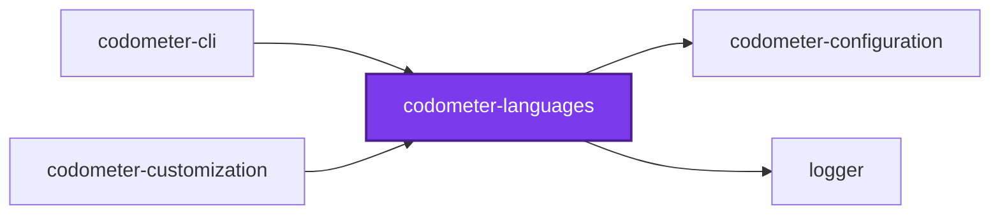
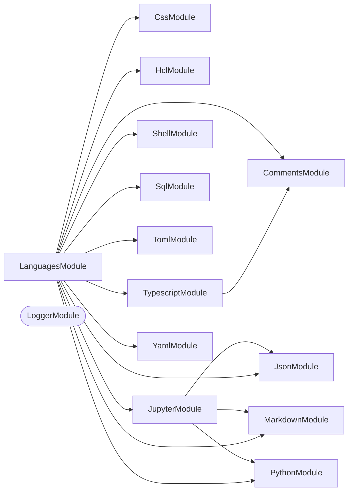

## Test

```bash
nx run codometer-languages:vitest
```

<!-- CALL_STACKS_START -->

## 🔭 Callidescope

Call stacks traced through `packages/codometer-languages`, deepest first. Each frame shows what it takes, what it returns, and what its documentation says.

| Measure | Value |
| --- | --- |
| Callables | 211 |
| Files | 65 |
| Calls traced | 214 |
| Call stacks | 18 |
| Deepest stack | 5 |
| Stacks through recursion | 0 |
| Unfollowable calls | 6 |

### Call stacks (depth)

**1. `LanguageCommentsService.read`** — depth ≥ 5 · orphan-root

```text
🚀 LanguageCommentsService.read(content: string): CommentToken[] [packages/codometer-languages/src/modules/comments/language-comments.service.ts:155]
  └─> HclCommentsService.read(content: string): CommentToken[] [packages/codometer-languages/src/modules/comments/hcl-comments.service.ts:122]
     ↳ Reads every `#`, `//`, and `/* *\/` comment, in the order they appear.
    └─> HclCommentsService.readBlocks(content: string): { end: number; start: number; token: CommentToken; }[] [packages/codometer-languages/src/modules/comments/hcl-comments.service.ts:75]
       ↳ Every block comment's span, as a positioned token.
      └─> HclCommentsService.map(…)(…): { end: number; start: number; token: { line: number; ownLine: boolean; prose: string; source: string; }; } [packages/codometer-languages/src/modules/comments/hcl-comments.service.ts:78]
        └─> HclCommentsService.lineOf(content: string, index: number): number [packages/codometer-languages/src/modules/comments/hcl-comments.service.ts:70]
           ↳ The 1-indexed line an offset sits on.
```

**2. `LanguageCommentsService.read`** — depth ≥ 5 · orphan-root

```text
🚀 LanguageCommentsService.read(content: string): CommentToken[] [packages/codometer-languages/src/modules/comments/language-comments.service.ts:168]
  └─> SqlCommentsService.read(content: string): CommentToken[] [packages/codometer-languages/src/modules/comments/sql-comments.service.ts:118]
     ↳ Reads every `--` and `/* *\/` comment, in the order they appear.
    └─> SqlCommentsService.readBlocks(content: string): { end: number; start: number; token: CommentToken; }[] [packages/codometer-languages/src/modules/comments/sql-comments.service.ts:70]
       ↳ Every block comment's span, as a positioned token.
      └─> SqlCommentsService.map(…)(…): { end: number; start: number; token: { line: number; ownLine: boolean; prose: string; source: string; }; } [packages/codometer-languages/src/modules/comments/sql-comments.service.ts:73]
        └─> SqlCommentsService.lineOf(content: string, index: number): number [packages/codometer-languages/src/modules/comments/sql-comments.service.ts:65]
           ↳ The 1-indexed line an offset sits on.
```

**3. `LanguageCommentsService.read`** — depth 5 · orphan-root

```text
🚀 LanguageCommentsService.read(content: string, filePath: string): CommentToken[] [packages/codometer-languages/src/modules/comments/language-comments.service.ts:180]
  └─> TypescriptCommentsService.read(content: string, filePath: string): CommentToken[] [packages/codometer-languages/src/modules/comments/typescript-comments.service.ts:140]
     ↳ Reads every non-JSDoc comment the parse finds, in source order.
    └─> TypescriptCommentsService.flatMap(…)(this: undefined, range: tsCompiler.CommentRange): CommentToken[] [packages/codometer-languages/src/modules/comments/typescript-comments.service.ts:154]
      └─> TypescriptCommentsService.toToken(range: tsCompiler.CommentRange, content: string): CommentToken | undefined [packages/codometer-languages/src/modules/comments/typescript-comments.service.ts:119]
         ↳ Turns one comment range into a token, unless it is a JSDoc block.
        └─> TypescriptCommentsService.isJsDoc(range: tsCompiler.CommentRange, source: string): boolean [packages/codometer-languages/src/modules/comments/typescript-comments.service.ts:90]
           ↳ Whether this range is a JSDoc block, measured elsewhere.
```

<details>
<summary>15 more call stacks</summary>

**4. `LanguageCommentsService.read`** — depth 4 · orphan-root

```text
🚀 LanguageCommentsService.read(content: string): CommentToken[] [packages/codometer-languages/src/modules/comments/language-comments.service.ts:149]
  └─> CssCommentsService.read(content: string): CommentToken[] [packages/codometer-languages/src/modules/comments/css-comments.service.ts:70]
     ↳ Reads every comment postcss's parse finds, in document order.
    └─> CssCommentsService.walkComments(…)(comment: postcss.Comment): void [packages/codometer-languages/src/modules/comments/css-comments.service.ts:74]
      └─> CssCommentsService.toBody(comment: Comment): string [packages/codometer-languages/src/modules/comments/css-comments.service.ts:36]
         ↳ A comment's text with the whitespace postcss split off restored. `raws.left`/`raws.right` are typed optional, but…
```

**5. `LanguageCommentsService.read`** — depth 4 · orphan-root

```text
🚀 LanguageCommentsService.read(content: string): CommentToken[] [packages/codometer-languages/src/modules/comments/language-comments.service.ts:187]
  └─> YamlCommentsService.read(content: string): CommentToken[] [packages/codometer-languages/src/modules/comments/yaml-comments.service.ts:103]
     ↳ Reads every comment the tokenizer found, in the order they appear.
    └─> YamlCommentsService.collectComments(candidate: unknown, scan: YamlCommentScan): void [packages/codometer-languages/src/modules/comments/yaml-comments.service.ts:43]
       ↳ Walks one parsed token, recording every comment beneath it.
      └─> YamlCommentsService.isCommentToken(…): boolean [packages/codometer-languages/src/modules/comments/yaml-comments.service.ts:70]
         ↳ Whether a parsed token is a comment carrying an offset.
```

**6. `TypescriptService.anonymous`** — depth 4 · orphan-root

```text
🚀 TypescriptService.anonymous(node: tsCompiler.Node, stats: TypescriptResult, insideClass: boolean): void [packages/codometer-languages/src/modules/typescript/typescript.service.ts:62]
  └─> TypescriptService.handleFunction(node: tsCompiler.Node, stats: TypescriptResult, insideClass: boolean): void [packages/codometer-languages/src/modules/typescript/typescript.service.ts:288]
     ↳ Increments function, method, async, sync, exported, and generic counts for a function node.
    └─> TypescriptService.hasExportKeyword(node: tsCompiler.Node): boolean [packages/codometer-languages/src/modules/typescript/typescript.service.ts:378]
       ↳ Returns true when the node has an export modifier keyword.
      └─> TypescriptService.some(…)(modifier: tsCompiler.Modifier): modifier is tsCompiler.ExportKeyword [packages/codometer-languages/src/modules/typescript/typescript.service.ts:384]
```

**7. `TypescriptService.anonymous`** — depth 4 · orphan-root

```text
🚀 TypescriptService.anonymous(node: tsCompiler.Node, stats: TypescriptResult): void [packages/codometer-languages/src/modules/typescript/typescript.service.ts:67]
  └─> TypescriptService.handleEnum(node: tsCompiler.Node, stats: TypescriptResult): void [packages/codometer-languages/src/modules/typescript/typescript.service.ts:282]
     ↳ Increments enum and exported counts for an enum declaration node.
    └─> TypescriptService.hasExportKeyword(node: tsCompiler.Node): boolean [packages/codometer-languages/src/modules/typescript/typescript.service.ts:378]
       ↳ Returns true when the node has an export modifier keyword.
      └─> TypescriptService.some(…)(modifier: tsCompiler.Modifier): modifier is tsCompiler.ExportKeyword [packages/codometer-languages/src/modules/typescript/typescript.service.ts:384]
```

**8. `TypescriptService.anonymous`** — depth 4 · orphan-root

```text
🚀 TypescriptService.anonymous(node: tsCompiler.Node, stats: TypescriptResult, insideClass: boolean): void [packages/codometer-languages/src/modules/typescript/typescript.service.ts:69]
  └─> TypescriptService.handleFunction(node: tsCompiler.Node, stats: TypescriptResult, insideClass: boolean): void [packages/codometer-languages/src/modules/typescript/typescript.service.ts:288]
     ↳ Increments function, method, async, sync, exported, and generic counts for a function node.
    └─> TypescriptService.hasExportKeyword(node: tsCompiler.Node): boolean [packages/codometer-languages/src/modules/typescript/typescript.service.ts:378]
       ↳ Returns true when the node has an export modifier keyword.
      └─> TypescriptService.some(…)(modifier: tsCompiler.Modifier): modifier is tsCompiler.ExportKeyword [packages/codometer-languages/src/modules/typescript/typescript.service.ts:384]
```

**9. `TypescriptService.anonymous`** — depth 4 · orphan-root

```text
🚀 TypescriptService.anonymous(node: tsCompiler.Node, stats: TypescriptResult, insideClass: boolean): void [packages/codometer-languages/src/modules/typescript/typescript.service.ts:71]
  └─> TypescriptService.handleFunction(node: tsCompiler.Node, stats: TypescriptResult, insideClass: boolean): void [packages/codometer-languages/src/modules/typescript/typescript.service.ts:288]
     ↳ Increments function, method, async, sync, exported, and generic counts for a function node.
    └─> TypescriptService.hasExportKeyword(node: tsCompiler.Node): boolean [packages/codometer-languages/src/modules/typescript/typescript.service.ts:378]
       ↳ Returns true when the node has an export modifier keyword.
      └─> TypescriptService.some(…)(modifier: tsCompiler.Modifier): modifier is tsCompiler.ExportKeyword [packages/codometer-languages/src/modules/typescript/typescript.service.ts:384]
```

**10. `TypescriptService.anonymous`** — depth 4 · orphan-root

```text
🚀 TypescriptService.anonymous(node: tsCompiler.Node, stats: TypescriptResult): void [packages/codometer-languages/src/modules/typescript/typescript.service.ts:73]
  └─> TypescriptService.handleMethodOrAccessor(node: tsCompiler.Node, stats: TypescriptResult): void [packages/codometer-languages/src/modules/typescript/typescript.service.ts:332]
     ↳ Increments method and async or sync counts for a method or accessor node.
    └─> TypescriptService.hasAsyncKeyword(node: tsCompiler.Node): boolean [packages/codometer-languages/src/modules/typescript/typescript.service.ts:366]
       ↳ Returns true when the node has an async modifier keyword.
      └─> TypescriptService.some(…)(modifier: tsCompiler.Modifier): modifier is tsCompiler.AsyncKeyword [packages/codometer-languages/src/modules/typescript/typescript.service.ts:372]
```

**11. `TypescriptService.anonymous`** — depth 4 · orphan-root

```text
🚀 TypescriptService.anonymous(node: tsCompiler.Node, stats: TypescriptResult): void [packages/codometer-languages/src/modules/typescript/typescript.service.ts:77]
  └─> TypescriptService.handleInterface(node: tsCompiler.Node, stats: TypescriptResult): void [packages/codometer-languages/src/modules/typescript/typescript.service.ts:322]
     ↳ Increments interface, exported, and generic counts for an interface declaration node.
    └─> TypescriptService.hasExportKeyword(node: tsCompiler.Node): boolean [packages/codometer-languages/src/modules/typescript/typescript.service.ts:378]
       ↳ Returns true when the node has an export modifier keyword.
      └─> TypescriptService.some(…)(modifier: tsCompiler.Modifier): modifier is tsCompiler.ExportKeyword [packages/codometer-languages/src/modules/typescript/typescript.service.ts:384]
```

**12. `TypescriptService.anonymous`** — depth 4 · orphan-root

```text
🚀 TypescriptService.anonymous(node: tsCompiler.Node, stats: TypescriptResult): void [packages/codometer-languages/src/modules/typescript/typescript.service.ts:79]
  └─> TypescriptService.handleMethodOrAccessor(node: tsCompiler.Node, stats: TypescriptResult): void [packages/codometer-languages/src/modules/typescript/typescript.service.ts:332]
     ↳ Increments method and async or sync counts for a method or accessor node.
    └─> TypescriptService.hasAsyncKeyword(node: tsCompiler.Node): boolean [packages/codometer-languages/src/modules/typescript/typescript.service.ts:366]
       ↳ Returns true when the node has an async modifier keyword.
      └─> TypescriptService.some(…)(modifier: tsCompiler.Modifier): modifier is tsCompiler.AsyncKeyword [packages/codometer-languages/src/modules/typescript/typescript.service.ts:372]
```

**13. `TypescriptService.anonymous`** — depth 4 · orphan-root

```text
🚀 TypescriptService.anonymous(node: tsCompiler.Node, stats: TypescriptResult): void [packages/codometer-languages/src/modules/typescript/typescript.service.ts:81]
  └─> TypescriptService.handleMethodOrAccessor(node: tsCompiler.Node, stats: TypescriptResult): void [packages/codometer-languages/src/modules/typescript/typescript.service.ts:332]
     ↳ Increments method and async or sync counts for a method or accessor node.
    └─> TypescriptService.hasAsyncKeyword(node: tsCompiler.Node): boolean [packages/codometer-languages/src/modules/typescript/typescript.service.ts:366]
       ↳ Returns true when the node has an async modifier keyword.
      └─> TypescriptService.some(…)(modifier: tsCompiler.Modifier): modifier is tsCompiler.AsyncKeyword [packages/codometer-languages/src/modules/typescript/typescript.service.ts:372]
```

**14. `TypescriptService.anonymous`** — depth 4 · orphan-root

```text
🚀 TypescriptService.anonymous(node: tsCompiler.Node, stats: TypescriptResult): void [packages/codometer-languages/src/modules/typescript/typescript.service.ts:83]
  └─> TypescriptService.handleTypeAlias(node: tsCompiler.Node, stats: TypescriptResult): void [packages/codometer-languages/src/modules/typescript/typescript.service.ts:345]
     ↳ Increments exported and generic counts for a type alias declaration node.
    └─> TypescriptService.hasExportKeyword(node: tsCompiler.Node): boolean [packages/codometer-languages/src/modules/typescript/typescript.service.ts:378]
       ↳ Returns true when the node has an export modifier keyword.
      └─> TypescriptService.some(…)(modifier: tsCompiler.Modifier): modifier is tsCompiler.ExportKeyword [packages/codometer-languages/src/modules/typescript/typescript.service.ts:384]
```

**15. `TypescriptService.anonymous`** — depth 4 · orphan-root

```text
🚀 TypescriptService.anonymous(node: tsCompiler.Node, stats: TypescriptResult): void [packages/codometer-languages/src/modules/typescript/typescript.service.ts:85]
  └─> TypescriptService.handleVariable(node: tsCompiler.Node, stats: TypescriptResult): void [packages/codometer-languages/src/modules/typescript/typescript.service.ts:354]
     ↳ Increments constant and exported counts for a const variable statement.
    └─> TypescriptService.hasExportKeyword(node: tsCompiler.Node): boolean [packages/codometer-languages/src/modules/typescript/typescript.service.ts:378]
       ↳ Returns true when the node has an export modifier keyword.
      └─> TypescriptService.some(…)(modifier: tsCompiler.Modifier): modifier is tsCompiler.ExportKeyword [packages/codometer-languages/src/modules/typescript/typescript.service.ts:384]
```

**16. `CommentsService.measured`** — depth 3 · orphan-root

```text
🚀 CommentsService.measured(): number [packages/codometer-languages/src/modules/comments/comments.service.ts:79]
  └─> CommentsService.countWords(prose: string): number [packages/codometer-languages/src/modules/comments/comments.service.ts:50]
     ↳ Counts the words in a comment's prose, markers already stripped.
    └─> CommentsService.filter(…)(word: string): boolean [packages/codometer-languages/src/modules/comments/comments.service.ts:54]
```

**17. `LanguageCommentsService.readHash`** — depth 3 · orphan-root

```text
🚀 LanguageCommentsService.readHash(content: string): CommentToken[] [packages/codometer-languages/src/modules/comments/language-comments.service.ts:142]
  └─> HashCommentsService.read(content: string): CommentToken[] [packages/codometer-languages/src/modules/comments/hash-comments.service.ts:49]
     ↳ Reads every `#` comment in a file, with its line and its placement.
    └─> HashCommentsService.isShebang(index: number, marker: number, line: string): boolean [packages/codometer-languages/src/modules/comments/hash-comments.service.ts:42]
       ↳ Whether this is the interpreter line rather than a comment. `#!` on the first line is an instruction to the kernel, not…
```

**18. `TypescriptService.anonymous`** — depth 2 · orphan-root

```text
🚀 TypescriptService.anonymous(node: tsCompiler.Node, stats: TypescriptResult): void [packages/codometer-languages/src/modules/typescript/typescript.service.ts:75]
  └─> TypescriptService.handleImport(node: tsCompiler.Node, stats: TypescriptResult): void [packages/codometer-languages/src/modules/typescript/typescript.service.ts:308]
     ↳ Increments import count and tracks the external package name if applicable.
```

</details>

### Module spread

| Callable | Spread | Calls directly | Location |
| --- | --- | --- | --- |
| `LanguagesService.analyze` | 13 | `packages/codometer-languages:modules/comments`, `packages/codometer-languages:modules/css`, `packages/codometer-languages:modules/hcl`, `packages/codometer-languages:modules/json`, `packages/codometer-languages:modules/jupyter`, `packages/codometer-languages:modules/markdown`, `packages/codometer-languages:modules/python`, `packages/codometer-languages:modules/shell`, `packages/codometer-languages:modules/sql`, `packages/codometer-languages:modules/toml`, `packages/codometer-languages:modules/typescript`, `packages/codometer-languages:modules/yaml` | `packages/codometer-languages/src/modules/languages/languages.service.ts:56` |

### Breadth

| Callable | Breadth | Calls directly | Location |
| --- | --- | --- | --- |
| `LanguagesService.analyze` | 12 | `PythonService.analyze`, `LanguageCommentsService.measure`, `CssService.analyze`, `HclService.analyze`, `JsonService.analyze`, `JupyterService.analyze`, `MarkdownService.analyze`, `ShellService.analyze`, `SqlService.analyze`, `TomlService.analyze`, `TypescriptService.analyze`, `YamlService.analyze` | `packages/codometer-languages/src/modules/languages/languages.service.ts:56` |
| `HclCommentsService.read` | 8 | `HclCommentsService.readBlocks`, `HclCommentsService.filter(…)`, `HclCommentsService.readMatches(…)`, `HclCommentsService.readMatches`, `HclCommentsService.filter(…)`, `HclCommentsService.readMatches(…)`, `HclCommentsService.map(…)`, `HclCommentsService.toSorted(…)` | `packages/codometer-languages/src/modules/comments/hcl-comments.service.ts:122` |
| `SqlCommentsService.read` | 6 | `SqlCommentsService.readBlocks`, `SqlCommentsService.filter(…)`, `SqlCommentsService.readMatches(…)`, `SqlCommentsService.readMatches`, `SqlCommentsService.map(…)`, `SqlCommentsService.toSorted(…)` | `packages/codometer-languages/src/modules/comments/sql-comments.service.ts:118` |

<details>
<summary>103 more callables</summary>

| Callable | Breadth | Calls directly | Location |
| --- | --- | --- | --- |
| `TypescriptService.walkNode` | 6 | `TypescriptService.countSymbols`, `TypescriptService.collectDocumentation`, `TypescriptService.handleClass`, `TypescriptService.forEachChild(…)`, `TypescriptService.dispatchNode`, `TypescriptService.forEachChild(…)` | `packages/codometer-languages/src/modules/typescript/typescript.service.ts:425` |
| `JsonService.countNode` | 5 | `JsonService.isArrayNode`, `JsonService.countArrayNode`, `JsonService.isRecordNode`, `JsonService.countRecordNode`, `JsonService.countPrimitiveNode` | `packages/codometer-languages/src/modules/json/json.service.ts:111` |
| `JupyterService.analyze` | 5 | `JupyterService.collectParts`, `JsonService.analyze`, `PythonService.analyzeContents`, `MarkdownService.analyzeContents`, `JupyterService.countHeadings` | `packages/codometer-languages/src/modules/jupyter/jupyter.service.ts:166` |
| `CommentsService.flatMap(…)` | 4 | `CommentsService.readProse`, `CommentsService.measureText`, `CommentsService.toExcerpt`, `CommentsService.readSource` | `packages/codometer-languages/src/modules/comments/comments.service.ts:182` |
| `TypescriptCommentsService.toToken` | 4 | `TypescriptCommentsService.isJsDoc`, `TypescriptCommentsService.lineOf`, `TypescriptCommentsService.isOwnLine`, `TypescriptCommentsService.toProse` | `packages/codometer-languages/src/modules/comments/typescript-comments.service.ts:119` |
| `TypescriptCommentsService.read` | 4 | `TypescriptCommentsService.getScriptKind`, `TypescriptCommentsService.collectComments`, `TypescriptCommentsService.flatMap(…)`, `TypescriptCommentsService.toSorted(…)` | `packages/codometer-languages/src/modules/comments/typescript-comments.service.ts:140` |
| `JsonService.consumeJsoncCharacter` | 4 | `JsonService.handleLineCommentState`, `JsonService.handleBlockCommentState`, `JsonService.handleStringState`, `JsonService.consumeCharacterOutsideComments` | `packages/codometer-languages/src/modules/json/json.service.ts:66` |
| `DocumentationMeasurementService.measure` | 4 | `DocumentationMeasurementService.getJsDocRange`, `CommentsService.measureText`, `DocumentationMeasurementService.getDeclarationName`, `DocumentationMeasurementService.readProse` | `packages/codometer-languages/src/modules/typescript/documentation-measurement.service.ts:86` |
| `TypescriptService.createEmptyResult` | 4 | `TypescriptService.filter(…)`, `TypescriptService.map(…)`, `TypescriptService.filter(…)`, `TypescriptService.filter(…)` | `packages/codometer-languages/src/modules/typescript/typescript.service.ts:195` |
| `CommentsService.measureFile` | 3 | `CommentsService.measureText`, `CommentsService.readProse`, `CommentsService.readSource` | `packages/codometer-languages/src/modules/comments/comments.service.ts:100` |
| `CommentsService.measure` | 3 | `CommentsService.flatMap(…)`, `CommentsService.groupIntoBlocks`, `CommentsService.measureFile` | `packages/codometer-languages/src/modules/comments/comments.service.ts:181` |
| `YamlCommentsService.read` | 3 | `YamlCommentsService.collectComments`, `YamlCommentsService.map(…)`, `YamlCommentsService.toSorted(…)` | `packages/codometer-languages/src/modules/comments/yaml-comments.service.ts:103` |
| `JsonService.parseDocuments` | 3 | `JsonService.map(…)`, `JsonService.filter(…)`, `JsonService.stripJsoncComments` | `packages/codometer-languages/src/modules/json/json.service.ts:258` |
| `JsonService.analyze` | 3 | `JsonService.filter(…)`, `JsonService.parseDocuments`, `JsonService.countNode` | `packages/codometer-languages/src/modules/json/json.service.ts:308` |
| `SqlService.analyze` | 3 | `SqlService.stripComments`, `SqlService.filter(…)`, `SqlService.countKeywords` | `packages/codometer-languages/src/modules/sql/sql.service.ts:63` |
| `TypescriptService.analyzeFile` | 3 | `TypescriptService.getScriptKind`, `TypescriptService.scanComments`, `TypescriptService.walkNode` | `packages/codometer-languages/src/modules/typescript/typescript.service.ts:94` |
| `TypescriptService.handleFunction` | 3 | `TypescriptService.hasExportKeyword`, `TypescriptService.hasAsyncKeyword`, `TypescriptService.hasTypeParameters` | `packages/codometer-languages/src/modules/typescript/typescript.service.ts:288` |
| `TypescriptService.analyze` | 3 | `TypescriptService.createEmptyResult`, `TypescriptService.analyzeFile`, `TypescriptService.getCountersForFile` | `packages/codometer-languages/src/modules/typescript/typescript.service.ts:451` |
| `CommentsService.measureText` | 2 | `CommentsService.map(…)`, `CommentsService.declaredLimits` | `packages/codometer-languages/src/modules/comments/comments.service.ts:206` |
| `CssCommentsService.walkComments(…)` | 2 | `CssCommentsService.toBody`, `CssCommentsService.toOwnLine` | `packages/codometer-languages/src/modules/comments/css-comments.service.ts:74` |
| `HclCommentsService.readBlocks` | 2 | `HclCommentsService.map(…)`, `HclCommentsService.findBlockComments` | `packages/codometer-languages/src/modules/comments/hcl-comments.service.ts:75` |
| `HclCommentsService.map(…)` | 2 | `HclCommentsService.lineOf`, `HclCommentsService.isOwnLine` | `packages/codometer-languages/src/modules/comments/hcl-comments.service.ts:78` |
| `HclCommentsService.map(…)` | 2 | `HclCommentsService.lineOf`, `HclCommentsService.isOwnLine` | `packages/codometer-languages/src/modules/comments/hcl-comments.service.ts:96` |
| `SqlCommentsService.readBlocks` | 2 | `SqlCommentsService.map(…)`, `SqlCommentsService.findBlockComments` | `packages/codometer-languages/src/modules/comments/sql-comments.service.ts:70` |
| `SqlCommentsService.map(…)` | 2 | `SqlCommentsService.lineOf`, `SqlCommentsService.isOwnLine` | `packages/codometer-languages/src/modules/comments/sql-comments.service.ts:73` |
| `SqlCommentsService.map(…)` | 2 | `SqlCommentsService.lineOf`, `SqlCommentsService.isOwnLine` | `packages/codometer-languages/src/modules/comments/sql-comments.service.ts:91` |
| `YamlCommentsService.collectComments` | 2 | `YamlCommentsService.isCommentToken`, `YamlCommentsService.toToken` | `packages/codometer-languages/src/modules/comments/yaml-comments.service.ts:43` |
| `LanguageCommentsService.measureLanguage` | 2 | `LanguageCommentsService.readFile`, `CommentsService.measure` | `packages/codometer-languages/src/modules/comments/language-comments.service.ts:59` |
| `LanguageCommentsService.measure` | 2 | `LanguageCommentsService.measureLanguage`, `LanguageCommentsService.measurePython` | `packages/codometer-languages/src/modules/comments/language-comments.service.ts:140` |
| `MarkdownService.countNode` | 2 | `MarkdownService.countHeading`, `MarkdownService.countListItem` | `packages/codometer-languages/src/modules/markdown/markdown.service.ts:62` |
| `PythonService.analyzeContents` | 2 | `PythonService.map(…)`, `PythonService.analyze` | `packages/codometer-languages/src/modules/python/python.service.ts:87` |
| `JupyterService.collectParts` | 2 | `JupyterService.readNotebook`, `JupyterService.collectCell` | `packages/codometer-languages/src/modules/jupyter/jupyter.service.ts:88` |
| `SqlService.stripComments` | 2 | `SqlService.replaceAll(…)`, `SqlService.replaceAll(…)` | `packages/codometer-languages/src/modules/sql/sql.service.ts:48` |
| `TomlService.analyze` | 2 | `TomlService.countLine`, `TomlService.isInsideMultilineString` | `packages/codometer-languages/src/modules/toml/toml.service.ts:98` |
| `TypescriptService.countSymbols` | 2 | `TypescriptService.getSymbolModifiers`, `TypescriptService.every(…)` | `packages/codometer-languages/src/modules/typescript/typescript.service.ts:165` |
| `TypescriptService.handleClass` | 2 | `TypescriptService.hasExportKeyword`, `TypescriptService.hasTypeParameters` | `packages/codometer-languages/src/modules/typescript/typescript.service.ts:275` |
| `TypescriptService.handleInterface` | 2 | `TypescriptService.hasExportKeyword`, `TypescriptService.hasTypeParameters` | `packages/codometer-languages/src/modules/typescript/typescript.service.ts:322` |
| `TypescriptService.handleTypeAlias` | 2 | `TypescriptService.hasExportKeyword`, `TypescriptService.hasTypeParameters` | `packages/codometer-languages/src/modules/typescript/typescript.service.ts:345` |
| `YamlService.countDocument` | 2 | `YamlService.countComments`, `YamlService.countNode` | `packages/codometer-languages/src/modules/yaml/yaml.service.ts:88` |
| `YamlService.countNode` | 2 | `YamlService.countComments`, `YamlService.countCollection` | `packages/codometer-languages/src/modules/yaml/yaml.service.ts:95` |
| `CommentsService.countWords` | 1 | `CommentsService.filter(…)` | `packages/codometer-languages/src/modules/comments/comments.service.ts:50` |
| `CommentsService.declaredLimits` | 1 | `CommentsService.flatMap(…)` | `packages/codometer-languages/src/modules/comments/comments.service.ts:58` |
| `CommentsService.measured` | 1 | `CommentsService.countWords` | `packages/codometer-languages/src/modules/comments/comments.service.ts:79` |
| `CommentsService.readProse` | 1 | `CommentsService.map(…)` | `packages/codometer-languages/src/modules/comments/comments.service.ts:119` |
| `CommentsService.readSource` | 1 | `CommentsService.map(…)` | `packages/codometer-languages/src/modules/comments/comments.service.ts:127` |
| `CssCommentsService.read` | 1 | `CssCommentsService.walkComments(…)` | `packages/codometer-languages/src/modules/comments/css-comments.service.ts:70` |
| `HashCommentsService.read` | 1 | `HashCommentsService.isShebang` | `packages/codometer-languages/src/modules/comments/hash-comments.service.ts:49` |
| `HclCommentsService.readMatches` | 1 | `HclCommentsService.map(…)` | `packages/codometer-languages/src/modules/comments/hcl-comments.service.ts:91` |
| `HclCommentsService.overlapsBlock` | 1 | `HclCommentsService.some(…)` | `packages/codometer-languages/src/modules/comments/hcl-comments.service.ts:124` |
| `HclCommentsService.filter(…)` | 1 | `HclCommentsService.overlapsBlock` | `packages/codometer-languages/src/modules/comments/hcl-comments.service.ts:131` |
| `HclCommentsService.filter(…)` | 1 | `HclCommentsService.overlapsBlock` | `packages/codometer-languages/src/modules/comments/hcl-comments.service.ts:136` |
| `SqlCommentsService.readMatches` | 1 | `SqlCommentsService.map(…)` | `packages/codometer-languages/src/modules/comments/sql-comments.service.ts:86` |
| `SqlCommentsService.filter(…)` | 1 | `SqlCommentsService.some(…)` | `packages/codometer-languages/src/modules/comments/sql-comments.service.ts:125` |
| `TypescriptCommentsService.flatMap(…)` | 1 | `TypescriptCommentsService.toToken` | `packages/codometer-languages/src/modules/comments/typescript-comments.service.ts:154` |
| `LanguageCommentsService.measurePython` | 1 | `LanguageCommentsService.flatMap(…)` | `packages/codometer-languages/src/modules/comments/language-comments.service.ts:97` |
| `LanguageCommentsService.flatMap(…)` | 1 | `CommentsService.measure` | `packages/codometer-languages/src/modules/comments/language-comments.service.ts:114` |
| `LanguageCommentsService.readHash` | 1 | `HashCommentsService.read` | `packages/codometer-languages/src/modules/comments/language-comments.service.ts:142` |
| `LanguageCommentsService.read` | 1 | `CssCommentsService.read` | `packages/codometer-languages/src/modules/comments/language-comments.service.ts:149` |
| `LanguageCommentsService.read` | 1 | `HclCommentsService.read` | `packages/codometer-languages/src/modules/comments/language-comments.service.ts:155` |
| `LanguageCommentsService.read` | 1 | `SqlCommentsService.read` | `packages/codometer-languages/src/modules/comments/language-comments.service.ts:168` |
| `LanguageCommentsService.read` | 1 | `TypescriptCommentsService.read` | `packages/codometer-languages/src/modules/comments/language-comments.service.ts:180` |
| `LanguageCommentsService.read` | 1 | `YamlCommentsService.read` | `packages/codometer-languages/src/modules/comments/language-comments.service.ts:187` |
| `CssService.analyze` | 1 | `CssService.walk(…)` | `packages/codometer-languages/src/modules/css/css.service.ts:74` |
| `CssService.walk(…)` | 1 | `CssService.countNode` | `packages/codometer-languages/src/modules/css/css.service.ts:88` |
| `HclService.countLine` | 1 | `HclService.countBlock` | `packages/codometer-languages/src/modules/hcl/hcl.service.ts:60` |
| `HclService.analyze` | 1 | `HclService.countLine` | `packages/codometer-languages/src/modules/hcl/hcl.service.ts:87` |
| `JsonService.countArrayNode` | 1 | `JsonService.countNode` | `packages/codometer-languages/src/modules/json/json.service.ts:95` |
| `JsonService.countPrimitiveNode` | 1 | `JsonService.countPrimitiveValue` | `packages/codometer-languages/src/modules/json/json.service.ts:126` |
| `JsonService.countRecordNode` | 1 | `JsonService.countNode` | `packages/codometer-languages/src/modules/json/json.service.ts:162` |
| `JsonService.stripJsoncComments` | 1 | `JsonService.consumeJsoncCharacter` | `packages/codometer-languages/src/modules/json/json.service.ts:273` |
| `MarkdownService.walk` | 1 | `MarkdownService.countNode` | `packages/codometer-languages/src/modules/markdown/markdown.service.ts:81` |
| `MarkdownService.analyze` | 1 | `MarkdownService.analyzeContents` | `packages/codometer-languages/src/modules/markdown/markdown.service.ts:98` |
| `MarkdownService.analyzeContents` | 1 | `MarkdownService.walk` | `packages/codometer-languages/src/modules/markdown/markdown.service.ts:126` |
| `JupyterService.collectCell` | 1 | `JupyterService.readSource` | `packages/codometer-languages/src/modules/jupyter/jupyter.service.ts:57` |
| `ShellService.countLine` | 1 | `ShellService.countStatements` | `packages/codometer-languages/src/modules/shell/shell.service.ts:45` |
| `ShellService.analyze` | 1 | `ShellService.countLine` | `packages/codometer-languages/src/modules/shell/shell.service.ts:93` |
| `TomlService.countLine` | 1 | `TomlService.countKey` | `packages/codometer-languages/src/modules/toml/toml.service.ts:61` |
| `DocumentationMeasurementService.getJsDocRange` | 1 | `DocumentationMeasurementService.findLast(…)` | `packages/codometer-languages/src/modules/typescript/documentation-measurement.service.ts:43` |
| `DocumentationMeasurementService.readProse` | 1 | `DocumentationMeasurementService.map(…)` | `packages/codometer-languages/src/modules/typescript/documentation-measurement.service.ts:66` |
| `TypescriptService.anonymous` | 1 | `TypescriptService.handleFunction` | `packages/codometer-languages/src/modules/typescript/typescript.service.ts:62` |
| `TypescriptService.anonymous` | 1 | `TypescriptService.handleEnum` | `packages/codometer-languages/src/modules/typescript/typescript.service.ts:67` |
| `TypescriptService.anonymous` | 1 | `TypescriptService.handleFunction` | `packages/codometer-languages/src/modules/typescript/typescript.service.ts:69` |
| `TypescriptService.anonymous` | 1 | `TypescriptService.handleFunction` | `packages/codometer-languages/src/modules/typescript/typescript.service.ts:71` |
| `TypescriptService.anonymous` | 1 | `TypescriptService.handleMethodOrAccessor` | `packages/codometer-languages/src/modules/typescript/typescript.service.ts:73` |
| `TypescriptService.anonymous` | 1 | `TypescriptService.handleImport` | `packages/codometer-languages/src/modules/typescript/typescript.service.ts:75` |
| `TypescriptService.anonymous` | 1 | `TypescriptService.handleInterface` | `packages/codometer-languages/src/modules/typescript/typescript.service.ts:77` |
| `TypescriptService.anonymous` | 1 | `TypescriptService.handleMethodOrAccessor` | `packages/codometer-languages/src/modules/typescript/typescript.service.ts:79` |
| `TypescriptService.anonymous` | 1 | `TypescriptService.handleMethodOrAccessor` | `packages/codometer-languages/src/modules/typescript/typescript.service.ts:81` |
| `TypescriptService.anonymous` | 1 | `TypescriptService.handleTypeAlias` | `packages/codometer-languages/src/modules/typescript/typescript.service.ts:83` |
| `TypescriptService.anonymous` | 1 | `TypescriptService.handleVariable` | `packages/codometer-languages/src/modules/typescript/typescript.service.ts:85` |
| `TypescriptService.collectDocumentation` | 1 | `DocumentationMeasurementService.measure` | `packages/codometer-languages/src/modules/typescript/typescript.service.ts:122` |
| `TypescriptService.getCountersForFile` | 1 | `TypescriptService.filter(…)` | `packages/codometer-languages/src/modules/typescript/typescript.service.ts:230` |
| `TypescriptService.filter(…)` | 1 | `TypescriptService.some(…)` | `packages/codometer-languages/src/modules/typescript/typescript.service.ts:235` |
| `TypescriptService.handleEnum` | 1 | `TypescriptService.hasExportKeyword` | `packages/codometer-languages/src/modules/typescript/typescript.service.ts:282` |
| `TypescriptService.handleMethodOrAccessor` | 1 | `TypescriptService.hasAsyncKeyword` | `packages/codometer-languages/src/modules/typescript/typescript.service.ts:332` |
| `TypescriptService.handleVariable` | 1 | `TypescriptService.hasExportKeyword` | `packages/codometer-languages/src/modules/typescript/typescript.service.ts:354` |
| `TypescriptService.hasAsyncKeyword` | 1 | `TypescriptService.some(…)` | `packages/codometer-languages/src/modules/typescript/typescript.service.ts:366` |
| `TypescriptService.hasExportKeyword` | 1 | `TypescriptService.some(…)` | `packages/codometer-languages/src/modules/typescript/typescript.service.ts:378` |
| `TypescriptService.scanComments` | 1 | `TypescriptService.countComment` | `packages/codometer-languages/src/modules/typescript/typescript.service.ts:402` |
| `TypescriptService.forEachChild(…)` | 1 | `TypescriptService.walkNode` | `packages/codometer-languages/src/modules/typescript/typescript.service.ts:438` |
| `TypescriptService.forEachChild(…)` | 1 | `TypescriptService.walkNode` | `packages/codometer-languages/src/modules/typescript/typescript.service.ts:445` |
| `YamlService.countCollection` | 1 | `YamlService.countNode` | `packages/codometer-languages/src/modules/yaml/yaml.service.ts:46` |
| `YamlService.analyze` | 1 | `YamlService.countDocument` | `packages/codometer-languages/src/modules/yaml/yaml.service.ts:123` |

</details>

### Possibly misplaced

None.
<!-- CALL_STACKS_END -->

## 🕸️ Codependix

Dependency graphs exported by [codependix](https://github.com/JimmyPaolini/codebase/tree/main/packages/codependix-cli), regenerated by `nx run codebase:codependix:write`.

### Nx Neighborhood

<!-- codependix:start name="codependix-nx" -->

<!-- codependix:end name="codependix-nx" -->

### NestJS Module Graph

<!-- codependix:start name="codependix-nestjs" -->


_Rounded modules are global: every module can inject them, so their edges are left out._
<!-- codependix:end name="codependix-nestjs" -->

### File Imports

<!-- codependix:start name="codependix-imports" -->
```mermaid
graph LR
  file_codometer_config_ts["codometer.config.ts"]
  file_eslint_config_ts["eslint.config.ts"]
  file_src_index_ts["src/index.ts"]
  file_src_modules_comments_comments_constants_ts["src/modules/comments/comments.constants.ts"]
  file_src_modules_comments_comments_module_ts["src/modules/comments/comments.module.ts"]
  file_src_modules_comments_comments_module_unit_test_ts["src/modules/comments/comments.module.unit.test.ts"]
  file_src_modules_comments_comments_service_ts["src/modules/comments/comments.service.ts"]
  file_src_modules_comments_comments_service_unit_test_ts["src/modules/comments/comments.service.unit.test.ts"]
  file_src_modules_comments_comments_types_ts["src/modules/comments/comments.types.ts"]
  file_src_modules_comments_css_comments_service_ts["src/modules/comments/css-comments.service.ts"]
  file_src_modules_comments_css_comments_service_unit_test_ts["src/modules/comments/css-comments.service.unit.test.ts"]
  file_src_modules_comments_hash_comments_service_ts["src/modules/comments/hash-comments.service.ts"]
  file_src_modules_comments_hash_comments_service_unit_test_ts["src/modules/comments/hash-comments.service.unit.test.ts"]
  file_src_modules_comments_hcl_comments_service_ts["src/modules/comments/hcl-comments.service.ts"]
  file_src_modules_comments_hcl_comments_service_unit_test_ts["src/modules/comments/hcl-comments.service.unit.test.ts"]
  file_src_modules_comments_language_comments_service_ts["src/modules/comments/language-comments.service.ts"]
  file_src_modules_comments_language_comments_service_unit_test_ts["src/modules/comments/language-comments.service.unit.test.ts"]
  file_src_modules_comments_sql_comments_service_ts["src/modules/comments/sql-comments.service.ts"]
  file_src_modules_comments_sql_comments_service_unit_test_ts["src/modules/comments/sql-comments.service.unit.test.ts"]
  file_src_modules_comments_typescript_comments_constants_ts["src/modules/comments/typescript-comments.constants.ts"]
  file_src_modules_comments_typescript_comments_service_ts["src/modules/comments/typescript-comments.service.ts"]
  file_src_modules_comments_typescript_comments_service_unit_test_ts["src/modules/comments/typescript-comments.service.unit.test.ts"]
  file_src_modules_comments_yaml_comments_service_ts["src/modules/comments/yaml-comments.service.ts"]
  file_src_modules_comments_yaml_comments_service_unit_test_ts["src/modules/comments/yaml-comments.service.unit.test.ts"]
  file_src_modules_css_css_constants_ts["src/modules/css/css.constants.ts"]
  file_src_modules_css_css_module_ts["src/modules/css/css.module.ts"]
  file_src_modules_css_css_module_unit_test_ts["src/modules/css/css.module.unit.test.ts"]
  file_src_modules_css_css_service_ts["src/modules/css/css.service.ts"]
  file_src_modules_css_css_service_unit_test_ts["src/modules/css/css.service.unit.test.ts"]
  file_src_modules_css_css_types_ts["src/modules/css/css.types.ts"]
  file_src_modules_hcl_hcl_constants_ts["src/modules/hcl/hcl.constants.ts"]
  file_src_modules_hcl_hcl_module_ts["src/modules/hcl/hcl.module.ts"]
  file_src_modules_hcl_hcl_module_unit_test_ts["src/modules/hcl/hcl.module.unit.test.ts"]
  file_src_modules_hcl_hcl_service_ts["src/modules/hcl/hcl.service.ts"]
  file_src_modules_hcl_hcl_service_unit_test_ts["src/modules/hcl/hcl.service.unit.test.ts"]
  file_src_modules_hcl_hcl_types_ts["src/modules/hcl/hcl.types.ts"]
  file_src_modules_json_json_constants_ts["src/modules/json/json.constants.ts"]
  file_src_modules_json_json_module_ts["src/modules/json/json.module.ts"]
  file_src_modules_json_json_module_unit_test_ts["src/modules/json/json.module.unit.test.ts"]
  file_src_modules_json_json_service_ts["src/modules/json/json.service.ts"]
  file_src_modules_json_json_service_unit_test_ts["src/modules/json/json.service.unit.test.ts"]
  file_src_modules_json_json_types_ts["src/modules/json/json.types.ts"]
  file_src_modules_jupyter_jupyter_constants_ts["src/modules/jupyter/jupyter.constants.ts"]
  file_src_modules_jupyter_jupyter_module_ts["src/modules/jupyter/jupyter.module.ts"]
  file_src_modules_jupyter_jupyter_module_unit_test_ts["src/modules/jupyter/jupyter.module.unit.test.ts"]
  file_src_modules_jupyter_jupyter_service_ts["src/modules/jupyter/jupyter.service.ts"]
  file_src_modules_jupyter_jupyter_service_unit_test_ts["src/modules/jupyter/jupyter.service.unit.test.ts"]
  file_src_modules_jupyter_jupyter_types_ts["src/modules/jupyter/jupyter.types.ts"]
  file_src_modules_languages_languages_constants_ts["src/modules/languages/languages.constants.ts"]
  file_src_modules_languages_languages_module_ts["src/modules/languages/languages.module.ts"]
  file_src_modules_languages_languages_module_unit_test_ts["src/modules/languages/languages.module.unit.test.ts"]
  file_src_modules_languages_languages_service_ts["src/modules/languages/languages.service.ts"]
  file_src_modules_languages_languages_service_unit_test_ts["src/modules/languages/languages.service.unit.test.ts"]
  file_src_modules_languages_languages_types_ts["src/modules/languages/languages.types.ts"]
  file_src_modules_markdown_markdown_constants_ts["src/modules/markdown/markdown.constants.ts"]
  file_src_modules_markdown_markdown_module_ts["src/modules/markdown/markdown.module.ts"]
  file_src_modules_markdown_markdown_module_unit_test_ts["src/modules/markdown/markdown.module.unit.test.ts"]
  file_src_modules_markdown_markdown_service_ts["src/modules/markdown/markdown.service.ts"]
  file_src_modules_markdown_markdown_service_unit_test_ts["src/modules/markdown/markdown.service.unit.test.ts"]
  file_src_modules_markdown_markdown_types_ts["src/modules/markdown/markdown.types.ts"]
  file_src_modules_python_python_constants_ts["src/modules/python/python.constants.ts"]
  file_src_modules_python_python_module_ts["src/modules/python/python.module.ts"]
  file_src_modules_python_python_module_unit_test_ts["src/modules/python/python.module.unit.test.ts"]
  file_src_modules_python_python_service_ts["src/modules/python/python.service.ts"]
  file_src_modules_python_python_service_unit_test_ts["src/modules/python/python.service.unit.test.ts"]
  file_src_modules_python_python_types_ts["src/modules/python/python.types.ts"]
  file_src_modules_shell_shell_constants_ts["src/modules/shell/shell.constants.ts"]
  file_src_modules_shell_shell_module_ts["src/modules/shell/shell.module.ts"]
  file_src_modules_shell_shell_module_unit_test_ts["src/modules/shell/shell.module.unit.test.ts"]
  file_src_modules_shell_shell_service_ts["src/modules/shell/shell.service.ts"]
  file_src_modules_shell_shell_service_unit_test_ts["src/modules/shell/shell.service.unit.test.ts"]
  file_src_modules_shell_shell_types_ts["src/modules/shell/shell.types.ts"]
  file_src_modules_sql_sql_constants_ts["src/modules/sql/sql.constants.ts"]
  file_src_modules_sql_sql_module_ts["src/modules/sql/sql.module.ts"]
  file_src_modules_sql_sql_module_unit_test_ts["src/modules/sql/sql.module.unit.test.ts"]
  file_src_modules_sql_sql_service_ts["src/modules/sql/sql.service.ts"]
  file_src_modules_sql_sql_service_unit_test_ts["src/modules/sql/sql.service.unit.test.ts"]
  file_src_modules_sql_sql_types_ts["src/modules/sql/sql.types.ts"]
  file_src_modules_toml_toml_constants_ts["src/modules/toml/toml.constants.ts"]
  file_src_modules_toml_toml_module_ts["src/modules/toml/toml.module.ts"]
  file_src_modules_toml_toml_module_unit_test_ts["src/modules/toml/toml.module.unit.test.ts"]
  file_src_modules_toml_toml_service_ts["src/modules/toml/toml.service.ts"]
  file_src_modules_toml_toml_service_unit_test_ts["src/modules/toml/toml.service.unit.test.ts"]
  file_src_modules_toml_toml_types_ts["src/modules/toml/toml.types.ts"]
  file_src_modules_typescript_documentation_measurement_service_ts["src/modules/typescript/documentation-measurement.service.ts"]
  file_src_modules_typescript_documentation_measurement_service_unit_test_ts["src/modules/typescript/documentation-measurement.service.unit.test.ts"]
  file_src_modules_typescript_typescript_constants_ts["src/modules/typescript/typescript.constants.ts"]
  file_src_modules_typescript_typescript_module_ts["src/modules/typescript/typescript.module.ts"]
  file_src_modules_typescript_typescript_module_unit_test_ts["src/modules/typescript/typescript.module.unit.test.ts"]
  file_src_modules_typescript_typescript_service_ts["src/modules/typescript/typescript.service.ts"]
  file_src_modules_typescript_typescript_service_unit_test_ts["src/modules/typescript/typescript.service.unit.test.ts"]
  file_src_modules_typescript_typescript_types_ts["src/modules/typescript/typescript.types.ts"]
  file_src_modules_yaml_yaml_constants_ts["src/modules/yaml/yaml.constants.ts"]
  file_src_modules_yaml_yaml_module_ts["src/modules/yaml/yaml.module.ts"]
  file_src_modules_yaml_yaml_module_unit_test_ts["src/modules/yaml/yaml.module.unit.test.ts"]
  file_src_modules_yaml_yaml_service_ts["src/modules/yaml/yaml.service.ts"]
  file_src_modules_yaml_yaml_service_unit_test_ts["src/modules/yaml/yaml.service.unit.test.ts"]
  file_src_modules_yaml_yaml_types_ts["src/modules/yaml/yaml.types.ts"]
  file_testing_mocks_ts["testing/mocks.ts"]
  file_testing_setup_ts["testing/setup.ts"]
  file_vitest_config_ts["vitest.config.ts"]
  file_src_modules_comments_comments_module_ts --> file_src_modules_comments_comments_service_ts
  file_src_modules_comments_comments_module_ts --> file_src_modules_comments_css_comments_service_ts
  file_src_modules_comments_comments_module_ts --> file_src_modules_comments_hash_comments_service_ts
  file_src_modules_comments_comments_module_ts --> file_src_modules_comments_hcl_comments_service_ts
  file_src_modules_comments_comments_module_ts --> file_src_modules_comments_language_comments_service_ts
  file_src_modules_comments_comments_module_ts --> file_src_modules_comments_sql_comments_service_ts
  file_src_modules_comments_comments_module_ts --> file_src_modules_comments_typescript_comments_service_ts
  file_src_modules_comments_comments_module_ts --> file_src_modules_comments_yaml_comments_service_ts
  file_src_modules_comments_comments_module_unit_test_ts --> file_src_modules_comments_comments_module_ts
  file_src_modules_comments_comments_module_unit_test_ts --> file_src_modules_comments_comments_service_ts
  file_src_modules_comments_comments_module_unit_test_ts --> file_src_modules_comments_css_comments_service_ts
  file_src_modules_comments_comments_module_unit_test_ts --> file_src_modules_comments_hash_comments_service_ts
  file_src_modules_comments_comments_module_unit_test_ts --> file_src_modules_comments_hcl_comments_service_ts
  file_src_modules_comments_comments_module_unit_test_ts --> file_src_modules_comments_language_comments_service_ts
  file_src_modules_comments_comments_module_unit_test_ts --> file_src_modules_comments_sql_comments_service_ts
  file_src_modules_comments_comments_module_unit_test_ts --> file_src_modules_comments_typescript_comments_service_ts
  file_src_modules_comments_comments_module_unit_test_ts --> file_src_modules_comments_yaml_comments_service_ts
  file_src_modules_comments_comments_service_ts --> file_src_modules_comments_comments_constants_ts
  file_src_modules_comments_comments_service_ts --> file_src_modules_comments_comments_types_ts
  file_src_modules_comments_comments_service_unit_test_ts --> file_src_modules_comments_comments_service_ts
  file_src_modules_comments_comments_service_unit_test_ts --> file_src_modules_comments_hash_comments_service_ts
  file_src_modules_comments_css_comments_service_ts --> file_src_modules_comments_comments_types_ts
  file_src_modules_comments_css_comments_service_unit_test_ts --> file_src_modules_comments_css_comments_service_ts
  file_src_modules_comments_hash_comments_service_ts --> file_src_modules_comments_comments_constants_ts
  file_src_modules_comments_hash_comments_service_ts --> file_src_modules_comments_comments_types_ts
  file_src_modules_comments_hash_comments_service_unit_test_ts --> file_src_modules_comments_hash_comments_service_ts
  file_src_modules_comments_hcl_comments_service_ts --> file_src_modules_comments_comments_constants_ts
  file_src_modules_comments_hcl_comments_service_ts --> file_src_modules_comments_comments_types_ts
  file_src_modules_comments_hcl_comments_service_unit_test_ts --> file_src_modules_comments_hcl_comments_service_ts
  file_src_modules_comments_language_comments_service_ts --> file_src_modules_comments_comments_service_ts
  file_src_modules_comments_language_comments_service_ts --> file_src_modules_comments_comments_types_ts
  file_src_modules_comments_language_comments_service_ts --> file_src_modules_comments_css_comments_service_ts
  file_src_modules_comments_language_comments_service_ts --> file_src_modules_comments_hash_comments_service_ts
  file_src_modules_comments_language_comments_service_ts --> file_src_modules_comments_hcl_comments_service_ts
  file_src_modules_comments_language_comments_service_ts --> file_src_modules_comments_sql_comments_service_ts
  file_src_modules_comments_language_comments_service_ts --> file_src_modules_comments_typescript_comments_service_ts
  file_src_modules_comments_language_comments_service_ts --> file_src_modules_comments_yaml_comments_service_ts
  file_src_modules_comments_language_comments_service_unit_test_ts --> file_src_modules_comments_comments_service_ts
  file_src_modules_comments_language_comments_service_unit_test_ts --> file_src_modules_comments_comments_types_ts
  file_src_modules_comments_language_comments_service_unit_test_ts --> file_src_modules_comments_css_comments_service_ts
  file_src_modules_comments_language_comments_service_unit_test_ts --> file_src_modules_comments_hash_comments_service_ts
  file_src_modules_comments_language_comments_service_unit_test_ts --> file_src_modules_comments_hcl_comments_service_ts
  file_src_modules_comments_language_comments_service_unit_test_ts --> file_src_modules_comments_language_comments_service_ts
  file_src_modules_comments_language_comments_service_unit_test_ts --> file_src_modules_comments_sql_comments_service_ts
  file_src_modules_comments_language_comments_service_unit_test_ts --> file_src_modules_comments_typescript_comments_service_ts
  file_src_modules_comments_language_comments_service_unit_test_ts --> file_src_modules_comments_yaml_comments_service_ts
  file_src_modules_comments_sql_comments_service_ts --> file_src_modules_comments_comments_types_ts
  file_src_modules_comments_sql_comments_service_ts --> file_src_modules_sql_sql_constants_ts
  file_src_modules_comments_sql_comments_service_unit_test_ts --> file_src_modules_comments_sql_comments_service_ts
  file_src_modules_comments_typescript_comments_service_ts --> file_src_modules_comments_comments_types_ts
  file_src_modules_comments_typescript_comments_service_ts --> file_src_modules_comments_typescript_comments_constants_ts
  file_src_modules_comments_typescript_comments_service_unit_test_ts --> file_src_modules_comments_typescript_comments_service_ts
  file_src_modules_comments_yaml_comments_service_ts --> file_src_modules_comments_comments_constants_ts
  file_src_modules_comments_yaml_comments_service_ts --> file_src_modules_comments_comments_types_ts
  file_src_modules_comments_yaml_comments_service_unit_test_ts --> file_src_modules_comments_yaml_comments_service_ts
  file_src_modules_css_css_constants_ts --> file_src_modules_css_css_types_ts
  file_src_modules_css_css_module_ts --> file_src_modules_css_css_service_ts
  file_src_modules_css_css_module_unit_test_ts --> file_src_modules_css_css_module_ts
  file_src_modules_css_css_module_unit_test_ts --> file_src_modules_css_css_service_ts
  file_src_modules_css_css_service_ts --> file_src_modules_css_css_constants_ts
  file_src_modules_css_css_service_ts --> file_src_modules_css_css_types_ts
  file_src_modules_css_css_service_unit_test_ts --> file_src_modules_css_css_service_ts
  file_src_modules_hcl_hcl_constants_ts --> file_src_modules_hcl_hcl_types_ts
  file_src_modules_hcl_hcl_module_ts --> file_src_modules_hcl_hcl_service_ts
  file_src_modules_hcl_hcl_module_unit_test_ts --> file_src_modules_hcl_hcl_module_ts
  file_src_modules_hcl_hcl_module_unit_test_ts --> file_src_modules_hcl_hcl_service_ts
  file_src_modules_hcl_hcl_service_ts --> file_src_modules_hcl_hcl_constants_ts
  file_src_modules_hcl_hcl_service_ts --> file_src_modules_hcl_hcl_types_ts
  file_src_modules_hcl_hcl_service_unit_test_ts --> file_src_modules_hcl_hcl_service_ts
  file_src_modules_json_json_constants_ts --> file_src_modules_json_json_types_ts
  file_src_modules_json_json_module_ts --> file_src_modules_json_json_service_ts
  file_src_modules_json_json_module_unit_test_ts --> file_src_modules_json_json_module_ts
  file_src_modules_json_json_module_unit_test_ts --> file_src_modules_json_json_service_ts
  file_src_modules_json_json_service_ts --> file_src_modules_json_json_constants_ts
  file_src_modules_json_json_service_ts --> file_src_modules_json_json_types_ts
  file_src_modules_json_json_service_unit_test_ts --> file_src_modules_json_json_service_ts
  file_src_modules_jupyter_jupyter_constants_ts --> file_src_modules_jupyter_jupyter_types_ts
  file_src_modules_jupyter_jupyter_module_ts --> file_src_modules_json_json_module_ts
  file_src_modules_jupyter_jupyter_module_ts --> file_src_modules_jupyter_jupyter_service_ts
  file_src_modules_jupyter_jupyter_module_ts --> file_src_modules_markdown_markdown_module_ts
  file_src_modules_jupyter_jupyter_module_ts --> file_src_modules_python_python_module_ts
  file_src_modules_jupyter_jupyter_module_unit_test_ts --> file_src_modules_jupyter_jupyter_module_ts
  file_src_modules_jupyter_jupyter_module_unit_test_ts --> file_src_modules_jupyter_jupyter_service_ts
  file_src_modules_jupyter_jupyter_service_ts --> file_src_modules_json_json_service_ts
  file_src_modules_jupyter_jupyter_service_ts --> file_src_modules_jupyter_jupyter_constants_ts
  file_src_modules_jupyter_jupyter_service_ts --> file_src_modules_jupyter_jupyter_types_ts
  file_src_modules_jupyter_jupyter_service_ts --> file_src_modules_markdown_markdown_service_ts
  file_src_modules_jupyter_jupyter_service_ts --> file_src_modules_markdown_markdown_types_ts
  file_src_modules_jupyter_jupyter_service_ts --> file_src_modules_python_python_service_ts
  file_src_modules_jupyter_jupyter_service_unit_test_ts --> file_src_modules_json_json_service_ts
  file_src_modules_jupyter_jupyter_service_unit_test_ts --> file_src_modules_jupyter_jupyter_service_ts
  file_src_modules_jupyter_jupyter_service_unit_test_ts --> file_src_modules_markdown_markdown_service_ts
  file_src_modules_jupyter_jupyter_service_unit_test_ts --> file_src_modules_python_python_constants_ts
  file_src_modules_jupyter_jupyter_service_unit_test_ts --> file_src_modules_python_python_service_ts
  file_src_modules_languages_languages_module_ts --> file_src_modules_comments_comments_module_ts
  file_src_modules_languages_languages_module_ts --> file_src_modules_css_css_module_ts
  file_src_modules_languages_languages_module_ts --> file_src_modules_hcl_hcl_module_ts
  file_src_modules_languages_languages_module_ts --> file_src_modules_json_json_module_ts
  file_src_modules_languages_languages_module_ts --> file_src_modules_jupyter_jupyter_module_ts
  file_src_modules_languages_languages_module_ts --> file_src_modules_languages_languages_service_ts
  file_src_modules_languages_languages_module_ts --> file_src_modules_markdown_markdown_module_ts
  file_src_modules_languages_languages_module_ts --> file_src_modules_python_python_module_ts
  file_src_modules_languages_languages_module_ts --> file_src_modules_shell_shell_module_ts
  file_src_modules_languages_languages_module_ts --> file_src_modules_sql_sql_module_ts
  file_src_modules_languages_languages_module_ts --> file_src_modules_toml_toml_module_ts
  file_src_modules_languages_languages_module_ts --> file_src_modules_typescript_typescript_module_ts
  file_src_modules_languages_languages_module_ts --> file_src_modules_yaml_yaml_module_ts
  file_src_modules_languages_languages_module_unit_test_ts --> file_src_modules_languages_languages_module_ts
  file_src_modules_languages_languages_module_unit_test_ts --> file_src_modules_languages_languages_service_ts
  file_src_modules_languages_languages_service_ts --> file_src_modules_comments_language_comments_service_ts
  file_src_modules_languages_languages_service_ts --> file_src_modules_css_css_service_ts
  file_src_modules_languages_languages_service_ts --> file_src_modules_hcl_hcl_service_ts
  file_src_modules_languages_languages_service_ts --> file_src_modules_json_json_service_ts
  file_src_modules_languages_languages_service_ts --> file_src_modules_jupyter_jupyter_service_ts
  file_src_modules_languages_languages_service_ts --> file_src_modules_languages_languages_types_ts
  file_src_modules_languages_languages_service_ts --> file_src_modules_markdown_markdown_service_ts
  file_src_modules_languages_languages_service_ts --> file_src_modules_python_python_service_ts
  file_src_modules_languages_languages_service_ts --> file_src_modules_shell_shell_service_ts
  file_src_modules_languages_languages_service_ts --> file_src_modules_sql_sql_service_ts
  file_src_modules_languages_languages_service_ts --> file_src_modules_toml_toml_service_ts
  file_src_modules_languages_languages_service_ts --> file_src_modules_typescript_typescript_service_ts
  file_src_modules_languages_languages_service_ts --> file_src_modules_yaml_yaml_service_ts
  file_src_modules_languages_languages_service_unit_test_ts --> file_src_modules_comments_comments_service_ts
  file_src_modules_languages_languages_service_unit_test_ts --> file_src_modules_comments_css_comments_service_ts
  file_src_modules_languages_languages_service_unit_test_ts --> file_src_modules_comments_hash_comments_service_ts
  file_src_modules_languages_languages_service_unit_test_ts --> file_src_modules_comments_hcl_comments_service_ts
  file_src_modules_languages_languages_service_unit_test_ts --> file_src_modules_comments_language_comments_service_ts
  file_src_modules_languages_languages_service_unit_test_ts --> file_src_modules_comments_sql_comments_service_ts
  file_src_modules_languages_languages_service_unit_test_ts --> file_src_modules_comments_typescript_comments_service_ts
  file_src_modules_languages_languages_service_unit_test_ts --> file_src_modules_comments_yaml_comments_service_ts
  file_src_modules_languages_languages_service_unit_test_ts --> file_src_modules_css_css_service_ts
  file_src_modules_languages_languages_service_unit_test_ts --> file_src_modules_hcl_hcl_service_ts
  file_src_modules_languages_languages_service_unit_test_ts --> file_src_modules_json_json_service_ts
  file_src_modules_languages_languages_service_unit_test_ts --> file_src_modules_jupyter_jupyter_service_ts
  file_src_modules_languages_languages_service_unit_test_ts --> file_src_modules_languages_languages_service_ts
  file_src_modules_languages_languages_service_unit_test_ts --> file_src_modules_languages_languages_types_ts
  file_src_modules_languages_languages_service_unit_test_ts --> file_src_modules_markdown_markdown_service_ts
  file_src_modules_languages_languages_service_unit_test_ts --> file_src_modules_python_python_service_ts
  file_src_modules_languages_languages_service_unit_test_ts --> file_src_modules_shell_shell_service_ts
  file_src_modules_languages_languages_service_unit_test_ts --> file_src_modules_sql_sql_service_ts
  file_src_modules_languages_languages_service_unit_test_ts --> file_src_modules_toml_toml_service_ts
  file_src_modules_languages_languages_service_unit_test_ts --> file_src_modules_typescript_typescript_service_ts
  file_src_modules_languages_languages_service_unit_test_ts --> file_src_modules_yaml_yaml_service_ts
  file_src_modules_languages_languages_types_ts --> file_src_modules_comments_comments_types_ts
  file_src_modules_languages_languages_types_ts --> file_src_modules_css_css_types_ts
  file_src_modules_languages_languages_types_ts --> file_src_modules_hcl_hcl_types_ts
  file_src_modules_languages_languages_types_ts --> file_src_modules_json_json_types_ts
  file_src_modules_languages_languages_types_ts --> file_src_modules_jupyter_jupyter_types_ts
  file_src_modules_languages_languages_types_ts --> file_src_modules_markdown_markdown_types_ts
  file_src_modules_languages_languages_types_ts --> file_src_modules_python_python_types_ts
  file_src_modules_languages_languages_types_ts --> file_src_modules_shell_shell_types_ts
  file_src_modules_languages_languages_types_ts --> file_src_modules_sql_sql_types_ts
  file_src_modules_languages_languages_types_ts --> file_src_modules_toml_toml_types_ts
  file_src_modules_languages_languages_types_ts --> file_src_modules_typescript_typescript_types_ts
  file_src_modules_languages_languages_types_ts --> file_src_modules_yaml_yaml_types_ts
  file_src_modules_markdown_markdown_constants_ts --> file_src_modules_markdown_markdown_types_ts
  file_src_modules_markdown_markdown_module_ts --> file_src_modules_markdown_markdown_service_ts
  file_src_modules_markdown_markdown_module_unit_test_ts --> file_src_modules_markdown_markdown_module_ts
  file_src_modules_markdown_markdown_module_unit_test_ts --> file_src_modules_markdown_markdown_service_ts
  file_src_modules_markdown_markdown_service_ts --> file_src_modules_markdown_markdown_constants_ts
  file_src_modules_markdown_markdown_service_ts --> file_src_modules_markdown_markdown_types_ts
  file_src_modules_markdown_markdown_service_unit_test_ts --> file_src_modules_markdown_markdown_service_ts
  file_src_modules_python_python_constants_ts --> file_src_modules_python_python_types_ts
  file_src_modules_python_python_module_ts --> file_src_modules_python_python_service_ts
  file_src_modules_python_python_module_unit_test_ts --> file_src_modules_python_python_module_ts
  file_src_modules_python_python_module_unit_test_ts --> file_src_modules_python_python_service_ts
  file_src_modules_python_python_service_ts --> file_src_modules_python_python_constants_ts
  file_src_modules_python_python_service_ts --> file_src_modules_python_python_types_ts
  file_src_modules_python_python_service_unit_test_ts --> file_src_modules_python_python_constants_ts
  file_src_modules_python_python_service_unit_test_ts --> file_src_modules_python_python_service_ts
  file_src_modules_python_python_types_ts --> file_src_modules_comments_comments_types_ts
  file_src_modules_shell_shell_constants_ts --> file_src_modules_shell_shell_types_ts
  file_src_modules_shell_shell_module_ts --> file_src_modules_shell_shell_service_ts
  file_src_modules_shell_shell_module_unit_test_ts --> file_src_modules_shell_shell_module_ts
  file_src_modules_shell_shell_module_unit_test_ts --> file_src_modules_shell_shell_service_ts
  file_src_modules_shell_shell_service_ts --> file_src_modules_shell_shell_constants_ts
  file_src_modules_shell_shell_service_ts --> file_src_modules_shell_shell_types_ts
  file_src_modules_shell_shell_service_unit_test_ts --> file_src_modules_shell_shell_service_ts
  file_src_modules_sql_sql_constants_ts --> file_src_modules_sql_sql_types_ts
  file_src_modules_sql_sql_module_ts --> file_src_modules_sql_sql_service_ts
  file_src_modules_sql_sql_module_unit_test_ts --> file_src_modules_sql_sql_module_ts
  file_src_modules_sql_sql_module_unit_test_ts --> file_src_modules_sql_sql_service_ts
  file_src_modules_sql_sql_service_ts --> file_src_modules_sql_sql_constants_ts
  file_src_modules_sql_sql_service_ts --> file_src_modules_sql_sql_types_ts
  file_src_modules_sql_sql_service_unit_test_ts --> file_src_modules_sql_sql_service_ts
  file_src_modules_toml_toml_constants_ts --> file_src_modules_toml_toml_types_ts
  file_src_modules_toml_toml_module_ts --> file_src_modules_toml_toml_service_ts
  file_src_modules_toml_toml_module_unit_test_ts --> file_src_modules_toml_toml_module_ts
  file_src_modules_toml_toml_module_unit_test_ts --> file_src_modules_toml_toml_service_ts
  file_src_modules_toml_toml_service_ts --> file_src_modules_toml_toml_constants_ts
  file_src_modules_toml_toml_service_ts --> file_src_modules_toml_toml_types_ts
  file_src_modules_toml_toml_service_unit_test_ts --> file_src_modules_toml_toml_service_ts
  file_src_modules_typescript_documentation_measurement_service_ts --> file_src_modules_comments_comments_service_ts
  file_src_modules_typescript_documentation_measurement_service_ts --> file_src_modules_comments_comments_types_ts
  file_src_modules_typescript_documentation_measurement_service_ts --> file_src_modules_typescript_typescript_constants_ts
  file_src_modules_typescript_documentation_measurement_service_ts --> file_src_modules_typescript_typescript_types_ts
  file_src_modules_typescript_documentation_measurement_service_unit_test_ts --> file_src_modules_comments_comments_service_ts
  file_src_modules_typescript_documentation_measurement_service_unit_test_ts --> file_src_modules_typescript_documentation_measurement_service_ts
  file_src_modules_typescript_documentation_measurement_service_unit_test_ts --> file_src_modules_typescript_typescript_types_ts
  file_src_modules_typescript_typescript_constants_ts --> file_src_modules_typescript_typescript_types_ts
  file_src_modules_typescript_typescript_module_ts --> file_src_modules_comments_comments_module_ts
  file_src_modules_typescript_typescript_module_ts --> file_src_modules_typescript_documentation_measurement_service_ts
  file_src_modules_typescript_typescript_module_ts --> file_src_modules_typescript_typescript_service_ts
  file_src_modules_typescript_typescript_module_unit_test_ts --> file_src_modules_typescript_documentation_measurement_service_ts
  file_src_modules_typescript_typescript_module_unit_test_ts --> file_src_modules_typescript_typescript_module_ts
  file_src_modules_typescript_typescript_module_unit_test_ts --> file_src_modules_typescript_typescript_service_ts
  file_src_modules_typescript_typescript_service_ts --> file_src_modules_typescript_documentation_measurement_service_ts
  file_src_modules_typescript_typescript_service_ts --> file_src_modules_typescript_typescript_constants_ts
  file_src_modules_typescript_typescript_service_ts --> file_src_modules_typescript_typescript_types_ts
  file_src_modules_typescript_typescript_service_unit_test_ts --> file_src_modules_comments_comments_service_ts
  file_src_modules_typescript_typescript_service_unit_test_ts --> file_src_modules_typescript_documentation_measurement_service_ts
  file_src_modules_typescript_typescript_service_unit_test_ts --> file_src_modules_typescript_typescript_service_ts
  file_src_modules_typescript_typescript_service_unit_test_ts --> file_src_modules_typescript_typescript_types_ts
  file_src_modules_typescript_typescript_types_ts --> file_src_modules_comments_comments_types_ts
  file_src_modules_yaml_yaml_constants_ts --> file_src_modules_yaml_yaml_types_ts
  file_src_modules_yaml_yaml_module_ts --> file_src_modules_yaml_yaml_service_ts
  file_src_modules_yaml_yaml_module_unit_test_ts --> file_src_modules_yaml_yaml_module_ts
  file_src_modules_yaml_yaml_module_unit_test_ts --> file_src_modules_yaml_yaml_service_ts
  file_src_modules_yaml_yaml_service_ts --> file_src_modules_yaml_yaml_constants_ts
  file_src_modules_yaml_yaml_service_ts --> file_src_modules_yaml_yaml_types_ts
  file_src_modules_yaml_yaml_service_unit_test_ts --> file_src_modules_yaml_yaml_service_ts
```
<!-- codependix:end name="codependix-imports" -->

<!-- CODE_STATISTICS_START -->

## ⏲️ Codometer

### Project


### Measured Targets


### TypeScript


### JavaScript


### Python


### JSON


### YAML


### TOML


### Shell


### SQL


### HCL


### CSS


### Conventions


### Jupyter


### Markdown


<!-- CODE_STATISTICS_END -->
