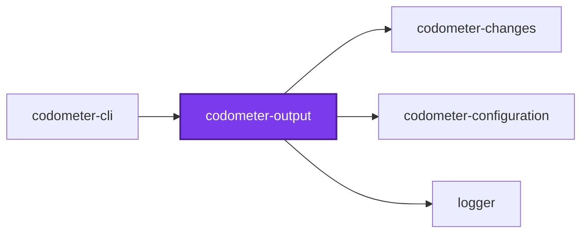
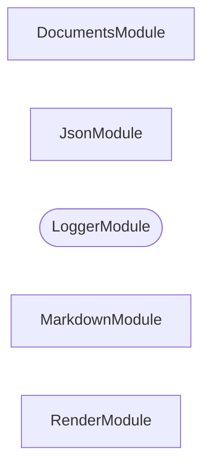
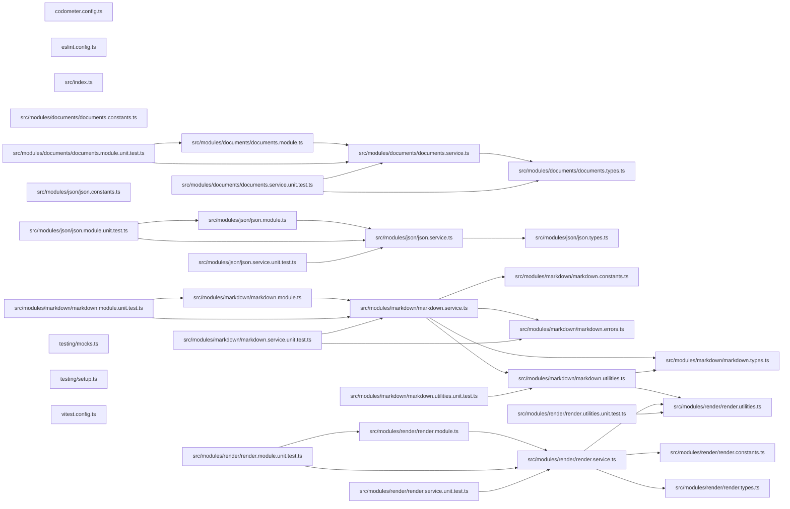

## Test

```bash
nx run codometer-output:vitest
```

<!-- CALL_STACKS_START -->

## 🔭 Callidescope

Call stacks traced through `packages/codometer-output`, deepest first. Each frame shows what it takes, what it returns, and what its documentation says.

| Measure | Value |
| --- | --- |
| Callables | 80 |
| Files | 22 |
| Calls traced | 245 |
| Call stacks | 4 |
| Deepest stack | 7 |
| Stacks through recursion | 0 |
| Unfollowable calls | 5 |

### Call stacks (depth)

**1. `MarkdownService.renderBadges`** — depth 7 · orphan-root

```text
🚀 MarkdownService.renderBadges(args: RenderBadgesArguments): string [packages/codometer-output/src/modules/markdown/markdown.service.ts:257]
   ↳ Render the badge block for a destination, description and all.
  └─> MarkdownService.renderDocument(args: RenderDocumentArguments): string [packages/codometer-output/src/modules/markdown/markdown.service.ts:291]
     ↳ Render the badges as a document of their own.
    └─> MarkdownService.buildBadgeGroups(args: RenderDocumentArguments): string [packages/codometer-output/src/modules/markdown/markdown.service.ts:101]
       ↳ Assemble the badge groups, in the order they are rendered.
      └─> buildTargetsGroup(targets: readonly TargetSize[]): string [packages/codometer-output/src/modules/markdown/markdown.utilities.ts:307]
         ↳ Renders the Measured Targets badge group, one badge per measured target.
        └─> map(…)(target: TargetSize): string [packages/codometer-output/src/modules/markdown/markdown.utilities.ts:318]
          └─> formatTargetSize(target: TargetSize): string [packages/codometer-output/src/modules/markdown/markdown.utilities.ts:393]
             ↳ Formats one target's measured size, naming the compression it was measured under unless there was none.
            └─> formatBytes(bytes: number): string [packages/codometer-output/src/modules/render/render.utilities.ts:10]
               ↳ Formats a byte count, switching to megabytes once kilobytes get unwieldy.
```

**2. `RenderService.renderRow`** — depth 4 · orphan-root

```text
🚀 RenderService.renderRow(row: MetricRow): string [packages/codometer-output/src/modules/render/render.service.ts:134]
   ↳ Renders one table row.
  └─> formatDelta(delta: number | undefined, unit: MetricUnit): string [packages/codometer-output/src/modules/render/render.utilities.ts:23]
     ↳ Formats a signed delta, or an em dash when there is nothing to compare.
    └─> formatValue(value: number, unit: MetricUnit): string [packages/codometer-output/src/modules/render/render.utilities.ts:33]
       ↳ Formats a value the way its unit calls for.
      └─> formatBytes(bytes: number): string [packages/codometer-output/src/modules/render/render.utilities.ts:10]
         ↳ Formats a byte count, switching to megabytes once kilobytes get unwieldy.
```

**3. `MarkdownService.syncAnchoredBlock`** — depth ≥ 3 · orphan-root

```text
🚀 MarkdownService.syncAnchoredBlock(args: SyncAnchoredBlockArguments): boolean [packages/codometer-output/src/modules/markdown/markdown.service.ts:190]
   ↳ Splice the anchored block into a file, or report whether it is current.
  └─> MarkdownService.buildBlockRegex(args: { endMarker: string; startMarker: string; }): RegExp [packages/codometer-output/src/modules/markdown/markdown.service.ts:128]
     ↳ Build the matcher for a block delimited by the configured markers.
    └─> MarkdownService.escapeRegex(input: string): string [packages/codometer-output/src/modules/markdown/markdown.service.ts:140]
       ↳ Escape a configured marker so it can be searched for literally.
```

<details>
<summary>1 more call stacks</summary>

**4. `RenderService.renderProject`** — depth 3 · orphan-root

```text
🚀 RenderService.renderProject(…): string[] [packages/codometer-output/src/modules/render/render.service.ts:106]
   ↳ Renders one project's block, or nothing if it has nothing to show.
  └─> RenderService.readIsOpen(rows: readonly MetricRow[], failures: readonly ProjectFailure[]): boolean [packages/codometer-output/src/modules/render/render.service.ts:47]
     ↳ Whether a project's block should open expanded.
    └─> RenderService.some(…)(row: MetricRow): boolean [packages/codometer-output/src/modules/render/render.service.ts:51]
```

</details>

### Module spread

None.

### Breadth

| Callable | Breadth | Calls directly | Location |
| --- | --- | --- | --- |
| `MarkdownService.buildBadgeGroups` | 16 | `MarkdownService.filter(…)`, `buildRepositoryGroup`, `buildTargetsGroup`, `buildTypescriptGroup`, `buildJavascriptGroup`, `buildPythonGroup`, `buildJsonGroup`, `buildYamlGroup`, `buildTomlGroup`, `buildShellGroup`, `buildSqlGroup`, `buildHclGroup`, `buildCssGroup`, `buildCustomGroup`, `buildJupyterGroup`, `buildMarkdownGroup` | `packages/codometer-output/src/modules/markdown/markdown.service.ts:101` |
| `MarkdownService.syncAnchoredBlock` | 6 | `MissingMarkdownPathError.constructor`, `MarkdownService.readExisting`, `MarkdownService.wrapInAnchors`, `MarkdownService.buildBlockRegex`, `MarkdownService.writeMarkdownFile`, `MarkdownService.replace(…)` | `packages/codometer-output/src/modules/markdown/markdown.service.ts:190` |
| `RenderService.renderSection` | 6 | `RenderService.groupByProject(…)`, `RenderService.groupByProject`, `RenderService.groupByProject(…)`, `RenderService.flatMap(…)`, `RenderService.readProjects`, `RenderService.renderComparison` | `packages/codometer-output/src/modules/render/render.service.ts:154` |

<details>
<summary>37 more callables</summary>

| Callable | Breadth | Calls directly | Location |
| --- | --- | --- | --- |
| `buildRepositoryGroup` | 4 | `buildGroup`, `buildBadge`, `formatBytes`, `buildCustomBadges` | `packages/codometer-output/src/modules/markdown/markdown.utilities.ts:236` |
| `RenderService.renderProject` | 4 | `RenderService.filter(…)`, `RenderService.readIsOpen`, `RenderService.renderFailures`, `RenderService.map(…)` | `packages/codometer-output/src/modules/render/render.service.ts:106` |
| `DocumentsService.emit` | 3 | `DocumentsService.wrap`, `DocumentsService.readDocument`, `DocumentsService.splice` | `packages/codometer-output/src/modules/documents/documents.service.ts:51` |
| `buildCssGroup` | 3 | `buildGroup`, `buildBadge`, `buildCustomBadges` | `packages/codometer-output/src/modules/markdown/markdown.utilities.ts:23` |
| `buildHclGroup` | 3 | `buildGroup`, `buildBadge`, `buildCustomBadges` | `packages/codometer-output/src/modules/markdown/markdown.utilities.ts:89` |
| `buildJsonGroup` | 3 | `buildGroup`, `buildBadge`, `buildCustomBadges` | `packages/codometer-output/src/modules/markdown/markdown.utilities.ts:129` |
| `buildJupyterGroup` | 3 | `buildGroup`, `buildBadge`, `buildCustomBadges` | `packages/codometer-output/src/modules/markdown/markdown.utilities.ts:150` |
| `buildMarkdownGroup` | 3 | `buildGroup`, `buildBadge`, `buildCustomBadges` | `packages/codometer-output/src/modules/markdown/markdown.utilities.ts:179` |
| `buildPythonGroup` | 3 | `buildGroup`, `buildBadge`, `buildCustomBadges` | `packages/codometer-output/src/modules/markdown/markdown.utilities.ts:208` |
| `buildShellGroup` | 3 | `buildGroup`, `buildBadge`, `buildCustomBadges` | `packages/codometer-output/src/modules/markdown/markdown.utilities.ts:254` |
| `buildSqlGroup` | 3 | `buildGroup`, `buildBadge`, `buildCustomBadges` | `packages/codometer-output/src/modules/markdown/markdown.utilities.ts:274` |
| `buildTomlGroup` | 3 | `buildGroup`, `buildBadge`, `buildCustomBadges` | `packages/codometer-output/src/modules/markdown/markdown.utilities.ts:325` |
| `buildTypescriptGroup` | 3 | `buildGroup`, `buildBadge`, `buildCustomBadges` | `packages/codometer-output/src/modules/markdown/markdown.utilities.ts:341` |
| `buildYamlGroup` | 3 | `buildGroup`, `buildBadge`, `buildCustomBadges` | `packages/codometer-output/src/modules/markdown/markdown.utilities.ts:356` |
| `RenderService.renderRow` | 3 | `RenderService.readStatus`, `formatValue`, `formatDelta` | `packages/codometer-output/src/modules/render/render.service.ts:134` |
| `JsonService.sync` | 2 | `JsonService.render`, `JsonService.readExisting` | `packages/codometer-output/src/modules/json/json.service.ts:62` |
| `formatValue` | 2 | `formatBytes`, `formatCount` | `packages/codometer-output/src/modules/render/render.utilities.ts:33` |
| `buildCustomBadges` | 2 | `map(…)`, `filter(…)` | `packages/codometer-output/src/modules/markdown/markdown.utilities.ts:47` |
| `buildCustomGroup` | 2 | `buildCustomBadges`, `buildGroup` | `packages/codometer-output/src/modules/markdown/markdown.utilities.ts:64` |
| `buildJavascriptGroup` | 2 | `buildGroup`, `buildBadge` | `packages/codometer-output/src/modules/markdown/markdown.utilities.ts:107` |
| `buildTargetsGroup` | 2 | `buildGroup`, `map(…)` | `packages/codometer-output/src/modules/markdown/markdown.utilities.ts:307` |
| `MarkdownService.renderBlock` | 2 | `MarkdownService.wrapInAnchors`, `MarkdownService.renderContent` | `packages/codometer-output/src/modules/markdown/markdown.service.ts:272` |
| `MarkdownService.sync` | 2 | `MarkdownService.renderContent`, `MarkdownService.buildAnchorHelpers` | `packages/codometer-output/src/modules/markdown/markdown.service.ts:337` |
| `MarkdownService.syncDocument` | 2 | `MarkdownService.readExisting`, `MarkdownService.writeMarkdownFile` | `packages/codometer-output/src/modules/markdown/markdown.service.ts:367` |
| `RenderService.readProjects` | 2 | `RenderService.map(…)`, `RenderService.map(…)` | `packages/codometer-output/src/modules/render/render.service.ts:55` |
| `DocumentsService.splice` | 1 | `DocumentsService.filter(…)` | `packages/codometer-output/src/modules/documents/documents.service.ts:88` |
| `formatDelta` | 1 | `formatValue` | `packages/codometer-output/src/modules/render/render.utilities.ts:23` |
| `buildBadge` | 1 | `encodeValue` | `packages/codometer-output/src/modules/markdown/markdown.utilities.ts:14` |
| `map(…)` | 1 | `formatTargetSize` | `packages/codometer-output/src/modules/markdown/markdown.utilities.ts:318` |
| `formatTargetSize` | 1 | `formatBytes` | `packages/codometer-output/src/modules/markdown/markdown.utilities.ts:393` |
| `MarkdownService.buildBlockRegex` | 1 | `MarkdownService.escapeRegex` | `packages/codometer-output/src/modules/markdown/markdown.service.ts:128` |
| `MarkdownService.renderContent` | 1 | `MarkdownService.renderBadges` | `packages/codometer-output/src/modules/markdown/markdown.service.ts:162` |
| `MarkdownService.renderBadges` | 1 | `MarkdownService.renderDocument` | `packages/codometer-output/src/modules/markdown/markdown.service.ts:257` |
| `MarkdownService.renderDocument` | 1 | `MarkdownService.buildBadgeGroups` | `packages/codometer-output/src/modules/markdown/markdown.service.ts:291` |
| `MarkdownService.renderDocumentationSection` | 1 | `MarkdownService.map(…)` | `packages/codometer-output/src/modules/markdown/markdown.service.ts:311` |
| `RenderService.readIsOpen` | 1 | `RenderService.some(…)` | `packages/codometer-output/src/modules/render/render.service.ts:47` |
| `RenderService.renderFailures` | 1 | `RenderService.map(…)` | `packages/codometer-output/src/modules/render/render.service.ts:89` |

</details>

### Possibly misplaced

None.
<!-- CALL_STACKS_END -->

## 🕸️ Codependix

Dependency graphs exported by [codependix](https://github.com/JimmyPaolini/codebase/tree/main/packages/codependix-cli), regenerated by `nx run codebase:codependix:write`.

### Nx Neighborhood

<!-- codependix:start name="codependix-nx" -->

<!-- codependix:end name="codependix-nx" -->

### NestJS Module Graph

<!-- codependix:start name="codependix-nestjs" -->


_Rounded modules are global: every module can inject them, so their edges are left out._
<!-- codependix:end name="codependix-nestjs" -->

### File Imports

<!-- codependix:start name="codependix-imports" -->

<!-- codependix:end name="codependix-imports" -->

<!-- CODE_STATISTICS_START -->

## ⏲️ Codometer

### Project


### Measured Targets


### TypeScript


### JavaScript


### Python


### JSON


### YAML


### TOML


### Shell


### SQL


### HCL


### CSS


### Conventions


### Jupyter


### Markdown


<!-- CODE_STATISTICS_END -->
