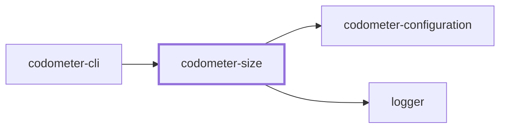
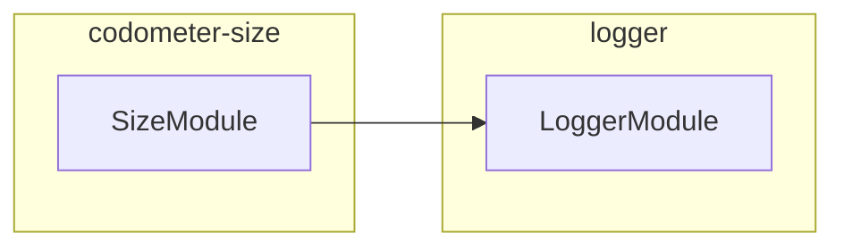

## Project Graph

Where this project sits in the Nx project graph: what it depends on, and what depends on it. Regenerated by `nx run synchronization:nx-project-graphs:write`.

<!-- nx-project-graph-start -->



<!-- nx-project-graph-end -->

## Module Graph

The modules this project defines and the imports between them, published by `nx run synchronization:nestjs-module-graphs:write`.

<!-- nestjs-module-graph-start -->



_Reached only for their types, and so declaring no module here: codometer-configuration._

<!-- nestjs-module-graph-end -->

## Test

```bash
nx run codometer-size:vitest
```

<!-- CALL_STACKS_START -->

## 🔭 Callidescope

Call stacks traced through `codometer-size`, deepest first. Each frame shows what it takes, what it returns, and what its documentation says.

| Measure | Value |
| --- | --- |
| Callables | 8 |
| Files | 8 |
| Calls traced | 3 |
| Call stacks | 0 |
| Deepest stack | 0 |
| Stacks through recursion | 0 |
| Unfollowable calls | 2 |

### Call stacks (depth)

None.

### Module spread

None.

### Breadth

| Callable | Breadth | Calls directly | Location |
| --- | --- | --- | --- |
| `SizeService.measureFile` | 2 | `SizeService.compress`, `UnreadableTargetFileError.constructor` | `packages/codometer-size/src/modules/size/size.service.ts:60` |
| `SizeService.analyze` | 1 | `SizeService.measureFile` | `packages/codometer-size/src/modules/size/size.service.ts:84` |

### Possibly misplaced

None.
<!-- CALL_STACKS_END -->
