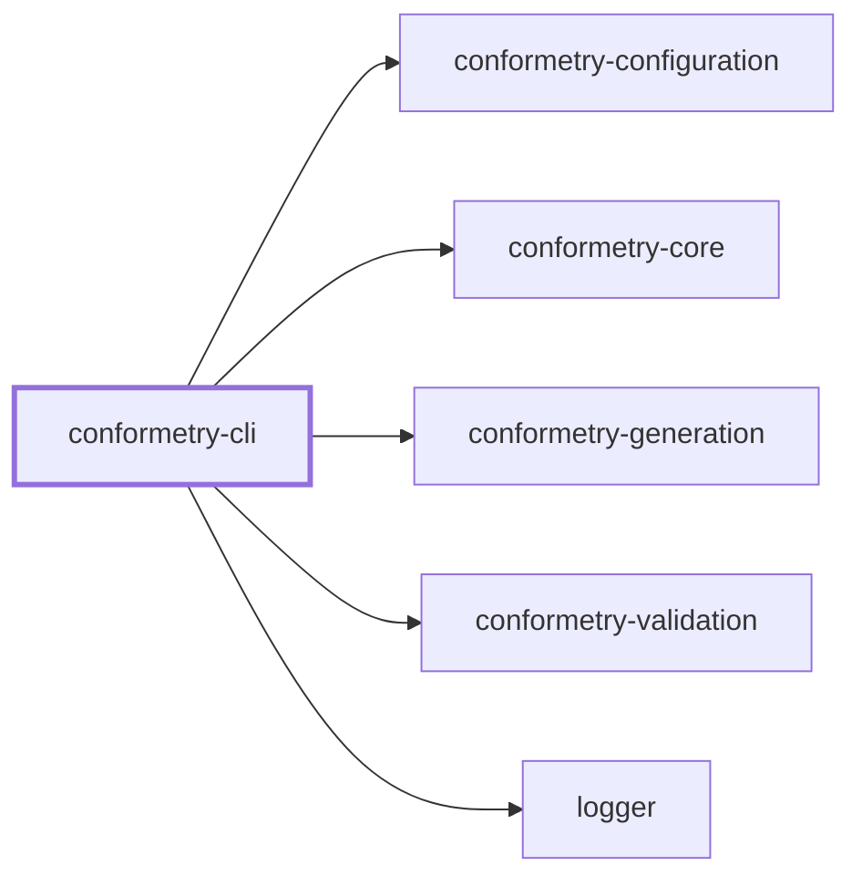
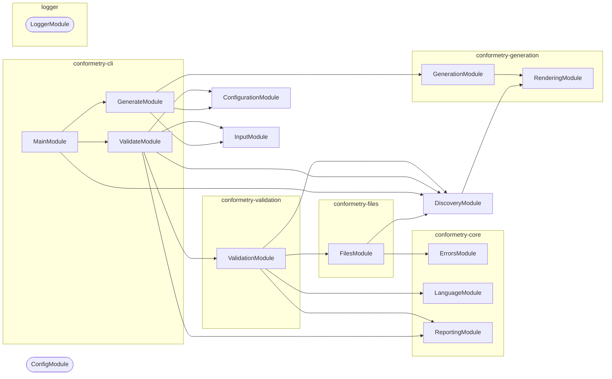

# 👔 Conformetry

**Scaffold from a template, then hold the result to it.**

Conformetry is a code generation toolchain whose templates keep working after
generation. The same template folder that produces a new module is the
specification that module is later checked against, so scaffolding conventions
and enforcing them are one artifact instead of two that drift apart.

```bash
npm install --save-dev @conformetry/cli
```

```bash
# Scaffold a new module from the `nestjs-service-module` template
conformetry generate --generator nestjs-service-module --name billing

# Check every existing instance still matches the template it came from
conformetry validate
```

## Why

Scaffolding tools stop caring the moment the files are written. A month later
a module has lost its `constants.ts`, a service dropped its section comments,
and nobody notices until someone reads it. Linters can't help — the convention
isn't a rule about syntax, it's a rule about the shape of a template that only
exists in a generator's output directory.

Conformetry closes the loop. Templates are rendered twice: once to create
files, and again — with the same substitutions, by the same renderer — to
compare against the files that already exist. A file that would not be
regenerated the way it is written today is a finding.

Comparison is **structural, not textual**. A TypeScript instance is compared as
a syntax tree, markdown as an mdast tree, Python through Python's own `ast`
module. Reformatting a file, renaming a local, or adding a method does not fail
validation; deleting a required export, dropping a declared file, or losing a
section comment does.

## Install

| Package | Install when |
| ------- | ------------ |
| `@conformetry/cli` | You want the `conformetry` command |
| `@conformetry/nx` | Your workspace is an Nx monorepo |
| `@conformetry/generation` + `@conformetry/validation` | You are embedding conformetry in your own tool |

```bash
npm install --save-dev @conformetry/cli
# or
pnpm add --save-dev @conformetry/cli
```

Node.js 20 or newer. Validating Python or Jupyter instances additionally needs
`python3` on `PATH` — the Python validator compares through the interpreter's
own `ast` module rather than reimplementing a parser.

## Commands

### `conformetry generate`

Renders one generator's template folder into a target directory.

| Flag | Purpose |
| ---- | ------- |
| `--generator <name>` | Which generator from the registry to run. Required |
| `--config [path]` | Configuration file to read. Defaults to `configuration/conformetry.config.ts` |
| `--directory [path]` | Where to write the rendered files |
| `--no-interactive` | Never prompt; fail instead when a required input is missing |

A generator's own inputs are passed as flags alongside these:

```bash
conformetry generate --generator react-component --name search-bar
```

Unknown flags are accepted deliberately. Which inputs exist is not known until
the generator is chosen, so they are matched against that generator's schema
rather than declared ahead of time. This is also why the generator is selected
with `--generator` and not `--name`: almost every generator takes a `name`, and
reserving that flag would leave no way to supply it.

Missing required inputs are prompted for when stdin is a TTY and `CI` is not
`true`. Otherwise the command fails rather than hanging.

### `conformetry validate`

Expands the configured instance globs and compares everything it finds against
the template it was generated from.

| Flag | Purpose |
| ---- | ------- |
| `--config [path]` | Configuration file to read |
| `--instances [globs]` | Comma-separated globs to validate, overriding the configuration |
| `--languages [names]` | Comma-separated validators to run — `typescript`, `markdown`, `python`, `json`, `jupyter`, `text` |

Every flag is optional; an absent filter means "everything". The command exits
non-zero when any instance does not conform, which is what makes it usable as a
pre-merge gate.

Findings are grouped by file and each one carries the location on **both**
sides — where the instance is wrong and where the template says so — plus the
expected value and a concrete fix:

```text
1. file: billing.service.ts
   Instance: packages/billing/src/modules/billing/billing.service.ts
   Template: configuration/conformetry-templates/nestjs-service-module/…

   1. Missing required comment
      Instance: line 24
      Template: line 31
      Expected: `// 🌎 Public Methods`
      Fix     : Add the `// 🌎 Public Methods` section comment above the first public method.
```

The `fix` field is the point of the format: reports are meant to be actionable
by whoever — or whatever — has to make the file conform.

## Configuration

A single `conformetry.config.ts` declares every generator: the template folder
it renders, the inputs it takes, and the paths its output already occupies.

```ts
import { type ConformetryConfiguration } from "@conformetry/configuration";

const conformetryConfiguration: ConformetryConfiguration = [
  {
    aliases: ["nsm"],
    description: "Generate a NestJS service module",
    inputs: {
      name: { description: "Module name in kebab-case", type: "string" },
    },
    instances: [{ patterns: ["packages/*/src/modules/*"] }],
    name: "nestjs-service-module",
    templatePath: "templates/nestjs-service-module",
  },
];

export default conformetryConfiguration;
```

`instances` is what makes validation possible: it says where this generator's
output already lives, so validation knows what to check without being told
twice. The full field reference — instance groups, tag selectors, input
schemas, discovery, and the supported file formats — is in
[**@conformetry/configuration**](../conformetry-configuration/README.md).

## Templates

A template is an ordinary folder of ordinary files. Both file contents and file
_paths_ are rendered with [mustache](https://mustache.github.io), so a folder
named `{{nameKebabCase}}` becomes `billing` and a file named
`{{namePascalCase}}.tsx` becomes `SearchBar.tsx`:

```text
templates/nestjs-service-module/
└── {{nameKebabCase}}/
    ├── {{nameKebabCase}}.constants.ts
    ├── {{nameKebabCase}}.module.ts
    ├── {{nameKebabCase}}.service.ts
    ├── {{nameKebabCase}}.service.unit.test.ts
    └── {{nameKebabCase}}.types.ts
```

Every generator's `name` input is expanded into four case variants
automatically, so a template never has to case-convert by hand:

| Placeholder | `search bar` becomes |
| ----------- | -------------------- |
| `{{nameCamelCase}}` | `searchBar` |
| `{{nameKebabCase}}` | `search-bar` |
| `{{namePascalCase}}` | `SearchBar` |
| `{{nameSnakeCase}}` | `search_bar` |

An explicit input of the same name always wins over the derived variant. Full
mustache is available — sections, inverted sections, partials — with HTML
escaping disabled so substituted values cannot corrupt source code.

> **Supply every placeholder a template uses.** Mustache renders an unknown
> placeholder as an empty string rather than leaving the token visible, so a
> missing substitution produces a silent hole rather than an error.

## Validators

Which validator handles a file is decided by its extension, and only the
packages a run actually needs are loaded.

| Validator | Extensions | Compares |
| --------- | ---------- | -------- |
| `typescript` | `.ts`, `.tsx` | Syntax tree structure and required section comments |
| `markdown` | `.md` | mdast structure — headings, lists, tables — rather than prose |
| `python` | `.py` | Structure via Python's own `ast` module |
| `json` | `.json`, `.jsonc` | Key structure and values |
| `jupyter` | `.ipynb` | Notebook envelope, delegating cells to the markdown and Python validators |
| `text` | everything else | Duplicate-aware line conformance — the floor, so no extension goes unchecked |

Before any of them runs, every file the template declares is checked to
**exist**. That pass covers extensions no validator claims — `.gitignore`,
`.env.default`, `pyproject.toml` — which would otherwise be deletable without
failing anything. A missing directory is reported once rather than as twenty
missing files.

A template comment containing `TODO` is treated as a prompt rather than text to
copy, so any instance comment satisfies it.

## Nx workspaces

[`@conformetry/nx`](../conformetry-nx/README.md) is a second host over the same
runtime. It adds two things the standalone CLI cannot offer:

- **A `conformetry-validate` target inferred onto every project** that holds
  instances, so validation is cached and participates in `nx affected`.
- **Generators addressed by name** — `nx g conformetry:nestjs-service-module` —
  with Nx prompting for inputs and writing through its virtual `Tree`.

Because which generators exist is a property of _your_ configuration rather
than of the package, the plugin exposing them is emitted at install time rather
than shipped:

```json
{ "scripts": { "postinstall": "conformetry-nx-bootstrap" } }
```

Instance groups may additionally select projects by Nx tag, with their globs
read inside each matching project:

```ts
instances: [{ patterns: ["src/modules/*"], tags: ["framework:nestjs"] }];
```

## Project Graph

Where this project sits in the Nx project graph: what it depends on, and what depends on it. Regenerated by `nx run synchronization:synchronize --configuration=write`.

<!-- nx-project-graph-start -->



<!-- nx-project-graph-end -->

## Module Graph

The modules this project defines and the imports between them, regenerated by `nx run synchronization:synchronize --configuration=write`.

<!-- nestjs-module-graph-start -->



_Rounded modules are global: every module can inject them, so their edges are left out._

<!-- nestjs-module-graph-end -->

## Packages

Conformetry is deliberately split so that embedding it does not mean depending
on a CLI. `@conformetry/core` is the leaf — it depends on nothing else in the
graph — and every other package declares exactly which siblings it may import.

### Hosts

| Package | Role |
| ------- | ---- |
| [`@conformetry/cli`](README.md) | The `conformetry` command: expands globs, prompts for inputs, prints reports |
| [`@conformetry/nx`](../conformetry-nx/README.md) | Nx plugin: inferred validation targets, tag-scoped instances, emitted generators |

### Runtime

| Package | Role |
| ------- | ---- |
| [`@conformetry/core`](../conformetry-core/README.md) | Structured error shape, the language validator contract, report rendering |
| [`@conformetry/configuration`](../conformetry-configuration/README.md) | Config loading, template discovery, candidate matching, input resolution |
| [`@conformetry/generation`](../conformetry-generation/README.md) | Mustache rendering and the generator lifecycle |
| [`@conformetry/validation`](../conformetry-validation/README.md) | Validation orchestration, language routing, finding deduplication |
| [`@conformetry/files`](../conformetry-files/README.md) | Existence checking for every declared file, whatever its extension |

### Languages

| Package | Extensions |
| ------- | ---------- |
| [`@conformetry/typescript`](../conformetry-typescript/README.md) | `.ts`, `.tsx` |
| [`@conformetry/markdown`](../conformetry-markdown/README.md) | `.md` |
| [`@conformetry/python`](../conformetry-python/README.md) | `.py` |
| [`@conformetry/json`](../conformetry-json/README.md) | `.json`, `.jsonc` |
| [`@conformetry/jupyter`](../conformetry-jupyter/README.md) | `.ipynb` |
| [`@conformetry/text`](../conformetry-text/README.md) | the fallback for everything else |

Nothing depends on `@conformetry/cli`. Embedding conformetry means depending on
the runtime packages directly — the CLI is one host among others, and holds no
logic of its own.

## Embedding

Both runtimes are NestJS providers, so a host wires them the way it wires
anything else:

```ts
import { GenerationService } from "@conformetry/generation";

const result = await generationService.runGenerator({
  definition: {
    name: "nestjs-service-module",
    templateDirectoryPath: "templates/nestjs-service-module",
  },
  inputs: { name: "billing" },
  instancePath: "packages/billing/src/modules",
});
```

Filesystem and formatter access go through adapters, which is how
`@conformetry/nx` reuses this runtime unchanged against a virtual `Tree`.
Rendering deliberately is _not_ an adapter: validation must substitute exactly
as generation does, or validation would flag the files the generator itself
produced.

## Start

Run the CLI from source:

```bash
nx run conformetry-cli:start
```

Pass a subcommand and its flags after `--`:

```bash
nx run conformetry-cli:start -- validate --languages typescript
```

## Test

```bash
nx run conformetry-cli:vitest
```

## Build

```bash
nx run conformetry-cli:build
```

## License

MIT — see [LICENSE](../../LICENSE).
