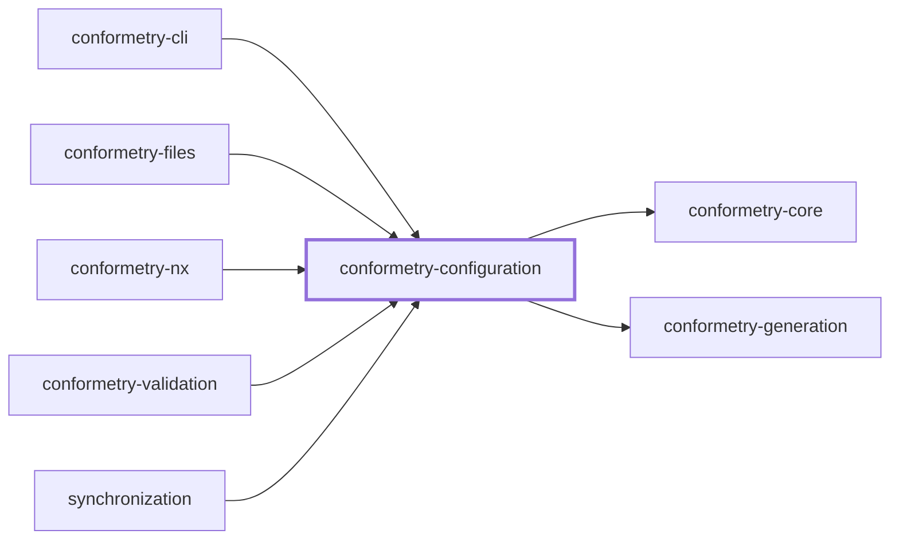
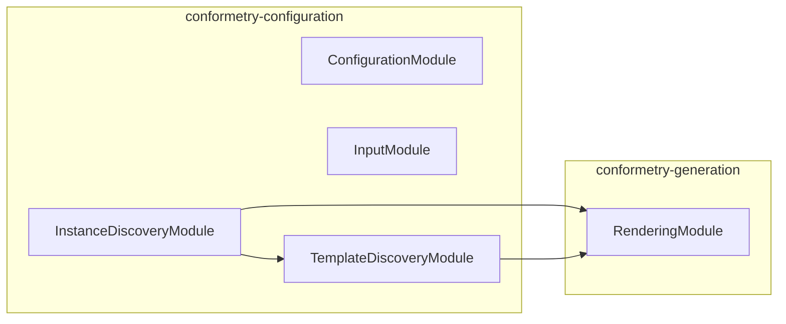

# 👔 Conformetry Configuration

**The configuration reference for [Conformetry](../conformetry-cli/README.md).**

`@conformetry/configuration` reads a repository's `conformetry.config.*`, checks
it, and turns it into the three things the rest of the toolchain works from:
the generator registry, the instances validation walks, and the
resolved inputs a generator renders with.

```bash
npm install --save-dev @conformetry/configuration
```

Most consumers never install this directly — `@conformetry/cli` and
`@conformetry/nx` both depend on it. Install it when you are typing a
configuration file, or embedding conformetry in a host of your own.

## The configuration file

Any of `conformetry.config.{ts,mts,cts,js,mjs,cjs,json,jsonc}`. TypeScript and
JavaScript files are loaded through [jiti](https://github.com/unjs/jiti), so a
`.ts` config needs no build step and may import from your workspace.

The path is resolved against the current directory first, then against the
workspace root — located by walking upward for `pnpm-workspace.yaml` — so a
config path written relative to the root still resolves from a nested
directory.

The file default-exports an **array of generator definitions**. It is an array
rather than a keyed record because a generator's name is already a field, and a
record made the name true in two places at once.

```ts
import { type ConformetryConfiguration } from "@conformetry/configuration";

const conformetryConfiguration: ConformetryConfiguration = [
  {
    aliases: ["nsm"],
    description: "Generate a NestJS service module",
    inputs: {
      name: { description: "Module name in kebab-case", type: "string" },
    },
    instances: [{ patterns: ["packages/*/src/modules/*"] }],
    name: "nestjs-service-module",
    templatePath: "templates/nestjs-service-module",
  },
];

export default conformetryConfiguration;
```

### Generator fields

| Field | Required | Purpose |
| ----- | -------- | ------- |
| `name` | ✅ | How the generator is addressed, and the filename it is emitted under |
| `templatePath` | ✅ | The template folder, relative to the workspace root |
| `inputs` | | The values it substitutes, as JSON Schema fragments |
| `instances` | | Where this generator's output already lives |
| `aliases` | | Short handles — `nsm`, `c` — resolved in the same namespace as names |
| `description` | | Shown when a host lists or prompts for generators |

Both `inputs` and `instances` may be omitted. A generator with neither renders
a fixed template nobody validates, which is legal.

### What is rejected

The schema fails loudly rather than validating nothing, and reports every
problem in one pass:

- **Two generators answering to the same name or alias.** Names and aliases
  share one namespace, because a host searches both at once. A host resolves
  the first match, so a collision does not error where it is used — it silently
  shadows, and the losing generator becomes unreachable while still appearing
  in the configuration.
- **Two generators sharing a `templatePath`.** Validation then finds instances
  that fit both equally and reports them as matching nothing.
- **A name or alias containing a path separator.** A generator is addressed by
  that text and emitted to a file named after it.

Unknown keys are stripped, so every field a generator needs is declared in the
schema deliberately — an omitted one would be silently discarded rather than
rejected.

## Instances

`instances` is what makes validation possible. It says where a generator's
output already lives, so validation knows what to check without being told a
second time.

```ts
instances: [
  { patterns: ["packages/*/src/modules/*"] },
  {
    patterns: ["applications/*/src/modules/*"],
    substitutions: { type: "applications" },
  },
];
```

| Field | Purpose |
| ----- | ------- |
| `patterns` | Globs locating this group's instances, workspace-relative |
| `substitutions` | Values the template's placeholders are rendered with for this group |
| `tags` | Labels selecting which hosts the group applies to, carried uninterpreted |
| `threshold` | Lowest conformance score these instances may have, overriding the generator's |

Groups exist so substitutions can differ per glob. `type` is `packages` for one
set of paths and `applications` for another, and no generic rule can tell them
apart.

> **Every placeholder a template uses must be supplied here.** Mustache renders
> an unknown placeholder as an empty string, so a missing entry shows up as a
> silent hole in the rendered comparison rather than an error.

`tags` is carried through untouched by this package, which has no notion of a
host to match labels against. [`@conformetry/nx`](../conformetry-nx/README.md)
reads them as Nx project tags and resolves each group's globs _inside_ every
matching project; another host is free to read them as something else. A group
naming only `tags` is legal — it selects without locating, which is what a
template with no instances yet wants.

### Directory globs versus file globs

The two behave differently on purpose, and the difference is what lets a
small template win against a large one.

- A **directory glob** leaves the match scope open, and the largest fitting
  template wins.
- A **file glob** narrows the scope to the matched files, so a template
  describing exactly those files fits better than one describing the whole
  directory.

That is how a two-file template such as `nestjs-service-file` is matchable at
all inside a directory a five-file module template also claims:

```ts
instances: [
  { patterns: ["src/modules/*/*.service.ts", "src/modules/*/*.service.unit.test.ts"] },
];
```

### Where a template is laid down

A template that produces a _folder_ contains that folder, so its instance path
is the folder's **parent**: `nestjs-service-module` holds `{{nameKebabCase}}/…`,
and its instances are `…/src/modules`. A template that produces loose files
holds them at its root, and its instance path is the directory those files sit
in.

## Thresholds

An instance passes when its conformance score reaches the threshold that
applies to it. Three levels set it, and the narrowest wins:

```ts
instances[].threshold ?? generator.threshold ?? runThreshold ?? 1
```

A level left unset stays unset rather than being filled with the default — that
is what lets a host's own `--threshold` reach an instance whose generator has
no opinion. The default of `1` is applied only at the end of the chain, so
nothing configured is quietly overridden, and a level nobody set is not
quietly treated as if they had.

```ts
{
  name: "nestjs-service-module",
  templatePath: "templates/nestjs-service-module",
  threshold: 1,                               // strict everywhere by default
  instances: [
    { patterns: ["packages/*/src/modules/*"] },
    {
      patterns: ["applications/legacy/src/modules/*"],
      threshold: 0.75,                        // …except while migrating this one
    },
  ],
}
```

When two groups locate the same instance with different thresholds the
strictest wins: nothing makes one group more specific than another, and letting
order decide would mean a lenient group could silently relax a bar someone else
set.

## Inputs

Each entry in `inputs` is a JSON Schema fragment. Only `properties` and
`required` are read — enough to know an input's name, whether it must be
supplied, and what to say when prompting for it.

Authoring them by hand is verbose, so deriving them from a schema library is
the usual approach:

```ts
import { z } from "zod";

function defineInputs(shape: z.ZodRawShape) {
  return z.toJSONSchema(z.object(shape)).properties ?? {};
}

inputs: defineInputs({
  name: z.string().describe("Module name in kebab-case"),
  project: z.string().describe("Parent project name in kebab-case"),
});
```

Values are resolved in order: flags passed on the command line first, then
interactive prompts for anything still missing. Prompting is skipped entirely
when stdin is not a TTY or `CI` is `true`, so a missing input fails the command
rather than hanging it.

## Matching

Validation does not record which template produced a file. It works it out:
every instance is weighed against every template by the share of the template's
files the instance already has, and the best fit wins.

Two outcomes are reported rather than skipped, because a glob is the author
asserting that these paths _are_ instances:

| Reason | Meaning |
| ------ | ------- |
| `no-match` | No template explains this instance well enough |
| `ambiguous` | Two or more templates tied, so they are indistinguishable here |

## Project Graph

Where this project sits in the Nx project graph: what it depends on, and what depends on it. Regenerated by `nx run synchronization:synchronize --configuration=write`.

<!-- nx-project-graph-start -->



<!-- nx-project-graph-end -->

## Module Graph

The modules this project defines and the imports between them, regenerated by `nx run synchronization:synchronize --configuration=write`.

<!-- nestjs-module-graph-start -->



_Reached only for their types, and so declaring no module here: conformetry-core._

<!-- nestjs-module-graph-end -->

## Exports

| Export | Purpose |
| ------ | ------- |
| `ConfigurationService` | Loads, validates, and normalizes a configuration file |
| `DiscoveryService` | Expands globs into instances, reads templates, matches the two, prepares documents |
| `InputService` | Parses command-line options and resolves generator inputs, prompting when allowed |
| `ConformetryConfiguration` | The loaded configuration type — author your config as this |
| `ConformetryInstanceGroup`, `ConformetryGeneratorDefinition` | Field-level types for the above |

Each is a NestJS provider exported from its module (`ConfigurationModule`,
`DiscoveryModule`, `InputModule`), so a host wires them like any other.

Loading a configuration file is deliberately separate from walking the
filesystem: `ConfigurationService` owns reading, and everything that touches
paths lives in `DiscoveryService`.

## Test

```bash
nx run conformetry-configuration:vitest
```

## License

MIT — see [LICENSE](../../LICENSE).

<!-- CALL_STACKS_START -->

## 🔭 Callidescope

Call stacks traced through `conformetry-configuration`, deepest first. Each frame shows what it takes, what it returns, and what its documentation says.

| Measure | Value |
| --- | --- |
| Callables | 119 |
| Files | 25 |
| Calls traced | 101 |
| Call stacks | 6 |
| Deepest stack | 8 |
| Stacks through recursion | 0 |
| Unfollowable calls | 5 |

### Call stacks

**1. `InputService.resolveInputsFromValues`** — depth ≥ 8 · orphan-root

```text
🚀 InputService.resolveInputsFromValues(args: ResolveInputsFromValuesArguments): Promise<Record<string, string>> [packages/conformetry-configuration/src/modules/input/input.service.ts:203]
   ↳ Resolves inputs from values the caller already parsed.
  └─> InputService.resolveInputs(…): Promise<Record<string, string>> [packages/conformetry-configuration/src/modules/input/input.service.ts:52]
     ↳ Walks a schema, taking each value from the resolver or a prompt.
    └─> InputService.acceptProvidedValue(args: { input: SchemaInput; value: string; }): string [packages/conformetry-configuration/src/modules/input/input.service.ts:38]
       ↳ Validates a value the caller already had, throwing if it is invalid.
      └─> InputSchemaService.validateValue(args: { input: SchemaInput; value: unknown; }): string | true [packages/conformetry-configuration/src/modules/input/input-schema.service.ts:158]
         ↳ Validates a value, returning `true` or the reason it failed.
        └─> InputSchemaService.validateEnum(args: { input: SchemaInput; value: string; }): string | true [packages/conformetry-configuration/src/modules/input/input-schema.service.ts:39]
           ↳ Validates a value against a schema `enum`, when one is declared.
          └─> InputSchemaService.readEnumValues(propertySchema: unknown): string[] [packages/conformetry-configuration/src/modules/input/input-schema.service.ts:123]
             ↳ Reads the string members of a schema `enum`.
            └─> InputSchemaService.readSchemaProperty(propertySchema: unknown, key: string): unknown [packages/conformetry-configuration/src/modules/input/input-schema.service.ts:26]
               ↳ Reads one property off a schema fragment when it is an object.
              └─> InputSchemaService.find(…)([entryKey]: [string, any]): boolean [packages/conformetry-configuration/src/modules/input/input-schema.service.ts:31]
```

**2. `InstanceDiscoveryService.weighInstance`** — depth 7 · orphan-root

```text
🚀 InstanceDiscoveryService.weighInstance(…): { instance: Instance; pairings: InventoriedPairing[]; } [packages/conformetry-configuration/src/modules/instance-discovery/instance-discovery.service.ts:53]
   ↳ Weighs one instance against every template, best fit first.
  └─> InstanceDiscoveryMatchingService.matchTemplates(…): TemplateMatch[] [packages/conformetry-configuration/src/modules/instance-discovery/instance-discovery-matching.service.ts:154]
     ↳ Weighs every template that shares at least one file with the instance, best-first.
    └─> InstanceDiscoveryMatchingService.map(…)(…): { matchedFileCount: number; matchRatio: number; template: TemplateDefinition; } [packages/conformetry-configuration/src/modules/instance-discovery/instance-discovery-matching.service.ts:160]
      └─> TemplateDiscoveryService.countMatchingFiles(…): number [packages/conformetry-configuration/src/modules/template-discovery/template-discovery.service.ts:121]
         ↳ Counts how many of a template's files the instance path already has.
        └─> TemplateDiscoveryService.filter(…)(templateFilePath: string): boolean [packages/conformetry-configuration/src/modules/template-discovery/template-discovery.service.ts:130]
          └─> TemplateDiscoveryService.resolveInstanceFilePath(…): string [packages/conformetry-configuration/src/modules/template-discovery/template-discovery.service.ts:178]
             ↳ Maps a template file path to the instance file path it governs.
            └─> RenderingService.renderPath(args: { substitutions: Substitutions; templatePath: string; }): string [packages/conformetry-generation/src/modules/rendering/rendering.service.ts:80]
               ↳ Renders a template path with mustache, the same way contents are rendered.
```

**3. `InstanceDiscoveryService.matchTemplates`** — depth 7 · orphan-root

```text
🚀 InstanceDiscoveryService.matchTemplates(…): TemplateMatch[] [packages/conformetry-configuration/src/modules/instance-discovery/instance-discovery.service.ts:100]
   ↳ Ranks every template that shares a file with one instance, best first.
  └─> InstanceDiscoveryMatchingService.matchTemplates(…): TemplateMatch[] [packages/conformetry-configuration/src/modules/instance-discovery/instance-discovery-matching.service.ts:154]
     ↳ Weighs every template that shares at least one file with the instance, best-first.
    └─> InstanceDiscoveryMatchingService.map(…)(…): { matchedFileCount: number; matchRatio: number; template: TemplateDefinition; } [packages/conformetry-configuration/src/modules/instance-discovery/instance-discovery-matching.service.ts:160]
      └─> TemplateDiscoveryService.countMatchingFiles(…): number [packages/conformetry-configuration/src/modules/template-discovery/template-discovery.service.ts:121]
         ↳ Counts how many of a template's files the instance path already has.
        └─> TemplateDiscoveryService.filter(…)(templateFilePath: string): boolean [packages/conformetry-configuration/src/modules/template-discovery/template-discovery.service.ts:130]
          └─> TemplateDiscoveryService.resolveInstanceFilePath(…): string [packages/conformetry-configuration/src/modules/template-discovery/template-discovery.service.ts:178]
             ↳ Maps a template file path to the instance file path it governs.
            └─> RenderingService.renderPath(args: { substitutions: Substitutions; templatePath: string; }): string [packages/conformetry-generation/src/modules/rendering/rendering.service.ts:80]
               ↳ Renders a template path with mustache, the same way contents are rendered.
```

<details>
<summary>3 more call stacks</summary>

**4. `InputPromptingService.validate`** — depth 6 · orphan-root

```text
🚀 InputPromptingService.validate(value: unknown): string | true [packages/conformetry-configuration/src/modules/input/input-prompting.service.ts:51]
  └─> InputSchemaService.validateValue(args: { input: SchemaInput; value: unknown; }): string | true [packages/conformetry-configuration/src/modules/input/input-schema.service.ts:158]
     ↳ Validates a value, returning `true` or the reason it failed.
    └─> InputSchemaService.validateEnum(args: { input: SchemaInput; value: string; }): string | true [packages/conformetry-configuration/src/modules/input/input-schema.service.ts:39]
       ↳ Validates a value against a schema `enum`, when one is declared.
      └─> InputSchemaService.readEnumValues(propertySchema: unknown): string[] [packages/conformetry-configuration/src/modules/input/input-schema.service.ts:123]
         ↳ Reads the string members of a schema `enum`.
        └─> InputSchemaService.readSchemaProperty(propertySchema: unknown, key: string): unknown [packages/conformetry-configuration/src/modules/input/input-schema.service.ts:26]
           ↳ Reads one property off a schema fragment when it is an object.
          └─> InputSchemaService.find(…)([entryKey]: [string, any]): boolean [packages/conformetry-configuration/src/modules/input/input-schema.service.ts:31]
```

**5. `assertNoCollisions`** — depth ≥ 4 · orphan-root

```text
🚀 assertNoCollisions(…): void [packages/conformetry-configuration/src/modules/configuration/configuration.utilities.ts:26]
   ↳ Fails when two generators would answer to the same thing.
  └─> findUnusableHandles(…): { message: string; path: (string | number)[]; }[] [packages/conformetry-configuration/src/modules/configuration/configuration.utilities.ts:96]
     ↳ Reports names and aliases that could not be addressed or emitted.
    └─> flatMap(…)(…): { message: string; path: number[]; }[] [packages/conformetry-configuration/src/modules/configuration/configuration.utilities.ts:102]
      └─> map(…)(handle: string): { message: string; path: number[]; } [packages/conformetry-configuration/src/modules/configuration/configuration.utilities.ts:105]
```

**6. `InstanceDiscoveryService.buildSubstitutions`** — depth 3 · orphan-root

```text
🚀 InstanceDiscoveryService.buildSubstitutions(…): Substitutions [packages/conformetry-configuration/src/modules/instance-discovery/instance-discovery.service.ts:80]
   ↳ Builds the substitutions an instance's template is rendered with.
  └─> InstanceDiscoveryMatchingService.buildSubstitutions(instance: Instance): Substitutions [packages/conformetry-configuration/src/modules/instance-discovery/instance-discovery-matching.service.ts:72]
     ↳ Builds the substitutions an instance's template is rendered with.
    └─> RenderingService.buildNameSubstitutions(name: string): Substitutions [packages/conformetry-generation/src/modules/rendering/rendering.service.ts:38]
       ↳ Derives the case variants every template can reference from one name.
```

</details>

### Module spread

None.

### Possibly misplaced

None.
<!-- CALL_STACKS_END -->
