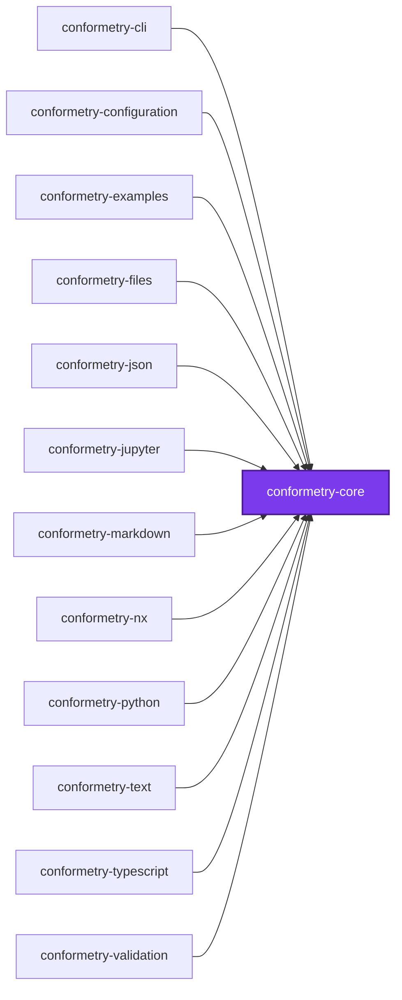
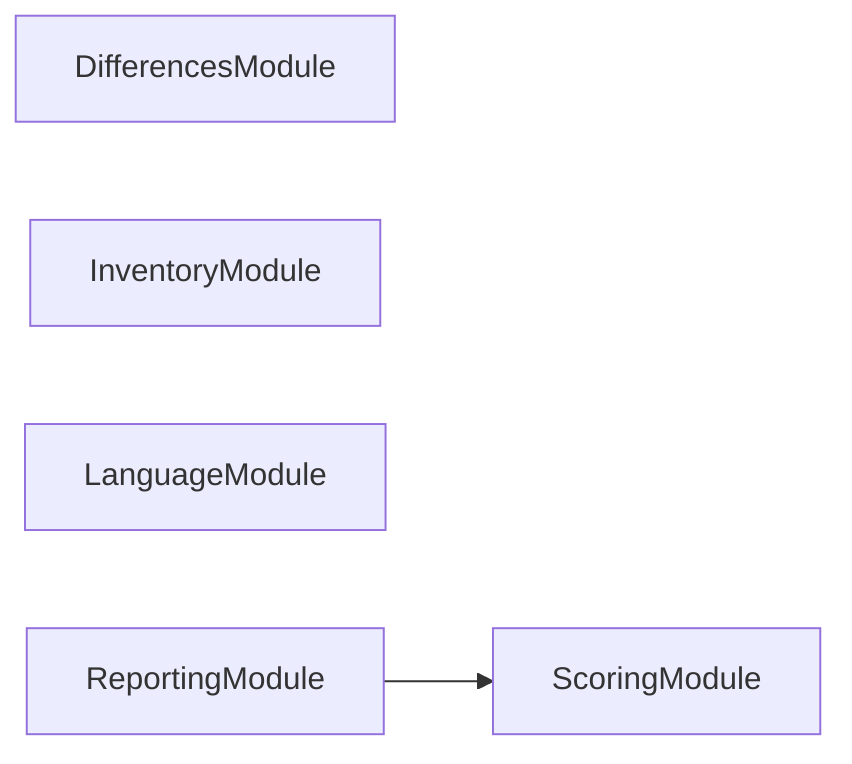

# 👔 Conformetry Core

The shared contract every other [Conformetry](../conformetry-cli/README.md)
package builds on. It is a leaf by design — it depends on nothing else in the
conformetry graph, so every other package can depend on it without a cycle.

```bash
npm install --save-dev @conformetry/core
```

## What it owns

| Module | Responsibility |
| ------ | -------------- |
| `errors` | The structured `ConformetryError` shape, plus builders and guards for it |
| `language` | The language validator contract and the shared execution envelope |
| `reporting` | Rendering conformance errors as readable, actionable text |
| `scoring` | The conformance arithmetic: what a finding weighs, what a weight pair scores |

"Language" here means a validator for one file format — TypeScript, JSON,
markdown, Python. The word "plugin" is reserved for the Nx plugin in
[`@conformetry/nx`](../conformetry-nx/README.md), and is deliberately not used
for these.

## Writing a language validator

A validator supplies a descriptor and a single-document comparison. Extension
filtering, grouping errors under their file, and assembling the result are
handled once by `LanguageService`, so a language package contains only its
comparison logic:

```ts
@Injectable()
export class ExampleValidatorService implements ConformetryLanguageValidator {
  public readonly descriptor = EXAMPLE_VALIDATOR_DESCRIPTOR;

  public validateDocument(
    document: PreparedValidationDocument,
  ): DocumentValidationResult {
    // compare document.renderedTemplate against document.instance
    return { errors, totalWeight };
  }
}
```

## Weight and score

A validator reports how much the template asked for alongside what it found.
`totalWeight` counts every requirement the comparison weighed — conforming ones
included, because leaving them out would score an instance only against the
parts of itself that are already wrong.

Each error may carry a `weight`, defaulting to 1. It says how many requirements
that one finding stands in for: a validator reports a missing class once,
however many members it held, so weighing the finding by its subtree is what
keeps deleting a class from costing the same as deleting an import. No per-kind
weight table is needed — a class is worth more because it contains more.

```text
score = (totalWeight - sum(error.weight ?? 1)) / totalWeight
```

`ScoringService` owns that arithmetic, including the two cases worth getting
right once: the default weight of a finding that declares none, and an empty
template whose denominator is zero and which therefore conforms perfectly.

[`@conformetry/validation`](../conformetry-validation/README.md) drives the
registered validators; they are never responsible for discovering files or
loading configuration.

## Structured errors

Errors carry the location on both sides — instance and template — along with
the expected value and a concrete `fix`. That last field is the point: reports
are meant to be actionable by whoever, or whatever, has to make the file
conform. Prefer populating `instanceLine`/`templateLine` (or `instancePath` for
document formats) over folding a location into the message.

## Exports

`ErrorsService`, `LanguageService`, `ReportingService`, `ScoringService` and
their modules, plus the `ConformetryError`, `ConformetryLanguageValidator`,
`DocumentValidationResult`, `InstanceScore`, `LanguageValidatorDescriptor`,
`PreparedValidationDocument`, `ValidationFileResult`, and `WeightedFinding`
types.

## Test

```bash
nx run conformetry-core:vitest
```

## License

MIT — see [LICENSE](../../LICENSE).

## 👔 Conformetry

This project was generated from the [nestjs-service-project](../../configuration/conformetry-templates/nestjs-service-project) conformetry template.

<!-- CALL_STACKS_START -->

## 🔭 Callidescope

Call stacks traced through `packages/conformetry-core`, deepest first. Each frame shows what it takes, what it returns, and what its documentation says.

| Measure | Value |
| --- | --- |
| Callables | 51 |
| Files | 24 |
| Calls traced | 43 |
| Call stacks | 0 |
| Deepest stack | 0 |
| Stacks through recursion | 0 |
| Unfollowable calls | 1 |

### Call stacks (depth)

None.

### Module spread

None.

### Breadth

| Callable | Breadth | Calls directly | Location |
| --- | --- | --- | --- |
| `LanguageService.runValidator` | 4 | `LanguageService.map(…)`, `LanguageService.filter(…)`, `LanguageService.filter(…)`, `LanguageService.reduce(…)` | `packages/conformetry-core/src/modules/language/language.service.ts:81` |
| `ReportingService.formatTotal` | 4 | `ReportingService.reduce(…)`, `ReportingService.reduce(…)`, `ReportingService.filter(…)`, `ReportingService.formatFraction` | `packages/conformetry-core/src/modules/reporting/reporting.service.ts:233` |
| `ReportingService.formatFileResult` | 3 | `ReportingService.formatFraction`, `ScoringService.sumWeights`, `ReportingService.flatMap(…)` | `packages/conformetry-core/src/modules/reporting/reporting.service.ts:97` |

<details>
<summary>25 more callables</summary>

| Callable | Breadth | Calls directly | Location |
| --- | --- | --- | --- |
| `ReportingService.formatScores` | 3 | `ReportingService.filter(…)`, `ReportingService.map(…)`, `ReportingService.formatTotal` | `packages/conformetry-core/src/modules/reporting/reporting.service.ts:196` |
| `ReportingService.formatFraction` | 2 | `ScoringService.calculateScore`, `ReportingService.formatPercentage` | `packages/conformetry-core/src/modules/reporting/reporting.service.ts:130` |
| `ReportingService.formatScore` | 2 | `ReportingService.formatPercentage`, `ReportingService.formatFraction` | `packages/conformetry-core/src/modules/reporting/reporting.service.ts:165` |
| `ReportingService.formatReport` | 2 | `ReportingService.formatScores`, `ReportingService.flatMap(…)` | `packages/conformetry-core/src/modules/reporting/reporting.service.ts:261` |
| `DifferencesService.resolveDifferenceType` | 1 | `DifferencesService.find(…)` | `packages/conformetry-core/src/modules/differences/differences.service.ts:76` |
| `DifferencesService.resolveErrorLanguage` | 1 | `DifferencesService.find(…)` | `packages/conformetry-core/src/modules/differences/differences.service.ts:89` |
| `InventoryService.describePairing` | 1 | `InventoryService.formatRatio` | `packages/conformetry-core/src/modules/inventory/inventory.service.ts:48` |
| `InventoryService.describeInstances` | 1 | `InventoryService.flatMap(…)` | `packages/conformetry-core/src/modules/inventory/inventory.service.ts:77` |
| `InventoryService.flatMap(…)` | 1 | `InventoryService.map(…)` | `packages/conformetry-core/src/modules/inventory/inventory.service.ts:78` |
| `InventoryService.map(…)` | 1 | `InventoryService.describePairing` | `packages/conformetry-core/src/modules/inventory/inventory.service.ts:82` |
| `InventoryService.describeTemplates` | 1 | `InventoryService.flatMap(…)` | `packages/conformetry-core/src/modules/inventory/inventory.service.ts:94` |
| `InventoryService.flatMap(…)` | 1 | `InventoryService.map(…)` | `packages/conformetry-core/src/modules/inventory/inventory.service.ts:98` |
| `InventoryService.map(…)` | 1 | `InventoryService.describePairing` | `packages/conformetry-core/src/modules/inventory/inventory.service.ts:109` |
| `InventoryService.shortenInstancePaths` | 1 | `InventoryService.map(…)` | `packages/conformetry-core/src/modules/inventory/inventory.service.ts:120` |
| `InventoryService.map(…)` | 1 | `InventoryService.shortenPath` | `packages/conformetry-core/src/modules/inventory/inventory.service.ts:124` |
| `InventoryService.shortenTemplatePairings` | 1 | `InventoryService.map(…)` | `packages/conformetry-core/src/modules/inventory/inventory.service.ts:136` |
| `InventoryService.map(…)` | 1 | `InventoryService.map(…)` | `packages/conformetry-core/src/modules/inventory/inventory.service.ts:140` |
| `InventoryService.map(…)` | 1 | `InventoryService.shortenPath` | `packages/conformetry-core/src/modules/inventory/inventory.service.ts:143` |
| `LanguageService.filter(…)` | 1 | `LanguageService.claimsDocument` | `packages/conformetry-core/src/modules/language/language.service.ts:85` |
| `LanguageService.map(…)` | 1 | `LanguageService.validateDocument` | `packages/conformetry-core/src/modules/language/language.service.ts:88` |
| `ScoringService.sumWeights` | 1 | `ScoringService.reduce(…)` | `packages/conformetry-core/src/modules/scoring/scoring.service.ts:53` |
| `ReportingService.formatError` | 1 | `ReportingService.formatLocation` | `packages/conformetry-core/src/modules/reporting/reporting.service.ts:53` |
| `ReportingService.flatMap(…)` | 1 | `ReportingService.formatError` | `packages/conformetry-core/src/modules/reporting/reporting.service.ts:114` |
| `ReportingService.map(…)` | 1 | `ReportingService.formatScore` | `packages/conformetry-core/src/modules/reporting/reporting.service.ts:210` |
| `ReportingService.flatMap(…)` | 1 | `ReportingService.formatFileResult` | `packages/conformetry-core/src/modules/reporting/reporting.service.ts:273` |

</details>

### Possibly misplaced

None.
<!-- CALL_STACKS_END -->

## 🕸️ Codependix

Dependency graphs exported by [codependix](https://github.com/JimmyPaolini/codebase/tree/main/packages/codependix-cli), regenerated by `nx run codebase:codependix:write`.

### Nx Neighborhood

<!-- codependix:start name="codependix-nx" -->

<!-- codependix:end name="codependix-nx" -->

### NestJS Module Graph

<!-- codependix:start name="codependix-nestjs" -->

<!-- codependix:end name="codependix-nestjs" -->

### File Imports

```mermaid
graph LR
  file_codometer_config_ts["codometer.config.ts"]
  file_eslint_config_ts["eslint.config.ts"]
  file_src_index_ts["src/index.ts"]
  file_src_modules_differences_differences_constants_ts["src/modules/differences/differences.constants.ts"]
  file_src_modules_differences_differences_module_ts["src/modules/differences/differences.module.ts"]
  file_src_modules_differences_differences_module_unit_test_ts["src/modules/differences/differences.module.unit.test.ts"]
  file_src_modules_differences_differences_service_ts["src/modules/differences/differences.service.ts"]
  file_src_modules_differences_differences_service_unit_test_ts["src/modules/differences/differences.service.unit.test.ts"]
  file_src_modules_differences_differences_types_ts["src/modules/differences/differences.types.ts"]
  file_src_modules_inventory_inventory_constants_ts["src/modules/inventory/inventory.constants.ts"]
  file_src_modules_inventory_inventory_module_ts["src/modules/inventory/inventory.module.ts"]
  file_src_modules_inventory_inventory_module_unit_test_ts["src/modules/inventory/inventory.module.unit.test.ts"]
  file_src_modules_inventory_inventory_service_ts["src/modules/inventory/inventory.service.ts"]
  file_src_modules_inventory_inventory_service_unit_test_ts["src/modules/inventory/inventory.service.unit.test.ts"]
  file_src_modules_inventory_inventory_types_ts["src/modules/inventory/inventory.types.ts"]
  file_src_modules_language_language_constants_ts["src/modules/language/language.constants.ts"]
  file_src_modules_language_language_module_ts["src/modules/language/language.module.ts"]
  file_src_modules_language_language_module_unit_test_ts["src/modules/language/language.module.unit.test.ts"]
  file_src_modules_language_language_service_ts["src/modules/language/language.service.ts"]
  file_src_modules_language_language_service_unit_test_ts["src/modules/language/language.service.unit.test.ts"]
  file_src_modules_language_language_types_ts["src/modules/language/language.types.ts"]
  file_src_modules_reporting_reporting_constants_ts["src/modules/reporting/reporting.constants.ts"]
  file_src_modules_reporting_reporting_module_ts["src/modules/reporting/reporting.module.ts"]
  file_src_modules_reporting_reporting_module_unit_test_ts["src/modules/reporting/reporting.module.unit.test.ts"]
  file_src_modules_reporting_reporting_service_ts["src/modules/reporting/reporting.service.ts"]
  file_src_modules_reporting_reporting_service_unit_test_ts["src/modules/reporting/reporting.service.unit.test.ts"]
  file_src_modules_reporting_reporting_types_ts["src/modules/reporting/reporting.types.ts"]
  file_src_modules_scoring_scoring_constants_ts["src/modules/scoring/scoring.constants.ts"]
  file_src_modules_scoring_scoring_module_ts["src/modules/scoring/scoring.module.ts"]
  file_src_modules_scoring_scoring_module_unit_test_ts["src/modules/scoring/scoring.module.unit.test.ts"]
  file_src_modules_scoring_scoring_service_ts["src/modules/scoring/scoring.service.ts"]
  file_src_modules_scoring_scoring_service_unit_test_ts["src/modules/scoring/scoring.service.unit.test.ts"]
  file_src_modules_scoring_scoring_types_ts["src/modules/scoring/scoring.types.ts"]
  file_testing_mocks_ts["testing/mocks.ts"]
  file_testing_setup_ts["testing/setup.ts"]
  file_vitest_config_ts["vitest.config.ts"]
  file_src_modules_differences_differences_constants_ts --> file_src_modules_differences_differences_types_ts
  file_src_modules_differences_differences_module_ts --> file_src_modules_differences_differences_service_ts
  file_src_modules_differences_differences_module_unit_test_ts --> file_src_modules_differences_differences_module_ts
  file_src_modules_differences_differences_module_unit_test_ts --> file_src_modules_differences_differences_service_ts
  file_src_modules_differences_differences_service_ts --> file_src_modules_differences_differences_constants_ts
  file_src_modules_differences_differences_service_ts --> file_src_modules_differences_differences_types_ts
  file_src_modules_differences_differences_service_unit_test_ts --> file_src_modules_differences_differences_service_ts
  file_src_modules_inventory_inventory_module_ts --> file_src_modules_inventory_inventory_service_ts
  file_src_modules_inventory_inventory_module_unit_test_ts --> file_src_modules_inventory_inventory_module_ts
  file_src_modules_inventory_inventory_module_unit_test_ts --> file_src_modules_inventory_inventory_service_ts
  file_src_modules_inventory_inventory_service_ts --> file_src_modules_inventory_inventory_constants_ts
  file_src_modules_inventory_inventory_service_ts --> file_src_modules_inventory_inventory_types_ts
  file_src_modules_inventory_inventory_service_unit_test_ts --> file_src_modules_inventory_inventory_service_ts
  file_src_modules_inventory_inventory_service_unit_test_ts --> file_src_modules_inventory_inventory_types_ts
  file_src_modules_language_language_module_ts --> file_src_modules_language_language_service_ts
  file_src_modules_language_language_module_unit_test_ts --> file_src_modules_language_language_module_ts
  file_src_modules_language_language_module_unit_test_ts --> file_src_modules_language_language_service_ts
  file_src_modules_language_language_service_ts --> file_src_modules_language_language_types_ts
  file_src_modules_language_language_service_unit_test_ts --> file_src_modules_language_language_service_ts
  file_src_modules_language_language_service_unit_test_ts --> file_src_modules_language_language_types_ts
  file_src_modules_language_language_types_ts --> file_src_modules_differences_differences_types_ts
  file_src_modules_reporting_reporting_module_ts --> file_src_modules_reporting_reporting_service_ts
  file_src_modules_reporting_reporting_module_ts --> file_src_modules_scoring_scoring_module_ts
  file_src_modules_reporting_reporting_module_unit_test_ts --> file_src_modules_reporting_reporting_module_ts
  file_src_modules_reporting_reporting_module_unit_test_ts --> file_src_modules_reporting_reporting_service_ts
  file_src_modules_reporting_reporting_service_ts --> file_src_modules_differences_differences_types_ts
  file_src_modules_reporting_reporting_service_ts --> file_src_modules_language_language_types_ts
  file_src_modules_reporting_reporting_service_ts --> file_src_modules_reporting_reporting_constants_ts
  file_src_modules_reporting_reporting_service_ts --> file_src_modules_reporting_reporting_types_ts
  file_src_modules_reporting_reporting_service_ts --> file_src_modules_scoring_scoring_constants_ts
  file_src_modules_reporting_reporting_service_ts --> file_src_modules_scoring_scoring_service_ts
  file_src_modules_reporting_reporting_service_ts --> file_src_modules_scoring_scoring_types_ts
  file_src_modules_reporting_reporting_service_unit_test_ts --> file_src_modules_language_language_types_ts
  file_src_modules_reporting_reporting_service_unit_test_ts --> file_src_modules_reporting_reporting_service_ts
  file_src_modules_reporting_reporting_service_unit_test_ts --> file_src_modules_scoring_scoring_service_ts
  file_src_modules_reporting_reporting_service_unit_test_ts --> file_src_modules_scoring_scoring_types_ts
  file_src_modules_reporting_reporting_types_ts --> file_src_modules_language_language_types_ts
  file_src_modules_reporting_reporting_types_ts --> file_src_modules_scoring_scoring_types_ts
  file_src_modules_scoring_scoring_module_ts --> file_src_modules_scoring_scoring_service_ts
  file_src_modules_scoring_scoring_module_unit_test_ts --> file_src_modules_scoring_scoring_module_ts
  file_src_modules_scoring_scoring_module_unit_test_ts --> file_src_modules_scoring_scoring_service_ts
  file_src_modules_scoring_scoring_service_ts --> file_src_modules_scoring_scoring_constants_ts
  file_src_modules_scoring_scoring_service_ts --> file_src_modules_scoring_scoring_types_ts
  file_src_modules_scoring_scoring_service_unit_test_ts --> file_src_modules_scoring_scoring_service_ts
```

<!-- codependix:start name="codependix-imports" -->

<!-- codependix:end name="codependix-imports" -->

<!-- CODE_STATISTICS_START -->

## ⏲️ Codometer

### Project


### Measured Targets


### TypeScript


### JavaScript


### Python


### JSON


### YAML


### TOML


### Shell


### SQL


### HCL


### CSS


### Conventions


### Jupyter


### Markdown


<!-- CODE_STATISTICS_END -->
