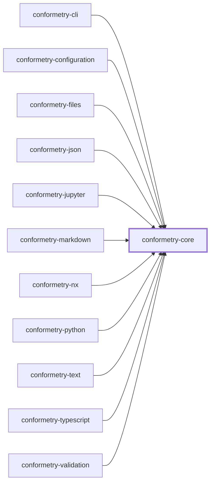
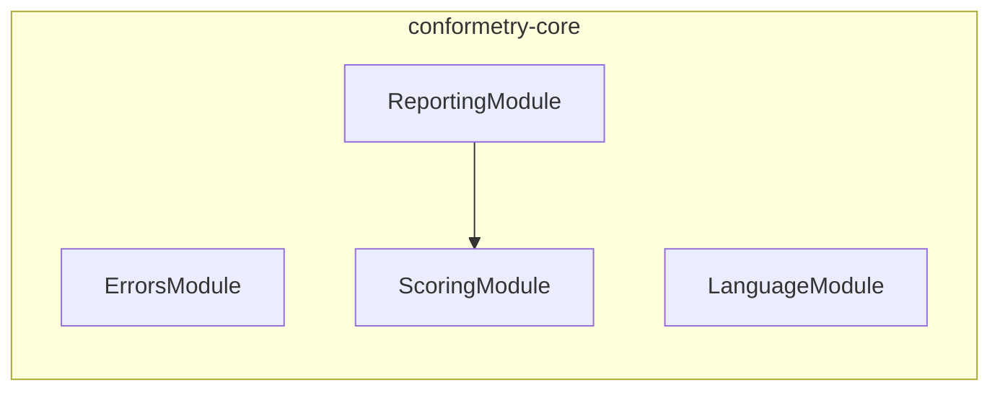

# 👔 Conformetry Core

The shared contract every other [Conformetry](../conformetry-cli/README.md)
package builds on. It is a leaf by design — it depends on nothing else in the
conformetry graph, so every other package can depend on it without a cycle.

```bash
npm install --save-dev @conformetry/core
```

## What it owns

| Module | Responsibility |
| ------ | -------------- |
| `errors` | The structured `ConformetryError` shape, plus builders and guards for it |
| `language` | The language validator contract and the shared execution envelope |
| `reporting` | Rendering conformance errors as readable, actionable text |
| `scoring` | The conformance arithmetic: what a finding weighs, what a weight pair scores |

"Language" here means a validator for one file format — TypeScript, JSON,
markdown, Python. The word "plugin" is reserved for the Nx plugin in
[`@conformetry/nx`](../conformetry-nx/README.md), and is deliberately not used
for these.

## Writing a language validator

A validator supplies a descriptor and a single-document comparison. Extension
filtering, grouping errors under their file, and assembling the result are
handled once by `LanguageService`, so a language package contains only its
comparison logic:

```ts
@Injectable()
export class ExampleValidatorService implements ConformetryLanguageValidator {
  public readonly descriptor = EXAMPLE_VALIDATOR_DESCRIPTOR;

  public validateDocument(
    document: PreparedValidationDocument,
  ): DocumentValidationResult {
    // compare document.renderedTemplate against document.instance
    return { errors, totalWeight };
  }
}
```

## Weight and score

A validator reports how much the template asked for alongside what it found.
`totalWeight` counts every requirement the comparison weighed — conforming ones
included, because leaving them out would score an instance only against the
parts of itself that are already wrong.

Each error may carry a `weight`, defaulting to 1. It says how many requirements
that one finding stands in for: a validator reports a missing class once,
however many members it held, so weighing the finding by its subtree is what
keeps deleting a class from costing the same as deleting an import. No per-kind
weight table is needed — a class is worth more because it contains more.

```text
score = (totalWeight - sum(error.weight ?? 1)) / totalWeight
```

`ScoringService` owns that arithmetic, including the two cases worth getting
right once: the default weight of a finding that declares none, and an empty
template whose denominator is zero and which therefore conforms perfectly.

[`@conformetry/validation`](../conformetry-validation/README.md) drives the
registered validators; they are never responsible for discovering files or
loading configuration.

## Structured errors

Errors carry the location on both sides — instance and template — along with
the expected value and a concrete `fix`. That last field is the point: reports
are meant to be actionable by whoever, or whatever, has to make the file
conform. Prefer populating `instanceLine`/`templateLine` (or `instancePath` for
document formats) over folding a location into the message.

## Project Graph

Where this project sits in the Nx project graph: what it depends on, and what depends on it. Regenerated by `nx run synchronization:synchronize --configuration=write`.

<!-- nx-project-graph-start -->



<!-- nx-project-graph-end -->

## Module Graph

The modules this project defines and the imports between them, regenerated by `nx run synchronization:synchronize --configuration=write`.

<!-- nestjs-module-graph-start -->



<!-- nestjs-module-graph-end -->

## Exports

`ErrorsService`, `LanguageService`, `ReportingService`, `ScoringService` and
their modules, plus the `ConformetryError`, `ConformetryLanguageValidator`,
`DocumentValidationResult`, `InstanceScore`, `LanguageValidatorDescriptor`,
`PreparedValidationDocument`, `ValidationFileResult`, and `WeightedFinding`
types.

## Test

```bash
nx run conformetry-core:vitest
```

## License

MIT — see [LICENSE](../../LICENSE).

<!-- CALL_STACKS_START -->

## 🔭 Callidescope

Call stacks traced through `conformetry-core`, deepest first. Each frame shows what it takes, what it returns, and what its documentation says.

| Measure | Value |
| --- | --- |
| Callables | 36 |
| Files | 19 |
| Calls traced | 31 |
| Call stacks | 0 |
| Deepest stack | 0 |
| Stacks through recursion | 0 |
| Unfollowable calls | 1 |

### Call stacks

None.

### Module spread

None.

### Possibly misplaced

None.
<!-- CALL_STACKS_END -->
