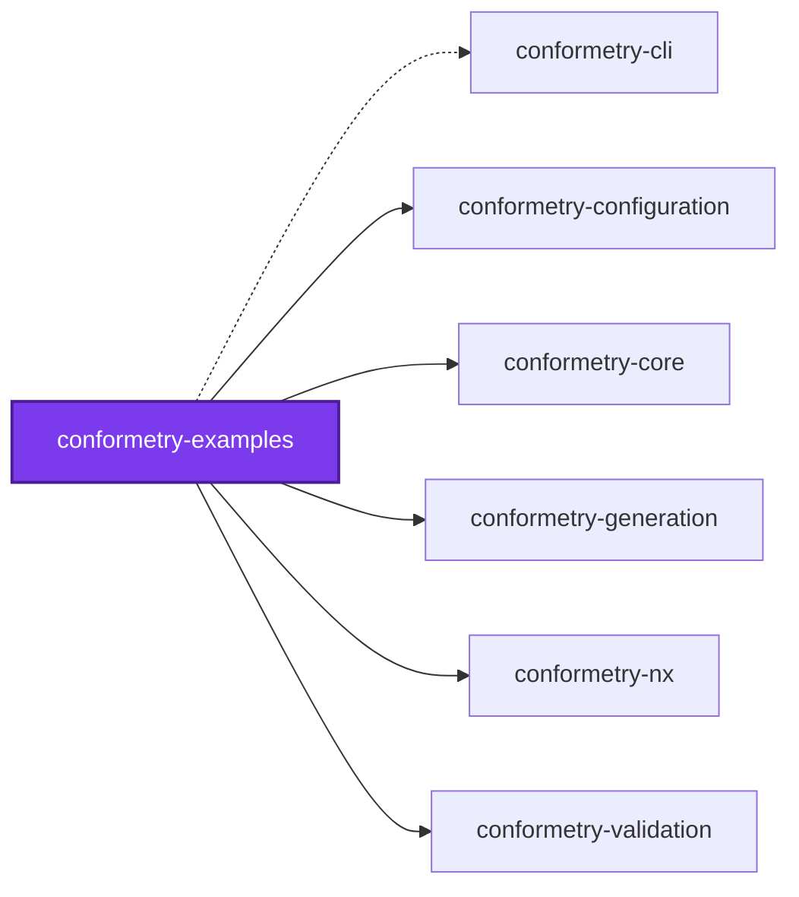

# 👔 Conformetry Examples

**Eleven runnable examples of [Conformetry](../conformetry-cli/README.md), and
the guides that read them.**

Conformetry's only worked example used to be a real workspace: this
repository's own `configuration/conformetry.config.ts` and its ten templates.
That is a poor introduction on both counts — too large to read through, and too
specific to copy. This package is the sandbox instead. Every example is
self-contained: its own configuration, its own template folder, its own
instances, and an Nx target that runs it. Nothing here requires reading anything
else here first.

```bash
pnpm exec nx run conformetry-examples:examples          # every example, gated on what its guide promises
pnpm exec nx run conformetry-examples:hello-template    # one example, and watch its output
```

Agents arriving from a conformance report should start at
[AGENTS.md](AGENTS.md), which maps "conformance reported X" to the example that
explains X.

## The examples

Read in this order for a walkthrough; jump straight in for an answer.

| Example | Answers |
| ------- | ------- |
| [hello-template](examples/hello-template/README.md) | What is the smallest thing a generator can be? |
| [case-variants](examples/case-variants/README.md) | What does a template get for free from a name, and how do I override it? |
| [structural-not-textual](examples/structural-not-textual/README.md) | What does the comparison actually weigh? |
| [drift-catalogue](examples/drift-catalogue/README.md) | What does every kind of finding look like, and how do I read a report? |
| [scoring-thresholds](examples/scoring-thresholds/README.md) | How do I adopt a template without migrating everything today? |
| [language-validators](examples/language-validators/README.md) | What gets compared in each file format? |
| [two-directions](examples/two-directions/README.md) | How do I ask what a path owes, or what a template governs? |
| [ambiguous-attribution](examples/ambiguous-attribution/README.md) | Why does one path list two templates? |
| [nx-host](examples/nx-host/README.md) | What does `@conformetry/nx` add over the command line? |
| [embedding](examples/embedding/README.md) | How do I drive conformetry from my own tool? |
| [failure-modes](examples/failure-modes/README.md) | What does conformetry refuse, and what does it let through? |

## Start to finish

### 1. Install

```bash
pnpm add --save-dev @conformetry/cli
```

Node.js 20 or newer. Validating Python or Jupyter instances additionally needs
`python3` on `PATH` — the Python validator compares through Python's own `ast`
module rather than reimplementing a parser.

In an Nx workspace, add [`@conformetry/nx`](../conformetry-nx/README.md) too;
[nx-host](examples/nx-host/README.md) covers what it adds and how to register
it.

### 2. Write a generator

A single `conformetry.config.ts` default-exports an array of generator
definitions. The smallest useful one names a template folder, the inputs it
substitutes, and where its output already lives:

```ts
import { type ConformetryConfiguration } from "@conformetry/configuration";

const conformetryConfiguration: ConformetryConfiguration = [
  {
    description: "The smallest generator there is: one template file",
    inputs: {
      name: { description: "Greeting name in kebab-case", type: "string" },
    },
    instances: [{ patterns: ["packages/*/src/greetings/*"] }],
    name: "hello",
    templatePath: "templates/hello",
  },
];

export default conformetryConfiguration;
```

`instances` is the field that makes validation possible. It says where this
generator's output already is, so validation knows what to check without being
told twice.

The template is an ordinary folder of ordinary files. Both file contents and
file **paths** are rendered with [mustache](https://mustache.github.io):

```text
templates/hello/
└── {{nameKebabCase}}/
    └── {{nameKebabCase}}.md
```

Every path in the configuration is resolved against the directory the command
runs in. This package's examples are documented as run from the workspace root,
so each one builds its paths from a single `EXAMPLE_PATH` constant.

Full reference: [`@conformetry/configuration`](../conformetry-configuration/README.md).

### 3. Scaffold from it

```bash
conformetry generate --generator hello --name world
```

A generator's own inputs are passed as flags. Unknown flags are accepted
deliberately — which inputs exist is not known until the generator is chosen —
which is also why the generator is selected with `--generator` and not `--name`.

Missing required inputs are prompted for when stdin is a TTY and `CI` is not
`true`. Otherwise the command fails rather than hanging.

Walk it: [hello-template](examples/hello-template/README.md),
then [case-variants](examples/case-variants/README.md).

### 4. Validate

```bash
conformetry validate
```

```text
All checked files conform.
```

Every instance the configured globs find is compared against the template it
was generated from — except that nothing recorded which template that was, so
attribution is inferred from how much of each template's structure the path
already has. Two templates can both have a claim; see
[ambiguous-attribution](examples/ambiguous-attribution/README.md).

### 5. Break something on purpose

This is the step most people skip, and it is the one that teaches the tool.
Delete an export, drop a section comment, rename a class, remove a file — then
run `validate` again.

[drift-catalogue](examples/drift-catalogue/README.md) has already done it for
you, once per kind of finding, and quotes the whole report.

What is _not_ a finding matters just as much: reformatting, added members, added
comments. [structural-not-textual](examples/structural-not-textual/README.md) is
that pair side by side.

### 6. Read the report

```text
Conformance scores:
  ✗ …/instances/renamed-class (widget) — 25/35 requirements met (71.4%), below threshold 100.0%
  Total — 173/193 requirements met (89.6%) across 6 instance(s), 5 below threshold

  6. file: renamed-class.service.ts — 5/15 requirements met (33.3%)
     Instance: …/instances/renamed-class/renamed-class.service.ts
     Template: …/templates/widget/{{nameKebabCase}}/{{nameKebabCase}}.service.ts

     1. Missing ClassDeclaration "RenamedClassService"
        Instance: Line 4, Column 1
        Template: Line 4, Column 1
        Weight  : 10 of the 15 requirements in this file
        Fix     : Add the missing ClassDeclaration "RenamedClassService" to the instance file. See the template for the expected structure.
```

Four habits cover it:

- **Read the fraction, not the percentage.** A percentage hides its own scale:
  `99.3%` reads the same whether one requirement of 151 went missing or thirty
  of four thousand did, and only the first is a five-minute fix.
- **Read the weight.** A finding that stands in for more than itself says so. A
  missing class carries every member it held.
- **Read both locations.** Every finding carries where the instance is wrong
  _and_ where the template says so.
- **Trust the `Fix` line.** Making the report actionable — by a person or an
  agent — is the point of the format.

### 7. Adopt a template incrementally

A new template makes every directory it claims instantly non-conforming, which
is why thresholds exist. Hold the directory still being migrated to `0.75` and
leave every other instance strict:

```ts
{
  name: "dossier",
  templatePath: "templates/dossier",
  threshold: 1,
  instances: [
    { patterns: ["packages/*/src/dossiers/*"] },
    { patterns: ["applications/legacy/src/dossiers/*"], threshold: 0.75 },
  ],
}
```

Findings print either way. A lowered threshold is permission to ship the drift,
not a reason to stop showing it.

[scoring-thresholds](examples/scoring-thresholds/README.md) runs exactly this,
including which of the three threshold levels wins.

## Keeping these guides honest

A guide whose commands have drifted is worse than no guide, so the examples are
**executed**, not merely committed.
[`testing/examples.integration.test.ts`](testing/examples.integration.test.ts)
reads the `examples/` directory, reads each example's Nx target out of
`project.json`, runs the commands that target runs, and asserts the exit code
and the text each guide quotes — zero for the passing examples, non-zero with
the expected findings for the deliberately drifted ones. It also generates
`hello-template` and `case-variants` into a temporary directory and asserts the
result is byte-identical to the committed instance, because an instance a reader
is told to copy has to be what the generator actually writes.

Adding an example directory without an expected outcome fails the suite rather
than going unchecked.

```bash
pnpm exec nx run conformetry-examples:vitest
```

## Conventions this package deliberately breaks

An examples package collides with gates written for ordinary source, and each
collision is answered rather than suppressed:

| Gate | Why it does not apply here | How that is expressed |
| ---- | -------------------------- | --------------------- |
| Test coverage 96% | Every example is either a configuration a reader copies or a script a reader runs, and the suite runs each as a child process. There is no imported library source to instrument. | `coverage.include: []` in `vitest.config.ts`, the same as [`conformetry-agents`](../conformetry-agents) |
| `knip` | Example code exists to be read, not imported. Unused files and exports are the norm. | An explicit workspace entry in `configuration/knip.config.ts` naming the example configurations as entry points |
| `jscpd` duplication | Eleven parallel examples are near-identical by design. | The fixture trees are excluded, exactly as `configuration/conformetry-templates/**` already is |
| ESLint, `oxfmt`, `tsc` | A template file holds mustache where an identifier belongs, and is not parseable as the language its extension names. | `examples/*/templates/**` and `examples/*/instances/**` are excluded; each example's `conformetry.config.ts` and `embed.ts` are **not**, and are linted and type-checked like any other source |
| Project structure | `examples/` is not one of the fixed set of project subfolders. | Declared in `configuration/codebase-structure.json` |
| `codometer` `sizeLimit` | Nothing here is built or shipped, so there is no compiled output to size. | A `codometer` target with no `PROJECT_LIMITS` entry, the same as the two `*-agents` packages |
| Project tags | `framework:nestjs` is accurate — the embedding example boots a real Nest container — and it is safe because every tag-scoped instance glob in `configuration/conformetry.config.ts` is under `src/modules/`, which this package does not have. Carrying the tag under a `src/modules/` layout would sweep the drifted fixtures into this repository's own conformance run. | `framework:nestjs`, `language:typescript`, `name:conformetry-examples`, `type:package` — and no `src/`, which is what keeps the tag free to be accurate |

## Layout

```text
conformetry-examples/
├── examples/
│   ├── tsconfig.json                   what lets Vite transform the NestJS instances
│   └── <name>/
│       ├── README.md                   the guide for this example
│       ├── conformetry.config.ts       its own generators and instance globs
│       ├── templates/                  what the generator renders
│       └── instances/                  what it rendered, or what drifted from it
└── testing/
    └── examples.integration.test.ts    every example, run and asserted

```

Every example is self-contained: its own configuration, its own template folder,
its own instances, and an Nx target that runs it. Nothing here requires reading
anything else here first.

This package has no `src/`, and that is what keeps `framework:nestjs` safe to
declare — see [the table above](#conventions-this-package-deliberately-breaks).

## Test

```bash
pnpm exec nx run conformetry-examples:vitest
```

## License

MIT — see [LICENSE](../../LICENSE).

## 🕸️ Codependix

Dependency graphs exported by [codependix](https://github.com/JimmyPaolini/codebase/tree/main/packages/codependix-cli), regenerated by `nx run codebase:codependix:write`.

### Nx Neighborhood

<!-- codependix:start name="codependix-nx" -->


_Dashed edges are dependencies Nx inferred from configuration rather than from code._
<!-- codependix:end name="codependix-nx" -->

### File Imports

<!-- codependix:start name="codependix-imports" -->
_This project has no internal file imports._
<!-- codependix:end name="codependix-imports" -->

<!-- CODE_STATISTICS_START -->

## ⏲️ Codometer

### Project


### TypeScript


### JavaScript


### Python


### JSON


### YAML


### TOML


### Shell


### SQL


### HCL


### CSS


### Conventions


### Jupyter


### Markdown


<!-- CODE_STATISTICS_END -->
