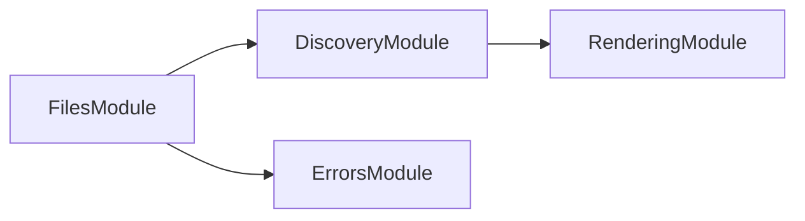

# 👔 Conformetry Files

Checks that every file a template declares actually exists, whatever its
extension. Part of the [Conformetry](../conformetry-cli/README.md) toolchain.

```bash
npm install --save-dev @conformetry/files
```

## Why it exists separately

This runs before any language validator, and is the only check that covers
_every_ template file. A language validator sees only documents whose extension
it claims, so files such as `.gitignore`, `.env.default`, and `pyproject.toml`
were previously never checked at all — a project could delete them and still
validate clean.

## Behavior

`FilesService.checkInstanceFiles` reports every file a matched instance's
template requires but the instance lacks. Missing directories are collapsed to
one finding each, so deleting a whole module reports the directory rather than
each of the twenty files inside it.

```ts
const fileResults = filesService.checkInstanceFiles({ instances });
```

[`@conformetry/validation`](../conformetry-validation/README.md) calls this
first in every run; you rarely call it yourself.

## Module Graph

The modules this project defines and the imports between them, regenerated by `nx run synchronization:synchronize --configuration=write`.

<!-- nestjs-module-graph-start -->



<!-- nestjs-module-graph-end -->

## Exports

`FilesService` and `FilesModule`.

## Test

```bash
nx run conformetry-files:vitest
```

## License

MIT — see [LICENSE](../../LICENSE).
