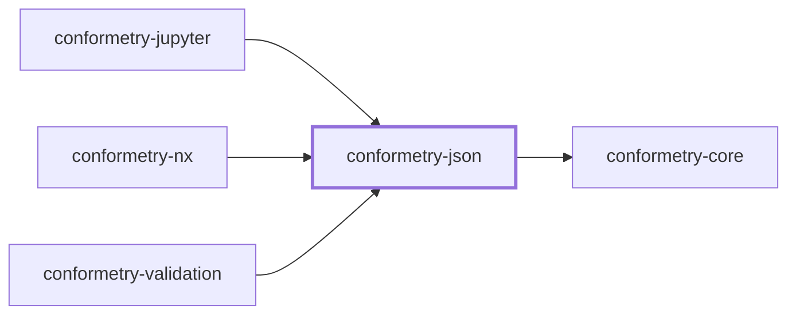
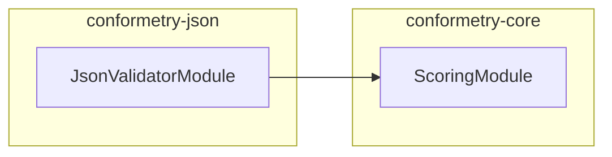

# 👔 Conformetry JSON

The JSON and JSONC validator for [Conformetry](../conformetry-cli/README.md).
Claims `.json` and `.jsonc`.

```bash
npm install --save-dev @conformetry/json
```

## What it compares

Every key and value the template declares must be present in the instance. Key
order does not matter, and an instance may add keys the template does not
mention — the template is a lower bound, not an exact specification. That is
what lets one `package.json` template govern projects with different
dependencies.

Findings carry a JSON path rather than a line number, so a difference deep in a
nested object is addressable.

Parsing goes through
[`jsonc-parser`](https://github.com/microsoft/node-jsonc-parser), so a
`tsconfig.json` with comments is read the same way TypeScript reads it.

## Project Graph

Where this project sits in the Nx project graph: what it depends on, and what depends on it. Regenerated by `nx run synchronization:synchronize --configuration=write`.

<!-- nx-project-graph-start -->



<!-- nx-project-graph-end -->

## Module Graph

The modules this project defines and the imports between them, regenerated by `nx run synchronization:synchronize --configuration=write`.

<!-- nestjs-module-graph-start -->



<!-- nestjs-module-graph-end -->

## Exports

`JsonValidatorService`, `JsonValidatorModule`, `JsonComparisonService`, and the
`JsonValue` type. [`@conformetry/jupyter`](../conformetry-jupyter/README.md)
reuses `JsonComparisonService` for the notebook envelope.

## Test

```bash
nx run conformetry-json:vitest
```

## License

MIT — see [LICENSE](../../LICENSE).

<!-- CALL_STACKS_START -->

## 🔭 Callidescope

Call stacks traced through `conformetry-json`, deepest first. Each frame shows what it takes, what it returns, and what its documentation says.

| Measure | Value |
| --- | --- |
| Callables | 23 |
| Files | 8 |
| Calls traced | 37 |
| Call stacks | 1 |
| Deepest stack | 12 |
| Stacks through recursion | 1 |
| Unfollowable calls | 0 |

### Call stacks

**1. `JsonValidatorService.validateDocument`** — depth 12 · orphan-root

```text
🚀 JsonValidatorService.validateDocument(document: PreparedValidationDocument): DocumentValidationResult [packages/conformetry-json/src/modules/json-validator/json-validator.service.ts:39]
   ↳ Reports every key or value the template requires and the instance lacks.
  └─> JsonComparisonService.compareArrayItem(…): JsonComparison (cycle) [packages/conformetry-json/src/modules/json-validator/json-comparison.service.ts:79]
     ↳ Matches one required array entry against the instance array.
    └─> JsonComparisonService.map(…)(instanceItem: JsonValue, index: number): JsonComparison (cycle) [packages/conformetry-json/src/modules/json-validator/json-comparison.service.ts:122]
      └─> JsonComparisonService.compare(args: CompareJsonArguments): JsonComparison (cycle) [packages/conformetry-json/src/modules/json-validator/json-comparison.service.ts:268]
         ↳ Compares a template value against an instance value, returning every way the instance fails to contain what the…
        └─> JsonComparisonService.compareArrays(…): JsonComparison (cycle) [packages/conformetry-json/src/modules/json-validator/json-comparison.service.ts:141]
           ↳ Compares two arrays.
          └─> JsonComparisonService.map(…)(templateItem: JsonValue): JsonComparison (cycle) [packages/conformetry-json/src/modules/json-validator/json-comparison.service.ts:148]
            └─> JsonComparisonService.compareObjects(…): JsonComparison (cycle) [packages/conformetry-json/src/modules/json-validator/json-comparison.service.ts:155]
               ↳ Compares two objects, requiring every template key to be present.
              └─> JsonComparisonService.map(…)([key, templateValue]: [string, JsonValue]): JsonComparison (cycle) [packages/conformetry-json/src/modules/json-validator/json-comparison.service.ts:164]
                └─> JsonComparisonService.countNodes(value: JsonValue): number (cycle) [packages/conformetry-json/src/modules/json-validator/json-comparison.service.ts:207]
                   ↳ Counts a JSON value and every value nested inside it.
                  └─> JsonComparisonService.reduce(…)(total: number, item: JsonValue): number (cycle) [packages/conformetry-json/src/modules/json-validator/json-comparison.service.ts:209]
                    └─> JsonComparisonService.reduce(…)(total: number, nested: JsonValue): number (cycle) [packages/conformetry-json/src/modules/json-validator/json-comparison.service.ts:215]
                      └─> JsonComparisonService.isJsonObject(value: JsonValue): value is Record<string, JsonValue> [packages/conformetry-json/src/modules/json-validator/json-comparison.service.ts:235]
                         ↳ Returns whether a value is a plain JSON object.
```

### Module spread

None.

### Possibly misplaced

None.
<!-- CALL_STACKS_END -->
