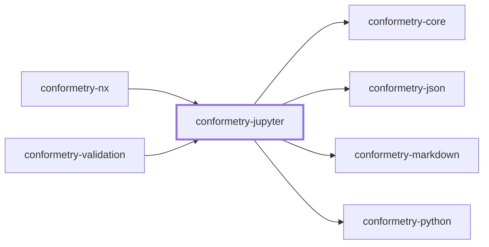
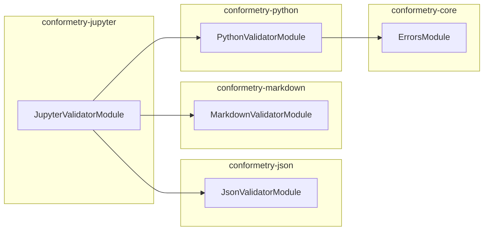

# 👔 Conformetry Jupyter

The Jupyter notebook validator for
[Conformetry](../conformetry-cli/README.md). Claims `.ipynb`.

```bash
npm install --save-dev @conformetry/jupyter
```

## Composition, not a fourth parser

A notebook is three formats at once, so this validator composes the three that
already exist rather than reimplementing any of them:

| Part | Validated by |
| ---- | ------------ |
| The envelope — `metadata`, `nbformat`, `nbformat_minor` | [`@conformetry/json`](../conformetry-json/README.md) |
| Markdown cells | [`@conformetry/markdown`](../conformetry-markdown/README.md) |
| Code cells | [`@conformetry/python`](../conformetry-python/README.md)'s bridge |

Validating a code cell through Python's own parser is what lets a notebook be
re-run and reformatted without failing.

`cells` is deliberately excluded from the structural pass — cell contents are
covered by the markdown and Python validators, and a raw JSON diff of a `cells`
array would be unreadable.

Because code cells are validated through Python, **`python3` must be on
`PATH`** to validate notebooks.

## Project Graph

Where this project sits in the Nx project graph: what it depends on, and what depends on it. Regenerated by `nx run synchronization:synchronize --configuration=write`.

<!-- nx-project-graph-start -->



<!-- nx-project-graph-end -->

## Module Graph

The modules this project defines and the imports between them, regenerated by `nx run synchronization:synchronize --configuration=write`.

<!-- nestjs-module-graph-start -->



<!-- nestjs-module-graph-end -->

## Exports

`JupyterValidatorService`, `JupyterValidatorModule`, and
`JupyterNotebookService`.

## Test

```bash
nx run conformetry-jupyter:vitest
```

## License

MIT — see [LICENSE](../../LICENSE).
