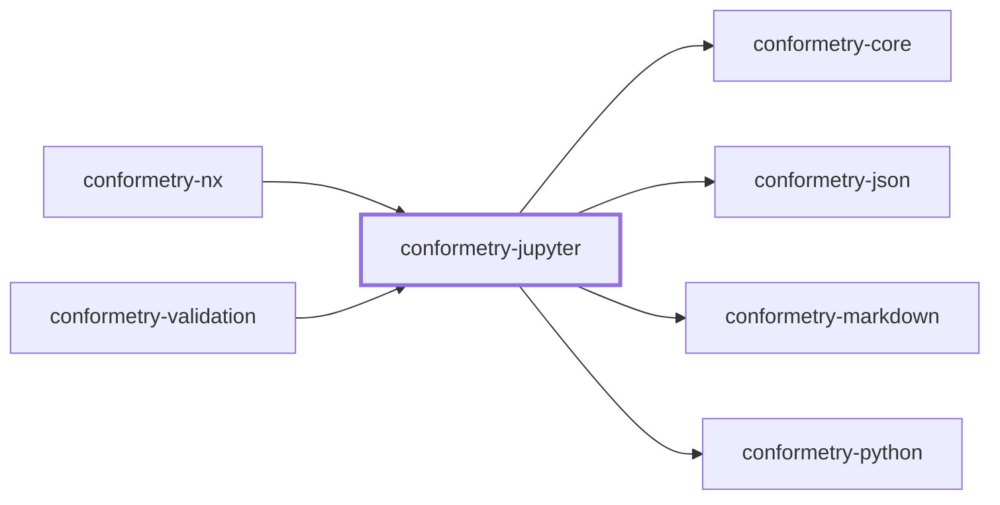
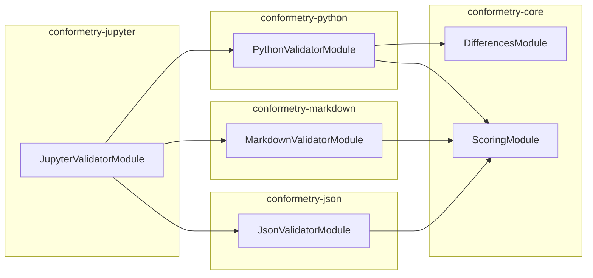

# 👔 Conformetry Jupyter

The Jupyter notebook validator for
[Conformetry](../conformetry-cli/README.md). Claims `.ipynb`.

```bash
npm install --save-dev @conformetry/jupyter
```

## Composition, not a fourth parser

A notebook is three formats at once, so this validator composes the three that
already exist rather than reimplementing any of them:

| Part | Validated by |
| ---- | ------------ |
| The envelope — `metadata`, `nbformat`, `nbformat_minor` | [`@conformetry/json`](../conformetry-json/README.md) |
| Markdown cells | [`@conformetry/markdown`](../conformetry-markdown/README.md) |
| Code cells | [`@conformetry/python`](../conformetry-python/README.md)'s bridge |

Validating a code cell through Python's own parser is what lets a notebook be
re-run and reformatted without failing.

`cells` is deliberately excluded from the structural pass — cell contents are
covered by the markdown and Python validators, and a raw JSON diff of a `cells`
array would be unreadable.

Because code cells are validated through Python, **`python3` must be on
`PATH`** to validate notebooks.

## Project Graph

Where this project sits in the Nx project graph: what it depends on, and what depends on it. Regenerated by `nx run synchronization:synchronize --configuration=write`.

<!-- nx-project-graph-start -->



<!-- nx-project-graph-end -->

## Module Graph

The modules this project defines and the imports between them, regenerated by `nx run synchronization:synchronize --configuration=write`.

<!-- nestjs-module-graph-start -->



<!-- nestjs-module-graph-end -->

## Exports

`JupyterValidatorService`, `JupyterValidatorModule`, and
`JupyterNotebookService`.

## Test

```bash
nx run conformetry-jupyter:vitest
```

## License

MIT — see [LICENSE](../../LICENSE).

<!-- CALL_STACKS_START -->

## 🔭 Callidescope

Call stacks traced through `conformetry-jupyter`, deepest first. Each frame shows what it takes, what it returns, and what its documentation says.

| Measure | Value |
| --- | --- |
| Callables | 22 |
| Files | 8 |
| Calls traced | 28 |
| Call stacks | 1 |
| Deepest stack | 13 |
| Stacks through recursion | 1 |
| Unfollowable calls | 0 |

### Call stacks

**1. `JupyterValidatorService.validateDocument`** — depth 13 · orphan-root

```text
🚀 JupyterValidatorService.validateDocument(document: PreparedValidationDocument): DocumentValidationResult [packages/conformetry-jupyter/src/modules/jupyter-validator/jupyter-validator.service.ts:152]
   ↳ Reports every notebook difference: envelope, missing cells, cell contents.
  └─> JupyterValidatorService.map(…)(…): { error: { differenceType: "code"; expected: string; fix: string; language: "python"; message: string; weight: number; }; weight: number; } [packages/conformetry-jupyter/src/modules/jupyter-validator/jupyter-validator.service.ts:172]
    └─> JupyterValidatorService.weighMissingCell(args: { cell: PairedCells; document: PreparedValidationDocument; }): number [packages/conformetry-jupyter/src/modules/jupyter-validator/jupyter-validator.service.ts:139]
       ↳ Weighs a cell the notebook does not have.
      └─> JupyterValidatorService.validateCell(…): DocumentValidationResult [packages/conformetry-jupyter/src/modules/jupyter-validator/jupyter-validator.service.ts:89]
         ↳ Validates one paired cell with the validator matching its kind.
        └─> MarkdownValidatorService.validateDocument(document: PreparedValidationDocument): DocumentValidationResult [packages/conformetry-markdown/src/modules/markdown-validator/markdown-validator.service.ts:48]
           ↳ Reports every markdown structure the template requires and the file lacks.
          └─> MarkdownTreeService.compareChildren(args: CompareChildrenArguments): CompareChildrenResult (cycle) [packages/conformetry-markdown/src/modules/markdown-validator/markdown-tree.service.ts:146]
             ↳ Compares one level of two trees, descending into containers.
            └─> MarkdownTreeService.compareContainer(args: CompareNodeArguments): CompareNodeResult (cycle) [packages/conformetry-markdown/src/modules/markdown-validator/markdown-tree.service.ts:64]
               ↳ Matches a container node, then descends into it.
              └─> MarkdownTreeService.map(…)(…): { differences: MarkdownComparisonError[]; lastMatchedNode: MarkdownNode; totalWeight: number; } (cycle) [packages/conformetry-markdown/src/modules/markdown-validator/markdown-tree.service.ts:90]
                └─> MarkdownTreeService.compareLeaf(args: CompareNodeArguments): CompareNodeResult [packages/conformetry-markdown/src/modules/markdown-validator/markdown-tree.service.ts:114]
                   ↳ Matches a leaf node on its own identity, without descending.
                  └─> MarkdownTreeService.findCandidates(args: CompareNodeArguments): MarkdownNode[] [packages/conformetry-markdown/src/modules/markdown-validator/markdown-tree.service.ts:134]
                     ↳ Finds every instance sibling satisfying the template node.
                    └─> MarkdownTreeService.filter(…)(instanceNode: MarkdownNode): boolean [packages/conformetry-markdown/src/modules/markdown-validator/markdown-tree.service.ts:135]
                      └─> MarkdownNodesService.matches(args: { instanceNode: MarkdownNode; templateNode: MarkdownNode; }): boolean [packages/conformetry-markdown/src/modules/markdown-validator/markdown-nodes.service.ts:140]
                         ↳ Returns whether an instance node satisfies a template node.
                        └─> MarkdownNodesService.readText(node: MarkdownNode): string [packages/conformetry-markdown/src/modules/markdown-validator/markdown-nodes.service.ts:163]
                           ↳ Reads a node's rendered plain text.
```

### Module spread

None.

### Possibly misplaced

None.
<!-- CALL_STACKS_END -->
