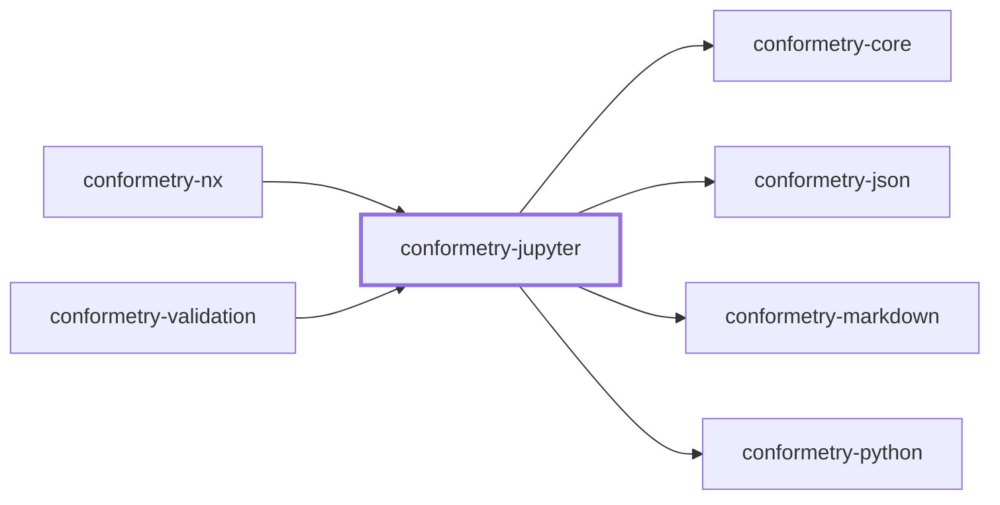
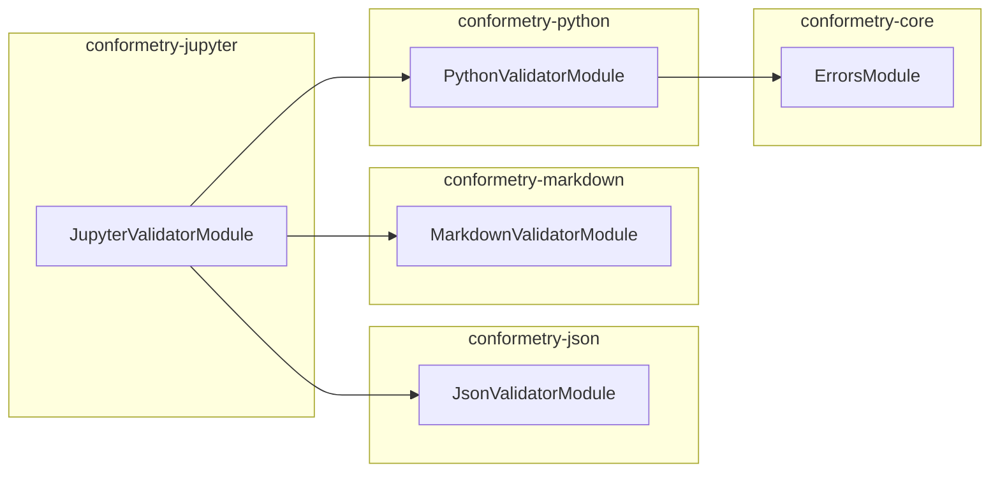

# 👔 Conformetry Jupyter

The Jupyter notebook validator for
[Conformetry](../conformetry-cli/README.md). Claims `.ipynb`.

```bash
npm install --save-dev @conformetry/jupyter
```

## Composition, not a fourth parser

A notebook is three formats at once, so this validator composes the three that
already exist rather than reimplementing any of them:

| Part | Validated by |
| ---- | ------------ |
| The envelope — `metadata`, `nbformat`, `nbformat_minor` | [`@conformetry/json`](../conformetry-json/README.md) |
| Markdown cells | [`@conformetry/markdown`](../conformetry-markdown/README.md) |
| Code cells | [`@conformetry/python`](../conformetry-python/README.md)'s bridge |

Validating a code cell through Python's own parser is what lets a notebook be
re-run and reformatted without failing.

`cells` is deliberately excluded from the structural pass — cell contents are
covered by the markdown and Python validators, and a raw JSON diff of a `cells`
array would be unreadable.

Because code cells are validated through Python, **`python3` must be on
`PATH`** to validate notebooks.

## Project Graph

Where this project sits in the Nx project graph: what it depends on, and what depends on it. Regenerated by `nx run synchronization:synchronize --configuration=write`.

<!-- nx-project-graph-start -->



<!-- nx-project-graph-end -->

## Module Graph

The modules this project defines and the imports between them, regenerated by `nx run synchronization:synchronize --configuration=write`.

<!-- nestjs-module-graph-start -->



<!-- nestjs-module-graph-end -->

## Exports

`JupyterValidatorService`, `JupyterValidatorModule`, and
`JupyterNotebookService`.

## Test

```bash
nx run conformetry-jupyter:vitest
```

## License

MIT — see [LICENSE](../../LICENSE).

<!-- CALL_STACKS_START -->

## 🔭 Callidescope

Call stacks traced through `conformetry-jupyter`, deepest first. Each frame shows what it takes, what it returns, and what its documentation says.

| Measure | Value |
| --- | --- |
| Callables | 16 |
| Files | 8 |
| Calls traced | 20 |
| Call stacks | 2 |
| Deepest stack | 10 |
| Stacks through recursion | 2 |
| Unfollowable calls | 0 |

### Call stacks

**1. `JupyterValidatorService.validateCell`** — depth 10 · orphan-root

```text
🚀 JupyterValidatorService.validateCell(…): ConformetryError[] [packages/conformetry-jupyter/src/modules/jupyter-validator/jupyter-validator.service.ts:88]
   ↳ Validates one paired cell with the validator matching its kind.
  └─> MarkdownValidatorService.validateDocument(document: PreparedValidationDocument): ConformetryError[] [packages/conformetry-markdown/src/modules/markdown-validator/markdown-validator.service.ts:47]
     ↳ Reports every markdown structure the template requires and the file lacks.
    └─> MarkdownTreeService.compareChildren(args: CompareChildrenArguments): MarkdownComparisonError[] (cycle) [packages/conformetry-markdown/src/modules/markdown-validator/markdown-tree.service.ts:115]
       ↳ Compares one level of two trees, descending into containers.
      └─> MarkdownTreeService.compareContainer(args: CompareNodeArguments): CompareNodeResult (cycle) [packages/conformetry-markdown/src/modules/markdown-validator/markdown-tree.service.ts:55]
         ↳ Matches a container node, then descends into it.
        └─> MarkdownTreeService.map(…)(…): { errors: MarkdownComparisonError[]; lastMatchedNode: MarkdownNode; } (cycle) [packages/conformetry-markdown/src/modules/markdown-validator/markdown-tree.service.ts:74]
          └─> MarkdownTreeService.compareLeaf(args: CompareNodeArguments): CompareNodeResult [packages/conformetry-markdown/src/modules/markdown-validator/markdown-tree.service.ts:91]
             ↳ Matches a leaf node on its own identity, without descending.
            └─> MarkdownTreeService.findCandidates(args: CompareNodeArguments): MarkdownNode[] [packages/conformetry-markdown/src/modules/markdown-validator/markdown-tree.service.ts:103]
               ↳ Finds every instance sibling satisfying the template node.
              └─> MarkdownTreeService.filter(…)(instanceNode: MarkdownNode): boolean [packages/conformetry-markdown/src/modules/markdown-validator/markdown-tree.service.ts:104]
                └─> MarkdownNodesService.matches(args: { instanceNode: MarkdownNode; templateNode: MarkdownNode; }): boolean [packages/conformetry-markdown/src/modules/markdown-validator/markdown-nodes.service.ts:117]
                   ↳ Returns whether an instance node satisfies a template node.
                  └─> MarkdownNodesService.readText(node: MarkdownNode): string [packages/conformetry-markdown/src/modules/markdown-validator/markdown-nodes.service.ts:140]
                     ↳ Reads a node's rendered plain text.
```

**2. `JupyterValidatorService.validateDocument`** — depth 9 · orphan-root

```text
🚀 JupyterValidatorService.validateDocument(document: PreparedValidationDocument): ConformetryError[] [packages/conformetry-jupyter/src/modules/jupyter-validator/jupyter-validator.service.ts:122]
   ↳ Reports every notebook difference: envelope, missing cells, cell contents.
  └─> JsonComparisonService.compareArrays(…): ConformetryError[] (cycle) [packages/conformetry-json/src/modules/json-validator/json-comparison.service.ts:63]
     ↳ Compares two arrays.
    └─> JsonComparisonService.flatMap(…)(this: undefined, templateItem: JsonValue): ConformetryError[] (cycle) [packages/conformetry-json/src/modules/json-validator/json-comparison.service.ts:69]
      └─> JsonComparisonService.map(…)(instanceItem: JsonValue, index: number): ConformetryError[] (cycle) [packages/conformetry-json/src/modules/json-validator/json-comparison.service.ts:98]
        └─> JsonComparisonService.compare(args: CompareJsonArguments): ConformetryError[] (cycle) [packages/conformetry-json/src/modules/json-validator/json-comparison.service.ts:180]
           ↳ Compares a template value against an instance value, returning every way the instance fails to contain what the…
          └─> JsonComparisonService.compareObjects(…): ConformetryError[] (cycle) [packages/conformetry-json/src/modules/json-validator/json-comparison.service.ts:111]
             ↳ Compares two objects, requiring every template key to be present.
            └─> JsonComparisonService.flatMap(…)(this: undefined, key: string): ConformetryError[] (cycle) [packages/conformetry-json/src/modules/json-validator/json-comparison.service.ts:117]
              └─> JsonComparisonService.formatPath(pathSegments: JsonPathSegment[]): string [packages/conformetry-json/src/modules/json-validator/json-comparison.service.ts:143]
                 ↳ Renders a path as `scripts.build[0]` for error messages.
                └─> JsonComparisonService.reduce(…)(pathValue: string, segment: JsonPathSegment): string [packages/conformetry-json/src/modules/json-validator/json-comparison.service.ts:144]
```

### Module spread

None.

### Possibly misplaced

None.
<!-- CALL_STACKS_END -->
