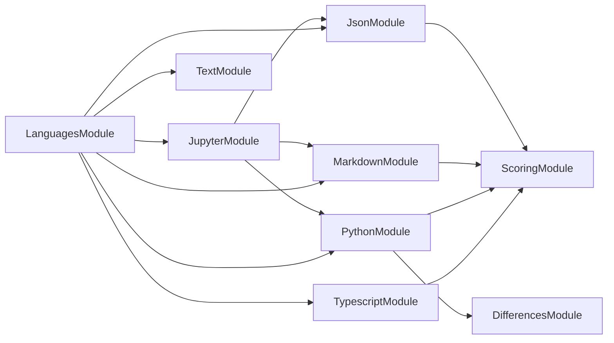

# 👔 Conformetry Languages

Every Language [Conformetry](../conformetry-cli/README.md) compares files with,
behind one import — plus the resolution that decides which of them a run needs.

```bash
npm install --save-dev @conformetry/languages
```

## The Languages

A **Language** is the comparison engine for one family of file types. Each is a
module of its own, exposing a NestJS module and a service, and each declares the
extensions it claims.

| Module | Claims | What it compares |
| ------ | ------ | ---------------- |
| `json` | `.json`, `.jsonc` | Every key and value the template declares, addressed by JSON path rather than line number |
| `jupyter` | `.ipynb` | A notebook's envelope, markdown cells, and code cells, by delegating to `json`, `markdown`, and `python` |
| `markdown` | `.md` | The document's syntax tree — headings, lists, links — rather than its rendered text |
| `python` | `.py` | Python's own abstract syntax tree, through the interpreter shipped in `src/python/` |
| `text` | `.txt` | Every template line, duplicate-aware and order-independent |
| `typescript` | `.ts`, `.tsx` | Declarations, signatures, and comments, through the TypeScript compiler |

Every one of them is a lower bound rather than an exact specification: an
instance may add what its template does not mention.

## Resolution and the Fallback

`LanguagesService` takes the extensions a run's templates declare and returns
the Languages that claim them, so a repository of JSON never reports a
TypeScript result it had nothing to say about.

An extension **no** Language claims is not skipped. It is routed to the
**Fallback** — the text Language, widened to also claim those extensions, and
compared line by line. That is what stops a `.toml` or a `.cfg` in a template
from going unchecked, and it is why the text Language is a floor under every
run rather than one option among six.

Registering a Language is a single step: add it to `claimingLanguages` in
`LanguagesService`. Its own descriptor says which extensions it claims, so
there is no second list to keep in step.

## The Python bridge

`python/` holds a small Python package, and `PythonBridgeService` spawns
`python3` against it, because Python's syntax tree is only available from
Python. The path is resolved from the service's own module location rather than
from a working directory, so the bridge is found the same way whether
conformetry runs from a checkout or from `node_modules`.

The interpreter is spawned inside a method, never at module scope, so importing
this package on a machine without `python3` is harmless. A missing interpreter
surfaces as a reported Difference on the `.py` files — visible, rather than
mistaken for conformance.

## Exports

`LanguagesModule` and `LanguagesService`, each Language's module and service,
and the helper services the Languages are built from —
`JsonComparisonService`, `JupyterNotebookService`, `MarkdownNodesService`,
`MarkdownTreeService`, `PythonBridgeService`, `TypescriptCommentsService`,
`TypescriptNodesService`, and `TypescriptTreeService`.

A host almost always wants `LanguagesModule`, which imports and re-exports all
six.

## Test

```bash
nx run conformetry-languages:vitest
```

## License

MIT — see [LICENSE](../../LICENSE).

## 👔 Conformetry

This project was generated from the [nestjs-service-project](../../configuration/conformetry-templates/nestjs-service-project) conformetry template.

<!-- CALL_STACKS_START -->

## 🔭 Callidescope

Call stacks traced through `packages/conformetry-languages`, deepest first. Each frame shows what it takes, what it returns, and what its documentation says.

| Measure | Value |
| --- | --- |
| Callables | 143 |
| Files | 41 |
| Calls traced | 190 |
| Call stacks | 14 |
| Deepest stack | 13 |
| Stacks through recursion | 3 |
| Unfollowable calls | 0 |

### Limits

What this project is judged against, as declared in its own `callidescope.config.ts`.

| Limit | Value |
| --- | --- |
| `maximumDepth` | 13 |
| `maximumBreadth` | 11 |

### Call stacks (depth)

**1. `JupyterService.validateDocument`** — depth 13 · orphan-root

```text
🚀 JupyterService.validateDocument(document: PreparedValidationDocument): DocumentValidationResult [packages/conformetry-languages/src/modules/jupyter/jupyter.service.ts:153]
   ↳ Reports every notebook difference: envelope, missing cells, cell contents.
  └─> JupyterService.map(…)(…): { error: { differenceType: "code"; expected: string; fix: string; language: "python"; message: string; weight: number; }; weight: number; } [packages/conformetry-languages/src/modules/jupyter/jupyter.service.ts:173]
    └─> JupyterService.weighMissingCell(args: { cell: PairedCells; document: PreparedValidationDocument; }): number [packages/conformetry-languages/src/modules/jupyter/jupyter.service.ts:140]
       ↳ Weighs a cell the notebook does not have.
      └─> JupyterService.validateCell(…): DocumentValidationResult [packages/conformetry-languages/src/modules/jupyter/jupyter.service.ts:90]
         ↳ Validates one paired cell with the validator matching its kind.
        └─> MarkdownService.validateDocument(document: PreparedValidationDocument): DocumentValidationResult [packages/conformetry-languages/src/modules/markdown/markdown.service.ts:48]
           ↳ Reports every markdown structure the template requires and the file lacks.
          └─> MarkdownTreeService.compareContainer(args: CompareNodeArguments): CompareNodeResult (cycle) [packages/conformetry-languages/src/modules/markdown/markdown-tree.service.ts:64]
             ↳ Matches a container node, then descends into it.
            └─> MarkdownTreeService.map(…)(…): { differences: MarkdownComparisonError[]; lastMatchedNode: MarkdownNode; totalWeight: number; } (cycle) [packages/conformetry-languages/src/modules/markdown/markdown-tree.service.ts:90]
              └─> MarkdownTreeService.compareChildren(args: CompareChildrenArguments): CompareChildrenResult (cycle) [packages/conformetry-languages/src/modules/markdown/markdown-tree.service.ts:146]
                 ↳ Compares one level of two trees, descending into containers.
                └─> MarkdownTreeService.compareLeaf(args: CompareNodeArguments): CompareNodeResult [packages/conformetry-languages/src/modules/markdown/markdown-tree.service.ts:114]
                   ↳ Matches a leaf node on its own identity, without descending.
                  └─> MarkdownTreeService.findCandidates(args: CompareNodeArguments): MarkdownNode[] [packages/conformetry-languages/src/modules/markdown/markdown-tree.service.ts:134]
                     ↳ Finds every instance sibling satisfying the template node.
                    └─> MarkdownTreeService.filter(…)(instanceNode: MarkdownNode): boolean [packages/conformetry-languages/src/modules/markdown/markdown-tree.service.ts:135]
                      └─> MarkdownNodesService.matches(args: { instanceNode: MarkdownNode; templateNode: MarkdownNode; }): boolean [packages/conformetry-languages/src/modules/markdown/markdown-nodes.service.ts:140]
                         ↳ Returns whether an instance node satisfies a template node.
                        └─> MarkdownNodesService.readText(node: MarkdownNode): string [packages/conformetry-languages/src/modules/markdown/markdown-nodes.service.ts:163]
                           ↳ Reads a node's rendered plain text.
```

**2. `JsonService.validateDocument`** — depth 12 · orphan-root

```text
🚀 JsonService.validateDocument(document: PreparedValidationDocument): DocumentValidationResult [packages/conformetry-languages/src/modules/json/json.service.ts:39]
   ↳ Reports every key or value the template requires and the instance lacks.
  └─> JsonComparisonService.compareArrayItem(…): JsonComparison (cycle) [packages/conformetry-languages/src/modules/json/json-comparison.service.ts:79]
     ↳ Matches one required array entry against the instance array.
    └─> JsonComparisonService.map(…)(instanceItem: JsonValue, index: number): JsonComparison (cycle) [packages/conformetry-languages/src/modules/json/json-comparison.service.ts:122]
      └─> JsonComparisonService.compare(args: CompareJsonArguments): JsonComparison (cycle) [packages/conformetry-languages/src/modules/json/json-comparison.service.ts:268]
         ↳ Compares a template value against an instance value, returning every way the instance fails to contain what the…
        └─> JsonComparisonService.compareArrays(…): JsonComparison (cycle) [packages/conformetry-languages/src/modules/json/json-comparison.service.ts:141]
           ↳ Compares two arrays.
          └─> JsonComparisonService.map(…)(templateItem: JsonValue): JsonComparison (cycle) [packages/conformetry-languages/src/modules/json/json-comparison.service.ts:148]
            └─> JsonComparisonService.compareObjects(…): JsonComparison (cycle) [packages/conformetry-languages/src/modules/json/json-comparison.service.ts:155]
               ↳ Compares two objects, requiring every template key to be present.
              └─> JsonComparisonService.map(…)([key, templateValue]: [string, JsonValue]): JsonComparison (cycle) [packages/conformetry-languages/src/modules/json/json-comparison.service.ts:164]
                └─> JsonComparisonService.countNodes(value: JsonValue): number (cycle) [packages/conformetry-languages/src/modules/json/json-comparison.service.ts:207]
                   ↳ Counts a JSON value and every value nested inside it.
                  └─> JsonComparisonService.reduce(…)(total: number, item: JsonValue): number (cycle) [packages/conformetry-languages/src/modules/json/json-comparison.service.ts:209]
                    └─> JsonComparisonService.reduce(…)(total: number, nested: JsonValue): number (cycle) [packages/conformetry-languages/src/modules/json/json-comparison.service.ts:215]
                      └─> JsonComparisonService.isJsonObject(value: JsonValue): value is Record<string, JsonValue> [packages/conformetry-languages/src/modules/json/json-comparison.service.ts:235]
                         ↳ Returns whether a value is a plain JSON object.
```

**3. `TypescriptService.validateDocument`** — depth 12 · orphan-root

```text
🚀 TypescriptService.validateDocument(document: PreparedValidationDocument): DocumentValidationResult [packages/conformetry-languages/src/modules/typescript/typescript.service.ts:164]
   ↳ Reports every declaration and comment the template requires.
  └─> TypescriptService.validateStructure(…): DocumentValidationResult [packages/conformetry-languages/src/modules/typescript/typescript.service.ts:107]
     ↳ Compares the syntax trees and describes each missing declaration.
    └─> TypescriptTreeService.compareBestCandidate(args: { candidates: Node[]; templateChild: Node; }): TreeComparison (cycle) [packages/conformetry-languages/src/modules/typescript/typescript-tree.service.ts:67]
       ↳ Descends into whichever candidate explains the template best.
      └─> TypescriptTreeService.map(…)(candidate: Node): TreeComparison (cycle) [packages/conformetry-languages/src/modules/typescript/typescript-tree.service.ts:72]
        └─> TypescriptTreeService.compareTree(args: CompareTreeArguments): TreeComparison (cycle) [packages/conformetry-languages/src/modules/typescript/typescript-tree.service.ts:126]
           ↳ Compares one level of two trees, descending into every match.
          └─> TypescriptTreeService.map(…)(templateChild: Node): TreeComparison (cycle) [packages/conformetry-languages/src/modules/typescript/typescript-tree.service.ts:133]
            └─> TypescriptTreeService.compareChild(…): TreeComparison (cycle) [packages/conformetry-languages/src/modules/typescript/typescript-tree.service.ts:87]
               ↳ Matches one template child against the instance's children.
              └─> TypescriptTreeService.buildError(…): TypescriptComparisonError [packages/conformetry-languages/src/modules/typescript/typescript-tree.service.ts:42]
                 ↳ Describes a template node with no instance counterpart.
                └─> TypescriptNodesService.countSubtree(node: Node): number (cycle) [packages/conformetry-languages/src/modules/typescript/typescript-nodes.service.ts:176]
                   ↳ Counts a node and everything beneath it.
                  └─> TypescriptNodesService.reduce(…)(total: number, child: Node): number (cycle) [packages/conformetry-languages/src/modules/typescript/typescript-nodes.service.ts:177]
                    └─> TypescriptNodesService.readChildren(node: Node): Node[] [packages/conformetry-languages/src/modules/typescript/typescript-nodes.service.ts:183]
                       ↳ Reads a node's direct children, skipping the end-of-file token.
                      └─> TypescriptNodesService.forEachChild(…)(childNode: Node): undefined [packages/conformetry-languages/src/modules/typescript/typescript-nodes.service.ts:186]
```

<details>
<summary>11 more call stacks</summary>

**4. `PythonService.validateDocument`** — depth 6 · orphan-root

```text
🚀 PythonService.validateDocument(document: PreparedValidationDocument): DocumentValidationResult [packages/conformetry-languages/src/modules/python/python.service.ts:38]
   ↳ Reports every declaration and comment the template requires.
  └─> PythonBridgeService.validatePythonSource(args: RunPythonBridgeArguments): DocumentValidationResult [packages/conformetry-languages/src/modules/python/python-bridge.service.ts:160]
     ↳ Compares one Python source against its rendered template.
    └─> PythonBridgeService.map(…)(error: Readonly<Record<string, unknown>>): ConformetryDifference [packages/conformetry-languages/src/modules/python/python-bridge.service.ts:185]
      └─> PythonBridgeService.toConformetryDifference(error: PythonBridgeError): ConformetryDifference [packages/conformetry-languages/src/modules/python/python-bridge.service.ts:132]
         ↳ Maps one snake_case bridge error onto the shared error shape.
        └─> PythonBridgeService.readValues(error: PythonBridgeError): Partial<ConformetryDifference> [packages/conformetry-languages/src/modules/python/python-bridge.service.ts:121]
           ↳ Reads the optional expected and actual values.
          └─> PythonBridgeService.readString(error: PythonBridgeError, key: string): string | undefined [packages/conformetry-languages/src/modules/python/python-bridge.service.ts:111]
             ↳ Narrows an untrusted string field from the bridge payload.
```

**5. `LanguagesService.validateDocument`** — depth 4 · orphan-root

```text
🚀 LanguagesService.validateDocument(document: PreparedValidationDocument): DocumentValidationResult [packages/conformetry-languages/src/modules/languages/languages.service.ts:80]
  └─> TextService.validateDocument(document: PreparedValidationDocument): DocumentValidationResult [packages/conformetry-languages/src/modules/text/text.service.ts:76]
     ↳ Reports every template line missing from the instance.
    └─> TextService.findMissingLines(document: PreparedValidationDocument): MissingLine[] [packages/conformetry-languages/src/modules/text/text.service.ts:46]
       ↳ Finds template lines the instance does not supply often enough.
      └─> TextService.countLines(text: string): Map<string, number> [packages/conformetry-languages/src/modules/text/text.service.ts:35]
         ↳ Counts how many times each line occurs, for duplicate-aware matching.
```

**6. `MarkdownNodesService.table`** — depth 3 · orphan-root

```text
🚀 MarkdownNodesService.table(templateNode: MarkdownNode, instanceNode: MarkdownNode): boolean [packages/conformetry-languages/src/modules/markdown/markdown-nodes.service.ts:68]
  └─> MarkdownNodesService.readColumnCount(node: MarkdownNode): number [packages/conformetry-languages/src/modules/markdown/markdown-nodes.service.ts:91]
     ↳ Counts a table's columns from its first row.
    └─> MarkdownNodesService.readChildren(node: MarkdownNode): MarkdownNode[] [packages/conformetry-languages/src/modules/markdown/markdown-nodes.service.ts:158]
       ↳ Reads a node's children, or an empty list for a leaf.
```

**7. `MarkdownNodesService.code`** — depth 2 · orphan-root

```text
🚀 MarkdownNodesService.code(templateNode: MarkdownNode, instanceNode: MarkdownNode): boolean [packages/conformetry-languages/src/modules/markdown/markdown-nodes.service.ts:35]
  └─> MarkdownNodesService.sameField(leftValue: string | undefined, rightValue: string | undefined): boolean [packages/conformetry-languages/src/modules/markdown/markdown-nodes.service.ts:98]
     ↳ Compares two optional string fields, treating absent as empty.
```

**8. `MarkdownNodesService.heading`** — depth 2 · orphan-root

```text
🚀 MarkdownNodesService.heading(templateNode: MarkdownNode, instanceNode: MarkdownNode): boolean [packages/conformetry-languages/src/modules/markdown/markdown-nodes.service.ts:41]
  └─> MarkdownNodesService.readText(node: MarkdownNode): string [packages/conformetry-languages/src/modules/markdown/markdown-nodes.service.ts:163]
     ↳ Reads a node's rendered plain text.
```

**9. `MarkdownNodesService.html`** — depth 2 · orphan-root

```text
🚀 MarkdownNodesService.html(templateNode: MarkdownNode, instanceNode: MarkdownNode): boolean [packages/conformetry-languages/src/modules/markdown/markdown-nodes.service.ts:47]
  └─> MarkdownNodesService.sameField(leftValue: string | undefined, rightValue: string | undefined): boolean [packages/conformetry-languages/src/modules/markdown/markdown-nodes.service.ts:98]
     ↳ Compares two optional string fields, treating absent as empty.
```

**10. `MarkdownNodesService.image`** — depth 2 · orphan-root

```text
🚀 MarkdownNodesService.image(templateNode: MarkdownNode, instanceNode: MarkdownNode): boolean [packages/conformetry-languages/src/modules/markdown/markdown-nodes.service.ts:50]
  └─> MarkdownNodesService.sameField(leftValue: string | undefined, rightValue: string | undefined): boolean [packages/conformetry-languages/src/modules/markdown/markdown-nodes.service.ts:98]
     ↳ Compares two optional string fields, treating absent as empty.
```

**11. `MarkdownNodesService.inlineCode`** — depth 2 · orphan-root

```text
🚀 MarkdownNodesService.inlineCode(templateNode: MarkdownNode, instanceNode: MarkdownNode): boolean [packages/conformetry-languages/src/modules/markdown/markdown-nodes.service.ts:56]
  └─> MarkdownNodesService.sameField(leftValue: string | undefined, rightValue: string | undefined): boolean [packages/conformetry-languages/src/modules/markdown/markdown-nodes.service.ts:98]
     ↳ Compares two optional string fields, treating absent as empty.
```

**12. `MarkdownNodesService.link`** — depth 2 · orphan-root

```text
🚀 MarkdownNodesService.link(templateNode: MarkdownNode, instanceNode: MarkdownNode): boolean [packages/conformetry-languages/src/modules/markdown/markdown-nodes.service.ts:59]
  └─> MarkdownNodesService.sameField(leftValue: string | undefined, rightValue: string | undefined): boolean [packages/conformetry-languages/src/modules/markdown/markdown-nodes.service.ts:98]
     ↳ Compares two optional string fields, treating absent as empty.
```

**13. `MarkdownNodesService.tableRow`** — depth 2 · orphan-root

```text
🚀 MarkdownNodesService.tableRow(templateNode: MarkdownNode, instanceNode: MarkdownNode): boolean [packages/conformetry-languages/src/modules/markdown/markdown-nodes.service.ts:74]
  └─> MarkdownNodesService.readChildren(node: MarkdownNode): MarkdownNode[] [packages/conformetry-languages/src/modules/markdown/markdown-nodes.service.ts:158]
     ↳ Reads a node's children, or an empty list for a leaf.
```

**14. `MarkdownNodesService.text`** — depth 2 · orphan-root

```text
🚀 MarkdownNodesService.text(templateNode: MarkdownNode, instanceNode: MarkdownNode): boolean [packages/conformetry-languages/src/modules/markdown/markdown-nodes.service.ts:80]
  └─> MarkdownNodesService.sameField(leftValue: string | undefined, rightValue: string | undefined): boolean [packages/conformetry-languages/src/modules/markdown/markdown-nodes.service.ts:98]
     ↳ Compares two optional string fields, treating absent as empty.
```

</details>

### Breadth

| Callable | Breadth | Calls directly | Location |
| --- | --- | --- | --- |
| `JupyterService.validateDocument` | 11 | `JupyterNotebookService.parseNotebook`, `JupyterNotebookService.pairCells`, `JsonComparisonService.compare`, `JupyterService.readEnvelope`, `JupyterService.map(…)`, `JupyterService.map(…)`, `JupyterService.map(…)`, `JupyterService.flatMap(…)`, `JupyterService.reduce(…)`, `JupyterService.map(…)`, `JupyterService.map(…)` | `packages/conformetry-languages/src/modules/jupyter/jupyter.service.ts:153` |
| `JsonComparisonService.compare` | 7 | `JsonComparisonService.countContainer`, `JsonComparisonService.compareArrays`, `JsonComparisonService.isJsonObject`, `JsonComparisonService.compareObjects`, `JsonComparisonService.countNodes`, `JsonComparisonService.formatPath`, `JsonComparisonService.buildError` | `packages/conformetry-languages/src/modules/json/json-comparison.service.ts:268` |
| `JsonComparisonService.compareArrayItem` | 6 | `JsonComparisonService.formatPath`, `JsonComparisonService.countNodes`, `JsonComparisonService.isJsonPrimitive`, `JsonComparisonService.buildError`, `JsonComparisonService.pickClosestMatch`, `JsonComparisonService.map(…)` | `packages/conformetry-languages/src/modules/json/json-comparison.service.ts:79` |

<details>
<summary>78 more callables</summary>

| Callable | Breadth | Calls directly | Location |
| --- | --- | --- | --- |
| `PythonBridgeService.toConformetryDifference` | 6 | `PythonBridgeService.readValues`, `PythonBridgeService.readLocations`, `DifferencesService.resolveDifferenceType`, `PythonBridgeService.readString`, `DifferencesService.resolveErrorLanguage`, `PythonBridgeService.readNumber` | `packages/conformetry-languages/src/modules/python/python-bridge.service.ts:132` |
| `TypescriptNodesService.readKey` | 6 | `TypescriptNodesService.readImportKey`, `TypescriptNodesService.readExportKey`, `TypescriptNodesService.readDecoratorKey`, `TypescriptNodesService.readExpressionStatementKey`, `TypescriptNodesService.readLiteralKey`, `TypescriptNodesService.readNamedKey` | `packages/conformetry-languages/src/modules/typescript/typescript-nodes.service.ts:201` |
| `MarkdownTreeService.compareContainer` | 5 | `MarkdownTreeService.findCandidates`, `MarkdownTreeService.buildError`, `MarkdownNodesService.readChildren`, `MarkdownTreeService.reduce(…)`, `MarkdownTreeService.map(…)` | `packages/conformetry-languages/src/modules/markdown/markdown-tree.service.ts:64` |
| `TypescriptTreeService.compareChild` | 5 | `TypescriptNodesService.readKey`, `TypescriptTreeService.filter(…)`, `TypescriptTreeService.filter(…)`, `TypescriptTreeService.buildError`, `TypescriptTreeService.compareBestCandidate` | `packages/conformetry-languages/src/modules/typescript/typescript-tree.service.ts:87` |
| `LanguagesService.resolveValidators` | 5 | `LanguagesService.filter(…)`, `LanguagesService.claimingLanguages`, `LanguagesService.flatMap(…)`, `LanguagesService.filter(…)`, `LanguagesService.widenFallback` | `packages/conformetry-languages/src/modules/languages/languages.service.ts:95` |
| `JsonComparisonService.map(…)` | 4 | `JsonComparisonService.formatPath`, `JsonComparisonService.countNodes`, `JsonComparisonService.buildError`, `JsonComparisonService.compare` | `packages/conformetry-languages/src/modules/json/json-comparison.service.ts:164` |
| `JsonComparisonService.countNodes` | 3 | `JsonComparisonService.reduce(…)`, `JsonComparisonService.isJsonObject`, `JsonComparisonService.reduce(…)` | `packages/conformetry-languages/src/modules/json/json-comparison.service.ts:207` |
| `JupyterNotebookService.pairCells` | 3 | `JupyterNotebookService.groupSourcesByKind`, `JupyterNotebookService.readCellKind`, `JupyterNotebookService.readCellSource` | `packages/conformetry-languages/src/modules/jupyter/jupyter-notebook.service.ts:82` |
| `MarkdownTreeService.compareLeaf` | 3 | `MarkdownTreeService.findCandidates`, `MarkdownNodesService.countSubtree`, `MarkdownTreeService.buildError` | `packages/conformetry-languages/src/modules/markdown/markdown-tree.service.ts:114` |
| `MarkdownService.validateDocument` | 3 | `MarkdownTreeService.compareChildren`, `MarkdownNodesService.filterNodes`, `MarkdownService.map(…)` | `packages/conformetry-languages/src/modules/markdown/markdown.service.ts:48` |
| `PythonBridgeService.validatePythonSource` | 3 | `PythonBridgeService.buildBridgeError`, `PythonBridgeService.map(…)`, `ScoringService.sumWeights` | `packages/conformetry-languages/src/modules/python/python-bridge.service.ts:160` |
| `JupyterService.validateCell` | 3 | `MarkdownService.validateDocument`, `JupyterService.attributeToCell`, `PythonBridgeService.validatePythonSource` | `packages/conformetry-languages/src/modules/jupyter/jupyter.service.ts:90` |
| `TypescriptTreeService.compareTree` | 3 | `TypescriptNodesService.readChildren`, `TypescriptTreeService.reduce(…)`, `TypescriptTreeService.map(…)` | `packages/conformetry-languages/src/modules/typescript/typescript-tree.service.ts:126` |
| `TypescriptService.validateDocument` | 3 | `TypescriptService.parseSourceFile`, `TypescriptService.validateStructure`, `TypescriptService.validateComments` | `packages/conformetry-languages/src/modules/typescript/typescript.service.ts:164` |
| `JsonComparisonService.compareArrays` | 2 | `JsonComparisonService.combine`, `JsonComparisonService.map(…)` | `packages/conformetry-languages/src/modules/json/json-comparison.service.ts:141` |
| `JsonComparisonService.compareObjects` | 2 | `JsonComparisonService.combine`, `JsonComparisonService.map(…)` | `packages/conformetry-languages/src/modules/json/json-comparison.service.ts:155` |
| `JupyterNotebookService.groupSourcesByKind` | 2 | `JupyterNotebookService.readCellKind`, `JupyterNotebookService.readCellSource` | `packages/conformetry-languages/src/modules/jupyter/jupyter-notebook.service.ts:31` |
| `MarkdownNodesService.link` | 2 | `MarkdownNodesService.sameField`, `MarkdownNodesService.readText` | `packages/conformetry-languages/src/modules/markdown/markdown-nodes.service.ts:59` |
| `MarkdownNodesService.countSubtree` | 2 | `MarkdownNodesService.reduce(…)`, `MarkdownNodesService.readChildren` | `packages/conformetry-languages/src/modules/markdown/markdown-nodes.service.ts:118` |
| `MarkdownTreeService.buildError` | 2 | `MarkdownNodesService.readText`, `MarkdownNodesService.countSubtree` | `packages/conformetry-languages/src/modules/markdown/markdown-tree.service.ts:44` |
| `MarkdownTreeService.map(…)` | 2 | `MarkdownTreeService.compareChildren`, `MarkdownNodesService.readChildren` | `packages/conformetry-languages/src/modules/markdown/markdown-tree.service.ts:90` |
| `MarkdownTreeService.compareChildren` | 2 | `MarkdownTreeService.compareContainer`, `MarkdownTreeService.compareLeaf` | `packages/conformetry-languages/src/modules/markdown/markdown-tree.service.ts:146` |
| `TextService.validateDocument` | 2 | `TextService.map(…)`, `TextService.findMissingLines` | `packages/conformetry-languages/src/modules/text/text.service.ts:76` |
| `TypescriptCommentsService.compareComments` | 2 | `TypescriptCommentsService.extractComments`, `TypescriptCommentsService.findIndex(…)` | `packages/conformetry-languages/src/modules/typescript/typescript-comments.service.ts:46` |
| `TypescriptCommentsService.extractComments` | 2 | `TypescriptCommentsService.visit`, `TypescriptCommentsService.toSorted(…)` | `packages/conformetry-languages/src/modules/typescript/typescript-comments.service.ts:87` |
| `TypescriptNodesService.readExpressionStatementKey` | 2 | `TypescriptNodesService.buildDottedName`, `TypescriptNodesService.readLiteralKey` | `packages/conformetry-languages/src/modules/typescript/typescript-nodes.service.ts:98` |
| `TypescriptNodesService.countSubtree` | 2 | `TypescriptNodesService.reduce(…)`, `TypescriptNodesService.readChildren` | `packages/conformetry-languages/src/modules/typescript/typescript-nodes.service.ts:176` |
| `TypescriptTreeService.buildError` | 2 | `TypescriptNodesService.readKindLabel`, `TypescriptNodesService.countSubtree` | `packages/conformetry-languages/src/modules/typescript/typescript-tree.service.ts:42` |
| `TypescriptTreeService.compareBestCandidate` | 2 | `TypescriptTreeService.reduce(…)`, `TypescriptTreeService.map(…)` | `packages/conformetry-languages/src/modules/typescript/typescript-tree.service.ts:67` |
| `TypescriptService.validateComments` | 2 | `TypescriptCommentsService.compareComments`, `TypescriptService.map(…)` | `packages/conformetry-languages/src/modules/typescript/typescript.service.ts:75` |
| `TypescriptService.validateStructure` | 2 | `TypescriptTreeService.compareTree`, `TypescriptService.map(…)` | `packages/conformetry-languages/src/modules/typescript/typescript.service.ts:107` |
| `JsonComparisonService.combine` | 1 | `JsonComparisonService.reduce(…)` | `packages/conformetry-languages/src/modules/json/json-comparison.service.ts:66` |
| `JsonComparisonService.map(…)` | 1 | `JsonComparisonService.compare` | `packages/conformetry-languages/src/modules/json/json-comparison.service.ts:122` |
| `JsonComparisonService.map(…)` | 1 | `JsonComparisonService.compareArrayItem` | `packages/conformetry-languages/src/modules/json/json-comparison.service.ts:148` |
| `JsonComparisonService.reduce(…)` | 1 | `JsonComparisonService.countNodes` | `packages/conformetry-languages/src/modules/json/json-comparison.service.ts:209` |
| `JsonComparisonService.reduce(…)` | 1 | `JsonComparisonService.countNodes` | `packages/conformetry-languages/src/modules/json/json-comparison.service.ts:215` |
| `JsonComparisonService.formatPath` | 1 | `JsonComparisonService.reduce(…)` | `packages/conformetry-languages/src/modules/json/json-comparison.service.ts:224` |
| `JsonComparisonService.pickClosestMatch` | 1 | `JsonComparisonService.reduce(…)` | `packages/conformetry-languages/src/modules/json/json-comparison.service.ts:253` |
| `JsonComparisonService.reduce(…)` | 1 | `ScoringService.sumWeights` | `packages/conformetry-languages/src/modules/json/json-comparison.service.ts:254` |
| `JsonService.validateDocument` | 1 | `JsonComparisonService.compare` | `packages/conformetry-languages/src/modules/json/json.service.ts:39` |
| `JupyterNotebookService.readCellSource` | 1 | `JupyterNotebookService.filter(…)` | `packages/conformetry-languages/src/modules/jupyter/jupyter-notebook.service.ts:57` |
| `JupyterNotebookService.parseNotebook` | 1 | `JupyterNotebookService.filter(…)` | `packages/conformetry-languages/src/modules/jupyter/jupyter-notebook.service.ts:122` |
| `MarkdownNodesService.code` | 1 | `MarkdownNodesService.sameField` | `packages/conformetry-languages/src/modules/markdown/markdown-nodes.service.ts:35` |
| `MarkdownNodesService.heading` | 1 | `MarkdownNodesService.readText` | `packages/conformetry-languages/src/modules/markdown/markdown-nodes.service.ts:41` |
| `MarkdownNodesService.html` | 1 | `MarkdownNodesService.sameField` | `packages/conformetry-languages/src/modules/markdown/markdown-nodes.service.ts:47` |
| `MarkdownNodesService.image` | 1 | `MarkdownNodesService.sameField` | `packages/conformetry-languages/src/modules/markdown/markdown-nodes.service.ts:50` |
| `MarkdownNodesService.inlineCode` | 1 | `MarkdownNodesService.sameField` | `packages/conformetry-languages/src/modules/markdown/markdown-nodes.service.ts:56` |
| `MarkdownNodesService.table` | 1 | `MarkdownNodesService.readColumnCount` | `packages/conformetry-languages/src/modules/markdown/markdown-nodes.service.ts:68` |
| `MarkdownNodesService.tableRow` | 1 | `MarkdownNodesService.readChildren` | `packages/conformetry-languages/src/modules/markdown/markdown-nodes.service.ts:74` |
| `MarkdownNodesService.text` | 1 | `MarkdownNodesService.sameField` | `packages/conformetry-languages/src/modules/markdown/markdown-nodes.service.ts:80` |
| `MarkdownNodesService.readColumnCount` | 1 | `MarkdownNodesService.readChildren` | `packages/conformetry-languages/src/modules/markdown/markdown-nodes.service.ts:91` |
| `MarkdownNodesService.reduce(…)` | 1 | `MarkdownNodesService.countSubtree` | `packages/conformetry-languages/src/modules/markdown/markdown-nodes.service.ts:123` |
| `MarkdownNodesService.filterNodes` | 1 | `MarkdownNodesService.filter(…)` | `packages/conformetry-languages/src/modules/markdown/markdown-nodes.service.ts:129` |
| `MarkdownNodesService.matches` | 1 | `MarkdownNodesService.readText` | `packages/conformetry-languages/src/modules/markdown/markdown-nodes.service.ts:140` |
| `MarkdownTreeService.reduce(…)` | 1 | `ScoringService.sumWeights` | `packages/conformetry-languages/src/modules/markdown/markdown-tree.service.ts:103` |
| `MarkdownTreeService.findCandidates` | 1 | `MarkdownTreeService.filter(…)` | `packages/conformetry-languages/src/modules/markdown/markdown-tree.service.ts:134` |
| `MarkdownTreeService.filter(…)` | 1 | `MarkdownNodesService.matches` | `packages/conformetry-languages/src/modules/markdown/markdown-tree.service.ts:135` |
| `PythonBridgeService.readLocations` | 1 | `PythonBridgeService.readNumber` | `packages/conformetry-languages/src/modules/python/python-bridge.service.ts:84` |
| `PythonBridgeService.readValues` | 1 | `PythonBridgeService.readString` | `packages/conformetry-languages/src/modules/python/python-bridge.service.ts:121` |
| `PythonBridgeService.map(…)` | 1 | `PythonBridgeService.toConformetryDifference` | `packages/conformetry-languages/src/modules/python/python-bridge.service.ts:185` |
| `PythonService.validateDocument` | 1 | `PythonBridgeService.validatePythonSource` | `packages/conformetry-languages/src/modules/python/python.service.ts:38` |
| `JupyterService.attributeToCell` | 1 | `JupyterService.map(…)` | `packages/conformetry-languages/src/modules/jupyter/jupyter.service.ts:52` |
| `JupyterService.weighMissingCell` | 1 | `JupyterService.validateCell` | `packages/conformetry-languages/src/modules/jupyter/jupyter.service.ts:140` |
| `JupyterService.map(…)` | 1 | `JupyterService.weighMissingCell` | `packages/conformetry-languages/src/modules/jupyter/jupyter.service.ts:173` |
| `JupyterService.map(…)` | 1 | `JupyterService.validateCell` | `packages/conformetry-languages/src/modules/jupyter/jupyter.service.ts:188` |
| `TextService.findMissingLines` | 1 | `TextService.countLines` | `packages/conformetry-languages/src/modules/text/text.service.ts:46` |
| `TypescriptNodesService.readDecoratorKey` | 1 | `TypescriptNodesService.buildDottedName` | `packages/conformetry-languages/src/modules/typescript/typescript-nodes.service.ts:75` |
| `TypescriptNodesService.readNamedKey` | 1 | `TypescriptNodesService.isNode` | `packages/conformetry-languages/src/modules/typescript/typescript-nodes.service.ts:143` |
| `TypescriptNodesService.reduce(…)` | 1 | `TypescriptNodesService.countSubtree` | `packages/conformetry-languages/src/modules/typescript/typescript-nodes.service.ts:177` |
| `TypescriptNodesService.readChildren` | 1 | `TypescriptNodesService.forEachChild(…)` | `packages/conformetry-languages/src/modules/typescript/typescript-nodes.service.ts:183` |
| `TypescriptTreeService.map(…)` | 1 | `TypescriptTreeService.compareTree` | `packages/conformetry-languages/src/modules/typescript/typescript-tree.service.ts:72` |
| `TypescriptTreeService.reduce(…)` | 1 | `ScoringService.sumWeights` | `packages/conformetry-languages/src/modules/typescript/typescript-tree.service.ts:78` |
| `TypescriptTreeService.filter(…)` | 1 | `TypescriptNodesService.readKey` | `packages/conformetry-languages/src/modules/typescript/typescript-tree.service.ts:98` |
| `TypescriptTreeService.map(…)` | 1 | `TypescriptTreeService.compareChild` | `packages/conformetry-languages/src/modules/typescript/typescript-tree.service.ts:133` |
| `TypescriptService.map(…)` | 1 | `TypescriptService.readLocation` | `packages/conformetry-languages/src/modules/typescript/typescript.service.ts:81` |
| `TypescriptService.map(…)` | 1 | `TypescriptService.readLocation` | `packages/conformetry-languages/src/modules/typescript/typescript.service.ts:116` |
| `LanguagesService.validateDocument` | 1 | `TextService.validateDocument` | `packages/conformetry-languages/src/modules/languages/languages.service.ts:80` |
| `LanguagesService.filter(…)` | 1 | `LanguagesService.some(…)` | `packages/conformetry-languages/src/modules/languages/languages.service.ts:98` |

</details>
<!-- CALL_STACKS_END -->

## 🕸️ Codependix

Dependency graphs exported by [codependix](https://github.com/JimmyPaolini/codebase/tree/main/packages/codependix-cli), regenerated by `nx run codebase:codependix:write`.

### Nx Neighborhood

<!-- codependix:start name="codependix-nx" -->

<!-- codependix:end name="codependix-nx" -->

### NestJS Module Graph

<!-- codependix:start name="codependix-nestjs" -->

<!-- codependix:end name="codependix-nestjs" -->

### File Imports

<!-- codependix:start name="codependix-imports" -->
```mermaid
graph LR
  file_callidescope_config_ts["callidescope.config.ts"]
  file_codometer_config_ts["codometer.config.ts"]
  file_eslint_config_ts["eslint.config.ts"]
  file_src_index_ts["src/index.ts"]
  file_src_modules_json_json_comparison_service_ts["src/modules/json/json-comparison.service.ts"]
  file_src_modules_json_json_comparison_service_unit_test_ts["src/modules/json/json-comparison.service.unit.test.ts"]
  file_src_modules_json_json_constants_ts["src/modules/json/json.constants.ts"]
  file_src_modules_json_json_module_ts["src/modules/json/json.module.ts"]
  file_src_modules_json_json_module_unit_test_ts["src/modules/json/json.module.unit.test.ts"]
  file_src_modules_json_json_service_ts["src/modules/json/json.service.ts"]
  file_src_modules_json_json_service_unit_test_ts["src/modules/json/json.service.unit.test.ts"]
  file_src_modules_json_json_types_ts["src/modules/json/json.types.ts"]
  file_src_modules_jupyter_jupyter_notebook_service_ts["src/modules/jupyter/jupyter-notebook.service.ts"]
  file_src_modules_jupyter_jupyter_notebook_service_unit_test_ts["src/modules/jupyter/jupyter-notebook.service.unit.test.ts"]
  file_src_modules_jupyter_jupyter_constants_ts["src/modules/jupyter/jupyter.constants.ts"]
  file_src_modules_jupyter_jupyter_module_ts["src/modules/jupyter/jupyter.module.ts"]
  file_src_modules_jupyter_jupyter_module_unit_test_ts["src/modules/jupyter/jupyter.module.unit.test.ts"]
  file_src_modules_jupyter_jupyter_service_ts["src/modules/jupyter/jupyter.service.ts"]
  file_src_modules_jupyter_jupyter_service_unit_test_ts["src/modules/jupyter/jupyter.service.unit.test.ts"]
  file_src_modules_jupyter_jupyter_types_ts["src/modules/jupyter/jupyter.types.ts"]
  file_src_modules_languages_languages_constants_ts["src/modules/languages/languages.constants.ts"]
  file_src_modules_languages_languages_module_ts["src/modules/languages/languages.module.ts"]
  file_src_modules_languages_languages_module_unit_test_ts["src/modules/languages/languages.module.unit.test.ts"]
  file_src_modules_languages_languages_service_ts["src/modules/languages/languages.service.ts"]
  file_src_modules_languages_languages_service_unit_test_ts["src/modules/languages/languages.service.unit.test.ts"]
  file_src_modules_languages_languages_types_ts["src/modules/languages/languages.types.ts"]
  file_src_modules_markdown_markdown_nodes_service_ts["src/modules/markdown/markdown-nodes.service.ts"]
  file_src_modules_markdown_markdown_nodes_service_unit_test_ts["src/modules/markdown/markdown-nodes.service.unit.test.ts"]
  file_src_modules_markdown_markdown_tree_service_ts["src/modules/markdown/markdown-tree.service.ts"]
  file_src_modules_markdown_markdown_tree_service_unit_test_ts["src/modules/markdown/markdown-tree.service.unit.test.ts"]
  file_src_modules_markdown_markdown_constants_ts["src/modules/markdown/markdown.constants.ts"]
  file_src_modules_markdown_markdown_module_ts["src/modules/markdown/markdown.module.ts"]
  file_src_modules_markdown_markdown_module_unit_test_ts["src/modules/markdown/markdown.module.unit.test.ts"]
  file_src_modules_markdown_markdown_service_ts["src/modules/markdown/markdown.service.ts"]
  file_src_modules_markdown_markdown_service_unit_test_ts["src/modules/markdown/markdown.service.unit.test.ts"]
  file_src_modules_markdown_markdown_types_ts["src/modules/markdown/markdown.types.ts"]
  file_src_modules_python_python_bridge_service_ts["src/modules/python/python-bridge.service.ts"]
  file_src_modules_python_python_bridge_service_unit_test_ts["src/modules/python/python-bridge.service.unit.test.ts"]
  file_src_modules_python_python_constants_ts["src/modules/python/python.constants.ts"]
  file_src_modules_python_python_module_ts["src/modules/python/python.module.ts"]
  file_src_modules_python_python_module_unit_test_ts["src/modules/python/python.module.unit.test.ts"]
  file_src_modules_python_python_service_ts["src/modules/python/python.service.ts"]
  file_src_modules_python_python_service_unit_test_ts["src/modules/python/python.service.unit.test.ts"]
  file_src_modules_python_python_types_ts["src/modules/python/python.types.ts"]
  file_src_modules_text_text_constants_ts["src/modules/text/text.constants.ts"]
  file_src_modules_text_text_module_ts["src/modules/text/text.module.ts"]
  file_src_modules_text_text_module_unit_test_ts["src/modules/text/text.module.unit.test.ts"]
  file_src_modules_text_text_service_ts["src/modules/text/text.service.ts"]
  file_src_modules_text_text_service_unit_test_ts["src/modules/text/text.service.unit.test.ts"]
  file_src_modules_text_text_types_ts["src/modules/text/text.types.ts"]
  file_src_modules_typescript_typescript_comments_service_ts["src/modules/typescript/typescript-comments.service.ts"]
  file_src_modules_typescript_typescript_comments_service_unit_test_ts["src/modules/typescript/typescript-comments.service.unit.test.ts"]
  file_src_modules_typescript_typescript_nodes_service_ts["src/modules/typescript/typescript-nodes.service.ts"]
  file_src_modules_typescript_typescript_nodes_service_unit_test_ts["src/modules/typescript/typescript-nodes.service.unit.test.ts"]
  file_src_modules_typescript_typescript_tree_service_ts["src/modules/typescript/typescript-tree.service.ts"]
  file_src_modules_typescript_typescript_tree_service_unit_test_ts["src/modules/typescript/typescript-tree.service.unit.test.ts"]
  file_src_modules_typescript_typescript_constants_ts["src/modules/typescript/typescript.constants.ts"]
  file_src_modules_typescript_typescript_module_ts["src/modules/typescript/typescript.module.ts"]
  file_src_modules_typescript_typescript_module_unit_test_ts["src/modules/typescript/typescript.module.unit.test.ts"]
  file_src_modules_typescript_typescript_service_ts["src/modules/typescript/typescript.service.ts"]
  file_src_modules_typescript_typescript_service_unit_test_ts["src/modules/typescript/typescript.service.unit.test.ts"]
  file_src_modules_typescript_typescript_types_ts["src/modules/typescript/typescript.types.ts"]
  file_testing_mocks_ts["testing/mocks.ts"]
  file_testing_setup_ts["testing/setup.ts"]
  file_vitest_config_ts["vitest.config.ts"]
  file_src_modules_json_json_comparison_service_ts --> file_src_modules_json_json_types_ts
  file_src_modules_json_json_comparison_service_unit_test_ts --> file_src_modules_json_json_comparison_service_ts
  file_src_modules_json_json_comparison_service_unit_test_ts --> file_src_modules_json_json_types_ts
  file_src_modules_json_json_module_ts --> file_src_modules_json_json_comparison_service_ts
  file_src_modules_json_json_module_ts --> file_src_modules_json_json_service_ts
  file_src_modules_json_json_module_unit_test_ts --> file_src_modules_json_json_module_ts
  file_src_modules_json_json_module_unit_test_ts --> file_src_modules_json_json_service_ts
  file_src_modules_json_json_service_ts --> file_src_modules_json_json_comparison_service_ts
  file_src_modules_json_json_service_ts --> file_src_modules_json_json_constants_ts
  file_src_modules_json_json_service_ts --> file_src_modules_json_json_types_ts
  file_src_modules_json_json_service_unit_test_ts --> file_src_modules_json_json_comparison_service_ts
  file_src_modules_json_json_service_unit_test_ts --> file_src_modules_json_json_service_ts
  file_src_modules_jupyter_jupyter_notebook_service_ts --> file_src_modules_jupyter_jupyter_types_ts
  file_src_modules_jupyter_jupyter_notebook_service_unit_test_ts --> file_src_modules_jupyter_jupyter_notebook_service_ts
  file_src_modules_jupyter_jupyter_module_ts --> file_src_modules_json_json_module_ts
  file_src_modules_jupyter_jupyter_module_ts --> file_src_modules_jupyter_jupyter_notebook_service_ts
  file_src_modules_jupyter_jupyter_module_ts --> file_src_modules_jupyter_jupyter_service_ts
  file_src_modules_jupyter_jupyter_module_ts --> file_src_modules_markdown_markdown_module_ts
  file_src_modules_jupyter_jupyter_module_ts --> file_src_modules_python_python_module_ts
  file_src_modules_jupyter_jupyter_module_unit_test_ts --> file_src_modules_jupyter_jupyter_module_ts
  file_src_modules_jupyter_jupyter_module_unit_test_ts --> file_src_modules_jupyter_jupyter_service_ts
  file_src_modules_jupyter_jupyter_service_ts --> file_src_modules_json_json_comparison_service_ts
  file_src_modules_jupyter_jupyter_service_ts --> file_src_modules_json_json_types_ts
  file_src_modules_jupyter_jupyter_service_ts --> file_src_modules_jupyter_jupyter_notebook_service_ts
  file_src_modules_jupyter_jupyter_service_ts --> file_src_modules_jupyter_jupyter_constants_ts
  file_src_modules_jupyter_jupyter_service_ts --> file_src_modules_jupyter_jupyter_types_ts
  file_src_modules_jupyter_jupyter_service_ts --> file_src_modules_markdown_markdown_service_ts
  file_src_modules_jupyter_jupyter_service_ts --> file_src_modules_python_python_bridge_service_ts
  file_src_modules_jupyter_jupyter_service_unit_test_ts --> file_src_modules_json_json_comparison_service_ts
  file_src_modules_jupyter_jupyter_service_unit_test_ts --> file_src_modules_jupyter_jupyter_notebook_service_ts
  file_src_modules_jupyter_jupyter_service_unit_test_ts --> file_src_modules_jupyter_jupyter_service_ts
  file_src_modules_jupyter_jupyter_service_unit_test_ts --> file_src_modules_markdown_markdown_nodes_service_ts
  file_src_modules_jupyter_jupyter_service_unit_test_ts --> file_src_modules_markdown_markdown_tree_service_ts
  file_src_modules_jupyter_jupyter_service_unit_test_ts --> file_src_modules_markdown_markdown_service_ts
  file_src_modules_jupyter_jupyter_service_unit_test_ts --> file_src_modules_python_python_bridge_service_ts
  file_src_modules_languages_languages_module_ts --> file_src_modules_json_json_module_ts
  file_src_modules_languages_languages_module_ts --> file_src_modules_jupyter_jupyter_module_ts
  file_src_modules_languages_languages_module_ts --> file_src_modules_languages_languages_service_ts
  file_src_modules_languages_languages_module_ts --> file_src_modules_markdown_markdown_module_ts
  file_src_modules_languages_languages_module_ts --> file_src_modules_python_python_module_ts
  file_src_modules_languages_languages_module_ts --> file_src_modules_text_text_module_ts
  file_src_modules_languages_languages_module_ts --> file_src_modules_typescript_typescript_module_ts
  file_src_modules_languages_languages_module_unit_test_ts --> file_src_modules_json_json_module_ts
  file_src_modules_languages_languages_module_unit_test_ts --> file_src_modules_jupyter_jupyter_module_ts
  file_src_modules_languages_languages_module_unit_test_ts --> file_src_modules_languages_languages_module_ts
  file_src_modules_languages_languages_module_unit_test_ts --> file_src_modules_languages_languages_service_ts
  file_src_modules_languages_languages_module_unit_test_ts --> file_src_modules_markdown_markdown_module_ts
  file_src_modules_languages_languages_module_unit_test_ts --> file_src_modules_python_python_module_ts
  file_src_modules_languages_languages_module_unit_test_ts --> file_src_modules_text_text_module_ts
  file_src_modules_languages_languages_module_unit_test_ts --> file_src_modules_typescript_typescript_module_ts
  file_src_modules_languages_languages_service_ts --> file_src_modules_json_json_service_ts
  file_src_modules_languages_languages_service_ts --> file_src_modules_jupyter_jupyter_service_ts
  file_src_modules_languages_languages_service_ts --> file_src_modules_languages_languages_types_ts
  file_src_modules_languages_languages_service_ts --> file_src_modules_markdown_markdown_service_ts
  file_src_modules_languages_languages_service_ts --> file_src_modules_python_python_service_ts
  file_src_modules_languages_languages_service_ts --> file_src_modules_text_text_service_ts
  file_src_modules_languages_languages_service_ts --> file_src_modules_typescript_typescript_service_ts
  file_src_modules_languages_languages_service_unit_test_ts --> file_src_modules_languages_languages_module_ts
  file_src_modules_languages_languages_service_unit_test_ts --> file_src_modules_languages_languages_service_ts
  file_src_modules_markdown_markdown_nodes_service_ts --> file_src_modules_markdown_markdown_constants_ts
  file_src_modules_markdown_markdown_nodes_service_ts --> file_src_modules_markdown_markdown_types_ts
  file_src_modules_markdown_markdown_nodes_service_unit_test_ts --> file_src_modules_markdown_markdown_nodes_service_ts
  file_src_modules_markdown_markdown_nodes_service_unit_test_ts --> file_src_modules_markdown_markdown_types_ts
  file_src_modules_markdown_markdown_tree_service_ts --> file_src_modules_markdown_markdown_nodes_service_ts
  file_src_modules_markdown_markdown_tree_service_ts --> file_src_modules_markdown_markdown_constants_ts
  file_src_modules_markdown_markdown_tree_service_ts --> file_src_modules_markdown_markdown_types_ts
  file_src_modules_markdown_markdown_tree_service_unit_test_ts --> file_src_modules_markdown_markdown_nodes_service_ts
  file_src_modules_markdown_markdown_tree_service_unit_test_ts --> file_src_modules_markdown_markdown_tree_service_ts
  file_src_modules_markdown_markdown_tree_service_unit_test_ts --> file_src_modules_markdown_markdown_types_ts
  file_src_modules_markdown_markdown_module_ts --> file_src_modules_markdown_markdown_nodes_service_ts
  file_src_modules_markdown_markdown_module_ts --> file_src_modules_markdown_markdown_tree_service_ts
  file_src_modules_markdown_markdown_module_ts --> file_src_modules_markdown_markdown_service_ts
  file_src_modules_markdown_markdown_module_unit_test_ts --> file_src_modules_markdown_markdown_module_ts
  file_src_modules_markdown_markdown_module_unit_test_ts --> file_src_modules_markdown_markdown_service_ts
  file_src_modules_markdown_markdown_service_ts --> file_src_modules_markdown_markdown_nodes_service_ts
  file_src_modules_markdown_markdown_service_ts --> file_src_modules_markdown_markdown_tree_service_ts
  file_src_modules_markdown_markdown_service_ts --> file_src_modules_markdown_markdown_constants_ts
  file_src_modules_markdown_markdown_service_unit_test_ts --> file_src_modules_markdown_markdown_nodes_service_ts
  file_src_modules_markdown_markdown_service_unit_test_ts --> file_src_modules_markdown_markdown_tree_service_ts
  file_src_modules_markdown_markdown_service_unit_test_ts --> file_src_modules_markdown_markdown_service_ts
  file_src_modules_python_python_bridge_service_ts --> file_src_modules_python_python_constants_ts
  file_src_modules_python_python_bridge_service_ts --> file_src_modules_python_python_types_ts
  file_src_modules_python_python_bridge_service_unit_test_ts --> file_src_modules_python_python_bridge_service_ts
  file_src_modules_python_python_module_ts --> file_src_modules_python_python_bridge_service_ts
  file_src_modules_python_python_module_ts --> file_src_modules_python_python_service_ts
  file_src_modules_python_python_module_unit_test_ts --> file_src_modules_python_python_module_ts
  file_src_modules_python_python_module_unit_test_ts --> file_src_modules_python_python_service_ts
  file_src_modules_python_python_service_ts --> file_src_modules_python_python_bridge_service_ts
  file_src_modules_python_python_service_ts --> file_src_modules_python_python_constants_ts
  file_src_modules_python_python_service_unit_test_ts --> file_src_modules_python_python_bridge_service_ts
  file_src_modules_python_python_service_unit_test_ts --> file_src_modules_python_python_service_ts
  file_src_modules_text_text_module_ts --> file_src_modules_text_text_service_ts
  file_src_modules_text_text_module_unit_test_ts --> file_src_modules_text_text_module_ts
  file_src_modules_text_text_module_unit_test_ts --> file_src_modules_text_text_service_ts
  file_src_modules_text_text_service_ts --> file_src_modules_text_text_constants_ts
  file_src_modules_text_text_service_ts --> file_src_modules_text_text_types_ts
  file_src_modules_text_text_service_unit_test_ts --> file_src_modules_text_text_service_ts
  file_src_modules_typescript_typescript_comments_service_ts --> file_src_modules_typescript_typescript_constants_ts
  file_src_modules_typescript_typescript_comments_service_ts --> file_src_modules_typescript_typescript_types_ts
  file_src_modules_typescript_typescript_comments_service_unit_test_ts --> file_src_modules_typescript_typescript_comments_service_ts
  file_src_modules_typescript_typescript_nodes_service_unit_test_ts --> file_src_modules_typescript_typescript_nodes_service_ts
  file_src_modules_typescript_typescript_tree_service_ts --> file_src_modules_typescript_typescript_nodes_service_ts
  file_src_modules_typescript_typescript_tree_service_ts --> file_src_modules_typescript_typescript_types_ts
  file_src_modules_typescript_typescript_tree_service_unit_test_ts --> file_src_modules_typescript_typescript_nodes_service_ts
  file_src_modules_typescript_typescript_tree_service_unit_test_ts --> file_src_modules_typescript_typescript_tree_service_ts
  file_src_modules_typescript_typescript_module_ts --> file_src_modules_typescript_typescript_comments_service_ts
  file_src_modules_typescript_typescript_module_ts --> file_src_modules_typescript_typescript_nodes_service_ts
  file_src_modules_typescript_typescript_module_ts --> file_src_modules_typescript_typescript_tree_service_ts
  file_src_modules_typescript_typescript_module_ts --> file_src_modules_typescript_typescript_service_ts
  file_src_modules_typescript_typescript_module_unit_test_ts --> file_src_modules_typescript_typescript_module_ts
  file_src_modules_typescript_typescript_module_unit_test_ts --> file_src_modules_typescript_typescript_service_ts
  file_src_modules_typescript_typescript_service_ts --> file_src_modules_typescript_typescript_comments_service_ts
  file_src_modules_typescript_typescript_service_ts --> file_src_modules_typescript_typescript_tree_service_ts
  file_src_modules_typescript_typescript_service_ts --> file_src_modules_typescript_typescript_constants_ts
  file_src_modules_typescript_typescript_service_unit_test_ts --> file_src_modules_typescript_typescript_comments_service_ts
  file_src_modules_typescript_typescript_service_unit_test_ts --> file_src_modules_typescript_typescript_nodes_service_ts
  file_src_modules_typescript_typescript_service_unit_test_ts --> file_src_modules_typescript_typescript_tree_service_ts
  file_src_modules_typescript_typescript_service_unit_test_ts --> file_src_modules_typescript_typescript_service_ts
```
<!-- codependix:end name="codependix-imports" -->
