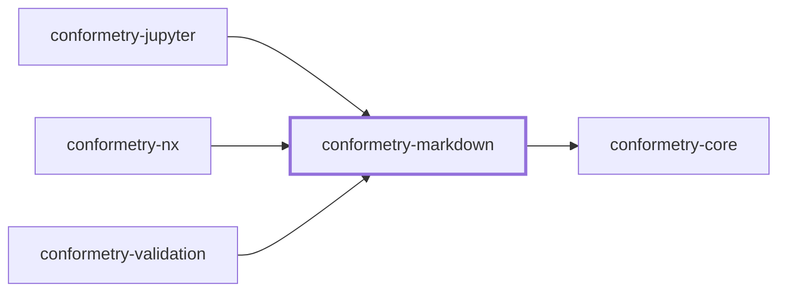
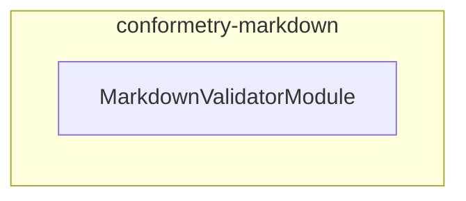

# 👔 Conformetry Markdown

The markdown validator for [Conformetry](../conformetry-cli/README.md). Claims
`.md`.

```bash
npm install --save-dev @conformetry/markdown
```

## What it compares

Structure, not prose. Headings, code fences, links, lists, and tables are
matched as [mdast](https://github.com/syntax-tree/mdast) nodes, so reflowing a
paragraph or rewording a sentence does not fail validation while deleting a
required section does.

Parsing is GitHub-flavored, so tables and task lists parse as their own node
types rather than as paragraphs.

Two node categories get special treatment while walking:

- **Containers** — `blockquote`, `list`, `listItem`, `table`, `tableRow`,
  `tableCell` — are descended into, so a heading nested inside a list item is
  still required.
- **Bare `text` runs** are skipped, because they are compared as part of their
  parent's rendered text; matching them again would double-report the same
  difference.

## Project Graph

Where this project sits in the Nx project graph: what it depends on, and what depends on it. Regenerated by `nx run synchronization:synchronize --configuration=write`.

<!-- nx-project-graph-start -->



<!-- nx-project-graph-end -->

## Module Graph

The modules this project defines and the imports between them, regenerated by `nx run synchronization:synchronize --configuration=write`.

<!-- nestjs-module-graph-start -->



<!-- nestjs-module-graph-end -->

## Exports

`MarkdownValidatorService`, `MarkdownValidatorModule`, and the
`MarkdownNodesService` and `MarkdownTreeService` internals it composes.
[`@conformetry/jupyter`](../conformetry-jupyter/README.md) reuses the validator
directly for notebook prose cells.

## Test

```bash
nx run conformetry-markdown:vitest
```

## License

MIT — see [LICENSE](../../LICENSE).
