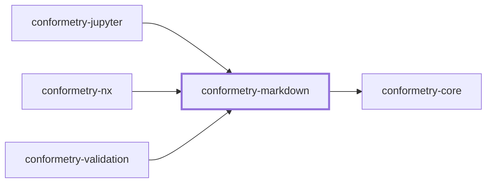
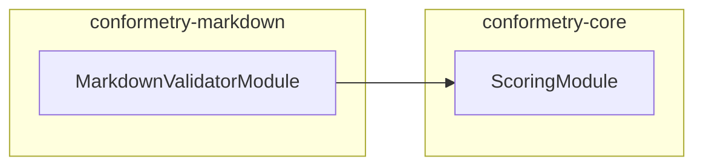

# 👔 Conformetry Markdown

The markdown validator for [Conformetry](../conformetry-cli/README.md). Claims
`.md`.

```bash
npm install --save-dev @conformetry/markdown
```

## What it compares

Structure, not prose. Headings, code fences, links, lists, and tables are
matched as [mdast](https://github.com/syntax-tree/mdast) nodes, so reflowing a
paragraph or rewording a sentence does not fail validation while deleting a
required section does.

Parsing is GitHub-flavored, so tables and task lists parse as their own node
types rather than as paragraphs.

Two node categories get special treatment while walking:

- **Containers** — `blockquote`, `list`, `listItem`, `table`, `tableRow`,
  `tableCell` — are descended into, so a heading nested inside a list item is
  still required.
- **Bare `text` runs** are skipped, because they are compared as part of their
  parent's rendered text; matching them again would double-report the same
  difference.

## Project Graph

Where this project sits in the Nx project graph: what it depends on, and what depends on it. Regenerated by `nx run synchronization:synchronize --configuration=write`.

<!-- nx-project-graph-start -->



<!-- nx-project-graph-end -->

## Module Graph

The modules this project defines and the imports between them, published by `nx run synchronization:synchronize --configuration=publish`.

<!-- nestjs-module-graph-start -->



<!-- nestjs-module-graph-end -->

## Exports

`MarkdownValidatorService`, `MarkdownValidatorModule`, and the
`MarkdownNodesService` and `MarkdownTreeService` internals it composes.
[`@conformetry/jupyter`](../conformetry-jupyter/README.md) reuses the validator
directly for notebook prose cells.

## Test

```bash
nx run conformetry-markdown:vitest
```

## License

MIT — see [LICENSE](../../LICENSE).

<!-- CALL_STACKS_START -->

## 🔭 Callidescope

Call stacks traced through `conformetry-markdown`, deepest first. Each frame shows what it takes, what it returns, and what its documentation says.

| Measure | Value |
| --- | --- |
| Callables | 33 |
| Files | 9 |
| Calls traced | 46 |
| Call stacks | 9 |
| Deepest stack | 3 |
| Stacks through recursion | 0 |
| Unfollowable calls | 0 |

### Call stacks

**1. `MarkdownNodesService.table`** — depth 3 · orphan-root

```text
🚀 MarkdownNodesService.table(templateNode: MarkdownNode, instanceNode: MarkdownNode): boolean [packages/conformetry-markdown/src/modules/markdown-validator/markdown-nodes.service.ts:68]
  └─> MarkdownNodesService.readColumnCount(node: MarkdownNode): number [packages/conformetry-markdown/src/modules/markdown-validator/markdown-nodes.service.ts:91]
     ↳ Counts a table's columns from its first row.
    └─> MarkdownNodesService.readChildren(node: MarkdownNode): MarkdownNode[] [packages/conformetry-markdown/src/modules/markdown-validator/markdown-nodes.service.ts:158]
       ↳ Reads a node's children, or an empty list for a leaf.
```

**2. `MarkdownNodesService.code`** — depth 2 · orphan-root

```text
🚀 MarkdownNodesService.code(templateNode: MarkdownNode, instanceNode: MarkdownNode): boolean [packages/conformetry-markdown/src/modules/markdown-validator/markdown-nodes.service.ts:35]
  └─> MarkdownNodesService.sameField(leftValue: string | undefined, rightValue: string | undefined): boolean [packages/conformetry-markdown/src/modules/markdown-validator/markdown-nodes.service.ts:98]
     ↳ Compares two optional string fields, treating absent as empty.
```

**3. `MarkdownNodesService.heading`** — depth 2 · orphan-root

```text
🚀 MarkdownNodesService.heading(templateNode: MarkdownNode, instanceNode: MarkdownNode): boolean [packages/conformetry-markdown/src/modules/markdown-validator/markdown-nodes.service.ts:41]
  └─> MarkdownNodesService.readText(node: MarkdownNode): string [packages/conformetry-markdown/src/modules/markdown-validator/markdown-nodes.service.ts:163]
     ↳ Reads a node's rendered plain text.
```

<details>
<summary>6 more call stacks</summary>

**4. `MarkdownNodesService.html`** — depth 2 · orphan-root

```text
🚀 MarkdownNodesService.html(templateNode: MarkdownNode, instanceNode: MarkdownNode): boolean [packages/conformetry-markdown/src/modules/markdown-validator/markdown-nodes.service.ts:47]
  └─> MarkdownNodesService.sameField(leftValue: string | undefined, rightValue: string | undefined): boolean [packages/conformetry-markdown/src/modules/markdown-validator/markdown-nodes.service.ts:98]
     ↳ Compares two optional string fields, treating absent as empty.
```

**5. `MarkdownNodesService.image`** — depth 2 · orphan-root

```text
🚀 MarkdownNodesService.image(templateNode: MarkdownNode, instanceNode: MarkdownNode): boolean [packages/conformetry-markdown/src/modules/markdown-validator/markdown-nodes.service.ts:50]
  └─> MarkdownNodesService.sameField(leftValue: string | undefined, rightValue: string | undefined): boolean [packages/conformetry-markdown/src/modules/markdown-validator/markdown-nodes.service.ts:98]
     ↳ Compares two optional string fields, treating absent as empty.
```

**6. `MarkdownNodesService.inlineCode`** — depth 2 · orphan-root

```text
🚀 MarkdownNodesService.inlineCode(templateNode: MarkdownNode, instanceNode: MarkdownNode): boolean [packages/conformetry-markdown/src/modules/markdown-validator/markdown-nodes.service.ts:56]
  └─> MarkdownNodesService.sameField(leftValue: string | undefined, rightValue: string | undefined): boolean [packages/conformetry-markdown/src/modules/markdown-validator/markdown-nodes.service.ts:98]
     ↳ Compares two optional string fields, treating absent as empty.
```

**7. `MarkdownNodesService.link`** — depth 2 · orphan-root

```text
🚀 MarkdownNodesService.link(templateNode: MarkdownNode, instanceNode: MarkdownNode): boolean [packages/conformetry-markdown/src/modules/markdown-validator/markdown-nodes.service.ts:59]
  └─> MarkdownNodesService.sameField(leftValue: string | undefined, rightValue: string | undefined): boolean [packages/conformetry-markdown/src/modules/markdown-validator/markdown-nodes.service.ts:98]
     ↳ Compares two optional string fields, treating absent as empty.
```

**8. `MarkdownNodesService.tableRow`** — depth 2 · orphan-root

```text
🚀 MarkdownNodesService.tableRow(templateNode: MarkdownNode, instanceNode: MarkdownNode): boolean [packages/conformetry-markdown/src/modules/markdown-validator/markdown-nodes.service.ts:74]
  └─> MarkdownNodesService.readChildren(node: MarkdownNode): MarkdownNode[] [packages/conformetry-markdown/src/modules/markdown-validator/markdown-nodes.service.ts:158]
     ↳ Reads a node's children, or an empty list for a leaf.
```

**9. `MarkdownNodesService.text`** — depth 2 · orphan-root

```text
🚀 MarkdownNodesService.text(templateNode: MarkdownNode, instanceNode: MarkdownNode): boolean [packages/conformetry-markdown/src/modules/markdown-validator/markdown-nodes.service.ts:80]
  └─> MarkdownNodesService.sameField(leftValue: string | undefined, rightValue: string | undefined): boolean [packages/conformetry-markdown/src/modules/markdown-validator/markdown-nodes.service.ts:98]
     ↳ Compares two optional string fields, treating absent as empty.
```

</details>

### Module spread

None.

### Possibly misplaced

None.
<!-- CALL_STACKS_END -->
