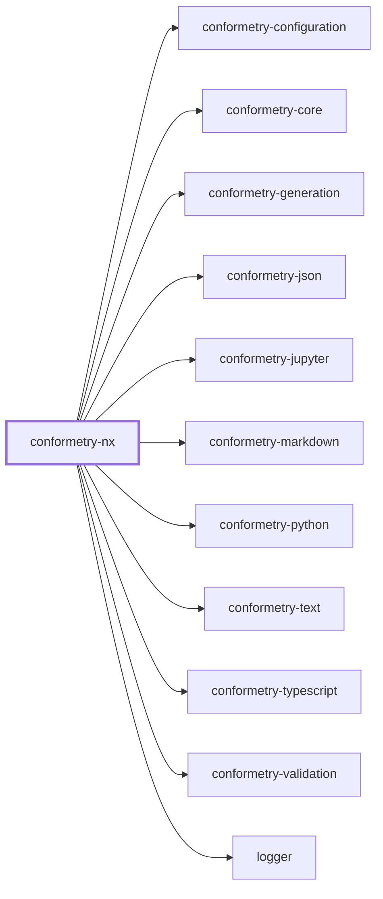
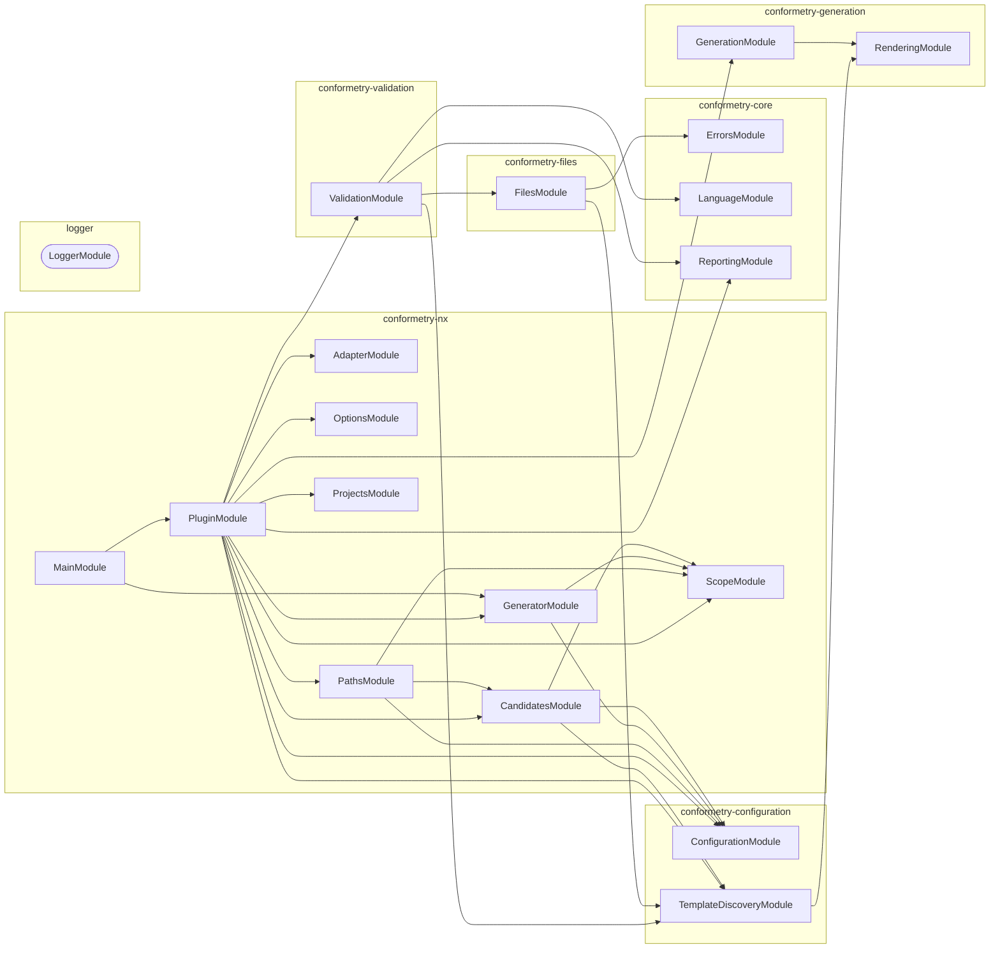

# 👔 Conformetry Nx

The Nx host for [Conformetry](../conformetry-cli/README.md). It adds two things
the standalone CLI cannot offer: generators addressed by name through `nx g`,
and a cached validation target inferred onto every project that holds
instances.

```bash
npm install --save-dev @conformetry/nx
```

## Setup

Register the plugin in `nx.json` and wire the bootstrap into `postinstall`:

```json
{
  "plugins": [
    {
      "plugin": "@conformetry/nx",
      "options": {
        "configurationPath": "configuration/conformetry.config.ts",
        "validateTargetName": "conformetry-validate"
      }
    }
  ],
  "sync": { "globalGenerators": ["@conformetry/nx:sync"] }
}
```

```json
{ "scripts": { "postinstall": "conformetry-nx-bootstrap" } }
```

Then type your configuration as `ConformetryNxConfiguration` rather than
`ConformetryConfiguration`, so instance groups are checked against what Nx can
actually resolve:

```ts
import { type ConformetryNxConfiguration } from "@conformetry/nx";
```

## The emitted plugin

Which generators a workspace has is a property of its conformetry
configuration, so the plugin exposing them is **emitted rather than written**.
`conformetry-nx-bootstrap` derives it from your configuration, writes it to
`.conformetry/nx-generators` (gitignore that directory — it is a build
artifact), and links it into the root `node_modules` so
`nx g conformetry:<generator>` resolves. The link is what makes the plugin
addressable, since Nx resolves a generator's package prefix by requiring it by
name rather than by matching an Nx project.

| Default | Value |
| ------- | ----- |
| Output path | `.conformetry/nx-generators` |
| Package name | `conformetry` — so generators are `nx g conformetry:<name>` |

The bootstrap warns rather than exiting non-zero when the configuration cannot
be read, so a configuration mid-edit never blocks an unrelated install. Drift
is caught where it matters instead: every conformetry command compares the
emitted plugin against the configuration and refuses to run against a stale
one.

`@conformetry/nx` deliberately declares no generators of its own beyond `sync`.
`nx g @conformetry/nx:anything` resolves nothing by design — which generators
exist is a property of your configuration, not of this package.

## Generating

```bash
nx g conformetry:nestjs-service-module --name=billing --project=lexico
nx g conformetry:nsm --name=billing --project=lexico   # by alias
```

Nx prompts for missing inputs from the generator's own schema and writes
through its virtual `Tree`, so `--dry-run` works and the workspace formatter
runs over the result.

## Validating

The plugin infers a `conformetry-validate` target onto every project holding
instances, so validation is cached and participates in `nx affected`:

```bash
nx run <project>:conformetry-validate
nx run-many --target=conformetry-validate --all
nx affected --target=conformetry-validate --base=main
```

| Executor option | Purpose |
| --------------- | ------- |
| `configurationPath` | Configuration file, workspace-root relative |
| `languages` | Restrict the run to named validators; all run when omitted |

## Tag-scoped instances

The Nx host reads an instance group's `tags` as project tags, and resolves that
group's globs _inside_ each matching project — so where a generator belongs is
stated exactly once:

```ts
instances: [{ patterns: ["src/modules/*"], tags: ["framework:nestjs"] }];
```

The two group forms are told apart by `tags` alone. There is no second field
that could disagree with it: a separate scope that excluded a project the globs
reached narrowed validation silently, and validation cannot notice candidates
it was never offered.

Omitting `patterns` selects the projects without locating anything in them,
which is what a template with no instances yet wants — `nx g` is still confined
to the projects the template suits.

## Project Graph

Where this project sits in the Nx project graph: what it depends on, and what depends on it. Regenerated by `nx run synchronization:synchronize --configuration=write`.

<!-- nx-project-graph-start -->



<!-- nx-project-graph-end -->

## Module Graph

The modules this project defines and the imports between them, regenerated by `nx run synchronization:synchronize --configuration=write`.

<!-- nestjs-module-graph-start -->



_Rounded modules are global: every module can inject them, so their edges are left out._

_Also depends on conformetry-json, conformetry-jupyter, conformetry-markdown, conformetry-python, conformetry-text and conformetry-typescript — reached through types alone or loaded lazily, and so absent from this graph._

<!-- nestjs-module-graph-end -->

## Exports

`runConformetryGenerator` for generator wrappers, `bootstrapPlugin` and
`runBootstrapCli` for the bootstrap, the `ConformetryNxConfiguration` and
instance-group types, and the NestJS services behind them (`PluginService`,
`AdapterService`, `CandidatesService`, `ScopeService`, `OptionsService`).

## Test

```bash
nx run conformetry-nx:vitest
```

## License

MIT — see [LICENSE](../../LICENSE).
