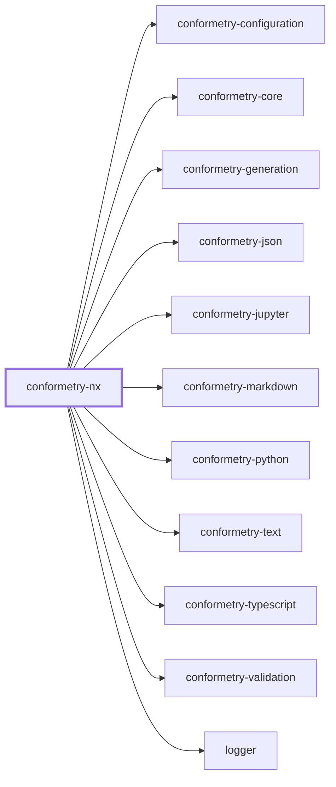
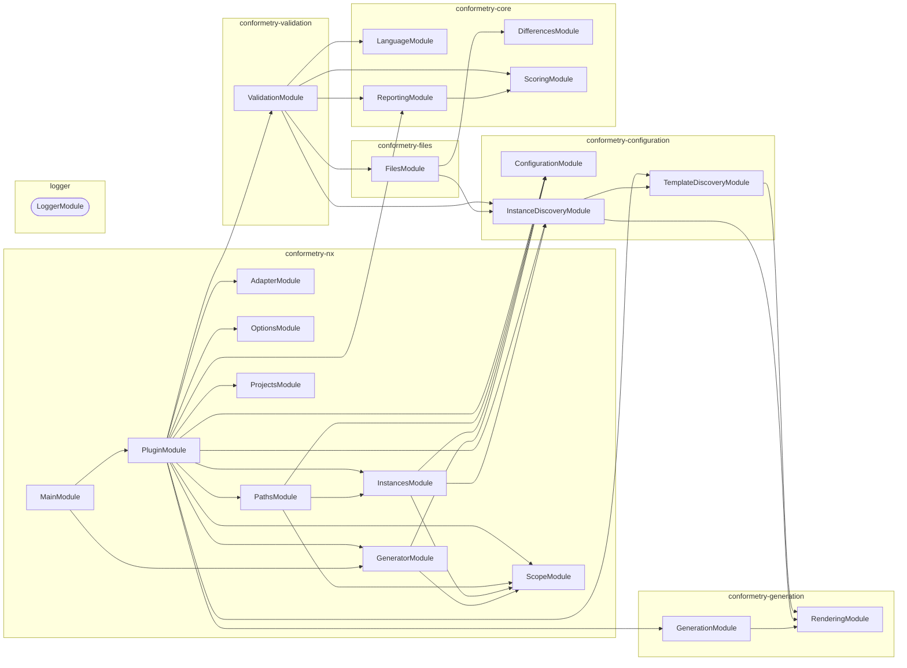

# 👔 Conformetry Nx

The Nx host for [Conformetry](../conformetry-cli/README.md). It adds two things
the standalone CLI cannot offer: generators addressed by name through `nx g`,
and a cached validation target inferred onto every project that holds
instances.

```bash
npm install --save-dev @conformetry/nx
```

## Setup

Register the plugin in `nx.json` and wire the bootstrap into `postinstall`:

```json
{
  "plugins": [
    {
      "plugin": "@conformetry/nx",
      "options": {
        "configurationPath": "configuration/conformetry.config.ts",
        "validateTargetName": "conformetry-validate"
      }
    }
  ],
  "sync": { "globalGenerators": ["@conformetry/nx:sync"] }
}
```

```json
{ "scripts": { "postinstall": "conformetry-nx-bootstrap" } }
```

Then type your configuration as `ConformetryNxConfiguration` rather than
`ConformetryConfiguration`, so instance groups are checked against what Nx can
actually resolve:

```ts
import { type ConformetryNxConfiguration } from "@conformetry/nx";
```

## The emitted plugin

Which generators a workspace has is a property of its conformetry
configuration, so the plugin exposing them is **emitted rather than written**.
`conformetry-nx-bootstrap` derives it from your configuration, writes it to
`.conformetry/nx-generators` (gitignore that directory — it is a build
artifact), and links it into the root `node_modules` so
`nx g conformetry:<generator>` resolves. The link is what makes the plugin
addressable, since Nx resolves a generator's package prefix by requiring it by
name rather than by matching an Nx project.

| Default | Value |
| ------- | ----- |
| Output path | `.conformetry/nx-generators` |
| Package name | `conformetry` — so generators are `nx g conformetry:<name>` |

The bootstrap warns rather than exiting non-zero when the configuration cannot
be read, so a configuration mid-edit never blocks an unrelated install. Drift
is caught where it matters instead: every conformetry command compares the
emitted plugin against the configuration and refuses to run against a stale
one.

`@conformetry/nx` deliberately declares no generators of its own beyond `sync`.
`nx g @conformetry/nx:anything` resolves nothing by design — which generators
exist is a property of your configuration, not of this package.

## Generating

```bash
nx g conformetry:nestjs-service-module --name=billing --project=lexico
nx g conformetry:nsm --name=billing --project=lexico   # by alias
```

Nx prompts for missing inputs from the generator's own schema and writes
through its virtual `Tree`, so `--dry-run` works and the workspace formatter
runs over the result.

## Validating

The plugin infers a `conformetry-validate` target onto every project holding
instances, so validation is cached and participates in `nx affected`:

```bash
nx run <project>:conformetry-validate
nx run-many --target=conformetry-validate --all
nx affected --target=conformetry-validate --base=main
```

| Executor option | Purpose |
| --------------- | ------- |
| `configurationPath` | Configuration file, workspace-root relative |
| `languages` | Restrict the run to named validators; all run when omitted |

## Tag-scoped instances

The Nx host reads an instance group's `tags` as project tags, and resolves that
group's globs _inside_ each matching project — so where a generator belongs is
stated exactly once:

```ts
instances: [{ patterns: ["src/modules/*"], tags: ["framework:nestjs"] }];
```

The two group forms are told apart by `tags` alone. There is no second field
that could disagree with it: a separate scope that excluded a project the globs
reached narrowed validation silently, and validation cannot notice instances
it was never offered.

Omitting `patterns` selects the projects without locating anything in them,
which is what a template with no instances yet wants — `nx g` is still confined
to the projects the template suits.

## Project Graph

Where this project sits in the Nx project graph: what it depends on, and what depends on it. Regenerated by `nx run synchronization:synchronize --configuration=write`.

<!-- nx-project-graph-start -->



<!-- nx-project-graph-end -->

## Module Graph

The modules this project defines and the imports between them, regenerated by `nx run synchronization:synchronize --configuration=write`.

<!-- nestjs-module-graph-start -->



_Rounded modules are global: every module can inject them, so their edges are left out._

_Loaded at runtime rather than imported, and so absent from this container: conformetry-json, conformetry-jupyter, conformetry-markdown, conformetry-python, conformetry-text and conformetry-typescript._

<!-- nestjs-module-graph-end -->

## Exports

`runConformetryGenerator` for generator wrappers, `bootstrapPlugin` and
`runBootstrapCli` for the bootstrap, the `ConformetryNxConfiguration` and
instance-group types, and the NestJS services behind them (`PluginService`,
`AdapterService`, `InstancesService`, `ScopeService`, `OptionsService`).

## Test

```bash
nx run conformetry-nx:vitest
```

## License

MIT — see [LICENSE](../../LICENSE).

<!-- CALL_STACKS_START -->

## 🔭 Callidescope

Call stacks traced through `conformetry-nx`, deepest first. Each frame shows what it takes, what it returns, and what its documentation says.

| Measure | Value |
| --- | --- |
| Callables | 111 |
| Files | 42 |
| Calls traced | 130 |
| Call stacks | 8 |
| Deepest stack | 12 |
| Stacks through recursion | 0 |
| Unfollowable calls | 1 |

### Call stacks

**1. `runConformetryGenerator`** — depth ≥ 12 · exported-function

```text
🚀 runConformetryGenerator(…): Promise<string[]> [packages/conformetry-nx/src/index.ts:90]
   ↳ Runs one configured generator against an Nx tree.
  └─> PluginService.runGenerator(args: RunGeneratorArguments): Promise<string[]> [packages/conformetry-nx/src/modules/plugin/plugin.service.ts:291]
     ↳ Runs one configured generator against an Nx tree.
    └─> PluginService.assertPluginInSync(args: { configurationPath: string; workspaceRoot: string; }): Promise<void> [packages/conformetry-nx/src/modules/plugin/plugin.service.ts:115]
       ↳ Fails fast when the plugin would run against a stale or broken setup.
      └─> PluginService.assertEmittedPluginCurrent(args: { configurationPath: string; workspaceRoot: string; }): Promise<void> [packages/conformetry-nx/src/modules/plugin/plugin.service.ts:86]
         ↳ Fails when the emitted Nx plugin no longer matches the configuration. `generators.json` and its schemas are derived…
        └─> GeneratorService.emitPlugin(args: EmitPluginArguments): Promise<EmittedFile[]> [packages/conformetry-nx/src/modules/generator/generator.service.ts:217]
           ↳ Returns every file the consumer's generator plugin consists of.
          └─> GeneratorService.map(…)(…): { content: string; filePath: string; } [packages/conformetry-nx/src/modules/generator/generator.service.ts:243]
            └─> GeneratorService.resolveScopedProjectNames(…): string[] | undefined [packages/conformetry-nx/src/modules/generator/generator.service.ts:185]
               ↳ The projects a generator's tagged groups admit, or nothing when it has none.
              └─> ScopeService.resolveScopedProjectNames(…): string[] [packages/conformetry-nx/src/modules/scope/scope.service.ts:129]
                 ↳ The projects a generator's groups admit, by name and sorted.
                └─> ScopeService.filter(…)(project: ProjectScope): boolean [packages/conformetry-nx/src/modules/scope/scope.service.ts:142]
                  └─> ScopeService.some(…)(group: ConformetryInstanceGroup): boolean [packages/conformetry-nx/src/modules/scope/scope.service.ts:143]
                    └─> ScopeService.matchesProject(args: { group: ConformetryInstanceGroup; project: ProjectScope; }): boolean [packages/conformetry-nx/src/modules/scope/scope.service.ts:47]
                       ↳ Returns whether a group applies to a project.
                      └─> ScopeService.isProjectGroup(group: ConformetryInstanceGroup): boolean [packages/conformetry-nx/src/modules/scope/scope.service.ts:34]
                         ↳ Whether a group locates its instances by project tag.
```

**2. `validateExecutor`** — depth ≥ 12 · orphan-root

```text
🚀 validateExecutor(…): Promise<{ success: boolean; }> [packages/conformetry-nx/src/executors/validate/executor.ts:16]
   ↳ Validates one project's instances against their conformetry templates.
  └─> PluginService.runValidation(args: RunValidationArguments): Promise<RunValidationResult> [packages/conformetry-nx/src/modules/plugin/plugin.service.ts:344]
     ↳ Validates one project's instances and renders the report.
    └─> PluginService.assertPluginInSync(args: { configurationPath: string; workspaceRoot: string; }): Promise<void> [packages/conformetry-nx/src/modules/plugin/plugin.service.ts:115]
       ↳ Fails fast when the plugin would run against a stale or broken setup.
      └─> PluginService.assertEmittedPluginCurrent(args: { configurationPath: string; workspaceRoot: string; }): Promise<void> [packages/conformetry-nx/src/modules/plugin/plugin.service.ts:86]
         ↳ Fails when the emitted Nx plugin no longer matches the configuration. `generators.json` and its schemas are derived…
        └─> GeneratorService.emitPlugin(args: EmitPluginArguments): Promise<EmittedFile[]> [packages/conformetry-nx/src/modules/generator/generator.service.ts:217]
           ↳ Returns every file the consumer's generator plugin consists of.
          └─> GeneratorService.map(…)(…): { content: string; filePath: string; } [packages/conformetry-nx/src/modules/generator/generator.service.ts:243]
            └─> GeneratorService.resolveScopedProjectNames(…): string[] | undefined [packages/conformetry-nx/src/modules/generator/generator.service.ts:185]
               ↳ The projects a generator's tagged groups admit, or nothing when it has none.
              └─> ScopeService.resolveScopedProjectNames(…): string[] [packages/conformetry-nx/src/modules/scope/scope.service.ts:129]
                 ↳ The projects a generator's groups admit, by name and sorted.
                └─> ScopeService.filter(…)(project: ProjectScope): boolean [packages/conformetry-nx/src/modules/scope/scope.service.ts:142]
                  └─> ScopeService.some(…)(group: ConformetryInstanceGroup): boolean [packages/conformetry-nx/src/modules/scope/scope.service.ts:143]
                    └─> ScopeService.matchesProject(args: { group: ConformetryInstanceGroup; project: ProjectScope; }): boolean [packages/conformetry-nx/src/modules/scope/scope.service.ts:47]
                       ↳ Returns whether a group applies to a project.
                      └─> ScopeService.isProjectGroup(group: ConformetryInstanceGroup): boolean [packages/conformetry-nx/src/modules/scope/scope.service.ts:34]
                         ↳ Whether a group locates its instances by project tag.
```

**3. `runBootstrapCli`** — depth ≥ 10 · orphan-root

```text
🚀 runBootstrapCli(workspaceRoot: string): Promise<void> [packages/conformetry-nx/src/bootstrap.utilities.ts:73]
   ↳ Bootstraps the plugin, warning rather than failing the install.
  └─> bootstrapPlugin(workspaceRoot: string): Promise<EmittedFile[]> [packages/conformetry-nx/src/bootstrap.utilities.ts:38]
     ↳ Emits the generator plugin and puts it where Nx will find it.
    └─> GeneratorService.emitPlugin(args: EmitPluginArguments): Promise<EmittedFile[]> [packages/conformetry-nx/src/modules/generator/generator.service.ts:217]
       ↳ Returns every file the consumer's generator plugin consists of.
      └─> GeneratorService.map(…)(…): { content: string; filePath: string; } [packages/conformetry-nx/src/modules/generator/generator.service.ts:243]
        └─> GeneratorService.resolveScopedProjectNames(…): string[] | undefined [packages/conformetry-nx/src/modules/generator/generator.service.ts:185]
           ↳ The projects a generator's tagged groups admit, or nothing when it has none.
          └─> ScopeService.resolveScopedProjectNames(…): string[] [packages/conformetry-nx/src/modules/scope/scope.service.ts:129]
             ↳ The projects a generator's groups admit, by name and sorted.
            └─> ScopeService.filter(…)(project: ProjectScope): boolean [packages/conformetry-nx/src/modules/scope/scope.service.ts:142]
              └─> ScopeService.some(…)(group: ConformetryInstanceGroup): boolean [packages/conformetry-nx/src/modules/scope/scope.service.ts:143]
                └─> ScopeService.matchesProject(args: { group: ConformetryInstanceGroup; project: ProjectScope; }): boolean [packages/conformetry-nx/src/modules/scope/scope.service.ts:47]
                   ↳ Returns whether a group applies to a project.
                  └─> ScopeService.isProjectGroup(group: ConformetryInstanceGroup): boolean [packages/conformetry-nx/src/modules/scope/scope.service.ts:34]
                     ↳ Whether a group locates its instances by project tag.
```

<details>
<summary>5 more call stacks</summary>

**4. `syncGenerator`** — depth ≥ 9 · orphan-root

```text
🚀 syncGenerator(…): Promise<{ outOfSyncMessage: string; }> [packages/conformetry-nx/src/generators/sync/generator.ts:26]
   ↳ Regenerates the workspace's conformetry generator plugin.
  └─> GeneratorService.emitPlugin(args: EmitPluginArguments): Promise<EmittedFile[]> [packages/conformetry-nx/src/modules/generator/generator.service.ts:217]
     ↳ Returns every file the consumer's generator plugin consists of.
    └─> GeneratorService.map(…)(…): { content: string; filePath: string; } [packages/conformetry-nx/src/modules/generator/generator.service.ts:243]
      └─> GeneratorService.resolveScopedProjectNames(…): string[] | undefined [packages/conformetry-nx/src/modules/generator/generator.service.ts:185]
         ↳ The projects a generator's tagged groups admit, or nothing when it has none.
        └─> ScopeService.resolveScopedProjectNames(…): string[] [packages/conformetry-nx/src/modules/scope/scope.service.ts:129]
           ↳ The projects a generator's groups admit, by name and sorted.
          └─> ScopeService.filter(…)(project: ProjectScope): boolean [packages/conformetry-nx/src/modules/scope/scope.service.ts:142]
            └─> ScopeService.some(…)(group: ConformetryInstanceGroup): boolean [packages/conformetry-nx/src/modules/scope/scope.service.ts:143]
              └─> ScopeService.matchesProject(args: { group: ConformetryInstanceGroup; project: ProjectScope; }): boolean [packages/conformetry-nx/src/modules/scope/scope.service.ts:47]
                 ↳ Returns whether a group applies to a project.
                └─> ScopeService.isProjectGroup(group: ConformetryInstanceGroup): boolean [packages/conformetry-nx/src/modules/scope/scope.service.ts:34]
                   ↳ Whether a group locates its instances by project tag.
```

**5. `anonymous`** — depth ≥ 8 · orphan-root

```text
🚀 anonymous(…): Promise<CreateNodesResultArray> [packages/conformetry-nx/src/index.ts:46]
  └─> PluginService.inferTargets(args: InferTargetsArguments): Promise<Map<string, InferredTargets>> [packages/conformetry-nx/src/modules/plugin/plugin.service.ts:232]
     ↳ Infers a validation target onto every project that holds at least one instance.
    └─> InstancesService.findProjectInstances(args: FindProjectInstancesArguments): Promise<Instance[]> [packages/conformetry-nx/src/modules/instances/instances.service.ts:74]
       ↳ Expands every instance group that applies to a project, keeping only the instances that live inside it.
      └─> InstancesService.flatMap(…)(this: undefined, group: ConformetryInstanceGroup): Instance[] [packages/conformetry-nx/src/modules/instances/instances.service.ts:90]
        └─> InstanceDiscoveryService.findInstances(args: FindInstancesArguments): Instance[] [packages/conformetry-configuration/src/modules/instance-discovery/instance-discovery.service.ts:87]
           ↳ Expands instance globs into the instances that exist.
          └─> InstanceDiscoveryLocatingService.findInstances(args: FindInstancesArguments): Instance[] [packages/conformetry-configuration/src/modules/instance-discovery/instance-discovery-locating.service.ts:121]
             ↳ Expands every pattern and returns one instance per distinct path, name, and scope kind.
            └─> InstanceDiscoveryLocatingService.resolveGlobSuffix(pattern: string): string [packages/conformetry-configuration/src/modules/instance-discovery/instance-discovery-locating.service.ts:73]
               ↳ Returns the literal filename suffix a pattern ends with, such as `.service.ts` for `**\/*.service.ts`, or `""` when the…
              └─> InstanceDiscoveryLocatingService.map(…)(character: string): number [packages/conformetry-configuration/src/modules/instance-discovery/instance-discovery-locating.service.ts:76]
```

**6. `AdapterService.listDirectory`** — depth 3 · orphan-root

```text
🚀 AdapterService.listDirectory(directoryPath: string): Promise<DirectoryEntry[]> [packages/conformetry-nx/src/modules/adapter/adapter.service.ts:116]
  └─> AdapterService.listDirectory(…): Promise<DirectoryEntry[]> [packages/conformetry-nx/src/modules/adapter/adapter.service.ts:44]
     ↳ Lists a directory through the tree when it is inside the workspace, and through the filesystem otherwise.
    └─> AdapterService.resolveTreePath(args: { directoryPath: string; workspaceRoot: string; }): string | undefined [packages/conformetry-nx/src/modules/adapter/adapter.service.ts:91]
       ↳ Converts an absolute path to the workspace-relative form a `Tree` uses, or returns `undefined` when the path lies…
```

**7. `AdapterService.readFile`** — depth 3 · orphan-root

```text
🚀 AdapterService.readFile(filePath: string): Promise<string> [packages/conformetry-nx/src/modules/adapter/adapter.service.ts:126]
  └─> AdapterService.readFile(…): Promise<string> [packages/conformetry-nx/src/modules/adapter/adapter.service.ts:70]
     ↳ Reads a file through the tree when possible, the filesystem otherwise.
    └─> AdapterService.resolveTreePath(args: { directoryPath: string; workspaceRoot: string; }): string | undefined [packages/conformetry-nx/src/modules/adapter/adapter.service.ts:91]
       ↳ Converts an absolute path to the workspace-relative form a `Tree` uses, or returns `undefined` when the path lies…
```

**8. `AdapterService.writeFile`** — depth 2 · orphan-root

```text
🚀 AdapterService.writeFile(filePath: string, content: string): Promise<void> [packages/conformetry-nx/src/modules/adapter/adapter.service.ts:133]
  └─> AdapterService.resolveTreePath(args: { directoryPath: string; workspaceRoot: string; }): string | undefined [packages/conformetry-nx/src/modules/adapter/adapter.service.ts:91]
     ↳ Converts an absolute path to the workspace-relative form a `Tree` uses, or returns `undefined` when the path lies…
```

</details>

### Module spread

| Callable | Spread | Calls directly | Location |
| --- | --- | --- | --- |
| `PluginService.runValidation` | 16 | `conformetry-core:modules/reporting`, `conformetry-nx:modules/instances`, `conformetry-validation:modules/validation` | `packages/conformetry-nx/src/modules/plugin/plugin.service.ts:344` |
| `PluginService.runGenerator` | 12 | `conformetry-configuration:modules/configuration`, `conformetry-generation:modules/generation`, `conformetry-nx:modules/adapter`, `conformetry-nx:modules/options`, `conformetry-nx:modules/paths` | `packages/conformetry-nx/src/modules/plugin/plugin.service.ts:291` |
| `syncGenerator` | 7 | `conformetry-nx:modules/generator`, `conformetry-nx:modules/options`, `conformetry-nx:modules/projects`, `conformetry-nx:src` | `packages/conformetry-nx/src/generators/sync/generator.ts:26` |
| `bootstrapPlugin` | 6 | `conformetry-nx:modules/generator`, `conformetry-nx:modules/options`, `conformetry-nx:modules/projects` | `packages/conformetry-nx/src/bootstrap.utilities.ts:38` |

### Possibly misplaced

None.
<!-- CALL_STACKS_END -->
