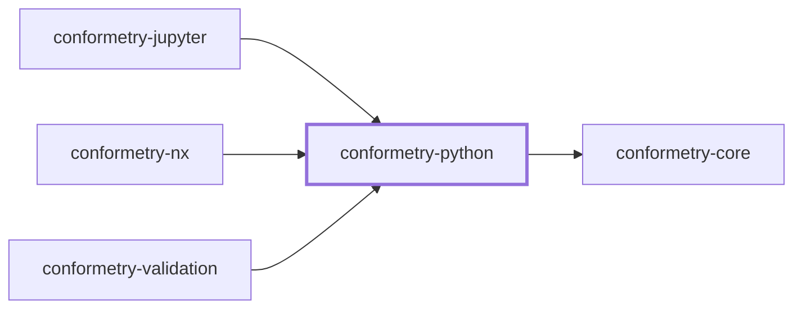
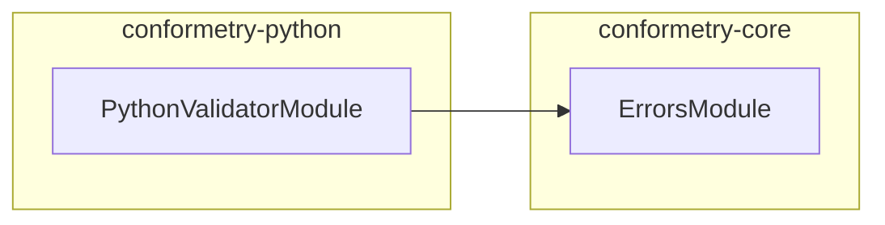

# 👔 Conformetry Python

The Python validator for [Conformetry](../conformetry-cli/README.md). Claims
`.py`.

```bash
npm install --save-dev @conformetry/python
```

## Requirements

**`python3` must be on `PATH`.** Python's syntax tree is only available from
Python, so structural validation shells out to a small module shipped inside
this package rather than approximating it with a line comparison. The
subprocess is synchronous — callers are, and one file's validation has nothing
to overlap with.

When the interpreter is missing, the failure is reported as a conformance
finding with a fix explaining what to install, not as a crash.

## What it compares

Structure through Python's own `ast` module: the imports, classes, functions,
and decorators a template declares must exist in the instance. Formatting,
docstring wording, and added members do not fail validation.

## Notebooks

`.ipynb` is deliberately **not** claimed here. A notebook is a JSON envelope
containing markdown and code cells, so
[`@conformetry/jupyter`](../conformetry-jupyter/README.md) owns it and calls
back into this package for the code cells alone.

## Project Graph

Where this project sits in the Nx project graph: what it depends on, and what depends on it. Regenerated by `nx run synchronization:synchronize --configuration=write`.

<!-- nx-project-graph-start -->



<!-- nx-project-graph-end -->

## Module Graph

The modules this project defines and the imports between them, regenerated by `nx run synchronization:synchronize --configuration=write`.

<!-- nestjs-module-graph-start -->



<!-- nestjs-module-graph-end -->

## Exports

`PythonValidatorService`, `PythonValidatorModule`, and `PythonBridgeService` —
the last of which the Jupyter validator uses directly.

## Test

```bash
nx run conformetry-python:vitest
```

## License

MIT — see [LICENSE](../../LICENSE).
