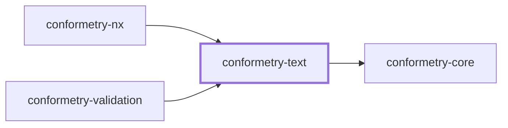
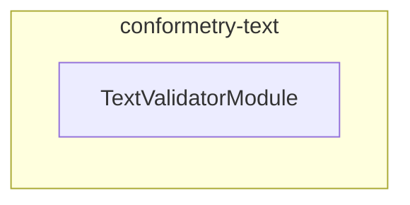

# 👔 Conformetry Text

The fallback validator for [Conformetry](../conformetry-cli/README.md), and the
floor beneath every other one.

```bash
npm install --save-dev @conformetry/text
```

## What it compares

Lines. A template line must appear in the instance, and matching is
**duplicate-aware**: a line the template contains twice must appear twice.
Order is not enforced, so a file may add lines anywhere — the template is a
lower bound, not an exact specification.

## Why it is required rather than optional

Every other language package is loaded only when a run's templates call for its
extension. This one is a hard dependency of
[`@conformetry/validation`](../conformetry-validation/README.md), because it is
what an extension nobody claims falls back to. Without it a `.env.default`, a
`Dockerfile`, or a `.gitignore` would be checked for existence and then never
compared at all.

Its descriptor claims `.txt`, but routing sends it everything unclaimed.

## Project Graph

Where this project sits in the Nx project graph: what it depends on, and what depends on it. Regenerated by `nx run synchronization:synchronize --configuration=write`.

<!-- nx-project-graph-start -->



<!-- nx-project-graph-end -->

## Module Graph

The modules this project defines and the imports between them, regenerated by `nx run synchronization:synchronize --configuration=write`.

<!-- nestjs-module-graph-start -->



_Reached only for their types, and so declaring no module here: conformetry-core._

<!-- nestjs-module-graph-end -->

## Exports

`TextValidatorService` and `TextValidatorModule`.

## Test

```bash
nx run conformetry-text:vitest
```

## License

MIT — see [LICENSE](../../LICENSE).
