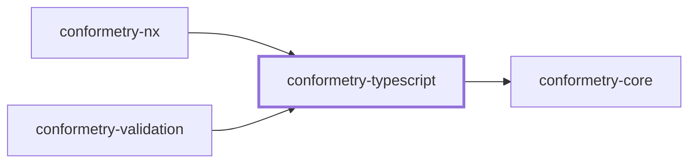
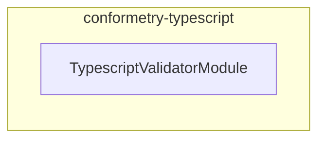

# 👔 Conformetry TypeScript

The TypeScript and TSX validator for
[Conformetry](../conformetry-cli/README.md). Claims `.ts` and `.tsx`.

```bash
npm install --save-dev @conformetry/typescript
```

## What it compares

Two independent checks run over the same parse:

- **The syntax tree** — imports, decorators, classes, and members the template
  declares must exist in the instance.
- **The comments** — section markers must appear, in the order the template
  prescribes.

Comparison is structural, not textual. Reformatting a file, renaming a local,
or adding a method does not fail validation; deleting a required export or
losing a section comment does.

The dialect is chosen from the filename, so `.tsx` parses as TSX and `.ts` does
not.

## TODO comments

A template comment containing `TODO` is a prompt to write something rather than
text to copy, so **any** instance comment satisfies it:

```ts
// TODO: Document what this module owns
```

## Project Graph

Where this project sits in the Nx project graph: what it depends on, and what depends on it. Regenerated by `nx run synchronization:synchronize --configuration=write`.

<!-- nx-project-graph-start -->



<!-- nx-project-graph-end -->

## Module Graph

The modules this project defines and the imports between them, regenerated by `nx run synchronization:synchronize --configuration=write`.

<!-- nestjs-module-graph-start -->



_Reached only for their types, and so declaring no module here: conformetry-core._

<!-- nestjs-module-graph-end -->

## Exports

`TypescriptValidatorService`, `TypescriptValidatorModule`, and the
`TypescriptCommentsService`, `TypescriptNodesService`, and
`TypescriptTreeService` internals it composes.

## Test

```bash
nx run conformetry-typescript:vitest
```

## License

MIT — see [LICENSE](../../LICENSE).
