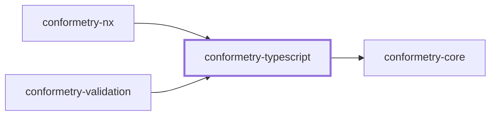
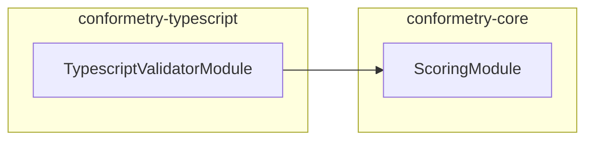

# 👔 Conformetry TypeScript

The TypeScript and TSX validator for
[Conformetry](../conformetry-cli/README.md). Claims `.ts` and `.tsx`.

```bash
npm install --save-dev @conformetry/typescript
```

## What it compares

Two independent checks run over the same parse:

- **The syntax tree** — imports, decorators, classes, and members the template
  declares must exist in the instance.
- **The comments** — section markers must appear, in the order the template
  prescribes.

Comparison is structural, not textual. Reformatting a file, renaming a local,
or adding a method does not fail validation; deleting a required export or
losing a section comment does.

The dialect is chosen from the filename, so `.tsx` parses as TSX and `.ts` does
not.

## TODO comments

A template comment containing `TODO` is a prompt to write something rather than
text to copy, so **any** instance comment satisfies it:

```ts
// TODO: Document what this module owns
```

## Project Graph

Where this project sits in the Nx project graph: what it depends on, and what depends on it. Regenerated by `nx run synchronization:synchronize --configuration=write`.

<!-- nx-project-graph-start -->



<!-- nx-project-graph-end -->

## Module Graph

The modules this project defines and the imports between them, regenerated by `nx run synchronization:synchronize --configuration=write`.

<!-- nestjs-module-graph-start -->



<!-- nestjs-module-graph-end -->

## Exports

`TypescriptValidatorService`, `TypescriptValidatorModule`, and the
`TypescriptCommentsService`, `TypescriptNodesService`, and
`TypescriptTreeService` internals it composes.

## Test

```bash
nx run conformetry-typescript:vitest
```

## License

MIT — see [LICENSE](../../LICENSE).

<!-- CALL_STACKS_START -->

## 🔭 Callidescope

Call stacks traced through `conformetry-typescript`, deepest first. Each frame shows what it takes, what it returns, and what its documentation says.

| Measure | Value |
| --- | --- |
| Callables | 40 |
| Files | 10 |
| Calls traced | 49 |
| Call stacks | 1 |
| Deepest stack | 12 |
| Stacks through recursion | 1 |
| Unfollowable calls | 0 |

### Call stacks

**1. `TypescriptValidatorService.validateDocument`** — depth 12 · orphan-root

```text
🚀 TypescriptValidatorService.validateDocument(document: PreparedValidationDocument): DocumentValidationResult [packages/conformetry-typescript/src/modules/typescript-validator/typescript-validator.service.ts:170]
   ↳ Reports every declaration and comment the template requires.
  └─> TypescriptValidatorService.validateStructure(…): DocumentValidationResult [packages/conformetry-typescript/src/modules/typescript-validator/typescript-validator.service.ts:111]
     ↳ Compares the syntax trees and describes each missing declaration.
    └─> TypescriptTreeService.compareBestCandidate(args: { candidates: Node[]; templateChild: Node; }): TreeComparison (cycle) [packages/conformetry-typescript/src/modules/typescript-validator/typescript-tree.service.ts:70]
       ↳ Descends into whichever candidate explains the template best.
      └─> TypescriptTreeService.map(…)(candidate: Node): TreeComparison (cycle) [packages/conformetry-typescript/src/modules/typescript-validator/typescript-tree.service.ts:75]
        └─> TypescriptTreeService.compareTree(args: CompareTreeArguments): TreeComparison (cycle) [packages/conformetry-typescript/src/modules/typescript-validator/typescript-tree.service.ts:130]
           ↳ Compares one level of two trees, descending into every match.
          └─> TypescriptTreeService.map(…)(templateChild: Node): TreeComparison (cycle) [packages/conformetry-typescript/src/modules/typescript-validator/typescript-tree.service.ts:137]
            └─> TypescriptTreeService.compareChild(…): TreeComparison (cycle) [packages/conformetry-typescript/src/modules/typescript-validator/typescript-tree.service.ts:91]
               ↳ Matches one template child against the instance's children.
              └─> TypescriptTreeService.buildError(…): TypescriptComparisonError [packages/conformetry-typescript/src/modules/typescript-validator/typescript-tree.service.ts:44]
                 ↳ Describes a template node with no instance counterpart.
                └─> TypescriptNodesService.countSubtree(node: Node): number (cycle) [packages/conformetry-typescript/src/modules/typescript-validator/typescript-nodes.service.ts:181]
                   ↳ Counts a node and everything beneath it.
                  └─> TypescriptNodesService.reduce(…)(total: number, child: Node): number (cycle) [packages/conformetry-typescript/src/modules/typescript-validator/typescript-nodes.service.ts:182]
                    └─> TypescriptNodesService.readChildren(node: Node): Node[] [packages/conformetry-typescript/src/modules/typescript-validator/typescript-nodes.service.ts:188]
                       ↳ Reads a node's direct children, skipping the end-of-file token.
                      └─> TypescriptNodesService.forEachChild(…)(childNode: Node): undefined [packages/conformetry-typescript/src/modules/typescript-validator/typescript-nodes.service.ts:191]
```

### Module spread

None.

### Possibly misplaced

None.
<!-- CALL_STACKS_END -->
