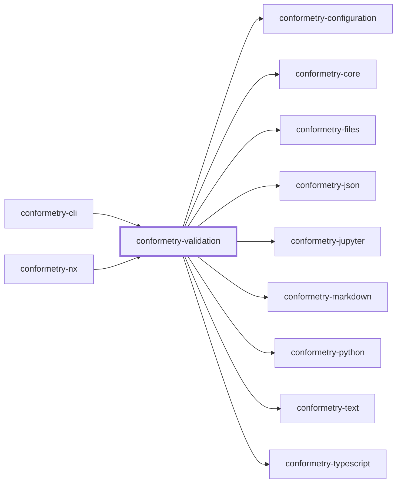
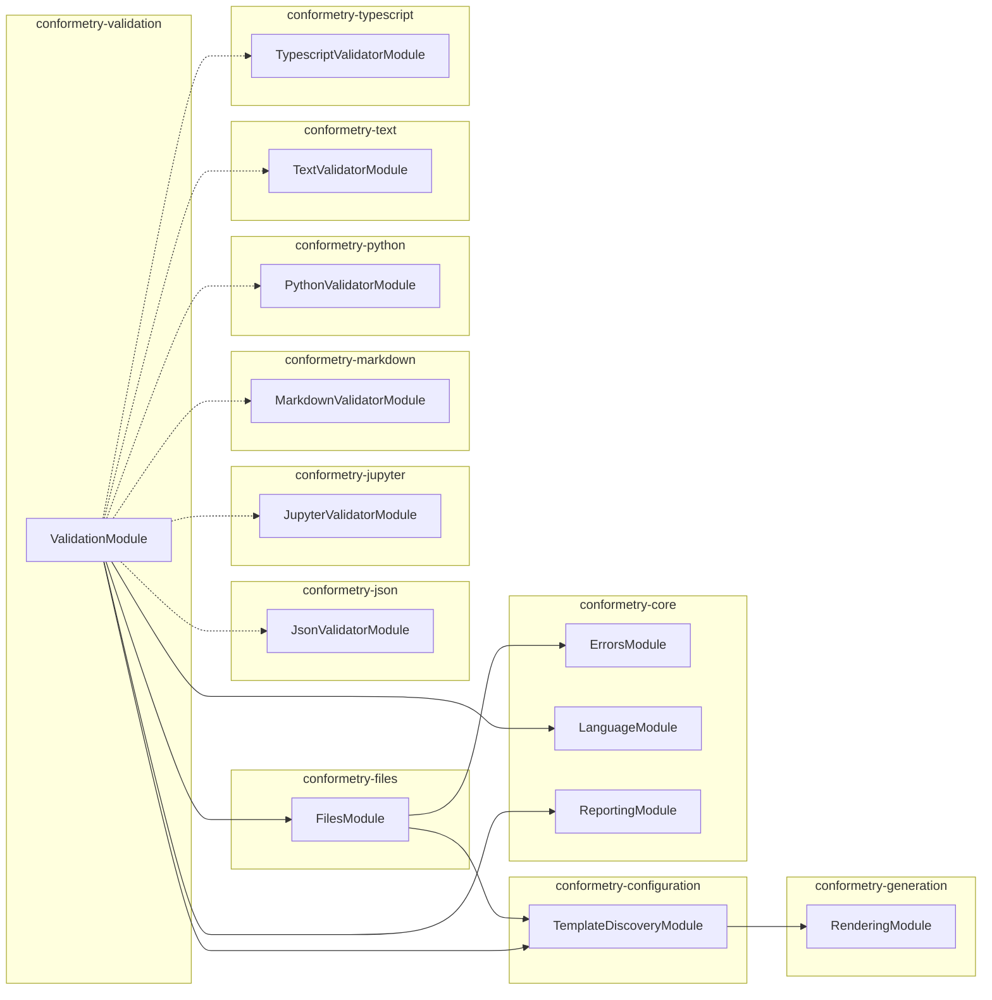

# 👔 Conformetry Validation

The validation orchestrator for [Conformetry](../conformetry-cli/README.md):
it matches candidates to templates, checks the declared files exist, routes
each document to the validator that claims its extension, and deduplicates
what comes back.

```bash
npm install --save-dev @conformetry/validation
```

## Usage

```ts
import { ValidationService } from "@conformetry/validation";

const result = await validationService.validate({
  candidates, // from DiscoveryService.resolveCandidates
  templates, // from DiscoveryService.collectTemplate
  languageNames: ["typescript"], // optional filter
});
// → { ok, fileResults, checkedPaths, unmatched }
```

Candidates arrive from the caller. This package used to scan the workspace for
`project.json` files and infer scope from generator name suffixes, which made a
generic package depend on one repository's layout.

## Order of checks

1. **Files exist.** Every file the matched template declares is checked first,
   whatever its extension. A missing file cannot be compared, and reporting it
   once is clearer than every language reporting it in turn. See
   [`@conformetry/files`](../conformetry-files/README.md).
2. **Documents compare.** Each validator sees only the documents whose
   extensions it claims.

Candidates that matched no template are reported alongside the content
differences rather than skipped, so one report covers both "this file is wrong"
and "conformetry cannot tell what this path was generated from".

## Lazy language loading

Which language packages exist is a static table keyed by extension, so a run
can decide whether it needs `@conformetry/python` without importing it first.
Only the packages a run's templates actually call for are loaded.

| Extensions | Package |
| ---------- | ------- |
| `.ts`, `.tsx` | `@conformetry/typescript` |
| `.md` | `@conformetry/markdown` |
| `.py` | `@conformetry/python` |
| `.json`, `.jsonc` | `@conformetry/json` |
| `.ipynb` | `@conformetry/jupyter` |
| everything else | `@conformetry/text` |

`@conformetry/text` is a required dependency rather than an optional one: it is
the floor, so an extension nobody claims is still compared line by line instead
of going unchecked. Pass `loadLanguageModule` to supply your own loader.

## Project Graph

Where this project sits in the Nx project graph: what it depends on, and what depends on it. Regenerated by `nx run synchronization:synchronize --configuration=write`.

<!-- nx-project-graph-start -->



<!-- nx-project-graph-end -->

## Module Graph

The modules this project defines and the imports between them, regenerated by `nx run synchronization:synchronize --configuration=write`.

<!-- nestjs-module-graph-start -->



_Dotted edges are modules named for a runtime load rather than imported._

<!-- nestjs-module-graph-end -->

## Exports

`ValidationService`, `ValidationLanguagesService`,
`ValidationDeduplicationService`, `ValidationFindingsService`,
`ValidationModule`, `MissingLanguagePackageError`, and the
`RunValidationArguments`, `RunValidationResult`, `InstanceFileResults`, and
`LanguageModuleLoader` types.

## Test

```bash
nx run conformetry-validation:vitest
```

## License

MIT — see [LICENSE](../../LICENSE).

<!-- CALL_STACKS_START -->

## 🔭 Callidescope

Call stacks traced through `conformetry-validation`, deepest first. Each frame shows what it takes, what it returns, and what its documentation says.

| Measure | Value |
| --- | --- |
| Callables | 38 |
| Files | 11 |
| Calls traced | 38 |
| Call stacks | 0 |
| Deepest stack | 0 |
| Stacks through recursion | 0 |
| Unfollowable calls | 3 |

### Call stacks

None.

### Module spread

None.

### Possibly misplaced

None.
<!-- CALL_STACKS_END -->
