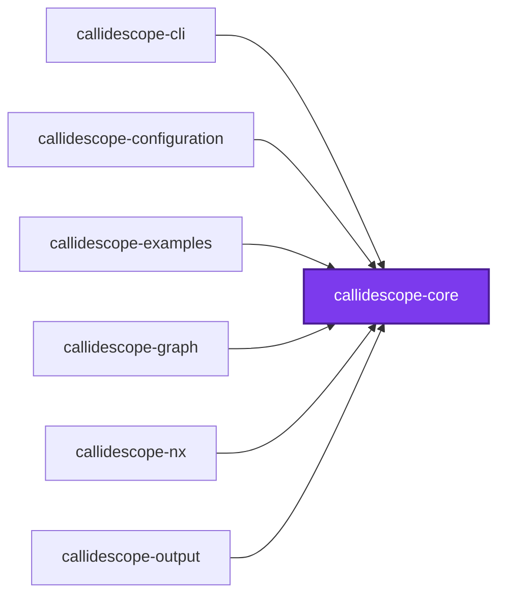
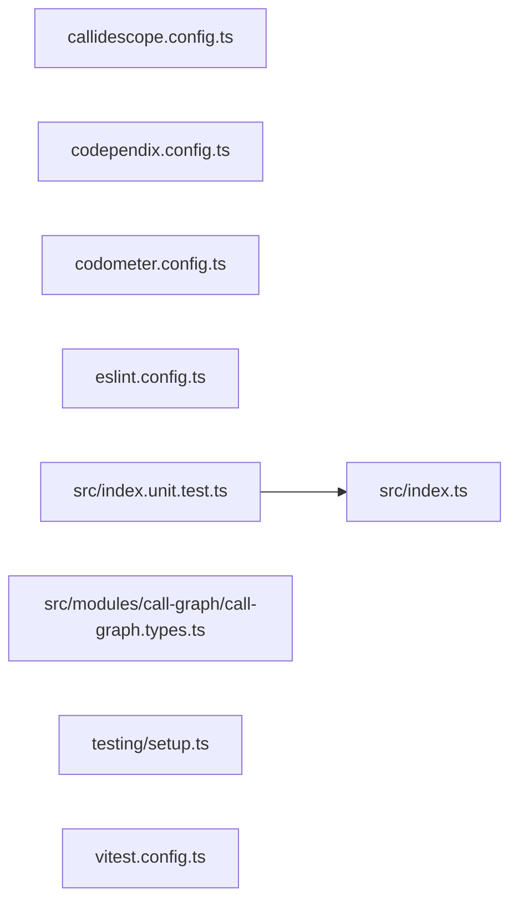

# 🔭 Callidescope Core

**The domain vocabulary every other Callidescope package speaks.**

This package is the contracts leaf of the Callidescope spine: it declares what a
run produces — call graphs, stacks, frames, findings — and depends on nothing.
It holds no service and no NestJS module, so importing a result type never drags
a configuration loader or a TypeScript program behind it.

```bash
npm install --save-dev @callidescope/core
```

## What This Package Owns

- **`call-graph`** — the result and finding vocabulary: `CallGraphResult`,
  `ProjectReport`, `CallStack`, `StackFrame`, `CallableNode`, `CallEdge`,
  `DeepStackFinding`, `WideCallableFinding`, and the identifiers and locations
  they are built from

The sharp test for what belongs here: a type describing **what the tool
produced** is core; a type describing **what the user wrote in
`callidescope.config.ts`** belongs in
[`@callidescope/configuration`](../callidescope-configuration/README.md).

## Test

```bash
nx run callidescope-core:vitest
```

## 👔 Conformetry

No conformetry template describes a contracts-only package yet, so this one is
held to no template and carries no `conformetry-validate` target. It
deliberately does **not** claim `framework:nestjs` to obtain one: it declares no
service and depends on no NestJS package, and a `src/modules/<name>/` holding
only types matches three module templates equally well and fails as ambiguous.
A contracts template is tracked as follow-up work in the conformetry toolchain.

## 🕸️ Codependix

Dependency graphs exported by [codependix](https://github.com/JimmyPaolini/codebase/tree/main/packages/ic-suite/codependix/codependix-cli), regenerated by `nx run codebase:codependix:write`.

### Nx Neighborhood

<!-- codependix:start name="codependix-nx-projects" -->

<!-- codependix:end name="codependix-nx-projects" -->

### File Imports

<!-- codependix:start name="codependix-file-imports" -->

<!-- codependix:end name="codependix-file-imports" -->
