<!-- CALL_STACKS_START -->

# 🔭 Callidescope

| Measure | Value |
| --- | --- |
| Callables | 365 |
| Files | 143 |
| Calls traced | 322 |
| Call stacks | 107 |
| Deepest stack | 9 |
| Stacks through recursion | 1 |
| Unfollowable calls | 21 |

## Projects

| Project | Deepest | Limit | Headroom | Widest |
| --- | --- | --- | --- | --- |
| `packages/ic-suite/callidescope/callidescope-examples` | 8 | 5 | -3 | 2 |
| `packages/ic-suite/callidescope/callidescope-examples/examples/gated-leaf` | 4 | 3 | -1 | 3 |
| `packages/logger` | 5 | 4 | -1 | 2 |
| `packages/ic-suite/codependix/codependix-configuration` | 7 | 7 | 0 | 4 |
| `packages/ic-suite/codometer/codometer-configuration` | 9 | 9 | 0 | 4 |
| `packages/ic-suite/callidescope/callidescope-configuration` | 7 | 8 | 1 | 7 |
| `packages/ic-suite/codependix/codependix-core` | 0 | 1 | 1 | 0 |
| `packages/ic-suite/codometer/codometer-core` | 0 | 1 | 1 | 0 |
| `packages/ic-suite/callidescope/callidescope-core` | 0 | 17 | 17 | 0 |

## Depth headroom

| Headroom | Projects |
| --- | --- |
| over limit | 3 |
| 0 — at limit | 2 |
| 1 | 1 |
| 2–3 | 0 |
| 4+ | 0 |
| no stacks | 3 |

## Call stacks over the depth limit (7)

```mermaid
flowchart LR
  n0(["ComputedMemberService.dispatch"])
  n1["ComputedMemberService.read"]
  n2["ComputedMemberService.normalize"]
  n3["ComputedMemberService.route"]
  n4["ComputedMemberService.select"]
  n5["ComputedMemberService.prepare"]
  n6["ComputedMemberService.choose"]
  n7["ComputedMemberService.apply"]
  n8(["DeepStackService.quote"])
  n9["DeepStackService.validate"]
  n10["DeepStackService.removeDiscount"]
  n11["DeepStackService.resolveTier"]
  n12["DeepStackService.loadRate"]
  n13["DeepStackService.applyTax"]
  n14["DeepStackService.convertCurrency"]
  n15["roundToCents"]
  n16(["ForwardingStackService.handle"])
  n17["ForwardingStackService.process"]
  n18["ForwardingStackService.execute"]
  n19["ForwardingStackService.forward"]
  n20["ForwardingStackService.perform"]
  n21["ForwardingStackService.relay"]
  n22["ForwardingStackService.finish"]
  n23(["FrameAnnotationsService.trace"])
  n24["FrameAnnotationsService.render"]
  n25["FrameAnnotationsService.summarize"]
  n26["FrameAnnotationsService.describe"]
  n27["FrameAnnotationsService.compose"]
  n28["FrameAnnotationsService.collapseThisSignatureBecauseItRunsLong"]
  n29["FrameAnnotationsService.finish"]
  n30(["ProjectDepthLimitService.judge"])
  n31["ProjectDepthLimitService.resolveConfiguration"]
  n32["ProjectDepthLimitService.readLimit"]
  n33["ProjectDepthLimitService.applyLimit"]
  n34["ProjectDepthLimitService.reportVerdict"]
  n35["ProjectDepthLimitService.readDeclaringFile"]
  n36(["LoggerService.log"])
  n37["LoggerService.info"]
  n38["LoggerService.buildBindings"]
  n39["LoggerService.assertConventionalMessage"]
  n40["LoggerService.isConventionalVerb"]
  n41(["GatedLeafService.read"])
  n42["GatedLeafService.parse"]
  n43["GatedLeafService.normalize"]
  n44["GatedLeafService.finish"]
  n0 --> n1
  n1 --> n2
  n2 --> n3
  n3 --> n4
  n4 --> n5
  n5 --> n6
  n6 --> n7
  n8 --> n9
  n9 --> n10
  n10 --> n11
  n11 --> n12
  n12 --> n13
  n13 --> n14
  n14 --> n15
  n16 --> n17
  n17 --> n18
  n18 --> n19
  n19 --> n20
  n20 --> n21
  n21 --> n22
  n22 --> n15
  n23 --> n24
  n24 --> n25
  n25 --> n26
  n26 --> n27
  n27 --> n28
  n28 --> n29
  n30 --> n31
  n31 --> n32
  n32 --> n33
  n33 --> n34
  n34 --> n35
  n36 --> n37
  n37 --> n38
  n38 --> n39
  n39 --> n40
  n41 --> n42
  n42 --> n43
  n43 --> n44
```

## Callables over the breadth limit (1)

| Callable | Breadth | Calls directly | Location |
| --- | --- | --- | --- |
| `GatedLeafService.read` | 3 | `GatedLeafService.parse`, `GatedLeafService.normalize`, `GatedLeafService.finish` | `packages/ic-suite/callidescope/callidescope-examples/examples/gated-leaf/gated-leaf.ts:40` |

<!-- CALL_STACKS_END -->
