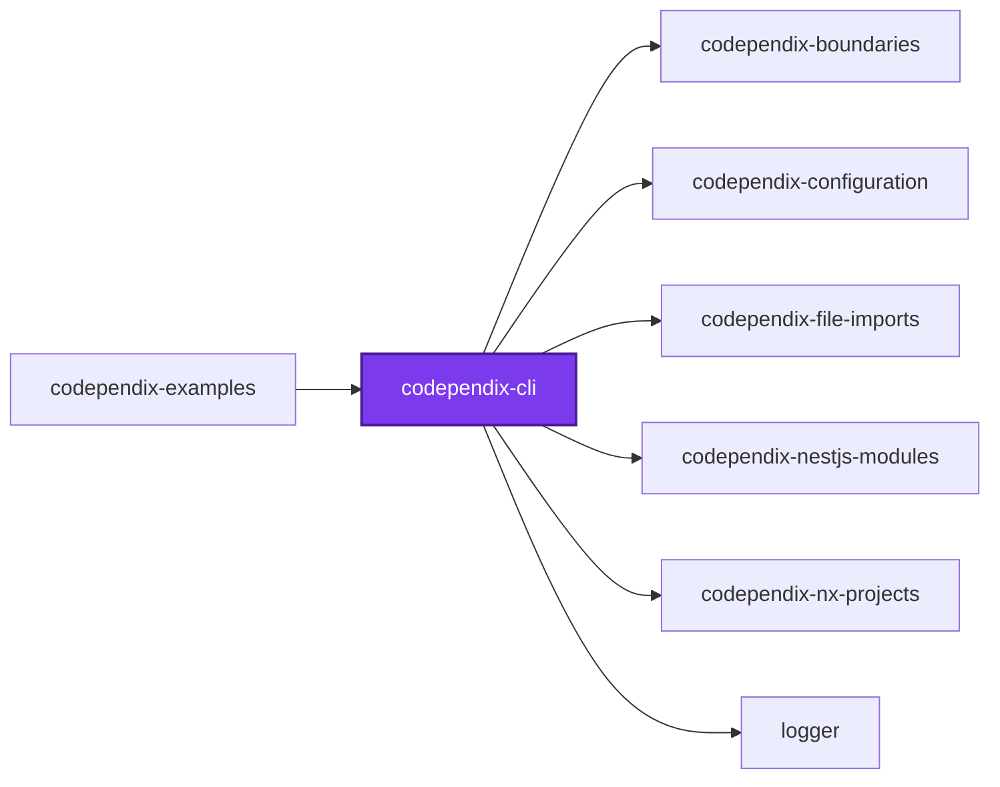
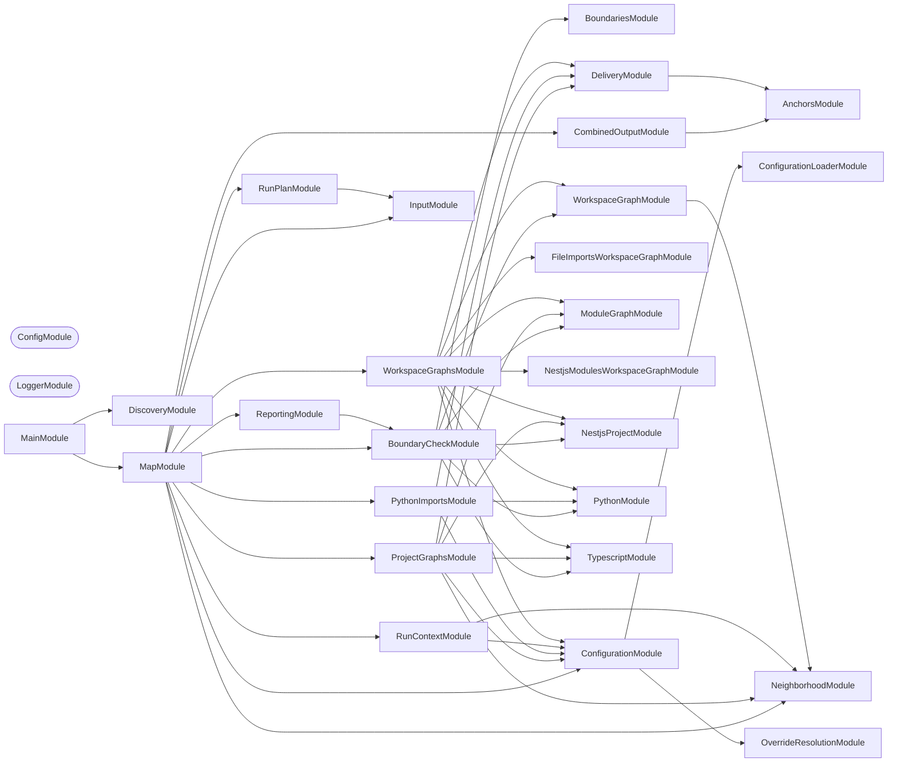

# 🕸️ Codependix CLI

**Exports a project's dependency graphs — Nx, NestJS, and file-level imports — as JSON and Markdown diagrams, and gates the rules those graphs are judged against.**

Codependix reads what each project depends on and renders it four ways: the
Nx project graph, a NestJS project's module graph, a TypeScript project's own
file-level import graph, and a Python project's own file-level import graph.
Each graph is delivered to whichever destinations
`codependix.config.ts` names for that project — a JSON file, a Markdown anchor
block spliced into an existing file such as a `README.md`, or both. The same
built graphs are then judged against whatever rules the configuration
declares — see [`@codependix/boundaries`](../codependix-boundaries/README.md).

```bash
pnpm add --filter <project> --save-dev @codependix/cli
```

```bash
codependix map --write
```

## Usage

One command, `map`, and no per-graph-type subcommand. Which graphs run for a
project, where its export lands, and which rules judge it is entirely a
function of the configuration file; see
[`configuration/codependix.config.ts`](../../configuration/codependix.config.ts)
for this repository's own.

| Flag | Meaning |
| ---- | ------- |
| `--check [check]` | Fail on a comma-separated set drawn from `boundaries` and `reports` |
| `--config [config]` | Path to a `codependix.config.ts`. Searched for upward from `--directory` when omitted |
| `-d, --directory [directory]` | Workspace root whose Nx project graph this run reads. Defaults to the working directory |
| `--exclude [exclude]` | Comma-separated globs overriding the configured `exclude`. Refused when `exclude` was never configured |
| `--file-imports` | Build, check, and write the `fileImports` graph type for this run |
| `--no-file-imports` | Skip the `fileImports` graph type for this run |
| `-f, --format [format]` | What to print to standard output, one of `json` and `markdown` (default: `markdown`). A graph type prints only when the run also configured a workspace destination for it, even if its own toggle flag enabled it |
| `--include [include]` | Comma-separated globs overriding the configured `include`. Refused when `include` was never configured |
| `--json-output [jsonOutput]` | Write every active graph type's data, combined into one JSON file at this path, keyed by graph type name. A type appears only when the run also configured a workspace destination for it |
| `--markdown-output [markdownOutput]` | Write every active graph type's rendered diagram, combined into one Markdown file at this path. A type appears only when the run also configured a workspace destination for it |
| `--nestjs-modules` | Build, check, and write the `nestjsModules` graph type for this run |
| `--no-nestjs-modules` | Skip the `nestjsModules` graph type for this run |
| `--nx-projects` | Build, check, and write the `nxProjects` graph type for this run |
| `--no-nx-projects` | Skip the `nxProjects` graph type for this run |
| `--projects [projects]` | Comma-separated project names or roots to export for, as globs, beyond those `include` already selects. Also narrows the Workspace Graph and `--check boundaries` to the named set |
| `--tags [tags]` | Comma-separated Nx tags to export for, beyond what `include` already selects. Also narrows the Workspace Graph and `--check boundaries` to the tagged projects |
| `--write` | Writes every configured export |

### The two `--check` names

`--check` names which finding fails the run, because the two findings belong
on opposite sides of a pull request.

| `--check` value | What fails the run |
| --------------- | ------------------ |
| `boundaries` | An edge, or a cycle, breaking a declared rule |
| `reports` | A configured destination no longer holding what a fresh run would write |

A boundary violation is caused by the branch and fixed by the branch, so it
gates every pull request. A stale export moves with the workspace it
describes and would fail every branch that changed a project graph rather
than anything the branch itself did, so it is published on the default branch
and gated nowhere. That is the same split
[`callidescope`](../callidescope-cli/README.md) makes between `--check depth`
and `--check reports`, and `reports` is deliberately spelled the same in both:
it is the same finding, and two names for it would make the two reports
unreadable together.

- `--check boundaries` reads no destination and writes nothing, so it leaves
  every committed export exactly as it found it.
- `--write --check boundaries` is legal — a boundary has no destination to be
  stale.
- `--write --check reports` is refused: an export cannot be stale in the run
  that just wrote it.
- A bare `--check`, or one whose value is only separators, is refused. Read as
  "gate nothing" it would be a gate that cannot fail, which is worse than no
  gate at all because it looks like protection.

### When no mode is named

Naming neither `--check` nor `--write` is asked about, as a three-item menu —
`boundaries`, `reports`, `write`.

There is no flag that turns the prompt off, because there is nothing to turn
off where it cannot be answered: a run whose stdin is not a terminal fails
immediately, naming the flag it wanted, rather than drawing a menu. That
refusal is load-bearing rather than defensive — `prompts` does not fail on a
non-terminal stdin. It renders the menu, never resolves, and lets the process
exit 0, which would turn a scripted run that forgot its mode flag into a
silent success that wrote nothing. Dismissing the menu at a terminal is
reported the same way, as a rejected command line rather than a crash.

No mode is ever inferred, which is the rule `codometer`'s and
`callidescope`'s flags follow too.

```bash
nx run codebase:codependix:check
nx run codebase:codependix:write
```

One project failing — a missing anchor, or a NestJS project that fails to
boot its container — is reported and does not stop the rest: `--write` either
fully succeeds or names exactly which projects failed while still completing
every other one.

## Packages

| Package | Role |
| ------- | ---- |
| [`@codependix/cli`](.) | Orchestrates the four graph builders and delivers their exports |
| [`@codependix/boundaries`](../codependix-boundaries/README.md) | Builds each level's graph for a workspace, judges it against the declared rules, and reports what breaks them. `--check boundaries` delegates to it wholesale |
| [`@codependix/configuration`](../codependix-configuration/README.md) | Reads `codependix.config.ts` and resolves per-project export destinations and boundary rules |
| [`@codependix/examples`](../codependix-examples/README.md) | Sixteen subjects built to be graphed, each with the guide codependix renders from it |
| [`@codependix/nx-projects`](../codependix-nx-projects/README.md) | Builds a project's Nx Neighborhood and the whole-workspace Workspace Graph |
| [`@codependix/nestjs-modules`](../codependix-nestjs-modules/README.md) | Explores a NestJS project's container and builds its module graph |
| [`@codependix/file-imports`](../codependix-file-imports/README.md) | Builds a project's file-level import graph — a `typescript` module walking its own `ts.Program`, and a `python` module parsing `import`/`from ... import` statements |

## Examples

Every behavior described above — and every one that is not, because it lived
only in a JSDoc comment until now — has a worked example rendered by the real
tool in
[`packages/ic-suite/codependix/codependix-examples`](../codependix-examples/README.md):

- [README](../codependix-examples/README.md) — one directory per example, each
  readable on its own, plus configuring a first export destination and adopting
  codependix in a workspace with no anchor blocks anywhere yet
- [AGENTS.md](../codependix-examples/AGENTS.md) — a "codependix said X → open
  this example" table, weighted toward the refusals and toward `--check`
  staleness

## Start

```bash
nx run codependix-cli:start
```

## Test

```bash
nx run codependix-cli:vitest
```

## 👔 Conformetry

This project was generated from the [nestjs-command-project](../../configuration/conformetry-templates/nestjs-command-project) conformetry template.

## 🕸️ Codependix

Dependency graphs exported by [codependix](https://github.com/JimmyPaolini/codebase/tree/main/packages/ic-suite/codependix/codependix-cli), regenerated by `nx run codebase:codependix:write`.

### Nx Neighborhood

<!-- codependix:start name="codependix-nx-projects" -->

<!-- codependix:end name="codependix-nx-projects" -->

### NestJS Module Graph

<!-- codependix:start name="codependix-nestjs-modules" -->


_Rounded modules are global: every module can inject them, so their edges are left out._
<!-- codependix:end name="codependix-nestjs-modules" -->

### File Imports

<!-- codependix:start name="codependix-file-imports" -->
```mermaid
graph LR
  file_callidescope_config_ts["callidescope.config.ts"]
  file_codependix_config_ts["codependix.config.ts"]
  file_codometer_config_ts["codometer.config.ts"]
  file_eslint_config_ts["eslint.config.ts"]
  file_src_constants_ts["src/constants.ts"]
  file_src_index_ts["src/index.ts"]
  file_src_index_unit_test_ts["src/index.unit.test.ts"]
  file_src_main_end_to_end_test_ts["src/main.end-to-end.test.ts"]
  file_src_main_module_ts["src/main.module.ts"]
  file_src_main_ts["src/main.ts"]
  file_src_modules_anchors_anchors_constants_ts["src/modules/anchors/anchors.constants.ts"]
  file_src_modules_anchors_anchors_module_ts["src/modules/anchors/anchors.module.ts"]
  file_src_modules_anchors_anchors_module_unit_test_ts["src/modules/anchors/anchors.module.unit.test.ts"]
  file_src_modules_anchors_anchors_service_ts["src/modules/anchors/anchors.service.ts"]
  file_src_modules_anchors_anchors_service_unit_test_ts["src/modules/anchors/anchors.service.unit.test.ts"]
  file_src_modules_anchors_anchors_types_ts["src/modules/anchors/anchors.types.ts"]
  file_src_modules_combined_output_combined_output_constants_ts["src/modules/combined-output/combined-output.constants.ts"]
  file_src_modules_combined_output_combined_output_module_ts["src/modules/combined-output/combined-output.module.ts"]
  file_src_modules_combined_output_combined_output_module_unit_test_ts["src/modules/combined-output/combined-output.module.unit.test.ts"]
  file_src_modules_combined_output_combined_output_service_ts["src/modules/combined-output/combined-output.service.ts"]
  file_src_modules_combined_output_combined_output_service_unit_test_ts["src/modules/combined-output/combined-output.service.unit.test.ts"]
  file_src_modules_combined_output_combined_output_types_ts["src/modules/combined-output/combined-output.types.ts"]
  file_src_modules_delivery_delivery_constants_ts["src/modules/delivery/delivery.constants.ts"]
  file_src_modules_delivery_delivery_module_ts["src/modules/delivery/delivery.module.ts"]
  file_src_modules_delivery_delivery_module_unit_test_ts["src/modules/delivery/delivery.module.unit.test.ts"]
  file_src_modules_delivery_delivery_service_ts["src/modules/delivery/delivery.service.ts"]
  file_src_modules_delivery_delivery_service_unit_test_ts["src/modules/delivery/delivery.service.unit.test.ts"]
  file_src_modules_delivery_delivery_types_ts["src/modules/delivery/delivery.types.ts"]
  file_src_modules_map_map_command_integration_test_ts["src/modules/map/map.command.integration.test.ts"]
  file_src_modules_map_map_command_ts["src/modules/map/map.command.ts"]
  file_src_modules_map_map_command_unit_test_ts["src/modules/map/map.command.unit.test.ts"]
  file_src_modules_map_map_constants_ts["src/modules/map/map.constants.ts"]
  file_src_modules_map_map_module_ts["src/modules/map/map.module.ts"]
  file_src_modules_map_map_module_unit_test_ts["src/modules/map/map.module.unit.test.ts"]
  file_src_modules_map_map_service_ts["src/modules/map/map.service.ts"]
  file_src_modules_map_map_service_unit_test_ts["src/modules/map/map.service.unit.test.ts"]
  file_src_modules_map_map_types_ts["src/modules/map/map.types.ts"]
  file_src_modules_project_graphs_project_graphs_constants_ts["src/modules/project-graphs/project-graphs.constants.ts"]
  file_src_modules_project_graphs_project_graphs_module_ts["src/modules/project-graphs/project-graphs.module.ts"]
  file_src_modules_project_graphs_project_graphs_module_unit_test_ts["src/modules/project-graphs/project-graphs.module.unit.test.ts"]
  file_src_modules_project_graphs_project_graphs_service_ts["src/modules/project-graphs/project-graphs.service.ts"]
  file_src_modules_project_graphs_project_graphs_service_unit_test_ts["src/modules/project-graphs/project-graphs.service.unit.test.ts"]
  file_src_modules_project_graphs_project_graphs_types_ts["src/modules/project-graphs/project-graphs.types.ts"]
  file_src_modules_python_imports_python_imports_constants_ts["src/modules/python-imports/python-imports.constants.ts"]
  file_src_modules_python_imports_python_imports_module_ts["src/modules/python-imports/python-imports.module.ts"]
  file_src_modules_python_imports_python_imports_module_unit_test_ts["src/modules/python-imports/python-imports.module.unit.test.ts"]
  file_src_modules_python_imports_python_imports_service_ts["src/modules/python-imports/python-imports.service.ts"]
  file_src_modules_python_imports_python_imports_service_unit_test_ts["src/modules/python-imports/python-imports.service.unit.test.ts"]
  file_src_modules_python_imports_python_imports_types_ts["src/modules/python-imports/python-imports.types.ts"]
  file_src_modules_reporting_reporting_constants_ts["src/modules/reporting/reporting.constants.ts"]
  file_src_modules_reporting_reporting_module_ts["src/modules/reporting/reporting.module.ts"]
  file_src_modules_reporting_reporting_module_unit_test_ts["src/modules/reporting/reporting.module.unit.test.ts"]
  file_src_modules_reporting_reporting_service_ts["src/modules/reporting/reporting.service.ts"]
  file_src_modules_reporting_reporting_service_unit_test_ts["src/modules/reporting/reporting.service.unit.test.ts"]
  file_src_modules_reporting_reporting_types_ts["src/modules/reporting/reporting.types.ts"]
  file_src_modules_run_context_run_context_constants_ts["src/modules/run-context/run-context.constants.ts"]
  file_src_modules_run_context_run_context_module_ts["src/modules/run-context/run-context.module.ts"]
  file_src_modules_run_context_run_context_module_unit_test_ts["src/modules/run-context/run-context.module.unit.test.ts"]
  file_src_modules_run_context_run_context_service_ts["src/modules/run-context/run-context.service.ts"]
  file_src_modules_run_context_run_context_service_unit_test_ts["src/modules/run-context/run-context.service.unit.test.ts"]
  file_src_modules_run_context_run_context_types_ts["src/modules/run-context/run-context.types.ts"]
  file_src_modules_run_plan_run_plan_constants_ts["src/modules/run-plan/run-plan.constants.ts"]
  file_src_modules_run_plan_run_plan_module_ts["src/modules/run-plan/run-plan.module.ts"]
  file_src_modules_run_plan_run_plan_module_unit_test_ts["src/modules/run-plan/run-plan.module.unit.test.ts"]
  file_src_modules_run_plan_run_plan_service_ts["src/modules/run-plan/run-plan.service.ts"]
  file_src_modules_run_plan_run_plan_service_unit_test_ts["src/modules/run-plan/run-plan.service.unit.test.ts"]
  file_src_modules_run_plan_run_plan_types_ts["src/modules/run-plan/run-plan.types.ts"]
  file_src_modules_workspace_graphs_workspace_graphs_constants_ts["src/modules/workspace-graphs/workspace-graphs.constants.ts"]
  file_src_modules_workspace_graphs_workspace_graphs_module_ts["src/modules/workspace-graphs/workspace-graphs.module.ts"]
  file_src_modules_workspace_graphs_workspace_graphs_module_unit_test_ts["src/modules/workspace-graphs/workspace-graphs.module.unit.test.ts"]
  file_src_modules_workspace_graphs_workspace_graphs_service_ts["src/modules/workspace-graphs/workspace-graphs.service.ts"]
  file_src_modules_workspace_graphs_workspace_graphs_service_unit_test_ts["src/modules/workspace-graphs/workspace-graphs.service.unit.test.ts"]
  file_src_modules_workspace_graphs_workspace_graphs_types_ts["src/modules/workspace-graphs/workspace-graphs.types.ts"]
  file_src_repl_ts["src/repl.ts"]
  file_src_repl_unit_test_ts["src/repl.unit.test.ts"]
  file_testing_mocks_ts["testing/mocks.ts"]
  file_testing_setup_ts["testing/setup.ts"]
  file_vitest_config_ts["vitest.config.ts"]
  file_src_index_unit_test_ts --> file_src_index_ts
  file_src_main_end_to_end_test_ts --> file_src_constants_ts
  file_src_main_module_ts --> file_src_constants_ts
  file_src_main_module_ts --> file_src_modules_map_map_module_ts
  file_src_main_ts --> file_src_main_module_ts
  file_src_modules_anchors_anchors_module_ts --> file_src_modules_anchors_anchors_service_ts
  file_src_modules_anchors_anchors_module_unit_test_ts --> file_src_modules_anchors_anchors_module_ts
  file_src_modules_anchors_anchors_module_unit_test_ts --> file_src_modules_anchors_anchors_service_ts
  file_src_modules_anchors_anchors_service_ts --> file_src_modules_anchors_anchors_constants_ts
  file_src_modules_anchors_anchors_service_ts --> file_src_modules_anchors_anchors_types_ts
  file_src_modules_anchors_anchors_service_unit_test_ts --> file_src_modules_anchors_anchors_constants_ts
  file_src_modules_anchors_anchors_service_unit_test_ts --> file_src_modules_anchors_anchors_service_ts
  file_src_modules_combined_output_combined_output_constants_ts --> file_src_modules_map_map_constants_ts
  file_src_modules_combined_output_combined_output_module_ts --> file_src_modules_anchors_anchors_module_ts
  file_src_modules_combined_output_combined_output_module_ts --> file_src_modules_combined_output_combined_output_service_ts
  file_src_modules_combined_output_combined_output_module_unit_test_ts --> file_src_modules_combined_output_combined_output_module_ts
  file_src_modules_combined_output_combined_output_module_unit_test_ts --> file_src_modules_combined_output_combined_output_service_ts
  file_src_modules_combined_output_combined_output_service_ts --> file_src_modules_anchors_anchors_service_ts
  file_src_modules_combined_output_combined_output_service_ts --> file_src_modules_combined_output_combined_output_constants_ts
  file_src_modules_combined_output_combined_output_service_ts --> file_src_modules_combined_output_combined_output_types_ts
  file_src_modules_combined_output_combined_output_service_ts --> file_src_modules_delivery_delivery_constants_ts
  file_src_modules_combined_output_combined_output_service_ts --> file_src_modules_map_map_constants_ts
  file_src_modules_combined_output_combined_output_service_ts --> file_src_modules_map_map_types_ts
  file_src_modules_combined_output_combined_output_service_unit_test_ts --> file_src_modules_anchors_anchors_service_ts
  file_src_modules_combined_output_combined_output_service_unit_test_ts --> file_src_modules_combined_output_combined_output_service_ts
  file_src_modules_combined_output_combined_output_service_unit_test_ts --> file_src_modules_map_map_types_ts
  file_src_modules_combined_output_combined_output_types_ts --> file_src_modules_combined_output_combined_output_constants_ts
  file_src_modules_combined_output_combined_output_types_ts --> file_src_modules_map_map_types_ts
  file_src_modules_delivery_delivery_module_ts --> file_src_modules_anchors_anchors_module_ts
  file_src_modules_delivery_delivery_module_ts --> file_src_modules_delivery_delivery_service_ts
  file_src_modules_delivery_delivery_module_unit_test_ts --> file_src_modules_delivery_delivery_module_ts
  file_src_modules_delivery_delivery_module_unit_test_ts --> file_src_modules_delivery_delivery_service_ts
  file_src_modules_delivery_delivery_service_ts --> file_src_modules_anchors_anchors_constants_ts
  file_src_modules_delivery_delivery_service_ts --> file_src_modules_anchors_anchors_service_ts
  file_src_modules_delivery_delivery_service_ts --> file_src_modules_delivery_delivery_constants_ts
  file_src_modules_delivery_delivery_service_ts --> file_src_modules_delivery_delivery_types_ts
  file_src_modules_delivery_delivery_service_unit_test_ts --> file_src_modules_anchors_anchors_constants_ts
  file_src_modules_delivery_delivery_service_unit_test_ts --> file_src_modules_anchors_anchors_service_ts
  file_src_modules_delivery_delivery_service_unit_test_ts --> file_src_modules_delivery_delivery_service_ts
  file_src_modules_map_map_command_integration_test_ts --> file_src_main_module_ts
  file_src_modules_map_map_command_integration_test_ts --> file_src_modules_map_map_command_ts
  file_src_modules_map_map_command_integration_test_ts --> file_src_modules_map_map_types_ts
  file_src_modules_map_map_command_ts --> file_src_modules_combined_output_combined_output_constants_ts
  file_src_modules_map_map_command_ts --> file_src_modules_combined_output_combined_output_service_ts
  file_src_modules_map_map_command_ts --> file_src_modules_combined_output_combined_output_types_ts
  file_src_modules_map_map_command_ts --> file_src_modules_map_map_service_ts
  file_src_modules_map_map_command_ts --> file_src_modules_map_map_types_ts
  file_src_modules_map_map_command_ts --> file_src_modules_reporting_reporting_service_ts
  file_src_modules_map_map_command_ts --> file_src_modules_run_context_run_context_service_ts
  file_src_modules_map_map_command_ts --> file_src_modules_run_plan_run_plan_constants_ts
  file_src_modules_map_map_command_ts --> file_src_modules_run_plan_run_plan_service_ts
  file_src_modules_map_map_command_ts --> file_src_modules_run_plan_run_plan_types_ts
  file_src_modules_map_map_command_unit_test_ts --> file_src_modules_combined_output_combined_output_service_ts
  file_src_modules_map_map_command_unit_test_ts --> file_src_modules_delivery_delivery_types_ts
  file_src_modules_map_map_command_unit_test_ts --> file_src_modules_map_map_command_ts
  file_src_modules_map_map_command_unit_test_ts --> file_src_modules_map_map_service_ts
  file_src_modules_map_map_command_unit_test_ts --> file_src_modules_map_map_types_ts
  file_src_modules_map_map_command_unit_test_ts --> file_src_modules_reporting_reporting_service_ts
  file_src_modules_map_map_command_unit_test_ts --> file_src_modules_run_context_run_context_service_ts
  file_src_modules_map_map_command_unit_test_ts --> file_src_modules_run_plan_run_plan_constants_ts
  file_src_modules_map_map_command_unit_test_ts --> file_src_modules_run_plan_run_plan_service_ts
  file_src_modules_map_map_command_unit_test_ts --> file_src_modules_run_plan_run_plan_types_ts
  file_src_modules_map_map_constants_ts --> file_src_modules_delivery_delivery_types_ts
  file_src_modules_map_map_constants_ts --> file_src_modules_map_map_types_ts
  file_src_modules_map_map_module_ts --> file_src_modules_combined_output_combined_output_module_ts
  file_src_modules_map_map_module_ts --> file_src_modules_map_map_command_ts
  file_src_modules_map_map_module_ts --> file_src_modules_map_map_service_ts
  file_src_modules_map_map_module_ts --> file_src_modules_project_graphs_project_graphs_module_ts
  file_src_modules_map_map_module_ts --> file_src_modules_python_imports_python_imports_module_ts
  file_src_modules_map_map_module_ts --> file_src_modules_reporting_reporting_module_ts
  file_src_modules_map_map_module_ts --> file_src_modules_run_context_run_context_module_ts
  file_src_modules_map_map_module_ts --> file_src_modules_run_plan_run_plan_module_ts
  file_src_modules_map_map_module_ts --> file_src_modules_workspace_graphs_workspace_graphs_module_ts
  file_src_modules_map_map_module_unit_test_ts --> file_src_modules_map_map_command_ts
  file_src_modules_map_map_module_unit_test_ts --> file_src_modules_map_map_module_ts
  file_src_modules_map_map_module_unit_test_ts --> file_src_modules_map_map_service_ts
  file_src_modules_map_map_service_ts --> file_src_modules_delivery_delivery_types_ts
  file_src_modules_map_map_service_ts --> file_src_modules_map_map_constants_ts
  file_src_modules_map_map_service_ts --> file_src_modules_map_map_types_ts
  file_src_modules_map_map_service_ts --> file_src_modules_project_graphs_project_graphs_service_ts
  file_src_modules_map_map_service_ts --> file_src_modules_python_imports_python_imports_service_ts
  file_src_modules_map_map_service_ts --> file_src_modules_workspace_graphs_workspace_graphs_service_ts
  file_src_modules_map_map_service_ts --> file_src_modules_workspace_graphs_workspace_graphs_types_ts
  file_src_modules_map_map_service_unit_test_ts --> file_src_modules_delivery_delivery_types_ts
  file_src_modules_map_map_service_unit_test_ts --> file_src_modules_map_map_service_ts
  file_src_modules_map_map_service_unit_test_ts --> file_src_modules_map_map_types_ts
  file_src_modules_map_map_service_unit_test_ts --> file_src_modules_project_graphs_project_graphs_service_ts
  file_src_modules_map_map_service_unit_test_ts --> file_src_modules_python_imports_python_imports_service_ts
  file_src_modules_map_map_service_unit_test_ts --> file_src_modules_workspace_graphs_workspace_graphs_service_ts
  file_src_modules_map_map_types_ts --> file_src_modules_delivery_delivery_types_ts
  file_src_modules_project_graphs_project_graphs_module_ts --> file_src_modules_delivery_delivery_module_ts
  file_src_modules_project_graphs_project_graphs_module_ts --> file_src_modules_project_graphs_project_graphs_service_ts
  file_src_modules_project_graphs_project_graphs_module_unit_test_ts --> file_src_modules_project_graphs_project_graphs_module_ts
  file_src_modules_project_graphs_project_graphs_module_unit_test_ts --> file_src_modules_project_graphs_project_graphs_service_ts
  file_src_modules_project_graphs_project_graphs_service_ts --> file_src_modules_delivery_delivery_service_ts
  file_src_modules_project_graphs_project_graphs_service_ts --> file_src_modules_delivery_delivery_types_ts
  file_src_modules_project_graphs_project_graphs_service_ts --> file_src_modules_map_map_constants_ts
  file_src_modules_project_graphs_project_graphs_service_ts --> file_src_modules_map_map_types_ts
  file_src_modules_project_graphs_project_graphs_service_unit_test_ts --> file_src_modules_anchors_anchors_service_ts
  file_src_modules_project_graphs_project_graphs_service_unit_test_ts --> file_src_modules_delivery_delivery_service_ts
  file_src_modules_project_graphs_project_graphs_service_unit_test_ts --> file_src_modules_map_map_types_ts
  file_src_modules_project_graphs_project_graphs_service_unit_test_ts --> file_src_modules_project_graphs_project_graphs_service_ts
  file_src_modules_python_imports_python_imports_module_ts --> file_src_modules_delivery_delivery_module_ts
  file_src_modules_python_imports_python_imports_module_ts --> file_src_modules_python_imports_python_imports_service_ts
  file_src_modules_python_imports_python_imports_module_unit_test_ts --> file_src_modules_python_imports_python_imports_module_ts
  file_src_modules_python_imports_python_imports_module_unit_test_ts --> file_src_modules_python_imports_python_imports_service_ts
  file_src_modules_python_imports_python_imports_service_ts --> file_src_modules_delivery_delivery_service_ts
  file_src_modules_python_imports_python_imports_service_ts --> file_src_modules_delivery_delivery_types_ts
  file_src_modules_python_imports_python_imports_service_ts --> file_src_modules_map_map_constants_ts
  file_src_modules_python_imports_python_imports_service_ts --> file_src_modules_map_map_types_ts
  file_src_modules_python_imports_python_imports_service_unit_test_ts --> file_src_modules_anchors_anchors_service_ts
  file_src_modules_python_imports_python_imports_service_unit_test_ts --> file_src_modules_delivery_delivery_service_ts
  file_src_modules_python_imports_python_imports_service_unit_test_ts --> file_src_modules_map_map_types_ts
  file_src_modules_python_imports_python_imports_service_unit_test_ts --> file_src_modules_python_imports_python_imports_service_ts
  file_src_modules_reporting_reporting_module_ts --> file_src_modules_reporting_reporting_service_ts
  file_src_modules_reporting_reporting_module_unit_test_ts --> file_src_modules_reporting_reporting_module_ts
  file_src_modules_reporting_reporting_module_unit_test_ts --> file_src_modules_reporting_reporting_service_ts
  file_src_modules_reporting_reporting_service_ts --> file_src_modules_delivery_delivery_types_ts
  file_src_modules_reporting_reporting_service_ts --> file_src_modules_map_map_types_ts
  file_src_modules_reporting_reporting_service_unit_test_ts --> file_src_modules_delivery_delivery_types_ts
  file_src_modules_reporting_reporting_service_unit_test_ts --> file_src_modules_map_map_types_ts
  file_src_modules_reporting_reporting_service_unit_test_ts --> file_src_modules_reporting_reporting_service_ts
  file_src_modules_run_context_run_context_module_ts --> file_src_modules_run_context_run_context_service_ts
  file_src_modules_run_context_run_context_module_unit_test_ts --> file_src_modules_run_context_run_context_module_ts
  file_src_modules_run_context_run_context_module_unit_test_ts --> file_src_modules_run_context_run_context_service_ts
  file_src_modules_run_context_run_context_service_ts --> file_src_modules_delivery_delivery_types_ts
  file_src_modules_run_context_run_context_service_ts --> file_src_modules_map_map_types_ts
  file_src_modules_run_context_run_context_service_unit_test_ts --> file_src_modules_run_context_run_context_service_ts
  file_src_modules_run_plan_run_plan_module_ts --> file_src_modules_run_plan_run_plan_service_ts
  file_src_modules_run_plan_run_plan_module_unit_test_ts --> file_src_modules_run_plan_run_plan_module_ts
  file_src_modules_run_plan_run_plan_module_unit_test_ts --> file_src_modules_run_plan_run_plan_service_ts
  file_src_modules_run_plan_run_plan_service_ts --> file_src_modules_map_map_types_ts
  file_src_modules_run_plan_run_plan_service_ts --> file_src_modules_run_plan_run_plan_constants_ts
  file_src_modules_run_plan_run_plan_service_ts --> file_src_modules_run_plan_run_plan_types_ts
  file_src_modules_run_plan_run_plan_service_unit_test_ts --> file_src_modules_run_plan_run_plan_constants_ts
  file_src_modules_run_plan_run_plan_service_unit_test_ts --> file_src_modules_run_plan_run_plan_service_ts
  file_src_modules_run_plan_run_plan_service_unit_test_ts --> file_src_modules_run_plan_run_plan_types_ts
  file_src_modules_workspace_graphs_workspace_graphs_module_ts --> file_src_modules_delivery_delivery_module_ts
  file_src_modules_workspace_graphs_workspace_graphs_module_ts --> file_src_modules_workspace_graphs_workspace_graphs_service_ts
  file_src_modules_workspace_graphs_workspace_graphs_module_unit_test_ts --> file_src_modules_workspace_graphs_workspace_graphs_module_ts
  file_src_modules_workspace_graphs_workspace_graphs_module_unit_test_ts --> file_src_modules_workspace_graphs_workspace_graphs_service_ts
  file_src_modules_workspace_graphs_workspace_graphs_service_ts --> file_src_modules_delivery_delivery_service_ts
  file_src_modules_workspace_graphs_workspace_graphs_service_ts --> file_src_modules_delivery_delivery_types_ts
  file_src_modules_workspace_graphs_workspace_graphs_service_ts --> file_src_modules_map_map_constants_ts
  file_src_modules_workspace_graphs_workspace_graphs_service_ts --> file_src_modules_map_map_types_ts
  file_src_modules_workspace_graphs_workspace_graphs_service_ts --> file_src_modules_workspace_graphs_workspace_graphs_types_ts
  file_src_modules_workspace_graphs_workspace_graphs_service_unit_test_ts --> file_src_modules_anchors_anchors_service_ts
  file_src_modules_workspace_graphs_workspace_graphs_service_unit_test_ts --> file_src_modules_delivery_delivery_service_ts
  file_src_modules_workspace_graphs_workspace_graphs_service_unit_test_ts --> file_src_modules_map_map_constants_ts
  file_src_modules_workspace_graphs_workspace_graphs_service_unit_test_ts --> file_src_modules_map_map_types_ts
  file_src_modules_workspace_graphs_workspace_graphs_service_unit_test_ts --> file_src_modules_workspace_graphs_workspace_graphs_service_ts
  file_src_modules_workspace_graphs_workspace_graphs_types_ts --> file_src_modules_delivery_delivery_types_ts
  file_src_modules_workspace_graphs_workspace_graphs_types_ts --> file_src_modules_map_map_types_ts
  file_src_repl_ts --> file_src_main_module_ts
```
<!-- codependix:end name="codependix-file-imports" -->

<!-- CALL_STACKS_START -->

## 🔭 Callidescope

Call stacks traced through `packages/ic-suite/codependix/codependix-cli`, deepest first. Each frame shows what it takes, what it returns, and what its documentation says.

| Measure | Value |
| --- | --- |
| Callables | 130 |
| Files | 51 |
| Calls traced | 182 |
| Call stacks | 13 |
| Deepest stack | 15 |
| Stacks through recursion | 0 |
| Unfollowable calls | 3 |

### Limits

What this project is judged against, as declared in its own `callidescope.config.ts`.

| Limit | Value |
| --- | --- |
| `maximumDepth` | 15 |
| `maximumBreadth` | 7 |

### Call stacks (depth)

**1. `MapCommand.run`** — depth ≥ 15 · decorated-method

```text
🚀 MapCommand.run(_passedParameters: string[], options?: MapCommandOptions): Promise<void> [packages/ic-suite/codependix/codependix-cli/src/modules/map/map.command.ts:376]
   ↳ Runs whatever the command line asked for: exports, boundaries, or both.
  └─> MapCommand.runMode(…): Promise<void> [packages/ic-suite/codependix/codependix-cli/src/modules/map/map.command.ts:124]
     ↳ Runs the passes a resolved mode selected, and reports what they found.
    └─> MapCommand.runExports(context: GraphRunContext): Promise<MapRunResult> [packages/ic-suite/codependix/codependix-cli/src/modules/map/map.command.ts:109]
       ↳ Runs the export pass, warning first when it can select nothing.
      └─> MapService.run(context: GraphRunContext): Promise<MapRunResult> [packages/ic-suite/codependix/codependix-cli/src/modules/map/map.service.ts:147]
         ↳ Runs every configured graph export against an already-resolved context.
        └─> MapService.runPythonImportGraphs(context: GraphRunContext): GraphRunOutcome [packages/ic-suite/codependix/codependix-cli/src/modules/map/map.service.ts:269]
           ↳ Builds and delivers every configured Python file-level import graph export.
          └─> PythonImportsService.runGraphs(context: GraphRunContext): GraphRunOutcome [packages/ic-suite/codependix/codependix-cli/src/modules/python-imports/python-imports.service.ts:137]
             ↳ Builds and delivers every configured Python file-level import graph export.
            └─> PythonImportsService.runProject(…): ProjectRunResult [packages/ic-suite/codependix/codependix-cli/src/modules/python-imports/python-imports.service.ts:101]
               ↳ Builds, renders, and delivers one project's Python import graph.
              └─> PythonService.buildGraph(project: PythonProject): PythonImportGraph [packages/ic-suite/codependix/codependix-file-imports/src/modules/python/python.service.ts:39]
                 ↳ Builds a Python project's internal file-level import Graph.
                └─> PythonImportGraphService.buildGraph(project: PythonProject): PythonImportGraph [packages/ic-suite/codependix/codependix-file-imports/src/modules/python/python-import-graph.service.ts:180]
                   ↳ Builds a Python project's internal file-level import Graph.
                  └─> PythonImportGraphService.flatMap(…)(this: undefined, sourceFileName: string): PythonImportGraphEdge[] [packages/ic-suite/codependix/codependix-file-imports/src/modules/python/python-import-graph.service.ts:185]
                    └─> PythonImportGraphService.collectEdgesForFile(…): PythonImportGraphEdge[] [packages/ic-suite/codependix/codependix-file-imports/src/modules/python/python-import-graph.service.ts:64]
                       ↳ Collects every internal import edge one source file declares.
                      └─> PythonImportParserService.parseImportSpecifiers(source: string): PythonImportSpecifier[] [packages/ic-suite/codependix/codependix-file-imports/src/modules/python/python-import-parser.service.ts:158]
                         ↳ Parses every module-level import statement in a Python source file.
                        └─> PythonImportParserService.parseStatement(statement: string): PythonImportSpecifier[] [packages/ic-suite/codependix/codependix-file-imports/src/modules/python/python-import-parser.service.ts:126]
                           ↳ Parses one joined statement into the module(s) it names.
                          └─> PythonImportParserService.parseImportStatement(statement: string): PythonImportSpecifier[] [packages/ic-suite/codependix/codependix-file-imports/src/modules/python/python-import-parser.service.ts:105]
                             ↳ Parses a joined `import <specifiers>` statement.
                            └─> PythonImportParserService.map(…)(modulePath: string): { level: number; modulePath: string; } [packages/ic-suite/codependix/codependix-file-imports/src/modules/python/python-import-parser.service.ts:122]
```

**2. `MapService.build`** — depth ≥ 11 · orphan-root

```text
🚀 MapService.build(): WorkspaceGraphRunOutcome [packages/ic-suite/codependix/codependix-cli/src/modules/map/map.service.ts:195]
  └─> WorkspaceGraphsService.runFileImportsWorkspaceGraph(context: GraphRunContext): WorkspaceGraphRunOutcome [packages/ic-suite/codependix/codependix-cli/src/modules/workspace-graphs/workspace-graphs.service.ts:179]
     ↳ Builds, renders, and delivers the whole-workspace file-level import graph's configured destinations.
    └─> WorkspaceGraphsService.map(…)(project: PythonProject): PythonImportGraph [packages/ic-suite/codependix/codependix-cli/src/modules/workspace-graphs/workspace-graphs.service.ts:197]
      └─> PythonService.buildGraph(project: PythonProject): PythonImportGraph [packages/ic-suite/codependix/codependix-file-imports/src/modules/python/python.service.ts:39]
         ↳ Builds a Python project's internal file-level import Graph.
        └─> PythonImportGraphService.buildGraph(project: PythonProject): PythonImportGraph [packages/ic-suite/codependix/codependix-file-imports/src/modules/python/python-import-graph.service.ts:180]
           ↳ Builds a Python project's internal file-level import Graph.
          └─> PythonImportGraphService.flatMap(…)(this: undefined, sourceFileName: string): PythonImportGraphEdge[] [packages/ic-suite/codependix/codependix-file-imports/src/modules/python/python-import-graph.service.ts:185]
            └─> PythonImportGraphService.collectEdgesForFile(…): PythonImportGraphEdge[] [packages/ic-suite/codependix/codependix-file-imports/src/modules/python/python-import-graph.service.ts:64]
               ↳ Collects every internal import edge one source file declares.
              └─> PythonImportParserService.parseImportSpecifiers(source: string): PythonImportSpecifier[] [packages/ic-suite/codependix/codependix-file-imports/src/modules/python/python-import-parser.service.ts:158]
                 ↳ Parses every module-level import statement in a Python source file.
                └─> PythonImportParserService.parseStatement(statement: string): PythonImportSpecifier[] [packages/ic-suite/codependix/codependix-file-imports/src/modules/python/python-import-parser.service.ts:126]
                   ↳ Parses one joined statement into the module(s) it names.
                  └─> PythonImportParserService.parseImportStatement(statement: string): PythonImportSpecifier[] [packages/ic-suite/codependix/codependix-file-imports/src/modules/python/python-import-parser.service.ts:105]
                     ↳ Parses a joined `import <specifiers>` statement.
                    └─> PythonImportParserService.map(…)(modulePath: string): { level: number; modulePath: string; } [packages/ic-suite/codependix/codependix-file-imports/src/modules/python/python-import-parser.service.ts:122]
```

**3. `MapService.build`** — depth ≥ 10 · orphan-root

```text
🚀 MapService.build(): WorkspaceGraphRunOutcome [packages/ic-suite/codependix/codependix-cli/src/modules/map/map.service.ts:252]
  └─> WorkspaceGraphsService.runNxWorkspaceGraph(context: GraphRunContext): WorkspaceGraphRunOutcome [packages/ic-suite/codependix/codependix-cli/src/modules/workspace-graphs/workspace-graphs.service.ts:275]
     ↳ Renders and delivers the Nx Workspace Graph's configured destinations.
    └─> WorkspaceGraphsService.deliverWorkspaceGraph(…): ProjectRunResult [packages/ic-suite/codependix/codependix-cli/src/modules/workspace-graphs/workspace-graphs.service.ts:135]
       ↳ Delivers one already-built whole-workspace graph's configured destinations, at the workspace root.
      └─> DeliveryService.deliverGraphOutput(args: DeliverGraphOutputArguments): ProjectRunResult [packages/ic-suite/codependix/codependix-cli/src/modules/delivery/delivery.service.ts:271]
         ↳ Delivers whichever destinations a resolved graph output names. `jsonContent`/`markdownContent` are read only when the…
        └─> DeliveryService.deliverMarkdown(…): void [packages/ic-suite/codependix/codependix-cli/src/modules/delivery/delivery.service.ts:143]
           ↳ Delivers a Markdown destination, recording it as stale if needed.
          └─> DeliveryService.deliverAnchoredMarkdown(…): boolean [packages/ic-suite/codependix/codependix-cli/src/modules/delivery/delivery.service.ts:52]
             ↳ Splices content into a named anchor block, or checks it is current.
            └─> AnchorsService.checkAnchor(args: AnchorLocationArguments & { freshContent: string; }): AnchorCheckResult [packages/ic-suite/codependix/codependix-cli/src/modules/anchors/anchors.service.ts:103]
               ↳ Compares a Markdown file's anchor against a freshly computed export. `--check` reads this and reports drift without…
              └─> AnchorsService.extractAnchorContent(args: AnchorLocationArguments): string | undefined [packages/ic-suite/codependix/codependix-cli/src/modules/anchors/anchors.service.ts:120]
                 ↳ Reads a named anchor's current content, or `undefined` when it is absent.
                └─> AnchorsService.buildAnchorPattern(anchorName: string): RegExp [packages/ic-suite/codependix/codependix-cli/src/modules/anchors/anchors.service.ts:59]
                   ↳ Builds the pattern matching a named anchor block and its inner content.
                  └─> AnchorsService.escapeForPattern(value: string): string [packages/ic-suite/codependix/codependix-cli/src/modules/anchors/anchors.service.ts:67]
                     ↳ Escapes a string so it can be embedded literally in a regular expression.
```

<details>
<summary>10 more call stacks</summary>

**4. `MapCommand.parseDirectory`** — depth 3 · decorated-method

```text
🚀 MapCommand.parseDirectory(value: string | undefined): string [packages/ic-suite/codependix/codependix-cli/src/modules/map/map.command.ts:190]
   ↳ Parses the directory whose Nx workspace this run reads.
  └─> InputService.parsePathOption(value: string | undefined): string [packages/ic-suite/codependix/codependix-configuration/src/modules/input/input.service.ts:87]
     ↳ Parses a path option that falls back to the working directory.
    └─> InputService.parseOptionalOption(value: string | undefined): string | undefined [packages/ic-suite/codependix/codependix-configuration/src/modules/input/input.service.ts:75]
       ↳ Trims an optional string option, treating blank as absent.
```

**5. `MapCommand.parseExclude`** — depth 3 · decorated-method

```text
🚀 MapCommand.parseExclude(value: string | undefined): string[] [packages/ic-suite/codependix/codependix-cli/src/modules/map/map.command.ts:206]
   ↳ Parses `--exclude`, a comma-separated list of globs overriding the configured `exclude`.
  └─> InputService.parseCommaDelimitedOption(value: string | undefined): string[] [packages/ic-suite/codependix/codependix-configuration/src/modules/input/input.service.ts:54]
     ↳ Parses a comma-separated list option, dropping blank entries.
    └─> InputService.map(…)(entry: string): string [packages/ic-suite/codependix/codependix-configuration/src/modules/input/input.service.ts:59]
```

**6. `MapCommand.parseInclude`** — depth 3 · decorated-method

```text
🚀 MapCommand.parseInclude(value: string | undefined): string[] [packages/ic-suite/codependix/codependix-cli/src/modules/map/map.command.ts:245]
   ↳ Parses `--include`, a comma-separated list of globs overriding the configured `include`.
  └─> InputService.parseCommaDelimitedOption(value: string | undefined): string[] [packages/ic-suite/codependix/codependix-configuration/src/modules/input/input.service.ts:54]
     ↳ Parses a comma-separated list option, dropping blank entries.
    └─> InputService.map(…)(entry: string): string [packages/ic-suite/codependix/codependix-configuration/src/modules/input/input.service.ts:59]
```

**7. `MapCommand.parseConfig`** — depth 2 · decorated-method

```text
🚀 MapCommand.parseConfig(value: string | undefined): string | undefined [packages/ic-suite/codependix/codependix-cli/src/modules/map/map.command.ts:181]
   ↳ Parses the optional configuration path from command-line input.
  └─> InputService.parseOptionalOption(value: string | undefined): string | undefined [packages/ic-suite/codependix/codependix-configuration/src/modules/input/input.service.ts:75]
     ↳ Trims an optional string option, treating blank as absent.
```

**8. `MapCommand.parseFormat`** — depth 2 · decorated-method

```text
🚀 MapCommand.parseFormat(value: string | undefined): string | undefined [packages/ic-suite/codependix/codependix-cli/src/modules/map/map.command.ts:230]
   ↳ Parses what `--format` prints to standard output.
  └─> InputService.parseOptionalOption(value: string | undefined): string | undefined [packages/ic-suite/codependix/codependix-configuration/src/modules/input/input.service.ts:75]
     ↳ Trims an optional string option, treating blank as absent.
```

**9. `MapCommand.parseJsonOutput`** — depth 2 · decorated-method

```text
🚀 MapCommand.parseJsonOutput(value: string | undefined): string | undefined [packages/ic-suite/codependix/codependix-cli/src/modules/map/map.command.ts:258]
   ↳ Parses `--json-output`, the path to write every active graph type's combined JSON data to, keyed by graph type name.
  └─> InputService.parseOptionalOption(value: string | undefined): string | undefined [packages/ic-suite/codependix/codependix-configuration/src/modules/input/input.service.ts:75]
     ↳ Trims an optional string option, treating blank as absent.
```

**10. `MapCommand.parseMarkdownOutput`** — depth 2 · decorated-method

```text
🚀 MapCommand.parseMarkdownOutput(value: string | undefined): string | undefined [packages/ic-suite/codependix/codependix-cli/src/modules/map/map.command.ts:271]
   ↳ Parses `--markdown-output`, the path to write every active graph type's combined, anchor-spliced Markdown diagram to.
  └─> InputService.parseOptionalOption(value: string | undefined): string | undefined [packages/ic-suite/codependix/codependix-configuration/src/modules/input/input.service.ts:75]
     ↳ Trims an optional string option, treating blank as absent.
```

**11. `MapCommand.parseProjects`** — depth 2 · decorated-method

```text
🚀 MapCommand.parseProjects(value: string | undefined): string | undefined [packages/ic-suite/codependix/codependix-cli/src/modules/map/map.command.ts:335]
   ↳ Parses the projects a run exports for beyond `include`. **Widening, and narrowing.** A named project is added to…
  └─> InputService.parseOptionalOption(value: string | undefined): string | undefined [packages/ic-suite/codependix/codependix-configuration/src/modules/input/input.service.ts:75]
     ↳ Trims an optional string option, treating blank as absent.
```

**12. `MapCommand.parseTags`** — depth 2 · decorated-method

```text
🚀 MapCommand.parseTags(value: string | undefined): string | undefined [packages/ic-suite/codependix/codependix-cli/src/modules/map/map.command.ts:348]
   ↳ Parses the Nx tags a run exports for, matched exactly against a project's own tags.
  └─> InputService.parseOptionalOption(value: string | undefined): string | undefined [packages/ic-suite/codependix/codependix-configuration/src/modules/input/input.service.ts:75]
     ↳ Trims an optional string option, treating blank as absent.
```

**13. `MapCommand.parseWrite`** — depth 2 · decorated-method

```text
🚀 MapCommand.parseWrite(value: boolean | undefined): boolean [packages/ic-suite/codependix/codependix-cli/src/modules/map/map.command.ts:358]
   ↳ Parses the `--write` flag from command-line input.
  └─> InputService.parseFlagOption(value: boolean | undefined): boolean [packages/ic-suite/codependix/codependix-configuration/src/modules/input/input.service.ts:70]
     ↳ Parses a valueless boolean flag, which is present or it is not.
```

</details>

### Breadth

| Callable | Breadth | Calls directly | Location |
| --- | --- | --- | --- |
| `RunContextService.build` | 7 | `ConfigurationService.loadConfiguration`, `NeighborhoodService.readProjectGraph`, `RunContextService.resolveProjectGraphPath`, `NeighborhoodService.readProjects`, `RunContextService.loadProjectConfigurations`, `RunContextService.resolveEnabledGraphTypes`, `RunContextService.selectProjects` | `packages/ic-suite/codependix/codependix-cli/src/modules/run-context/run-context.service.ts:138` |
| `WorkspaceGraphsService.runFileImportsWorkspaceGraph` | 7 | `ConfigurationService.resolveForWorkspace`, `WorkspaceGraphsService.buildTypescriptGraphs`, `WorkspaceGraphsService.map(…)`, `PythonService.discoverProjects`, `FileImportsWorkspaceGraphService.buildWorkspaceGraph`, `FileImportsWorkspaceGraphService.renderMermaid`, `WorkspaceGraphsService.deliverWorkspaceGraph` | `packages/ic-suite/codependix/codependix-cli/src/modules/workspace-graphs/workspace-graphs.service.ts:179` |
| `MapCommand.runMode` | 7 | `RunContextService.build`, `RunPlanService.touchesFiles`, `MapCommand.runExports`, `BoundaryCheckService.run`, `MapCommand.runCombinedOutput`, `ReportingService.reportPassOutcomes`, `ReportingService.reportSuccess` | `packages/ic-suite/codependix/codependix-cli/src/modules/map/map.command.ts:124` |

<details>
<summary>68 more callables</summary>

| Callable | Breadth | Calls directly | Location |
| --- | --- | --- | --- |
| `AnchorsService.replaceAnchorContent` | 6 | `AnchorsService.hasAnchor`, `AnchorNotFoundError.constructor`, `buildStartMarker`, `buildEndMarker`, `AnchorsService.replace(…)`, `AnchorsService.buildAnchorPattern` | `packages/ic-suite/codependix/codependix-cli/src/modules/anchors/anchors.service.ts:178` |
| `ProjectGraphsService.runImportProject` | 6 | `TypescriptService.buildProgram`, `TypescriptService.buildGraph`, `DeliveryService.deliverGraphOutput`, `DeliveryService.renderJson`, `TypescriptService.renderMermaid`, `ProjectGraphsService.buildMarkdownSection` | `packages/ic-suite/codependix/codependix-cli/src/modules/project-graphs/project-graphs.service.ts:131` |
| `ProjectGraphsService.runNestjsProject` | 6 | `NestjsProjectService.exploreProject`, `ModuleGraphService.buildGraph`, `DeliveryService.deliverGraphOutput`, `DeliveryService.renderJson`, `ModuleGraphService.renderMermaid`, `ProjectGraphsService.buildMarkdownSection` | `packages/ic-suite/codependix/codependix-cli/src/modules/project-graphs/project-graphs.service.ts:160` |
| `DeliveryService.deliverAnchoredMarkdown` | 5 | `AnchorNotFoundError.constructor`, `AnchorsService.hasAnchor`, `AnchorsService.checkAnchor`, `DeliveryService.writeAutoCreatedAnchorSection`, `AnchorsService.replaceAnchorContent` | `packages/ic-suite/codependix/codependix-cli/src/modules/delivery/delivery.service.ts:52` |
| `ProjectGraphsService.runNxProject` | 5 | `DeliveryService.deliverGraphOutput`, `DeliveryService.renderJson`, `ProjectGraphsService.buildNeighborhoodJsonExport`, `NeighborhoodService.renderMermaid`, `ProjectGraphsService.buildMarkdownSection` | `packages/ic-suite/codependix/codependix-cli/src/modules/project-graphs/project-graphs.service.ts:189` |
| `PythonImportsService.runProject` | 5 | `PythonService.buildGraph`, `DeliveryService.deliverGraphOutput`, `DeliveryService.renderJson`, `PythonService.renderMermaid`, `PythonImportsService.buildMarkdownSection` | `packages/ic-suite/codependix/codependix-cli/src/modules/python-imports/python-imports.service.ts:101` |
| `WorkspaceGraphsService.runNestjsModulesWorkspaceGraph` | 5 | `ConfigurationService.resolveForWorkspace`, `WorkspaceGraphsService.buildNestjsModuleGraphs`, `NestjsModulesWorkspaceGraphService.buildWorkspaceGraph`, `NestjsModulesWorkspaceGraphService.renderMermaid`, `WorkspaceGraphsService.deliverWorkspaceGraph` | `packages/ic-suite/codependix/codependix-cli/src/modules/workspace-graphs/workspace-graphs.service.ts:231` |
| `MapService.run` | 5 | `MapService.runNxGraphs`, `MapService.runNestjsGraphs`, `MapService.runImportGraphs`, `MapService.runPythonImportGraphs`, `MapService.collectCombinedGraphs` | `packages/ic-suite/codependix/codependix-cli/src/modules/map/map.service.ts:147` |
| `AnchorsService.insertAnchorSection` | 4 | `AnchorsService.wrapInAnchors`, `AnchorsService.escapeForPattern`, `AnchorsService.appendCodependixSection`, `AnchorsService.insertIntoCodependixSection` | `packages/ic-suite/codependix/codependix-cli/src/modules/anchors/anchors.service.ts:144` |
| `CombinedOutputService.run` | 4 | `CombinedOutputService.printConsole`, `CombinedOutputService.writeFile`, `CombinedOutputService.renderJson`, `CombinedOutputService.renderMarkdown` | `packages/ic-suite/codependix/codependix-cli/src/modules/combined-output/combined-output.service.ts:148` |
| `DeliveryService.deliverGraphOutput` | 4 | `DeliveryService.resolveJsonDelivery`, `DeliveryService.resolveMarkdownDelivery`, `DeliveryService.deliverJson`, `DeliveryService.deliverMarkdown` | `packages/ic-suite/codependix/codependix-cli/src/modules/delivery/delivery.service.ts:271` |
| `ProjectGraphsService.runFileImportsProjects` | 4 | `TypescriptService.discoverProjects`, `ProjectGraphsService.resolveProjectOutput`, `ProjectGraphsService.runImportProject`, `ProjectGraphsService.collectProjectFailure` | `packages/ic-suite/codependix/codependix-cli/src/modules/project-graphs/project-graphs.service.ts:220` |
| `ProjectGraphsService.runNestjsModulesProjects` | 4 | `NestjsProjectService.discoverProjects`, `ProjectGraphsService.resolveProjectOutput`, `ProjectGraphsService.runNestjsProject`, `ProjectGraphsService.collectProjectFailure` | `packages/ic-suite/codependix/codependix-cli/src/modules/project-graphs/project-graphs.service.ts:255` |
| `PythonImportsService.runGraphs` | 4 | `PythonService.discoverProjects`, `PythonImportsService.resolveProjectOutput`, `PythonImportsService.runProject`, `PythonImportsService.collectProjectFailure` | `packages/ic-suite/codependix/codependix-cli/src/modules/python-imports/python-imports.service.ts:137` |
| `RunPlanService.readCheckNames` | 4 | `RunPlanService.filter(…)`, `RunPlanService.map(…)`, `RunPlanService.describeAcceptedCheckNames`, `RunPlanService.validateCheckNames` | `packages/ic-suite/codependix/codependix-cli/src/modules/run-plan/run-plan.service.ts:82` |
| `WorkspaceGraphsService.runNxWorkspaceGraph` | 4 | `ConfigurationService.resolveForWorkspace`, `WorkspaceGraphService.buildWorkspaceGraph`, `WorkspaceGraphService.renderMermaid`, `WorkspaceGraphsService.deliverWorkspaceGraph` | `packages/ic-suite/codependix/codependix-cli/src/modules/workspace-graphs/workspace-graphs.service.ts:275` |
| `MapCommand.run` | 4 | `RunPlanService.selectMode`, `CombinedOutputService.resolveFormat`, `MapCommand.runMode`, `ReportingService.reportFailure` | `packages/ic-suite/codependix/codependix-cli/src/modules/map/map.command.ts:376` |
| `AnchorsService.buildAnchorPattern` | 3 | `AnchorsService.escapeForPattern`, `buildStartMarker`, `buildEndMarker` | `packages/ic-suite/codependix/codependix-cli/src/modules/anchors/anchors.service.ts:59` |
| `ProjectGraphsService.runNxProjectsGraphs` | 3 | `ProjectGraphsService.resolveProjectOutput`, `ProjectGraphsService.runNxProject`, `ProjectGraphsService.collectProjectFailure` | `packages/ic-suite/codependix/codependix-cli/src/modules/project-graphs/project-graphs.service.ts:292` |
| `RunPlanService.selectMode` | 3 | `RunPlanService.readCheckNames`, `RunPlanService.emptyMode`, `RunPlanService.promptForMode` | `packages/ic-suite/codependix/codependix-cli/src/modules/run-plan/run-plan.service.ts:137` |
| `WorkspaceGraphsService.buildNestjsModuleGraphs` | 3 | `NestjsProjectService.discoverProjects`, `NestjsProjectService.exploreProject`, `ModuleGraphService.buildGraph` | `packages/ic-suite/codependix/codependix-cli/src/modules/workspace-graphs/workspace-graphs.service.ts:92` |
| `WorkspaceGraphsService.deliverWorkspaceGraph` | 3 | `DeliveryService.deliverGraphOutput`, `DeliveryService.renderJson`, `WorkspaceGraphsService.buildMarkdownSection` | `packages/ic-suite/codependix/codependix-cli/src/modules/workspace-graphs/workspace-graphs.service.ts:135` |
| `MapService.runNestjsGraphs` | 3 | `ProjectGraphsService.runNestjsModulesProjects`, `WorkspaceGraphsService.runNestjsModulesWorkspaceGraph`, `MapService.collectProjectFailure` | `packages/ic-suite/codependix/codependix-cli/src/modules/map/map.service.ts:210` |
| `MapService.runNxGraphs` | 3 | `NeighborhoodService.buildNeighborhoods`, `ProjectGraphsService.runNxProjectsGraphs`, `MapService.collectWorkspaceOutcome` | `packages/ic-suite/codependix/codependix-cli/src/modules/map/map.service.ts:243` |
| `AnchorsService.checkAnchor` | 2 | `AnchorsService.extractAnchorContent`, `AnchorNotFoundError.constructor` | `packages/ic-suite/codependix/codependix-cli/src/modules/anchors/anchors.service.ts:103` |
| `AnchorsService.wrapInAnchors` | 2 | `buildStartMarker`, `buildEndMarker` | `packages/ic-suite/codependix/codependix-cli/src/modules/anchors/anchors.service.ts:196` |
| `CombinedOutputService.printConsole` | 2 | `CombinedOutputService.renderJson`, `CombinedOutputService.renderMarkdown` | `packages/ic-suite/codependix/codependix-cli/src/modules/combined-output/combined-output.service.ts:51` |
| `CombinedOutputService.resolveFormat` | 2 | `CombinedOutputService.find(…)`, `CombinedOutputService.map(…)` | `packages/ic-suite/codependix/codependix-cli/src/modules/combined-output/combined-output.service.ts:116` |
| `DeliveryService.deliverMarkdown` | 2 | `DeliveryService.deliverFile`, `DeliveryService.deliverAnchoredMarkdown` | `packages/ic-suite/codependix/codependix-cli/src/modules/delivery/delivery.service.ts:143` |
| `DeliveryService.writeAutoCreatedAnchorSection` | 2 | `AnchorNotFoundError.constructor`, `AnchorsService.insertAnchorSection` | `packages/ic-suite/codependix/codependix-cli/src/modules/delivery/delivery.service.ts:238` |
| `ProjectGraphsService.resolveProjectOutput` | 2 | `ConfigurationService.resolveForProject`, `ProjectGraphsService.find(…)` | `packages/ic-suite/codependix/codependix-cli/src/modules/project-graphs/project-graphs.service.ts:108` |
| `PythonImportsService.resolveProjectOutput` | 2 | `ConfigurationService.resolveForProject`, `PythonImportsService.find(…)` | `packages/ic-suite/codependix/codependix-cli/src/modules/python-imports/python-imports.service.ts:79` |
| `ReportingService.reportBoundaries` | 2 | `BoundaryReportService.renderSummary`, `BoundaryReportService.renderViolations` | `packages/ic-suite/codependix/codependix-cli/src/modules/reporting/reporting.service.ts:47` |
| `ReportingService.reportOutcome` | 2 | `ReportingService.filter(…)`, `ReportingService.map(…)` | `packages/ic-suite/codependix/codependix-cli/src/modules/reporting/reporting.service.ts:112` |
| `ReportingService.reportPassOutcomes` | 2 | `ReportingService.reportOutcome`, `ReportingService.reportBoundaries` | `packages/ic-suite/codependix/codependix-cli/src/modules/reporting/reporting.service.ts:137` |
| `WorkspaceGraphsService.buildTypescriptGraphs` | 2 | `WorkspaceGraphsService.map(…)`, `TypescriptService.discoverProjects` | `packages/ic-suite/codependix/codependix-cli/src/modules/workspace-graphs/workspace-graphs.service.ts:114` |
| `WorkspaceGraphsService.map(…)` | 2 | `TypescriptService.buildGraph`, `TypescriptService.buildProgram` | `packages/ic-suite/codependix/codependix-cli/src/modules/workspace-graphs/workspace-graphs.service.ts:119` |
| `MapService.runImportGraphs` | 2 | `ProjectGraphsService.runFileImportsProjects`, `MapService.collectWorkspaceOutcome` | `packages/ic-suite/codependix/codependix-cli/src/modules/map/map.service.ts:191` |
| `MapCommand.runExports` | 2 | `ReportingService.reportEmptySelection`, `MapService.run` | `packages/ic-suite/codependix/codependix-cli/src/modules/map/map.command.ts:109` |
| `AnchorsService.extractAnchorContent` | 1 | `AnchorsService.buildAnchorPattern` | `packages/ic-suite/codependix/codependix-cli/src/modules/anchors/anchors.service.ts:120` |
| `AnchorsService.hasAnchor` | 1 | `AnchorsService.buildAnchorPattern` | `packages/ic-suite/codependix/codependix-cli/src/modules/anchors/anchors.service.ts:125` |
| `CombinedOutputService.renderMarkdown` | 1 | `AnchorsService.insertAnchorSection` | `packages/ic-suite/codependix/codependix-cli/src/modules/combined-output/combined-output.service.ts:76` |
| `DeliveryService.deliverFile` | 1 | `DeliveryService.readFileOrEmpty` | `packages/ic-suite/codependix/codependix-cli/src/modules/delivery/delivery.service.ts:109` |
| `DeliveryService.deliverJson` | 1 | `DeliveryService.deliverFile` | `packages/ic-suite/codependix/codependix-cli/src/modules/delivery/delivery.service.ts:123` |
| `RunContextService.loadProjectConfigurations` | 1 | `RunContextService.map(…)` | `packages/ic-suite/codependix/codependix-cli/src/modules/run-context/run-context.service.ts:51` |
| `RunContextService.map(…)` | 1 | `ConfigurationService.loadProjectConfiguration` | `packages/ic-suite/codependix/codependix-cli/src/modules/run-context/run-context.service.ts:56` |
| `RunContextService.resolveEnabledGraphTypes` | 1 | `RunContextService.filter(…)` | `packages/ic-suite/codependix/codependix-cli/src/modules/run-context/run-context.service.ts:78` |
| `RunContextService.selectProjects` | 1 | `RunContextService.filter(…)` | `packages/ic-suite/codependix/codependix-cli/src/modules/run-context/run-context.service.ts:113` |
| `RunContextService.filter(…)` | 1 | `ConfigurationService.isProjectSelected` | `packages/ic-suite/codependix/codependix-cli/src/modules/run-context/run-context.service.ts:118` |
| `RunPlanService.describeAcceptedCheckNames` | 1 | `RunPlanService.map(…)` | `packages/ic-suite/codependix/codependix-cli/src/modules/run-plan/run-plan.service.ts:39` |
| `RunPlanService.promptForMode` | 1 | `InputService.promptForSelect` | `packages/ic-suite/codependix/codependix-cli/src/modules/run-plan/run-plan.service.ts:55` |
| `RunPlanService.validateCheckNames` | 1 | `RunPlanService.describeAcceptedCheckNames` | `packages/ic-suite/codependix/codependix-cli/src/modules/run-plan/run-plan.service.ts:107` |
| `WorkspaceGraphsService.map(…)` | 1 | `PythonService.buildGraph` | `packages/ic-suite/codependix/codependix-cli/src/modules/workspace-graphs/workspace-graphs.service.ts:197` |
| `MapService.collectWorkspaceOutcome` | 1 | `MapService.collectProjectFailure` | `packages/ic-suite/codependix/codependix-cli/src/modules/map/map.service.ts:115` |
| `MapService.build` | 1 | `WorkspaceGraphsService.runFileImportsWorkspaceGraph` | `packages/ic-suite/codependix/codependix-cli/src/modules/map/map.service.ts:195` |
| `MapService.build` | 1 | `WorkspaceGraphsService.runNxWorkspaceGraph` | `packages/ic-suite/codependix/codependix-cli/src/modules/map/map.service.ts:252` |
| `MapService.runPythonImportGraphs` | 1 | `PythonImportsService.runGraphs` | `packages/ic-suite/codependix/codependix-cli/src/modules/map/map.service.ts:269` |
| `MapCommand.runCombinedOutput` | 1 | `CombinedOutputService.run` | `packages/ic-suite/codependix/codependix-cli/src/modules/map/map.command.ts:85` |
| `MapCommand.parseConfig` | 1 | `InputService.parseOptionalOption` | `packages/ic-suite/codependix/codependix-cli/src/modules/map/map.command.ts:181` |
| `MapCommand.parseDirectory` | 1 | `InputService.parsePathOption` | `packages/ic-suite/codependix/codependix-cli/src/modules/map/map.command.ts:190` |
| `MapCommand.parseExclude` | 1 | `InputService.parseCommaDelimitedOption` | `packages/ic-suite/codependix/codependix-cli/src/modules/map/map.command.ts:206` |
| `MapCommand.parseFormat` | 1 | `InputService.parseOptionalOption` | `packages/ic-suite/codependix/codependix-cli/src/modules/map/map.command.ts:230` |
| `MapCommand.parseInclude` | 1 | `InputService.parseCommaDelimitedOption` | `packages/ic-suite/codependix/codependix-cli/src/modules/map/map.command.ts:245` |
| `MapCommand.parseJsonOutput` | 1 | `InputService.parseOptionalOption` | `packages/ic-suite/codependix/codependix-cli/src/modules/map/map.command.ts:258` |
| `MapCommand.parseMarkdownOutput` | 1 | `InputService.parseOptionalOption` | `packages/ic-suite/codependix/codependix-cli/src/modules/map/map.command.ts:271` |
| `MapCommand.parseProjects` | 1 | `InputService.parseOptionalOption` | `packages/ic-suite/codependix/codependix-cli/src/modules/map/map.command.ts:335` |
| `MapCommand.parseTags` | 1 | `InputService.parseOptionalOption` | `packages/ic-suite/codependix/codependix-cli/src/modules/map/map.command.ts:348` |
| `MapCommand.parseWrite` | 1 | `InputService.parseFlagOption` | `packages/ic-suite/codependix/codependix-cli/src/modules/map/map.command.ts:358` |

</details>
<!-- CALL_STACKS_END -->

<!-- CODE_STATISTICS_START -->

## ⏲️ Codometer

### Project


### Measured Targets


### TypeScript


### JavaScript


### Python


### JSON


### YAML


### TOML


### Shell


### SQL


### HCL


### CSS


### Conventions


### Jupyter


### Markdown


<!-- CODE_STATISTICS_END -->
