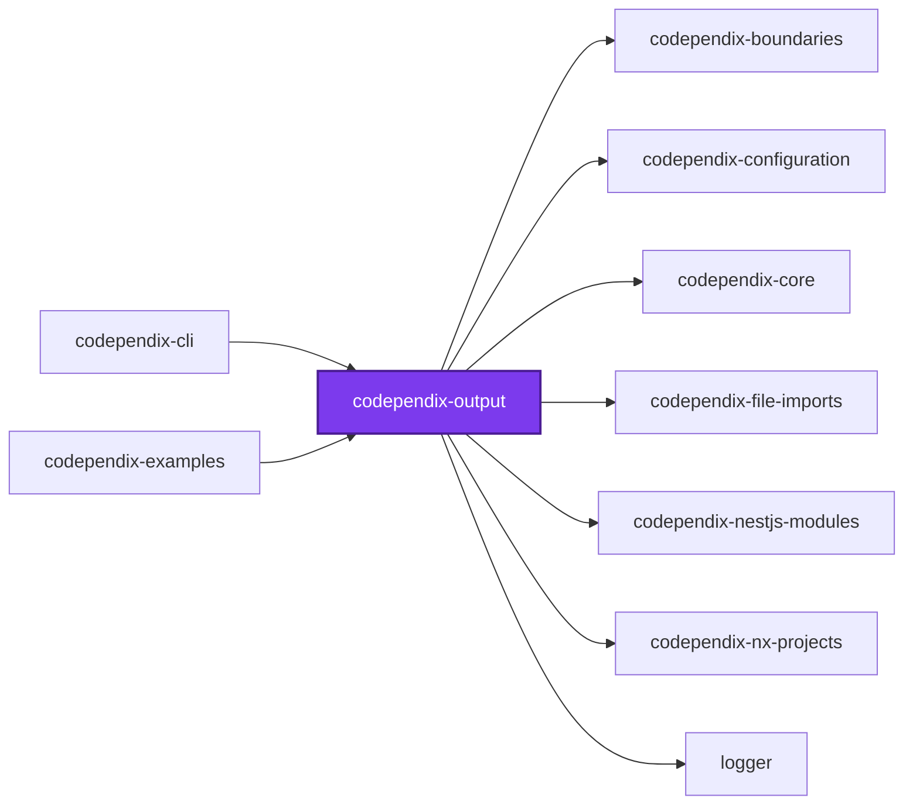

## Test

```bash
nx run codependix-output:vitest
```

## 👔 Conformetry

This project was generated from the [nestjs-service-project](../../configuration/conformetry-templates/nestjs-service-project) conformetry template.

## 🕸️ Codependix

Dependency graphs exported by [codependix](https://github.com/JimmyPaolini/codebase/tree/main/packages/ic-suite/codependix/codependix-cli), regenerated by `nx run codebase:codependix:write`.

### Nx Neighborhood

<!-- codependix:start name="codependix-nx-projects" -->

<!-- codependix:end name="codependix-nx-projects" -->

### NestJS Module Graph

<!-- codependix:start name="codependix-nestjs-modules" -->


_Rounded modules are global: every module can inject them, so their edges are left out._
<!-- codependix:end name="codependix-nestjs-modules" -->

### File Imports

```mermaid
graph LR
  file_callidescope_config_ts["callidescope.config.ts"]
  file_codependix_config_ts["codependix.config.ts"]
  file_codometer_config_ts["codometer.config.ts"]
  file_eslint_config_ts["eslint.config.ts"]
  file_src_index_ts["src/index.ts"]
  file_src_modules_anchors_anchors_constants_ts["src/modules/anchors/anchors.constants.ts"]
  file_src_modules_anchors_anchors_module_ts["src/modules/anchors/anchors.module.ts"]
  file_src_modules_anchors_anchors_module_unit_test_ts["src/modules/anchors/anchors.module.unit.test.ts"]
  file_src_modules_anchors_anchors_service_ts["src/modules/anchors/anchors.service.ts"]
  file_src_modules_anchors_anchors_service_unit_test_ts["src/modules/anchors/anchors.service.unit.test.ts"]
  file_src_modules_anchors_anchors_types_ts["src/modules/anchors/anchors.types.ts"]
  file_src_modules_combined_output_combined_output_constants_ts["src/modules/combined-output/combined-output.constants.ts"]
  file_src_modules_combined_output_combined_output_module_ts["src/modules/combined-output/combined-output.module.ts"]
  file_src_modules_combined_output_combined_output_module_unit_test_ts["src/modules/combined-output/combined-output.module.unit.test.ts"]
  file_src_modules_combined_output_combined_output_service_ts["src/modules/combined-output/combined-output.service.ts"]
  file_src_modules_combined_output_combined_output_service_unit_test_ts["src/modules/combined-output/combined-output.service.unit.test.ts"]
  file_src_modules_combined_output_combined_output_types_ts["src/modules/combined-output/combined-output.types.ts"]
  file_src_modules_delivery_delivery_constants_ts["src/modules/delivery/delivery.constants.ts"]
  file_src_modules_delivery_delivery_module_ts["src/modules/delivery/delivery.module.ts"]
  file_src_modules_delivery_delivery_module_unit_test_ts["src/modules/delivery/delivery.module.unit.test.ts"]
  file_src_modules_delivery_delivery_service_ts["src/modules/delivery/delivery.service.ts"]
  file_src_modules_delivery_delivery_service_unit_test_ts["src/modules/delivery/delivery.service.unit.test.ts"]
  file_src_modules_delivery_delivery_types_ts["src/modules/delivery/delivery.types.ts"]
  file_src_modules_graph_run_graph_run_constants_ts["src/modules/graph-run/graph-run.constants.ts"]
  file_src_modules_graph_run_graph_run_module_ts["src/modules/graph-run/graph-run.module.ts"]
  file_src_modules_graph_run_graph_run_module_unit_test_ts["src/modules/graph-run/graph-run.module.unit.test.ts"]
  file_src_modules_graph_run_graph_run_service_ts["src/modules/graph-run/graph-run.service.ts"]
  file_src_modules_graph_run_graph_run_service_unit_test_ts["src/modules/graph-run/graph-run.service.unit.test.ts"]
  file_src_modules_graph_run_graph_run_types_ts["src/modules/graph-run/graph-run.types.ts"]
  file_src_modules_project_graphs_project_graphs_constants_ts["src/modules/project-graphs/project-graphs.constants.ts"]
  file_src_modules_project_graphs_project_graphs_module_ts["src/modules/project-graphs/project-graphs.module.ts"]
  file_src_modules_project_graphs_project_graphs_module_unit_test_ts["src/modules/project-graphs/project-graphs.module.unit.test.ts"]
  file_src_modules_project_graphs_project_graphs_service_ts["src/modules/project-graphs/project-graphs.service.ts"]
  file_src_modules_project_graphs_project_graphs_service_unit_test_ts["src/modules/project-graphs/project-graphs.service.unit.test.ts"]
  file_src_modules_project_graphs_project_graphs_types_ts["src/modules/project-graphs/project-graphs.types.ts"]
  file_src_modules_python_imports_python_imports_constants_ts["src/modules/python-imports/python-imports.constants.ts"]
  file_src_modules_python_imports_python_imports_module_ts["src/modules/python-imports/python-imports.module.ts"]
  file_src_modules_python_imports_python_imports_module_unit_test_ts["src/modules/python-imports/python-imports.module.unit.test.ts"]
  file_src_modules_python_imports_python_imports_service_ts["src/modules/python-imports/python-imports.service.ts"]
  file_src_modules_python_imports_python_imports_service_unit_test_ts["src/modules/python-imports/python-imports.service.unit.test.ts"]
  file_src_modules_python_imports_python_imports_types_ts["src/modules/python-imports/python-imports.types.ts"]
  file_src_modules_reporting_reporting_constants_ts["src/modules/reporting/reporting.constants.ts"]
  file_src_modules_reporting_reporting_module_ts["src/modules/reporting/reporting.module.ts"]
  file_src_modules_reporting_reporting_module_unit_test_ts["src/modules/reporting/reporting.module.unit.test.ts"]
  file_src_modules_reporting_reporting_service_ts["src/modules/reporting/reporting.service.ts"]
  file_src_modules_reporting_reporting_service_unit_test_ts["src/modules/reporting/reporting.service.unit.test.ts"]
  file_src_modules_reporting_reporting_types_ts["src/modules/reporting/reporting.types.ts"]
  file_src_modules_workspace_graphs_workspace_graphs_constants_ts["src/modules/workspace-graphs/workspace-graphs.constants.ts"]
  file_src_modules_workspace_graphs_workspace_graphs_module_ts["src/modules/workspace-graphs/workspace-graphs.module.ts"]
  file_src_modules_workspace_graphs_workspace_graphs_module_unit_test_ts["src/modules/workspace-graphs/workspace-graphs.module.unit.test.ts"]
  file_src_modules_workspace_graphs_workspace_graphs_service_ts["src/modules/workspace-graphs/workspace-graphs.service.ts"]
  file_src_modules_workspace_graphs_workspace_graphs_service_unit_test_ts["src/modules/workspace-graphs/workspace-graphs.service.unit.test.ts"]
  file_src_modules_workspace_graphs_workspace_graphs_types_ts["src/modules/workspace-graphs/workspace-graphs.types.ts"]
  file_testing_mocks_ts["testing/mocks.ts"]
  file_testing_setup_ts["testing/setup.ts"]
  file_vitest_config_ts["vitest.config.ts"]
  file_src_modules_anchors_anchors_module_ts --> file_src_modules_anchors_anchors_service_ts
  file_src_modules_anchors_anchors_module_unit_test_ts --> file_src_modules_anchors_anchors_module_ts
  file_src_modules_anchors_anchors_module_unit_test_ts --> file_src_modules_anchors_anchors_service_ts
  file_src_modules_anchors_anchors_service_ts --> file_src_modules_anchors_anchors_constants_ts
  file_src_modules_anchors_anchors_service_ts --> file_src_modules_anchors_anchors_types_ts
  file_src_modules_anchors_anchors_service_unit_test_ts --> file_src_modules_anchors_anchors_constants_ts
  file_src_modules_anchors_anchors_service_unit_test_ts --> file_src_modules_anchors_anchors_service_ts
  file_src_modules_combined_output_combined_output_constants_ts --> file_src_modules_graph_run_graph_run_constants_ts
  file_src_modules_combined_output_combined_output_module_ts --> file_src_modules_anchors_anchors_module_ts
  file_src_modules_combined_output_combined_output_module_ts --> file_src_modules_combined_output_combined_output_service_ts
  file_src_modules_combined_output_combined_output_module_unit_test_ts --> file_src_modules_combined_output_combined_output_module_ts
  file_src_modules_combined_output_combined_output_module_unit_test_ts --> file_src_modules_combined_output_combined_output_service_ts
  file_src_modules_combined_output_combined_output_service_ts --> file_src_modules_anchors_anchors_service_ts
  file_src_modules_combined_output_combined_output_service_ts --> file_src_modules_combined_output_combined_output_constants_ts
  file_src_modules_combined_output_combined_output_service_ts --> file_src_modules_combined_output_combined_output_types_ts
  file_src_modules_combined_output_combined_output_service_ts --> file_src_modules_delivery_delivery_constants_ts
  file_src_modules_combined_output_combined_output_service_ts --> file_src_modules_graph_run_graph_run_constants_ts
  file_src_modules_combined_output_combined_output_service_ts --> file_src_modules_graph_run_graph_run_types_ts
  file_src_modules_combined_output_combined_output_service_unit_test_ts --> file_src_modules_anchors_anchors_service_ts
  file_src_modules_combined_output_combined_output_service_unit_test_ts --> file_src_modules_combined_output_combined_output_service_ts
  file_src_modules_combined_output_combined_output_service_unit_test_ts --> file_src_modules_graph_run_graph_run_types_ts
  file_src_modules_combined_output_combined_output_types_ts --> file_src_modules_combined_output_combined_output_constants_ts
  file_src_modules_combined_output_combined_output_types_ts --> file_src_modules_graph_run_graph_run_types_ts
  file_src_modules_delivery_delivery_module_ts --> file_src_modules_anchors_anchors_module_ts
  file_src_modules_delivery_delivery_module_ts --> file_src_modules_delivery_delivery_service_ts
  file_src_modules_delivery_delivery_module_unit_test_ts --> file_src_modules_delivery_delivery_module_ts
  file_src_modules_delivery_delivery_module_unit_test_ts --> file_src_modules_delivery_delivery_service_ts
  file_src_modules_delivery_delivery_service_ts --> file_src_modules_anchors_anchors_constants_ts
  file_src_modules_delivery_delivery_service_ts --> file_src_modules_anchors_anchors_service_ts
  file_src_modules_delivery_delivery_service_ts --> file_src_modules_delivery_delivery_constants_ts
  file_src_modules_delivery_delivery_service_ts --> file_src_modules_delivery_delivery_types_ts
  file_src_modules_delivery_delivery_service_unit_test_ts --> file_src_modules_anchors_anchors_constants_ts
  file_src_modules_delivery_delivery_service_unit_test_ts --> file_src_modules_anchors_anchors_service_ts
  file_src_modules_delivery_delivery_service_unit_test_ts --> file_src_modules_delivery_delivery_service_ts
  file_src_modules_graph_run_graph_run_constants_ts --> file_src_modules_graph_run_graph_run_types_ts
  file_src_modules_graph_run_graph_run_module_ts --> file_src_modules_graph_run_graph_run_service_ts
  file_src_modules_graph_run_graph_run_module_ts --> file_src_modules_project_graphs_project_graphs_module_ts
  file_src_modules_graph_run_graph_run_module_ts --> file_src_modules_python_imports_python_imports_module_ts
  file_src_modules_graph_run_graph_run_module_ts --> file_src_modules_workspace_graphs_workspace_graphs_module_ts
  file_src_modules_graph_run_graph_run_module_unit_test_ts --> file_src_modules_graph_run_graph_run_module_ts
  file_src_modules_graph_run_graph_run_module_unit_test_ts --> file_src_modules_graph_run_graph_run_service_ts
  file_src_modules_graph_run_graph_run_service_ts --> file_src_modules_graph_run_graph_run_constants_ts
  file_src_modules_graph_run_graph_run_service_ts --> file_src_modules_graph_run_graph_run_types_ts
  file_src_modules_graph_run_graph_run_service_ts --> file_src_modules_project_graphs_project_graphs_service_ts
  file_src_modules_graph_run_graph_run_service_ts --> file_src_modules_python_imports_python_imports_service_ts
  file_src_modules_graph_run_graph_run_service_ts --> file_src_modules_workspace_graphs_workspace_graphs_service_ts
  file_src_modules_graph_run_graph_run_service_ts --> file_src_modules_workspace_graphs_workspace_graphs_types_ts
  file_src_modules_graph_run_graph_run_service_unit_test_ts --> file_src_modules_graph_run_graph_run_service_ts
  file_src_modules_graph_run_graph_run_service_unit_test_ts --> file_src_modules_project_graphs_project_graphs_service_ts
  file_src_modules_graph_run_graph_run_service_unit_test_ts --> file_src_modules_python_imports_python_imports_service_ts
  file_src_modules_graph_run_graph_run_service_unit_test_ts --> file_src_modules_workspace_graphs_workspace_graphs_service_ts
  file_src_modules_project_graphs_project_graphs_module_ts --> file_src_modules_delivery_delivery_module_ts
  file_src_modules_project_graphs_project_graphs_module_ts --> file_src_modules_project_graphs_project_graphs_service_ts
  file_src_modules_project_graphs_project_graphs_module_unit_test_ts --> file_src_modules_project_graphs_project_graphs_module_ts
  file_src_modules_project_graphs_project_graphs_module_unit_test_ts --> file_src_modules_project_graphs_project_graphs_service_ts
  file_src_modules_project_graphs_project_graphs_service_ts --> file_src_modules_delivery_delivery_service_ts
  file_src_modules_project_graphs_project_graphs_service_ts --> file_src_modules_graph_run_graph_run_constants_ts
  file_src_modules_project_graphs_project_graphs_service_ts --> file_src_modules_graph_run_graph_run_types_ts
  file_src_modules_project_graphs_project_graphs_service_unit_test_ts --> file_src_modules_anchors_anchors_service_ts
  file_src_modules_project_graphs_project_graphs_service_unit_test_ts --> file_src_modules_delivery_delivery_service_ts
  file_src_modules_project_graphs_project_graphs_service_unit_test_ts --> file_src_modules_project_graphs_project_graphs_service_ts
  file_src_modules_python_imports_python_imports_module_ts --> file_src_modules_delivery_delivery_module_ts
  file_src_modules_python_imports_python_imports_module_ts --> file_src_modules_python_imports_python_imports_service_ts
  file_src_modules_python_imports_python_imports_module_unit_test_ts --> file_src_modules_python_imports_python_imports_module_ts
  file_src_modules_python_imports_python_imports_module_unit_test_ts --> file_src_modules_python_imports_python_imports_service_ts
  file_src_modules_python_imports_python_imports_service_ts --> file_src_modules_delivery_delivery_service_ts
  file_src_modules_python_imports_python_imports_service_ts --> file_src_modules_graph_run_graph_run_constants_ts
  file_src_modules_python_imports_python_imports_service_ts --> file_src_modules_graph_run_graph_run_types_ts
  file_src_modules_python_imports_python_imports_service_unit_test_ts --> file_src_modules_anchors_anchors_service_ts
  file_src_modules_python_imports_python_imports_service_unit_test_ts --> file_src_modules_delivery_delivery_service_ts
  file_src_modules_python_imports_python_imports_service_unit_test_ts --> file_src_modules_python_imports_python_imports_service_ts
  file_src_modules_reporting_reporting_module_ts --> file_src_modules_reporting_reporting_service_ts
  file_src_modules_reporting_reporting_module_unit_test_ts --> file_src_modules_reporting_reporting_module_ts
  file_src_modules_reporting_reporting_module_unit_test_ts --> file_src_modules_reporting_reporting_service_ts
  file_src_modules_reporting_reporting_service_ts --> file_src_modules_graph_run_graph_run_types_ts
  file_src_modules_reporting_reporting_service_unit_test_ts --> file_src_modules_graph_run_graph_run_types_ts
  file_src_modules_reporting_reporting_service_unit_test_ts --> file_src_modules_reporting_reporting_service_ts
  file_src_modules_workspace_graphs_workspace_graphs_module_ts --> file_src_modules_delivery_delivery_module_ts
  file_src_modules_workspace_graphs_workspace_graphs_module_ts --> file_src_modules_workspace_graphs_workspace_graphs_service_ts
  file_src_modules_workspace_graphs_workspace_graphs_module_unit_test_ts --> file_src_modules_workspace_graphs_workspace_graphs_module_ts
  file_src_modules_workspace_graphs_workspace_graphs_module_unit_test_ts --> file_src_modules_workspace_graphs_workspace_graphs_service_ts
  file_src_modules_workspace_graphs_workspace_graphs_service_ts --> file_src_modules_delivery_delivery_service_ts
  file_src_modules_workspace_graphs_workspace_graphs_service_ts --> file_src_modules_graph_run_graph_run_constants_ts
  file_src_modules_workspace_graphs_workspace_graphs_service_ts --> file_src_modules_graph_run_graph_run_types_ts
  file_src_modules_workspace_graphs_workspace_graphs_service_ts --> file_src_modules_workspace_graphs_workspace_graphs_types_ts
  file_src_modules_workspace_graphs_workspace_graphs_service_unit_test_ts --> file_src_modules_anchors_anchors_service_ts
  file_src_modules_workspace_graphs_workspace_graphs_service_unit_test_ts --> file_src_modules_delivery_delivery_service_ts
  file_src_modules_workspace_graphs_workspace_graphs_service_unit_test_ts --> file_src_modules_graph_run_graph_run_constants_ts
  file_src_modules_workspace_graphs_workspace_graphs_service_unit_test_ts --> file_src_modules_workspace_graphs_workspace_graphs_service_ts
  file_src_modules_workspace_graphs_workspace_graphs_types_ts --> file_src_modules_graph_run_graph_run_types_ts
```

<!-- codependix:start name="codependix-file-imports" -->

<!-- codependix:end name="codependix-file-imports" -->

<!-- callidescope:start -->

## 🔭 Callidescope

Call stacks traced through `packages/ic-suite/codependix/codependix-output`, deepest first. Each frame shows what it takes, what it returns, and what its documentation says.

| Measure | Value |
| --- | --- |
| Callables | 84 |
| Files | 38 |
| Calls traced | 136 |
| Call stacks | 2 |
| Deepest stack | 11 |
| Stacks through recursion | 0 |
| Unfollowable calls | 2 |

### Limits

What this project is judged against, as declared in its own `callidescope.config.ts`.

| Limit | Value |
| --- | --- |
| `maximumDepth` | 14 |
| `maximumBreadth` | 7 |

### Call stacks (depth)

**1. `GraphRunService.build`** — depth ≥ 11 · orphan-root

```text
🚀 GraphRunService.build(): WorkspaceGraphRunOutcome [packages/ic-suite/codependix/codependix-output/src/modules/graph-run/graph-run.service.ts:192]
  └─> WorkspaceGraphsService.runFileImportsWorkspaceGraph(context: GraphRunContext): WorkspaceGraphRunOutcome [packages/ic-suite/codependix/codependix-output/src/modules/workspace-graphs/workspace-graphs.service.ts:179]
     ↳ Builds, renders, and delivers the whole-workspace file-level import graph's configured destinations.
    └─> WorkspaceGraphsService.map(…)(project: PythonProject): PythonImportGraph [packages/ic-suite/codependix/codependix-output/src/modules/workspace-graphs/workspace-graphs.service.ts:197]
      └─> PythonService.buildGraph(project: PythonProject): PythonImportGraph [packages/ic-suite/codependix/codependix-file-imports/src/modules/python/python.service.ts:39]
         ↳ Builds a Python project's internal file-level import Graph.
        └─> PythonImportGraphService.buildGraph(project: PythonProject): PythonImportGraph [packages/ic-suite/codependix/codependix-file-imports/src/modules/python/python-import-graph.service.ts:180]
           ↳ Builds a Python project's internal file-level import Graph.
          └─> PythonImportGraphService.flatMap(…)(this: undefined, sourceFileName: string): PythonImportGraphEdge[] [packages/ic-suite/codependix/codependix-file-imports/src/modules/python/python-import-graph.service.ts:185]
            └─> PythonImportGraphService.collectEdgesForFile(…): PythonImportGraphEdge[] [packages/ic-suite/codependix/codependix-file-imports/src/modules/python/python-import-graph.service.ts:64]
               ↳ Collects every internal import edge one source file declares.
              └─> PythonImportParserService.parseImportSpecifiers(source: string): PythonImportSpecifier[] [packages/ic-suite/codependix/codependix-file-imports/src/modules/python/python-import-parser.service.ts:158]
                 ↳ Parses every module-level import statement in a Python source file.
                └─> PythonImportParserService.parseStatement(statement: string): PythonImportSpecifier[] [packages/ic-suite/codependix/codependix-file-imports/src/modules/python/python-import-parser.service.ts:126]
                   ↳ Parses one joined statement into the module(s) it names.
                  └─> PythonImportParserService.parseImportStatement(statement: string): PythonImportSpecifier[] [packages/ic-suite/codependix/codependix-file-imports/src/modules/python/python-import-parser.service.ts:105]
                     ↳ Parses a joined `import <specifiers>` statement.
                    └─> PythonImportParserService.map(…)(modulePath: string): { level: number; modulePath: string; } [packages/ic-suite/codependix/codependix-file-imports/src/modules/python/python-import-parser.service.ts:122]
```

**2. `GraphRunService.build`** — depth ≥ 10 · orphan-root

```text
🚀 GraphRunService.build(): WorkspaceGraphRunOutcome [packages/ic-suite/codependix/codependix-output/src/modules/graph-run/graph-run.service.ts:249]
  └─> WorkspaceGraphsService.runNxWorkspaceGraph(context: GraphRunContext): WorkspaceGraphRunOutcome [packages/ic-suite/codependix/codependix-output/src/modules/workspace-graphs/workspace-graphs.service.ts:275]
     ↳ Renders and delivers the Nx Workspace Graph's configured destinations.
    └─> WorkspaceGraphsService.deliverWorkspaceGraph(…): ProjectRunResult [packages/ic-suite/codependix/codependix-output/src/modules/workspace-graphs/workspace-graphs.service.ts:135]
       ↳ Delivers one already-built whole-workspace graph's configured destinations, at the workspace root.
      └─> DeliveryService.deliverGraphOutput(args: DeliverGraphOutputArguments): ProjectRunResult [packages/ic-suite/codependix/codependix-output/src/modules/delivery/delivery.service.ts:273]
         ↳ Delivers whichever destinations a resolved graph output names. `jsonContent`/`markdownContent` are read only when the…
        └─> DeliveryService.deliverMarkdown(…): void [packages/ic-suite/codependix/codependix-output/src/modules/delivery/delivery.service.ts:145]
           ↳ Delivers a Markdown destination, recording it as stale if needed.
          └─> DeliveryService.deliverAnchoredMarkdown(…): boolean [packages/ic-suite/codependix/codependix-output/src/modules/delivery/delivery.service.ts:54]
             ↳ Splices content into a named anchor block, or checks it is current.
            └─> AnchorsService.checkAnchor(args: AnchorLocationArguments & { freshContent: string; }): AnchorCheckResult [packages/ic-suite/codependix/codependix-output/src/modules/anchors/anchors.service.ts:103]
               ↳ Compares a Markdown file's anchor against a freshly computed export. `--check` reads this and reports drift without…
              └─> AnchorsService.extractAnchorContent(args: AnchorLocationArguments): string | undefined [packages/ic-suite/codependix/codependix-output/src/modules/anchors/anchors.service.ts:120]
                 ↳ Reads a named anchor's current content, or `undefined` when it is absent.
                └─> AnchorsService.buildAnchorPattern(anchorName: string): RegExp [packages/ic-suite/codependix/codependix-output/src/modules/anchors/anchors.service.ts:59]
                   ↳ Builds the pattern matching a named anchor block and its inner content.
                  └─> AnchorsService.escapeForPattern(value: string): string [packages/ic-suite/codependix/codependix-output/src/modules/anchors/anchors.service.ts:67]
                     ↳ Escapes a string so it can be embedded literally in a regular expression.
```

### Breadth

| Callable | Breadth | Calls directly | Location |
| --- | --- | --- | --- |
| `WorkspaceGraphsService.runFileImportsWorkspaceGraph` | 7 | `ConfigurationService.resolveForWorkspace`, `WorkspaceGraphsService.buildTypescriptGraphs`, `WorkspaceGraphsService.map(…)`, `PythonService.discoverProjects`, `FileImportsWorkspaceGraphService.buildWorkspaceGraph`, `FileImportsWorkspaceGraphService.renderMermaid`, `WorkspaceGraphsService.deliverWorkspaceGraph` | `packages/ic-suite/codependix/codependix-output/src/modules/workspace-graphs/workspace-graphs.service.ts:179` |
| `AnchorsService.replaceAnchorContent` | 6 | `AnchorsService.hasAnchor`, `AnchorNotFoundError.constructor`, `buildStartMarker`, `buildEndMarker`, `AnchorsService.replace(…)`, `AnchorsService.buildAnchorPattern` | `packages/ic-suite/codependix/codependix-output/src/modules/anchors/anchors.service.ts:178` |
| `ProjectGraphsService.runImportProject` | 6 | `TypescriptService.buildProgram`, `TypescriptService.buildGraph`, `DeliveryService.deliverGraphOutput`, `DeliveryService.renderJson`, `TypescriptService.renderMermaid`, `ProjectGraphsService.buildMarkdownSection` | `packages/ic-suite/codependix/codependix-output/src/modules/project-graphs/project-graphs.service.ts:131` |

<details>
<summary>43 more callables</summary>

| Callable | Breadth | Calls directly | Location |
| --- | --- | --- | --- |
| `ProjectGraphsService.runNestjsProject` | 6 | `NestjsProjectService.exploreProject`, `ModuleGraphService.buildGraph`, `DeliveryService.deliverGraphOutput`, `DeliveryService.renderJson`, `ModuleGraphService.renderMermaid`, `ProjectGraphsService.buildMarkdownSection` | `packages/ic-suite/codependix/codependix-output/src/modules/project-graphs/project-graphs.service.ts:160` |
| `DeliveryService.deliverAnchoredMarkdown` | 5 | `AnchorNotFoundError.constructor`, `AnchorsService.hasAnchor`, `AnchorsService.checkAnchor`, `DeliveryService.writeAutoCreatedAnchorSection`, `AnchorsService.replaceAnchorContent` | `packages/ic-suite/codependix/codependix-output/src/modules/delivery/delivery.service.ts:54` |
| `ProjectGraphsService.runNxProject` | 5 | `DeliveryService.deliverGraphOutput`, `DeliveryService.renderJson`, `ProjectGraphsService.buildNeighborhoodJsonExport`, `NeighborhoodService.renderMermaid`, `ProjectGraphsService.buildMarkdownSection` | `packages/ic-suite/codependix/codependix-output/src/modules/project-graphs/project-graphs.service.ts:189` |
| `PythonImportsService.runProject` | 5 | `PythonService.buildGraph`, `DeliveryService.deliverGraphOutput`, `DeliveryService.renderJson`, `PythonService.renderMermaid`, `PythonImportsService.buildMarkdownSection` | `packages/ic-suite/codependix/codependix-output/src/modules/python-imports/python-imports.service.ts:99` |
| `WorkspaceGraphsService.runNestjsModulesWorkspaceGraph` | 5 | `ConfigurationService.resolveForWorkspace`, `WorkspaceGraphsService.buildNestjsModuleGraphs`, `NestjsModulesWorkspaceGraphService.buildWorkspaceGraph`, `NestjsModulesWorkspaceGraphService.renderMermaid`, `WorkspaceGraphsService.deliverWorkspaceGraph` | `packages/ic-suite/codependix/codependix-output/src/modules/workspace-graphs/workspace-graphs.service.ts:231` |
| `GraphRunService.run` | 5 | `GraphRunService.runNxGraphs`, `GraphRunService.runNestjsGraphs`, `GraphRunService.runImportGraphs`, `GraphRunService.runPythonImportGraphs`, `GraphRunService.collectCombinedGraphs` | `packages/ic-suite/codependix/codependix-output/src/modules/graph-run/graph-run.service.ts:144` |
| `AnchorsService.insertAnchorSection` | 4 | `AnchorsService.wrapInAnchors`, `AnchorsService.escapeForPattern`, `AnchorsService.appendCodependixSection`, `AnchorsService.insertIntoCodependixSection` | `packages/ic-suite/codependix/codependix-output/src/modules/anchors/anchors.service.ts:144` |
| `CombinedOutputService.run` | 4 | `CombinedOutputService.printConsole`, `CombinedOutputService.writeFile`, `CombinedOutputService.renderJson`, `CombinedOutputService.renderMarkdown` | `packages/ic-suite/codependix/codependix-output/src/modules/combined-output/combined-output.service.ts:148` |
| `DeliveryService.deliverGraphOutput` | 4 | `DeliveryService.resolveJsonDelivery`, `DeliveryService.resolveMarkdownDelivery`, `DeliveryService.deliverJson`, `DeliveryService.deliverMarkdown` | `packages/ic-suite/codependix/codependix-output/src/modules/delivery/delivery.service.ts:273` |
| `ProjectGraphsService.runFileImportsProjects` | 4 | `TypescriptService.discoverProjects`, `ProjectGraphsService.resolveProjectOutput`, `ProjectGraphsService.runImportProject`, `ProjectGraphsService.collectProjectFailure` | `packages/ic-suite/codependix/codependix-output/src/modules/project-graphs/project-graphs.service.ts:220` |
| `ProjectGraphsService.runNestjsModulesProjects` | 4 | `NestjsProjectService.discoverProjects`, `ProjectGraphsService.resolveProjectOutput`, `ProjectGraphsService.runNestjsProject`, `ProjectGraphsService.collectProjectFailure` | `packages/ic-suite/codependix/codependix-output/src/modules/project-graphs/project-graphs.service.ts:255` |
| `PythonImportsService.runGraphs` | 4 | `PythonService.discoverProjects`, `PythonImportsService.resolveProjectOutput`, `PythonImportsService.runProject`, `PythonImportsService.collectProjectFailure` | `packages/ic-suite/codependix/codependix-output/src/modules/python-imports/python-imports.service.ts:135` |
| `WorkspaceGraphsService.runNxWorkspaceGraph` | 4 | `ConfigurationService.resolveForWorkspace`, `WorkspaceGraphService.buildWorkspaceGraph`, `WorkspaceGraphService.renderMermaid`, `WorkspaceGraphsService.deliverWorkspaceGraph` | `packages/ic-suite/codependix/codependix-output/src/modules/workspace-graphs/workspace-graphs.service.ts:275` |
| `AnchorsService.buildAnchorPattern` | 3 | `AnchorsService.escapeForPattern`, `buildStartMarker`, `buildEndMarker` | `packages/ic-suite/codependix/codependix-output/src/modules/anchors/anchors.service.ts:59` |
| `ProjectGraphsService.runNxProjectsGraphs` | 3 | `ProjectGraphsService.resolveProjectOutput`, `ProjectGraphsService.runNxProject`, `ProjectGraphsService.collectProjectFailure` | `packages/ic-suite/codependix/codependix-output/src/modules/project-graphs/project-graphs.service.ts:292` |
| `WorkspaceGraphsService.buildNestjsModuleGraphs` | 3 | `NestjsProjectService.discoverProjects`, `NestjsProjectService.exploreProject`, `ModuleGraphService.buildGraph` | `packages/ic-suite/codependix/codependix-output/src/modules/workspace-graphs/workspace-graphs.service.ts:92` |
| `WorkspaceGraphsService.deliverWorkspaceGraph` | 3 | `DeliveryService.deliverGraphOutput`, `DeliveryService.renderJson`, `WorkspaceGraphsService.buildMarkdownSection` | `packages/ic-suite/codependix/codependix-output/src/modules/workspace-graphs/workspace-graphs.service.ts:135` |
| `GraphRunService.runNestjsGraphs` | 3 | `ProjectGraphsService.runNestjsModulesProjects`, `WorkspaceGraphsService.runNestjsModulesWorkspaceGraph`, `GraphRunService.collectProjectFailure` | `packages/ic-suite/codependix/codependix-output/src/modules/graph-run/graph-run.service.ts:207` |
| `GraphRunService.runNxGraphs` | 3 | `NeighborhoodService.buildNeighborhoods`, `ProjectGraphsService.runNxProjectsGraphs`, `GraphRunService.collectWorkspaceOutcome` | `packages/ic-suite/codependix/codependix-output/src/modules/graph-run/graph-run.service.ts:240` |
| `AnchorsService.checkAnchor` | 2 | `AnchorsService.extractAnchorContent`, `AnchorNotFoundError.constructor` | `packages/ic-suite/codependix/codependix-output/src/modules/anchors/anchors.service.ts:103` |
| `AnchorsService.wrapInAnchors` | 2 | `buildStartMarker`, `buildEndMarker` | `packages/ic-suite/codependix/codependix-output/src/modules/anchors/anchors.service.ts:196` |
| `CombinedOutputService.printConsole` | 2 | `CombinedOutputService.renderJson`, `CombinedOutputService.renderMarkdown` | `packages/ic-suite/codependix/codependix-output/src/modules/combined-output/combined-output.service.ts:51` |
| `CombinedOutputService.resolveFormat` | 2 | `CombinedOutputService.find(…)`, `CombinedOutputService.map(…)` | `packages/ic-suite/codependix/codependix-output/src/modules/combined-output/combined-output.service.ts:116` |
| `DeliveryService.deliverMarkdown` | 2 | `DeliveryService.deliverFile`, `DeliveryService.deliverAnchoredMarkdown` | `packages/ic-suite/codependix/codependix-output/src/modules/delivery/delivery.service.ts:145` |
| `DeliveryService.writeAutoCreatedAnchorSection` | 2 | `AnchorNotFoundError.constructor`, `AnchorsService.insertAnchorSection` | `packages/ic-suite/codependix/codependix-output/src/modules/delivery/delivery.service.ts:240` |
| `ProjectGraphsService.resolveProjectOutput` | 2 | `ConfigurationService.resolveForProject`, `ProjectGraphsService.find(…)` | `packages/ic-suite/codependix/codependix-output/src/modules/project-graphs/project-graphs.service.ts:108` |
| `PythonImportsService.resolveProjectOutput` | 2 | `ConfigurationService.resolveForProject`, `PythonImportsService.find(…)` | `packages/ic-suite/codependix/codependix-output/src/modules/python-imports/python-imports.service.ts:77` |
| `WorkspaceGraphsService.buildTypescriptGraphs` | 2 | `WorkspaceGraphsService.map(…)`, `TypescriptService.discoverProjects` | `packages/ic-suite/codependix/codependix-output/src/modules/workspace-graphs/workspace-graphs.service.ts:114` |
| `WorkspaceGraphsService.map(…)` | 2 | `TypescriptService.buildGraph`, `TypescriptService.buildProgram` | `packages/ic-suite/codependix/codependix-output/src/modules/workspace-graphs/workspace-graphs.service.ts:119` |
| `GraphRunService.runImportGraphs` | 2 | `ProjectGraphsService.runFileImportsProjects`, `GraphRunService.collectWorkspaceOutcome` | `packages/ic-suite/codependix/codependix-output/src/modules/graph-run/graph-run.service.ts:188` |
| `ReportingService.reportBoundaries` | 2 | `BoundaryReportService.renderSummary`, `BoundaryReportService.renderViolations` | `packages/ic-suite/codependix/codependix-output/src/modules/reporting/reporting.service.ts:47` |
| `ReportingService.reportOutcome` | 2 | `ReportingService.filter(…)`, `ReportingService.map(…)` | `packages/ic-suite/codependix/codependix-output/src/modules/reporting/reporting.service.ts:112` |
| `ReportingService.reportPassOutcomes` | 2 | `ReportingService.reportOutcome`, `ReportingService.reportBoundaries` | `packages/ic-suite/codependix/codependix-output/src/modules/reporting/reporting.service.ts:137` |
| `AnchorsService.extractAnchorContent` | 1 | `AnchorsService.buildAnchorPattern` | `packages/ic-suite/codependix/codependix-output/src/modules/anchors/anchors.service.ts:120` |
| `AnchorsService.hasAnchor` | 1 | `AnchorsService.buildAnchorPattern` | `packages/ic-suite/codependix/codependix-output/src/modules/anchors/anchors.service.ts:125` |
| `CombinedOutputService.renderMarkdown` | 1 | `AnchorsService.insertAnchorSection` | `packages/ic-suite/codependix/codependix-output/src/modules/combined-output/combined-output.service.ts:76` |
| `DeliveryService.deliverFile` | 1 | `DeliveryService.readFileOrEmpty` | `packages/ic-suite/codependix/codependix-output/src/modules/delivery/delivery.service.ts:111` |
| `DeliveryService.deliverJson` | 1 | `DeliveryService.deliverFile` | `packages/ic-suite/codependix/codependix-output/src/modules/delivery/delivery.service.ts:125` |
| `WorkspaceGraphsService.map(…)` | 1 | `PythonService.buildGraph` | `packages/ic-suite/codependix/codependix-output/src/modules/workspace-graphs/workspace-graphs.service.ts:197` |
| `GraphRunService.collectWorkspaceOutcome` | 1 | `GraphRunService.collectProjectFailure` | `packages/ic-suite/codependix/codependix-output/src/modules/graph-run/graph-run.service.ts:112` |
| `GraphRunService.build` | 1 | `WorkspaceGraphsService.runFileImportsWorkspaceGraph` | `packages/ic-suite/codependix/codependix-output/src/modules/graph-run/graph-run.service.ts:192` |
| `GraphRunService.build` | 1 | `WorkspaceGraphsService.runNxWorkspaceGraph` | `packages/ic-suite/codependix/codependix-output/src/modules/graph-run/graph-run.service.ts:249` |
| `GraphRunService.runPythonImportGraphs` | 1 | `PythonImportsService.runGraphs` | `packages/ic-suite/codependix/codependix-output/src/modules/graph-run/graph-run.service.ts:266` |

</details>
<!-- callidescope:end -->
