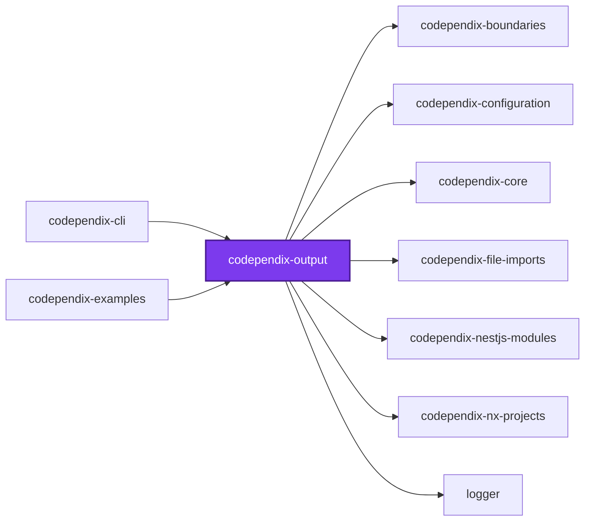
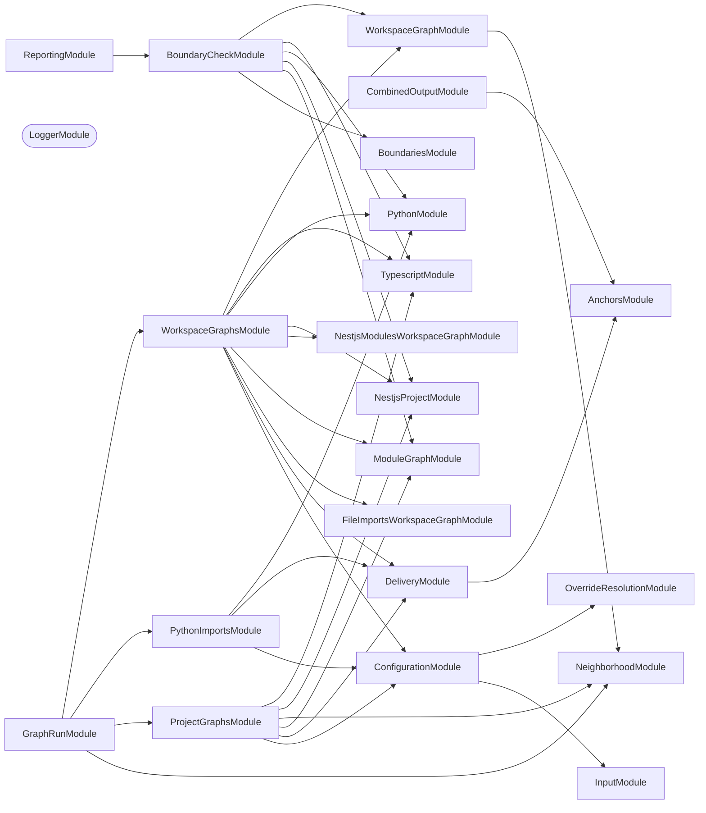

## Test

```bash
nx run codependix-output:vitest
```

## 👔 Conformetry

This project was generated from the [nestjs-service-project](../../configuration/conformetry-templates/nestjs-service-project) conformetry template.

## 🕸️ Codependix

Dependency graphs exported by [codependix](https://github.com/JimmyPaolini/codebase/tree/main/packages/ic-suite/codependix/codependix-cli), regenerated by `nx run codebase:codependix:write`.

### Nx Neighborhood

<!-- codependix:start name="codependix-nx-projects" -->

<!-- codependix:end name="codependix-nx-projects" -->

### NestJS Module Graph

<!-- codependix:start name="codependix-nestjs-modules" -->


_Rounded modules are global: every module can inject them, so their edges are left out._
<!-- codependix:end name="codependix-nestjs-modules" -->

### File Imports

```mermaid
graph LR
  file_callidescope_config_ts["callidescope.config.ts"]
  file_codependix_config_ts["codependix.config.ts"]
  file_codometer_config_ts["codometer.config.ts"]
  file_eslint_config_ts["eslint.config.ts"]
  file_src_index_ts["src/index.ts"]
  file_src_modules_anchors_anchors_constants_ts["src/modules/anchors/anchors.constants.ts"]
  file_src_modules_anchors_anchors_module_ts["src/modules/anchors/anchors.module.ts"]
  file_src_modules_anchors_anchors_module_unit_test_ts["src/modules/anchors/anchors.module.unit.test.ts"]
  file_src_modules_anchors_anchors_service_ts["src/modules/anchors/anchors.service.ts"]
  file_src_modules_anchors_anchors_service_unit_test_ts["src/modules/anchors/anchors.service.unit.test.ts"]
  file_src_modules_anchors_anchors_types_ts["src/modules/anchors/anchors.types.ts"]
  file_src_modules_combined_output_combined_output_constants_ts["src/modules/combined-output/combined-output.constants.ts"]
  file_src_modules_combined_output_combined_output_module_ts["src/modules/combined-output/combined-output.module.ts"]
  file_src_modules_combined_output_combined_output_module_unit_test_ts["src/modules/combined-output/combined-output.module.unit.test.ts"]
  file_src_modules_combined_output_combined_output_service_ts["src/modules/combined-output/combined-output.service.ts"]
  file_src_modules_combined_output_combined_output_service_unit_test_ts["src/modules/combined-output/combined-output.service.unit.test.ts"]
  file_src_modules_combined_output_combined_output_types_ts["src/modules/combined-output/combined-output.types.ts"]
  file_src_modules_delivery_delivery_constants_ts["src/modules/delivery/delivery.constants.ts"]
  file_src_modules_delivery_delivery_module_ts["src/modules/delivery/delivery.module.ts"]
  file_src_modules_delivery_delivery_module_unit_test_ts["src/modules/delivery/delivery.module.unit.test.ts"]
  file_src_modules_delivery_delivery_service_ts["src/modules/delivery/delivery.service.ts"]
  file_src_modules_delivery_delivery_service_unit_test_ts["src/modules/delivery/delivery.service.unit.test.ts"]
  file_src_modules_delivery_delivery_types_ts["src/modules/delivery/delivery.types.ts"]
  file_src_modules_graph_run_graph_run_constants_ts["src/modules/graph-run/graph-run.constants.ts"]
  file_src_modules_graph_run_graph_run_module_ts["src/modules/graph-run/graph-run.module.ts"]
  file_src_modules_graph_run_graph_run_module_unit_test_ts["src/modules/graph-run/graph-run.module.unit.test.ts"]
  file_src_modules_graph_run_graph_run_service_ts["src/modules/graph-run/graph-run.service.ts"]
  file_src_modules_graph_run_graph_run_service_unit_test_ts["src/modules/graph-run/graph-run.service.unit.test.ts"]
  file_src_modules_graph_run_graph_run_types_ts["src/modules/graph-run/graph-run.types.ts"]
  file_src_modules_project_graphs_project_graphs_constants_ts["src/modules/project-graphs/project-graphs.constants.ts"]
  file_src_modules_project_graphs_project_graphs_module_ts["src/modules/project-graphs/project-graphs.module.ts"]
  file_src_modules_project_graphs_project_graphs_module_unit_test_ts["src/modules/project-graphs/project-graphs.module.unit.test.ts"]
  file_src_modules_project_graphs_project_graphs_service_ts["src/modules/project-graphs/project-graphs.service.ts"]
  file_src_modules_project_graphs_project_graphs_service_unit_test_ts["src/modules/project-graphs/project-graphs.service.unit.test.ts"]
  file_src_modules_project_graphs_project_graphs_types_ts["src/modules/project-graphs/project-graphs.types.ts"]
  file_src_modules_python_imports_python_imports_constants_ts["src/modules/python-imports/python-imports.constants.ts"]
  file_src_modules_python_imports_python_imports_module_ts["src/modules/python-imports/python-imports.module.ts"]
  file_src_modules_python_imports_python_imports_module_unit_test_ts["src/modules/python-imports/python-imports.module.unit.test.ts"]
  file_src_modules_python_imports_python_imports_service_ts["src/modules/python-imports/python-imports.service.ts"]
  file_src_modules_python_imports_python_imports_service_unit_test_ts["src/modules/python-imports/python-imports.service.unit.test.ts"]
  file_src_modules_python_imports_python_imports_types_ts["src/modules/python-imports/python-imports.types.ts"]
  file_src_modules_reporting_reporting_constants_ts["src/modules/reporting/reporting.constants.ts"]
  file_src_modules_reporting_reporting_module_ts["src/modules/reporting/reporting.module.ts"]
  file_src_modules_reporting_reporting_module_unit_test_ts["src/modules/reporting/reporting.module.unit.test.ts"]
  file_src_modules_reporting_reporting_service_ts["src/modules/reporting/reporting.service.ts"]
  file_src_modules_reporting_reporting_service_unit_test_ts["src/modules/reporting/reporting.service.unit.test.ts"]
  file_src_modules_reporting_reporting_types_ts["src/modules/reporting/reporting.types.ts"]
  file_src_modules_workspace_graphs_workspace_graphs_constants_ts["src/modules/workspace-graphs/workspace-graphs.constants.ts"]
  file_src_modules_workspace_graphs_workspace_graphs_module_ts["src/modules/workspace-graphs/workspace-graphs.module.ts"]
  file_src_modules_workspace_graphs_workspace_graphs_module_unit_test_ts["src/modules/workspace-graphs/workspace-graphs.module.unit.test.ts"]
  file_src_modules_workspace_graphs_workspace_graphs_service_ts["src/modules/workspace-graphs/workspace-graphs.service.ts"]
  file_src_modules_workspace_graphs_workspace_graphs_service_unit_test_ts["src/modules/workspace-graphs/workspace-graphs.service.unit.test.ts"]
  file_src_modules_workspace_graphs_workspace_graphs_types_ts["src/modules/workspace-graphs/workspace-graphs.types.ts"]
  file_testing_mocks_ts["testing/mocks.ts"]
  file_testing_setup_ts["testing/setup.ts"]
  file_vitest_config_ts["vitest.config.ts"]
  file_src_modules_anchors_anchors_module_ts --> file_src_modules_anchors_anchors_service_ts
  file_src_modules_anchors_anchors_module_unit_test_ts --> file_src_modules_anchors_anchors_module_ts
  file_src_modules_anchors_anchors_module_unit_test_ts --> file_src_modules_anchors_anchors_service_ts
  file_src_modules_anchors_anchors_service_ts --> file_src_modules_anchors_anchors_constants_ts
  file_src_modules_anchors_anchors_service_ts --> file_src_modules_anchors_anchors_types_ts
  file_src_modules_anchors_anchors_service_unit_test_ts --> file_src_modules_anchors_anchors_constants_ts
  file_src_modules_anchors_anchors_service_unit_test_ts --> file_src_modules_anchors_anchors_service_ts
  file_src_modules_combined_output_combined_output_constants_ts --> file_src_modules_graph_run_graph_run_constants_ts
  file_src_modules_combined_output_combined_output_module_ts --> file_src_modules_anchors_anchors_module_ts
  file_src_modules_combined_output_combined_output_module_ts --> file_src_modules_combined_output_combined_output_service_ts
  file_src_modules_combined_output_combined_output_module_unit_test_ts --> file_src_modules_combined_output_combined_output_module_ts
  file_src_modules_combined_output_combined_output_module_unit_test_ts --> file_src_modules_combined_output_combined_output_service_ts
  file_src_modules_combined_output_combined_output_service_ts --> file_src_modules_anchors_anchors_service_ts
  file_src_modules_combined_output_combined_output_service_ts --> file_src_modules_combined_output_combined_output_constants_ts
  file_src_modules_combined_output_combined_output_service_ts --> file_src_modules_combined_output_combined_output_types_ts
  file_src_modules_combined_output_combined_output_service_ts --> file_src_modules_delivery_delivery_constants_ts
  file_src_modules_combined_output_combined_output_service_ts --> file_src_modules_graph_run_graph_run_constants_ts
  file_src_modules_combined_output_combined_output_service_ts --> file_src_modules_graph_run_graph_run_types_ts
  file_src_modules_combined_output_combined_output_service_unit_test_ts --> file_src_modules_anchors_anchors_service_ts
  file_src_modules_combined_output_combined_output_service_unit_test_ts --> file_src_modules_combined_output_combined_output_service_ts
  file_src_modules_combined_output_combined_output_service_unit_test_ts --> file_src_modules_graph_run_graph_run_types_ts
  file_src_modules_combined_output_combined_output_types_ts --> file_src_modules_combined_output_combined_output_constants_ts
  file_src_modules_combined_output_combined_output_types_ts --> file_src_modules_graph_run_graph_run_types_ts
  file_src_modules_delivery_delivery_module_ts --> file_src_modules_anchors_anchors_module_ts
  file_src_modules_delivery_delivery_module_ts --> file_src_modules_delivery_delivery_service_ts
  file_src_modules_delivery_delivery_module_unit_test_ts --> file_src_modules_delivery_delivery_module_ts
  file_src_modules_delivery_delivery_module_unit_test_ts --> file_src_modules_delivery_delivery_service_ts
  file_src_modules_delivery_delivery_service_ts --> file_src_modules_anchors_anchors_constants_ts
  file_src_modules_delivery_delivery_service_ts --> file_src_modules_anchors_anchors_service_ts
  file_src_modules_delivery_delivery_service_ts --> file_src_modules_delivery_delivery_constants_ts
  file_src_modules_delivery_delivery_service_ts --> file_src_modules_delivery_delivery_types_ts
  file_src_modules_delivery_delivery_service_unit_test_ts --> file_src_modules_anchors_anchors_constants_ts
  file_src_modules_delivery_delivery_service_unit_test_ts --> file_src_modules_anchors_anchors_service_ts
  file_src_modules_delivery_delivery_service_unit_test_ts --> file_src_modules_delivery_delivery_service_ts
  file_src_modules_graph_run_graph_run_constants_ts --> file_src_modules_graph_run_graph_run_types_ts
  file_src_modules_graph_run_graph_run_module_ts --> file_src_modules_graph_run_graph_run_service_ts
  file_src_modules_graph_run_graph_run_module_ts --> file_src_modules_project_graphs_project_graphs_module_ts
  file_src_modules_graph_run_graph_run_module_ts --> file_src_modules_python_imports_python_imports_module_ts
  file_src_modules_graph_run_graph_run_module_ts --> file_src_modules_workspace_graphs_workspace_graphs_module_ts
  file_src_modules_graph_run_graph_run_module_unit_test_ts --> file_src_modules_graph_run_graph_run_module_ts
  file_src_modules_graph_run_graph_run_module_unit_test_ts --> file_src_modules_graph_run_graph_run_service_ts
  file_src_modules_graph_run_graph_run_service_ts --> file_src_modules_graph_run_graph_run_constants_ts
  file_src_modules_graph_run_graph_run_service_ts --> file_src_modules_graph_run_graph_run_types_ts
  file_src_modules_graph_run_graph_run_service_ts --> file_src_modules_project_graphs_project_graphs_service_ts
  file_src_modules_graph_run_graph_run_service_ts --> file_src_modules_python_imports_python_imports_service_ts
  file_src_modules_graph_run_graph_run_service_ts --> file_src_modules_workspace_graphs_workspace_graphs_service_ts
  file_src_modules_graph_run_graph_run_service_ts --> file_src_modules_workspace_graphs_workspace_graphs_types_ts
  file_src_modules_graph_run_graph_run_service_unit_test_ts --> file_src_modules_graph_run_graph_run_service_ts
  file_src_modules_graph_run_graph_run_service_unit_test_ts --> file_src_modules_project_graphs_project_graphs_service_ts
  file_src_modules_graph_run_graph_run_service_unit_test_ts --> file_src_modules_python_imports_python_imports_service_ts
  file_src_modules_graph_run_graph_run_service_unit_test_ts --> file_src_modules_workspace_graphs_workspace_graphs_service_ts
  file_src_modules_project_graphs_project_graphs_module_ts --> file_src_modules_delivery_delivery_module_ts
  file_src_modules_project_graphs_project_graphs_module_ts --> file_src_modules_project_graphs_project_graphs_service_ts
  file_src_modules_project_graphs_project_graphs_module_unit_test_ts --> file_src_modules_project_graphs_project_graphs_module_ts
  file_src_modules_project_graphs_project_graphs_module_unit_test_ts --> file_src_modules_project_graphs_project_graphs_service_ts
  file_src_modules_project_graphs_project_graphs_service_ts --> file_src_modules_delivery_delivery_service_ts
  file_src_modules_project_graphs_project_graphs_service_ts --> file_src_modules_graph_run_graph_run_constants_ts
  file_src_modules_project_graphs_project_graphs_service_ts --> file_src_modules_graph_run_graph_run_types_ts
  file_src_modules_project_graphs_project_graphs_service_unit_test_ts --> file_src_modules_anchors_anchors_service_ts
  file_src_modules_project_graphs_project_graphs_service_unit_test_ts --> file_src_modules_delivery_delivery_service_ts
  file_src_modules_project_graphs_project_graphs_service_unit_test_ts --> file_src_modules_project_graphs_project_graphs_service_ts
  file_src_modules_python_imports_python_imports_module_ts --> file_src_modules_delivery_delivery_module_ts
  file_src_modules_python_imports_python_imports_module_ts --> file_src_modules_python_imports_python_imports_service_ts
  file_src_modules_python_imports_python_imports_module_unit_test_ts --> file_src_modules_python_imports_python_imports_module_ts
  file_src_modules_python_imports_python_imports_module_unit_test_ts --> file_src_modules_python_imports_python_imports_service_ts
  file_src_modules_python_imports_python_imports_service_ts --> file_src_modules_delivery_delivery_service_ts
  file_src_modules_python_imports_python_imports_service_ts --> file_src_modules_graph_run_graph_run_constants_ts
  file_src_modules_python_imports_python_imports_service_ts --> file_src_modules_graph_run_graph_run_types_ts
  file_src_modules_python_imports_python_imports_service_unit_test_ts --> file_src_modules_anchors_anchors_service_ts
  file_src_modules_python_imports_python_imports_service_unit_test_ts --> file_src_modules_delivery_delivery_service_ts
  file_src_modules_python_imports_python_imports_service_unit_test_ts --> file_src_modules_python_imports_python_imports_service_ts
  file_src_modules_reporting_reporting_module_ts --> file_src_modules_reporting_reporting_service_ts
  file_src_modules_reporting_reporting_module_unit_test_ts --> file_src_modules_reporting_reporting_module_ts
  file_src_modules_reporting_reporting_module_unit_test_ts --> file_src_modules_reporting_reporting_service_ts
  file_src_modules_reporting_reporting_service_ts --> file_src_modules_graph_run_graph_run_types_ts
  file_src_modules_reporting_reporting_service_unit_test_ts --> file_src_modules_graph_run_graph_run_types_ts
  file_src_modules_reporting_reporting_service_unit_test_ts --> file_src_modules_reporting_reporting_service_ts
  file_src_modules_workspace_graphs_workspace_graphs_module_ts --> file_src_modules_delivery_delivery_module_ts
  file_src_modules_workspace_graphs_workspace_graphs_module_ts --> file_src_modules_workspace_graphs_workspace_graphs_service_ts
  file_src_modules_workspace_graphs_workspace_graphs_module_unit_test_ts --> file_src_modules_workspace_graphs_workspace_graphs_module_ts
  file_src_modules_workspace_graphs_workspace_graphs_module_unit_test_ts --> file_src_modules_workspace_graphs_workspace_graphs_service_ts
  file_src_modules_workspace_graphs_workspace_graphs_service_ts --> file_src_modules_delivery_delivery_service_ts
  file_src_modules_workspace_graphs_workspace_graphs_service_ts --> file_src_modules_graph_run_graph_run_constants_ts
  file_src_modules_workspace_graphs_workspace_graphs_service_ts --> file_src_modules_graph_run_graph_run_types_ts
  file_src_modules_workspace_graphs_workspace_graphs_service_ts --> file_src_modules_workspace_graphs_workspace_graphs_types_ts
  file_src_modules_workspace_graphs_workspace_graphs_service_unit_test_ts --> file_src_modules_anchors_anchors_service_ts
  file_src_modules_workspace_graphs_workspace_graphs_service_unit_test_ts --> file_src_modules_delivery_delivery_service_ts
  file_src_modules_workspace_graphs_workspace_graphs_service_unit_test_ts --> file_src_modules_graph_run_graph_run_constants_ts
  file_src_modules_workspace_graphs_workspace_graphs_service_unit_test_ts --> file_src_modules_workspace_graphs_workspace_graphs_service_ts
  file_src_modules_workspace_graphs_workspace_graphs_types_ts --> file_src_modules_graph_run_graph_run_types_ts
```

<!-- codependix:start name="codependix-file-imports" -->

<!-- codependix:end name="codependix-file-imports" -->
