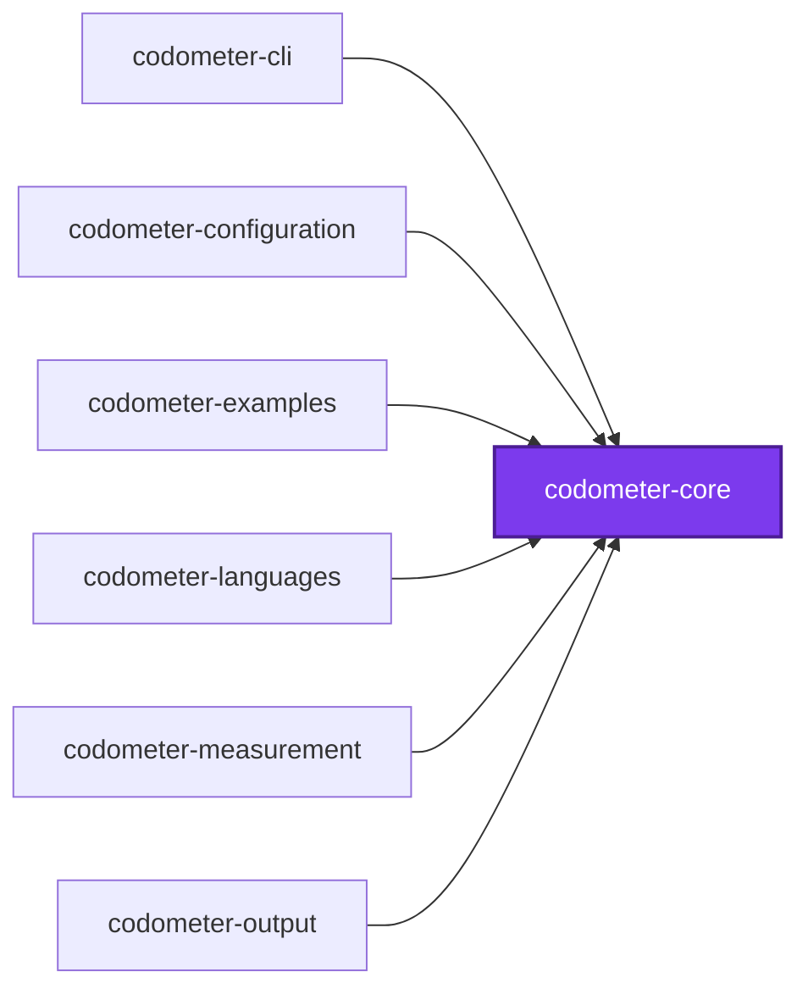
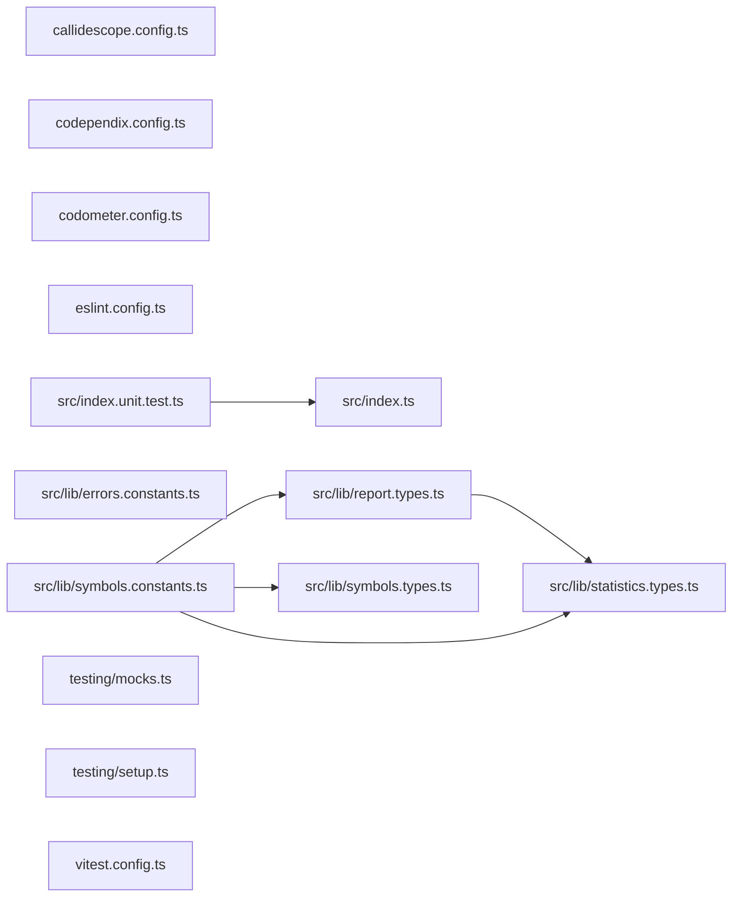

# @codometer/core

The contracts leaf of the codometer toolchain. It holds what a measurement
**produces** — the per-language statistics groups, the report vocabulary a
consumer joins across runs, and the errors a configuration is refused with —
and nothing that runs.

No service and no NestJS module lives here, which is what makes it a leaf every
other codometer package may reach without dragging a container behind it. The
test that decides whether a declaration belongs here is sharp: a type the tool
produces is core, and a value somebody writes in `codometer.config.ts` is
configuration.

## Test

```bash
nx run codometer-core:vitest
```

## 👔 Conformetry

This project was generated from the [nestjs-service-project](../../configuration/conformetry-templates/nestjs-service-project) conformetry template.

## 🕸️ Codependix

Dependency graphs exported by [codependix](https://github.com/JimmyPaolini/codebase/tree/main/packages/ic-suite/codependix/codependix-cli), regenerated by `nx run codebase:codependix:write`.

### Nx Neighborhood

<!-- codependix:start name="codependix-nx-projects" -->

<!-- codependix:end name="codependix-nx-projects" -->

### NestJS Module Graph

<!-- codependix:start name="codependix-nestjs-modules" -->
_This project defines no NestJS modules to graph._
<!-- codependix:end name="codependix-nestjs-modules" -->

### File Imports

<!-- codependix:start name="codependix-file-imports" -->

<!-- codependix:end name="codependix-file-imports" -->

<!-- CALL_STACKS_START -->

## 🔭 Callidescope

Call stacks traced through `packages/ic-suite/codometer/codometer-core`, deepest first. Each frame shows what it takes, what it returns, and what its documentation says.

| Measure | Value |
| --- | --- |
| Callables | 4 |
| Files | 11 |
| Calls traced | 0 |
| Call stacks | 0 |
| Deepest stack | 0 |
| Stacks through recursion | 0 |
| Unfollowable calls | 4 |

### Limits

What this project is judged against, as declared in its own `callidescope.config.ts`.

| Limit | Value |
| --- | --- |
| `maximumDepth` | 1 |
| `maximumBreadth` | 1 |

### Call stacks (depth)

None.

### Breadth

None.
<!-- CALL_STACKS_END -->
