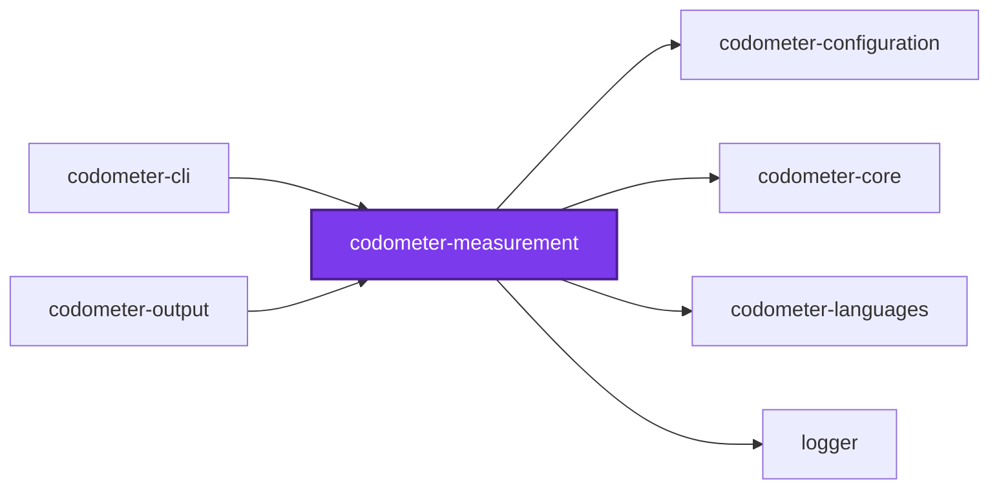
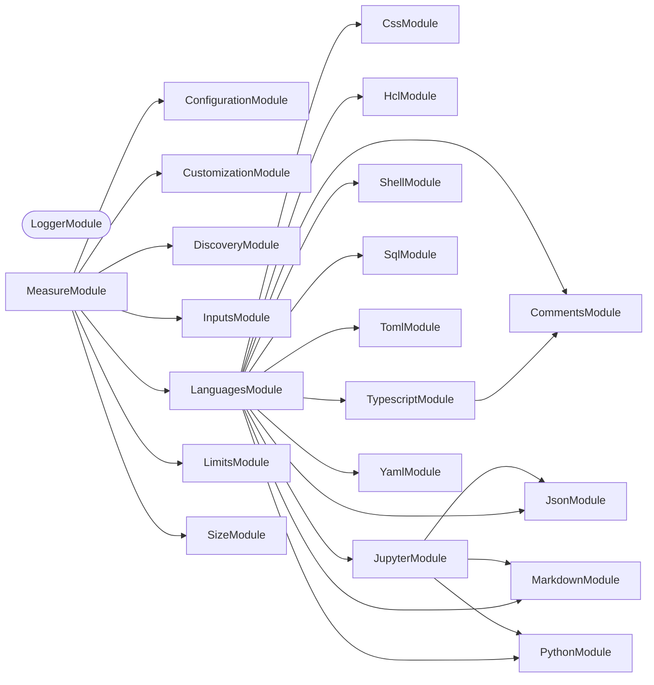

# @codometer/measurement

What codometer actually measures. It finds the files a run covers, counts their
compressed and uncompressed size, evaluates whatever counters a configuration
declares of its own, and holds every measured metric to the limits written
against it.

One package rather than four. Discovery, size, customization, and limits are
each a handful of files that only ever run together, and none of them imports
another — so the join that a measurement is had to live somewhere, and it lives
here rather than in the command-line host that used to hold it.

## Test

```bash
nx run codometer-measurement:vitest
```

## 👔 Conformetry

This project was generated from the [nestjs-service-project](../../configuration/conformetry-templates/nestjs-service-project) conformetry template.

## 🕸️ Codependix

Dependency graphs exported by [codependix](https://github.com/JimmyPaolini/codebase/tree/main/packages/ic-suite/codependix/codependix-cli), regenerated by `nx run codebase:codependix:write`.

### Nx Neighborhood

<!-- codependix:start name="codependix-nx-projects" -->

<!-- codependix:end name="codependix-nx-projects" -->

### NestJS Module Graph

<!-- codependix:start name="codependix-nestjs-modules" -->


_Rounded modules are global: every module can inject them, so their edges are left out._
<!-- codependix:end name="codependix-nestjs-modules" -->

### File Imports

```mermaid
graph LR
  file_codometer_config_ts["codometer.config.ts"]
  file_eslint_config_ts["eslint.config.ts"]
  file_src_index_ts["src/index.ts"]
  file_src_modules_customization_customization_constants_ts["src/modules/customization/customization.constants.ts"]
  file_src_modules_customization_customization_module_ts["src/modules/customization/customization.module.ts"]
  file_src_modules_customization_customization_module_unit_test_ts["src/modules/customization/customization.module.unit.test.ts"]
  file_src_modules_customization_customization_service_ts["src/modules/customization/customization.service.ts"]
  file_src_modules_customization_customization_service_unit_test_ts["src/modules/customization/customization.service.unit.test.ts"]
  file_src_modules_customization_customization_types_ts["src/modules/customization/customization.types.ts"]
  file_src_modules_discovery_discovery_constants_ts["src/modules/discovery/discovery.constants.ts"]
  file_src_modules_discovery_discovery_module_ts["src/modules/discovery/discovery.module.ts"]
  file_src_modules_discovery_discovery_service_integration_test_ts["src/modules/discovery/discovery.service.integration.test.ts"]
  file_src_modules_discovery_discovery_service_ts["src/modules/discovery/discovery.service.ts"]
  file_src_modules_discovery_discovery_service_unit_test_ts["src/modules/discovery/discovery.service.unit.test.ts"]
  file_src_modules_discovery_discovery_types_ts["src/modules/discovery/discovery.types.ts"]
  file_src_modules_discovery_ignore_rules_service_ts["src/modules/discovery/ignore-rules.service.ts"]
  file_src_modules_discovery_ignore_rules_service_unit_test_ts["src/modules/discovery/ignore-rules.service.unit.test.ts"]
  file_src_modules_discovery_ignore_rules_types_ts["src/modules/discovery/ignore-rules.types.ts"]
  file_src_modules_inputs_inputs_constants_ts["src/modules/inputs/inputs.constants.ts"]
  file_src_modules_inputs_inputs_module_ts["src/modules/inputs/inputs.module.ts"]
  file_src_modules_inputs_inputs_service_integration_test_ts["src/modules/inputs/inputs.service.integration.test.ts"]
  file_src_modules_inputs_inputs_service_ts["src/modules/inputs/inputs.service.ts"]
  file_src_modules_inputs_inputs_service_unit_test_ts["src/modules/inputs/inputs.service.unit.test.ts"]
  file_src_modules_inputs_inputs_types_ts["src/modules/inputs/inputs.types.ts"]
  file_src_modules_limits_limits_constants_ts["src/modules/limits/limits.constants.ts"]
  file_src_modules_limits_limits_module_ts["src/modules/limits/limits.module.ts"]
  file_src_modules_limits_limits_service_integration_test_ts["src/modules/limits/limits.service.integration.test.ts"]
  file_src_modules_limits_limits_service_ts["src/modules/limits/limits.service.ts"]
  file_src_modules_limits_limits_service_unit_test_ts["src/modules/limits/limits.service.unit.test.ts"]
  file_src_modules_limits_limits_types_ts["src/modules/limits/limits.types.ts"]
  file_src_modules_limits_metric_index_service_ts["src/modules/limits/metric-index.service.ts"]
  file_src_modules_limits_metric_index_service_unit_test_ts["src/modules/limits/metric-index.service.unit.test.ts"]
  file_src_modules_measure_measure_constants_ts["src/modules/measure/measure.constants.ts"]
  file_src_modules_measure_measure_module_ts["src/modules/measure/measure.module.ts"]
  file_src_modules_measure_measure_service_ts["src/modules/measure/measure.service.ts"]
  file_src_modules_measure_measure_service_unit_test_ts["src/modules/measure/measure.service.unit.test.ts"]
  file_src_modules_measure_measure_types_ts["src/modules/measure/measure.types.ts"]
  file_src_modules_size_size_constants_ts["src/modules/size/size.constants.ts"]
  file_src_modules_size_size_module_ts["src/modules/size/size.module.ts"]
  file_src_modules_size_size_module_unit_test_ts["src/modules/size/size.module.unit.test.ts"]
  file_src_modules_size_size_service_integration_test_ts["src/modules/size/size.service.integration.test.ts"]
  file_src_modules_size_size_service_ts["src/modules/size/size.service.ts"]
  file_src_modules_size_size_service_unit_test_ts["src/modules/size/size.service.unit.test.ts"]
  file_src_modules_size_size_types_ts["src/modules/size/size.types.ts"]
  file_testing_fixture_tree_ts["testing/fixture-tree.ts"]
  file_testing_input_tree_ts["testing/input-tree.ts"]
  file_testing_mocks_ts["testing/mocks.ts"]
  file_testing_setup_ts["testing/setup.ts"]
  file_testing_target_tree_ts["testing/target-tree.ts"]
  file_vitest_config_ts["vitest.config.ts"]
  file_src_modules_customization_customization_module_ts --> file_src_modules_customization_customization_service_ts
  file_src_modules_customization_customization_module_unit_test_ts --> file_src_modules_customization_customization_module_ts
  file_src_modules_customization_customization_module_unit_test_ts --> file_src_modules_customization_customization_service_ts
  file_src_modules_customization_customization_service_ts --> file_src_modules_customization_customization_types_ts
  file_src_modules_customization_customization_service_unit_test_ts --> file_src_modules_customization_customization_service_ts
  file_src_modules_discovery_discovery_module_ts --> file_src_modules_discovery_discovery_service_ts
  file_src_modules_discovery_discovery_module_ts --> file_src_modules_discovery_ignore_rules_service_ts
  file_src_modules_discovery_discovery_service_integration_test_ts --> file_src_modules_discovery_discovery_service_ts
  file_src_modules_discovery_discovery_service_integration_test_ts --> file_src_modules_discovery_discovery_types_ts
  file_src_modules_discovery_discovery_service_integration_test_ts --> file_src_modules_discovery_ignore_rules_service_ts
  file_src_modules_discovery_discovery_service_integration_test_ts --> file_testing_fixture_tree_ts
  file_src_modules_discovery_discovery_service_ts --> file_src_modules_discovery_discovery_constants_ts
  file_src_modules_discovery_discovery_service_ts --> file_src_modules_discovery_discovery_types_ts
  file_src_modules_discovery_discovery_service_ts --> file_src_modules_discovery_ignore_rules_service_ts
  file_src_modules_discovery_discovery_service_ts --> file_src_modules_discovery_ignore_rules_types_ts
  file_src_modules_discovery_discovery_service_unit_test_ts --> file_src_modules_discovery_discovery_service_ts
  file_src_modules_discovery_discovery_service_unit_test_ts --> file_src_modules_discovery_discovery_types_ts
  file_src_modules_discovery_discovery_service_unit_test_ts --> file_src_modules_discovery_ignore_rules_service_ts
  file_src_modules_discovery_discovery_types_ts --> file_src_modules_discovery_ignore_rules_types_ts
  file_src_modules_discovery_ignore_rules_service_ts --> file_src_modules_discovery_ignore_rules_types_ts
  file_src_modules_discovery_ignore_rules_service_unit_test_ts --> file_src_modules_discovery_ignore_rules_service_ts
  file_src_modules_discovery_ignore_rules_service_unit_test_ts --> file_src_modules_discovery_ignore_rules_types_ts
  file_src_modules_inputs_inputs_module_ts --> file_src_modules_inputs_inputs_service_ts
  file_src_modules_inputs_inputs_service_integration_test_ts --> file_src_modules_inputs_inputs_service_ts
  file_src_modules_inputs_inputs_service_integration_test_ts --> file_testing_input_tree_ts
  file_src_modules_inputs_inputs_service_ts --> file_src_modules_inputs_inputs_constants_ts
  file_src_modules_inputs_inputs_service_ts --> file_src_modules_inputs_inputs_types_ts
  file_src_modules_inputs_inputs_service_unit_test_ts --> file_src_modules_inputs_inputs_constants_ts
  file_src_modules_inputs_inputs_service_unit_test_ts --> file_src_modules_inputs_inputs_service_ts
  file_src_modules_limits_limits_module_ts --> file_src_modules_limits_limits_service_ts
  file_src_modules_limits_limits_module_ts --> file_src_modules_limits_metric_index_service_ts
  file_src_modules_limits_limits_service_integration_test_ts --> file_src_modules_limits_limits_service_ts
  file_src_modules_limits_limits_service_integration_test_ts --> file_src_modules_limits_limits_types_ts
  file_src_modules_limits_limits_service_integration_test_ts --> file_src_modules_limits_metric_index_service_ts
  file_src_modules_limits_limits_service_integration_test_ts --> file_testing_fixture_tree_ts
  file_src_modules_limits_limits_service_integration_test_ts --> file_testing_mocks_ts
  file_src_modules_limits_limits_service_ts --> file_src_modules_limits_limits_constants_ts
  file_src_modules_limits_limits_service_ts --> file_src_modules_limits_limits_types_ts
  file_src_modules_limits_limits_service_unit_test_ts --> file_src_modules_limits_limits_service_ts
  file_src_modules_limits_limits_service_unit_test_ts --> file_src_modules_limits_limits_types_ts
  file_src_modules_limits_limits_service_unit_test_ts --> file_src_modules_limits_metric_index_service_ts
  file_src_modules_limits_limits_service_unit_test_ts --> file_testing_mocks_ts
  file_src_modules_limits_limits_types_ts --> file_src_modules_size_size_types_ts
  file_src_modules_limits_metric_index_service_ts --> file_src_modules_limits_limits_constants_ts
  file_src_modules_limits_metric_index_service_ts --> file_src_modules_limits_limits_types_ts
  file_src_modules_limits_metric_index_service_unit_test_ts --> file_src_modules_limits_limits_types_ts
  file_src_modules_limits_metric_index_service_unit_test_ts --> file_src_modules_limits_metric_index_service_ts
  file_src_modules_limits_metric_index_service_unit_test_ts --> file_testing_mocks_ts
  file_src_modules_measure_measure_module_ts --> file_src_modules_customization_customization_module_ts
  file_src_modules_measure_measure_module_ts --> file_src_modules_discovery_discovery_module_ts
  file_src_modules_measure_measure_module_ts --> file_src_modules_inputs_inputs_module_ts
  file_src_modules_measure_measure_module_ts --> file_src_modules_limits_limits_module_ts
  file_src_modules_measure_measure_module_ts --> file_src_modules_measure_measure_service_ts
  file_src_modules_measure_measure_module_ts --> file_src_modules_size_size_module_ts
  file_src_modules_measure_measure_service_ts --> file_src_modules_customization_customization_service_ts
  file_src_modules_measure_measure_service_ts --> file_src_modules_discovery_discovery_service_ts
  file_src_modules_measure_measure_service_ts --> file_src_modules_inputs_inputs_service_ts
  file_src_modules_measure_measure_service_ts --> file_src_modules_limits_limits_service_ts
  file_src_modules_measure_measure_service_ts --> file_src_modules_limits_limits_types_ts
  file_src_modules_measure_measure_service_ts --> file_src_modules_limits_metric_index_service_ts
  file_src_modules_measure_measure_service_ts --> file_src_modules_measure_measure_constants_ts
  file_src_modules_measure_measure_service_ts --> file_src_modules_measure_measure_types_ts
  file_src_modules_measure_measure_service_ts --> file_src_modules_size_size_service_ts
  file_src_modules_measure_measure_service_unit_test_ts --> file_src_modules_customization_customization_service_ts
  file_src_modules_measure_measure_service_unit_test_ts --> file_src_modules_discovery_discovery_service_ts
  file_src_modules_measure_measure_service_unit_test_ts --> file_src_modules_discovery_discovery_types_ts
  file_src_modules_measure_measure_service_unit_test_ts --> file_src_modules_inputs_inputs_service_ts
  file_src_modules_measure_measure_service_unit_test_ts --> file_src_modules_limits_limits_service_ts
  file_src_modules_measure_measure_service_unit_test_ts --> file_src_modules_limits_metric_index_service_ts
  file_src_modules_measure_measure_service_unit_test_ts --> file_src_modules_measure_measure_service_ts
  file_src_modules_measure_measure_service_unit_test_ts --> file_src_modules_size_size_service_ts
  file_src_modules_measure_measure_service_unit_test_ts --> file_testing_mocks_ts
  file_src_modules_measure_measure_types_ts --> file_src_modules_discovery_discovery_types_ts
  file_src_modules_measure_measure_types_ts --> file_src_modules_limits_limits_types_ts
  file_src_modules_measure_measure_types_ts --> file_src_modules_size_size_types_ts
  file_src_modules_size_size_module_ts --> file_src_modules_size_size_service_ts
  file_src_modules_size_size_module_unit_test_ts --> file_src_modules_size_size_module_ts
  file_src_modules_size_size_module_unit_test_ts --> file_src_modules_size_size_service_ts
  file_src_modules_size_size_service_integration_test_ts --> file_src_modules_size_size_constants_ts
  file_src_modules_size_size_service_integration_test_ts --> file_src_modules_size_size_service_ts
  file_src_modules_size_size_service_integration_test_ts --> file_testing_target_tree_ts
  file_src_modules_size_size_service_ts --> file_src_modules_size_size_constants_ts
  file_src_modules_size_size_service_ts --> file_src_modules_size_size_types_ts
  file_src_modules_size_size_service_unit_test_ts --> file_src_modules_size_size_constants_ts
  file_src_modules_size_size_service_unit_test_ts --> file_src_modules_size_size_service_ts
```

<!-- codependix:start name="codependix-file-imports" -->

<!-- codependix:end name="codependix-file-imports" -->

<!-- CALL_STACKS_START -->

## 🔭 Callidescope

Call stacks traced through `packages/ic-suite/codometer/codometer-measurement`, deepest first. Each frame shows what it takes, what it returns, and what its documentation says.

| Measure | Value |
| --- | --- |
| Callables | 106 |
| Files | 33 |
| Calls traced | 121 |
| Call stacks | 0 |
| Deepest stack | 0 |
| Stacks through recursion | 0 |
| Unfollowable calls | 5 |

### Limits

What this project is judged against, as declared in its own `callidescope.config.ts`.

| Limit | Value |
| --- | --- |
| `maximumDepth` | 14 |
| `maximumBreadth` | 9 |

### Call stacks (depth)

None.

### Breadth

| Callable | Breadth | Calls directly | Location |
| --- | --- | --- | --- |
| `MeasureService.measure` | 9 | `CustomizationService.buildCommentCounters`, `CustomizationService.buildSymbolCounters`, `MeasureService.measureInput`, `MeasureService.describeFailure`, `MetricIndexService.index`, `LimitsService.evaluate`, `MeasureService.find(…)`, `MeasureService.map(…)`, `MeasureService.readLimitFailures` | `packages/ic-suite/codometer/codometer-measurement/src/modules/measure/measure.service.ts:312` |
| `InputsService.matchFiles` | 7 | `InputsService.findBoundary`, `InputsService.sitsInsideBoundary`, `InputOutsideRepositoryError.constructor`, `InputsService.readInputPrefix`, `InputsService.walk`, `InputsService.map(…)`, `InputsService.map(…)` | `packages/ic-suite/codometer/codometer-measurement/src/modules/inputs/inputs.service.ts:282` |
| `DiscoveryService.categorize` | 6 | `DiscoveryService.filter(…)`, `DiscoveryService.filterByExtension`, `DiscoveryService.filter(…)`, `DiscoveryService.filter(…)`, `DiscoveryService.filter(…)`, `DiscoveryService.filter(…)` | `packages/ic-suite/codometer/codometer-measurement/src/modules/discovery/discovery.service.ts:285` |

<details>
<summary>44 more callables</summary>

| Callable | Breadth | Calls directly | Location |
| --- | --- | --- | --- |
| `MeasureService.analyzeFiles` | 6 | `LanguagesService.analyze`, `SizeService.analyze`, `CustomizationService.analyze`, `MeasureService.getFolderCount`, `MeasureService.buildJavascriptStatistics`, `MeasureService.buildTypescriptStatistics` | `packages/ic-suite/codometer/codometer-measurement/src/modules/measure/measure.service.ts:75` |
| `LimitsService.resolve` | 5 | `LimitsService.findCandidates`, `UnboundMetricError.constructor`, `LimitsService.describeTargets`, `LimitsService.map(…)`, `EmptyTargetError.constructor` | `packages/ic-suite/codometer/codometer-measurement/src/modules/limits/limits.service.ts:156` |
| `MeasureService.measureInput` | 5 | `MeasureService.discoverInputFiles`, `MeasureService.runsAnalysis`, `MeasureService.analyzeFiles`, `DiscoveryService.categorize`, `SizeService.analyze` | `packages/ic-suite/codometer/codometer-measurement/src/modules/measure/measure.service.ts:253` |
| `DiscoveryService.walkDirectory` | 4 | `DiscoveryService.readDirectoryEntries`, `DiscoveryService.applyDirectoryIgnoreFile`, `DiscoveryService.walkSubdirectory`, `DiscoveryService.isIgnoredPath` | `packages/ic-suite/codometer/codometer-measurement/src/modules/discovery/discovery.service.ts:217` |
| `InputsService.walk` | 4 | `InputsService.readEntries`, `InputsService.resolveEntryKind`, `InputsService.canDescend`, `InputsService.isMatched` | `packages/ic-suite/codometer/codometer-measurement/src/modules/inputs/inputs.service.ts:239` |
| `DiscoveryService.listDiscoveredFiles` | 3 | `DiscoveryService.walkDirectory`, `DiscoveryService.readExcludeFromScopes`, `DiscoveryService.filter(…)` | `packages/ic-suite/codometer/codometer-measurement/src/modules/discovery/discovery.service.ts:145` |
| `DiscoveryService.walkSubdirectory` | 3 | `DiscoveryService.isExhaustivelyExcluded`, `DiscoveryService.isIgnoredPath`, `DiscoveryService.walkDirectory` | `packages/ic-suite/codometer/codometer-measurement/src/modules/discovery/discovery.service.ts:261` |
| `LimitsService.findDefaultCandidate` | 3 | `UnboundMetricError.constructor`, `LimitsService.describeTargets`, `LimitsService.bind` | `packages/ic-suite/codometer/codometer-measurement/src/modules/limits/limits.service.ts:124` |
| `MeasureService.discoverInputFiles` | 3 | `DiscoveryService.discoverFiles`, `InputsService.matchFiles`, `MeasureService.excludeOutputPaths` | `packages/ic-suite/codometer/codometer-measurement/src/modules/measure/measure.service.ts:189` |
| `CustomizationService.buildCommentResult` | 2 | `CustomizationService.filter(…)`, `CustomizationService.map(…)` | `packages/ic-suite/codometer/codometer-measurement/src/modules/customization/customization.service.ts:41` |
| `CustomizationService.map(…)` | 2 | `CustomizationService.buildCommentResult`, `CustomizationService.countMatches` | `packages/ic-suite/codometer/codometer-measurement/src/modules/customization/customization.service.ts:84` |
| `DiscoveryService.discoverFiles` | 2 | `DiscoveryService.categorize`, `DiscoveryService.listDiscoveredFiles` | `packages/ic-suite/codometer/codometer-measurement/src/modules/discovery/discovery.service.ts:317` |
| `InputsService.canDescend` | 2 | `InputsService.isHidden`, `InputsService.some(…)` | `packages/ic-suite/codometer/codometer-measurement/src/modules/inputs/inputs.service.ts:50` |
| `InputsService.some(…)` | 2 | `InputsService.leadsToBase`, `InputsService.sitsInsideBase` | `packages/ic-suite/codometer/codometer-measurement/src/modules/inputs/inputs.service.ts:56` |
| `InputsService.isMatched` | 2 | `InputsService.some(…)`, `InputsService.some(…)` | `packages/ic-suite/codometer/codometer-measurement/src/modules/inputs/inputs.service.ts:126` |
| `LimitsService.findCandidates` | 2 | `LimitsService.bind`, `LimitsService.findDefaultCandidate` | `packages/ic-suite/codometer/codometer-measurement/src/modules/limits/limits.service.ts:86` |
| `LimitsService.evaluate` | 2 | `LimitsService.resolve`, `LimitsService.describeFailure` | `packages/ic-suite/codometer/codometer-measurement/src/modules/limits/limits.service.ts:200` |
| `MetricIndexService.buildTargetIndex` | 2 | `MetricIndexService.addMetric`, `MetricIndexService.indexLanguage` | `packages/ic-suite/codometer/codometer-measurement/src/modules/limits/metric-index.service.ts:67` |
| `MetricIndexService.indexCounters` | 2 | `MetricIndexService.addMetric`, `MetricIndexService.isCounterGroup` | `packages/ic-suite/codometer/codometer-measurement/src/modules/limits/metric-index.service.ts:111` |
| `MetricIndexService.indexLanguage` | 2 | `MetricIndexService.indexCounters`, `MetricIndexService.addMetric` | `packages/ic-suite/codometer/codometer-measurement/src/modules/limits/metric-index.service.ts:135` |
| `MetricIndexService.index` | 2 | `MetricIndexService.describeDuplicate`, `MetricIndexService.buildTargetIndex` | `packages/ic-suite/codometer/codometer-measurement/src/modules/limits/metric-index.service.ts:168` |
| `SizeService.measureFile` | 2 | `SizeService.compress`, `UnreadableTargetFileError.constructor` | `packages/ic-suite/codometer/codometer-measurement/src/modules/size/size.service.ts:61` |
| `CustomizationService.countMatches` | 1 | `CustomizationService.filter(…)` | `packages/ic-suite/codometer/codometer-measurement/src/modules/customization/customization.service.ts:69` |
| `CustomizationService.filter(…)` | 1 | `CustomizationService.some(…)` | `packages/ic-suite/codometer/codometer-measurement/src/modules/customization/customization.service.ts:70` |
| `CustomizationService.analyze` | 1 | `CustomizationService.map(…)` | `packages/ic-suite/codometer/codometer-measurement/src/modules/customization/customization.service.ts:78` |
| `CustomizationService.buildSymbolCounters` | 1 | `CustomizationService.flatMap(…)` | `packages/ic-suite/codometer/codometer-measurement/src/modules/customization/customization.service.ts:146` |
| `IgnoreRulesService.isIgnored` | 1 | `IgnoreRulesService.toScopedPath` | `packages/ic-suite/codometer/codometer-measurement/src/modules/discovery/ignore-rules.service.ts:84` |
| `IgnoreRulesService.readScope` | 1 | `IgnoreRulesService.createScope` | `packages/ic-suite/codometer/codometer-measurement/src/modules/discovery/ignore-rules.service.ts:115` |
| `DiscoveryService.applyDirectoryIgnoreFile` | 1 | `IgnoreRulesService.readScope` | `packages/ic-suite/codometer/codometer-measurement/src/modules/discovery/discovery.service.ts:59` |
| `DiscoveryService.filterByExtension` | 1 | `DiscoveryService.filter(…)` | `packages/ic-suite/codometer/codometer-measurement/src/modules/discovery/discovery.service.ts:75` |
| `DiscoveryService.isExcluded` | 1 | `DiscoveryService.some(…)` | `packages/ic-suite/codometer/codometer-measurement/src/modules/discovery/discovery.service.ts:91` |
| `DiscoveryService.isExhaustivelyExcluded` | 1 | `DiscoveryService.some(…)` | `packages/ic-suite/codometer/codometer-measurement/src/modules/discovery/discovery.service.ts:105` |
| `DiscoveryService.isIgnoredPath` | 1 | `IgnoreRulesService.isIgnored` | `packages/ic-suite/codometer/codometer-measurement/src/modules/discovery/discovery.service.ts:128` |
| `DiscoveryService.filter(…)` | 1 | `DiscoveryService.isExcluded` | `packages/ic-suite/codometer/codometer-measurement/src/modules/discovery/discovery.service.ts:155` |
| `DiscoveryService.readExcludeFromScopes` | 1 | `IgnoreRulesService.readScope` | `packages/ic-suite/codometer/codometer-measurement/src/modules/discovery/discovery.service.ts:187` |
| `InputsService.findBoundary` | 1 | `InputsService.some(…)` | `packages/ic-suite/codometer/codometer-measurement/src/modules/inputs/inputs.service.ts:72` |
| `InputsService.resolveEntryKind` | 1 | `InputsService.isLinkedFile` | `packages/ic-suite/codometer/codometer-measurement/src/modules/inputs/inputs.service.ts:184` |
| `InputsService.map(…)` | 1 | `InputsService.toIncludeBase` | `packages/ic-suite/codometer/codometer-measurement/src/modules/inputs/inputs.service.ts:300` |
| `LimitsService.bind` | 1 | `UnboundMetricError.constructor` | `packages/ic-suite/codometer/codometer-measurement/src/modules/limits/limits.service.ts:41` |
| `LimitsService.describeTargets` | 1 | `LimitsService.map(…)` | `packages/ic-suite/codometer/codometer-measurement/src/modules/limits/limits.service.ts:72` |
| `LimitsService.map(…)` | 1 | `LimitsService.describeBinding` | `packages/ic-suite/codometer/codometer-measurement/src/modules/limits/limits.service.ts:169` |
| `SizeService.analyze` | 1 | `SizeService.measureFile` | `packages/ic-suite/codometer/codometer-measurement/src/modules/size/size.service.ts:85` |
| `MeasureService.excludeOutputPaths` | 1 | `MeasureService.filter(…)` | `packages/ic-suite/codometer/codometer-measurement/src/modules/measure/measure.service.ts:216` |
| `MeasureService.readLimitFailures` | 1 | `MeasureService.map(…)` | `packages/ic-suite/codometer/codometer-measurement/src/modules/measure/measure.service.ts:282` |

</details>
<!-- CALL_STACKS_END -->
