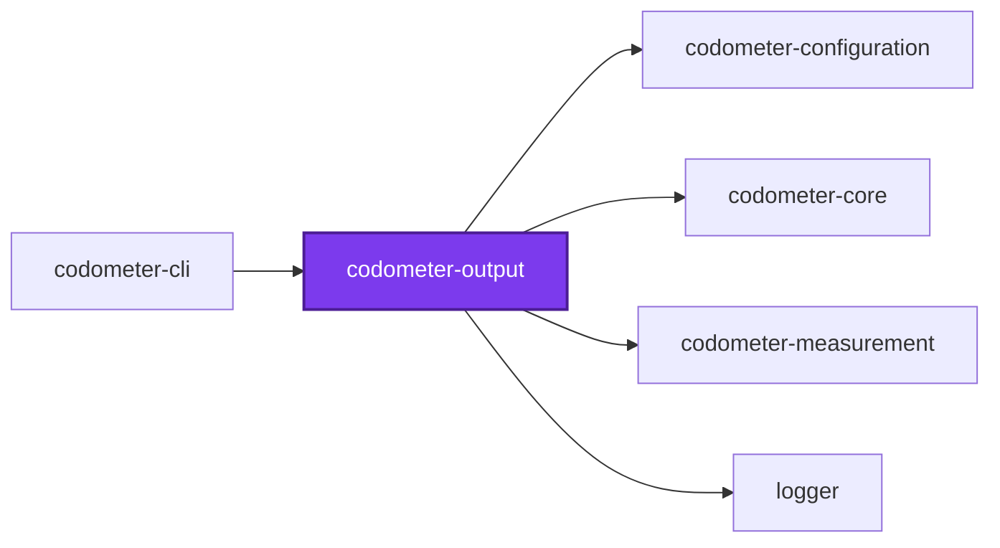
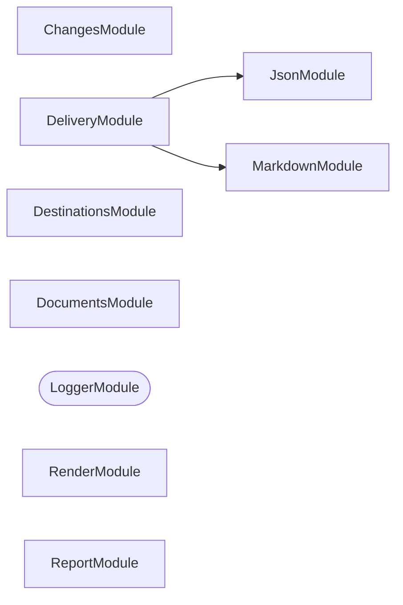

## Test

```bash
nx run codometer-output:vitest
```

<!-- CALL_STACKS_START -->

## 🔭 Callidescope

Call stacks traced through `packages/ic-suite/codometer/codometer-output`, deepest first. Each frame shows what it takes, what it returns, and what its documentation says.

| Measure | Value |
| --- | --- |
| Callables | 166 |
| Files | 45 |
| Calls traced | 346 |
| Call stacks | 2 |
| Deepest stack | 4 |
| Stacks through recursion | 0 |
| Unfollowable calls | 4 |

### Limits

What this project is judged against, as declared in its own `callidescope.config.ts`.

| Limit | Value |
| --- | --- |
| `maximumDepth` | 11 |
| `maximumBreadth` | 16 |

### Call stacks (depth)

**1. `MarkdownService.syncAnchoredBlock`** — depth ≥ 4 · orphan-root

```text
🚀 MarkdownService.syncAnchoredBlock(…): boolean [packages/ic-suite/codometer/codometer-output/src/modules/markdown/markdown.service.ts:80]
  └─> MarkdownService.syncAnchoredBlock(args: SyncAnchoredBlockArguments): boolean [packages/ic-suite/codometer/codometer-output/src/modules/markdown/markdown.service.ts:204]
     ↳ Splice the anchored block into a file, or report whether it is current.
    └─> MarkdownService.buildBlockRegex(args: { endMarker: string; startMarker: string; }): RegExp [packages/ic-suite/codometer/codometer-output/src/modules/markdown/markdown.service.ts:135]
       ↳ Build the matcher for a block delimited by the configured markers.
      └─> MarkdownService.escapeRegex(input: string): string [packages/ic-suite/codometer/codometer-output/src/modules/markdown/markdown.service.ts:147]
         ↳ Escape a configured marker so it can be searched for literally.
```

**2. `MarkdownService.wrapInAnchors`** — depth 2 · orphan-root

```text
🚀 MarkdownService.wrapInAnchors(content?: string | undefined): string [packages/ic-suite/codometer/codometer-output/src/modules/markdown/markdown.service.ts:87]
  └─> MarkdownService.wrapInAnchors(args: WrapInAnchorsArguments): string [packages/ic-suite/codometer/codometer-output/src/modules/markdown/markdown.service.ts:246]
     ↳ Wrap rendered markdown in the configured anchor markers.
```

### Breadth

| Callable | Breadth | Calls directly | Location |
| --- | --- | --- | --- |
| `MarkdownService.buildBadgeGroups` | 16 | `MarkdownService.filter(…)`, `buildRepositoryGroup`, `buildTargetsGroup`, `buildTypescriptGroup`, `buildJavascriptGroup`, `buildPythonGroup`, `buildJsonGroup`, `buildYamlGroup`, `buildTomlGroup`, `buildShellGroup`, `buildSqlGroup`, `buildHclGroup`, `buildCssGroup`, `buildCustomGroup`, `buildJupyterGroup`, `buildMarkdownGroup` | `packages/ic-suite/codometer/codometer-output/src/modules/markdown/markdown.service.ts:108` |
| `ChangesService.collectProjectRows` | 7 | `ChangesService.readProjectName`, `ChangesService.readBaseline`, `ChangesService.readReport`, `ChangesService.map(…)`, `ChangesService.map(…)`, `ChangesService.buildBaselineRow`, `ChangesService.map(…)` | `packages/ic-suite/codometer/codometer-output/src/modules/changes/changes.service.ts:110` |
| `MarkdownService.syncAnchoredBlock` | 6 | `MissingMarkdownPathError.constructor`, `MarkdownService.readExisting`, `MarkdownService.wrapInAnchors`, `MarkdownService.buildBlockRegex`, `MarkdownService.writeMarkdownFile`, `MarkdownService.replace(…)` | `packages/ic-suite/codometer/codometer-output/src/modules/markdown/markdown.service.ts:204` |

<details>
<summary>85 more callables</summary>

| Callable | Breadth | Calls directly | Location |
| --- | --- | --- | --- |
| `RenderService.renderSection` | 6 | `RenderService.groupByProject(…)`, `RenderService.groupByProject`, `RenderService.groupByProject(…)`, `RenderService.flatMap(…)`, `RenderService.readProjects`, `RenderService.renderComparison` | `packages/ic-suite/codometer/codometer-output/src/modules/render/render.service.ts:154` |
| `ChangesService.collect` | 4 | `ChangesService.map(…)`, `ChangesService.readReportPaths`, `ChangesService.flatMap(…)`, `ChangesService.flatMap(…)` | `packages/ic-suite/codometer/codometer-output/src/modules/changes/changes.service.ts:289` |
| `ConfigurationService.findConfigurationFiles` | 4 | `ConfigurationService.resolveWalkExclusions`, `DiscoveryService.discoverFiles`, `ConfigurationService.toSorted(…)`, `ConfigurationService.filter(…)` | `packages/ic-suite/codometer/codometer-output/src/modules/configuration/configuration.service.ts:185` |
| `buildRepositoryGroup` | 4 | `buildGroup`, `buildBadge`, `formatBytes`, `buildCustomBadges` | `packages/ic-suite/codometer/codometer-output/src/modules/markdown/markdown.utilities.ts:263` |
| `RenderService.renderProject` | 4 | `RenderService.filter(…)`, `RenderService.readIsOpen`, `RenderService.renderFailures`, `RenderService.map(…)` | `packages/ic-suite/codometer/codometer-output/src/modules/render/render.service.ts:106` |
| `ChangesService.map(…)` | 3 | `ChangesService.readBreach`, `ChangesService.readLabel`, `ChangesService.readGoverningLimit` | `packages/ic-suite/codometer/codometer-output/src/modules/changes/changes.service.ts:223` |
| `ChangesService.readReportPaths` | 3 | `ChangesService.flatMap(…)`, `ChangesService.map(…)`, `ChangesService.flatMap(…)` | `packages/ic-suite/codometer/codometer-output/src/modules/changes/changes.service.ts:264` |
| `RenderConfigurationService.renderDirectory` | 3 | `RenderConfigurationService.renderNames`, `RenderConfigurationService.map(…)`, `RenderConfigurationService.map(…)` | `packages/ic-suite/codometer/codometer-output/src/modules/configuration/render-configuration.service.ts:36` |
| `RenderConfigurationService.renderLimitsTable` | 3 | `RenderConfigurationService.renderRow`, `RenderConfigurationService.map(…)`, `RenderConfigurationService.map(…)` | `packages/ic-suite/codometer/codometer-output/src/modules/configuration/render-configuration.service.ts:64` |
| `RenderConfigurationService.render` | 3 | `RenderConfigurationService.renderRootError`, `RenderConfigurationService.renderLimitsTable`, `RenderConfigurationService.map(…)` | `packages/ic-suite/codometer/codometer-output/src/modules/configuration/render-configuration.service.ts:117` |
| `buildCssGroup` | 3 | `buildGroup`, `buildBadge`, `buildCustomBadges` | `packages/ic-suite/codometer/codometer-output/src/modules/markdown/markdown.utilities.ts:23` |
| `buildHclGroup` | 3 | `buildGroup`, `buildBadge`, `buildCustomBadges` | `packages/ic-suite/codometer/codometer-output/src/modules/markdown/markdown.utilities.ts:116` |
| `buildJsonGroup` | 3 | `buildGroup`, `buildBadge`, `buildCustomBadges` | `packages/ic-suite/codometer/codometer-output/src/modules/markdown/markdown.utilities.ts:156` |
| `buildJupyterGroup` | 3 | `buildGroup`, `buildBadge`, `buildCustomBadges` | `packages/ic-suite/codometer/codometer-output/src/modules/markdown/markdown.utilities.ts:177` |
| `buildMarkdownGroup` | 3 | `buildGroup`, `buildBadge`, `buildCustomBadges` | `packages/ic-suite/codometer/codometer-output/src/modules/markdown/markdown.utilities.ts:206` |
| `buildPythonGroup` | 3 | `buildGroup`, `buildBadge`, `buildCustomBadges` | `packages/ic-suite/codometer/codometer-output/src/modules/markdown/markdown.utilities.ts:235` |
| `buildShellGroup` | 3 | `buildGroup`, `buildBadge`, `buildCustomBadges` | `packages/ic-suite/codometer/codometer-output/src/modules/markdown/markdown.utilities.ts:281` |
| `buildSqlGroup` | 3 | `buildGroup`, `buildBadge`, `buildCustomBadges` | `packages/ic-suite/codometer/codometer-output/src/modules/markdown/markdown.utilities.ts:301` |
| `buildTomlGroup` | 3 | `buildGroup`, `buildBadge`, `buildCustomBadges` | `packages/ic-suite/codometer/codometer-output/src/modules/markdown/markdown.utilities.ts:352` |
| `buildTypescriptGroup` | 3 | `buildGroup`, `buildBadge`, `buildCustomBadges` | `packages/ic-suite/codometer/codometer-output/src/modules/markdown/markdown.utilities.ts:368` |
| `buildYamlGroup` | 3 | `buildGroup`, `buildBadge`, `buildCustomBadges` | `packages/ic-suite/codometer/codometer-output/src/modules/markdown/markdown.utilities.ts:383` |
| `MarkdownService.sync` | 3 | `MarkdownService.scopeCustomStatistics`, `MarkdownService.renderDocument`, `MarkdownService.buildAnchorHelpers` | `packages/ic-suite/codometer/codometer-output/src/modules/markdown/markdown.service.ts:355` |
| `DeliveryService.deliverConsole` | 3 | `JsonService.render`, `MarkdownService.renderBlock`, `DeliveryService.readTargetSizes` | `packages/ic-suite/codometer/codometer-output/src/modules/delivery/delivery.service.ts:48` |
| `DeliveryService.deliverMarkdown` | 3 | `DeliveryService.touchesFiles`, `MarkdownService.sync`, `DeliveryService.readTargetSizes` | `packages/ic-suite/codometer/codometer-output/src/modules/delivery/delivery.service.ts:104` |
| `DeliveryService.deliver` | 3 | `DeliveryService.deliverConsole`, `DeliveryService.deliverJson`, `DeliveryService.deliverMarkdown` | `packages/ic-suite/codometer/codometer-output/src/modules/delivery/delivery.service.ts:166` |
| `DocumentsService.emit` | 3 | `DocumentsService.wrap`, `DocumentsService.readDocument`, `DocumentsService.splice` | `packages/ic-suite/codometer/codometer-output/src/modules/documents/documents.service.ts:51` |
| `RenderService.renderRow` | 3 | `RenderService.readStatus`, `formatValue`, `formatDelta` | `packages/ic-suite/codometer/codometer-output/src/modules/render/render.service.ts:134` |
| `ReportService.buildMetrics` | 3 | `ReportService.buildMetricName`, `ReportService.map(…)`, `ReportService.readUnit` | `packages/ic-suite/codometer/codometer-output/src/modules/report/report.service.ts:52` |
| `ChangesService.readBaseline` | 2 | `ChangesService.readReport`, `ChangesService.map(…)` | `packages/ic-suite/codometer/codometer-output/src/modules/changes/changes.service.ts:154` |
| `ChangesService.readBreach` | 2 | `ChangesService.filter(…)`, `ChangesService.some(…)` | `packages/ic-suite/codometer/codometer-output/src/modules/changes/changes.service.ts:175` |
| `ChangesService.readGoverningLimit` | 2 | `ChangesService.filter(…)`, `ChangesService.map(…)` | `packages/ic-suite/codometer/codometer-output/src/modules/changes/changes.service.ts:195` |
| `ChangesService.readReport` | 2 | `ChangesService.parseReport`, `ChangesService.flatMap(…)` | `packages/ic-suite/codometer/codometer-output/src/modules/changes/changes.service.ts:240` |
| `formatValue` | 2 | `formatBytes`, `formatCount` | `packages/ic-suite/codometer/codometer-output/src/modules/render/render.utilities.ts:34` |
| `ConfigurationService.formatLimitValue` | 2 | `formatBytes`, `formatCount` | `packages/ic-suite/codometer/codometer-output/src/modules/configuration/configuration.service.ts:98` |
| `ConfigurationService.describeConfigurations` | 2 | `ConfigurationService.findConfigurationFiles`, `ConfigurationService.describeConfiguration` | `packages/ic-suite/codometer/codometer-output/src/modules/configuration/configuration.service.ts:152` |
| `JsonService.sync` | 2 | `JsonService.render`, `JsonService.readExisting` | `packages/ic-suite/codometer/codometer-output/src/modules/json/json.service.ts:62` |
| `buildCustomBadges` | 2 | `map(…)`, `filter(…)` | `packages/ic-suite/codometer/codometer-output/src/modules/markdown/markdown.utilities.ts:47` |
| `buildCustomGroup` | 2 | `buildCustomBadges`, `buildGroup` | `packages/ic-suite/codometer/codometer-output/src/modules/markdown/markdown.utilities.ts:64` |
| `buildCustomStatisticInstancesSection` | 2 | `map(…)`, `filter(…)` | `packages/ic-suite/codometer/codometer-output/src/modules/markdown/markdown.utilities.ts:85` |
| `map(…)` | 2 | `map(…)`, `buildGroup` | `packages/ic-suite/codometer/codometer-output/src/modules/markdown/markdown.utilities.ts:90` |
| `buildJavascriptGroup` | 2 | `buildGroup`, `buildBadge` | `packages/ic-suite/codometer/codometer-output/src/modules/markdown/markdown.utilities.ts:134` |
| `buildTargetsGroup` | 2 | `buildGroup`, `map(…)` | `packages/ic-suite/codometer/codometer-output/src/modules/markdown/markdown.utilities.ts:334` |
| `map(…)` | 2 | `buildBadge`, `formatTargetSize` | `packages/ic-suite/codometer/codometer-output/src/modules/markdown/markdown.utilities.ts:345` |
| `MarkdownService.scopeCustomStatistics` | 2 | `MarkdownService.map(…)`, `MarkdownService.filter(…)` | `packages/ic-suite/codometer/codometer-output/src/modules/markdown/markdown.service.ts:173` |
| `MarkdownService.renderBadges` | 2 | `MarkdownService.renderDocument`, `MarkdownService.scopeCustomStatistics` | `packages/ic-suite/codometer/codometer-output/src/modules/markdown/markdown.service.ts:283` |
| `MarkdownService.renderBlock` | 2 | `MarkdownService.wrapInAnchors`, `MarkdownService.renderBadges` | `packages/ic-suite/codometer/codometer-output/src/modules/markdown/markdown.service.ts:298` |
| `MarkdownService.renderDocument` | 2 | `MarkdownService.buildBadgeGroups`, `buildCustomStatisticInstancesSection` | `packages/ic-suite/codometer/codometer-output/src/modules/markdown/markdown.service.ts:322` |
| `DeliveryService.deliverJson` | 2 | `DeliveryService.touchesFiles`, `JsonService.sync` | `packages/ic-suite/codometer/codometer-output/src/modules/delivery/delivery.service.ts:75` |
| `DestinationsService.resolveMarkdown` | 2 | `DestinationsService.findConfiguredOutput`, `DestinationsService.resolvePath` | `packages/ic-suite/codometer/codometer-output/src/modules/destinations/destinations.service.ts:119` |
| `DestinationsService.listOutputPaths` | 2 | `DestinationsService.map(…)`, `DestinationsService.filter(…)` | `packages/ic-suite/codometer/codometer-output/src/modules/destinations/destinations.service.ts:191` |
| `DestinationsService.resolveDestinations` | 2 | `DestinationsService.resolveJson`, `DestinationsService.resolveMarkdown` | `packages/ic-suite/codometer/codometer-output/src/modules/destinations/destinations.service.ts:234` |
| `RenderService.readProjects` | 2 | `RenderService.map(…)`, `RenderService.map(…)` | `packages/ic-suite/codometer/codometer-output/src/modules/render/render.service.ts:55` |
| `ReportService.build` | 2 | `ReportService.indexLimits`, `ReportService.buildMetrics` | `packages/ic-suite/codometer/codometer-output/src/modules/report/report.service.ts:121` |
| `ChangesService.map(…)` | 1 | `ChangesService.buildMeasuredRow` | `packages/ic-suite/codometer/codometer-output/src/modules/changes/changes.service.ts:120` |
| `ChangesService.readLabel` | 1 | `ChangesService.find(…)` | `packages/ic-suite/codometer/codometer-output/src/modules/changes/changes.service.ts:206` |
| `ChangesService.readMetrics` | 1 | `ChangesService.map(…)` | `packages/ic-suite/codometer/codometer-output/src/modules/changes/changes.service.ts:222` |
| `ChangesService.flatMap(…)` | 1 | `ChangesService.readMetrics` | `packages/ic-suite/codometer/codometer-output/src/modules/changes/changes.service.ts:256` |
| `ChangesService.map(…)` | 1 | `ChangesService.collectProjectRows` | `packages/ic-suite/codometer/codometer-output/src/modules/changes/changes.service.ts:290` |
| `formatDelta` | 1 | `formatValue` | `packages/ic-suite/codometer/codometer-output/src/modules/render/render.utilities.ts:24` |
| `ConfigurationService.describeConfiguration` | 1 | `ConfigurationService.loadConfigurationFile` | `packages/ic-suite/codometer/codometer-output/src/modules/configuration/configuration.service.ts:63` |
| `ConfigurationService.resolveWalkExclusions` | 1 | `ConfigurationService.loadConfigurationFile` | `packages/ic-suite/codometer/codometer-output/src/modules/configuration/configuration.service.ts:117` |
| `ConfigurationService.toLimitRows` | 1 | `ConfigurationService.flatMap(…)` | `packages/ic-suite/codometer/codometer-output/src/modules/configuration/configuration.service.ts:204` |
| `ConfigurationService.flatMap(…)` | 1 | `ConfigurationService.map(…)` | `packages/ic-suite/codometer/codometer-output/src/modules/configuration/configuration.service.ts:207` |
| `ConfigurationService.map(…)` | 1 | `ConfigurationService.formatLimitValue` | `packages/ic-suite/codometer/codometer-output/src/modules/configuration/configuration.service.ts:208` |
| `RenderConfigurationService.map(…)` | 1 | `RenderConfigurationService.renderRow` | `packages/ic-suite/codometer/codometer-output/src/modules/configuration/render-configuration.service.ts:72` |
| `RenderConfigurationService.map(…)` | 1 | `RenderConfigurationService.renderDirectory` | `packages/ic-suite/codometer/codometer-output/src/modules/configuration/render-configuration.service.ts:144` |
| `buildBadge` | 1 | `encodeValue` | `packages/ic-suite/codometer/codometer-output/src/modules/markdown/markdown.utilities.ts:14` |
| `map(…)` | 1 | `buildBadge` | `packages/ic-suite/codometer/codometer-output/src/modules/markdown/markdown.utilities.ts:53` |
| `formatTargetSize` | 1 | `formatBytes` | `packages/ic-suite/codometer/codometer-output/src/modules/markdown/markdown.utilities.ts:420` |
| `MarkdownService.syncAnchoredBlock` | 1 | `MarkdownService.syncAnchoredBlock` | `packages/ic-suite/codometer/codometer-output/src/modules/markdown/markdown.service.ts:80` |
| `MarkdownService.wrapInAnchors` | 1 | `MarkdownService.wrapInAnchors` | `packages/ic-suite/codometer/codometer-output/src/modules/markdown/markdown.service.ts:87` |
| `MarkdownService.buildBlockRegex` | 1 | `MarkdownService.escapeRegex` | `packages/ic-suite/codometer/codometer-output/src/modules/markdown/markdown.service.ts:135` |
| `DeliveryService.readTargetSizes` | 1 | `DeliveryService.flatMap(…)` | `packages/ic-suite/codometer/codometer-output/src/modules/delivery/delivery.service.ts:139` |
| `DestinationsService.findConfiguredOutput` | 1 | `DestinationsService.find(…)` | `packages/ic-suite/codometer/codometer-output/src/modules/destinations/destinations.service.ts:50` |
| `DestinationsService.resolveJson` | 1 | `DestinationsService.findConfiguredOutput` | `packages/ic-suite/codometer/codometer-output/src/modules/destinations/destinations.service.ts:61` |
| `DestinationsService.resolveConsoleMarkdown` | 1 | `DestinationsService.resolveMarkdown` | `packages/ic-suite/codometer/codometer-output/src/modules/destinations/destinations.service.ts:219` |
| `DestinationsService.selectScope` | 1 | `DestinationsService.some(…)` | `packages/ic-suite/codometer/codometer-output/src/modules/destinations/destinations.service.ts:258` |
| `DocumentsService.splice` | 1 | `DocumentsService.filter(…)` | `packages/ic-suite/codometer/codometer-output/src/modules/documents/documents.service.ts:88` |
| `RenderService.readIsOpen` | 1 | `RenderService.some(…)` | `packages/ic-suite/codometer/codometer-output/src/modules/render/render.service.ts:47` |
| `RenderService.renderFailures` | 1 | `RenderService.map(…)` | `packages/ic-suite/codometer/codometer-output/src/modules/render/render.service.ts:89` |
| `RenderService.filter(…)` | 1 | `hasChanged` | `packages/ic-suite/codometer/codometer-output/src/modules/render/render.service.ts:111` |
| `RenderService.map(…)` | 1 | `RenderService.renderRow` | `packages/ic-suite/codometer/codometer-output/src/modules/render/render.service.ts:127` |
| `RenderService.flatMap(…)` | 1 | `RenderService.renderProject` | `packages/ic-suite/codometer/codometer-output/src/modules/render/render.service.ts:161` |
| `ReportService.map(…)` | 1 | `ReportService.buildLimit` | `packages/ic-suite/codometer/codometer-output/src/modules/report/report.service.ts:64` |
| `ReportService.indexLimits` | 1 | `ReportService.buildMetricName` | `packages/ic-suite/codometer/codometer-output/src/modules/report/report.service.ts:88` |

</details>
<!-- CALL_STACKS_END -->

## 🕸️ Codependix

Dependency graphs exported by [codependix](https://github.com/JimmyPaolini/codebase/tree/main/packages/ic-suite/codependix/codependix-cli), regenerated by `nx run codebase:codependix:write`.

### Nx Neighborhood

<!-- codependix:start name="codependix-nx-projects" -->

<!-- codependix:end name="codependix-nx-projects" -->

### NestJS Module Graph

<!-- codependix:start name="codependix-nestjs-modules" -->


_Rounded modules are global: every module can inject them, so their edges are left out._
<!-- codependix:end name="codependix-nestjs-modules" -->

### File Imports

```mermaid
graph LR
  file_callidescope_config_ts["callidescope.config.ts"]
  file_codependix_config_ts["codependix.config.ts"]
  file_codometer_config_ts["codometer.config.ts"]
  file_eslint_config_ts["eslint.config.ts"]
  file_src_index_ts["src/index.ts"]
  file_src_modules_changes_changes_constants_ts["src/modules/changes/changes.constants.ts"]
  file_src_modules_changes_changes_module_ts["src/modules/changes/changes.module.ts"]
  file_src_modules_changes_changes_module_unit_test_ts["src/modules/changes/changes.module.unit.test.ts"]
  file_src_modules_changes_changes_service_ts["src/modules/changes/changes.service.ts"]
  file_src_modules_changes_changes_service_unit_test_ts["src/modules/changes/changes.service.unit.test.ts"]
  file_src_modules_changes_changes_types_ts["src/modules/changes/changes.types.ts"]
  file_src_modules_delivery_delivery_constants_ts["src/modules/delivery/delivery.constants.ts"]
  file_src_modules_delivery_delivery_module_ts["src/modules/delivery/delivery.module.ts"]
  file_src_modules_delivery_delivery_service_ts["src/modules/delivery/delivery.service.ts"]
  file_src_modules_delivery_delivery_service_unit_test_ts["src/modules/delivery/delivery.service.unit.test.ts"]
  file_src_modules_delivery_delivery_types_ts["src/modules/delivery/delivery.types.ts"]
  file_src_modules_destinations_destinations_constants_ts["src/modules/destinations/destinations.constants.ts"]
  file_src_modules_destinations_destinations_module_ts["src/modules/destinations/destinations.module.ts"]
  file_src_modules_destinations_destinations_service_ts["src/modules/destinations/destinations.service.ts"]
  file_src_modules_destinations_destinations_service_unit_test_ts["src/modules/destinations/destinations.service.unit.test.ts"]
  file_src_modules_destinations_destinations_types_ts["src/modules/destinations/destinations.types.ts"]
  file_src_modules_documents_documents_constants_ts["src/modules/documents/documents.constants.ts"]
  file_src_modules_documents_documents_module_ts["src/modules/documents/documents.module.ts"]
  file_src_modules_documents_documents_module_unit_test_ts["src/modules/documents/documents.module.unit.test.ts"]
  file_src_modules_documents_documents_service_ts["src/modules/documents/documents.service.ts"]
  file_src_modules_documents_documents_service_unit_test_ts["src/modules/documents/documents.service.unit.test.ts"]
  file_src_modules_documents_documents_types_ts["src/modules/documents/documents.types.ts"]
  file_src_modules_json_json_constants_ts["src/modules/json/json.constants.ts"]
  file_src_modules_json_json_module_ts["src/modules/json/json.module.ts"]
  file_src_modules_json_json_module_unit_test_ts["src/modules/json/json.module.unit.test.ts"]
  file_src_modules_json_json_service_ts["src/modules/json/json.service.ts"]
  file_src_modules_json_json_service_unit_test_ts["src/modules/json/json.service.unit.test.ts"]
  file_src_modules_json_json_types_ts["src/modules/json/json.types.ts"]
  file_src_modules_markdown_markdown_constants_ts["src/modules/markdown/markdown.constants.ts"]
  file_src_modules_markdown_markdown_module_ts["src/modules/markdown/markdown.module.ts"]
  file_src_modules_markdown_markdown_module_unit_test_ts["src/modules/markdown/markdown.module.unit.test.ts"]
  file_src_modules_markdown_markdown_service_ts["src/modules/markdown/markdown.service.ts"]
  file_src_modules_markdown_markdown_service_unit_test_ts["src/modules/markdown/markdown.service.unit.test.ts"]
  file_src_modules_markdown_markdown_types_ts["src/modules/markdown/markdown.types.ts"]
  file_src_modules_markdown_markdown_utilities_ts["src/modules/markdown/markdown.utilities.ts"]
  file_src_modules_markdown_markdown_utilities_unit_test_ts["src/modules/markdown/markdown.utilities.unit.test.ts"]
  file_src_modules_render_render_constants_ts["src/modules/render/render.constants.ts"]
  file_src_modules_render_render_module_ts["src/modules/render/render.module.ts"]
  file_src_modules_render_render_module_unit_test_ts["src/modules/render/render.module.unit.test.ts"]
  file_src_modules_render_render_service_ts["src/modules/render/render.service.ts"]
  file_src_modules_render_render_service_unit_test_ts["src/modules/render/render.service.unit.test.ts"]
  file_src_modules_render_render_types_ts["src/modules/render/render.types.ts"]
  file_src_modules_render_render_utilities_ts["src/modules/render/render.utilities.ts"]
  file_src_modules_render_render_utilities_unit_test_ts["src/modules/render/render.utilities.unit.test.ts"]
  file_src_modules_report_report_constants_ts["src/modules/report/report.constants.ts"]
  file_src_modules_report_report_module_ts["src/modules/report/report.module.ts"]
  file_src_modules_report_report_service_ts["src/modules/report/report.service.ts"]
  file_src_modules_report_report_service_unit_test_ts["src/modules/report/report.service.unit.test.ts"]
  file_src_modules_report_report_types_ts["src/modules/report/report.types.ts"]
  file_testing_mocks_ts["testing/mocks.ts"]
  file_testing_setup_ts["testing/setup.ts"]
  file_vitest_config_ts["vitest.config.ts"]
  file_src_modules_changes_changes_module_ts --> file_src_modules_changes_changes_service_ts
  file_src_modules_changes_changes_module_unit_test_ts --> file_src_modules_changes_changes_module_ts
  file_src_modules_changes_changes_module_unit_test_ts --> file_src_modules_changes_changes_service_ts
  file_src_modules_changes_changes_service_ts --> file_src_modules_changes_changes_constants_ts
  file_src_modules_changes_changes_service_ts --> file_src_modules_changes_changes_types_ts
  file_src_modules_changes_changes_service_unit_test_ts --> file_src_modules_changes_changes_service_ts
  file_src_modules_changes_changes_service_unit_test_ts --> file_src_modules_changes_changes_types_ts
  file_src_modules_changes_changes_types_ts --> file_src_modules_changes_changes_constants_ts
  file_src_modules_delivery_delivery_constants_ts --> file_src_modules_destinations_destinations_types_ts
  file_src_modules_delivery_delivery_module_ts --> file_src_modules_delivery_delivery_service_ts
  file_src_modules_delivery_delivery_module_ts --> file_src_modules_json_json_module_ts
  file_src_modules_delivery_delivery_module_ts --> file_src_modules_markdown_markdown_module_ts
  file_src_modules_delivery_delivery_service_ts --> file_src_modules_delivery_delivery_constants_ts
  file_src_modules_delivery_delivery_service_ts --> file_src_modules_delivery_delivery_types_ts
  file_src_modules_delivery_delivery_service_ts --> file_src_modules_json_json_service_ts
  file_src_modules_delivery_delivery_service_ts --> file_src_modules_markdown_markdown_service_ts
  file_src_modules_delivery_delivery_service_ts --> file_src_modules_markdown_markdown_types_ts
  file_src_modules_delivery_delivery_service_unit_test_ts --> file_src_modules_delivery_delivery_service_ts
  file_src_modules_delivery_delivery_service_unit_test_ts --> file_src_modules_destinations_destinations_types_ts
  file_src_modules_delivery_delivery_service_unit_test_ts --> file_src_modules_json_json_service_ts
  file_src_modules_delivery_delivery_service_unit_test_ts --> file_src_modules_markdown_markdown_service_ts
  file_src_modules_delivery_delivery_service_unit_test_ts --> file_testing_mocks_ts
  file_src_modules_delivery_delivery_types_ts --> file_src_modules_destinations_destinations_types_ts
  file_src_modules_delivery_delivery_types_ts --> file_src_modules_markdown_markdown_types_ts
  file_src_modules_destinations_destinations_constants_ts --> file_src_modules_destinations_destinations_types_ts
  file_src_modules_destinations_destinations_module_ts --> file_src_modules_destinations_destinations_service_ts
  file_src_modules_destinations_destinations_service_ts --> file_src_modules_destinations_destinations_types_ts
  file_src_modules_destinations_destinations_service_ts --> file_src_modules_markdown_markdown_types_ts
  file_src_modules_destinations_destinations_service_unit_test_ts --> file_src_modules_destinations_destinations_service_ts
  file_src_modules_destinations_destinations_service_unit_test_ts --> file_src_modules_destinations_destinations_types_ts
  file_src_modules_documents_documents_module_ts --> file_src_modules_documents_documents_service_ts
  file_src_modules_documents_documents_module_unit_test_ts --> file_src_modules_documents_documents_module_ts
  file_src_modules_documents_documents_module_unit_test_ts --> file_src_modules_documents_documents_service_ts
  file_src_modules_documents_documents_service_ts --> file_src_modules_documents_documents_types_ts
  file_src_modules_documents_documents_service_unit_test_ts --> file_src_modules_documents_documents_service_ts
  file_src_modules_documents_documents_service_unit_test_ts --> file_src_modules_documents_documents_types_ts
  file_src_modules_json_json_module_ts --> file_src_modules_json_json_service_ts
  file_src_modules_json_json_module_unit_test_ts --> file_src_modules_json_json_module_ts
  file_src_modules_json_json_module_unit_test_ts --> file_src_modules_json_json_service_ts
  file_src_modules_json_json_service_ts --> file_src_modules_json_json_types_ts
  file_src_modules_json_json_service_unit_test_ts --> file_src_modules_json_json_service_ts
  file_src_modules_markdown_markdown_module_ts --> file_src_modules_markdown_markdown_service_ts
  file_src_modules_markdown_markdown_module_unit_test_ts --> file_src_modules_markdown_markdown_module_ts
  file_src_modules_markdown_markdown_module_unit_test_ts --> file_src_modules_markdown_markdown_service_ts
  file_src_modules_markdown_markdown_service_ts --> file_src_modules_markdown_markdown_constants_ts
  file_src_modules_markdown_markdown_service_ts --> file_src_modules_markdown_markdown_types_ts
  file_src_modules_markdown_markdown_service_ts --> file_src_modules_markdown_markdown_utilities_ts
  file_src_modules_markdown_markdown_service_unit_test_ts --> file_src_modules_markdown_markdown_constants_ts
  file_src_modules_markdown_markdown_service_unit_test_ts --> file_src_modules_markdown_markdown_service_ts
  file_src_modules_markdown_markdown_utilities_ts --> file_src_modules_markdown_markdown_types_ts
  file_src_modules_markdown_markdown_utilities_ts --> file_src_modules_render_render_utilities_ts
  file_src_modules_markdown_markdown_utilities_unit_test_ts --> file_src_modules_markdown_markdown_utilities_ts
  file_src_modules_render_render_module_ts --> file_src_modules_render_render_service_ts
  file_src_modules_render_render_module_unit_test_ts --> file_src_modules_render_render_module_ts
  file_src_modules_render_render_module_unit_test_ts --> file_src_modules_render_render_service_ts
  file_src_modules_render_render_service_ts --> file_src_modules_changes_changes_types_ts
  file_src_modules_render_render_service_ts --> file_src_modules_render_render_constants_ts
  file_src_modules_render_render_service_ts --> file_src_modules_render_render_types_ts
  file_src_modules_render_render_service_ts --> file_src_modules_render_render_utilities_ts
  file_src_modules_render_render_service_unit_test_ts --> file_src_modules_changes_changes_types_ts
  file_src_modules_render_render_service_unit_test_ts --> file_src_modules_render_render_service_ts
  file_src_modules_render_render_types_ts --> file_src_modules_changes_changes_types_ts
  file_src_modules_render_render_utilities_ts --> file_src_modules_changes_changes_types_ts
  file_src_modules_render_render_utilities_unit_test_ts --> file_src_modules_changes_changes_types_ts
  file_src_modules_render_render_utilities_unit_test_ts --> file_src_modules_render_render_utilities_ts
  file_src_modules_report_report_module_ts --> file_src_modules_report_report_service_ts
  file_src_modules_report_report_service_ts --> file_src_modules_report_report_constants_ts
  file_src_modules_report_report_service_ts --> file_src_modules_report_report_types_ts
  file_src_modules_report_report_service_unit_test_ts --> file_src_modules_report_report_service_ts
```

<!-- codependix:start name="codependix-file-imports" -->

<!-- codependix:end name="codependix-file-imports" -->

<!-- CODE_STATISTICS_START -->

## ⏲️ Codometer

### Project


### Measured Targets


### TypeScript


### JavaScript


### Python


### JSON


### YAML


### TOML


### Shell


### SQL


### HCL


### CSS


### Conventions


### Jupyter


### Markdown


<!-- CODE_STATISTICS_END -->
