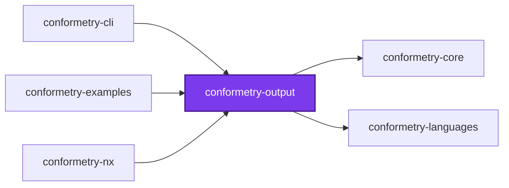
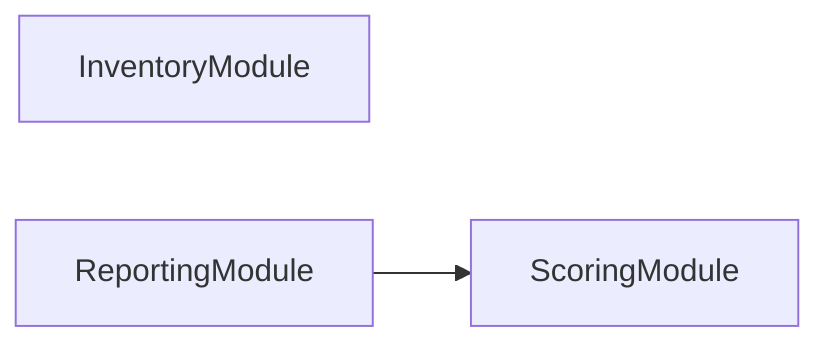
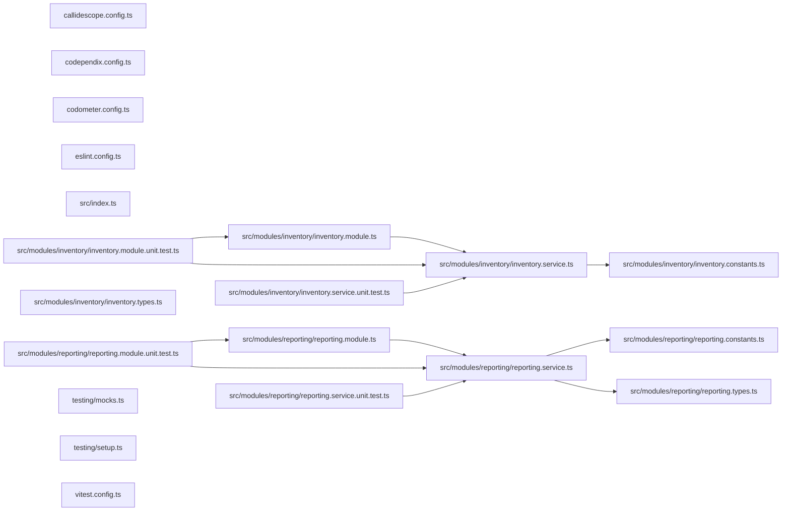

# 👔 Conformetry Output

Every render target [Conformetry](../conformetry-cli/README.md) has. It sits at
the output layer of the five-layer spine — `core <- configuration <- analysis
<- output <- cli` — so it reads what analysis produced and turns it into text,
and runs no analysis of its own.

```bash
npm install --save-dev @conformetry/output
```

## What it owns

| Module | Responsibility |
| ------ | -------------- |
| `reporting` | Renders structured conformance differences, and the per-instance score summary above them, as readable and actionable text |
| `inventory` | Renders the template and instance inventory: the indent ladder, the headings, and the match percentage |

Both are rendering, and both used to live in
[`@conformetry/core`](../conformetry-core/README.md) — which is why that package
could not be a contracts leaf. They are here so that "the host composes, the
output renders" is true of conformetry the way it is of its three siblings, and
so that adding a render format has exactly one home.

## Where a host gets them

`ReportingModule` and `InventoryModule` are named explicitly by whichever host
wants them. Neither is re-exported by `ValidationModule`: validation is an
analysis package and sits _beneath_ this one, so it cannot reach up to hand a
renderer on.

```ts
@Module({ imports: [ReportingModule, ValidationModule] })
class EmbeddedConformetryModule {}
```

## Paths

Paths arrive absolute, because that is the only stable way for discovery to
name an instance to another process. Shortening them against a working
directory is offered as a separate step rather than folded into rendering —
only a host knows which directory a person is standing in.

## Test

```bash
nx run conformetry-output:vitest
```

## License

MIT — see [LICENSE](../../../../LICENSE).

## 👔 Conformetry

This project was generated from the [nestjs-service-project](../../configuration/conformetry-templates/nestjs-service-project) conformetry template.

## 🕸️ Codependix

Dependency graphs exported by [codependix](https://github.com/JimmyPaolini/codebase/tree/main/packages/ic-suite/codependix/codependix-cli), regenerated by `nx run codebase:codependix:write`.

<!-- CALL_STACKS_START -->

### Nx Neighborhood

<!-- codependix:start name="codependix-nx-projects" -->

<!-- codependix:end name="codependix-nx-projects" -->

### NestJS Module Graph

<!-- codependix:start name="codependix-nestjs-modules" -->

<!-- codependix:end name="codependix-nestjs-modules" -->

### File Imports

<!-- codependix:start name="codependix-file-imports" -->

<!-- codependix:end name="codependix-file-imports" -->

## 🔭 Callidescope

Call stacks traced through `packages/ic-suite/conformetry/conformetry-output`, deepest first. Each frame shows what it takes, what it returns, and what its documentation says.

| Measure | Value |
| --- | --- |
| Callables | 32 |
| Files | 14 |
| Calls traced | 34 |
| Call stacks | 0 |
| Deepest stack | 0 |
| Stacks through recursion | 0 |
| Unfollowable calls | 0 |

### Limits

What this project is judged against, as declared in its own `callidescope.config.ts`.

| Limit | Value |
| --- | --- |
| `maximumDepth` | 6 |
| `maximumBreadth` | 4 |

### Call stacks (depth)

None.

### Breadth

| Callable | Breadth | Calls directly | Location |
| --- | --- | --- | --- |
| `ReportingService.formatTotal` | 4 | `ReportingService.reduce(…)`, `ReportingService.reduce(…)`, `ReportingService.filter(…)`, `ReportingService.formatFraction` | `packages/ic-suite/conformetry/conformetry-output/src/modules/reporting/reporting.service.ts:234` |
| `ReportingService.formatFileResult` | 3 | `ReportingService.formatFraction`, `ScoringService.sumWeights`, `ReportingService.flatMap(…)` | `packages/ic-suite/conformetry/conformetry-output/src/modules/reporting/reporting.service.ts:98` |
| `ReportingService.formatScores` | 3 | `ReportingService.filter(…)`, `ReportingService.map(…)`, `ReportingService.formatTotal` | `packages/ic-suite/conformetry/conformetry-output/src/modules/reporting/reporting.service.ts:197` |

<details>
<summary>19 more callables</summary>

| Callable | Breadth | Calls directly | Location |
| --- | --- | --- | --- |
| `ReportingService.formatFraction` | 2 | `ScoringService.calculateScore`, `ReportingService.formatPercentage` | `packages/ic-suite/conformetry/conformetry-output/src/modules/reporting/reporting.service.ts:131` |
| `ReportingService.formatScore` | 2 | `ReportingService.formatPercentage`, `ReportingService.formatFraction` | `packages/ic-suite/conformetry/conformetry-output/src/modules/reporting/reporting.service.ts:166` |
| `ReportingService.formatReport` | 2 | `ReportingService.formatScores`, `ReportingService.flatMap(…)` | `packages/ic-suite/conformetry/conformetry-output/src/modules/reporting/reporting.service.ts:262` |
| `InventoryService.describePairing` | 1 | `InventoryService.formatRatio` | `packages/ic-suite/conformetry/conformetry-output/src/modules/inventory/inventory.service.ts:48` |
| `InventoryService.describeInstances` | 1 | `InventoryService.flatMap(…)` | `packages/ic-suite/conformetry/conformetry-output/src/modules/inventory/inventory.service.ts:77` |
| `InventoryService.flatMap(…)` | 1 | `InventoryService.map(…)` | `packages/ic-suite/conformetry/conformetry-output/src/modules/inventory/inventory.service.ts:78` |
| `InventoryService.map(…)` | 1 | `InventoryService.describePairing` | `packages/ic-suite/conformetry/conformetry-output/src/modules/inventory/inventory.service.ts:82` |
| `InventoryService.describeTemplates` | 1 | `InventoryService.flatMap(…)` | `packages/ic-suite/conformetry/conformetry-output/src/modules/inventory/inventory.service.ts:94` |
| `InventoryService.flatMap(…)` | 1 | `InventoryService.map(…)` | `packages/ic-suite/conformetry/conformetry-output/src/modules/inventory/inventory.service.ts:98` |
| `InventoryService.map(…)` | 1 | `InventoryService.describePairing` | `packages/ic-suite/conformetry/conformetry-output/src/modules/inventory/inventory.service.ts:109` |
| `InventoryService.shortenInstancePaths` | 1 | `InventoryService.map(…)` | `packages/ic-suite/conformetry/conformetry-output/src/modules/inventory/inventory.service.ts:120` |
| `InventoryService.map(…)` | 1 | `InventoryService.shortenPath` | `packages/ic-suite/conformetry/conformetry-output/src/modules/inventory/inventory.service.ts:124` |
| `InventoryService.shortenTemplatePairings` | 1 | `InventoryService.map(…)` | `packages/ic-suite/conformetry/conformetry-output/src/modules/inventory/inventory.service.ts:136` |
| `InventoryService.map(…)` | 1 | `InventoryService.map(…)` | `packages/ic-suite/conformetry/conformetry-output/src/modules/inventory/inventory.service.ts:140` |
| `InventoryService.map(…)` | 1 | `InventoryService.shortenPath` | `packages/ic-suite/conformetry/conformetry-output/src/modules/inventory/inventory.service.ts:143` |
| `ReportingService.formatError` | 1 | `ReportingService.formatLocation` | `packages/ic-suite/conformetry/conformetry-output/src/modules/reporting/reporting.service.ts:54` |
| `ReportingService.flatMap(…)` | 1 | `ReportingService.formatError` | `packages/ic-suite/conformetry/conformetry-output/src/modules/reporting/reporting.service.ts:115` |
| `ReportingService.map(…)` | 1 | `ReportingService.formatScore` | `packages/ic-suite/conformetry/conformetry-output/src/modules/reporting/reporting.service.ts:211` |
| `ReportingService.flatMap(…)` | 1 | `ReportingService.formatFileResult` | `packages/ic-suite/conformetry/conformetry-output/src/modules/reporting/reporting.service.ts:274` |

</details>
<!-- CALL_STACKS_END -->
