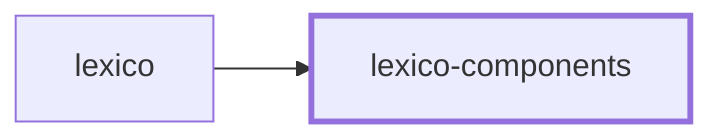

# 🎨 Lexico Components

**Shared React component library built on shadcn/ui and Radix UI primitives.**

A collection of accessible, customizable UI components for the codebase, providing a consistent design system across applications. Built with Tailwind CSS, TypeScript, and shadcn/ui (New York style).

The interface half of the [Lexico](../../applications/lexico/README.md) suite:

| Project | Role |
| ------- | ---- |
| 🐺 [lexico](../../applications/lexico/README.md) | The SSR web application |
| 🎨 [lexico-components](README.md) | This package — shared React components |
| 📖 [lexico-entities](../lexico-entities/README.md) | TypeORM entities and migrations |
| 🚰 [lexico-ingestion](../../applications/lexico-ingestion/README.md) | Dictionary and literature ingestion |

## Project Graph

Where this project sits in the Nx project graph: what it depends on, and what depends on it. Regenerated by `nx run synchronization:synchronize --configuration=write`.

<!-- nx-project-graph-start -->



<!-- nx-project-graph-end -->

## Features

- **50+ UI Components**: Buttons, cards, forms, dialogs, navigation, feedback, and more
- **Accessible**: WCAG 2.1 AA compliant, keyboard navigation, screen reader support
- **Themeable**: CSS variables for light/dark mode, customizable colors
- **Type-Safe**: Full TypeScript support with strict mode
- **Tree-Shakeable**: Only bundle components you actually use
- **Radix UI Primitives**: Built on high-quality, unstyled component primitives

## Quick Start

### Installation

This package is already available in the codebase via workspace protocol. Import from consuming applications:

```tsx
// In applications/lexico/src/routes/example.tsx
import { Button, Card, Input } from "@codebase/lexico-components";
import "@codebase/lexico-components/styles/globals.css"; // Import once in root layout

function ExamplePage() {
  return (
    <Card>
      <CardHeader>
        <CardTitle>Example Card</CardTitle>
      </CardHeader>
      <CardContent>
        <Input placeholder="Enter text..." />
        <Button>Submit</Button>
      </CardContent>
    </Card>
  );
}
```

### Import Styles

Add global CSS import to your root layout:

```tsx
// applications/lexico/src/routes/__root.tsx
import "@codebase/lexico-components/styles/globals.css";
```

## Component Categories

### Layout & Structure

- **Card**: Content containers with header, content, footer sections
- **Separator**: Divider lines for visual separation
- **Accordion**: Collapsible content sections
- **Tabs**: Tabbed navigation and content
- **Sidebar**: Navigation sidebar with collapsible sections
- **Resizable**: Resizable panel layouts

### Form Controls

- **Input**: Text input field
- **Textarea**: Multi-line text input
- **Select**: Dropdown selection menu
- **Checkbox**: Boolean selection control
- **Radio Group**: Single selection from multiple options
- **Switch**: Toggle control for binary states
- **Slider**: Range selection control
- **Label**: Form field labels with accessibility

### Buttons & Navigation

- **Button**: Primary action buttons with variants
- **Button Group**: Grouped button controls
- **Navigation Menu**: Multi-level navigation menus
- **Breadcrumb**: Hierarchical path display
- **Dropdown Menu**: Context menus with actions
- **Command**: Cmd+K style command palette

### Feedback & Status

- **Badge**: Status indicators and labels
- **Spinner**: Loading indicator
- **Skeleton**: Loading placeholder animation
- **Progress**: Progress bar indicator
- **Alert**: Informational messages
- **Toast (Sonner)**: Temporary notification messages

### Overlays & Dialogs

- **Dialog**: Modal dialogs
- **Sheet**: Slide-over panels
- **Drawer**: Mobile-friendly bottom sheets
- **Popover**: Floating content containers
- **Tooltip**: Hover hints and descriptions
- **Hover Card**: Rich hover previews

## Adding Components

### Add from shadcn Registry

```bash
# Navigate to package directory
cd packages/lexico-components

# Add component
pnpx shadcn@latest add <component-name>

# Examples
pnpx shadcn@latest add dropdown-menu
pnpx shadcn@latest add command
pnpx shadcn@latest add sonner
```

### Export in Index

After adding a component, export it in [src/index.ts](src/index.ts):

```typescript
export * from "./components/ui/dropdown-menu";
```

### Create Custom Components

For project-specific components, create in `src/components/` (not `ui/`):

```tsx
// src/components/word-card.tsx
import { Card, CardContent, CardHeader, CardTitle } from "@/components/ui/card";

export interface WordCardProps {
  word: string;
  definition: string;
}

export function WordCard({ word, definition }: WordCardProps) {
  return (
    <Card>
      <CardHeader>
        <CardTitle>{word}</CardTitle>
      </CardHeader>
      <CardContent>
        <p>{definition}</p>
      </CardContent>
    </Card>
  );
}
```

**⚠️ Important**: Never modify files in `src/components/ui/` directly - they are managed by shadcn CLI and will be overwritten on updates.

## Theming

### CSS Variables

Customize colors by editing [src/styles/globals.css](src/styles/globals.css):

```css
:root {
  --background: 0 0% 100%;
  --foreground: 0 0% 3.9%;
  --primary: 0 0% 9%;
  --primary-foreground: 0 0% 98%;
  /* ... more colors */
}

[data-theme="dark"] {
  --background: 0 0% 3.9%;
  --foreground: 0 0% 98%;
  /* ... dark mode colors */
}
```

### Using Theme Colors

```tsx
<div className="bg-background text-foreground">
  <button className="bg-primary text-primary-foreground hover:bg-primary/90">
    Button
  </button>
</div>
```

### Dark Mode

Set `data-theme` attribute on root element:

```tsx
document.documentElement.setAttribute("data-theme", "dark");
```

Or use next-themes for automatic theme switching:

```tsx
import { ThemeProvider } from "next-themes";

<ThemeProvider
  attribute="data-theme"
  defaultTheme="system"
>
  {children}
</ThemeProvider>;
```

## Development

### Build Library

```bash
nx run lexico-components:build
```

### Type Checking

```bash
nx run lexico-components:typecheck
```

### Type Coverage

```bash
nx run lexico-components:type-coverage
# Target: 99.84%
```

### Bundle Size Analysis

```bash
nx run lexico-components:bundlesize
# Limit: 25 KB gzipped
```

## Usage Examples

### Button Variants

```tsx
<Button variant="default">Default</Button>
<Button variant="secondary">Secondary</Button>
<Button variant="destructive">Delete</Button>
<Button variant="ghost">Ghost</Button>
<Button variant="link">Link</Button>

<Button size="sm">Small</Button>
<Button size="default">Default</Button>
<Button size="lg">Large</Button>
```

### Form with Validation

```tsx
import { Input, Label, Button } from "@codebase/lexico-components";

function LoginForm() {
  return (
    <form>
      <div>
        <Label htmlFor="email">Email</Label>
        <Input
          id="email"
          type="email"
          placeholder="you@example.com"
        />
      </div>
      <div>
        <Label htmlFor="password">Password</Label>
        <Input
          id="password"
          type="password"
        />
      </div>
      <Button type="submit">Sign In</Button>
    </form>
  );
}
```

### Dialog

```tsx
import {
  Dialog,
  DialogContent,
  DialogHeader,
  DialogTitle,
  DialogTrigger,
  Button,
} from "@codebase/lexico-components";

function ConfirmDialog() {
  return (
    <Dialog>
      <DialogTrigger asChild>
        <Button>Open Dialog</Button>
      </DialogTrigger>
      <DialogContent>
        <DialogHeader>
          <DialogTitle>Are you sure?</DialogTitle>
        </DialogHeader>
        <p>This action cannot be undone.</p>
        <Button>Confirm</Button>
      </DialogContent>
    </Dialog>
  );
}
```

### Dropdown Menu

```tsx
import {
  DropdownMenu,
  DropdownMenuContent,
  DropdownMenuItem,
  DropdownMenuTrigger,
  Button,
} from "@codebase/lexico-components";

function UserMenu() {
  return (
    <DropdownMenu>
      <DropdownMenuTrigger asChild>
        <Button variant="ghost">Menu</Button>
      </DropdownMenuTrigger>
      <DropdownMenuContent>
        <DropdownMenuItem>Profile</DropdownMenuItem>
        <DropdownMenuItem>Settings</DropdownMenuItem>
        <DropdownMenuItem>Sign Out</DropdownMenuItem>
      </DropdownMenuContent>
    </DropdownMenu>
  );
}
```

## Configuration

### shadcn Config ([components.json](components.json))

```json
{
  "style": "new-york",
  "tailwind": {
    "baseColor": "gray",
    "cssVariables": true
  },
  "iconLibrary": "lucide"
}
```

### Tailwind Config ([tailwind.config.cjs](tailwind.config.cjs))

Extends shared Tailwind configuration with component-specific patterns:

```js
content: [
  "./src/**/*.{ts,tsx}",
  "../../packages/lexico-components/src/**/*.{ts,tsx}",
];
```

## Accessibility

All components follow WCAG 2.1 Level AA standards:

- ✅ Keyboard navigation (Tab, Enter, Space, Arrow keys)
- ✅ Focus management (visible focus indicators)
- ✅ ARIA attributes (screen reader announcements)
- ✅ Color contrast (4.5:1 for text, 3:1 for UI)

Built on Radix UI primitives which handle complex accessibility patterns automatically:

- Focus trapping in dialogs
- Roving focus in menus
- Screen reader announcements
- Keyboard shortcuts

## Troubleshooting

### Styles Not Applied

Import global CSS in your root layout:

```tsx
import "@codebase/lexico-components/styles/globals.css";
```

### Import Errors

Verify TypeScript path mapping in `tsconfig.json`:

```json
{
  "compilerOptions": {
    "paths": {
      "@codebase/lexico-components": [
        "../../packages/lexico-components/src/index.ts"
      ]
    }
  }
}
```

### Dark Mode Not Working

Set `data-theme` attribute on `<html>` or use ThemeProvider.

## Documentation

For detailed architecture, component patterns, and development workflows:

- **[AGENTS.md](AGENTS.md)**: Complete architectural documentation
- **[Main AGENTS.md](../../AGENTS.md)**: Codebase architecture and Nx workflows
- **[lexico](../../applications/lexico/README.md)**: The application these components build

External resources:

- [shadcn/ui Documentation](https://ui.shadcn.com/docs): Component reference and CLI
- [Radix UI Documentation](https://www.radix-ui.com/primitives): Primitive APIs
- [Tailwind CSS Documentation](https://tailwindcss.com/docs): Utility classes

## License

See [LICENSE](../../LICENSE) for licensing information.

<!-- CALL_STACKS_START -->

## 🔭 Callidescope

Call stacks traced through `lexico-components`, deepest first. Each frame shows what it takes, what it returns, and what its documentation says.

| Measure | Value |
| --- | --- |
| Callables | 278 |
| Files | 59 |
| Calls traced | 304 |
| Call stacks | 219 |
| Deepest stack | 3 |
| Stacks through recursion | 0 |
| Unfollowable calls | 16 |

### Call stacks

**1. `ChartStyle`** — depth 3 · orphan-root

```text
🚀 ChartStyle(…): Element | null [packages/lexico-components/src/components/ui/chart.tsx:69]
  └─> map(…)([theme, prefix]: [string, "" | ".dark"]): string [packages/lexico-components/src/components/ui/chart.tsx:89]
    └─> map(…)(…): string | null [packages/lexico-components/src/components/ui/chart.tsx:92]
```

**2. `forwardRef(…)`** — depth ≥ 3 · orphan-root

```text
🚀 forwardRef(…)(…): Element | null [packages/lexico-components/src/components/ui/chart.tsx:138]
  └─> useMemo(…)(): React.JSX.Element | null [packages/lexico-components/src/components/ui/chart.tsx:158]
    └─> getPayloadConfigurationFromPayload(…): { label?: ReactNode; icon?: ComponentType<{}>; } | undefined [packages/lexico-components/src/components/ui/chart.tsx:359]
```

**3. `forwardRef(…)`** — depth 3 · orphan-root

```text
🚀 forwardRef(…)(…): Element | null [packages/lexico-components/src/components/ui/chart.tsx:302]
  └─> map(…)(item: PayloadItem, index: number): React.JSX.Element [packages/lexico-components/src/components/ui/chart.tsx:323]
    └─> getPayloadConfigurationFromPayload(…): { label?: ReactNode; icon?: ComponentType<{}>; } | undefined [packages/lexico-components/src/components/ui/chart.tsx:359]
```

<details>
<summary>216 more call stacks</summary>

**4. `FieldError`** — depth 3 · orphan-root

```text
🚀 FieldError(…): Element | null [packages/lexico-components/src/components/ui/field.tsx:187]
  └─> useMemo(…)(…): string | number | bigint | true | Iterable<ReactNode> | Promise<AwaitedReactNode> | Element | null [packages/lexico-components/src/components/ui/field.tsx:195]
    └─> map(…)(…): "" | Element | undefined [packages/lexico-components/src/components/ui/field.tsx:211]
```

**5. `forwardRef(…)`** — depth ≥ 3 · orphan-root

```text
🚀 forwardRef(…)(…): Element [packages/lexico-components/src/components/ui/sidebar.tsx:63]
  └─> useIsMobile(): boolean [packages/lexico-components/src/hooks/use-mobile.tsx:5]
    └─> useEffect(…)(): () => void [packages/lexico-components/src/hooks/use-mobile.tsx:8]
```

**6. `useBreakpoint`** — depth ≥ 3 · orphan-root

```text
🚀 useBreakpoint(…): { isSm: boolean; isMd: boolean; isLg: boolean; isXl: boolean; is2xl: boolean; } [packages/lexico-components/src/hooks/use-media-query.ts:62]
   ↳ Hook to check if viewport is at or above a Tailwind breakpoint
  └─> useMediaQuery(query: string): boolean [packages/lexico-components/src/hooks/use-media-query.ts:16]
     ↳ A hook that returns whether a media query matches the current viewport.
    └─> useEffect(…)(): () => void [packages/lexico-components/src/hooks/use-media-query.ts:19]
```

**7. `forwardRef(…)`** — depth 2 · orphan-root

```text
🚀 forwardRef(…)(…): Element [packages/lexico-components/src/components/ui/accordion.tsx:13]
  └─> cn(...inputs: ClassValue[]): string [packages/lexico-components/src/lib/utils.ts:4]
```

**8. `forwardRef(…)`** — depth 2 · orphan-root

```text
🚀 forwardRef(…)(…): Element [packages/lexico-components/src/components/ui/accordion.tsx:25]
  └─> cn(...inputs: ClassValue[]): string [packages/lexico-components/src/lib/utils.ts:4]
```

**9. `forwardRef(…)`** — depth 2 · orphan-root

```text
🚀 forwardRef(…)(…): Element [packages/lexico-components/src/components/ui/accordion.tsx:45]
  └─> cn(...inputs: ClassValue[]): string [packages/lexico-components/src/lib/utils.ts:4]
```

**10. `forwardRef(…)`** — depth 2 · orphan-root

```text
🚀 forwardRef(…)(…): Element [packages/lexico-components/src/components/ui/alert.tsx:26]
  └─> cn(...inputs: ClassValue[]): string [packages/lexico-components/src/lib/utils.ts:4]
```

**11. `forwardRef(…)`** — depth 2 · orphan-root

```text
🚀 forwardRef(…)(…): Element [packages/lexico-components/src/components/ui/alert.tsx:39]
  └─> cn(...inputs: ClassValue[]): string [packages/lexico-components/src/lib/utils.ts:4]
```

**12. `forwardRef(…)`** — depth 2 · orphan-root

```text
🚀 forwardRef(…)(…): Element [packages/lexico-components/src/components/ui/alert.tsx:51]
  └─> cn(...inputs: ClassValue[]): string [packages/lexico-components/src/lib/utils.ts:4]
```

**13. `forwardRef(…)`** — depth 2 · orphan-root

```text
🚀 forwardRef(…)(…): Element [packages/lexico-components/src/components/ui/button.tsx:45]
  └─> cn(...inputs: ClassValue[]): string [packages/lexico-components/src/lib/utils.ts:4]
```

**14. `forwardRef(…)`** — depth 2 · orphan-root

```text
🚀 forwardRef(…)(…): Element [packages/lexico-components/src/components/ui/alert-dialog.tsx:17]
  └─> cn(...inputs: ClassValue[]): string [packages/lexico-components/src/lib/utils.ts:4]
```

**15. `forwardRef(…)`** — depth 2 · orphan-root

```text
🚀 forwardRef(…)(…): Element [packages/lexico-components/src/components/ui/alert-dialog.tsx:32]
  └─> cn(...inputs: ClassValue[]): string [packages/lexico-components/src/lib/utils.ts:4]
```

**16. `AlertDialogHeader`** — depth 2 · orphan-root

```text
🚀 AlertDialogHeader(…): Element [packages/lexico-components/src/components/ui/alert-dialog.tsx:47]
  └─> cn(...inputs: ClassValue[]): string [packages/lexico-components/src/lib/utils.ts:4]
```

**17. `AlertDialogFooter`** — depth 2 · orphan-root

```text
🚀 AlertDialogFooter(…): Element [packages/lexico-components/src/components/ui/alert-dialog.tsx:61]
  └─> cn(...inputs: ClassValue[]): string [packages/lexico-components/src/lib/utils.ts:4]
```

**18. `forwardRef(…)`** — depth 2 · orphan-root

```text
🚀 forwardRef(…)(…): Element [packages/lexico-components/src/components/ui/alert-dialog.tsx:78]
  └─> cn(...inputs: ClassValue[]): string [packages/lexico-components/src/lib/utils.ts:4]
```

**19. `forwardRef(…)`** — depth 2 · orphan-root

```text
🚀 forwardRef(…)(…): Element [packages/lexico-components/src/components/ui/alert-dialog.tsx:90]
  └─> cn(...inputs: ClassValue[]): string [packages/lexico-components/src/lib/utils.ts:4]
```

**20. `forwardRef(…)`** — depth 2 · orphan-root

```text
🚀 forwardRef(…)(…): Element [packages/lexico-components/src/components/ui/alert-dialog.tsx:103]
  └─> cn(...inputs: ClassValue[]): string [packages/lexico-components/src/lib/utils.ts:4]
```

**21. `forwardRef(…)`** — depth 2 · orphan-root

```text
🚀 forwardRef(…)(…): Element [packages/lexico-components/src/components/ui/alert-dialog.tsx:115]
  └─> cn(...inputs: ClassValue[]): string [packages/lexico-components/src/lib/utils.ts:4]
```

**22. `forwardRef(…)`** — depth 2 · orphan-root

```text
🚀 forwardRef(…)(…): Element [packages/lexico-components/src/components/ui/avatar.tsx:12]
  └─> cn(...inputs: ClassValue[]): string [packages/lexico-components/src/lib/utils.ts:4]
```

**23. `forwardRef(…)`** — depth 2 · orphan-root

```text
🚀 forwardRef(…)(…): Element [packages/lexico-components/src/components/ui/avatar.tsx:27]
  └─> cn(...inputs: ClassValue[]): string [packages/lexico-components/src/lib/utils.ts:4]
```

**24. `forwardRef(…)`** — depth 2 · orphan-root

```text
🚀 forwardRef(…)(…): Element [packages/lexico-components/src/components/ui/avatar.tsx:39]
  └─> cn(...inputs: ClassValue[]): string [packages/lexico-components/src/lib/utils.ts:4]
```

**25. `Badge`** — depth 2 · orphan-root

```text
🚀 Badge({ className, variant, ...props }: BadgeProps): React.JSX.Element [packages/lexico-components/src/components/ui/badge.tsx:31]
  └─> cn(...inputs: ClassValue[]): string [packages/lexico-components/src/lib/utils.ts:4]
```

**26. `forwardRef(…)`** — depth 2 · orphan-root

```text
🚀 forwardRef(…)(…): Element [packages/lexico-components/src/components/ui/breadcrumb.tsx:19]
  └─> cn(...inputs: ClassValue[]): string [packages/lexico-components/src/lib/utils.ts:4]
```

**27. `forwardRef(…)`** — depth 2 · orphan-root

```text
🚀 forwardRef(…)(…): Element [packages/lexico-components/src/components/ui/breadcrumb.tsx:34]
  └─> cn(...inputs: ClassValue[]): string [packages/lexico-components/src/lib/utils.ts:4]
```

**28. `forwardRef(…)`** — depth 2 · orphan-root

```text
🚀 forwardRef(…)(…): Element [packages/lexico-components/src/components/ui/breadcrumb.tsx:48]
  └─> cn(...inputs: ClassValue[]): string [packages/lexico-components/src/lib/utils.ts:4]
```

**29. `forwardRef(…)`** — depth 2 · orphan-root

```text
🚀 forwardRef(…)(…): Element [packages/lexico-components/src/components/ui/breadcrumb.tsx:64]
  └─> cn(...inputs: ClassValue[]): string [packages/lexico-components/src/lib/utils.ts:4]
```

**30. `BreadcrumbSeparator`** — depth 2 · orphan-root

```text
🚀 BreadcrumbSeparator(…): Element [packages/lexico-components/src/components/ui/breadcrumb.tsx:76]
  └─> cn(...inputs: ClassValue[]): string [packages/lexico-components/src/lib/utils.ts:4]
```

**31. `BreadcrumbEllipsis`** — depth 2 · orphan-root

```text
🚀 BreadcrumbEllipsis({ className, ...props }: React.ComponentProps<"span">): React.JSX.Element [packages/lexico-components/src/components/ui/breadcrumb.tsx:92]
  └─> cn(...inputs: ClassValue[]): string [packages/lexico-components/src/lib/utils.ts:4]
```

**32. `forwardRef(…)`** — depth 2 · orphan-root

```text
🚀 forwardRef(…)(…): Element [packages/lexico-components/src/components/ui/separator.tsx:11]
  └─> cn(...inputs: ClassValue[]): string [packages/lexico-components/src/lib/utils.ts:4]
```

**33. `ButtonGroup`** — depth 2 · orphan-root

```text
🚀 ButtonGroup(…): Element [packages/lexico-components/src/components/ui/button-group.tsx:25]
  └─> cn(...inputs: ClassValue[]): string [packages/lexico-components/src/lib/utils.ts:4]
```

**34. `ButtonGroupText`** — depth 2 · orphan-root

```text
🚀 ButtonGroupText(…): Element [packages/lexico-components/src/components/ui/button-group.tsx:41]
  └─> cn(...inputs: ClassValue[]): string [packages/lexico-components/src/lib/utils.ts:4]
```

**35. `ButtonGroupSeparator`** — depth 2 · orphan-root

```text
🚀 ButtonGroupSeparator(…): Element [packages/lexico-components/src/components/ui/button-group.tsx:61]
  └─> cn(...inputs: ClassValue[]): string [packages/lexico-components/src/lib/utils.ts:4]
```

**36. `Calendar`** — depth 2 · orphan-root

```text
🚀 Calendar(…): Element [packages/lexico-components/src/components/ui/calendar.tsx:15]
  └─> cn(...inputs: ClassValue[]): string [packages/lexico-components/src/lib/utils.ts:4]
```

**37. `Root`** — depth 2 · orphan-root

```text
🚀 Root(…): Element [packages/lexico-components/src/components/ui/calendar.tsx:129]
  └─> cn(...inputs: ClassValue[]): string [packages/lexico-components/src/lib/utils.ts:4]
```

**38. `Chevron`** — depth 2 · orphan-root

```text
🚀 Chevron(…): Element [packages/lexico-components/src/components/ui/calendar.tsx:139]
  └─> cn(...inputs: ClassValue[]): string [packages/lexico-components/src/lib/utils.ts:4]
```

**39. `CalendarDayButton`** — depth 2 · orphan-root

```text
🚀 CalendarDayButton(…): Element [packages/lexico-components/src/components/ui/calendar.tsx:176]
  └─> useEffect(…)(): void [packages/lexico-components/src/components/ui/calendar.tsx:185]
```

**40. `forwardRef(…)`** — depth 2 · orphan-root

```text
🚀 forwardRef(…)(…): Element [packages/lexico-components/src/components/ui/card.tsx:9]
  └─> cn(...inputs: ClassValue[]): string [packages/lexico-components/src/lib/utils.ts:4]
```

**41. `forwardRef(…)`** — depth 2 · orphan-root

```text
🚀 forwardRef(…)(…): Element [packages/lexico-components/src/components/ui/card.tsx:24]
  └─> cn(...inputs: ClassValue[]): string [packages/lexico-components/src/lib/utils.ts:4]
```

**42. `forwardRef(…)`** — depth 2 · orphan-root

```text
🚀 forwardRef(…)(…): Element [packages/lexico-components/src/components/ui/card.tsx:36]
  └─> cn(...inputs: ClassValue[]): string [packages/lexico-components/src/lib/utils.ts:4]
```

**43. `forwardRef(…)`** — depth 2 · orphan-root

```text
🚀 forwardRef(…)(…): Element [packages/lexico-components/src/components/ui/card.tsx:48]
  └─> cn(...inputs: ClassValue[]): string [packages/lexico-components/src/lib/utils.ts:4]
```

**44. `forwardRef(…)`** — depth 2 · orphan-root

```text
🚀 forwardRef(…)(…): Element [packages/lexico-components/src/components/ui/card.tsx:60]
  └─> cn(...inputs: ClassValue[]): string [packages/lexico-components/src/lib/utils.ts:4]
```

**45. `forwardRef(…)`** — depth 2 · orphan-root

```text
🚀 forwardRef(…)(…): Element [packages/lexico-components/src/components/ui/card.tsx:68]
  └─> cn(...inputs: ClassValue[]): string [packages/lexico-components/src/lib/utils.ts:4]
```

**46. `forwardRef(…)`** — depth ≥ 2 · orphan-root

```text
🚀 forwardRef(…)(…): Element [packages/lexico-components/src/components/ui/carousel.tsx:48]
  └─> useCallback(…)(api: CarouselApi): void [packages/lexico-components/src/components/ui/carousel.tsx:70]
```

**47. `forwardRef(…)`** — depth 2 · orphan-root

```text
🚀 forwardRef(…)(…): Element [packages/lexico-components/src/components/ui/carousel.tsx:155]
  └─> useCarousel(): CarouselContextProps [packages/lexico-components/src/components/ui/carousel.tsx:34]
```

**48. `forwardRef(…)`** — depth 2 · orphan-root

```text
🚀 forwardRef(…)(…): Element [packages/lexico-components/src/components/ui/carousel.tsx:177]
  └─> useCarousel(): CarouselContextProps [packages/lexico-components/src/components/ui/carousel.tsx:34]
```

**49. `forwardRef(…)`** — depth 2 · orphan-root

```text
🚀 forwardRef(…)(…): Element [packages/lexico-components/src/components/ui/carousel.tsx:199]
  └─> useCarousel(): CarouselContextProps [packages/lexico-components/src/components/ui/carousel.tsx:34]
```

**50. `forwardRef(…)`** — depth 2 · orphan-root

```text
🚀 forwardRef(…)(…): Element [packages/lexico-components/src/components/ui/carousel.tsx:228]
  └─> useCarousel(): CarouselContextProps [packages/lexico-components/src/components/ui/carousel.tsx:34]
```

**51. `forwardRef(…)`** — depth 2 · orphan-root

```text
🚀 forwardRef(…)(…): Element [packages/lexico-components/src/components/ui/chart.tsx:44]
  └─> cn(...inputs: ClassValue[]): string [packages/lexico-components/src/lib/utils.ts:4]
```

**52. `forwardRef(…)`** — depth 2 · orphan-root

```text
🚀 forwardRef(…)(…): Element [packages/lexico-components/src/components/ui/checkbox.tsx:11]
  └─> cn(...inputs: ClassValue[]): string [packages/lexico-components/src/lib/utils.ts:4]
```

**53. `forwardRef(…)`** — depth 2 · orphan-root

```text
🚀 forwardRef(…)(…): Element [packages/lexico-components/src/components/ui/dialog.tsx:21]
  └─> cn(...inputs: ClassValue[]): string [packages/lexico-components/src/lib/utils.ts:4]
```

**54. `forwardRef(…)`** — depth 2 · orphan-root

```text
🚀 forwardRef(…)(…): Element [packages/lexico-components/src/components/ui/dialog.tsx:36]
  └─> cn(...inputs: ClassValue[]): string [packages/lexico-components/src/lib/utils.ts:4]
```

**55. `DialogHeader`** — depth 2 · orphan-root

```text
🚀 DialogHeader(…): Element [packages/lexico-components/src/components/ui/dialog.tsx:57]
  └─> cn(...inputs: ClassValue[]): string [packages/lexico-components/src/lib/utils.ts:4]
```

**56. `DialogFooter`** — depth 2 · orphan-root

```text
🚀 DialogFooter(…): Element [packages/lexico-components/src/components/ui/dialog.tsx:71]
  └─> cn(...inputs: ClassValue[]): string [packages/lexico-components/src/lib/utils.ts:4]
```

**57. `forwardRef(…)`** — depth 2 · orphan-root

```text
🚀 forwardRef(…)(…): Element [packages/lexico-components/src/components/ui/dialog.tsx:88]
  └─> cn(...inputs: ClassValue[]): string [packages/lexico-components/src/lib/utils.ts:4]
```

**58. `forwardRef(…)`** — depth 2 · orphan-root

```text
🚀 forwardRef(…)(…): Element [packages/lexico-components/src/components/ui/dialog.tsx:103]
  └─> cn(...inputs: ClassValue[]): string [packages/lexico-components/src/lib/utils.ts:4]
```

**59. `forwardRef(…)`** — depth 2 · orphan-root

```text
🚀 forwardRef(…)(…): Element [packages/lexico-components/src/components/ui/command.tsx:15]
  └─> cn(...inputs: ClassValue[]): string [packages/lexico-components/src/lib/utils.ts:4]
```

**60. `forwardRef(…)`** — depth 2 · orphan-root

```text
🚀 forwardRef(…)(…): Element [packages/lexico-components/src/components/ui/command.tsx:42]
  └─> cn(...inputs: ClassValue[]): string [packages/lexico-components/src/lib/utils.ts:4]
```

**61. `forwardRef(…)`** — depth 2 · orphan-root

```text
🚀 forwardRef(…)(…): Element [packages/lexico-components/src/components/ui/command.tsx:61]
  └─> cn(...inputs: ClassValue[]): string [packages/lexico-components/src/lib/utils.ts:4]
```

**62. `forwardRef(…)`** — depth 2 · orphan-root

```text
🚀 forwardRef(…)(…): Element [packages/lexico-components/src/components/ui/command.tsx:87]
  └─> cn(...inputs: ClassValue[]): string [packages/lexico-components/src/lib/utils.ts:4]
```

**63. `forwardRef(…)`** — depth 2 · orphan-root

```text
🚀 forwardRef(…)(…): Element [packages/lexico-components/src/components/ui/command.tsx:103]
  └─> cn(...inputs: ClassValue[]): string [packages/lexico-components/src/lib/utils.ts:4]
```

**64. `forwardRef(…)`** — depth 2 · orphan-root

```text
🚀 forwardRef(…)(…): Element [packages/lexico-components/src/components/ui/command.tsx:115]
  └─> cn(...inputs: ClassValue[]): string [packages/lexico-components/src/lib/utils.ts:4]
```

**65. `CommandShortcut`** — depth 2 · orphan-root

```text
🚀 CommandShortcut(…): Element [packages/lexico-components/src/components/ui/command.tsx:128]
  └─> cn(...inputs: ClassValue[]): string [packages/lexico-components/src/lib/utils.ts:4]
```

**66. `forwardRef(…)`** — depth 2 · orphan-root

```text
🚀 forwardRef(…)(…): Element [packages/lexico-components/src/components/ui/context-menu.tsx:25]
  └─> cn(...inputs: ClassValue[]): string [packages/lexico-components/src/lib/utils.ts:4]
```

**67. `forwardRef(…)`** — depth 2 · orphan-root

```text
🚀 forwardRef(…)(…): Element [packages/lexico-components/src/components/ui/context-menu.tsx:44]
  └─> cn(...inputs: ClassValue[]): string [packages/lexico-components/src/lib/utils.ts:4]
```

**68. `forwardRef(…)`** — depth 2 · orphan-root

```text
🚀 forwardRef(…)(…): Element [packages/lexico-components/src/components/ui/context-menu.tsx:59]
  └─> cn(...inputs: ClassValue[]): string [packages/lexico-components/src/lib/utils.ts:4]
```

**69. `forwardRef(…)`** — depth 2 · orphan-root

```text
🚀 forwardRef(…)(…): Element [packages/lexico-components/src/components/ui/context-menu.tsx:78]
  └─> cn(...inputs: ClassValue[]): string [packages/lexico-components/src/lib/utils.ts:4]
```

**70. `forwardRef(…)`** — depth 2 · orphan-root

```text
🚀 forwardRef(…)(…): Element [packages/lexico-components/src/components/ui/context-menu.tsx:94]
  └─> cn(...inputs: ClassValue[]): string [packages/lexico-components/src/lib/utils.ts:4]
```

**71. `forwardRef(…)`** — depth 2 · orphan-root

```text
🚀 forwardRef(…)(…): Element [packages/lexico-components/src/components/ui/context-menu.tsx:118]
  └─> cn(...inputs: ClassValue[]): string [packages/lexico-components/src/lib/utils.ts:4]
```

**72. `forwardRef(…)`** — depth 2 · orphan-root

```text
🚀 forwardRef(…)(…): Element [packages/lexico-components/src/components/ui/context-menu.tsx:142]
  └─> cn(...inputs: ClassValue[]): string [packages/lexico-components/src/lib/utils.ts:4]
```

**73. `forwardRef(…)`** — depth 2 · orphan-root

```text
🚀 forwardRef(…)(…): Element [packages/lexico-components/src/components/ui/context-menu.tsx:158]
  └─> cn(...inputs: ClassValue[]): string [packages/lexico-components/src/lib/utils.ts:4]
```

**74. `ContextMenuShortcut`** — depth 2 · orphan-root

```text
🚀 ContextMenuShortcut(…): Element [packages/lexico-components/src/components/ui/context-menu.tsx:167]
  └─> cn(...inputs: ClassValue[]): string [packages/lexico-components/src/lib/utils.ts:4]
```

**75. `forwardRef(…)`** — depth 2 · orphan-root

```text
🚀 forwardRef(…)(…): Element [packages/lexico-components/src/components/ui/drawer.tsx:27]
  └─> cn(...inputs: ClassValue[]): string [packages/lexico-components/src/lib/utils.ts:4]
```

**76. `forwardRef(…)`** — depth 2 · orphan-root

```text
🚀 forwardRef(…)(…): Element [packages/lexico-components/src/components/ui/drawer.tsx:39]
  └─> cn(...inputs: ClassValue[]): string [packages/lexico-components/src/lib/utils.ts:4]
```

**77. `DrawerHeader`** — depth 2 · orphan-root

```text
🚀 DrawerHeader(…): Element [packages/lexico-components/src/components/ui/drawer.tsx:57]
  └─> cn(...inputs: ClassValue[]): string [packages/lexico-components/src/lib/utils.ts:4]
```

**78. `DrawerFooter`** — depth 2 · orphan-root

```text
🚀 DrawerFooter(…): Element [packages/lexico-components/src/components/ui/drawer.tsx:68]
  └─> cn(...inputs: ClassValue[]): string [packages/lexico-components/src/lib/utils.ts:4]
```

**79. `forwardRef(…)`** — depth 2 · orphan-root

```text
🚀 forwardRef(…)(…): Element [packages/lexico-components/src/components/ui/drawer.tsx:82]
  └─> cn(...inputs: ClassValue[]): string [packages/lexico-components/src/lib/utils.ts:4]
```

**80. `forwardRef(…)`** — depth 2 · orphan-root

```text
🚀 forwardRef(…)(…): Element [packages/lexico-components/src/components/ui/drawer.tsx:97]
  └─> cn(...inputs: ClassValue[]): string [packages/lexico-components/src/lib/utils.ts:4]
```

**81. `forwardRef(…)`** — depth 2 · orphan-root

```text
🚀 forwardRef(…)(…): Element [packages/lexico-components/src/components/ui/dropdown-menu.tsx:27]
  └─> cn(...inputs: ClassValue[]): string [packages/lexico-components/src/lib/utils.ts:4]
```

**82. `forwardRef(…)`** — depth 2 · orphan-root

```text
🚀 forwardRef(…)(…): Element [packages/lexico-components/src/components/ui/dropdown-menu.tsx:47]
  └─> cn(...inputs: ClassValue[]): string [packages/lexico-components/src/lib/utils.ts:4]
```

**83. `forwardRef(…)`** — depth 2 · orphan-root

```text
🚀 forwardRef(…)(…): Element [packages/lexico-components/src/components/ui/dropdown-menu.tsx:63]
  └─> cn(...inputs: ClassValue[]): string [packages/lexico-components/src/lib/utils.ts:4]
```

**84. `forwardRef(…)`** — depth 2 · orphan-root

```text
🚀 forwardRef(…)(…): Element [packages/lexico-components/src/components/ui/dropdown-menu.tsx:84]
  └─> cn(...inputs: ClassValue[]): string [packages/lexico-components/src/lib/utils.ts:4]
```

**85. `forwardRef(…)`** — depth 2 · orphan-root

```text
🚀 forwardRef(…)(…): Element [packages/lexico-components/src/components/ui/dropdown-menu.tsx:100]
  └─> cn(...inputs: ClassValue[]): string [packages/lexico-components/src/lib/utils.ts:4]
```

**86. `forwardRef(…)`** — depth 2 · orphan-root

```text
🚀 forwardRef(…)(…): Element [packages/lexico-components/src/components/ui/dropdown-menu.tsx:124]
  └─> cn(...inputs: ClassValue[]): string [packages/lexico-components/src/lib/utils.ts:4]
```

**87. `forwardRef(…)`** — depth 2 · orphan-root

```text
🚀 forwardRef(…)(…): Element [packages/lexico-components/src/components/ui/dropdown-menu.tsx:148]
  └─> cn(...inputs: ClassValue[]): string [packages/lexico-components/src/lib/utils.ts:4]
```

**88. `forwardRef(…)`** — depth 2 · orphan-root

```text
🚀 forwardRef(…)(…): Element [packages/lexico-components/src/components/ui/dropdown-menu.tsx:164]
  └─> cn(...inputs: ClassValue[]): string [packages/lexico-components/src/lib/utils.ts:4]
```

**89. `DropdownMenuShortcut`** — depth 2 · orphan-root

```text
🚀 DropdownMenuShortcut(…): Element [packages/lexico-components/src/components/ui/dropdown-menu.tsx:173]
  └─> cn(...inputs: ClassValue[]): string [packages/lexico-components/src/lib/utils.ts:4]
```

**90. `Empty`** — depth 2 · orphan-root

```text
🚀 Empty({ className, ...props }: React.ComponentProps<"div">): React.JSX.Element [packages/lexico-components/src/components/ui/empty.tsx:6]
  └─> cn(...inputs: ClassValue[]): string [packages/lexico-components/src/lib/utils.ts:4]
```

**91. `EmptyHeader`** — depth 2 · orphan-root

```text
🚀 EmptyHeader({ className, ...props }: React.ComponentProps<"div">): React.JSX.Element [packages/lexico-components/src/components/ui/empty.tsx:19]
  └─> cn(...inputs: ClassValue[]): string [packages/lexico-components/src/lib/utils.ts:4]
```

**92. `EmptyMedia`** — depth 2 · orphan-root

```text
🚀 EmptyMedia(…): Element [packages/lexico-components/src/components/ui/empty.tsx:47]
  └─> cn(...inputs: ClassValue[]): string [packages/lexico-components/src/lib/utils.ts:4]
```

**93. `EmptyTitle`** — depth 2 · orphan-root

```text
🚀 EmptyTitle({ className, ...props }: React.ComponentProps<"div">): React.JSX.Element [packages/lexico-components/src/components/ui/empty.tsx:62]
  └─> cn(...inputs: ClassValue[]): string [packages/lexico-components/src/lib/utils.ts:4]
```

**94. `EmptyDescription`** — depth 2 · orphan-root

```text
🚀 EmptyDescription({ className, ...props }: React.ComponentProps<"p">): React.JSX.Element [packages/lexico-components/src/components/ui/empty.tsx:72]
  └─> cn(...inputs: ClassValue[]): string [packages/lexico-components/src/lib/utils.ts:4]
```

**95. `EmptyContent`** — depth 2 · orphan-root

```text
🚀 EmptyContent({ className, ...props }: React.ComponentProps<"div">): React.JSX.Element [packages/lexico-components/src/components/ui/empty.tsx:85]
  └─> cn(...inputs: ClassValue[]): string [packages/lexico-components/src/lib/utils.ts:4]
```

**96. `forwardRef(…)`** — depth 2 · orphan-root

```text
🚀 forwardRef(…)(…): Element [packages/lexico-components/src/components/ui/label.tsx:18]
  └─> cn(...inputs: ClassValue[]): string [packages/lexico-components/src/lib/utils.ts:4]
```

**97. `FieldSet`** — depth 2 · orphan-root

```text
🚀 FieldSet({ className, ...props }: React.ComponentProps<"fieldset">): React.JSX.Element [packages/lexico-components/src/components/ui/field.tsx:11]
  └─> cn(...inputs: ClassValue[]): string [packages/lexico-components/src/lib/utils.ts:4]
```

**98. `FieldLegend`** — depth 2 · orphan-root

```text
🚀 FieldLegend(…): Element [packages/lexico-components/src/components/ui/field.tsx:25]
  └─> cn(...inputs: ClassValue[]): string [packages/lexico-components/src/lib/utils.ts:4]
```

**99. `FieldGroup`** — depth 2 · orphan-root

```text
🚀 FieldGroup({ className, ...props }: React.ComponentProps<"div">): React.JSX.Element [packages/lexico-components/src/components/ui/field.tsx:45]
  └─> cn(...inputs: ClassValue[]): string [packages/lexico-components/src/lib/utils.ts:4]
```

**100. `Field`** — depth 2 · orphan-root

```text
🚀 Field(…): Element [packages/lexico-components/src/components/ui/field.tsx:82]
  └─> cn(...inputs: ClassValue[]): string [packages/lexico-components/src/lib/utils.ts:4]
```

**101. `FieldContent`** — depth 2 · orphan-root

```text
🚀 FieldContent({ className, ...props }: React.ComponentProps<"div">): React.JSX.Element [packages/lexico-components/src/components/ui/field.tsx:98]
  └─> cn(...inputs: ClassValue[]): string [packages/lexico-components/src/lib/utils.ts:4]
```

**102. `FieldLabel`** — depth 2 · orphan-root

```text
🚀 FieldLabel({ className, ...props }: React.ComponentProps<typeof Label>): React.JSX.Element [packages/lexico-components/src/components/ui/field.tsx:111]
  └─> cn(...inputs: ClassValue[]): string [packages/lexico-components/src/lib/utils.ts:4]
```

**103. `FieldTitle`** — depth 2 · orphan-root

```text
🚀 FieldTitle({ className, ...props }: React.ComponentProps<"div">): React.JSX.Element [packages/lexico-components/src/components/ui/field.tsx:129]
  └─> cn(...inputs: ClassValue[]): string [packages/lexico-components/src/lib/utils.ts:4]
```

**104. `FieldDescription`** — depth 2 · orphan-root

```text
🚀 FieldDescription({ className, ...props }: React.ComponentProps<"p">): React.JSX.Element [packages/lexico-components/src/components/ui/field.tsx:142]
  └─> cn(...inputs: ClassValue[]): string [packages/lexico-components/src/lib/utils.ts:4]
```

**105. `FieldSeparator`** — depth 2 · orphan-root

```text
🚀 FieldSeparator(…): Element [packages/lexico-components/src/components/ui/field.tsx:157]
  └─> cn(...inputs: ClassValue[]): string [packages/lexico-components/src/lib/utils.ts:4]
```

**106. `forwardRef(…)`** — depth 2 · orphan-root

```text
🚀 forwardRef(…)(…): Element [packages/lexico-components/src/components/ui/form.tsx:77]
  └─> cn(...inputs: ClassValue[]): string [packages/lexico-components/src/lib/utils.ts:4]
```

**107. `forwardRef(…)`** — depth ≥ 2 · orphan-root

```text
🚀 forwardRef(…)(…): Element [packages/lexico-components/src/components/ui/form.tsx:91]
  └─> useFormField(…): { invalid: boolean; isDirty: boolean; isTouched: boolean; isValidating: boolean; error?: FieldError; id: string; name: string; formItemId: string; formDescriptionId: string; formMessageId: string; } [packages/lexico-components/src/components/ui/form.tsx:41]
```

**108. `forwardRef(…)`** — depth ≥ 2 · orphan-root

```text
🚀 forwardRef(…)(…): Element [packages/lexico-components/src/components/ui/form.tsx:108]
  └─> useFormField(…): { invalid: boolean; isDirty: boolean; isTouched: boolean; isValidating: boolean; error?: FieldError; id: string; name: string; formItemId: string; formDescriptionId: string; formMessageId: string; } [packages/lexico-components/src/components/ui/form.tsx:41]
```

**109. `forwardRef(…)`** — depth ≥ 2 · orphan-root

```text
🚀 forwardRef(…)(…): Element [packages/lexico-components/src/components/ui/form.tsx:130]
  └─> useFormField(…): { invalid: boolean; isDirty: boolean; isTouched: boolean; isValidating: boolean; error?: FieldError; id: string; name: string; formItemId: string; formDescriptionId: string; formMessageId: string; } [packages/lexico-components/src/components/ui/form.tsx:41]
```

**110. `forwardRef(…)`** — depth ≥ 2 · orphan-root

```text
🚀 forwardRef(…)(…): Element | null [packages/lexico-components/src/components/ui/form.tsx:147]
  └─> useFormField(…): { invalid: boolean; isDirty: boolean; isTouched: boolean; isValidating: boolean; error?: FieldError; id: string; name: string; formItemId: string; formDescriptionId: string; formMessageId: string; } [packages/lexico-components/src/components/ui/form.tsx:41]
```

**111. `forwardRef(…)`** — depth 2 · orphan-root

```text
🚀 forwardRef(…)(…): Element [packages/lexico-components/src/components/ui/hover-card.tsx:14]
  └─> cn(...inputs: ClassValue[]): string [packages/lexico-components/src/lib/utils.ts:4]
```

**112. `forwardRef(…)`** — depth 2 · orphan-root

```text
🚀 forwardRef(…)(…): Element [packages/lexico-components/src/components/ui/input.tsx:7]
  └─> cn(...inputs: ClassValue[]): string [packages/lexico-components/src/lib/utils.ts:4]
```

**113. `forwardRef(…)`** — depth 2 · orphan-root

```text
🚀 forwardRef(…)(…): Element [packages/lexico-components/src/components/ui/textarea.tsx:9]
  └─> cn(...inputs: ClassValue[]): string [packages/lexico-components/src/lib/utils.ts:4]
```

**114. `InputGroup`** — depth 2 · orphan-root

```text
🚀 InputGroup({ className, ...properties }: React.ComponentProps<"div">): React.JSX.Element [packages/lexico-components/src/components/ui/input-group.tsx:10]
  └─> cn(...inputs: ClassValue[]): string [packages/lexico-components/src/lib/utils.ts:4]
```

**115. `InputGroupAddon`** — depth 2 · orphan-root

```text
🚀 InputGroupAddon(…): Element [packages/lexico-components/src/components/ui/input-group.tsx:57]
  └─> cn(...inputs: ClassValue[]): string [packages/lexico-components/src/lib/utils.ts:4]
```

**116. `InputGroupButton`** — depth 2 · orphan-root

```text
🚀 InputGroupButton(…): Element [packages/lexico-components/src/components/ui/input-group.tsx:94]
  └─> cn(...inputs: ClassValue[]): string [packages/lexico-components/src/lib/utils.ts:4]
```

**117. `InputGroupText`** — depth 2 · orphan-root

```text
🚀 InputGroupText({ className, ...properties }: React.ComponentProps<"span">): React.JSX.Element [packages/lexico-components/src/components/ui/input-group.tsx:113]
  └─> cn(...inputs: ClassValue[]): string [packages/lexico-components/src/lib/utils.ts:4]
```

**118. `InputGroupInput`** — depth 2 · orphan-root

```text
🚀 InputGroupInput({ className, ...properties }: React.ComponentProps<"input">): React.JSX.Element [packages/lexico-components/src/components/ui/input-group.tsx:125]
  └─> cn(...inputs: ClassValue[]): string [packages/lexico-components/src/lib/utils.ts:4]
```

**119. `InputGroupTextarea`** — depth 2 · orphan-root

```text
🚀 InputGroupTextarea(…): Element [packages/lexico-components/src/components/ui/input-group.tsx:138]
  └─> cn(...inputs: ClassValue[]): string [packages/lexico-components/src/lib/utils.ts:4]
```

**120. `forwardRef(…)`** — depth 2 · orphan-root

```text
🚀 forwardRef(…)(…): Element [packages/lexico-components/src/components/ui/input-otp.tsx:11]
  └─> cn(...inputs: ClassValue[]): string [packages/lexico-components/src/lib/utils.ts:4]
```

**121. `forwardRef(…)`** — depth 2 · orphan-root

```text
🚀 forwardRef(…)(…): Element [packages/lexico-components/src/components/ui/input-otp.tsx:27]
  └─> cn(...inputs: ClassValue[]): string [packages/lexico-components/src/lib/utils.ts:4]
```

**122. `forwardRef(…)`** — depth 2 · orphan-root

```text
🚀 forwardRef(…)(…): Element [packages/lexico-components/src/components/ui/input-otp.tsx:35]
  └─> cn(...inputs: ClassValue[]): string [packages/lexico-components/src/lib/utils.ts:4]
```

**123. `ItemGroup`** — depth 2 · orphan-root

```text
🚀 ItemGroup({ className, ...props }: React.ComponentProps<"div">): React.JSX.Element [packages/lexico-components/src/components/ui/item.tsx:9]
  └─> cn(...inputs: ClassValue[]): string [packages/lexico-components/src/lib/utils.ts:4]
```

**124. `ItemSeparator`** — depth 2 · orphan-root

```text
🚀 ItemSeparator(…): Element [packages/lexico-components/src/components/ui/item.tsx:20]
  └─> cn(...inputs: ClassValue[]): string [packages/lexico-components/src/lib/utils.ts:4]
```

**125. `Item`** — depth 2 · orphan-root

```text
🚀 Item(…): Element [packages/lexico-components/src/components/ui/item.tsx:55]
  └─> cn(...inputs: ClassValue[]): string [packages/lexico-components/src/lib/utils.ts:4]
```

**126. `ItemMedia`** — depth 2 · orphan-root

```text
🚀 ItemMedia(…): Element [packages/lexico-components/src/components/ui/item.tsx:92]
  └─> cn(...inputs: ClassValue[]): string [packages/lexico-components/src/lib/utils.ts:4]
```

**127. `ItemContent`** — depth 2 · orphan-root

```text
🚀 ItemContent({ className, ...props }: React.ComponentProps<"div">): React.JSX.Element [packages/lexico-components/src/components/ui/item.tsx:107]
  └─> cn(...inputs: ClassValue[]): string [packages/lexico-components/src/lib/utils.ts:4]
```

**128. `ItemTitle`** — depth 2 · orphan-root

```text
🚀 ItemTitle({ className, ...props }: React.ComponentProps<"div">): React.JSX.Element [packages/lexico-components/src/components/ui/item.tsx:120]
  └─> cn(...inputs: ClassValue[]): string [packages/lexico-components/src/lib/utils.ts:4]
```

**129. `ItemDescription`** — depth 2 · orphan-root

```text
🚀 ItemDescription({ className, ...props }: React.ComponentProps<"p">): React.JSX.Element [packages/lexico-components/src/components/ui/item.tsx:133]
  └─> cn(...inputs: ClassValue[]): string [packages/lexico-components/src/lib/utils.ts:4]
```

**130. `ItemActions`** — depth 2 · orphan-root

```text
🚀 ItemActions({ className, ...props }: React.ComponentProps<"div">): React.JSX.Element [packages/lexico-components/src/components/ui/item.tsx:147]
  └─> cn(...inputs: ClassValue[]): string [packages/lexico-components/src/lib/utils.ts:4]
```

**131. `ItemHeader`** — depth 2 · orphan-root

```text
🚀 ItemHeader({ className, ...props }: React.ComponentProps<"div">): React.JSX.Element [packages/lexico-components/src/components/ui/item.tsx:157]
  └─> cn(...inputs: ClassValue[]): string [packages/lexico-components/src/lib/utils.ts:4]
```

**132. `ItemFooter`** — depth 2 · orphan-root

```text
🚀 ItemFooter({ className, ...props }: React.ComponentProps<"div">): React.JSX.Element [packages/lexico-components/src/components/ui/item.tsx:170]
  └─> cn(...inputs: ClassValue[]): string [packages/lexico-components/src/lib/utils.ts:4]
```

**133. `Kbd`** — depth 2 · orphan-root

```text
🚀 Kbd({ className, ...props }: React.ComponentProps<"kbd">): React.JSX.Element [packages/lexico-components/src/components/ui/kbd.tsx:4]
  └─> cn(...inputs: ClassValue[]): string [packages/lexico-components/src/lib/utils.ts:4]
```

**134. `KbdGroup`** — depth 2 · orphan-root

```text
🚀 KbdGroup({ className, ...props }: React.ComponentProps<"div">): React.JSX.Element [packages/lexico-components/src/components/ui/kbd.tsx:19]
  └─> cn(...inputs: ClassValue[]): string [packages/lexico-components/src/lib/utils.ts:4]
```

**135. `forwardRef(…)`** — depth 2 · orphan-root

```text
🚀 forwardRef(…)(…): Element [packages/lexico-components/src/components/ui/menubar.tsx:41]
  └─> cn(...inputs: ClassValue[]): string [packages/lexico-components/src/lib/utils.ts:4]
```

**136. `forwardRef(…)`** — depth 2 · orphan-root

```text
🚀 forwardRef(…)(…): Element [packages/lexico-components/src/components/ui/menubar.tsx:56]
  └─> cn(...inputs: ClassValue[]): string [packages/lexico-components/src/lib/utils.ts:4]
```

**137. `forwardRef(…)`** — depth 2 · orphan-root

```text
🚀 forwardRef(…)(…): Element [packages/lexico-components/src/components/ui/menubar.tsx:73]
  └─> cn(...inputs: ClassValue[]): string [packages/lexico-components/src/lib/utils.ts:4]
```

**138. `forwardRef(…)`** — depth 2 · orphan-root

```text
🚀 forwardRef(…)(…): Element [packages/lexico-components/src/components/ui/menubar.tsx:92]
  └─> cn(...inputs: ClassValue[]): string [packages/lexico-components/src/lib/utils.ts:4]
```

**139. `forwardRef(…)`** — depth 2 · orphan-root

```text
🚀 forwardRef(…)(…): Element [packages/lexico-components/src/components/ui/menubar.tsx:108]
  └─> cn(...inputs: ClassValue[]): string [packages/lexico-components/src/lib/utils.ts:4]
```

**140. `forwardRef(…)`** — depth 2 · orphan-root

```text
🚀 forwardRef(…)(…): Element [packages/lexico-components/src/components/ui/menubar.tsx:134]
  └─> cn(...inputs: ClassValue[]): string [packages/lexico-components/src/lib/utils.ts:4]
```

**141. `forwardRef(…)`** — depth 2 · orphan-root

```text
🚀 forwardRef(…)(…): Element [packages/lexico-components/src/components/ui/menubar.tsx:150]
  └─> cn(...inputs: ClassValue[]): string [packages/lexico-components/src/lib/utils.ts:4]
```

**142. `forwardRef(…)`** — depth 2 · orphan-root

```text
🚀 forwardRef(…)(…): Element [packages/lexico-components/src/components/ui/menubar.tsx:173]
  └─> cn(...inputs: ClassValue[]): string [packages/lexico-components/src/lib/utils.ts:4]
```

**143. `forwardRef(…)`** — depth 2 · orphan-root

```text
🚀 forwardRef(…)(…): Element [packages/lexico-components/src/components/ui/menubar.tsx:197]
  └─> cn(...inputs: ClassValue[]): string [packages/lexico-components/src/lib/utils.ts:4]
```

**144. `forwardRef(…)`** — depth 2 · orphan-root

```text
🚀 forwardRef(…)(…): Element [packages/lexico-components/src/components/ui/menubar.tsx:213]
  └─> cn(...inputs: ClassValue[]): string [packages/lexico-components/src/lib/utils.ts:4]
```

**145. `MenubarShortcut`** — depth 2 · orphan-root

```text
🚀 MenubarShortcut(…): Element [packages/lexico-components/src/components/ui/menubar.tsx:222]
  └─> cn(...inputs: ClassValue[]): string [packages/lexico-components/src/lib/utils.ts:4]
```

**146. `forwardRef(…)`** — depth 2 · orphan-root

```text
🚀 forwardRef(…)(…): Element [packages/lexico-components/src/components/ui/navigation-menu.tsx:12]
  └─> cn(...inputs: ClassValue[]): string [packages/lexico-components/src/lib/utils.ts:4]
```

**147. `forwardRef(…)`** — depth 2 · orphan-root

```text
🚀 forwardRef(…)(…): Element [packages/lexico-components/src/components/ui/navigation-menu.tsx:30]
  └─> cn(...inputs: ClassValue[]): string [packages/lexico-components/src/lib/utils.ts:4]
```

**148. `forwardRef(…)`** — depth 2 · orphan-root

```text
🚀 forwardRef(…)(…): Element [packages/lexico-components/src/components/ui/navigation-menu.tsx:51]
  └─> cn(...inputs: ClassValue[]): string [packages/lexico-components/src/lib/utils.ts:4]
```

**149. `forwardRef(…)`** — depth 2 · orphan-root

```text
🚀 forwardRef(…)(…): Element [packages/lexico-components/src/components/ui/navigation-menu.tsx:69]
  └─> cn(...inputs: ClassValue[]): string [packages/lexico-components/src/lib/utils.ts:4]
```

**150. `forwardRef(…)`** — depth 2 · orphan-root

```text
🚀 forwardRef(…)(…): Element [packages/lexico-components/src/components/ui/navigation-menu.tsx:86]
  └─> cn(...inputs: ClassValue[]): string [packages/lexico-components/src/lib/utils.ts:4]
```

**151. `forwardRef(…)`** — depth 2 · orphan-root

```text
🚀 forwardRef(…)(…): Element [packages/lexico-components/src/components/ui/navigation-menu.tsx:104]
  └─> cn(...inputs: ClassValue[]): string [packages/lexico-components/src/lib/utils.ts:4]
```

**152. `Pagination`** — depth 2 · orphan-root

```text
🚀 Pagination({ className, ...props }: React.ComponentProps<"nav">): React.JSX.Element [packages/lexico-components/src/components/ui/pagination.tsx:8]
  └─> cn(...inputs: ClassValue[]): string [packages/lexico-components/src/lib/utils.ts:4]
```

**153. `forwardRef(…)`** — depth 2 · orphan-root

```text
🚀 forwardRef(…)(…): Element [packages/lexico-components/src/components/ui/pagination.tsx:21]
  └─> cn(...inputs: ClassValue[]): string [packages/lexico-components/src/lib/utils.ts:4]
```

**154. `forwardRef(…)`** — depth 2 · orphan-root

```text
🚀 forwardRef(…)(…): Element [packages/lexico-components/src/components/ui/pagination.tsx:33]
  └─> cn(...inputs: ClassValue[]): string [packages/lexico-components/src/lib/utils.ts:4]
```

**155. `PaginationLink`** — depth 2 · orphan-root

```text
🚀 PaginationLink(…): Element [packages/lexico-components/src/components/ui/pagination.tsx:43]
  └─> cn(...inputs: ClassValue[]): string [packages/lexico-components/src/lib/utils.ts:4]
```

**156. `PaginationPrevious`** — depth 2 · orphan-root

```text
🚀 PaginationPrevious(…): Element [packages/lexico-components/src/components/ui/pagination.tsx:63]
  └─> cn(...inputs: ClassValue[]): string [packages/lexico-components/src/lib/utils.ts:4]
```

**157. `PaginationNext`** — depth 2 · orphan-root

```text
🚀 PaginationNext(…): Element [packages/lexico-components/src/components/ui/pagination.tsx:79]
  └─> cn(...inputs: ClassValue[]): string [packages/lexico-components/src/lib/utils.ts:4]
```

**158. `PaginationEllipsis`** — depth 2 · orphan-root

```text
🚀 PaginationEllipsis({ className, ...props }: React.ComponentProps<"span">): React.JSX.Element [packages/lexico-components/src/components/ui/pagination.tsx:95]
  └─> cn(...inputs: ClassValue[]): string [packages/lexico-components/src/lib/utils.ts:4]
```

**159. `forwardRef(…)`** — depth 2 · orphan-root

```text
🚀 forwardRef(…)(…): Element [packages/lexico-components/src/components/ui/popover.tsx:16]
  └─> cn(...inputs: ClassValue[]): string [packages/lexico-components/src/lib/utils.ts:4]
```

**160. `forwardRef(…)`** — depth 2 · orphan-root

```text
🚀 forwardRef(…)(…): Element [packages/lexico-components/src/components/ui/progress.tsx:12]
  └─> cn(...inputs: ClassValue[]): string [packages/lexico-components/src/lib/utils.ts:4]
```

**161. `forwardRef(…)`** — depth 2 · orphan-root

```text
🚀 forwardRef(…)(…): Element [packages/lexico-components/src/components/ui/radio-group.tsx:11]
  └─> cn(...inputs: ClassValue[]): string [packages/lexico-components/src/lib/utils.ts:4]
```

**162. `forwardRef(…)`** — depth 2 · orphan-root

```text
🚀 forwardRef(…)(…): Element [packages/lexico-components/src/components/ui/radio-group.tsx:25]
  └─> cn(...inputs: ClassValue[]): string [packages/lexico-components/src/lib/utils.ts:4]
```

**163. `ResizablePanelGroup`** — depth 2 · orphan-root

```text
🚀 ResizablePanelGroup({ className, ...props }: React.ComponentProps<typeof Group>): React.JSX.Element [packages/lexico-components/src/components/ui/resizable.tsx:9]
  └─> cn(...inputs: ClassValue[]): string [packages/lexico-components/src/lib/utils.ts:4]
```

**164. `ResizableHandle`** — depth 2 · orphan-root

```text
🚀 ResizableHandle(…): Element [packages/lexico-components/src/components/ui/resizable.tsx:24]
  └─> cn(...inputs: ClassValue[]): string [packages/lexico-components/src/lib/utils.ts:4]
```

**165. `forwardRef(…)`** — depth 2 · orphan-root

```text
🚀 forwardRef(…)(…): Element [packages/lexico-components/src/components/ui/scroll-area.tsx:10]
  └─> cn(...inputs: ClassValue[]): string [packages/lexico-components/src/lib/utils.ts:4]
```

**166. `forwardRef(…)`** — depth 2 · orphan-root

```text
🚀 forwardRef(…)(…): Element [packages/lexico-components/src/components/ui/scroll-area.tsx:28]
  └─> cn(...inputs: ClassValue[]): string [packages/lexico-components/src/lib/utils.ts:4]
```

**167. `forwardRef(…)`** — depth 2 · orphan-root

```text
🚀 forwardRef(…)(…): Element [packages/lexico-components/src/components/ui/select.tsx:19]
  └─> cn(...inputs: ClassValue[]): string [packages/lexico-components/src/lib/utils.ts:4]
```

**168. `forwardRef(…)`** — depth 2 · orphan-root

```text
🚀 forwardRef(…)(…): Element [packages/lexico-components/src/components/ui/select.tsx:39]
  └─> cn(...inputs: ClassValue[]): string [packages/lexico-components/src/lib/utils.ts:4]
```

**169. `forwardRef(…)`** — depth 2 · orphan-root

```text
🚀 forwardRef(…)(…): Element [packages/lexico-components/src/components/ui/select.tsx:56]
  └─> cn(...inputs: ClassValue[]): string [packages/lexico-components/src/lib/utils.ts:4]
```

**170. `forwardRef(…)`** — depth 2 · orphan-root

```text
🚀 forwardRef(…)(…): Element [packages/lexico-components/src/components/ui/select.tsx:74]
  └─> cn(...inputs: ClassValue[]): string [packages/lexico-components/src/lib/utils.ts:4]
```

**171. `forwardRef(…)`** — depth 2 · orphan-root

```text
🚀 forwardRef(…)(…): Element [packages/lexico-components/src/components/ui/select.tsx:106]
  └─> cn(...inputs: ClassValue[]): string [packages/lexico-components/src/lib/utils.ts:4]
```

**172. `forwardRef(…)`** — depth 2 · orphan-root

```text
🚀 forwardRef(…)(…): Element [packages/lexico-components/src/components/ui/select.tsx:118]
  └─> cn(...inputs: ClassValue[]): string [packages/lexico-components/src/lib/utils.ts:4]
```

**173. `forwardRef(…)`** — depth 2 · orphan-root

```text
🚀 forwardRef(…)(…): Element [packages/lexico-components/src/components/ui/select.tsx:140]
  └─> cn(...inputs: ClassValue[]): string [packages/lexico-components/src/lib/utils.ts:4]
```

**174. `forwardRef(…)`** — depth 2 · orphan-root

```text
🚀 forwardRef(…)(…): Element [packages/lexico-components/src/components/ui/sheet.tsx:22]
  └─> cn(...inputs: ClassValue[]): string [packages/lexico-components/src/lib/utils.ts:4]
```

**175. `forwardRef(…)`** — depth 2 · orphan-root

```text
🚀 forwardRef(…)(…): Element [packages/lexico-components/src/components/ui/sheet.tsx:60]
  └─> cn(...inputs: ClassValue[]): string [packages/lexico-components/src/lib/utils.ts:4]
```

**176. `SheetHeader`** — depth 2 · orphan-root

```text
🚀 SheetHeader(…): Element [packages/lexico-components/src/components/ui/sheet.tsx:78]
  └─> cn(...inputs: ClassValue[]): string [packages/lexico-components/src/lib/utils.ts:4]
```

**177. `SheetFooter`** — depth 2 · orphan-root

```text
🚀 SheetFooter(…): Element [packages/lexico-components/src/components/ui/sheet.tsx:92]
  └─> cn(...inputs: ClassValue[]): string [packages/lexico-components/src/lib/utils.ts:4]
```

**178. `forwardRef(…)`** — depth 2 · orphan-root

```text
🚀 forwardRef(…)(…): Element [packages/lexico-components/src/components/ui/sheet.tsx:109]
  └─> cn(...inputs: ClassValue[]): string [packages/lexico-components/src/lib/utils.ts:4]
```

**179. `forwardRef(…)`** — depth 2 · orphan-root

```text
🚀 forwardRef(…)(…): Element [packages/lexico-components/src/components/ui/sheet.tsx:121]
  └─> cn(...inputs: ClassValue[]): string [packages/lexico-components/src/lib/utils.ts:4]
```

**180. `Skeleton`** — depth 2 · orphan-root

```text
🚀 Skeleton(…): Element [packages/lexico-components/src/components/ui/skeleton.tsx:4]
  └─> cn(...inputs: ClassValue[]): string [packages/lexico-components/src/lib/utils.ts:4]
```

**181. `forwardRef(…)`** — depth 2 · orphan-root

```text
🚀 forwardRef(…)(…): Element [packages/lexico-components/src/components/ui/tooltip.tsx:18]
  └─> cn(...inputs: ClassValue[]): string [packages/lexico-components/src/lib/utils.ts:4]
```

**182. `forwardRef(…)`** — depth 2 · orphan-root

```text
🚀 forwardRef(…)(…): Element [packages/lexico-components/src/components/ui/sidebar.tsx:170]
  └─> useSidebar(): SidebarContextProperties [packages/lexico-components/src/components/ui/sidebar.tsx:46]
```

**183. `forwardRef(…)`** — depth 2 · orphan-root

```text
🚀 forwardRef(…)(…): Element [packages/lexico-components/src/components/ui/sidebar.tsx:272]
  └─> useSidebar(): SidebarContextProperties [packages/lexico-components/src/components/ui/sidebar.tsx:46]
```

**184. `forwardRef(…)`** — depth 2 · orphan-root

```text
🚀 forwardRef(…)(…): Element [packages/lexico-components/src/components/ui/sidebar.tsx:298]
  └─> useSidebar(): SidebarContextProperties [packages/lexico-components/src/components/ui/sidebar.tsx:46]
```

**185. `forwardRef(…)`** — depth 2 · orphan-root

```text
🚀 forwardRef(…)(…): Element [packages/lexico-components/src/components/ui/sidebar.tsx:327]
  └─> cn(...inputs: ClassValue[]): string [packages/lexico-components/src/lib/utils.ts:4]
```

**186. `forwardRef(…)`** — depth 2 · orphan-root

```text
🚀 forwardRef(…)(…): Element [packages/lexico-components/src/components/ui/sidebar.tsx:345]
  └─> cn(...inputs: ClassValue[]): string [packages/lexico-components/src/lib/utils.ts:4]
```

**187. `forwardRef(…)`** — depth 2 · orphan-root

```text
🚀 forwardRef(…)(…): Element [packages/lexico-components/src/components/ui/sidebar.tsx:363]
  └─> cn(...inputs: ClassValue[]): string [packages/lexico-components/src/lib/utils.ts:4]
```

**188. `forwardRef(…)`** — depth 2 · orphan-root

```text
🚀 forwardRef(…)(…): Element [packages/lexico-components/src/components/ui/sidebar.tsx:378]
  └─> cn(...inputs: ClassValue[]): string [packages/lexico-components/src/lib/utils.ts:4]
```

**189. `forwardRef(…)`** — depth 2 · orphan-root

```text
🚀 forwardRef(…)(…): Element [packages/lexico-components/src/components/ui/sidebar.tsx:393]
  └─> cn(...inputs: ClassValue[]): string [packages/lexico-components/src/lib/utils.ts:4]
```

**190. `forwardRef(…)`** — depth 2 · orphan-root

```text
🚀 forwardRef(…)(…): Element [packages/lexico-components/src/components/ui/sidebar.tsx:408]
  └─> cn(...inputs: ClassValue[]): string [packages/lexico-components/src/lib/utils.ts:4]
```

**191. `forwardRef(…)`** — depth 2 · orphan-root

```text
🚀 forwardRef(…)(…): Element [packages/lexico-components/src/components/ui/sidebar.tsx:426]
  └─> cn(...inputs: ClassValue[]): string [packages/lexico-components/src/lib/utils.ts:4]
```

**192. `forwardRef(…)`** — depth 2 · orphan-root

```text
🚀 forwardRef(…)(…): Element [packages/lexico-components/src/components/ui/sidebar.tsx:441]
  └─> cn(...inputs: ClassValue[]): string [packages/lexico-components/src/lib/utils.ts:4]
```

**193. `forwardRef(…)`** — depth 2 · orphan-root

```text
🚀 forwardRef(…)(…): Element [packages/lexico-components/src/components/ui/sidebar.tsx:462]
  └─> cn(...inputs: ClassValue[]): string [packages/lexico-components/src/lib/utils.ts:4]
```

**194. `forwardRef(…)`** — depth 2 · orphan-root

```text
🚀 forwardRef(…)(…): Element [packages/lexico-components/src/components/ui/sidebar.tsx:485]
  └─> cn(...inputs: ClassValue[]): string [packages/lexico-components/src/lib/utils.ts:4]
```

**195. `forwardRef(…)`** — depth 2 · orphan-root

```text
🚀 forwardRef(…)(…): Element [packages/lexico-components/src/components/ui/sidebar.tsx:498]
  └─> cn(...inputs: ClassValue[]): string [packages/lexico-components/src/lib/utils.ts:4]
```

**196. `forwardRef(…)`** — depth 2 · orphan-root

```text
🚀 forwardRef(…)(…): Element [packages/lexico-components/src/components/ui/sidebar.tsx:511]
  └─> cn(...inputs: ClassValue[]): string [packages/lexico-components/src/lib/utils.ts:4]
```

**197. `forwardRef(…)`** — depth 2 · orphan-root

```text
🚀 forwardRef(…)(…): Element [packages/lexico-components/src/components/ui/sidebar.tsx:551]
  └─> useSidebar(): SidebarContextProperties [packages/lexico-components/src/components/ui/sidebar.tsx:46]
```

**198. `forwardRef(…)`** — depth 2 · orphan-root

```text
🚀 forwardRef(…)(…): Element [packages/lexico-components/src/components/ui/sidebar.tsx:608]
  └─> cn(...inputs: ClassValue[]): string [packages/lexico-components/src/lib/utils.ts:4]
```

**199. `forwardRef(…)`** — depth 2 · orphan-root

```text
🚀 forwardRef(…)(…): Element [packages/lexico-components/src/components/ui/sidebar.tsx:636]
  └─> cn(...inputs: ClassValue[]): string [packages/lexico-components/src/lib/utils.ts:4]
```

**200. `forwardRef(…)`** — depth 2 · orphan-root

```text
🚀 forwardRef(…)(…): Element [packages/lexico-components/src/components/ui/sidebar.tsx:659]
  └─> useMemo(…)(): string [packages/lexico-components/src/components/ui/sidebar.tsx:661]
```

**201. `forwardRef(…)`** — depth 2 · orphan-root

```text
🚀 forwardRef(…)(…): Element [packages/lexico-components/src/components/ui/sidebar.tsx:695]
  └─> cn(...inputs: ClassValue[]): string [packages/lexico-components/src/lib/utils.ts:4]
```

**202. `forwardRef(…)`** — depth 2 · orphan-root

```text
🚀 forwardRef(…)(…): Element [packages/lexico-components/src/components/ui/sidebar.tsx:722]
  └─> cn(...inputs: ClassValue[]): string [packages/lexico-components/src/lib/utils.ts:4]
```

**203. `forwardRef(…)`** — depth 2 · orphan-root

```text
🚀 forwardRef(…)(…): Element [packages/lexico-components/src/components/ui/slider.tsx:10]
  └─> cn(...inputs: ClassValue[]): string [packages/lexico-components/src/lib/utils.ts:4]
```

**204. `Spinner`** — depth 2 · orphan-root

```text
🚀 Spinner({ className, ...props }: React.ComponentProps<"svg">): React.JSX.Element [packages/lexico-components/src/components/ui/spinner.tsx:6]
  └─> cn(...inputs: ClassValue[]): string [packages/lexico-components/src/lib/utils.ts:4]
```

**205. `forwardRef(…)`** — depth 2 · orphan-root

```text
🚀 forwardRef(…)(…): Element [packages/lexico-components/src/components/ui/switch.tsx:10]
  └─> cn(...inputs: ClassValue[]): string [packages/lexico-components/src/lib/utils.ts:4]
```

**206. `forwardRef(…)`** — depth 2 · orphan-root

```text
🚀 forwardRef(…)(…): Element [packages/lexico-components/src/components/ui/table.tsx:9]
  └─> cn(...inputs: ClassValue[]): string [packages/lexico-components/src/lib/utils.ts:4]
```

**207. `forwardRef(…)`** — depth 2 · orphan-root

```text
🚀 forwardRef(…)(…): Element [packages/lexico-components/src/components/ui/table.tsx:23]
  └─> cn(...inputs: ClassValue[]): string [packages/lexico-components/src/lib/utils.ts:4]
```

**208. `forwardRef(…)`** — depth 2 · orphan-root

```text
🚀 forwardRef(…)(…): Element [packages/lexico-components/src/components/ui/table.tsx:31]
  └─> cn(...inputs: ClassValue[]): string [packages/lexico-components/src/lib/utils.ts:4]
```

**209. `forwardRef(…)`** — depth 2 · orphan-root

```text
🚀 forwardRef(…)(…): Element [packages/lexico-components/src/components/ui/table.tsx:43]
  └─> cn(...inputs: ClassValue[]): string [packages/lexico-components/src/lib/utils.ts:4]
```

**210. `forwardRef(…)`** — depth 2 · orphan-root

```text
🚀 forwardRef(…)(…): Element [packages/lexico-components/src/components/ui/table.tsx:58]
  └─> cn(...inputs: ClassValue[]): string [packages/lexico-components/src/lib/utils.ts:4]
```

**211. `forwardRef(…)`** — depth 2 · orphan-root

```text
🚀 forwardRef(…)(…): Element [packages/lexico-components/src/components/ui/table.tsx:73]
  └─> cn(...inputs: ClassValue[]): string [packages/lexico-components/src/lib/utils.ts:4]
```

**212. `forwardRef(…)`** — depth 2 · orphan-root

```text
🚀 forwardRef(…)(…): Element [packages/lexico-components/src/components/ui/table.tsx:88]
  └─> cn(...inputs: ClassValue[]): string [packages/lexico-components/src/lib/utils.ts:4]
```

**213. `forwardRef(…)`** — depth 2 · orphan-root

```text
🚀 forwardRef(…)(…): Element [packages/lexico-components/src/components/ui/table.tsx:103]
  └─> cn(...inputs: ClassValue[]): string [packages/lexico-components/src/lib/utils.ts:4]
```

**214. `forwardRef(…)`** — depth 2 · orphan-root

```text
🚀 forwardRef(…)(…): Element [packages/lexico-components/src/components/ui/tabs.tsx:12]
  └─> cn(...inputs: ClassValue[]): string [packages/lexico-components/src/lib/utils.ts:4]
```

**215. `forwardRef(…)`** — depth 2 · orphan-root

```text
🚀 forwardRef(…)(…): Element [packages/lexico-components/src/components/ui/tabs.tsx:27]
  └─> cn(...inputs: ClassValue[]): string [packages/lexico-components/src/lib/utils.ts:4]
```

**216. `forwardRef(…)`** — depth 2 · orphan-root

```text
🚀 forwardRef(…)(…): Element [packages/lexico-components/src/components/ui/tabs.tsx:42]
  └─> cn(...inputs: ClassValue[]): string [packages/lexico-components/src/lib/utils.ts:4]
```

**217. `forwardRef(…)`** — depth 2 · orphan-root

```text
🚀 forwardRef(…)(…): Element [packages/lexico-components/src/components/ui/toggle.tsx:34]
  └─> cn(...inputs: ClassValue[]): string [packages/lexico-components/src/lib/utils.ts:4]
```

**218. `forwardRef(…)`** — depth 2 · orphan-root

```text
🚀 forwardRef(…)(…): Element [packages/lexico-components/src/components/ui/toggle-group.tsx:22]
  └─> cn(...inputs: ClassValue[]): string [packages/lexico-components/src/lib/utils.ts:4]
```

**219. `forwardRef(…)`** — depth 2 · orphan-root

```text
🚀 forwardRef(…)(…): Element [packages/lexico-components/src/components/ui/toggle-group.tsx:40]
  └─> cn(...inputs: ClassValue[]): string [packages/lexico-components/src/lib/utils.ts:4]
```

</details>

### Module spread

None.

### Possibly misplaced

| Callable | Declared in | Called from | Callers |
| --- | --- | --- | --- |
| `cn` | `lexico-components:lib` | `lexico-components:components` | 219/219 |
<!-- CALL_STACKS_END -->
