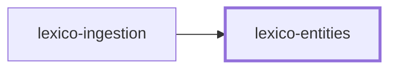
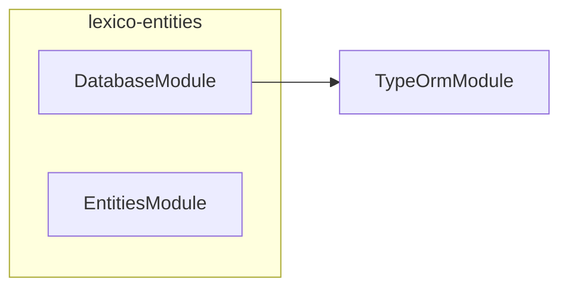

# 📖 Lexico Entities

**The dictionary's shape.** TypeORM entities, PostgreSQL migrations, and the
shared enumerations for [Lexico](../../applications/lexico/README.md).

This package is the single definition of what a Latin word _is_ in this suite.
[lexico-ingestion](../../applications/lexico-ingestion/README.md) writes
through these entities, and the web application reads through them, so neither
carries its own idea of the schema.

## Usage

```ts
import { DatabaseModule, Lexeme, Word } from "@codebase/lexico-entities";
```

`DatabaseModule` configures the TypeORM connection; `lexicoDataSource` is the
same configuration as a standalone `DataSource`, which is what the migration
CLI runs against.

## The schema

### Dictionary

| Entity | Holds |
| ------ | ----- |
| `Word` | A headword — the form a reader looks up |
| `Lexeme` | A lexical entry, joined to words through `WordLexeme` |
| `Form` | One inflected form, joined to words through `WordForm` |
| `Inflection` | How a lexeme inflects |
| `PrincipalPart` | The principal parts a verb or noun is cited by |
| `Translation` | An English sense |
| `Pronunciation` | Classical and ecclesiastical variants |

`Form` and `Inflection` are both **single-table hierarchies**, because Latin
morphology does not fit one flat row. A form is an `AdjectivalForm`,
`AdverbForm`, `FiniteVerbForm`, `GerundForm`, `InfinitiveForm`, `NominalForm`,
`ParticipleForm`, or `SupineForm`; an inflection is an `AdjectiveInflection`,
`AdverbInflection`, `NounInflection`, `PrepositionInflection`,
`VerbInflection`, or `UninflectedInflection`.

### Literature

| Entity | Holds |
| ------ | ----- |
| `Author` | A classical author |
| `Text` | One work |
| `Line` | A line of that work |
| `Token` | One word occurrence, linking a line back to the dictionary |

### Base classes

`IdentifiableEntity`, `CreatableEntity`, `UpdatableEntity`, `DeletableEntity`,
and `AuditableEntity` supply the id and timestamp columns, so no entity
restates them.

## Grammatical enumerations

Every grammatical axis is exported both as a runtime value array and as a
union type — `formCaseValues` / `FormCase`, `verbConjugationValues` /
`VerbConjugation`, and so on for gender, number, person, tense, mood, voice,
degree, and declension. Validation, GraphQL enums, and exhaustive switches all
read from the same source.

`LexicoNamingStrategy` maps entity and column names to the database's own
convention, so table names stay predictable across migrations.

## Migrations

```bash
nx run lexico-entities:migration:generate           # Diff entities → new migration
nx run lexico-entities:migration:run                # Apply pending migrations
nx run lexico-entities:migration:revert             # Roll back the last one
nx run lexico-entities:migration:show               # List applied and pending
nx run lexico-entities:migration:extract-sql-all    # Emit .sql alongside each migration
```

`generate` also extracts the SQL and formats the result, so a generated
migration lands ready to review. Every migration ships a `-up.sql` and
`-down.sql` next to its TypeScript, which is what makes a schema change
readable in a diff — those files are linted by `sqlfluff` and checked by
`squawk` like any other SQL in the repository.

## Project Graph

Where this project sits in the Nx project graph: what it depends on, and what depends on it. Regenerated by `nx run synchronization:synchronize --configuration=write`.

<!-- nx-project-graph-start -->



<!-- nx-project-graph-end -->

## Module Graph

The modules this project defines and the imports between them, regenerated by `nx run synchronization:synchronize --configuration=write`.

<!-- nestjs-module-graph-start -->



<!-- nestjs-module-graph-end -->

## Testing

```bash
nx run lexico-entities:vitest:unit
nx run lexico-entities:vitest:integration   # Against a Testcontainers PostgreSQL
```

Integration tests spin up a real PostgreSQL through
`@testcontainers/postgresql`, so entity mappings are verified against the
database rather than against a mock.

## Related

- 🐺 [lexico](../../applications/lexico/README.md) — the web application
- 🚰 [lexico-ingestion](../../applications/lexico-ingestion/README.md) — fills these tables
- 🎨 [lexico-components](../lexico-components/README.md) — the interface

## License

MIT — see [LICENSE](../../LICENSE).

<!-- CALL_STACKS_START -->

## 🔭 Callidescope

Call stacks traced through `lexico-entities`, deepest first. Each frame shows what it takes, what it returns, and what its documentation says.

| Measure | Value |
| --- | --- |
| Callables | 93 |
| Files | 46 |
| Calls traced | 9 |
| Call stacks | 3 |
| Deepest stack | 3 |
| Stacks through recursion | 0 |
| Unfollowable calls | 1 |

### Call stacks

**1. `main`** — depth 3 · orphan-root

```text
🚀 main(): Promise<void> [packages/lexico-entities/scripts/extract-migration-sql.ts:164]
   ↳ Main.
  └─> parseMode(): Mode [packages/lexico-entities/scripts/extract-migration-sql.ts:188]
     ↳ Parse mode.
    └─> find(…)(argument: string): boolean [packages/lexico-entities/scripts/extract-migration-sql.ts:189]
```

**2. `visit`** — depth 2 · orphan-root

```text
🚀 visit(node: ts.Node): void [packages/lexico-entities/scripts/extract-migration-sql.ts:66]
   ↳ Visit.
  └─> extractSqlFromLiteral(argument: ts.Expression, sourceFile: ts.SourceFile): string | undefined [packages/lexico-entities/scripts/extract-migration-sql.ts:37]
     ↳ Extract sql from literal.
```

**3. `visit`** — depth 2 · orphan-root

```text
🚀 visit(node: ts.Node): void [packages/lexico-entities/scripts/extract-migration-sql.ts:113]
   ↳ Visit.
  └─> extractSqlFromMethod(method: ts.MethodDeclaration, sourceFile: ts.SourceFile): string[] [packages/lexico-entities/scripts/extract-migration-sql.ts:57]
     ↳ Extract sql from method.
```

### Module spread

None.

### Possibly misplaced

None.
<!-- CALL_STACKS_END -->
