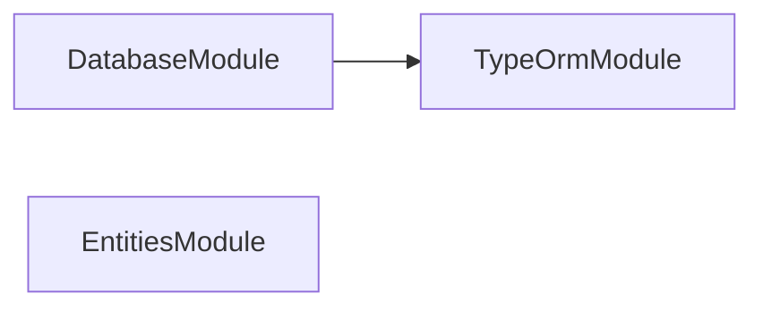

# 📖 Lexico Entities

**The dictionary's shape.** TypeORM entities, PostgreSQL migrations, and the
shared enumerations for [Lexico](../../applications/lexico/README.md).

This package is the single definition of what a Latin word _is_ in this suite.
[lexico-ingestion](../../applications/lexico-ingestion/README.md) writes
through these entities, and the web application reads through them, so neither
carries its own idea of the schema.

## Usage

```ts
import { DatabaseModule, Lexeme, Word } from "@codebase/lexico-entities";
```

`DatabaseModule` configures the TypeORM connection; `lexicoDataSource` is the
same configuration as a standalone `DataSource`, which is what the migration
CLI runs against.

## The schema

### Dictionary

| Entity | Holds |
| ------ | ----- |
| `Word` | A headword — the form a reader looks up |
| `Lexeme` | A lexical entry, joined to words through `WordLexeme` |
| `Form` | One inflected form, joined to words through `WordForm` |
| `Inflection` | How a lexeme inflects |
| `PrincipalPart` | The principal parts a verb or noun is cited by |
| `Translation` | An English sense |
| `Pronunciation` | Classical and ecclesiastical variants |

`Form` and `Inflection` are both **single-table hierarchies**, because Latin
morphology does not fit one flat row. A form is an `AdjectivalForm`,
`AdverbForm`, `FiniteVerbForm`, `GerundForm`, `InfinitiveForm`, `NominalForm`,
`ParticipleForm`, or `SupineForm`; an inflection is an `AdjectiveInflection`,
`AdverbInflection`, `NounInflection`, `PrepositionInflection`,
`VerbInflection`, or `UninflectedInflection`.

### Literature

| Entity | Holds |
| ------ | ----- |
| `Author` | A classical author |
| `Text` | One work |
| `Line` | A line of that work |
| `Token` | One word occurrence, linking a line back to the dictionary |

### Base classes

`IdentifiableEntity`, `CreatableEntity`, `UpdatableEntity`, `DeletableEntity`,
and `AuditableEntity` supply the id and timestamp columns, so no entity
restates them.

## Grammatical enumerations

Every grammatical axis is exported both as a runtime value array and as a
union type — `formCaseValues` / `FormCase`, `verbConjugationValues` /
`VerbConjugation`, and so on for gender, number, person, tense, mood, voice,
degree, and declension. Validation, GraphQL enums, and exhaustive switches all
read from the same source.

`LexicoNamingStrategy` maps entity and column names to the database's own
convention, so table names stay predictable across migrations.

## Migrations

```bash
nx run lexico-entities:migration:generate           # Diff entities → new migration
nx run lexico-entities:migration:run                # Apply pending migrations
nx run lexico-entities:migration:revert             # Roll back the last one
nx run lexico-entities:migration:show               # List applied and pending
nx run lexico-entities:migration:extract-sql-all    # Emit .sql alongside each migration
```

`generate` also extracts the SQL and formats the result, so a generated
migration lands ready to review. Every migration ships a `-up.sql` and
`-down.sql` next to its TypeScript, which is what makes a schema change
readable in a diff — those files are linted by `sqlfluff` and checked by
`squawk` like any other SQL in the repository.

## Testing

```bash
nx run lexico-entities:vitest:unit
nx run lexico-entities:vitest:integration   # Against a Testcontainers PostgreSQL
```

Integration tests spin up a real PostgreSQL through
`@testcontainers/postgresql`, so entity mappings are verified against the
database rather than against a mock.

## Related

- 🐺 [lexico](../../applications/lexico/README.md) — the web application
- 🚰 [lexico-ingestion](../../applications/lexico-ingestion/README.md) — fills these tables
- 🎨 [lexico-components](../lexico-components/README.md) — the interface

## License

MIT — see [LICENSE](../../LICENSE).

<!-- CALL_STACKS_START -->

## 🔭 Callidescope

Call stacks traced through `packages/lexico-entities`, deepest first. Each frame shows what it takes, what it returns, and what its documentation says.

| Measure | Value |
| --- | --- |
| Callables | 93 |
| Files | 47 |
| Calls traced | 9 |
| Call stacks | 3 |
| Deepest stack | 3 |
| Stacks through recursion | 0 |
| Unfollowable calls | 1 |

### Call stacks (depth)

**1. `main`** — depth 3 · orphan-root

```text
🚀 main(): Promise<void> [packages/lexico-entities/scripts/extract-migration-sql.ts:164]
   ↳ Main.
  └─> parseMode(): Mode [packages/lexico-entities/scripts/extract-migration-sql.ts:188]
     ↳ Parse mode.
    └─> find(…)(argument: string): boolean [packages/lexico-entities/scripts/extract-migration-sql.ts:189]
```

**2. `visit`** — depth 2 · orphan-root

```text
🚀 visit(node: ts.Node): void [packages/lexico-entities/scripts/extract-migration-sql.ts:66]
   ↳ Visit.
  └─> extractSqlFromLiteral(argument: ts.Expression, sourceFile: ts.SourceFile): string | undefined [packages/lexico-entities/scripts/extract-migration-sql.ts:37]
     ↳ Extract sql from literal.
```

**3. `visit`** — depth 2 · orphan-root

```text
🚀 visit(node: ts.Node): void [packages/lexico-entities/scripts/extract-migration-sql.ts:113]
   ↳ Visit.
  └─> extractSqlFromMethod(method: ts.MethodDeclaration, sourceFile: ts.SourceFile): string[] [packages/lexico-entities/scripts/extract-migration-sql.ts:57]
     ↳ Extract sql from method.
```

### Module spread

None.

### Breadth

| Callable | Breadth | Calls directly | Location |
| --- | --- | --- | --- |
| `main` | 3 | `parseMode`, `findMigrationFiles`, `processMigrationFile` | `packages/lexico-entities/scripts/extract-migration-sql.ts:164` |
| `findMigrationFiles` | 2 | `filter(…)`, `map(…)` | `packages/lexico-entities/scripts/extract-migration-sql.ts:142` |
| `visit` | 1 | `extractSqlFromLiteral` | `packages/lexico-entities/scripts/extract-migration-sql.ts:66` |

<details>
<summary>3 more callables</summary>

| Callable | Breadth | Calls directly | Location |
| --- | --- | --- | --- |
| `visit` | 1 | `extractSqlFromMethod` | `packages/lexico-entities/scripts/extract-migration-sql.ts:113` |
| `parseMode` | 1 | `find(…)` | `packages/lexico-entities/scripts/extract-migration-sql.ts:188` |
| `processMigrationFile` | 1 | `extractSqlFromMigration` | `packages/lexico-entities/scripts/extract-migration-sql.ts:198` |

</details>

### Possibly misplaced

None.
<!-- CALL_STACKS_END -->

## 🕸️ Codependix

Dependency graphs exported by [codependix](https://github.com/JimmyPaolini/codebase/tree/main/packages/codependix-cli), regenerated by `nx run codebase:codependix:write`.

### Nx Neighborhood

<!-- codependix:start name="codependix-nx" -->

<!-- codependix:end name="codependix-nx" -->

### NestJS Module Graph

<!-- codependix:start name="codependix-nestjs" -->

<!-- codependix:end name="codependix-nestjs" -->

### File Imports

<!-- codependix:start name="codependix-imports" -->
```mermaid
graph LR
  file_codometer_config_ts["codometer.config.ts"]
  file_eslint_config_ts["eslint.config.ts"]
  file_scripts_extract_migration_sql_ts["scripts/extract-migration-sql.ts"]
  file_src_index_ts["src/index.ts"]
  file_src_modules_database_data_source_constants_ts["src/modules/database/data-source.constants.ts"]
  file_src_modules_database_data_source_constants_unit_test_ts["src/modules/database/data-source.constants.unit.test.ts"]
  file_src_modules_database_data_source_utilities_unit_test_ts["src/modules/database/data-source.utilities.unit.test.ts"]
  file_src_modules_database_database_constants_ts["src/modules/database/database.constants.ts"]
  file_src_modules_database_database_module_ts["src/modules/database/database.module.ts"]
  file_src_modules_database_database_service_ts["src/modules/database/database.service.ts"]
  file_src_modules_database_database_service_unit_test_ts["src/modules/database/database.service.unit.test.ts"]
  file_src_modules_database_database_types_ts["src/modules/database/database.types.ts"]
  file_src_modules_database_migrations_1781126991393_migration_ts["src/modules/database/migrations/1781126991393-migration.ts"]
  file_src_modules_entities_base_Auditable_entity_ts["src/modules/entities/base/Auditable.entity.ts"]
  file_src_modules_entities_base_Creatable_entity_ts["src/modules/entities/base/Creatable.entity.ts"]
  file_src_modules_entities_base_Deletable_entity_ts["src/modules/entities/base/Deletable.entity.ts"]
  file_src_modules_entities_base_Identifiable_entity_ts["src/modules/entities/base/Identifiable.entity.ts"]
  file_src_modules_entities_base_Updatable_entity_ts["src/modules/entities/base/Updatable.entity.ts"]
  file_src_modules_entities_dictionary_form_AdjectivalForm_entity_ts["src/modules/entities/dictionary/form/AdjectivalForm.entity.ts"]
  file_src_modules_entities_dictionary_form_AdverbForm_entity_ts["src/modules/entities/dictionary/form/AdverbForm.entity.ts"]
  file_src_modules_entities_dictionary_form_FiniteVerbForm_entity_ts["src/modules/entities/dictionary/form/FiniteVerbForm.entity.ts"]
  file_src_modules_entities_dictionary_form_Form_entity_ts["src/modules/entities/dictionary/form/Form.entity.ts"]
  file_src_modules_entities_dictionary_form_GerundForm_entity_ts["src/modules/entities/dictionary/form/GerundForm.entity.ts"]
  file_src_modules_entities_dictionary_form_InfinitiveForm_entity_ts["src/modules/entities/dictionary/form/InfinitiveForm.entity.ts"]
  file_src_modules_entities_dictionary_form_NominalForm_entity_ts["src/modules/entities/dictionary/form/NominalForm.entity.ts"]
  file_src_modules_entities_dictionary_form_ParticipleForm_entity_ts["src/modules/entities/dictionary/form/ParticipleForm.entity.ts"]
  file_src_modules_entities_dictionary_form_SupineForm_entity_ts["src/modules/entities/dictionary/form/SupineForm.entity.ts"]
  file_src_modules_entities_dictionary_inflection_AdjectiveInflection_entity_ts["src/modules/entities/dictionary/inflection/AdjectiveInflection.entity.ts"]
  file_src_modules_entities_dictionary_inflection_AdverbInflection_entity_ts["src/modules/entities/dictionary/inflection/AdverbInflection.entity.ts"]
  file_src_modules_entities_dictionary_inflection_Inflection_entity_ts["src/modules/entities/dictionary/inflection/Inflection.entity.ts"]
  file_src_modules_entities_dictionary_inflection_NounInflection_entity_ts["src/modules/entities/dictionary/inflection/NounInflection.entity.ts"]
  file_src_modules_entities_dictionary_inflection_PrepositionInflection_entity_ts["src/modules/entities/dictionary/inflection/PrepositionInflection.entity.ts"]
  file_src_modules_entities_dictionary_inflection_Uninflected_entity_ts["src/modules/entities/dictionary/inflection/Uninflected.entity.ts"]
  file_src_modules_entities_dictionary_inflection_VerbInflection_entity_ts["src/modules/entities/dictionary/inflection/VerbInflection.entity.ts"]
  file_src_modules_entities_dictionary_Lexeme_entity_ts["src/modules/entities/dictionary/Lexeme.entity.ts"]
  file_src_modules_entities_dictionary_PartOfSpeech_entity_ts["src/modules/entities/dictionary/PartOfSpeech.entity.ts"]
  file_src_modules_entities_dictionary_PrincipalPart_entity_ts["src/modules/entities/dictionary/PrincipalPart.entity.ts"]
  file_src_modules_entities_dictionary_Pronunciation_entity_ts["src/modules/entities/dictionary/Pronunciation.entity.ts"]
  file_src_modules_entities_dictionary_Translation_entity_ts["src/modules/entities/dictionary/Translation.entity.ts"]
  file_src_modules_entities_dictionary_Word_entity_ts["src/modules/entities/dictionary/Word.entity.ts"]
  file_src_modules_entities_dictionary_WordForm_entity_ts["src/modules/entities/dictionary/WordForm.entity.ts"]
  file_src_modules_entities_dictionary_WordLexeme_entity_ts["src/modules/entities/dictionary/WordLexeme.entity.ts"]
  file_src_modules_entities_entities_constants_ts["src/modules/entities/entities.constants.ts"]
  file_src_modules_entities_entities_module_ts["src/modules/entities/entities.module.ts"]
  file_src_modules_entities_entities_service_integration_test_ts["src/modules/entities/entities.service.integration.test.ts"]
  file_src_modules_entities_entities_service_ts["src/modules/entities/entities.service.ts"]
  file_src_modules_entities_entities_service_unit_test_ts["src/modules/entities/entities.service.unit.test.ts"]
  file_src_modules_entities_entities_types_ts["src/modules/entities/entities.types.ts"]
  file_src_modules_entities_literature_Author_entity_ts["src/modules/entities/literature/Author.entity.ts"]
  file_src_modules_entities_literature_Line_entity_ts["src/modules/entities/literature/Line.entity.ts"]
  file_src_modules_entities_literature_Text_entity_ts["src/modules/entities/literature/Text.entity.ts"]
  file_src_modules_entities_literature_Token_entity_ts["src/modules/entities/literature/Token.entity.ts"]
  file_testing_entity_definition_assertions_ts["testing/entity-definition-assertions.ts"]
  file_testing_integration_test_data_source_ts["testing/integration-test-data-source.ts"]
  file_testing_setup_ts["testing/setup.ts"]
  file_vitest_config_ts["vitest.config.ts"]
  file_src_modules_database_data_source_constants_ts --> file_src_modules_database_database_constants_ts
  file_src_modules_database_data_source_constants_ts --> file_src_modules_entities_dictionary_form_AdjectivalForm_entity_ts
  file_src_modules_database_data_source_constants_ts --> file_src_modules_entities_dictionary_form_AdverbForm_entity_ts
  file_src_modules_database_data_source_constants_ts --> file_src_modules_entities_dictionary_form_FiniteVerbForm_entity_ts
  file_src_modules_database_data_source_constants_ts --> file_src_modules_entities_dictionary_form_Form_entity_ts
  file_src_modules_database_data_source_constants_ts --> file_src_modules_entities_dictionary_form_GerundForm_entity_ts
  file_src_modules_database_data_source_constants_ts --> file_src_modules_entities_dictionary_form_InfinitiveForm_entity_ts
  file_src_modules_database_data_source_constants_ts --> file_src_modules_entities_dictionary_form_NominalForm_entity_ts
  file_src_modules_database_data_source_constants_ts --> file_src_modules_entities_dictionary_form_ParticipleForm_entity_ts
  file_src_modules_database_data_source_constants_ts --> file_src_modules_entities_dictionary_form_SupineForm_entity_ts
  file_src_modules_database_data_source_constants_ts --> file_src_modules_entities_dictionary_inflection_AdjectiveInflection_entity_ts
  file_src_modules_database_data_source_constants_ts --> file_src_modules_entities_dictionary_inflection_AdverbInflection_entity_ts
  file_src_modules_database_data_source_constants_ts --> file_src_modules_entities_dictionary_inflection_Inflection_entity_ts
  file_src_modules_database_data_source_constants_ts --> file_src_modules_entities_dictionary_inflection_NounInflection_entity_ts
  file_src_modules_database_data_source_constants_ts --> file_src_modules_entities_dictionary_inflection_PrepositionInflection_entity_ts
  file_src_modules_database_data_source_constants_ts --> file_src_modules_entities_dictionary_inflection_Uninflected_entity_ts
  file_src_modules_database_data_source_constants_ts --> file_src_modules_entities_dictionary_inflection_VerbInflection_entity_ts
  file_src_modules_database_data_source_constants_ts --> file_src_modules_entities_dictionary_Lexeme_entity_ts
  file_src_modules_database_data_source_constants_ts --> file_src_modules_entities_dictionary_PrincipalPart_entity_ts
  file_src_modules_database_data_source_constants_ts --> file_src_modules_entities_dictionary_Pronunciation_entity_ts
  file_src_modules_database_data_source_constants_ts --> file_src_modules_entities_dictionary_Translation_entity_ts
  file_src_modules_database_data_source_constants_ts --> file_src_modules_entities_dictionary_Word_entity_ts
  file_src_modules_database_data_source_constants_ts --> file_src_modules_entities_dictionary_WordForm_entity_ts
  file_src_modules_database_data_source_constants_ts --> file_src_modules_entities_dictionary_WordLexeme_entity_ts
  file_src_modules_database_data_source_constants_ts --> file_src_modules_entities_literature_Author_entity_ts
  file_src_modules_database_data_source_constants_ts --> file_src_modules_entities_literature_Line_entity_ts
  file_src_modules_database_data_source_constants_ts --> file_src_modules_entities_literature_Text_entity_ts
  file_src_modules_database_data_source_constants_ts --> file_src_modules_entities_literature_Token_entity_ts
  file_src_modules_database_database_module_ts --> file_src_modules_database_data_source_constants_ts
  file_src_modules_database_database_module_ts --> file_src_modules_database_database_constants_ts
  file_src_modules_database_database_module_ts --> file_src_modules_database_database_service_ts
  file_src_modules_database_database_service_unit_test_ts --> file_src_modules_database_database_service_ts
  file_src_modules_entities_base_Auditable_entity_ts --> file_src_modules_entities_base_Deletable_entity_ts
  file_src_modules_entities_base_Creatable_entity_ts --> file_src_modules_entities_base_Identifiable_entity_ts
  file_src_modules_entities_base_Deletable_entity_ts --> file_src_modules_entities_base_Updatable_entity_ts
  file_src_modules_entities_base_Updatable_entity_ts --> file_src_modules_entities_base_Creatable_entity_ts
  file_src_modules_entities_dictionary_form_AdjectivalForm_entity_ts --> file_src_modules_database_database_constants_ts
  file_src_modules_entities_dictionary_form_AdjectivalForm_entity_ts --> file_src_modules_entities_dictionary_form_Form_entity_ts
  file_src_modules_entities_dictionary_form_AdverbForm_entity_ts --> file_src_modules_database_database_constants_ts
  file_src_modules_entities_dictionary_form_AdverbForm_entity_ts --> file_src_modules_entities_dictionary_form_Form_entity_ts
  file_src_modules_entities_dictionary_form_FiniteVerbForm_entity_ts --> file_src_modules_database_database_constants_ts
  file_src_modules_entities_dictionary_form_FiniteVerbForm_entity_ts --> file_src_modules_entities_dictionary_form_Form_entity_ts
  file_src_modules_entities_dictionary_form_Form_entity_ts --> file_src_modules_entities_base_Auditable_entity_ts
  file_src_modules_entities_dictionary_form_Form_entity_ts --> file_src_modules_entities_dictionary_Lexeme_entity_ts
  file_src_modules_entities_dictionary_form_Form_entity_ts --> file_src_modules_entities_dictionary_WordForm_entity_ts
  file_src_modules_entities_dictionary_form_GerundForm_entity_ts --> file_src_modules_database_database_constants_ts
  file_src_modules_entities_dictionary_form_GerundForm_entity_ts --> file_src_modules_entities_dictionary_form_Form_entity_ts
  file_src_modules_entities_dictionary_form_InfinitiveForm_entity_ts --> file_src_modules_database_database_constants_ts
  file_src_modules_entities_dictionary_form_InfinitiveForm_entity_ts --> file_src_modules_entities_dictionary_form_Form_entity_ts
  file_src_modules_entities_dictionary_form_NominalForm_entity_ts --> file_src_modules_database_database_constants_ts
  file_src_modules_entities_dictionary_form_NominalForm_entity_ts --> file_src_modules_entities_dictionary_form_Form_entity_ts
  file_src_modules_entities_dictionary_form_ParticipleForm_entity_ts --> file_src_modules_database_database_constants_ts
  file_src_modules_entities_dictionary_form_ParticipleForm_entity_ts --> file_src_modules_entities_dictionary_form_Form_entity_ts
  file_src_modules_entities_dictionary_form_SupineForm_entity_ts --> file_src_modules_database_database_constants_ts
  file_src_modules_entities_dictionary_form_SupineForm_entity_ts --> file_src_modules_entities_dictionary_form_Form_entity_ts
  file_src_modules_entities_dictionary_inflection_AdjectiveInflection_entity_ts --> file_src_modules_database_database_constants_ts
  file_src_modules_entities_dictionary_inflection_AdjectiveInflection_entity_ts --> file_src_modules_entities_dictionary_inflection_Inflection_entity_ts
  file_src_modules_entities_dictionary_inflection_AdverbInflection_entity_ts --> file_src_modules_database_database_constants_ts
  file_src_modules_entities_dictionary_inflection_AdverbInflection_entity_ts --> file_src_modules_entities_dictionary_inflection_Inflection_entity_ts
  file_src_modules_entities_dictionary_inflection_Inflection_entity_ts --> file_src_modules_entities_dictionary_Lexeme_entity_ts
  file_src_modules_entities_dictionary_inflection_NounInflection_entity_ts --> file_src_modules_database_database_constants_ts
  file_src_modules_entities_dictionary_inflection_NounInflection_entity_ts --> file_src_modules_entities_dictionary_inflection_Inflection_entity_ts
  file_src_modules_entities_dictionary_inflection_PrepositionInflection_entity_ts --> file_src_modules_database_database_constants_ts
  file_src_modules_entities_dictionary_inflection_PrepositionInflection_entity_ts --> file_src_modules_entities_dictionary_inflection_Inflection_entity_ts
  file_src_modules_entities_dictionary_inflection_Uninflected_entity_ts --> file_src_modules_entities_dictionary_inflection_Inflection_entity_ts
  file_src_modules_entities_dictionary_inflection_VerbInflection_entity_ts --> file_src_modules_database_database_constants_ts
  file_src_modules_entities_dictionary_inflection_VerbInflection_entity_ts --> file_src_modules_entities_dictionary_inflection_Inflection_entity_ts
  file_src_modules_entities_dictionary_Lexeme_entity_ts --> file_src_modules_entities_base_Auditable_entity_ts
  file_src_modules_entities_dictionary_Lexeme_entity_ts --> file_src_modules_entities_dictionary_form_Form_entity_ts
  file_src_modules_entities_dictionary_Lexeme_entity_ts --> file_src_modules_entities_dictionary_inflection_Inflection_entity_ts
  file_src_modules_entities_dictionary_Lexeme_entity_ts --> file_src_modules_entities_dictionary_PartOfSpeech_entity_ts
  file_src_modules_entities_dictionary_Lexeme_entity_ts --> file_src_modules_entities_dictionary_PrincipalPart_entity_ts
  file_src_modules_entities_dictionary_Lexeme_entity_ts --> file_src_modules_entities_dictionary_Pronunciation_entity_ts
  file_src_modules_entities_dictionary_Lexeme_entity_ts --> file_src_modules_entities_dictionary_Translation_entity_ts
  file_src_modules_entities_dictionary_Lexeme_entity_ts --> file_src_modules_entities_dictionary_WordLexeme_entity_ts
  file_src_modules_entities_dictionary_PrincipalPart_entity_ts --> file_src_modules_entities_base_Auditable_entity_ts
  file_src_modules_entities_dictionary_PrincipalPart_entity_ts --> file_src_modules_entities_dictionary_Lexeme_entity_ts
  file_src_modules_entities_dictionary_Pronunciation_entity_ts --> file_src_modules_entities_base_Auditable_entity_ts
  file_src_modules_entities_dictionary_Pronunciation_entity_ts --> file_src_modules_entities_dictionary_Lexeme_entity_ts
  file_src_modules_entities_dictionary_Translation_entity_ts --> file_src_modules_entities_base_Auditable_entity_ts
  file_src_modules_entities_dictionary_Translation_entity_ts --> file_src_modules_entities_dictionary_Lexeme_entity_ts
  file_src_modules_entities_dictionary_Word_entity_ts --> file_src_modules_entities_base_Auditable_entity_ts
  file_src_modules_entities_dictionary_Word_entity_ts --> file_src_modules_entities_dictionary_WordForm_entity_ts
  file_src_modules_entities_dictionary_Word_entity_ts --> file_src_modules_entities_dictionary_WordLexeme_entity_ts
  file_src_modules_entities_dictionary_WordForm_entity_ts --> file_src_modules_entities_base_Auditable_entity_ts
  file_src_modules_entities_dictionary_WordForm_entity_ts --> file_src_modules_entities_dictionary_form_Form_entity_ts
  file_src_modules_entities_dictionary_WordForm_entity_ts --> file_src_modules_entities_dictionary_Word_entity_ts
  file_src_modules_entities_dictionary_WordLexeme_entity_ts --> file_src_modules_entities_base_Auditable_entity_ts
  file_src_modules_entities_dictionary_WordLexeme_entity_ts --> file_src_modules_entities_dictionary_Lexeme_entity_ts
  file_src_modules_entities_dictionary_WordLexeme_entity_ts --> file_src_modules_entities_dictionary_Word_entity_ts
  file_src_modules_entities_entities_module_ts --> file_src_modules_entities_entities_service_ts
  file_src_modules_entities_entities_service_integration_test_ts --> file_testing_integration_test_data_source_ts
  file_src_modules_entities_entities_service_unit_test_ts --> file_src_modules_database_data_source_constants_ts
  file_src_modules_entities_entities_service_unit_test_ts --> file_src_modules_database_database_constants_ts
  file_src_modules_entities_entities_service_unit_test_ts --> file_src_modules_entities_dictionary_PartOfSpeech_entity_ts
  file_src_modules_entities_entities_service_unit_test_ts --> file_src_modules_entities_dictionary_Pronunciation_entity_ts
  file_src_modules_entities_entities_service_unit_test_ts --> file_src_modules_entities_entities_service_ts
  file_src_modules_entities_entities_service_unit_test_ts --> file_testing_entity_definition_assertions_ts
  file_src_modules_entities_literature_Author_entity_ts --> file_src_modules_entities_base_Auditable_entity_ts
  file_src_modules_entities_literature_Author_entity_ts --> file_src_modules_entities_literature_Text_entity_ts
  file_src_modules_entities_literature_Line_entity_ts --> file_src_modules_entities_base_Auditable_entity_ts
  file_src_modules_entities_literature_Line_entity_ts --> file_src_modules_entities_literature_Author_entity_ts
  file_src_modules_entities_literature_Line_entity_ts --> file_src_modules_entities_literature_Text_entity_ts
  file_src_modules_entities_literature_Line_entity_ts --> file_src_modules_entities_literature_Token_entity_ts
  file_src_modules_entities_literature_Text_entity_ts --> file_src_modules_entities_base_Auditable_entity_ts
  file_src_modules_entities_literature_Text_entity_ts --> file_src_modules_entities_literature_Author_entity_ts
  file_src_modules_entities_literature_Text_entity_ts --> file_src_modules_entities_literature_Line_entity_ts
  file_src_modules_entities_literature_Token_entity_ts --> file_src_modules_entities_base_Auditable_entity_ts
  file_src_modules_entities_literature_Token_entity_ts --> file_src_modules_entities_dictionary_Word_entity_ts
  file_src_modules_entities_literature_Token_entity_ts --> file_src_modules_entities_literature_Author_entity_ts
  file_src_modules_entities_literature_Token_entity_ts --> file_src_modules_entities_literature_Line_entity_ts
  file_src_modules_entities_literature_Token_entity_ts --> file_src_modules_entities_literature_Text_entity_ts
  file_testing_integration_test_data_source_ts --> file_src_modules_database_data_source_constants_ts
```
<!-- codependix:end name="codependix-imports" -->

<!-- CODE_STATISTICS_START -->

## ⏲️ Codometer

### Project


### Measured Targets


### TypeScript


### JavaScript


### Python


### JSON


### YAML


### TOML


### Shell


### SQL


### HCL


### CSS


### Conventions


### Jupyter


### Markdown


<!-- CODE_STATISTICS_END -->
